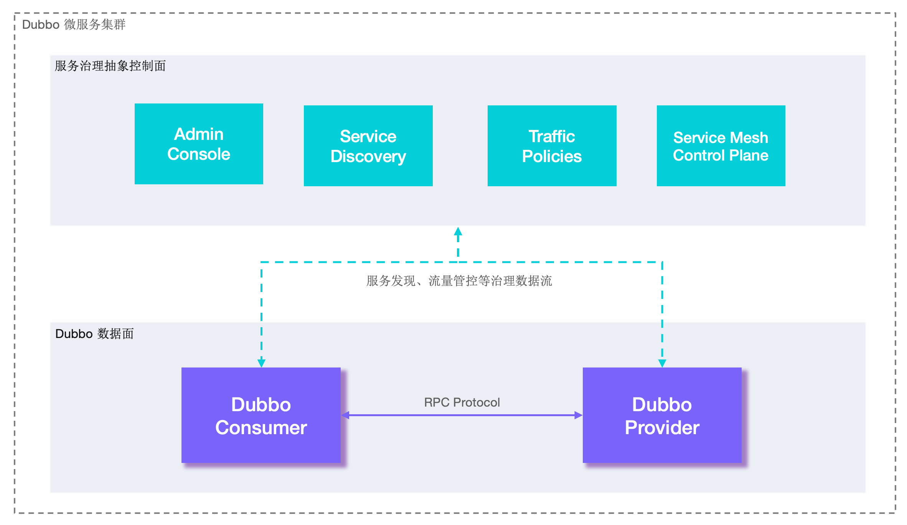

# Dubbo

## 前言

<br>

### 介绍

Apache Dubbo 是一款 RPC 服务开发框架，用于解决微服务架构下的服务治理与通信问题。

Dubbo 可以帮助解决如下微服务实践问题：

* **微服务编程范式和工具**，Dubbo 支持基于 IDL 或语言特定方式的服务定义，提供多种形式的服务调用形式（如同步、异步、流式等）
* **高性能的 RPC 通信**，Dubbo 帮助解决微服务组件之间的通信问题，提供了基于 HTTP、HTTP/2、TCP 等的多种高性能通信协议实现，并支持序列化协议扩展，在实现上解决网络连接管理、数据传输等基础问题
* **微服务监控与治理**，Dubbo 官方提供的服务发现、动态配置、负载均衡、流量路由等基础组件可以很好的帮助解决微服务基础实践的问题。除此之外，还可以用 Admin 控制台监控微服务状态，通过周边生态完成限流降级、数据一致性、链路追踪等能力。


> [Dubbo 生态](https://cn.dubbo.apache.org/zh-cn/overview/core-features/ecosystem/)


<br>

### 概念和架构



Dubbo 从抽象架构上分为两层：**服务治理抽象控制面** 和 **Dubbo 数据面** 。

* **服务治理控制面**。服务治理控制面不是特指如注册中心类的单个具体组件，而是对 Dubbo 治理体系的抽象表达。控制面包含协调服务发现的注册中心、流量管控策略、Dubbo Admin 控制台等，如果采用了 Service Mesh 架构则还包含 Istio 等服务网格控制面。
* **Dubbo 数据面**。数据面代表集群部署的所有 Dubbo 进程，进程之间通过 RPC 协议实现数据交换，Dubbo 定义了微服务应用开发与调用规范并负责完成数据传输的编解码工作。


<br>

## 简单使用

### nacos 准备

> 用作配置管理与服务注册/发现

[Nacos Spring Cloud 快速开始](https://nacos.io/zh-cn/docs/quick-start-spring-cloud.html)

### 项目初始化

**依赖**

```xml
<dependency>
    <groupId>org.apache.dubbo</groupId>
    <artifactId>dubbo-spring-boot-starter</artifactId>
</dependency>
```

**配置文件**

```yaml
dubbo:
  application:
    name: ${spring.application.name}
  protocol:
    name: dubbo
    port: -1
  registry:
    address: nacos://localhost:8848
    # Dubbo 3 版本以后，增加了是否注册消费者的参数 默认为 false
    # address: nacos://localhost:8848?register-consumer-url=true
```

**开启注解**

```java
@SpringBootApplication
@EnableDubbo
public class Provider8801Main {
    public static void main(String[] args) {
        SpringApplication.run(Provider8801Main.class, args);
    }
}
```

**API 模块**

```java
public interface ProviderApi {
    String str(String msg);
}
```

**服务提供者**

```java
@DubboService
public class ProviderApiImpl implements ProviderApi {
    @Override
    public String str(String msg) {
        return "dubbo provider" + msg;
    }
}
```

**服务消费者**

```java
@RestController
@RequestMapping("/consumer")
public class ConsumerController {

    @DubboReference
    private ProviderApi providerApi;

    @GetMapping("/str")
    public String str(@RequestParam String msg) {
        return providerApi.str(msg);
    }
}
```

<br>

## 进阶

<br>

### 负载均衡

Dubbo 提供了多种均衡策略，默认为 `weighted random` 基于权重的随机负载均衡策略。具体实现上，Dubbo 提供的是客户端负载均衡，由 Consumer 通过负载均衡算法得出需要将请求提交到哪个 Provider 实例。

**负载均衡策略**

| 算法                                                         | 特性                    | 备注                                                         |
| ------------------------------------------------------------ | ----------------------- | ------------------------------------------------------------ |
| Weighted Random                                              | 加权随机                | 默认算法，默认权重相同                                       |
| [RoundRobin](https://cn.dubbo.apache.org/zh-cn/overview/core-features/load-balance/#roundrobin) | 加权轮询                | 借鉴于 Nginx 的平滑加权轮询算法，默认权重相同                |
| LeastActive                                                  | 最少活跃优先 + 加权随机 | 能者多劳的思想                                               |
| Shortest-Response                                            | 最短响应优先 + 加权随机 | 更加关注响应速度，可能会造成流量过于集中于高性能节点的问题。 |
| [ConsistentHash](https://cn.dubbo.apache.org/zh-cn/overview/core-features/load-balance/#consistenthash) | 一致性哈希              | 确定的入参，确定的提供者，适用于有状态请求                   |

<br>

**自定义负载均衡算法**

在消费者端，继承 `org.apache.dubbo.rpc.cluster.loadbalance.AbstractLoadBalance` 自定义实现 `select()` 方法。

<br>

### 版本与分组

> 灰度发布

<br>

### 协议支持

* Dubbo
* Triple
* http REST
* gRPC
* Thrift
* RMI

<br>

> **RPC 协议的选择**
>
> 协议是 RPC 的核心，它规范了数据在网络中的传输内容和格式。除必须的请求、响应数据外，通常还会包含额外控制数据，如单次请求的序列化方式、超时时间、压缩方式和鉴权信息等。
>
> 协议的内容包含三部分
>
> * 数据交换格式：定义 RPC 的请求和响应对象在网络传输中的字节流内容，也叫作序列化方式
> * 协议结构：定义包含字段列表和各字段语义以及不同字段的排列方式
> * 协议通过定义规则、格式和语义来约定数据如何在网络间传输。一次成功的 RPC 需要通信的两端都能够按照协议约定进行网络字节流的读写和对象转换。

<br>

#### Dubbo

> [官方介绍](https://cn.dubbo.apache.org/zh-cn/overview/what/ecosystem/protocol/dubbo/)

采用单一长连接和 NIO 异步通讯，适合于小数据量大并发的服务调用，以及服务消费者机器数远大于服务提供者机器数的情况。不适合传送大数据量的服务，比如传文件，传视频等，除非请求量很低。

适用场景：常规远程服务方法调用，适合大并发小数据量的服务调用，服务消费者远大于服务提供者的情景。


* Transporter: mina/netty/grizzy
* Serialization: dubbo/hessian2/java/json
* 参数及返回值需实现 `Serializable` 接口
* 参数及返回值不能自定义实现 `List`, `Map`, `Number`, `Date`, `Calendar` 等接口，只能用 JDK 自带的实现，因为 hessian 会做特殊处理，自定义实现类中的属性值都会丢失。
* 接口增加方法，对客户端无影响，如果该方法不是客户端需要的，客户端不需要重新部署。输入参数和结果集中增加属性，对客户端无影响，如果客户端并不需要新属性，不用重新部署。
* 输入参数和结果集属性名变化，对客户端序列化无影响，但是如果客户端不重新部署，不管输入还是输出，属性名变化的属性值是获取不到的。

```xml
<dubbo:protocol name="dubbo" port="20880" /> <!-- 配置协议和端口 -->

<!-- 多端口 -->
<dubbo:protocol id="dubbo1" name="dubbo" port="20880" />
<dubbo:protocol id="dubbo2" name="dubbo" port="20881" />

<dubbo:service interface="..." protocol="dubbo" /> <!-- 配置某个接口使用 -->
```

<br>

#### Triple

> [官方介绍](https://cn.dubbo.apache.org/zh-cn/overview/what/ecosystem/protocol/triple/)

Triple 协议是 Dubbo3 推出的主力协议。Triple 意为第三代，通过 Dubbo1.0/ Dubbo2.0 两代协议的演进，以及云原生带来的技术标准化浪潮，Dubbo3 新协议 Triple 应运而生。

* 性能上，Triple 协议采取了 metadata 和 payload 分离的策略，这样就可以避免中间设备，如网关进行 payload 的解析和反序列化，从而降低响应时间。
* 路由支持上，由于 metadata 支持用户添加自定义 header，用户可以根据 header 更方便的划分集群或者进行路由，发布的时候切流灰度或容灾都有了更高的灵活性。
* 安全性上，支持双向 TLS 认证（mTLS）等加密传输能力。

<br>

#### http REST

* 基于标准的 Java REST API 实现的 REST 调用支持
* 提供通过 web 访问服务的简单方式，将服务与其他基于 web 的应用程序集成
* 支持 JSON、XML 和 Text 格式的请求和响应，发布和使用服务的便捷方式，也提供了服务版本控制、服务过滤、服务元数据和服务参数，实现 Dubbo 框架的灵活性和可伸缩性。

<br>

#### gRPC

* 基于 HTTP2 的协议足够简单，天然有 server push/ 多路复用 / 流量控制能力
* 基于 Protobuf 的多语言跨平台二进制兼容能力，提供强大的统一跨语言能力
* 从 Dubbo 3 开始，Dubbo 提供的 Triple 协议原生支持 gRPC 协议
* 对服务治理的支持比较基础，更偏向于基础的 RPC 功能，协议层缺少必要的统一定义，对于用户而言直接用起来并不容易。
* 强绑定 protobuf 的序列化方式

<br>

#### thrift

* [Thrift](http://thrift.apache.org/) 是 Facebook 捐给 Apache 的一个 RPC 框架。适用于 SOA 标准 RPC 框架
* dubbo `2.3.0` 以上版本对 thrift 原生协议的扩展，在原生协议的基础上添加了一些额外的头信息，比如 service name，magic number 等

<br>

#### RMI

* RMI 协议采用 JDK 标准的 `java.rmi.*` 实现，采用阻塞式短连接和 JDK 标准序列化方式

* 适用范围：传入传出参数数据包大小混合，消费者与提供者个数差不多，可传文件

* 适用场景：常规远程服务方法调用，与原生 RMI 服务互操作

* 参数及返回值需实现 `Serializable` 接口

* dubbo 配置中的超时时间对 RMI 无效。

  需使用 java 启动参数设置：`-Dsun.rmi.transport.tcp.responseTimeout=3000`


<br>

### 协议更改

#### 使用 http 协议

> [http demo](https://cn.dubbo.apache.org/zh-cn/overview/what/ecosystem/protocol/http/)

**定义接口**

```java
public class UserService {    
   void registerUser(User user);
}
```

**服务提供者**

```java
@Path("users") // 指定访问 UserService 的 URL 相对路径是 /users，http://localhost:8080/users
public class UserServiceImpl implements UserService {
       
  	// 指定访问 registerUser() 用 HTTP POST 方法
    @POST
    // 指定访问 registerUser() 方法的 URL 相对路径是 /register
  	// 结合上一个 @Path为UserService 指定的路径
  	// 调用 UserService.register() 的完整路径为 http://localhost:8080/users/register
    @Path("register") 
  	// 指定 registerUser() 接收 JSON 格式的数据
  	// REST 框架会自动将 JSON 数据反序列化为 User 对象
    @Consumes({MediaType.APPLICATION_JSON})
    public void registerUser(User user) {
        // save the user...
    }
}
```

**定义协议**

```xml
<!-- 用 rest 协议在8080端口暴露服务 -->
<dubbo:protocol name="rest" port="8080"/>

<!-- 声明需要暴露的服务接口 -->
<dubbo:service interface="xxx.UserService" ref="userService"/>

<!-- 和本地bean一样实现服务 -->
<bean id="userService" class="xxx.UserServiceImpl" />
```

<br>

#### 使用 Triple 协议

> [triple demo](https://cn.dubbo.apache.org/zh-cn/overview/what/ecosystem/protocol/triple/#%E4%BD%BF%E7%94%A8%E6%96%B9%E5%BC%8F---java)

<br>

#### 使用 gRPC 协议

> [gRPC demo](https://github.com/apache/dubbo-samples/tree/master/3-extensions/protocol/dubbo-samples-grpc)

<br>

#### 使用 thrift

> [thrift demo](https://cn.dubbo.apache.org/zh-cn/overview/what/ecosystem/protocol/thrift/#%E4%BD%BF%E7%94%A8%E6%96%B9%E5%BC%8F---java)

<br>

#### 使用 RMI

> [RMI demo](https://cn.dubbo.apache.org/zh-cn/overview/what/ecosystem/protocol/rmi/#%E4%BD%BF%E7%94%A8%E6%96%B9%E5%BC%8F---java)


<br>

### 序列化方式

* [Hessian](https://cn.dubbo.apache.org/zh-cn/overview/what/ecosystem/serialization/hessian/)，dubbo 默认序列化方式。是一种支持动态类型、跨语言、基于对象传输的网络协议。

  语言无关，支持脚本语言，Java 对象序列化的二进制流可以被其他语言。

  不依赖外部描述文件或者接口定义，用一个字节表示常用的基础类型，极大缩短二进制流。

* [Fastjson](https://cn.dubbo.apache.org/zh-cn/overview/what/ecosystem/serialization/fastjson/)

* [Fastjson2](https://cn.dubbo.apache.org/zh-cn/overview/what/ecosystem/serialization/fastjson2/)

* [protobuf](https://cn.dubbo.apache.org/zh-cn/overview/what/ecosystem/serialization/protobuf/)


### 注册中心

> [官方介绍](https://cn.dubbo.apache.org/zh-cn/overview/what/ecosystem/registry/)，支持 zookeeper/nacos/consul/eureka/polaris/sofa


### 配置中心

> [官方介绍](https://cn.dubbo.apache.org/zh-cn/overview/what/ecosystem/config-center/)，支持 zookeeper/nacos/apollo


### 元数据中心

> [官方介绍](https://cn.dubbo.apache.org/zh-cn/overview/what/ecosystem/metadata-center/)，支持 zookeeper/nacos/redis


<br>

## 参考

[dubbo doc](https://cn.dubbo.apache.org/zh-cn/overview/home/)
