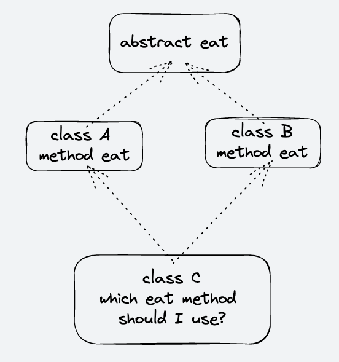

# Java 基础内容

<br>

## 数据类型

> 8 种 基本数据类型

| 类型    | 字节/Byte | 位/bit | 包装类   |
| ------- | --------- | ------ | -------- |
| byte    | 1         | 8      | Byte     |
| boolean | 1         | 8      | Boolean  |
| char    | 2         | 16     | Charater |
| shot    | 2         | 16     | Shot     |
| int     | 4         | 32     | Integer  |
| float   | 4         | 32     | Float    |
| long    | 8         | 64     | Long     |
| double  | 8         | 64     | Double   |

<br>

### 缓冲池

在 Java 中 `Boolean/Byte/Character/Integer/Short` 这几个包装类型都存在一个缓冲池，使用这些对应的包装类型时，满足条件（比如频繁读取的值）的值就会存放到缓冲池中，待下次直接从缓冲池中读取。

Java 中常见的包装类除 `Double/Float` 都存在缓冲池：

```java
// Boolean
// If a new Boolean instance is not required, this method should generally be used in preference to the constructor Boolean(boolean).
// this method is likely to yield significantly better space and time performance. 使用此方法获取 Boolean 对象比直接 new 一个 Boolean 对象的性能要好
public static Boolean valueOf(boolean b) {
    return (b ? TRUE : FALSE);
}
```

```java
// Byte
// If a new Byte instance is not required, this method should generally be used in preference to the constructor Byte(byte).
// this method is likely to yield significantly better space and time performance since all byte values are cached. 缓存所有传入的 byte 值
public static Byte valueOf(byte b) {
    final int offset = 128;
    return ByteCache.cache[(int)b + offset];
}
```

```java
// Character
// If a new Character instance is not required, this method should generally be used in preference to the constructor Character(char).
// this method is likely to yield significantly better space and time performance by caching frequently requested values. 缓存频繁使用的值
public static Character valueOf(char c) {
    if (c <= 127) { // must cache
        return CharacterCache.cache[(int)c];
    }
    return new Character(c);
}
```

```java
// Integer 缓存池的大小默认为 -128 ~ 127
// If a new Integer instance is not required, this method should generally be used in preference to the constructor Integer(int).
// this method is likely to yield significantly better space and time performance by caching frequently requested values. 缓存频繁使用的值
// This method will always cache values in the range -128 to 127, inclusive, and may cache other values outside of this range. 缓冲池中存在默认范围 -128 到 127
// cache 数组下标 0 开始，从 -128 开始存，一直到 127
public static Integer valueOf(int i) {
    if (i >= IntegerCache.low && i <= IntegerCache.high)
        return IntegerCache.cache[i + (-IntegerCache.low)];
    return new Integer(i);
}
```

```java
// Short
// If a new Short instance is not required, this method should generally be used in preference to the constructor Short(short).
// this method is likely to yield significantly better space and time performance by caching frequently requested values. // 缓存频繁使用的值
// This method will always cache values in the range -128 to 127, inclusive, and may cache other values outside of this range. 总是缓存 -128 到 127 之间的值，还可能缓存其他在这个范围内的值
public static Short valueOf(short s) {
    final int offset = 128;
    int sAsInt = s;
    if (sAsInt >= -128 && sAsInt <= 127) { // must cache
        return ShortCache.cache[sAsInt + offset];
    }
    return new Short(s);
}
```

```java
// Long
// If a new Long instance is not required, this method should generally be used in preference to the constructor Long(long)
// this method is likely to yield significantly better space and time performance by caching frequently requested values. Long 会缓存频繁请求的值
// Note that unlike the corresponding method in the Integer class, this method is not required to cache values within a particular range. 如果请求的值是 -128 到 127 之间会立即缓存，但是不会像 Integer 一开始就缓存范围内的值
public static Long valueOf(long l) {
  final int offset = 128;
  if (l >= -128 && l <= 127) { // will cache
      return LongCache.cache[(int)l + offset];
  }
  return new Long(l);
}
```

> ⚠️ 需要注意：即使存在缓冲池，但使用`new`关键字，依然会新建对象，而不是从缓冲池获取

<br>

### 赋值运算

```java
// 1.1 字面量属于 double 类型，不能直接将 1.1 直接赋值给 float 变量，因为这是向下转型。Java 不能隐式执行向下转型，因为这会使得精度降低。
// float f = 1.1; // 编辑器检查不通过

// 1.1f 字面量才是 float 类型
float f = 1.1f; // or 1.1F
```

<br>

### 类型转换

```java
// int to char
char c = 1 + '0';
System.out.println(c);
// char to int
int i = 49 - '0';
System.out.println(i);

// 进制转换
// 二进制
Integer.toBinaryString(n);
// 八进制
Integer.toOctalString(n);
// 十六进制
Integer.toHexString(n);
// 任意进制
Integer.toString(n, 32);
```

<br>

### 运算符

1、 **`+=`** 隐式类型转换

```java
short s1 = 1;
// s1 = s1 + 1;
// 因为字面量 1 是 int 类型，它比 short 类型精度要高，因此不能隐式地将 int 类型下转型为 short 类型

// 可以使用 += 运算符可以执行隐式类型转换
// += 运算将操作结果类型强制转换为等式左边的类型（持有结果的类型）
s1 += 1; // int to shot 相当于 s1 = (short) (s1 + 1);
```

2、 **`++`**

```java
// 只有一行的赋值操作，称为原子操作。原子操作是线程安全的
int j = 1;

i = 0;
// 虽然 ++ 操作只有一行，但是在将代码编译成字节码后，
// ++ 操作变成先读取变量 i，再进行 i + 1，最后将 i+1 赋值给变量 i，因此不是一个原子操作
i++;
System.out.println(i); // 1

// 非原子操作不是线程安全的操作
// 它涉及到多个指令，如读取变量值，增加，然后存储回内存，
// 这个过程可能会出现多个线程交差。还会存在竞态条件（读取 - 修改 - 写入）
```


<br>

### Boolean

在 Java 基本数据类型中，`boolean` 只有两种取值：`true`或`false`。理论上占用 1 字节，实际上：

1. 单个`boolean`类型变量在编译时使用的是`int`类型来表示，此时是 4 个字节；
2. 在`boolean`数组中，编译时作为`byte` 数组进行编译，此时数组中的每个`boolean`元素占 1 字节。


<br>

### String

#### 不可变性

`String`类被声明为`final`，因此它不可被继承。

```java
public final class String
    implements java.io.Serializable, Comparable<String>, CharSequence {
    /** The value is used for character storage. */
    private final char value[];

    /** Cache the hash code for the string */
    private int hash; // Default to 0
}
```

内部使用`char[]`存储数据，该数组被声明为`final`，这意味着 `value[]`初始化之后就不能再引用其它数组。并且`String`内部没有改变`value[]`数组的方法，因此可以保证`String` **不可变**。

<br>

**好处**

1. 安全性
   `String` 经常作为参数，`String` 不可变性可以保证参数不可变。例如：在作为网络连接参数的情况下，如果`String`是可变的，在网络连接过程中，如果 `String` 被改变，有可能会危害服务器安全。

2. 线程安全
   不可变性使得 `String` 天生具备线程安全性，可以在多个线程中安全地使用。

3. 可以缓存 hash 值
   因为 `String` 的 hash 值经常被使用，例如 `String` 用做 `HashMap` 的 key。不可变的特性可以使得 hash 值也不可变，只需要进行一次计算。

4. String Pool 的需要
   如果一个 `String` 对象已被创建过，就会从 String Pool 中获取。 `String` 只有是不可变的，才能从 String Pool 获取到。

<br>

#### AbstractStringBuilder

```java
// A mutable sequence of characters. Implements a modifiable string. 可变的字符串序列
// the length and content of the sequence can be changed through certain method calls. 字符串的长度和内容可以通过内置方法改变
// Unless otherwise noted, passing a null argument to a constructor or method in this class will cause a NullPointerException to be thrown. 构造方法传入 null 作为参数会引起 NullPointerException
abstract class AbstractStringBuilder implements Appendable, CharSequence {
    /**
     * The value is used for character storage.
     */
    char[] value;

    /**
     * The count is the number of characters used.
     */
    int count;

    /**
     * This no-arg constructor is necessary for serialization of subclasses.
     */
    AbstractStringBuilder() {
    }

    /**
     * Creates an AbstractStringBuilder of the specified capacity.
     */
    AbstractStringBuilder(int capacity) {
        value = new char[capacity];
    }

    // Appends the specified string to this character sequence.
    public AbstractStringBuilder append(String str) {
      if (str == null)
        return appendNull();
      int len = str.length();
      ensureCapacityInternal(count + len);
      str.getChars(0, len, value, count);
      count += len;
      return this;
    }

    // Documentation in subclasses because of synchro difference
    public AbstractStringBuilder append(StringBuffer sb) {
        if (sb == null)
            return appendNull();
        int len = sb.length();
        ensureCapacityInternal(count + len);
        sb.getChars(0, len, value, count);
        count += len;
        return this;
    }

    /**
     * @since 1.8
     */
    AbstractStringBuilder append(AbstractStringBuilder asb) {
        if (asb == null)
            return appendNull();
        int len = asb.length();
        ensureCapacityInternal(count + len);
        asb.getChars(0, len, value, count);
        count += len;
        return this;
    }

    private AbstractStringBuilder appendNull() {
      int c = count;
      ensureCapacityInternal(c + 4);
      final char[] value = this.value;
      value[c++] = 'n';
      value[c++] = 'u';
      value[c++] = 'l';
      value[c++] = 'l';
      count = c;
      return this;
    }
}
```

#### StringBuilder

```java
// A mutable sequence of characters.
// 可变字符序列
// This class provides an API compatible with StringBuffer, but with no guarantee of synchronization.
// 提供和 StringBuffer 相互兼容/一样的方法，但是不保证线程安全
// Instances of StringBuilder are not safe for use by multiple threads.
// 多线程情况下，StringBuilder 非线程安全
// This class is designed for use as a drop-in replacement for StringBuffer in places where the string buffer was being used by a single thread (as is generally the case).
// StringBuilder 在单线程下可用作 StringBuffer 的替代
// Where possible, it is recommended that this class be used in preference to StringBuffer as it will be faster under most implementations.
// 如果可能的话应该使用 StringBuilder 而不是 StringBuilder，因为 StringBuilder 中的方法都是非同步方法，具有更好的性能
// The principal operations on a StringBuilder are the append and insert methods, which are overloaded so as to accept data of any type.
// 最主要的两个方法是重写自 AbstractStringBuilder 的 append 和 insert 方法，它们可以接收任何一种类型的数据
// If the internal buffer overflows, it is automatically made larger.
// 容量不够时自动扩容
public final class StringBuilder
    extends AbstractStringBuilder
    implements java.io.Serializable, CharSequence
{

    /** use serialVersionUID for interoperability */
    static final long serialVersionUID = 4383685877147921099L;

    /**
     * Constructs a string builder with no characters in it and an
     * initial capacity of 16 characters.
     */
    public StringBuilder() {
        super(16);
    }

    /**
     * Constructs a string builder with no characters in it and an
     * initial capacity specified by the {@code capacity} argument.
     *
     * @param      capacity  the initial capacity.
     * @throws     NegativeArraySizeException  if the {@code capacity}
     *               argument is less than {@code 0}.
     */
    public StringBuilder(int capacity) {
        super(capacity);
    }

    /**
     * Constructs a string builder initialized to the contents of the
     * specified string. The initial capacity of the string builder is
     * {@code 16} plus the length of the string argument.
     *
     * @param   str   the initial contents of the buffer.
     */
    public StringBuilder(String str) {
        super(str.length() + 16);
          // 调用 AbstractStringBuilder 的 append 方法
        append(str);
    }

    /**
     * Constructs a string builder that contains the same characters
     * as the specified {@code CharSequence}. The initial capacity of
     * the string builder is {@code 16} plus the length of the
     * {@code CharSequence} argument.
     *
     * @param      seq   the sequence to copy.
     */
    public StringBuilder(CharSequence seq) {
        this(seq.length() + 16);
        append(seq);
    }

    @Override
    public StringBuilder append(String str) {
      super.append(str);
      return this;
    }
}
```

#### StringBuffer

```java
// A thread-safe, mutable sequence of characters.
// 一个线程安全的，可变的字符序列
// The methods are synchronized where necessary.
// 涉及到线程安全的方法都使用 synchronized 关键字来修饰
// this class synchronizes only on the string buffer performing the operation, not on the source
// 这个类中的同步方法作用在 string buffer 的操作步骤，而不是原先的 string
public final class StringBuffer
    extends AbstractStringBuilder
    implements java.io.Serializable, CharSequence
{

    /**
     * A cache of the last value returned by toString. Cleared
     * whenever the StringBuffer is modified.
     */
    private transient char[] toStringCache;

    /** use serialVersionUID from JDK 1.0.2 for interoperability */
    static final long serialVersionUID = 3388685877147921107L;

    /**
     * Constructs a string buffer with no characters in it and an
     * initial capacity of 16 characters.
     */
    public StringBuffer() {
        super(16);
    }

    /**
     * Constructs a string buffer with no characters in it and
     * the specified initial capacity.
     *
     * @param      capacity  the initial capacity.
     * @exception  NegativeArraySizeException  if the {@code capacity}
     *               argument is less than {@code 0}.
     */
    public StringBuffer(int capacity) {
        super(capacity);
    }

    /**
     * Constructs a string buffer initialized to the contents of the
     * specified string. The initial capacity of the string buffer is
     * {@code 16} plus the length of the string argument.
     *
     * @param   str   the initial contents of the buffer.
     */
    public StringBuffer(String str) {
        super(str.length() + 16);
        append(str);
    }

    /**
     * Constructs a string buffer that contains the same characters
     * as the specified {@code CharSequence}. The initial capacity of
     * the string buffer is {@code 16} plus the length of the
     * {@code CharSequence} argument.
     * <p>
     * If the length of the specified {@code CharSequence} is
     * less than or equal to zero, then an empty buffer of capacity
     * {@code 16} is returned.
     *
     * @param      seq   the sequence to copy.
     * @since 1.5
     */
    public StringBuffer(CharSequence seq) {
        this(seq.length() + 16);
        append(seq);
    }

     @Override
     public synchronized int length() {
       return count;
     }

     @Override
     public synchronized int capacity() {
       return value.length;
     }

}
```

<br>

**`String` 中的 `+` 操作**

> The Java language provides special support for the string concatenation operator ( + ), and for conversion of other objects to strings. String concatenation is implemented through the StringBuilder(or StringBuffer) class and its append method.

`String` 支持 `+` 级联操作，并且 `String` 中的级联操作 `+` 是通过 `StringBuilder` 或 `StringBuffer` 的`appned`方法实现的。

<br>

#### 字符常量池

JVM 的中有一个专门保存字符串的**字符常量池**，为了避免多次创建字符串对象，储存**不重复**的字符串。

<br>

**How it works**

- 创建字符串常量时，JVM 会检查字符串常量池中是否存在这个字符串;
- 若字符串常量池中存在该字符串，则直接返回引用实例；
- 若不存在，先实例化该字符串，并将该字符串放入字符串常量池中，以便下次直接取用。

<br>

**How to use**

- 直接使用双引号声明出来的 `String` 对象会直接存储在常量池中;
- 如果不是用双引号声明的 `String` 对象，可以使用 `String` 提供的 `intern` 方法。`intern` 方法会从字符串常量池中查询当前字符串是否存在，若不存在就会将当前字符串放入常量池中。

<br>

**`String.intern()`**

```java
// A pool of strings, initially empty, is maintained privately by the class String.
// When the intern method is invoked, if the pool already contains a string equal to this String object as determined by the equals(Object) method, then the string from the pool is returned.
// 如果常量池中已经存在该字符串，则直接返回常量池中该对象的引用
// Otherwise, this String object is added to the pool and a reference to this String object is returned.
// 否则在常量池中加入该对象，然后返回引用
public native String intern();
```

`intern` 是一个 `native` 方法，它能动态的将字符串加入到常量池中。使用 `intern` 可以保证相同内容的字符串变量始终引用同一个内存对象。

```java
// s1 和 s2 采用 new 新建两个不同对象
String s1 = new String("aaa");
String s2 = new String("aaa");
System.out.println(s1 == s2);           // false
// s3 是通过 intern方法取得一个对象引用
// intern 首先把 s1 引用的对象放到字符串常量池中，然后返回对象引用
String s3 = s1.intern();
// 因此 s3 和 s1 引用的是同一个字符串常量池的对象
System.out.println(s1.intern() == s3);  // true
```


**字符常量池位置**

在 JDK 1.7 之前，字符串常量池被放在**方法区** 中，此时实现是永久代（可以认为方法区是一个接口/规范，永久代是它的实现）。因为永久代的空间有限，在大量使用字符串的场景下会导致 OOM 错误。

JDK 1.7 及以后，**字符常量池移至了堆区**，字符串的创建也在堆区。为了节省开支 `intern` 不再是把该字符串直接加入字符常量池，而是将其地址引用放到字符常量池。

到了 JDK 1.8，JVM 使用元空间（MetaSpace）作为方法区的实现，来代替永久代。并将元空间从 JVM 内转移到本地内存上（容量取决于是 32 位或是 64 位操作系统的可用虚拟内存大小）。JDK 1.8 的字符串常量池还是放在在堆区，运行时常量池在方法区。


**`String` 新建的对象**

需要注意，使用 `new` 关键字，比如 `String a = new String("hello");` **可能**会创建两个对象。一个是字符常量池中的 `hello` 字符串，另一个是在堆中创建的新对象，新对象的引用指向字符常量池中的 `hello` 字符串，最终返回的是新创建的对象的地址。

```java
// 1、创建一个对象
// "aaa" 会直接在字符串常量池中创建
String s1 = "aaa";

// 2、创建两个对象，一个 StringBuilder，一个 String
// s1 + “is”, 因为此时编译器不知道 s1 是什么，而 String 是一个不可修改的类,
// 所以这里的 " + " 会被编译成(等同于)：
// String s2 = new StringBuilder("aaa").append("is").toString();
String s2 = s1 + "is";

// 3、创建两个对象
// s1.concat() 会新建一个 String 对象，因为 "great" 是双引号声明的，所以同样在字符常量池中创建一个"great"对象
s1.concat("great");
s2.concat(s1);

// concat 方法的实现
public String concat(String str) {
    int otherLen = str.length();
    if (otherLen == 0) {
        return this;
    }
    int len = value.length;
    char buf[] = Arrays.copyOf(value, len + otherLen);
    str.getChars(buf, len);
    return new String(buf, true); // 返回一个新的 String 对象
}

// 4、创建两个对象
// s1 += “country” 也就是 s1 = s1 + “country”，和第二个语句一样创建两个对象
s1 += "country";

// 5、创建一个对象
// 对于两个声明的字符串使用 "+" 拼接, 因为 JVM 的优化，会将拼接后的结果放入常量池
s3 = "aaa" + "bbb";

// StringBuilder 中 toString 方法的实现
@Override
public String toString() {
  // Create a copy, don't share the array
  return new String(value, 0, count);
}
```


<br>

### Object

> Class Object is the root of the class hierarchy. Every class has Object as a superclass. All objects, including arrays, implement the methods of this class.


**通用方法**

```java
public final native Class<?> getClass();

// [哈希碰撞](https://www.jianshu.com/p/379680144004)
public native int hashCode();

// 判断两个对象是否等价
// 1、对于基本类型，== 判断两个值是否相等，基本类型没有 equals 方法
// 2、对于引用类型，== 判断引用对象的地址是否相等，而 equals 判断引用的对象是否等价。等价的两个对象散列值一定相同，但是散列值相同的两个对象不一定等价。判断等价需要用到 hashCode 方法
// 3、如果没有对 equals 方法进行重写，调用的仍然是 Object 类中的方法，而 Object 类中的 equals 方法中是使用 == 来比较的
// 在重写 equals 方法时应当重写 hashCode 方法，保证等价的两个对象散列值相等
public boolean equals(Object obj) {
    return (this == obj);
}

/**
 * First, if the class of this object does not implement the interface Cloneable, then a CloneNotSupportedException is thrown
 * 重写 clone 方法的类必须实现 Cloneable 接口，否则使用 clone 的时候将会抛出 CloneNotSupportedException 异常
 * clone 方法并不是 Cloneable 接口的方法，而是 Object 的一个 protected 方法。Cloneable 接口只是规定。*
 */
protected native Object clone() throws CloneNotSupportedException;

public String toString() {
    return getClass().getName() + "@" + Integer.toHexString(hashCode());
}

public final native void notify();

public final native void notifyAll();

public final native void wait(long timeout) throws InterruptedException;

public final void wait(long timeout, int nanos) throws InterruptedException {}

public final void wait() throws InterruptedException {
    wait(0);
}

/**
 * Called by the garbage collector on an object when garbage collection determines that there are no more references to the object.
 * 当垃圾收集器认为当前对象为可回收时（没有其他对象引用），由垃圾收集器执行 finalize 方法
 * The finalize method may take any action, including making this object available again to other threads; the usual purpose of finalize, however, is to perform cleanup actions before the object is irrevocably discarded.
 * finalize 可以做任何事情，包括让当前对象再次被其他线程所使用。但是主要的用处是在当前对象被垃圾回收器回收之前进行一些清理操作。比如数据库关闭连接或文件操作的关闭操作。
 * The finalize method of class Object performs no special action; it simply returns normally. Subclasses of Object may override this definition.
 * Object 中的 finalize 方法并没有特别的操作，要想实现其他操作需要子类重写次方法
 * The Java programming language does not guarantee which thread will invoke the finalize method for any given object.
 * Java 程序不能保证由某个指定的线程来执行 finalize 方法
 * It is guaranteed, however, that the thread that invokes finalize will not be holding any user-visible synchronization locks when finalize is invoked.
 * 它只保证执行 finalize 方法的线程不会持有任何同步锁
 * If an uncaught exception is thrown by the finalize method, the exception is ignored and finalization of that object terminates.
 * 如果在 finalize 方法中抛出异常，那么异常将会被忽视，并且对象不会被终止。
 * The finalize method is never invoked more than once by a Java virtual machine for any given object.
 * 任何一个对象的 finalize 方法都只会被 JVM 执行一次*
 */
protected void finalize() throws Throwable {}
```


**`hashCode` 探究**

```java
// String#hashCode 为例
/**
 * Returns a hash code for this string. The hash code for a String object is computed as
 * s[0]*31^(n-1) + s[1]*31^(n-2) + ... + s[n-1]
 * using int arithmetic, where s[i] is the ith character of the string
 * s[i] 表示字符串 s 中的第 i 个字符
 * n is the length of the string
 * and ^ indicates exponentiation 符号 ^ 表示求幂
 * The hash value of the empty string is zero
 */
public int hashCode() {
    int h = hash;
    if (h == 0 && value.length > 0) {
        char val[] = value;

        for (int i = 0; i < value.length; i++) {
            h = 31 * h + val[i];
        }
        hash = h;
    }
    return h;
}
```

`hashCode`方法是为了获取当前对象的散列值，理想的散列函数应当具有均匀性，否则将会造成[哈希碰撞](https://www.jianshu.com/p/379680144004)。不相等的对象应当均匀分布到所有可能的散列值上，这就要求散列函数要把所有域的值都考虑进来。

可以将每个域都当成 R 进制的某一位，然后组成一个 R 进制的整数。R 一般取 31，因为它是一个奇素数，如果是偶数的话，当出现乘法溢出，信息就会丢失，因为与 2 相乘相当于向左移一位。一个数与 31 相乘可以转换成移位和减法： `31*x == (x<<5)-x`，编译器会自动进行这个优化。


**`clone`与深浅拷贝**

- 浅拷贝
  复制出来的对象的所有变量都含有与原象相同的值，而且变量中**对其他对象的引用和原对象的引用相同**。浅拷贝**仅仅是复制目标对象，不复制目标对象引用的其他对象**
- 深拷贝
  复制出来的对象的所有变量都含有与原对象相同的值，但是变量中**对其他对象的引用指向复制出来的新的引用对象**，而不再是原有的引用对象。深拷贝会**把目标对象所引用的对象都复制一遍**

```java
// 浅拷贝
public class AAA implements Cloneable {

  // ...

  @Override
  protected Object clone() {
    AAA clone = null;
    try {
      clone = (AAA) super.clone();
    } catch (CloneNotSupportedException e) {
      e.printStackTrace();
    }
    return clone;
  }

}
```

```java
// 深拷贝
public class BBB implements Cloneable, Serializable {

  private static final long serialVersionUID = 1L;

  private AAA a;

  // ...

  // deepClone v1
  protected Object deepClone() {
    BBB clone = null;
    try {
      // 完成基本数据类型的克隆
      clone = (BBB) super.clone();
      // 对引用类型的属性进行单独处理
      clone.a = (AAA) a.clone();
    } catch (CloneNotSupportedException e) {
      e.printStackTrace();
    }
    return clone;
  }

    // 序列化方式实现深拷贝 deepClone v2
    protected Object deepCloneV2() {
      BBB clone = null;

      // 创建流对象
      ByteArrayOutputStream baos = null;
      ByteArrayInputStream bais = null;
      ObjectOutputStream oos = null;
      ObjectInputStream ois = null;

      try {
        // 1. 先序列化
        baos = new ByteArrayOutputStream();
        oos = new ObjectOutputStream(baos);

        // 2. 将当前对象以流的形式输出
        oos.writeObject(this);

        // 3. 反序列化
        bais = new ByteArrayInputStream(baos.toByteArray());
        ois = new ObjectInputStream(bais);
        clone = (BBB) ois.readObject();
        return clone;
      } catch (IOException | ClassNotFoundException e) {
        e.printStackTrace();
        return null;
      } finally {
        try {
          baos.close();
          bais.close();
          oos.close();
          ois.close();
        } catch (IOException e) {
          e.printStackTrace();
        }
      }
    }
}
```


<br>

### 比较器


#### Comparable

> `Comparable`接口对实现它的每个类的实例对象进行整体排序，称为类的自然排序

**How to use**
* 实现`Comaprable`接口的类重写`compareTo()`方法，类的实例对象即可通过`compareTo()` 方法的返回值来比较大小；
* 若当前对象`this`大于形参对象`obj`，则返回正整数，否则返回负整数；
* 实现`Compatable`接口的集合或数组可以通过`Collections.sort()`或`Arrays.sort()`方法进行排序。

```java
class MyCompare implements Comparable<MyCompare> {

    private String name;
    private Integer age;

    public MyCompare() {
    }

    public MyCompare(String name, Integer age) {
        this.name = name;
        this.age = age;
    }

    @Override
    public int compareTo(CompareBean obj) {
        // “-”号代表逆序排序
        return -Integer.compare(this.age, obj.age);
    }
}
```


#### Comparator

>定制排序

```java
public class ComparatorTest {
    public static void main(String[] args) {

        String[] arr = new String[] {"QW", "AS", "ZX", "ER", "DF", "CV"};

        Arrays.sort(arr, new Comparator<String>() {
            @Override
            public int compare(String o1, String o2) {
                if (o1 instanceof String && o2 instanceof String) {
                    return o1.compareTo(o2);
                }
                throw new RuntimeException("比较数据类型异常");
            }
        });

        System.out.println(Arrays.toString(arr));
    }
}
```


**Comparable 和 Comparator 的区别**

* 一旦类实现`Comparable`接口，则可保证实现类在任何位置都可以比较大小；
* `Comparator`接口属于临时性比较


<br>

## 面向对象

### 特性

- 封装
- 继承
- 多态


#### 封装

将客观事物抽象为逻辑实体，利用抽象数据类型，将数据和操作封装在一起，构成一个独立实体。数据被隐藏在抽象数据类型的内部，只保留一些对外接口使之与外部发生联系。访问者无需知道对象内部的细节，但可以通过对象对外提供的接口来访问该对象。

**优点**

- 隐藏实体实现的细节；
- 提高安全性，设定访问控制，只允许具有特定权限的使用者调用；
- 简化编程，调用方无需知道功能是怎么实现的，只管调用。


#### 继承

Java 中使用`extends`关键字来实现，并且 Java 不支持多继承，只支持多实现。因为多继承会存在菱形继承问题。




#### 多态

多态就是指一个类实例的相同方法在不同情形有不同表现形式。多态分为**编译时多态/静态多态**和**运行时多态/动态多态**：

- 编译时多态主要指**方法的重载**
- 运行时多态指**程序中定义的对象引用所指向的具体类型在运行期间才确定**

Java 中多态是一种运行期的状态。为了实现运行期的多态/动态绑定，需要满足三个条件：

- 有类继承或者接口实现
- 子类要重写父类的方法
- 父类的引用指向子类的对象


<br>

### 五个基本原则

- 单一职责原则，一个类应该只专注于一件事
- 开放封闭原则，一个类/模块应该是可扩展的而不是可修改的
- 里氏替换原则，子类必须能够替换父类
- 依赖倒转原则，依赖于抽象，具体而言就是高层模块不依赖于底层模块
- 接口隔离原则，模块间要通过抽象接口隔离开，而不是通过具体的类强耦合起来。使用多个小的专门的接口，不要使用一个大的总接口


<br>

### 访问权限

设计良好的模块会隐藏所有的实现细节，把它的 API 与它的实现清晰地隔离开来。模块之间只通过它们的 API 进行通信，一个模块不需要知道其他模块的内部工作情况，这个概念被称为信息隐藏或封装。因此访问权限应当尽可能地使每个类或者成员不被外界访问。

如果子类的方法重写了父类的方法，那么子类中该方法的访问级别不允许低于父类的访问级别。这是为了确保可以使用父类实例的地方都可以使用子类实例，也就是确保满足里氏替换原则。

Java 中有三种权限修饰符：

- `private`，仅当前类可见；
- `protected`，用于修饰成员，表示在继承体系中成员对于子类可见；
- `public`，公共可见，敏感字段决不能是公有的。这么做就失去了对这个字段修改行为的控制，其他类可以对其随意修改；
- 不加访问修饰符，表示包级可见。


<br>

### 抽象类与接口

**抽象类**

- 抽象类和抽象方法都使用`abstract`关键字进行声明。**抽象类一般会包含抽象方法，抽象方法一定位于抽象类中**；
- 抽象类和普通类最大的区别是，**抽象类不能被实例化**，需要子类继承抽象类，并实现所有的抽象方法才能实例化其子类。

**接口**

- 接口中不能定义构造器，意味着接口不能实例化。如果实现类实现了接口中的所有抽象方法，则实现类可以实例化。否则实现类仍为一个抽象类;
- 从 Java 8 开始，接口也可以拥有默认的方法实现，默认方法需要使用关键字`default`修饰。在 Java 8 之前，如果一个接口想要添加新的方法，那么要修改所有实现了该接口的类;
- 接口的成员（字段/方法）默认都是`public`的，并且不允许定义为`private`或`protected`;
- 接口的字段默认都是`static`和`final`修饰的;
- 如果某个类实现了多个接口，而这些接口中定义了同名同参数的默认方法，在实现类没有重写此方法的情况下会报错。需要实现类必须重写该方法。

```java
interface ITest {
    int count = 1;

    default void test() {
        System.out.println("ITest");
    }
}
interface ITest2 {
    default void test() {
        System.out.println("ITest2");
    }
}
public class TestImpl implements ITest, ITest2 {
    public static void main(String[] args) {
        // ITest.count = 2; // Cannot assign a value to final variable 'count'
    }

    // 如果未重写 test 方法，
    // 报错：TestImpl inherits unrelated defaults for test() from types ITest and ITest2
    @Override
    public void test() {
        ITest.super.test();
    }
}
```


**抽象类与接口的区别**

- 从设计层面上看，抽象类提供了一种 IS-A 关系，那么就必须满足里式替换原则，即子类对象必须能够替换掉所有父类对象。而接口更像是一种 LIKE-A 关系，它只是提供一种方法实现契约，并不要求接口和实现接口的类具有 IS-A 关系；
- 从使用上来看，一个类可以实现多个接口，但是不能继承多个抽象类。接口支持多实现，弥补单继承的局限性，接口与接口之间可以多继承；
- 接口的字段只能是`static`和`final`类型的，而抽象类的字段没有这种限制；
- 接口的成员只能是`public`的，而抽象类的成员可以有多种访问权限；
- 如果子类或实现类继承的父类和实现的接口中，声明了同名同参数的方法，子类在没有重写此方法的情况下调用的是父类中同名同参数的方法（类优先原则）。


**重写**
重写，存在于继承体系中，指子类实现了一个与父类在方法声明上完全相同的一个方法。重写有有以下限制：

- 子类方法的访问权限必须大于等于父类方法；
- 子类方法的返回类型必须是父类方法返回类型或为其子类型；
- 子类抛出的异常范围必须小于父类方法抛出的异常。


**重载**
重载，指同一个类中，存在某一个方法与已经存在的方法**名称相同**，但是**参数类型/个数/顺序**至少有一个不同。

```java
// 重载

public void over() {}

// 返回值不同，其它都相同不算是重载
// public int over() { return 1; } // 'over()' is already defined

public void over(int a) {}

public void over(int a, String b) {}

public void over(String a, int b) {}
```


<br>

## 关键字

#### final

- 修饰类，则该类不能被继承；
- 修饰方法，则该方法不能被重写。而且 JVM 会尝试将`final`修饰的方法内联，以提高运行效率；
- 修饰变量/方法参数**，称为**常量\*\*，不能被更改，在编译阶段会存入常量池中。


#### static

- 修饰变量，称为**静态变量**，非 static 修饰的变量称为**实例变量**。静态变量不归某一实例对象所有，而是该类所有实例对象共享；
- 修饰方法，称为**静态方法**，**静态方法内只能调用静态属性和方法**（因为类加载过程中先加载静态变量和静态方法，此时还没有创建类的实例对象，无法调用）。非静态方法既可以调用静态方法和属性，也可调用非静态方法和属性。**所以静态方法必须有实现，不能是抽象方法**；
- 修饰代码块，称为**静态代码块**，在同一个类中能定义多个。如果一个类中定义了多个静态代码块，则按照声明先后顺执行；
- 修饰内部类，称为**静态内部类**。非静态内部类依赖于外部类的实例，而静态内部类不需要；
  ```java
  public class OuterClass {
  class InnerClass {
  }
  
      static class StaticInnerClass {
      }
  
      public static void main(String[] args) {
          // InnerClass innerClass = new InnerClass(); // 'OuterClass.this' cannot be referenced from a static context
          OuterClass outerClass = new OuterClass();
          InnerClass innerClass = outerClass.new InnerClass();
          StaticInnerClass staticInnerClass = new StaticInnerClass();
      }
  
  }
  ```
  
- 静态导包，`import static`，在 JDK 1.5 后引入的新特性，可以用来指定导入某个类中的静态资源，并且不需要使用类名，可以直接使用静态方法或静态资源名。
  ```java
  // 静态导包
  import static java.lang.Math.*;
  
  @Test
  public void test3() {
      System.out.println(E);
      System.out.println(sin(60));
  }
  ```

  


**`static` 修饰内容的加载时机**

- 随着类的加载而加载，可以通过`类名.变量名/方法名`调用；
- 早于对象创建时间，存在 JVM 方法区的静态域中；
- 由于程序执行时，类只会加载一次，`static`修饰的内容也只会加载一次；
- 静态变量和静态语句块优先于实例变量和普通语句块，静态变量和静态语句块的初始化顺序取决于它们在代码中的顺序。`静态变量 ==> 静态代码块 ==> 实例变量 ==> 普通代码块 ==> 构造函数`，由父到子，静态先行；
- 只能访问所属类的静态字段和静态方法，方法中不能有`this`和`super`关键字。


#### transient

`transient`只能修饰变量，不能修饰类和方法。`transient`关键字和 Java 的序列化/反序列化机制有关。


<br>

## 序列化/反序列化

### 序列化

序列化是指**把一个 Java 对象变成二进制内容**，**本质上就是一个`byte[]`数组**。序列化后可以把`byte[]`保存到文件中，或者通过网络传输，相当于把 Java 对象存储到文件或者通过网络传输。


**How to use**
一个 Java 对象要序列化，必须实现`java.io.Serializable`接口。`Serializable`接口是一个空接口，没有定义任何方法。这样的空接口称为**标记接口（Marker Interface）**，实现了标记接口的类仅仅是给自身贴了个标记，并没有增加任何方法。

Java 对象序列化的时候，对象中的某些字段（比如说用户密码等敏感信息）不想序列化可以使用`transient`关键字修饰，以阻止对象实例对用此关键字修饰的变量进行序列化。当对象被反序列化时，被`transient`关键字修饰的变量**不会被持久化和恢复**。

<br>

### 反序列化

反序列化，即**把一个二进制内容（`byte[]`数组）变回 Java 对象**。反序列化操作可以从文件中或网络上读取`byte[]`并把它反序列化回 Java 对象。


**反序列化可能会抛出以下异常**：

- `ClassNotFoundException`：没有找到对应的*Class*。
	对于`ClassNotFoundException`，常见于一台电脑上的 Java 程序把一个 Java 对象，例如，`Person`对象序列化以后，通过网络传给另一台电脑上的另一个 Java 程序，但是这台电脑的 Java 程序并没有定义`Person`类，所以无法反序列化；
- `InvalidClassException`：*Class*不匹配。
	对于`InvalidClassException`，常见于序列化的`Person`对象定义了一个`int`类型的`age`字段，但是反序列化时，`Person`类定义的`age`字段被改成了`long`类型，所以导致*Class*不兼容；
	为了避免这种*Class*定义变动导致的不兼容，Java 的序列化允许*Class*定义一个特殊的`serialVersionUID`静态变量，用于标识 Java 类的序列化“版本”，通常可以由 IDE 自动生成。
	<mark>如果增加或修改了字段，可以改变*serialVersionUID*的值，这样就能自动阻止不匹配的</mark>

**反序列化注意事项**

* <mark>反序列化时，由 JVM 直接构造出 Java 对象，不调用构造方法。构造方法内部的代码在反序列化时不会执行</mark>；
* Java 的序列化机制仅适用于 Java，如果需要与其它语言交换数据，必须使用通用的序列化方法，例如 JSON；
* 因为 Java 的序列化机制可以导致一个实例能直接从`byte[]`数组创建，而不经过构造方法，因此，它存在一定的安全隐患。**一个精心构造的`byte[]`数组被反序列化后可以执行特定的 Java 代码，从而导致严重的安全漏洞**；
* Java 本身提供的基于对象的序列化和反序列化机制存在兼容性问题。更好的序列化方法是通过 JSON 这样的通用数据结构来实现，只输出基本类型（包括 String ）的内容，而不存储任何与代码相关的信息。


**How to use**

```java
// 序列化保存到文件中，并从文件中反序列化恢复数据
public class ObjectOutInStreamTest {
    public static void main(String[] args) {

        File file = new File("java-demo/src/main/resources/oos-write-test.txt");
        FileOutputStream fos = null;
        ByteArrayOutputStream bos = null;
        ByteArrayInputStream bis = null;
        ObjectOutputStream oos = null;
        ObjectInputStream ois = null;

        try {
            fos = new FileOutputStream(file);
            bos = new ByteArrayOutputStream();
            oos = new ObjectOutputStream(bos);

            fos.write("Hello World".getBytes("UTF-8"));

            // 序列化
            oos.writeInt(1230);
            oos.writeUTF("asdff");
            oos.writeObject(new User("asss", "adsffzvc"));

            System.out.println(Arrays.toString(bos.toByteArray()));

            bis = new ByteArrayInputStream(bos.toByteArray());
            ois = new ObjectInputStream(bis);

            // 反序列化
            // 读和写的类型顺序需要一致
            int inputInt = ois.readInt();
            String str = ois.readUTF();
            Object obj = ois.readObject();

            System.out.println(inputInt);
            System.out.println(str);
            System.out.println(obj);

        } catch (IOException | ClassNotFoundException e) {
            e.printStackTrace();
        } finally {
            // close...
        }
    }
}
```


<br>

## 异常

### 异常体系


### 异常父类

```java
/**
 * Throwable 是 Java 中所有 Error 和 Exception 的父类
 * 只有 Throwable 及其子类异常才能被 JVM 通过 Java 的 throw 语句抛出
 * 同样，仅有 Throwable 及其子类异常才能被 catch 语句捕获
 * 只有 Throwable 及其没有继承自 RuntimeException 的子类或 Error 才会被认为是受检查异常
 */
public class Throwable implements Serializable {}
```

<br>

### 异常捕获

#### try-catch-finally

1）多个 catch 语句的时候，前面 catch 的 `Exception` 不能大于后面，否则后面的 catch 将捕获不到异常；

2）try 中若是有 `return` 或者在 catch 块中有 `return`，finally 照样执行，并且 finally 的执行早于 try/catch 中的 `return`；

3）finally 中若是出现 `return`，程序会提前退出，并且 `return` 的返回值是 finally 中返回的值。


#### throws

1）子类重写的方法抛出的异常必须小于父类方法中抛出的异常；

2）`throws` 的方式只是将异常抛给方法的调用者，并**没有真正的处理异常**。使用 `try-catch-finally` 代码块才能**真正将异常处理**。


#### try-with-resources

> Java 7 新增

如果资源类实现了 `AutoCloseable` 接口，就可以使用这个语法。

```java
/**
 * An object that may hold resources (such as file or socket handles) until it is closed.
 * The close() method of an AutoCloseable object is called automatically when exiting a try-with-resources block for which the object has been declared in the resource specification header.
 * 这个类能确保资源可以迅速释放，避免资源耗尽异常或者可能造成的其他错误
 */
public interface AutoCloseable {
  /**
   * AutoCloseable#close 方法不强制要求幂等性，而 Closeable#close 方法要求保持幂等性
   * 多次执行此 close 方法可能会带来某些副作用
   * 因此强烈建议重写 close 方法时，使其保持幂等性
   */
  void close() throws Exception;
}
```

大多数的 Java 标准资源都继承了 AutoCloseable 接口。在 try 子句中使用资源，资源会在 try 代码块执行后或异常处理后自动关闭。

```java
public class TryWithResourceTest {  
    public static void main(String[] args) {  
        File file = new File("./test.txt");  
  
        // Java 7 新增 try-with-resources 语法  
        try(  
                // 资源会自动关闭，不需要在编写 finally 代码块  
                // 前提是使用到的资源都实现了 AutoCloseable 接口  
                FileOutputStream fos = new FileOutputStream(file);  
                FileInputStream fis = new FileInputStream(file);  
            ) {  
            String content = "hello world";  
            fos.write(content.getBytes());  
            
            // 方式一  
//            int available = fis.available();  
//            byte[] buffer = new byte[available];  
//            fis.read(buffer, 0, available);  
//            String s = new String(buffer);  
//            System.out.println(s);

            int read = fis.read();  
            String s = "";  
            while (read != -1) {  
                s += String.valueOf((char)read);  
                read = fis.read();  
            }
            System.out.println(s);    
        } catch (Exception e) {  
            e.printStackTrace();  
        }  
    }  
}
```

<br>

### 异常输出

```java
// Prints this throwable and its backtrace to the standard error stream.
public void printStackTrace() {  
    printStackTrace(System.err);  
}

// Returns the cause of this throwable or null if the cause is nonexistent or unknown.
public synchronized Throwable getCause() {  
    return (cause==this ? null : cause);  
}

// Returns the detail message string of this throwable.
public String getMessage() {  
    return detailMessage;  
}

public Throwable(Throwable cause) {  
    fillInStackTrace();
    // detailMessage 有可能会被赋值为 null
    detailMessage = (cause==null ? null : cause.toString());  
    this.cause = cause;  
}
```


**使用注意**

在遇到 NullPointerException 时，getMessage 方法获取到的信息为 null，输出异常时可能导致空指针异常，建议直接使用 printStackTrace 打印出完整的堆栈信息。

```java
class NullPointerException extends RuntimeException {  
	public NullPointerException() {  
		super();  
	}
    public NullPointerException(String s) {  
        super(s);  
    }
}

public class RuntimeException extends Exception {
	public RuntimeException() {  
	    super();  
	}
	public RuntimeException(String message) {  
	    super(message);  
	}
}

public class Exception extends Throwable {
	public Exception() {  
	    super();  
	}
	public Exception(String message) {  
	    super(message);  
	}
}

public class Throwable implements Serializable {
	public Throwable(String message) {  
	    fillInStackTrace();
	    // NullPointerException 调用带参方法时，detailMessage 会被赋值为 null
	    detailMessage = message;  
	}
}
```

<br>

### 异常屏蔽

在使用 `try-finally` 时，若是捕获到多个异常，会造成异常屏蔽。

```java
class MyConnection {  
    public void start() throws Exception {  
        throw new Exception("start exception");  
    }  
  
    public void close() throws Exception {  
        throw new Exception("close exception");  
    }  
}
public class TryCatchTest {  
    public static void main(String[] args) {  
        try {  
            test();  
        } catch (Exception e) {  
            e.printStackTrace();  
        }
    }
  
    public static void test() throws Exception {
        // 异常屏蔽
        // 普通的 try-finally 块面对多个异常时可能会造成异常屏蔽
        MyConnection mc = new MyConnection();
        try {
            mc.start();
        } finally {
            mc.close();
        }
    }
}
```
上述代码输出以下异常：

```java
java.lang.Exception: close exception
	at exception.MyConnection.close(MyConnection.java:16)
	at exception.TryCatchTest.test(TryCatchTest.java:32)
	at exception.TryCatchTest.main(TryCatchTest.java:12)
```

可以看到， start方法中的异常并没有输出，而是被 close 方法的异常覆盖了。解决方法有两个：

* 使用完整的 `try-catch-finally` 代码块

  ```java
  try {
        mc.start();
    } catch (Exception e) {
        e.printStackTrace();
    } finally {
        mc.close();
    }
  ```

  输出异常格式如下

  ```java
  java.lang.Exception: start exception
  	at exception.MyConnection.start(MyConnection.java:11)
  	at exception.TryCatchTest.test(TryCatchTest.java:30)
  	at exception.TryCatchTest.main(TryCatchTest.java:12)
  java.lang.Exception: close exception
  	at exception.MyConnection.close(MyConnection.java:16)
  	at exception.TryCatchTest.test(TryCatchTest.java:34)
  	at exception.TryCatchTest.main(TryCatchTest.java:12)
  ```

  

* 使用 `try-with-resources`

  Java 7 开始，配合 try-with- resources 代码块，支持异常压制（Suppressed），任何被压制的异常都会在堆栈信息中打印出来
  
  ```java
  class MyConnection implements AutoCloseable {
      public void start() throws Exception {
          throw new Exception("start exception");
      }
  
      @Override
      public void close() throws Exception {
          throw new Exception("close exception");
      }
  }
  public class MyConnectionTest {
      public static void main(String[] args) {
          try (
              MyConnection mc = new MyConnection();
          ) {
              mc.start();
          } catch (Exception e) {
              e.printStackTrace();
          }
      }
  }
  ```
  
  运行上述代码，输出的异常如下：
  
  ```java
  java.lang.Exception: start exception
  	at exception.MyConnection.start(MyConnection.java:11)
  	at exception.MyConnectionTest.main(MyConnectionTest.java:14)
  	Suppressed: java.lang.Exception: close exception
  		at exception.MyConnection.close(MyConnection.java:16)
  		at exception.MyConnectionTest.main(MyConnectionTest.java:15)
  ```
  
  输出的内容中包含一个信息：*Suppressed*，后面跟着的是后发生的异常，被压制在前异常下。查看编译后的字节码：
  
  ```java
  public static void main(String[] args) {
      try {
          MyConnection mc = new MyConnection();
          Throwable var2 = null;
          try {
              mc.start();
          } catch (Throwable var12) {
              var2 = var12;
              throw var12;
          } finally {
              if (mc != null) {
                  if (var2 != null) {
                      try {
                          mc.close();
                      } catch (Throwable var11) {
                          var2.addSuppressed(var11);
                      }
                  } else {
                      mc.close();
                  }
              }
          }
      } catch (Exception var14) {
          var14.printStackTrace();
      }
  }
  ```
  
  编译后的源码多出了一个方法：addSuppressed。这是 Throwable 类的方法。
  
  ```java
  // Throwable#addSuppressed
  /**
   * 将指定的异常追加到被压制的异常下，以保持异常的传递顺序
   * 此方法是线程安全的，通常来说由 try-with-resources 语句自动隐式调用
   * 通常来说，异常压制是自动启用的，除非在创建异常的构造方法中将其关闭。如果关闭异常压制，这个方法除了验证参数就没有其他用处了
   *
   * 如果有一个异常引起了另一个异常，第一个异常通常会被捕获，然后第二个异常会被抛出作为响应（响应中只有第二个异常的信息，但实际上是发生了两处异常，而第一处异常此时并没有被发现）。
   * 只有抛出的异常才可以被传播
   * 在 try-with-resources 语句中，当其中出现了两个异常时，源自 try 代码块中的异常将会被传播，同时 finally 块中的异常将会被添加到 try 块的压制异常列表中
   * 当一个异常导致其他异常，也可能会产生异常压制
   * 在编写代码时，若是某处出现了多个异常，但是只能够传播其中一个，就可以使用此方法
   */
  public final synchronized void addSuppressed(Throwable exception) {
      if (exception == this)
          throw new IllegalArgumentException(SELF_SUPPRESSION_MESSAGE, exception);
  
      if (exception == null)
          throw new NullPointerException(NULL_CAUSE_MESSAGE);
  
      if (suppressedExceptions == null) // Suppressed exceptions not recorded
          return;
  
      if (suppressedExceptions == SUPPRESSED_SENTINEL)
          suppressedExceptions = new ArrayList<>(1);
  
      suppressedExceptions.add(exception);
  }
  ```


<br>

### 异常处理机制

JVM 中使用**异常表**来处理 Java 程序中出现的异常。

```java
public class ExceptionTableTest {
    public static void main(String[] args) {
        tryCatch();
        tryCatchFinally();
    }
    public static void tryCatch() {
        try {
            Thread.sleep(100);
            System.out.println("tryCatch - try");
        } catch (InterruptedException e) {
            throw new RuntimeException(e);
        }
    }
    public static void tryCatchFinally() {
        try {
            Thread.sleep(100);
            System.out.println("tryCatchFinally - try");
        } catch (InterruptedException e) {
            throw new RuntimeException(e);
        } finally {
            System.out.println("tryCatchFinally - finally");
        }
    }
}
```

将上述代码编译成字节码，再使用 `javap` 命令进行反编译操作，得到以下内容：

```java
// javac ExceptionTableTest.java
// javap -c ExceptionTableTest
public class exception.ExceptionTableTest {
  public exception.ExceptionTableTest();
    Code:
       0: aload_0
       1: invokespecial #1                  // Method java/lang/Object."<init>":()V
       4: return

  public static void main(java.lang.String[]);
    Code:
       0: invokestatic  #2                  // Method tryCatch:()V
       3: invokestatic  #3                  // Method tryCatchFinally:()V
       6: return

  public static void tryCatch();
    Code:
       0: ldc2_w        #4                  // long 100l
       3: invokestatic  #6                  // Method java/lang/Thread.sleep:(J)V
       6: getstatic     #7                  // Field java/lang/System.out:Ljava/io/PrintStream;
       9: ldc           #8                  // String tryCatch - try
      11: invokevirtual #9                  // Method java/io/PrintStream.println:(Ljava/lang/String;)V
      14: goto          27
      17: astore_0
      18: new           #11                 // class java/lang/RuntimeException
      21: dup
      22: aload_0
      23: invokespecial #12                 // Method java/lang/RuntimeException."<init>":(Ljava/lang/Throwable;)V
      26: athrow
      27: return
    Exception table:
       from    to  target type
           0    14    17   Class java/lang/InterruptedException

  public static void tryCatchFinally();
    Code:
       0: ldc2_w        #4                  // long 100l
       3: invokestatic  #6                  // Method java/lang/Thread.sleep:(J)V
       6: getstatic     #7                  // Field java/lang/System.out:Ljava/io/PrintStream;
       9: ldc           #13                 // String tryCatchFinally - try
      11: invokevirtual #9                  // Method java/io/PrintStream.println:(Ljava/lang/String;)V
      14: getstatic     #7                  // Field java/lang/System.out:Ljava/io/PrintStream;
      17: ldc           #14                 // String tryCatchFinally - finally
      19: invokevirtual #9                  // Method java/io/PrintStream.println:(Ljava/lang/String;)V
      22: goto          46
      25: astore_0
      26: new           #11                 // class java/lang/RuntimeException
      29: dup
      30: aload_0
      31: invokespecial #12                 // Method java/lang/RuntimeException."<init>":(Ljava/lang/Throwable;)V
      34: athrow
      35: astore_1
      36: getstatic     #7                  // Field java/lang/System.out:Ljava/io/PrintStream;
      39: ldc           #14                 // String tryCatchFinally - finally
      41: invokevirtual #9                  // Method java/io/PrintStream.println:(Ljava/lang/String;)V
      44: aload_1
      45: athrow
      46: return
    Exception table:
       from    to  target type
           0    14    25   Class java/lang/InterruptedException
           0    14    35   any
          25    36    35   any
}
```

从上述代码中可以发现，tryCatch 和 tryCatchFinally 方法的末尾都有一个 *Exception table*。在包含 try-catch 块的方法中会有一个异常表，异常表包含一个或多个异常处理（*Exception Handler*）信息，这些信息包含如下：

- **from**，可能发生异常的起始点；
- **to**，可能发生异常的结束点；
- **taget**，在 from 和 to 之间发生异常之后，调用 taget 处的异常处理者；
- **type**，异常处理者处理的异常的类信息。


不同的是 try-catch-finally 块的异常表中有 3 行数据，代表的意思如下：

* 如果 0 到 3 之间，发生了 Exception 类型的异常，调用 14 位置的异常处理者；
* 如果 0 到 3 之间，无论发生什么异常，都调用 30 位置的处理者；
* 如果 14 到 19 之间（catch 块的部分），无论发生什么异常，都调用 30 位置的处理者。


**How it works**

当一个异常发生时:

1. JVM 会在出异常的方法中查找对应的异常表，看是否有合适的处理者来进行异常处理；
2. 如果当前方法的异常表不为空，并且异常发生在 from 和 to 节点之间，异常 type 也匹配，JVM 则调用位于 target 的处理者进行异常处理；
3. 如果在 2 中未找到合适处理者，则继续找异常表中剩余的条目；
4. 如果当前方法的异常表无法处理，则向上查找（弹栈操作）方法的调用处，并重复 1 到 3 的步骤；
5. 如果所有的栈桢被弹出仍然没能处理当前的异常，则抛给当前线程，当前线程就会终止；
6. 如果当前线程是最后一个非守护线程，且未处理异常，将会导致 JVM 终止运行。


<br>

## 注解

注解是 JDK 1.5 版本开始引入的一个特性，用于对代码进行说明，可以对包/类/接口/字段/方法参数/局部变量进行注解。


**作用**

* **生成文档**，通过代码里标识的元数据生成 Java Doc 文档；
* **编译检查**，通过代码里标识的元数据让编译器在编译期间进行检查验证；
* **编译时动态处理**，编译时通过代码里标识的元数据动态处理，例如动态生成代码；
* **运行时动态处理**，运行时通过代码里标识的元数据动态处理，例如使用反射注入实例（`@Autowired/@Resource`）。

<br>

### 元注解

> meta-annotation 是注解类使用的注解


**@Target**

指明注解类可修饰的对象范围。可以用于修饰类/接口/枚举/注解类/类成员（方法/方法参数/构造方法/成员变量/枚举值）/方法参数和本地变量，取值范围定义在`ElementType`枚举类中：

```java
public enum ElementType {
    /** Class, interface (including annotation type), or enum declaration 
     * 类/接口/注解类/枚举类
     */
    TYPE,

    /** Field declaration (includes enum constants) 
     * 成员变量，包括枚举类型常量
     */
    FIELD,

    /** Method declaration 方法 */
    METHOD,

    /** Formal parameter declaration 形参/方法参数 */
    PARAMETER,

    /** Constructor declaration 构造方法 */
    CONSTRUCTOR,

    /** Local variable declaration 本地变量 */
    LOCAL_VARIABLE,

    /** Annotation type declaration 注解类型 */
    ANNOTATION_TYPE,

    /** Package declaration 包 */
    PACKAGE,

    /**
     * Type parameter declaration 类型参数
     * @since 1.8
     */
    TYPE_PARAMETER,

    /**
     * Use of a type
     * 使用类型的任何地方
     * @since 1.8
     */
    TYPE_USE
}
```


**@Retention**

表示注解类在注解到其他类上以后，可被保留到何时。一共有三种策略，定义在`RetentionPolicy`枚举类中：

```java
public enum RetentionPolicy {
    SOURCE,    // 源文件保留
    CLASS,       // 编译期保留，默认值
    RUNTIME   // 运行期保留，可通过反射去获取注解信息
}
```


**@Documented**

生成 Javadoc 文档信息的时候保留注解，对类作辅助说明。


**@Inherited**

被它修饰的注解将具有继承性。如果某个类使用了被`@Inherited`修饰的注解，则其子类将自动具有该注解。


**@Repeatable**

Java 8 新增，允许在同一类型/类/属性/方法中多次使用同一个注解。


**@Native**

Java 8 新增，使用`@Native`注解修饰成员变量，表示该变量可以被*native*代码引用，常常被代码生成工具使用。不常使用。

<br>

### 内置注解

* `@Override`，表示当前的方法定义将覆盖父类中的方法；
* `@Deprecated`，表示代码被弃用，如果使用了被`@Deprecated`注解标注的代码则编译器将发出警告；
* `@SuppressWarnings`，表示关闭编译器警告信息。

<br>

### 自定义注解

```java
@Target(ElementType.TYPE) // 可标注在类/接口/枚举类上
@Retention(RetentionPolicy.RUNTIME) // 保留到运行期间可用
@Repeatable(MyAnnos.class) // 表示 @MyAnno 注解是可重复注解，重复的注解保存到 MyAnnos 的 values 中
public @interface MyAnno {
    String value() default  "";
}

@Target(ElementType.TYPE)
@Retention(RetentionPolicy.RUNTIME)
public @interface MyAnnos {
    MyAnno[] value();
}


```

```java
// 使用注解
// 利用反射获取注解信息
@MyAnno("annotation-value")
@MyAnno("annotation-value-repeat")
public class AnnotatedElementTest {
    public static void main(String[] args) {
        Class<AnnotatedElementTest> clz = AnnotatedElementTest.class;
        Annotation[] declaredAnnotations = clz.getDeclaredAnnotations();
        Arrays.stream(declaredAnnotations).forEach(System.out::println);
    }
}
// 输出内容
// @annotation.MyAnnos(value=[@annotation.MyAnno(value=annotation-value), @annotation.MyAnno(value=annotation-value-repeat)])
```

<br>

### 获取注解信息

`java.lang.reflect.AnnotatedElement`接口提供了可以获取注解的方法：

```java
/**
 * Represents an annotated element of the program currently running in this VM.
 * 代表 VM 中当前运行程序的一个注解元素
 * This interface allows annotations to be read reflectively.
 * 此接口允许以反射方式获取注解
 * All annotations returned by methods in this interface are immutable and serializable.
 * 通过当前接口方法获取到的所有注解都是不可变的、可序列化的
 * The arrays returned by methods of this interface may be modified by callers without affecting the arrays returned to other callers.
 * 接口中的方法返回的数组内容可以被调用者修改，但不会影响其他调用者获取到的数组
 */
public interface AnnotatedElement {
  	/**
  	 * Returns true if an annotation for the specified type is present on this element, else false.
  	 * 如果当前元素存在指定的注解，返回 true，否则返回 false
  	 * The truth value returned by this method is equivalent to: getAnnotation(annotationClass) != null
  	 * 返回 true 的情况下，此方法等价于 getAnnotation(annotationClass) != null
  	 */
    default boolean isAnnotationPresent(Class<? extends Annotation> annotationClass) {
        return getAnnotation(annotationClass) != null;
    }

  	/**
  	 * Returns this element's annotation for the specified type if such an annotation is present, else null.
  	 * 如果当前元素存在指定的注解则将注解返回，否则返回 null
  	 */
    <T extends Annotation> T getAnnotation(Class<T> annotationClass);

  	/**
  	 * Returns annotations that are present on this element. If there are no annotations present on this element, the return value is an array of length 0.
  	 * 返回当前元素标注的所有注解，如果当前元素无注解存在，则返回长度为 0 的数组
  	 * The caller of this method is free to modify the returned array; it will have no effect on the arrays returned to other callers.
  	 * 方法调用者可以自由的修改数组内容，且不会影响到其他调用者得到的数组结果
  	 */
    Annotation[] getAnnotations();
  
  	/**
  	 * Returns annotations that are associated with this element.
  	 * 返回和当前元素有关联的所有注解
  	 * If there are no annotations associated with this element, the return value is an array of length 0.
  	 * 如果当前元素无注解，则返回一个长度为 0 的数组
  	 * The difference between this method and getAnnotation(Class) is that this method detects if its argument is a repeatable annotation type
  	 * 这个方法和getAnnotation(Class)的区别在于，这个方法会检测它的参数是否是一个可重复的注解类型
  	 * and if so, attempts to find one or more annotations of that type by "looking through" a container annotation.
  	 * 如果是可重复注解，尝试通过“浏览”结果容器中的内容找到一个或多个该类型注解
  	 * The caller of this method is free to modify the returned array; it will have no effect on the arrays returned to other callers.
  	 */
    default <T extends Annotation> T[] getAnnotationsByType(Class<T> annotationClass) {
       /*
        * Definition of associated: directly or indirectly present OR
        * neither directly nor indirectly present AND the element is
        * a Class, the annotation type is inheritable, and the
        * annotation type is associated with the superclass of the
        * element.
        * 关联的定义：
        * 1、直接/间接出现
        * 2、非直接/非间接出现，当前元素是一个类，注解类型是可继承的，且注解类型和其父类有关联
        */
       T[] result = getDeclaredAnnotationsByType(annotationClass);

       if (result.length == 0 && // Neither directly nor indirectly present
           this instanceof Class && // the element is a class
           AnnotationType.getInstance(annotationClass).isInherited()) { // Inheritable
           Class<?> superClass = ((Class<?>) this).getSuperclass();
           if (superClass != null) {
               // Determine if the annotation is associated with the
               // superclass
             	 // 判断注解类型和父类是否有关联 
               result = superClass.getAnnotationsByType(annotationClass);
           }
       }
       return result;
    }
  
  	/**
  	 * Returns this element's annotation for the specified type if such an annotation is directly present, else null. 
  	 * 返回当前元素中的直接出现在某个指定注解，若不存在，返回 null
  	 * This method ignores inherited annotations. (Returns null if no annotations are directly present on this element.)
  	 * 此方法会忽略继承的注解
  	 */
  	default <T extends Annotation> T getDeclaredAnnotation(Class<T> annotationClass) {
         Objects.requireNonNull(annotationClass);
         // Loop over all directly-present annotations looking for a matching one
         for (Annotation annotation : getDeclaredAnnotations()) {
             if (annotationClass.equals(annotation.annotationType())) {
                 // More robust to do a dynamic cast at runtime instead
                 // of compile-time only.
               	 // 在运行期间以更稳定的方式进行动态转换，代替编译期间进行
                 return annotationClass.cast(annotation);
             }
         }
         return null;
     }
  	
  	/**
  	 * Returns this element's annotation(s) for the specified type if such annotations are either directly present or indirectly present. This method ignores inherited annotations. If there are no specified annotations directly or indirectly present on this element, the return value is an array of length 0.
  	 * The difference between this method and getDeclaredAnnotation(Class) is that this method detects if its argument is a repeatable annotation type
  	 * 与 getDeclaredAnnotation 方法不同的是此方法会检查作为参数的注解是否可重复
  	 * and if so, attempts to find one or more annotations of that type by "looking through" a container annotation if one is present.
  	 * 如果可重复，尝试找到一个或多个对应的注解
  	 * The caller of this method is free to modify the returned array; it will have no effect on the arrays returned to other callers.
  	 */
    default <T extends Annotation> T[] getDeclaredAnnotationsByType(Class<T> annotationClass) {
          Objects.requireNonNull(annotationClass);
          return AnnotationSupport.
              getDirectlyAndIndirectlyPresent(Arrays.stream(getDeclaredAnnotations()).
                                              collect(Collectors.toMap(Annotation::annotationType,
                                                                       Function.identity(),
                                                                       ((first,second) -> first),
                                                                       LinkedHashMap::new)),
                                              annotationClass);
      }

    // 返回直接出现在此元素上的所有注解及注解对应的重复注解，此方法将忽略继承的注解
    // getDeclaredXXX 都会忽略继承的注解
    Annotation[] getDeclaredAnnotations();
}
```


<br>

## 参考

[pdai.tech](https://pdai.tech/md/java/basic/java-basic-oop.html)

[java 中 boolean 类型占几个字节](https://blog.csdn.net/u010642004/article/details/50099913)

[JVM——字符串常量池详解](https://www.cnblogs.com/Andya/p/14067618.html)

[深入解析 String#intern](https://tech.meituan.com/2014/03/06/in-depth-understanding-string-intern.html)

[面向对象的三大基本特征和五大基本原则](https://segmentfault.com/a/1190000021898422)
