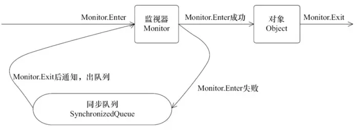

# Java 多线程

<br>

## 前言

<br>

**为何需要多线程**

为了提高性能和并发能力。多线程是指多个线程可以在同一时间内同时执行。多线程能够更充分地利用计算机的 CPU 和其他硬件资源，提高程序的执行效率和响应速度。

<br>

**存在的问题**

CPU、内存、I/O 设备的读写速度差异极大，为合理利用 CPU 的高性能，平衡三者的速度差异，计算机体系结构、操作系统、编译程序都做出了贡献：

1、CPU 增加缓存，以均衡与内存的速度差异。导致**可见性**问题。

2、操作系统增加进程、线程，分时复用 CPU，均衡 CPU 与 I/O 设备的速度差异。导致**原子性**问题。

3、编译程序优化指令执行次序，使得缓存能够得到更加合理地利用。导致**有序性**问题。

<br>


> 可见性、原子性、有序性，称为**[并发三要素][1]**。如果多个线程对同一个共享数据进行访问，而且不采取同步操作，就可能会出现并发三要素中的问题，导致操作结果与期望不一致。


> 进程线程与协程：https://www.cnblogs.com/Survivalist/p/11527949.html


<br>

## 并发三要素
### 可见性

每个线程有自己的本地内存，当一个线程修改了一个变量的值时，其他线程不一定能立即看到修改后的值。

> 例如下面的代码：
> 
> ```java
> int i = 0; // 线程共享变量 i
> i = 10; // 线程 1
> j = i; // 线程 2
> ```
> 
> 执行线程 1 的是 CPU1，执行线程 2 的是 CPU2。当线程 1 执行 `i = 10` 时，会先把 i 的初始值加载到 CPU1 的高速缓存中，赋值为 10。虽然在 CPU1 的高速缓存中 i 的值变为 10 了，当没有立即写回到主存。
> 
> 此时线程 2 执行 `j = i`，它会先去主存读取 i 的值并加载到 CPU2 的缓存当中，此时内存中 i 的值还是 0，那么 j 得到的值仍为 0，而不是 10。
> 
> 线程 1 对变量 i 修改了之后，线程 2 没有立即看到线程 1 修改的值，这就是可见性问题。

<br>

**如何解决？**

1、在 Java 中可通过同步机制或者 `volatile` 变量来保证可见性。当一个共享变量被 volatile 修饰时，它会保证变量值更新后立即被写回主存。当其他线程读取时，会去内存中读取新值；普通的共享变量不能保证可见性，因为普通共享变量被修改之后，什么时候被写入主存是不确定的。其他线程去读取时，主存中的可能是旧值；

2、通过 `synchronized` 和 `Lock` 也能够保证可见性。 synchronized 和 Lock 能保证同一时刻只有一个线程获取到锁，并且在释放锁之前会把对变量的修改刷新到主存。


<br>

### 原子性

多线程环境下，多个线程同时修改同一个变量可能会产生竞争条件，导致一些操作只完成了一部分。保证原子性就是保证一个操作或者多个操作全部执行成功，或全部执行失败。

> 比如从账户 A 向账户 B 转 1000 元，包括 2 个操作：从账户 A 减去 1000 元；往账户 B 加上 1000 元。
> 
> 如果这 2 个操作不具备原子性，就可能产生下面的问题：从账户 A 减去 1000 元之后操作突然中止，账户 B 没有收到转过来的 1000 元。

<br>

**Java 中的原子性操作**

在 Java 中，对基本数据类型的变量的**读取和赋值**（必须是将数值赋值给变量才是原子操作）操作是原子性操作，这些操作是不可被中断的，要么执行成功，要么执行失败。

```java
x = 10; // 直接将数值 10 赋值给 x，线程执行这个语句时会直接将 10 写入到工作内存中

// 包含 2 个操作，先读取 x 的值，再将 x 的值写入工作内存，
// 虽然读取 x 的值以及将 x 的值写入工作内存这 2 个操作都是原子性操作，但是合起来不是原子性操作。
y = x; 

// 包括 3 个操作：读取 x 的值，再进行 x 加 1 操作，最后将新值写入工作内存
x++; 

// 包括 3 个操作：读取 x 的值，再进行 x 加 1 操作，最后将新值写入工作内存
x = x + 1;
```

<br>

**如何解决**

Java 内存模型（JMM）只保证基本读取和赋值是原子性操作，如果要实现更大范围的原子性操作，可以通过 synchronized 和 Lock 来实现。synchronized 和 Lock 能够保证任一时刻只有一个线程执行该代码块，从根源上解决原子性问题。


<br>

### 有序性

因为 CPU 和编译器为了提高性能可能会对指令进行重排，而重排后的指令执行顺序不一定与源代码中的顺序一致，需要使用 volatile 修饰变量或者 synchronized 来保证有序性。

> 以下面的代码为例：
> 
> ```java
> int i = 0;
> boolean flag = false;
> i = 1; // 1
> flag = true; // 2
> ```
> 
> 从顺序上看，语句 1 是在语句 2 前面的，但是 JVM 在执行这段代码时不保证语句 1 一定会在语句 2 前面执行。因为这里可能会发生**指令重排**（*Instruction Reorder*）。

<br>

> 在程序执行时为了提高性能，编译器和处理器会对指令做重排序。重排序分三种类型：
>
> 1. **编译器**优化的重排序。编译器在不改变单线程程序语义的前提下，重新调整语句的执行顺序；
>
> 2. **处理器**指令的重排序。处理器重排（*Processor Reordering*）是计算机硬件层面的优化技术，主要用于提高指令级并行度（*Instruction-Level Parallelism*，ILP）。在处理器重排的情况下，处理器可能会改变指令的执行顺序。
>
>    处理器重排的优化效果显著，可以大大提高程序的性能和执行效率。但是，如果处理器重排不当，可能会导致各种问题，例如多线程程序中的数据竞争和算法中的异常行为等。
>
> 3. **内存**系统的重排序。内存系统可能会对指令读写内存的顺序进行重排，例如为了避免读写阻塞、提高缓存命中率，对读写操作进行重排。
>
> <br>
>
> 从 Java 源代码到最终实际执行的指令序列，会分别经历下面三种重排序：
>
> ```
> │SourceCode│-->│1 Compiler│-->│2 CUP│-->│3 Memory│-->│FinalExecute│
> ```
>
> 上述的 1 属于编译器重排序，2 属于处理器重排序，3 属于内存系统重排序。这些重排序都可能会导致多线程程序出现内存可见性问题。

<br>


**代码层面如何解决**

Java 可以通过 volatile 关键字来保证一定的有序性，volatile 关键字会禁止所修饰变量的指令重排序，来保证代码语句按照顺序执行。

此外 synchronized 和 Lock 能保证每个时刻只有一个线程执行同步代码，相当于线程顺序执行同步代码，自然就保证了有序性。

**JMM 与 JVM 底层如何解决**

* 对于编译器重排序，JMM 的编译器重排序规则会禁止特定类型的编译器重排序（不是所有的编译器重排序都要禁止）；
* 对于处理器指令重排序，JMM 的处理器重排序规则会要求 Java 编译器在生成指令序列时，插入特定类型的内存屏障指令（*Memory Barriers*/*Memory Fence*），通过内存屏障指令来禁止特定类型的处理器重排序（不是所有的处理器重排序都要禁止）；
* 对于内存重排序，在 JVM 实现上，加锁的过程中使用到了内存屏障和缓存同步等技术，也避免了内存系统重排序的问题；还可以使用 `final` 关键字修饰的成员变量，一旦初始化后就不能被修改，这种不可变性保证了多线程环境下的安全性和稳定性，避免了内存系统重排序的问题。


<br>

## 多线程基础

<br>

### 线程安全级别

一个类在可以被多个线程安全调用时仍能保证每个线程访问到的数据一致，就是线程安全的。可以将共享数据按照安全程度的强弱顺序分成以下五类：不可变、绝对线程安全、相对线程安全、线程兼容和线程对立。

1、不可变（Immutable）

不可变的对象一定是线程安全的，不需要再采取任何的线程安全保障措施。只要一个不可变的对象被正确地构建出来，永远也不会看到它在多个线程之中处于不一致的状态。多线程环境下，应当尽量使对象成为不可变，来满足线程安全。

> 不可变的类型：
> 
> * `final` 关键字修饰的基本数据类型；
> * String 类型；
> * 枚举类型；
> * Number 的部分子类，如 Long/Double 等数值包装类型，BigInteger/BigDecimal 等大数据类型。但原子类 AtomicInteger/AtomicLong 是可变的；
> * 集合类型，可以使用 Collections#unmodifiableXXX 方法来获取不可变的集合。

2、绝对线程安全

不管运行时环境如何，调用者都不需要任何额外的同步措施。

3、相对线程安全

相对线程安全需要保证对某个对象单独的操作是线程安全的，在调用的时候不需要做额外的保障措施。但是对于一些特定顺序的连续调用，就可能需要在调用端使用额外的同步手段来保证调用的正确性。

> 如果线程 A 删除了 List 中的一个元素，而线程 B 试图访问已经被删除的元素，就会抛出 ArrayIndexOutOfBoundsException。如果要保证代码能正确执行下去，就需要对删除元素和获取元素的代码使用 synchronized 同步保证操作安全。

4、线程兼容（非线程安全）

线程兼容是指对象本身并不是线程安全的，但是可以通过正确地使用同步机制，保证对象在并发环境中可以安全地使用。Java 说一个类不是线程安全的，绝大多数时候指的是这一种情况，如 ArrayList/HashMap 等。

5、线程对立

即使外部进行了同步调用，也不能保证线程安全。


<br>

### 线程安全的实现

1. 互斥同步：synchronized 和 ReentrantLock

2. 非阻塞同步：CAS 和 原子类

3. 无同步方案：栈封闭、ThreadLocal、可重入代码

   栈封闭：多个线程访问同一个方法的局部变量时，不会出现线程安全问题。因为局部变量存储在虚拟机栈中，属于线程私有的；

   可重入代码：可重入代码也叫做纯代码（*Pure Code*），可以在代码执行的任何时刻中断它，转身执行另外一段代码（包括递归调用它本身）。在控制权返回后，原来的程序不会出现任何错误。可重入代码有一些共同的特征，例如不依赖存储在堆上的数据和公用的系统资源、用到的状态量都由参数中传入、不调用非可重入的方法等。


<br>

### Java 线程状态

```java
// java.lang.Thread.State
public enum State {
    NEW, // 新建状态。尚未启动的线程状态。
  
    RUNNABLE, // 可运行状态。线程正在 Java 虚拟机中执行，但可能正在等待来自操作系统的其他资源，例如处理器等资源。
  
    // 阻塞状态 
  	// 等待获取同步监视器锁，阻塞状态往往是无法进入同步方法/代码块
    BLOCKED,
  
    // 等待状态，处于等待状态的线程正在等待另一个线程执行特定操作。
  	// 由于调用以下方法之一，线程处于等待状态。
    // Object.wait with no timeout
  	// Thread.join with no timeout
  	// LockSupport.park
    WAITING,
  
    // 具有指定等待时间的等待状态。 
  	// 由于以指定的正等待时间调用以下方法之一，因此线程处于定时等待状态。
    // Thread.sleep 
  	// Object.wait with timeout
  	// Thread.join with timeout
  	// LockSupport.parkNanos 
  	// LockSupport.parkUntil
    TIMED_WAITING,
  
    // 终止状态
    TERMINATED;
}
```


**线程状态转换**


<br>

### Java 线程分类

* **用户线程**，用户创建的普通线程；

* **守护线程**，为其他线程服务的线程，Java 的垃圾回收线程就是一个典型的守护线程。

在 Java 中，**所有非守护线程都执行完毕后，无论有没有守护线程，虚拟机都会自动退出**。因此**守护线程不能持有任何需要关闭的资源**，例如文件操作等，因为虚拟机退出时，守护线程没有任何机会来关闭文件。将导致数据丢失。

<br>

用户线程与守护线程的区别：守护线程和用户线程几乎每个方面都是相同的，**唯一的区别是 JVM 何时退出**。所有非守护线程都执行完毕后 ，虚拟机退出。


<br>

### 线程接口/类

#### Runnable

可以被任何类实现并重写 run 方法以创建新线程；也可以直接以匿名内部类的方式传给 Thread 的构造函数，来创建新线程。

```java
@FunctionalInterface
public interface Runnable {
    public abstract void run();
}
```


<br>

#### Thread

> JVM 允许应用程序并发运行多线程
> 
> * 每个线程都有一个 name 用作标识，如果在线程创建时未指定，Java 会自动生成
> 
> * 每个线程都有一个优先级，优先级较高的线程会优先于优先级较低的线程执行；如果在线程中嵌套创建新线程，新线程的优先级等于父线程的优先级，如果创建者是守护线程，被创建的线程也是守护线程；
> 
> * 每个线程都可以被设置/不设置为守护进程，当 JVM 启动时，会有至少一个非守护线程（main 线程）；
> * 除非另有说明，否则向 Thread 构造器中传 null 将会抛出 NullPointerException。
> 
> <br>
> 
> 正常情况下，JVM 中所有的线程会一直执行，直到：
> 
> * 类 Runtime#exit 方法被调用，SecurityManager 允许退出；
> * 所有的非守护线程都已终止，或者在方法调用过程中抛出一个传递到 Thread#run 方法之外的异常。

```java
class Thread implements Runnable
```


> There are two ways to create a new thread of execution. One is to declare a class to be a subclass of Thread. This subclass should override the run method of class Thread. An instance of the subclass can then be allocated and started.
> 
> ```java
> class SubThread extends Thread {}
> 
> Thread t = new SubThread();
> t.start();
> ```
> 
> 
> 
> The other way to create a thread is to declare a class that implements the Runnable interface. That class then implements the run method. An instance of the class can then be allocated, passed as an argument when creating Thread, and started.
> 
> ```java
> class SubRunnable implement Runnable {}
> 
> Thread t = new Thread(new SubRunnable());
> t.start();
> ```


##### 内部属性

```java
/* Make sure registerNatives is the first thing <clinit> does. */
// <clinit> 由 JVM 执行，用来初始化类的静态成员
private static native void registerNatives();
static {
    registerNatives();
}


private volatile String name; // 线程名
private int priority; // 线程优先级

// 主要用于线程转储和分析工具
// 如 jstack、jmap、jconsole 等，这些工具需要使用这个属性来获取线程堆栈信息。
/**
 * 以下方法会使用到 eetop 属性来获取线程栈的栈顶：
 * Thread.dumpThreads()，native 方法，将当前虚拟机中所有线程的堆栈信息打印出来
 * Thread.getAllStackTraces()，返回一个包含所有活跃线程的堆栈跟踪信息的 Map 对象
 * jstack 命令，印出 Java 应用程序的所有线程的堆栈信息
 */
private long eetop; // 表示线程的栈顶

/**
 * 提供给 LockSupport.park
 * 由 LockSupport.setBlocker 设置
 * 由 LockSupport.getBlocker 获取
 * 
 * 当一个线程由于调用 park 或 await 方法被阻塞时，会将 threadQ 设置为导致阻塞的对象
 * 当线程被 unpark 或 signal 方法唤醒时，会将 threadQ 重置为 null
 */
volatile Object parkBlocker; // 记录导致线程阻塞的对象
private Thread threadQ;

private long tid; // Thread ID

// Java thread status for tools, initialized to indicate thread 'not yet started'
private volatile int threadStatus = 0;

// The minimum priority that a thread can have.
public final static int MIN_PRIORITY = 1;

// The default priority that is assigned to a thread.
public final static int NORM_PRIORITY = 5;

// The maximum priority that a thread can have.
public final static int MAX_PRIORITY = 10;

// ThreadLocal 线程本地变量，只有当前线程能访问自己的 ThreadLocal
// This map is maintained by the ThreadLocal class.
ThreadLocal.ThreadLocalMap threadLocals = null;

/*
 * This map is maintained by the InheritableThreadLocal class.
 * 让子线程可以继承父线程的本地变量
 * 当父线程创建子线程时，子线程会继承父线程的 inheritableThreadLocals 变量
 * 并创建一个新的 ThreadLocalMap 对象，该对象与父线程的 ThreadLocalMap 共享一部分 Entry
 * 这样就实现了线程间的数据继承。子线程可以通过调用 get() 和 set() 方法来访问这些本地变量
 * inheritableThreadLocals 与 ThreadLocalMap 对象都是线程私有的，不同线程之间无法共享。但是通过继承性，子线程可以访问父线程的本地变量，从而实现线程间的数据共享。
 */
ThreadLocal.ThreadLocalMap inheritableThreadLocals = null;
```


##### 方法细节

```java
// 调用 start 方法开始线程执行
// run 方法由 JVM 调用
public synchronized void start() {}
public void run() {}

/**
 * 中断此线程
 * 如果当前线程已经被 Object.wait or Thread.join/sleep 中断，执行此方法会抛出 InterruptedException
 * 如果当前线程正在 InterruptibleChannel 上进行 IO 操作，执行此方法会关闭该 Channel，线程会被中断并抛出 ClosedByInterruptException
 * 如果当前线程阻塞在 Selector#select 方法上，执行此方法会中断 select 方法阻塞，并且 select 会立即返回
 *
 * 对一个已经终止状态的线程执行此方法无任何效果
 */
public void interrupt() {}
// Tests whether the current thread has been interrupted.
public static boolean interrupted() {}

// 由系统调用，可以在线程一个机会在被停止之前执行一些清理操作
private void exit() {}

// 向线程调度表示当前线程愿意让出处理器资源的使用权，
// 线程调度可能会忽视这一消息
public static native void yield() {}

// Waits for this thread to die. 
// 直到执行 join 的线程执行完毕退出，才会执行 join 后面的代码
public final void join() throws InterruptedException {}

// The thread does not lose ownership of any monitors. 
// 线程不会失去同步监视器的所有权（线程在 sleep 期间依旧持有锁）
public static native void sleep(long millis) throws InterruptedException {}
public static void sleep(long millis, int nanos) throws InterruptedException {}

// 将当前线程设置为守护线程，此方法必须在线程启动之前设置
public final void setDaemon(boolean on) {}
```


<br>

#### ThreadLocal

> ThreadLocal 是除了加锁之外的一种保证线程安全的方法。使用 ThreadLocal 创建的变量只能被当前线程访问，其他线程则无法访问和修改。访问这个变量的每个线程都会在自己本地内存中保存有这个变量的一个副本，在实际多线程操作的时候，操作的是自己本地内存中的变量，从而规避了线程安全问题。
> 
> 
> 
> 如果线程一直不终止，ThreadLocal 变量将会一直存放在 Thread#threadLocals 中。因此当一个 ThreadLocal 变量不再需要的时候，需要调用 ThreadLocal#remove 方法将其删除。
> 
> 
> 
> 只要线程处于活跃状态，并且 ThreadLocal 实例可以被访问，每个线程都持有 ThreadLocal 变量副本的隐式引用；线程离开后，它所有的 ThreadLocal 实例的副本都会被作为垃圾回收（除非还存在对这些副本的其他引用）

```java
public class ThreadLocal<T>
```


##### 内部属性

```java
// 为每个 ThreadLocal 对象生成一个唯一的 hash 值，用于在 ThreadLocalMap 中查找相应的 entry
private final int threadLocalHashCode = nextHashCode(); // final 修饰的变量在编译期会被确定
private static AtomicInteger nextHashCode = new AtomicInteger();
private static final int HASH_INCREMENT = 0x61c88647;

// ThreadLocalMap 是一个专为 ThreadLocal 定制的哈希表，用于维护线程的 ThreadLocal 变量
// 只对 ThreadLocal 提供支持，不对外暴露方法
// 为了处理内存占用大、存活时间长的引用，哈希表的 entry 使用弱引用的 key
// 因为使用的不是引用队列，老旧的 entry 只会在哈希表空间不足的时候才会被移除
static class ThreadLocalMap {} // 静态内部类 ThreadLocalMap

// SuppliedThreadLocal 是一个帮助 ThreadLocal 设置默认值的扩展类
static final class SuppliedThreadLocal<T> extends ThreadLocal<T> {}
```


##### 方法细节

```java
// 带默认值进行初始化，创建一个带默认值的 ThreadLocal 变量
public static <S> ThreadLocal<S> withInitial(Supplier<? extends S> supplier) {
    return new SuppliedThreadLocal<>(supplier);
}

public T get() {
    Thread t = Thread.currentThread(); // 获取当前操作线程
    ThreadLocalMap map = getMap(t); // 获取当前线程的 ThreadLocalMap
    if (map != null) { // ThreadLocalMap 已存在
      	// 获取到当前线程的 ThreadLocal
        ThreadLocalMap.Entry e = map.getEntry(this);
        if (e != null) {
            T result = (T)e.value; // 存在直接返回
            return result;
        }
    }
    return setInitialValue(); // map 不存在，进行初始化操作
}

private T setInitialValue() {
    T value = initialValue(); // 获取初始值
    Thread t = Thread.currentThread();
    ThreadLocalMap map = getMap(t);
    if (map != null) {
        map.set(this, value); // map 存在直接设置值
    } else {
        createMap(t, value); // 第一次 set 或者 get 的时候才会创建 map
    }
  	// 检查线程是否继承自 TerminatingThreadLocal，如果是注册 TerminatingThreadLocal 集合中，在线程被终止的时候集合中的 ThreadLocal 都会被通知到
    if (this instanceof TerminatingThreadLocal) { 
        TerminatingThreadLocal.register((TerminatingThreadLocal<?>) this);
    }
    return value;
}

// set 的逻辑和 setInitialValue 类似
public void set(T value) {
    Thread t = Thread.currentThread();
    ThreadLocalMap map = getMap(t);
    if (map != null) {
        map.set(this, value);
    } else {
        createMap(t, value); // 第一次 set 或者 get 的时候才会创建 map
    }
}

// Removes the current thread's value for this thread-local variable.
public void remove() {
   ThreadLocalMap m = getMap(Thread.currentThread());
   if (m != null) {
       m.remove(this);
   }
}
```


##### How to use

**Example 1**

```java
public class ThreadLocalTest {
    public static void main(String[] args) {
        // 默认无初始值
        ThreadLocal<String> tl = new ThreadLocal<>();

        // 设置默认值
        ThreadLocal<String> withInitialThreadLocal = ThreadLocal.withInitial(() -> {
            System.out.println("setting initial");
            return "initialValue";
        });

        new Thread(() -> {
            System.out.println(Thread.currentThread().getName());

            System.out.println(withInitialThreadLocal.get());

            tl.set("hello");
            System.out.println(tl.get());

        }, "A").start();

        new Thread(() -> {
            System.out.println(Thread.currentThread().getName());

            System.out.println(withInitialThreadLocal.get());

            tl.set("world");
            System.out.println(tl.get());
        }, "B").start();
    }
}
```


**Example 2**

```java
public class ThreadLocalTest {
    // 定义 ThreadLocal 类型的变量
    private static ThreadLocal<String> localVar = new ThreadLocal<>();

    public static void main(String[] args) {
        new Thread(() -> {
            // 在名为 AA 的线程中，设置 localVar 的值
            localVar.set("localVar in thread AA");
            print();
            System.out.println("aa after print and remove ===> " + localVar.get());
        }, "AA").start();

        new Thread(() -> {
            // 在名为 BB 的线程中，设置 localVar 的值
            localVar.set("localVar in thread BB");
            print();
            System.out.println("bb after print and remove ===> " + localVar.get());
        }, "BB").start();
    }
		// 经过观察发现在线程 AA 中设置的值和在线程 BB 中设置的值无关联
    public static void print() {
        System.out.println(Thread.currentThread().getName() + " ===> " + localVar.get());
        // 使用完之后将 localVar 移除
        localVar.remove();
    }
}
```


<br>

#### 线程协作方法

##### wait/notify/notifyAll

* 定义在 Object 类中，只能用在同步方法或者同步控制块中使用，否则会在运行时抛出 IllegalMonitorStateExeception；
* 线程调用 wait 会被挂起进入等待状态，其它线程可调用 notify/notifyAll 唤醒被挂起的线程。**如果有多个线程在等待，会唤醒优先级较高的线程**；
* 使用 wait 挂起期间，线程会释放锁。如果没有释放锁，其它线程就无法进入对象的同步方法或者同步控制块中，就无法执行 notify/notifyAll 来唤醒挂起的线程，会造成死锁。

<br>

##### await/signal/signalAll

* 由 Condition 提供

* 在线程中调用 await 使线程等待，其它线程调用等待线程的 Condition 实例的 signal/signalAll 方法唤醒等待的线程

* Condition#await 可以指定等待的条件，比 Object#wait 更加灵活

  > 更加灵活何以见得？看看下面的例子
  >
  > ```java
  > final Lock lock = new ReentrantLock();
  > final Condition notFull  = lock.newCondition(); 
  > final Condition notEmpty = lock.newCondition(); 
  > ```
  >
  > 在同一个锁实例中可以创建多个不同的 Condition 用来应对不同的情况，比 Object#wait 更加灵活。

<br>

#### wait 与 sleep

* wait 是 Object 的方法，而 sleep 是 Thread 的静态方法；
* Object#wait 会释放锁资源，Thread#sleep 不会释放锁资源；
* Thread#sleep 可以在任何场景调用，Object#wait 必须在同步代码块或同步方法中调用；
* Thread#sleep 必须指定时间，Object#wait 可指定也可不指定，不指定表示一直阻塞；
* Thread#sleep 到指定时间后会自动唤醒线程；Object#wait 在指定时间内没有被 notify/notifyAll 唤醒的话，到时间后会自动唤醒。此时分两种情况：一是立即获取到了锁，线程自然会继续执行；二是没有立即获取锁，线程进入同步队列等待获取锁。

<br>

## 多线程操作

> Java 主要从两个方面出发：
> 
> * JMM 遵循 Happens-Before 原则，并将其中的规定应用于 Java 多线程的实现中；
> * Java 语言方面，提供 synchronized/volatile/final 关键字。synchronized 用来定义同步方法或同步代码块，volatile 可用来修饰可变共享变量，final 用来修饰不可变共享变量。

<br>

### Happens-Before

Happens-Before 原则是 Java 内存模型（JMM）中的规则，用于指导多线程程序中指令重排序、内存可见性、线程间的互斥等问题。

<br>

Happens-before 原则主要包括以下内容：

1. **线程启动规则**，如果线程 A 执行了线程 B 的 start 方法，那么 A 线程的 start 操作 happens-before 于 B 线程的任何操作；
2. **线程中断规则**，对线程 interrupt 方法的调用 happens-before 于被中断线程的代码检测到中断事件的发生；
3. **线程终止规则**，线程 A 中的任意操作 happens-before 于其他线程检测到线程 A 已经终止；
4. **程序顺序规则**，在一个线程中，按照程序代码的顺序，前面的操作 happens-before 于后面的操作；
5. **锁定规则**，一个线程的 unlock 操作 happens-before 于后续线程的 lock 操作（在同一个锁上），这保证了释放锁的线程对后续获取锁的线程的所有操作可见；
6. **volatile 变量规则**，对一个 volatile 变量的写操作 happens-before 于后续的对同一个变量的读操作。这保证了 volatile 变量的可见性；
7. **传递性规则**，如果 A happens-before B，且 B happens-before C，那么 A happens-before C。这保证了在多线程环境下的操作顺序；

<br>

### 内存屏障

> 内存屏障，又称内存栅栏，实际上是 CPU 指令。在程序运行时，为了提高执行性能，编译器和处理器会对指令进行重排序。JMM 为了保证在不同的编译器和 CPU 上有相同的结果，通过插入特定类型的内存屏障来禁止特定类型的编译器重排序和处理器重排序。
>
> 插入一个内存屏障会告诉编译器和 CPU：编译期间和 CPU 指令优化的过程中，禁止对这个内存屏障前面和后面的指定操作进行重排序。
>
> <br>
>
> 一般来说对内存的操作涉及到两个动作：Load 和 Store。
>
> 在指令前插入 Load 屏障可以让高速缓存中的数据失效，强制从新从主内存加载数据；在指令后插入 Store 屏障能让工作内存中的最新数据更新写入主内存，对其它线程可见。
>
> 这里的 Load 屏障和 Store 屏障就是内存屏障，内存屏障有两个作用：
>
> * 防止指令重排；
> * 使线程工作内存中的缓存数据失效。
>
> 因为编译器/处理器/内存系统可能会对执行指令进行重排序，所以经过两两组合之后有以下四种情况：
>
> |            | 作用                                       | 说明                                                         |
> | ---------- | ------------------------------------------ | ------------------------------------------------------------ |
> | LoadLoad   | 防止屏障之前读与屏障之后的读交换执行顺序   | 如果把 LoadLoad 屏障插入到两个读操作之间，那这两个读操作的相对顺序就不会被改变了，后面的读绝不会先于前面的读执行。 |
> | StoreLoad  | 防止先写后读被重排为先读后写               | 把 StoreLoad 屏障插入到一写一读操作之间，防止出现 Store 跟着 Load 乱序。 |
> | LoadStore  | 防止在屏障之前的读，与屏障之后的写指令重排 | 把 StoreLoad 屏障插入到一读一写操作之间                      |
> | StoreStore | 防止在屏障之前的写，与屏障之后的写指令重排 | 把 StoreLoad 屏障插入到两个写操作之间                        |


<br>

### final

> 看到 final 出现在这里可能有点奇怪，平常使用的时候只用 final 来定义不可变的变量，和多线程有什么关系呢？

#### final 与多线程

在 Java 中，使用 final 关键字来定义变量或者对象后，这个变量或对象的引用不能被修改，即为不可变对象或常量；修饰的方法可被重载，不可重写。

在多线程环境中，如果多个线程同时对一个共享的变量进行写操作，可能会出现数据竞争的问题，导致数据不一致。而使用 final 关键字可以保证变量的值无法被改变，保证了线程安全性。

final 修饰的变量还有一个和多线程密切相关的特点：允许修饰空变量，但必须在构造方法结束之前设置它的值（保证可见性）。

```java
public class Clazz {
	private final int count; // 不设置值
  public Clazz(int c) {
  	this.count = c; // 构造函数中设置值
  }
}
```


> 在多线程操作中，final 主要用于保证内存可见性、防止指令重排和保证线程安全：
>
> * 线程安全
>
>   在多线程环境中，如果多个线程同时对一个共享的变量进行写操作，可能会出现数据竞争的问题，导致数据不一致。而使用 final 关键字可以保证变量的值无法被改变，从而避免了多线程竞争的问题，保证了线程安全性。
>
> * 内存可见性
> 
>   在构造函数中，如果一个 final 变量在构造函数中被正确初始化后，其他线程就能够看到这个 final 变量的值。这是因为在构造函数完成之前，对象不能被其他线程访问，因此 final 变量的值能够被正确初始化并被其他线程看到。
>   
>    * 防止指令重排
>   
>   如果一个变量被声明为 final，编译器和处理器会对其进行特殊处理，保证在 `final` 变量初始化完成之前，不会访问到 final 变量。这样就避免了程序在多线程环境下出现不可预期的行为。
> 
>* 禁止重复初始化
> 
>  当一个 final 变量被初始化过后，不能再次被初始化，否则会导致数据不一致。JMM 的线程模型中也利用了 final 关键字来保证 final 变量的值只能被初始化一次，避免了多线程竞争的问题。

<br>

#### 重排序规则

**写操作重排**

JMM 禁止编译器把对 final 变量的写重排序到构造函数之外：编译器会在 final 变量写之后，构造函数 return 之前，插入一个 StoreStore 屏障，禁止处理器把 final 变量的写重排序到构造函数之外。


**读操作重排**

* 在一个线程中，对于初次读/写 final 变量，JMM 会禁止这两个操作的重排序（仅针对处理器）；
* 处理器会在读 final 变量操作前面插入一个 LoadLoad 屏障。


<br>

### volatile

volatile 修饰的变量具有以下特点：

* 防止指令重排
* 保证可见性
* 保证单次读写的原子性

<br>

#### 禁止指令重排

> **Example**
>
> ```java
> public class Singleton {
> public static volatile Singleton singleton;
> // 构造函数私有，禁止外部实例化
> private Singleton() {};
> public static Singleton getInstance() {
>   if (singleton == null) {
>       synchronized (singleton.class) {
>           if (singleton == null) {
>               singleton = new Singleton();
>           }
>       }
>   }
>   return singleton;
> }
> }
> ```
>
> 实例化一个对象其实可以分为三个步骤：
>
> 1. 分配内存空间；
>
> 2. 初始化对象；
>
> 3. 将内存空间的地址赋值给对应的引用。
>
> <br>
>
> 但是由于操作系统可以对指令进行重排序，上面的过程也可能会变成如下过程：
>
> 1. 分配内存空间；
>
> 2. 将内存空间的地址赋值给对应的引用；
>
> 3. 初始化对象；
>
> 如果是这个流程，多线程环境下持有的引用就可能是一个未初始化的对象。为了防止这个过程的重排序，需要使用 volatile 来修饰 `singleton` 变量，防止指令重排序。
>
> 
>
> volatile 禁止指令重排需要使用到内存屏障：
>
> |            | 插入位置                       | 说明                                                        |
> | ---------- | ------------------------------ | ----------------------------------------------------------- |
> | StoreStore | 在 volatile 写操作的前面插入。 | 禁止前面的普通写和后面的 volatile 写重排序。                |
> | StoreLoad  | 在 volatile 写操作的后面插入。 | 防止前面的 volatile 写与后面可能有的 volatile 读/写重排序。 |
> | LoadLoad   | 在 volatile 读操作的前面插入。 | 禁止前面所有的普通读操作和后面的 volatile 读重排序。        |
> | LoadStore  | 在 volatile 读操作的后面插入。 | 禁止前面所有的普通写操作和后面的 volatile 读重排序          |
>
> 
>
> 
>
> 

<br>

#### 保证可见性

> 可见性问题主要指一个线程修改了共享变量值，而另一个线程却看不到。引起可见性问题的主要原因是每个线程拥有自己的一个工作内存。
> 
> 当一个共享变量被 volatile 修饰时，它会保证修改的值会立即被更新到主内存，当有其他线程需要读取时，它会去主内存中读取新值。
> 
> 当一个变量被 volatile 关键字修饰后，在进行写操作时，JVM 会向处理器发送一条 Lock 前缀的指令，将这个变量所在的缓存行的数据写回到系统内存中，同时会让其他处理器缓存该变量的缓存行失效，下次读取该变量时就必须从系统内存中重新获取，从而保证了变量的可见性。

<br>

#### 单次操作原子性

> volatile 不保证一个操作集的原子性，仅能保证单次读写操作的原子性（实际上 Java 本身就会保证每一个单词操作的原子性）。如果要保证程序中的多个操作的原子性可以使用 synchronized 或者使用 `java.util.concurrent` 包中提供的原子类。

> **特例**
>
> 在 Java 中，共享的 `long` 和 `double` 这两个数据类型的读取操作是原子的，但是它们的写入操作不是原子的。
>
> 因为 long/double 类型的数据需要占用 64 bit（8 Byte）的内存空间，而 CPU 的寄存器一般只有 32 位或 64 位，所以在写入一个 long/double 值时，需要先将它分成两个 32 位的部分分别写入内存，这个过程不是原子的。如果需要在多线程环境下对 long/double 进行写操作，可以使用 Java 提供的原子类，如 AtomicLong/AtomicDouble。


<br>

### synchronized

#### 锁资源

> Java 中 synchronized 锁有以下几种情况：
> 
> * 每个实例都有一把实例锁/对象锁/this，不同实例对象之间互不影响；
> * 非静态 synchronized 方法/代码块，锁资源为实例对象本身/this；
> * 以 `类名.class` 作为锁资源或用 synchronized 修饰静态方法时，所有对象共用一把锁：类锁；
> * 静态 synchronized 方法/代码块，锁资源为当前类。

> **注意**
> 
> * 一把锁只能同时被一个线程获取，没有获得锁的线程只能等待；
> * synchronized 修饰的方法，无论方法正常执行完毕还是抛出异常，都会释放锁。
> * 锁对象不能为空，因为锁的信息都保存在对象头中；
> * 锁的范围不宜过大，控制范围过大会影响程序执行的效率。在能选择的情况下，优先使用 `java.util.concurrent` 下的原子类，然后才是 Lock 和 synchronized。

<br>

#### 锁获取指令

> **Example**
> 
> ```java
> public class SynchronizedTest {
>  public void method1() {
>      synchronized(this) {
>             // do nothing
>         }
>     }
>    
>     public void method2() {
>      synchronized(SynchronizedTest.class) {
>             // do something
>         }
>     }
>    }
>    ```
> 
> 将字节码反编译内容如下：
> 
> ```java
> // class version 52.0 (52)
> // access flags 0x21
> public class sync/SynchronizedTest {
> 
> // compiled from: SynchronizedTest.java
> 
>   // access flags 0x1
> public <init>()V // 初始化
>   L0
>    LINENUMBER 9 L0
>     ALOAD 0
>     INVOKESPECIAL java/lang/Object.<init> ()V
>     RETURN
>    L1
>     LOCALVARIABLE this Lsync/SynchronizedTest; L0 L1 0
>     MAXSTACK = 1
>     MAXLOCALS = 1
>    
>    // access flags 0x1
> public method1()V
>    TRYCATCHBLOCK L0 L1 L2 null // TRYCATCHBLOCK 表示异常处理块
>    TRYCATCHBLOCK L2 L3 L2 null
>    L4
>     LINENUMBER 12 L4
>     ALOAD 0 // 将本地变量表中索引为 0 的变量（即 this）压入栈顶
>     DUP // 复制栈顶的数值并将其压入栈顶
>     ASTORE 1 // 将栈顶数值（即 this）存入本地变量表中索引为 1 的位置
>     MONITORENTER // 获取锁，锁对象为栈顶对象
>    L0
>     LINENUMBER 14 L0
>     ALOAD 1
>     MONITOREXIT // 释放锁
>    L1
>     GOTO L5
>    L2
>    FRAME FULL [sync/SynchronizedTest java/lang/Object] [java/lang/Throwable]
>     ASTORE 2
>     ALOAD 1
>     MONITOREXIT // 遇到异常释放锁
>    L3
>     ALOAD 2
>     ATHROW
>    L5
>     LINENUMBER 15 L5
>    FRAME CHOP 1
>     RETURN
>    L6
>     LOCALVARIABLE this Lsync/SynchronizedTest; L4 L6 0
>     MAXSTACK = 2
>     MAXLOCALS = 3
>    
>    // access flags 0x1
> public method2()V
>    TRYCATCHBLOCK L0 L1 L2 null
>    TRYCATCHBLOCK L2 L3 L2 null
>    L4
>     LINENUMBER 18 L4
>     LDC Lsync/SynchronizedTest;.class// LDC 指令将 SynchronizedTest 类的常量池索引压入操作数栈
>     DUP // 复制栈顶的数值并将其压入栈顶
>     ASTORE 1 // 将栈顶数值（即当前类）存入本地变量表中索引为 1 的位置
>     MONITORENTER // 获取锁，锁对象为栈顶对象
>    L0
>     LINENUMBER 20 L0
>     ALOAD 1
>     MONITOREXIT // 释放锁
>    L1
>     GOTO L5
>    L2
>    FRAME FULL [sync/SynchronizedTest java/lang/Object] [java/lang/Throwable]
>     ASTORE 2
>     ALOAD 1
>     MONITOREXIT // 遇到异常释放锁
>    L3
>     ALOAD 2
>     ATHROW
>    L5
>     LINENUMBER 21 L5
>    FRAME CHOP 1
>     RETURN
>    L6
>     LOCALVARIABLE this Lsync/SynchronizedTest; L4 L6 0
>     MAXSTACK = 2
>     MAXLOCALS = 3
>    }
>    ```
> 
> <br>
> 
> 可以看到上面的 `MONITORENTER` 和 `MONITOREXIT` 指令，具体作用如下：
> 
> - MONITORENTER：在进入同步块时获取对象的监视器锁，若对象已经被锁定，则等待其他线程释放锁，当前线程被阻塞。
> - MONITOREXIT：在退出同步块时释放对象的监视器锁，通知等待线程可以获取锁并执行同步块。
> 
> <br>
> 
> MONITORENTER 和 MONITOREXIT 指令会让对象在操作锁期间，使其锁计数器加 1 或者减 1。每个对象在同一时间只与一个 MONITOR（锁/同步监视器）相关联，一个 MONITOR 在同一时间只能被一个线程获得。
> 
> 
> 
> 需要注意的是，获取对象锁是一个开销较大的操作，因为它需要等待其他线程释放锁。如果同步块中的操作不是非常耗时，会影响性能，甚至会导致死锁等问题。因此，在使用同步块时，应当尽量减少同步块的大小和同步的范围，以提高程序性能。

<br>

> **MONITORENTER 指令**
> 
> 一个线程在尝试获得与之相关联的 MONITOR 锁的所有权时，MONITORENTER 指令可能会发生如下 3 种情况之一：
> 
> 1. MONITOR 计数器为 0，表示目前锁空闲，这个线程就会立刻获取锁，然后把锁计数器 +1，此时别的线程想获取锁，就需要等待；
> 
> 2. 如果这个 MONITOR 已经拿到了这个锁的所有权，又重入了这把锁，锁计数器就会累加，变成 2，并且随着重入的次数，锁计数器会一直累加；
> 
> 3. 锁已经被别的线程获取，阻塞等待锁释放。
> 
> <br>
> 
> **MONITOREXIT 指令**
> 
> MONITOREXIT 指令释放对 MONITOR 的所有权。释放过程很简单，就是将 MONITOR 的计数器减 1。如果减完以后，计数器不是 0，说明当前锁是重入锁，当前线程继续持有锁的所有权；如果计数器变成 0，表示当前线程不再拥有该 MONITOR 的所有权，即释放锁。
> 
> <br>
> 
> **同步监视器（锁）获取流程**
> 
> 
> 
> 从上图可以看到，任意线程对 Object 的访问，首先要获得 Object 的监视器，如果获取失败，该线程就进入同步状态，线程状态变为 BLOCKED，当 Object 的监视器占有者释放后，同步队列中的线程就有机会重新获取该监视器。
> 
> <br>
> 
> **可重入锁原理**
> 
> 在同一锁程中，线程不需要再次获取同一把锁。在获取锁的时候只需要对比当前对像的哈希值和锁对象头中的哈希值和线程 ID，即可判断是否可重入。
> 
> synchronized 锁是一种重量级锁，具有重入性。每个对象拥有一个计数器，当线程获取该对象锁后，计数器就会 +1，释放锁后就会将计数器 -1。


<br>

#### 保证可见性

Java 中的 synchronized 关键字通过监视器锁来实现多线程之间的同步和互斥。在 synchronized 块或方法中，每次只能有一个线程获得该对象的锁，其他线程在尝试获得该锁时会被阻塞。当一个线程释放锁时，其他线程可以争夺该锁。

在获取锁之前，线程会把本地内存中的共享变量刷新到主内存中，以保证可见性。在释放锁时，线程会把本地内存中修改过的共享变量刷新到主内存中。当另一个线程获取了对象的锁时，会从主内存中重新读取该对象的值，以使其他线程可以看到最新值。

此处使用到了 JMM 的 happens-before 原则：前一个线程的解锁操作 happens-before 后一个线程的加锁操作。

<br>

#### 保证原子性

synchronized 关键字可以保证代码块或方法在执行时，同一时刻只能有一个线程进入临界区，从而实现了线程间的互斥。互斥是保证原子性的前提，但它本身并不能保证原子性。

在 synchronized 代码块或方法执行时，线程首先需要获得锁监视器，才能执行 synchronized 代码块或方法中的操作，最后释放锁监视器。这个过程中，只有一个线程能够获得锁，其它线程需要等待，从而保证了操作的原子性。


<br>

#### 禁止指令重排

在进入 synchronized 块之前，JVM 会插入一个 LoadLoad 屏障和一个 LoadStore 屏障，这可以保证在进入 synchronized 块之前，所有之前的操作都已经完成了。

在退出 synchronized 块之后，JVM 会插入一个 StoreStore 屏障和一个 StoreLoad 屏障，这可以保证在退出 synchronized 块之后，所有之后的操作都必须在前面操作完成之后执行。

<br>

### 对象头与锁

> 在 Java 对象头中（*Object Header*）包含一下内容：
>
> | 内容                   | 长度/bit | 说明                                      |
> | ---------------------- | -------- | ----------------------------------------- |
> | Mark Word              | 32/64    | 存储对象哈希值、*GC 年龄*、锁标记位等信息 |
> | Class Metadata Address | 32/64    | 指向方法区对象类型数据的指针              |
> | Array Length           | 32       | 如果对象是数组，用于存储数据的长度        |
>
> <br>
>
> 对象头中 *Mark Word* 中的具体内容如下：
>
> <table style="text-align:center;">
> <caption>32 位</caption>
> <tr>
>  <th rowspan="2">锁状态</th>
>  <th colspan="2">25 bit</th>
>  <th rowspan="2">4 bit</th>
>  <th rowspan="2">
>    1 bit<br>
>    （是否偏向锁）
>  </th>
>  <th rowspan="2">
>    2 bit<br>
>    （锁标志位）
>  </th>
> </tr>
> <tr>
>  <td>23 bit</td>
>  <td>2 bit</td>
> </tr>
> <tr>
>  <td>无锁</td>
>  <td colspan="2">对象 hashCode</td>
>  <td>对象分代年龄</td>
>  <td>0</td>
>  <td>01</td>
> </tr>
> <tr>
>  <td>偏向锁</td>
>  <td>
>    Thread ID<br>
> 		（锁偏向线程 ID）
>  </td>
> 		<td>Epoch</td>
> 		<td>对象分代年龄</td>
>  <td>1</td>
>  <td>01</td>
> </tr>
> <tr>
>  <td>轻量级锁</td>
>  <td colspan="4">指向栈中记录的指针</td>
>  <td>00</td>
> </tr>
> <tr>
>  <td>重量级锁</td>
>  <td colspan="4">指向重量级锁的指针</td>
>  <td>10</td>
> </tr>
> <tr>
>  <td>GC 标记</td>
>  <td colspan="4">空</td>
>  <td>11</td>
> </tr>
> </table>
>
> 
>
>
> <table style="text-align:center;">
> <caption>64 位</caption>
> <tr>
>  <th rowspan="2">锁状态</th>
>  <th colspan="2">56 bit</th>
>  <th rowspan="2">1 bit</th>
>  <th rowspan="2">4 bit</th>
>  <th rowspan="2">
>    1 bit<br>
>    （是否偏向锁）
>  </th>
>  <th rowspan="2">
>    2 bit<br>
>    （锁标志位）
>  </th>
> </tr>
> <tr>
>  <td>25 bit</td>
>  <td>31 bit</td>
> </tr>
> <tr>
>  <td>无锁</td>
>  <td>unused</td>
>  <td>对象 hashCode</td>
>  <td>Cms_free</td>
>  <td>对象分代年龄</td>
>  <td>0</td>
>  <td>01</td>
> </tr>
> <tr>
>  <td>偏向锁</td>
>  <td>
>    Thread ID<br>
> 		（锁偏向线程 ID）<br>
>    54 bit
>  </td>
> 		<td>
>    Epoch<br>
>    2 bit
>  </td>
>  <td>Cms_free</td>
> 		<td>对象分代年龄</td>
>  <td>1</td>
>  <td>01</td>
> </tr>
> <tr>
>  <td>轻量级锁</td>
>  <td colspan="5">指向栈中记录的指针</td>
>  <td>00</td>
> </tr>
> <tr>
>  <td>重量级锁</td>
>  <td colspan="5">指向重量级锁的指针</td>
>  <td>10</td>
> </tr>
> <tr>
>  <td>GC 标记</td>
>  <td colspan="5">空</td>
>  <td>11</td>
> </tr>
> </table>
>
> 在 Java 中，锁是通过 *Mark Word* 中的锁状态标志实现的。不同类型的锁都是通过对象头中不同的锁状态标志来记录的。


### 锁的类型

> JDK 中的同步锁一共有四种状态：
>
> * 无锁
> * 偏向锁
> * 轻量级锁
> * 重量级锁
>
> 当一个线程需要获取一个锁时：会首先尝试获取偏向锁或轻量级锁，在无法获取这两种锁时才会升级为重量级锁。锁会随着竞争情况逐渐升级。
>
> 锁升级方向：无锁 → 偏向锁 → 轻量级锁 → 重量级锁 （升级过程不可逆）。同步锁可以升级但是不可以降级，目的是为了提供获取锁和释放锁的效率。

<br>

#### 偏向锁

**为何需要**

在大多实际环境下，锁不仅不存在多线程竞争，而且总是由同一个线程多次获取。在同一个线程反复获取与释放锁的过程中中，并没有锁的竞争。这样看来，实际的开销大多是在锁的获取和释放以及线程上下文的切换中。为了解决这一问题，JDK 1.6 引入了偏向锁。

**如何表现**

当一个线程第一次进入同步块时，JVM 会将这个线程 ID 记录在对象头中，并将对象头标记为偏向模式。如果后续的操作都由同一个线程来执行，那么这个线程就不需要每次都获取锁了，直接进入同步块即可。这个过程称为偏向锁的获取。如果有其他线程来争夺锁，那么偏向锁就会被撤销。

**撤销偏向锁**

偏向锁的释放分为两种情况：

* 当有其他线程争夺锁时，偏向锁会被撤销，锁的状态回到无锁状态，这个过程称为偏向锁的撤销；
* 当锁对象处于偏向状态时，它所在的线程已经结束了，那么这个偏向锁也会被撤销，锁的状态回到无锁状态。

**适用场景**

偏向锁的获取和撤销都会带来一定的性能消耗，因此偏向锁适用于低竞争场景。如果一个锁经常被不同的线程访问，那么偏向锁就不适用了，此时应该考虑使用轻量级锁和重量级锁。

<br>

#### 轻量级锁

在大多数情况下同步块并不会有竞争，因此 JDK 1.6 引入了轻量级锁，轻量级锁不是用来替代重量级锁的，而提出的一种优化。

轻量级锁的获取和释放都是通过 CAS 操作来完成的。当一个线程尝试获取一个对象的轻量级锁时，它会将对象头中的 *Mark Word* 备份到线程的栈帧中。而后尝试使用 CAS 操作将对象头中的 *Mark Word* 中轻量级锁指针更改为指向该线程。如果更新成功，表示该线程已经获取到了该对象的轻量级锁；否则，表示该锁已经被其他线程占用。该线程就会进入等待队列中等待获取锁。

<br>

#### 自旋锁

**为何需要**

在多线程竞争锁时，一个线程获取到锁后会阻塞所有正在竞争的线程，而挂起线程和恢复线程的操作都需要转入内核态中完成，影响性能。

**如何表现**

轻量级锁获取失败后线程就会进入等待队列中等待获取锁，其实就是让线程在队列中自旋等待获取锁，不放弃 CPU，一直等到持有锁的线程释放锁，再去竞争锁资源。

**自旋等待与阻塞**

自旋锁与阻塞本质上并不相同。如果锁占用的时间短，自旋锁的性能会很好；如果锁占用的时间长，会带来更多的开销（因为在线程自旋时会始终占用 CPU 时间片，如果锁占用的时间太长，自旋会浪费 CPU 资源）。

因此自旋等待的时间必须要有一定的限度，如果超过了指定的次数仍然没有成功获取到锁，就挂起线程。自旋锁默认的自旋次数为 10 次，可以使用参数 `-XX:PreBlockSpin` 来更改。

**自适应自旋锁**

自旋本身来说虽然避免了线程切换的开销，但是仍然要占用处理器的时间，如果时间过长，就会浪费 CPU 资源。所以自旋的次数要进行限制，但是这个次数是多少呢？基于这个思考，就有了自适应自旋锁。

自适应自旋锁的自旋时间并不固定，而是由上一次在同一个锁上自旋的时间及锁拥有者的状态来决定：

* 如果在同一个锁对象上，自旋等待刚刚成功获取过锁，并且持有锁的线程正在运行中，那么 JVM 会认为该锁自旋获取到锁的可能性很大，会自动增加等待时间。比如增加到 100 次循环。
* 相反，如果对于某个锁的竞争自旋很少成功获取锁，再获取这个锁时将可能会省略掉自旋过程，以避免浪费处理器资源。

<br>

#### 重量级锁

Java 中的重量级锁是一种传统的互斥锁，是一种阻塞锁。当一个线程获取到重量级锁后，其他线程会被阻塞，等待锁的释放。相比于偏向锁和轻量级锁，重量级锁的获取和释放需要更多的系统调用和上下文切换，因此性能较低，但是它的实现比较简单，且适用于竞争激烈的情况。


<br>

### 锁的比较

| 锁       | 优点                               | 缺点                                                         | 使用场景                   |
| -------- | ---------------------------------- | ------------------------------------------------------------ | -------------------------- |
| 偏向锁   | 加锁和解锁简单，没有额外的性能消耗 | 如果线程间存在锁竞争，会带来额外的锁撤销的消耗               | 适用于线程访问同步块的场景 |
| 轻量级锁 | 竞争的线程不会阻塞                 | 如果线程在竞争中始终得不到锁，自旋会消耗 CPU 性能            | 锁竞争不激烈，锁持有时间短 |
| 重量级锁 | 线程竞争不使用自旋，不浪费 CPU     | 线程阻塞，响应时间缓慢，在多线程下频繁获取释放锁会带来巨大的性能消耗 | 锁竞争激烈，且锁持有时间长 |


<br>

### 锁升级

> **锁升级过程**（以 32 位为例）
>
> 1）无锁状态下，就是一个普通的对象。*Mark Word* 记录对象的 HashCode，锁标志位是 01，是否偏向锁是 0；
>
> 2）当对象被当做同步锁并有一个线程 A 抢到了锁时，锁标志位还是 01，是否偏向锁位置为 1，前 23 bit 记录抢到锁的线程 ID，表示进入偏向锁状态；
>
> 3）当线程 A 再次试图来获得锁时，JVM 发现同步锁对象的标志位是 01，是否偏向锁是 1，是偏向状态，*Mark Word* 中记录的线程 ID 就是线程 A 的 ID，表示线程 A 已经获得了这个偏向锁；
>
> 4）当线程 B 试图获得这个锁时，JVM 发现锁处于偏向状态，且 *Mark Word* 中的线程 ID 记录的不是 B。线程 B 会先用 CAS 操作试图获得锁，如果获取锁成功，就把 *Mark Word* 里的线程 ID 改为线程 B 的 ID，代表线程 B 获得了这个偏向锁。如果抢锁失败，则继续执行步骤 5）；
>
> 5）**偏向锁状态抢锁失败，代表当前锁有一定的竞争，偏向锁将升级为轻量级锁**。
>
> 线程 B 尝试获取轻量级锁，它会将对象头中的 *Mark Word* 备份到线程的栈帧中，并尝试使用 CAS 操作将对象头中的 *Mark Word* 中的轻量级锁的锁记录指针更新为指向 B。如果更新成功，表示该线程已经获取到了该对象的轻量级锁，就把 *Mark Word* 中的锁标志位改成 00，可以执行同步代码。如果保存失败，表示抢锁失败，竞争太激烈，继续执行步骤 6）；
>
> 6）轻量级锁抢锁失败，JVM 会使用自旋锁，自旋锁不是一个锁状态，只是代表不断的重试，尝试获取锁。从 JDK 1.7 开始，自旋锁默认启用，自旋次数由 JVM 决定（自适应自旋锁）。如果抢锁成功则执行同步锁代码，如果失败则继续执行步骤 7）；
>
> 7）**自旋锁重试之后如果抢锁依然失败，同步锁会升级至重量级锁**，锁标志位改为 10。在这个状态下，未抢到锁的线程都会被阻塞。


<br>

### 锁优化

> 在 JVM 中，为了减少锁操作的开销，对锁的实现引入了大量优化，比如：
> 
> - **锁粗化**：减少不必要的、紧连在一起的加锁解锁操作，将多个连续的锁扩展成一个范围更大的锁。
> - **锁消除**：如果发现某个锁不可能被多个线程同时访问，就会将这个锁消除掉。避免不必要的锁竞争和上下文切换。
> - **偏向锁**：为了在无锁竞争的情况下避免执行不必要的 CAS 指令引入偏向锁。
> - **轻量级锁**：轻量级锁实现的背后基于这样一种假设：程序中的大部分同步代码一般都处于无锁竞争状态，在此情况下，只需要依靠一条 CAS 原子指令就可以完成锁的获取及释放，完全可以避免调用系统指令获取重量级互斥锁。当存在锁竞争的情况下，执行 CAS 指令失败的线程将调用操作系统互斥锁进入到阻塞状态，当锁被释放的时候被唤醒。
> - **适应性自旋**：当线程在获取轻量级锁失败时，会进入自旋状态等待再次尝试获取锁。自旋尝试获取锁一定次数后，如果仍然没有成功则进入到阻塞状态。


<br>

## 参考

* [pdai.tech#final](https://pdai.tech/md/java/thread/java-thread-x-key-final.html)
* [内存屏障简析](https://gohalo.me/post/linux-c-memory-barriers-basic-introduce.html)
* [理解内存屏障](https://zhuanlan.zhihu.com/p/491157678)
* https://mp.weixin.qq.com/s/7jU0ci2tn5TwCvOyxdX6dA
