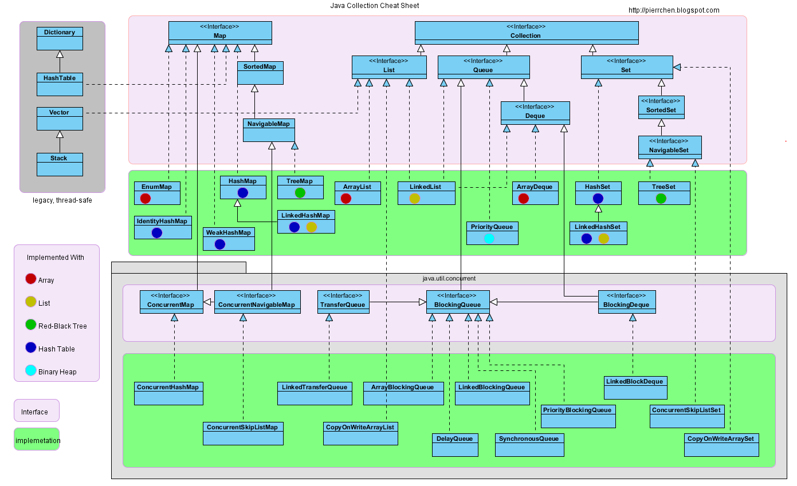
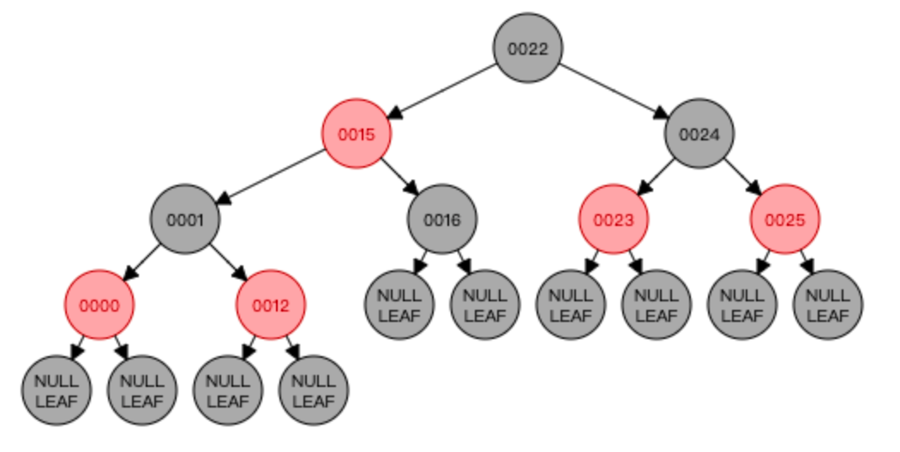

# Java 集合

## 前言

### 集合与数组

集合和数组都是对多个数据进行存储操作的结构，都相当于**存储数据的容器**（内存方面的存储，非持久化存储）。

数组有以下缺点：

1、数组存储的数据长度是确定的，不便于扩展。集合长度可变

2、数组存储的数据类型是单一的，数组声明的类型，决定了进行元素初始化时的类型。

3、数组中提供的属性和方法少，不便于进行增删和插入操作，且效率不高，同时无法直接获取存储元素的个数

<br>

### 集合体系结构




<br>

## Collection

> The root interface in the collection hierarchy. A collection represents a group of objects, known as its elements. Some collections allow duplicate elements and others do not. Some are ordered and others unordered.
>
> JDK 不提供任何直接继承自此接口的实现类，只提供一些特殊的子接口如 List 和 Set。此接口可以当作传参时最大的通用类。
>
> 


```java
public interface Collection<E> extends Iterable<E> {}
```

<br>

### Iterator

Collection 接口继承了 `Iterator` 接口，`Iterator` 对象称为迭代器，主要用于遍历 `Collection` 集合中的元素。

```java
public interface Iterable<T> {
  
  	// Returns an iterator over elements of type T.
    Iterator<T> iterator();

    default void forEach(Consumer<? super T> action) {
        Objects.requireNonNull(action);
        for (T t : this) {
            action.accept(t);
        }
    }

    default Spliterator<T> spliterator() {
        return Spliterators.spliteratorUnknownSize(iterator(), 0);
    }
}
```


> **迭代器模式**
>
> 提供访问一个集合容器（Container）对象中的各个元素，而又不需暴露该对象的内部细节的方法。
>
> 
>
> **迭代器的错误使用**
>
> ```java
> // 1、iterator.next() 应该放在 while 体内
> Iterator iterator = collection.iterator();
> while( (iterator.next())!=null ){
>     //...
> }
> // 2、死循环
> // 集合对象每次调用iterator()方法都会得到一个全新的迭代器对象
> // 默认的游标都在集合的第一个元素之前
> // 此处每次判断都会返回一个新对象
> while(collection.iterator().hasNext())
> {
>     System.out.println(collection.iterator().next());
> }
> ```

<br>

### List

>List 接口实现类是元素有序，可重复的集合，又被称为<mark>动态数组</mark>。
>
>
>
>**常见实现类**
>
>* Vector
>* ArrayList
>* LinkedList
>* CopyOnWriteArrayList
>
>相同点：
>
>1. 三个类都实现了 `List` 接口；
>2. 存储的数据的特点都是有序，可重复；
>3. 都支持存储 `null` 值。
>
>
>
>不同点：
>
>1）`ArrayList` 线程不安全，效率高，底层使用 `Object []` 存储数据
>
>2）`LinkedList` 线程不安全，对于频繁的插入、删除操作，比使用 `ArrayList` 效率高，不涉及到扩容。底层使用<mark>双向链表</mark>存储，只能顺序访问。`LinkedList` 还可以用作栈/队列/双向队列。
>
>3）`Vector` 作为 `List` 接口的老实现类，方法基本上都用 `synchronized` 修饰，线程安全，效率低，底层使用`Object []`存储数据。Java 自带的 `Stack` 类继承自 `Vector`。

<br>

#### ArrayList

> Resizable-array implementation of the List interface. Implements all optional list operations, and permits all elements, including null. 
>
> This class is roughly equivalent to Vector, except that it is unsynchronized.
>
> 
>
> The size, isEmpty, get, set, iterator, and listIterator operations run in constant time. The add operation runs in amortized constant time, that is, adding n elements requires O(n) time. All of the other operations run in linear time (roughly speaking). The constant factor is low compared to that for the LinkedList implementation.
>
> 
>
> Each ArrayList instance has a capacity. The capacity is the size of the array used to store the elements in the list. It is always at least as large as the list size. As elements are added to an ArrayList, its capacity grows automatically.
>
> An application can increase the capacity of an ArrayList instance before adding a large number of elements using the ensureCapacity operation. This may reduce the amount of incremental reallocation.


```java
public class ArrayList<E> extends AbstractList<E>
        implements List<E>, RandomAccess, Cloneable, java.io.Serializable
```

JDK 1.8 中默认初始化底层数组为空，懒汉式创建，延迟数组的创建，执行 `add` 方法的时候才创建长度为 10 的 `Object` 数组，若长度不够则进行扩容。


##### 源码解析

```java
// 默认初始化容量
private static final int DEFAULT_CAPACITY = 10;

// 默认容量为 0 时的空数组
private static final Object[] EMPTY_ELEMENTDATA = {};

// 默认容量为 10 时的空数组
private static final Object[] DEFAULTCAPACITY_EMPTY_ELEMENTDATA = {};

/**
 * 当默认容量 = 0 时 elementData = EMPTY_ELEMENTDATA
 * 当默认容量 = 10 时 elementData = DEFAULTCAPACITY_EMPTY_ELEMENTDATA
 */
transient Object[] elementData; // non-private to simplify nested class access

private int size;

// 默认构造方法，底层创建一个空数组
public ArrayList() {
    this.elementData = DEFAULTCAPACITY_EMPTY_ELEMENTDATA;
}

public ArrayList(Collection<? extends E> c) {
    Object[] a = c.toArray();
    if ((size = a.length) != 0) {
        if (c.getClass() == ArrayList.class) {
            elementData = a;
        } else {
            elementData = Arrays.copyOf(a, size, Object[].class);
        }
    } else {
        // replace with empty array.
        elementData = EMPTY_ELEMENTDATA;
    }
}

// 带初始容量的实例化
public ArrayList(int initialCapacity) {
    if (initialCapacity > 0) {
        this.elementData = new Object[initialCapacity];
    } else if (initialCapacity == 0) {
        this.elementData = EMPTY_ELEMENTDATA;
    } else {
        throw new IllegalArgumentException("Illegal Capacity: "+
                                           initialCapacity);
    }
}

// contains 方法声明于 List 接口，由 AbstractList 类实现
public boolean contains(Object o) {
    return indexOf(o) >= 0;
}

// 单个元素添加操作
public boolean add(E e) {
    // 添加之前先调用 ensureCapacityInternal 确定内部数组容量
    // 当前size = 0， 将 size + 1 作为最小容量传入 ensureCapacityInternal
  	// 计算出合适的容量
    ensureCapacityInternal(size + 1);  // Increments modCount!!
    elementData[size++] = e;
    return true;
}

private void ensureCapacityInternal(int minCapacity) {
    // 根据当前数组中元素的个数和传入的最小容量，计算出合适的容量
    ensureExplicitCapacity(calculateCapacity(elementData, minCapacity));
}

private static int calculateCapacity(Object[] elementData, int minCapacity) {
    // 取 DEFAULT_CAPACITY 和 minCapacity 中的最大值返回
    // 如果是第一次执行add方法，则返回的是 DEFAULT_CAPACITY = 10
    if (elementData == DEFAULTCAPACITY_EMPTY_ELEMENTDATA) {
        return Math.max(DEFAULT_CAPACITY, minCapacity);
    }
    return minCapacity;
}

/**
 * AbstractList#modCount
 * The number of times this list has been structurally modified. Structural 
 * modifications are those that change the size of the list. 
 * 
 * If the value of this field changes unexpectedly, the iterator (or list iterator) 
 * will throw a ConcurrentModificationException in response to the next, remove, 
 * previous, set or add operations.
 */
protected transient int modCount = 0;

private void ensureExplicitCapacity(int minCapacity) {
    modCount++;

    // 根据计算出来容量和当前数组中实际支持的容量做比较，若是大于数组的容量则进行扩容操作
    if (minCapacity - elementData.length > 0) // overflow-conscious code
        grow(minCapacity);
}

/**
 * 底层数组允许的最大长度
 * Some VMs reserve some header words in an array.
 * Attempts to allocate larger arrays may result in
 * OutOfMemoryError: Requested array size exceeds VM limit
 * 有些虚拟机会在数组中保留头信息，如果尝试分配更大的内存将会报错 OutOfMemoryError
 */
private static final int MAX_ARRAY_SIZE = Integer.MAX_VALUE - 8;

// 扩容
private void grow(int minCapacity) {
    int oldCapacity = elementData.length; // overflow-conscious code
      // capacity 扩大为原来的 1.5 倍
    int newCapacity = oldCapacity + (oldCapacity >> 1);
      // 如果扩容后的 newCapacity 还是不够 minCapacity 大
      // 那么使用 minCapacity 作为扩容后的容量
    if (newCapacity - minCapacity < 0)
        newCapacity = minCapacity;
      // 如果 newCapacity 超过底层数组允许的最大长度，则设置为 Integer.MAX_VALUE
    if (newCapacity - MAX_ARRAY_SIZE > 0)
        newCapacity = hugeCapacity(minCapacity);
    // minCapacity is usually close to size, so this is a win:
    elementData = Arrays.copyOf(elementData, newCapacity);
}

private static int hugeCapacity(int minCapacity) {
    if (minCapacity < 0) // overflow
        throw new OutOfMemoryError();
    return (minCapacity > MAX_ARRAY_SIZE) ?
        Integer.MAX_VALUE :
        MAX_ARRAY_SIZE;
}

public boolean addAll(Collection<? extends E> c) {
    Object[] a = c.toArray();
    int numNew = a.length;
    ensureCapacityInternal(size + numNew);  // Increments modCount
  	// System.arraycopy(src, srcPos, dest, destPos, length)
    System.arraycopy(a, 0, elementData, size, numNew);
    size += numNew;
    return numNew != 0;
}
```


<br>

##### add 与扩容

1. 添加元素之前，先调用 `ensureCapacityInternal`，确定能容纳当前元素的最小容量 `minCapacity`，避免不必要的存储空间开销。

   1）将 `size + 1` 作为最小容量 `minCapacity`；

   2）如果是第一次执行 `add`，且容器底层容器是 `DEFAULTCAPACITY_EMPTY_ELEMENTDATA`，则比较 `minCapacity` 和 `DEFAULT_CAPACITY` ，使用二者中最大值做为 `minCapacity`；

2. 确定了 `minCapacity` 之后，用 `minCapacity` 和容器数组的 length 做比较，如果 `minCapacity` 大，则进行扩容操作；

3. 执行 `grow` 方法，容量扩大为原来的 1.5 倍，`newCapacity = oldCapacity + (oldCapacity >> 1)`；

4. 如果扩容后的 `newCapacity` 还是小于 `minCapacity`，使用 `minCapacity` 作为扩容后的容量；

5. 如果最终确定的扩容量超过底层数组允许的最大长度，则将数组容量扩容至 `Integer.MAX_VALUE`


##### 线程不安全

> Note that this implementation is not synchronized. If multiple threads access an ArrayList instance concurrently, and at least one of the threads modifies the list structurally, it must be synchronized externally. 
>
> A structural modification is any operation that adds or deletes one or more elements, or explicitly resizes the backing array; merely setting the value of an element is not a structural modification.
>
> 
>
> This is best done at creation time, to prevent accidental unsynchronized access to the list
>
> ```java
> List list = Collections.synchronizedList(new ArrayList());
> ```


```java
public class ArrayListThreadUnsafeTest {
    public static void main(String[] args) {

        /**
         * 下面的操作会报异常 java.util.ConcurrentModificationException
         * 原因是多线程并发争抢同一个资源，并且没有加锁
         
         * 解决办法
         * 1. Vector 不推荐
         
         * 2. CopyOnWriteArrayList 使用写时复制容器
         * 往写时复制容器添加元素的时候，不直接往当前容器添加，
         * 而是对当前容器使用 Arrays.copy() 复制出一个新的容器 newElement，然后向新容器里添加元素
         * 添加完元素之后，再使用 setArray() 方法将原容器的引用指向新容器
         * 这样做的好处是可以对 CopyOnWrite 容器进行并发的读，而不需要加锁
         * 因为原容器不会添加任何元素，所以 CopyOnWrite 容器也是一种读写分离思想，读原容器，写新容器
         * 3. Collections.synchronizedList(new ArrayList<>())
         */
        List<String> list = new CopyOnWriteArrayList<>();
        int n = 10;
        for (int i = 0; i < n; i++) {
            new Thread(() -> {
                list.add(UUID.randomUUID().toString().substring(0,5));
                System.out.println(list);
            }, i + " ").start();
        }
    }
}
```

<br>

#### LinkedList

>Doubly-linked list implementation of the List and Deque interfaces. Implements all optional list operations, and permits all elements (including null).


```java
public class LinkedList<E>
    extends AbstractSequentialList<E>
    implements List<E>, Deque<E>, Cloneable, java.io.Serializable
```

`LinkedList` 同时实现了 `List` 接口和 `Deque` 接口，它既可以看作一个顺序容器，又可以看作一个队列/栈。当需要使用栈或者队列时，可以考虑使用 `LinkedList`。


>The class ArrayDeque is likely to be faster than Stack when used as a stack, and faster than LinkedList when used as a queue.
>
>关于栈或队列，现在的首选 `ArrayDeque`，它当作栈或队列使用时，有着比 `LinkedList` 更好的性能。


##### 源码解析

```java
transient int size = 0;
transient Node<E> first;
transient Node<E> last;

public LinkedList() {}

public LinkedList(Collection<? extends E> c) {
    this();
    addAll(c);
}

private void linkFirst(E e) {
    final Node<E> f = first;
    final Node<E> newNode = new Node<>(null, e, f);
    first = newNode;
    if (f == null)
        last = newNode;
    else
        f.prev = newNode;
    size++;
    modCount++;
}

void linkLast(E e) {
    final Node<E> l = last;
    final Node<E> newNode = new Node<>(l, e, null);
    last = newNode;
    if (l == null)
        first = newNode;
    else
        l.next = newNode;
    size++;
    modCount++;
}

void linkBefore(E e, Node<E> succ) {
    // assert succ != null;
    final Node<E> pred = succ.prev;
    final Node<E> newNode = new Node<>(pred, e, succ);
    succ.prev = newNode;
    if (pred == null)
        first = newNode;
    else
        pred.next = newNode;
    size++;
    modCount++;
}

public boolean add(E e) {
    linkLast(e);
    return true;
}

// Pushes an element onto the stack.
public void push(E e) {
    addFirst(e);
}

// Pops an element from the stack.
public E pop() {
    return removeFirst();
}

// Retrieves, but does not remove, the head (first element) of this list.
public E peek() {
    final Node<E> f = first;
    return (f == null) ? null : f.item;
}

// Retrieves and removes the head (first element) of this list.
public E poll() {
    final Node<E> f = first;
    return (f == null) ? null : unlinkFirst(f);
}

// 静态内部类 Node
private static class Node<E> {
    E item;
    Node<E> next;
    Node<E> prev;

    Node(Node<E> prev, E element, Node<E> next) {
        this.item = element;
        this.next = next;
        this.prev = prev;
    }
}
```


##### get 流程

`LinkedList` 的 `get` 方法很有意思，当 `index < (size >> 1)`，即 index 处于链表的左边，则从头节点开始遍历；否则从链表的尾部开始遍历。

```java
public E get(int index) {
  	// 检查 index 是否越界
    checkElementIndex(index);
    return node(index).item;
}

// Returns the (non-null) Node at the specified element index
Node<E> node(int index) {
    // assert isElementIndex(index);

    if (index < (size >> 1)) {
        Node<E> x = first;
        for (int i = 0; i < index; i++)
            x = x.next;
        return x;
    } else {
        Node<E> x = last;
        for (int i = size - 1; i > index; i--)
            x = x.prev;
        return x;
    }
}
```


##### 线程不安全

> Note that this implementation is not synchronized. If multiple threads access a linked list concurrently, and at least one of the threads modifies the list structurally, it must be synchronized externally.
>
> This is best done at creation time, to prevent accidental unsynchronized access to the list
>
> ```java
> List list = Collections.synchronizedList(new LinkedList());
> ```

`LinkedList` 线程不安全，应对高并发操作的表现和 `ArrayList` 相似，会抛出 `ConcurrentModificationException` 异常。

<br>

#### CopyOnWriteArrayList

> ArrayList 的线程安全变体，所有的修改操作都是通过对底层数组进行新的复制来实现的。All elements are permitted, including null.
>
> 当作平常的 List 来使用花销会比较大，但是在面对大量的并发修改操作时相比于其他方法更加高效。在不能或不想使用同步方法，但是又存在并发操作的场景下很有用。
>
> 使用 iterator 进行迭代的时候不会作用到本身，而是新创建一个集合然后进行迭代；元素操作同样如此，对自身进行元素修改操作（删除，赋值，新增）将会抛出异常 UnsupportedOperationException。
>
> 内存一致性原则：与其他并发集合一样，将对象放入 CopyOnWriteArrayList 之前的线程操作发生在另一个线程中从 CopyOnWriteArrayList 访问或删除该元素之后的操作之前。也就是 happen-before 原则。


**happens-before**

> 如果一个写线程 happens-before 于一个读线程，则前一个写线程的结果保证对发生在后一个读线程可见。
>
> 
>
> synchronized/volatile 关键字，Thread.start() 和 Thread.join() 方法遵守 happens-before 规则
>
> * 在线程顺序中，线程中的前一个操作总是 happens-before 于每一个后续操作；
> * 线程监视器的解锁操作总是 happens-before 于后续对同一个监视器的加锁操作；同时因为 happens-before 关系是传递性的，一个线程在解锁之前的所有操作都 happens-before 任何线程锁定该监视器之后的所有操作；
> * 对 volatile 修饰字段的写操作总是 happens-before 对该字段的后续读操作；对 volatile 字段的写和读具有类似于进入和退出监视器的内存一致性效应，但不需要互斥锁；
> * 对线程启动的 start 方法 happens-before 在被启动线程的任何行动之前；
> * 线程 A 中的所有操作 happen-before 于任何其他调用 A.join() 的线程。


```java
public class CopyOnWriteArrayList<E>
    implements List<E>, RandomAccess, Cloneable, java.io.Serializable
```


```java
/** The lock protecting all mutators */
final transient ReentrantLock lock = new ReentrantLock();

/** The array, accessed only via getArray/setArray. */
private transient volatile Object[] array;

/**
 * Creates a list containing the elements of the specified
 * collection, in the order they are returned by the collection's
 * iterator.
 */
public CopyOnWriteArrayList(Collection<? extends E> c) {
    Object[] elements;
    if (c.getClass() == CopyOnWriteArrayList.class)
        elements = ((CopyOnWriteArrayList<?>)c).getArray();
    else {
        elements = c.toArray();
        if (c.getClass() != java.util.ArrayList.class)
            elements = Arrays.copyOf(elements, elements.length, Object[].class);
    }
    setArray(elements);
}

public E get(int index) {
    return get(getArray(), index);
}

private E get(Object[] a, int index) {
    return (E) a[index];
}

public boolean add(E e) {
    final ReentrantLock lock = this.lock;
    lock.lock();
    try {
        Object[] elements = getArray();
        int len = elements.length;
      	// Arrays.copyOf 内部是 System.arraycopy
        Object[] newElements = Arrays.copyOf(elements, len + 1);
        newElements[len] = e;
        setArray(newElements);
        return true;
    } finally {
        lock.unlock();
    }
}

public boolean remove(Object o) {
    Object[] snapshot = getArray();
    int index = indexOf(o, snapshot, 0, snapshot.length);
    return (index < 0) ? false : remove(o, snapshot, index);
}

private boolean remove(Object o, Object[] snapshot, int index) {
    final ReentrantLock lock = this.lock;
    lock.lock();
    try {
        Object[] current = getArray();
        int len = current.length;
      	// snapshot != current
      	// 找到需要删除元素的 index
        if (snapshot != current) 
          findIndex: { // 存在并发操作
            int prefix = Math.min(index, len);
            for (int i = 0; i < prefix; i++) {
                if (current[i] != snapshot[i] && eq(o, current[i])) {
                    index = i;
                    break findIndex;
                }
            }
            if (index >= len)
                return false;
            if (current[index] == o)
                break findIndex;
            index = indexOf(o, current, index, len);
            if (index < 0)
                return false;
        	}
      	// snapshot == current
        Object[] newElements = new Object[len - 1];
        System.arraycopy(current, 0, newElements, 0, index);
        System.arraycopy(current, index + 1,
                         newElements, index,
                         len - index - 1);
        setArray(newElements);
        return true;
    } finally {
        lock.unlock();
    }
}
```

<br>

### Set

>A collection that contains no duplicate elements. 
>
>
>
>Set 接口的特点：
>
>1）无序，但不随机，存储的数据在底层数组中并非按照数组索引顺序添加，而是使用 `hashCode` 方法，计算出存储元素的键的哈希值，再根据哈希值决定数据存放的位置
>
>2）不可重复，保证添加的元素按照 `equals` 方法判断时，不能返回 `true`。相同的元素只能添加一个，在调用 `equals` 时，需要调用所在的类的 `hashCode` 方法，计算出哈希值
>
>3）`Set`接口没有定义额外的方法，都是`Collection`接口中声明的方法。`Set` 接口和其实现类中没有 `set/get` 方法，因为 Set 无序，无 index，不能索引。所以不能进行 `get(index)` 或 `set(index, element)`等操作。
>
>4）向`Set` 实现类一定要重写 `equals/hashCode`方法，且尽可能保持一致，用作 `equals` 比较的成员变量都应该用来计算 `hashCode`，保证相同的对象具有相同的哈希值
>
>
>
>**常见实现类**：
>
>* `HashSet`，线程不安全，可存储 `null`，底层由`HashMap`实现；
>
>* `LinkedHashSet`，线程不安全，可存储 `null`，内部使用双向链表维护元素的插入顺序；
>
>  1）维护 prev 和 next 两个引用；
>
>  2）遍历其内部数据时，可以按照添加的顺序遍历，频繁的遍历操作，`LinkedHashSet`效率高于`HashSet`；
>
>  3）底层由`HashMap`实现。
>
>* `TreeSet`，线程不安全，底层由`TreeMap`实现，基于红黑树；
>
>  1）**添加的元素必须是同一个类的实例对象**，可以按照元素的指定属性进行排序；
>
>  2）支持范围查找，查找效率不如 `HashSet`。


<br>

#### HashSet

> This class implements the Set interface, backed by a hash table (actually a HashMap instance).
>
> 线程不安全，表现同 `ArrayList`
>
> ```java
> Set s = Collections.synchronizedSet(new HashSet());
> ```


```java
static final long serialVersionUID = -5024744406713321676L;

private transient HashMap<E,Object> map;

// Dummy value to associate with an Object in the backing Map
private static final Object PRESENT = new Object();

public HashSet() {
    map = new HashMap<>();
}

// 添加元素和扩容逻辑与 HashMap 一致
public boolean add(E e) {
    return map.put(e, PRESENT)==null;
}

public boolean remove(Object o) {
    return map.remove(o)==PRESENT;
}
```

<br>

### Queue

> Besides basic Collection operations, queues provide additional insertion, extraction, and inspection operations. 
>
> Each of these methods exists in two forms: one throws an exception if the operation fails, the other returns a special value (either null or false, depending on the operation).
>
> |                     | Throws exception | **Returns special value** |
> | ------------------- | ---------------- | ------------------------- |
> | Insert              | add(e)           | offer(e)                  |
> | Remove              | remove()         | poll()                    |
> | Examine（元素检查） | element()        | peek()                    |


```java
public interface Queue<E> extends Collection<E> {
    boolean add(E e);
    boolean offer(E e);
    E remove();
    E poll();
    E element();
    E peek();
}
```

<br>

#### Deque

>A linear collection that supports element insertion and removal at both ends. The name deque is short for "double ended queue" and is usually pronounced "deck".
>
>
>
>Most Deque implementations place no fixed limits on the number of elements they may contain, but this interface supports capacity-restricted deques as well as those with no fixed size limit.
>
>
>
>This interface defines methods to access the elements at both ends of the deque. Methods are provided to insert, remove, and examine the element. 
>
>Each of these methods exists in two forms: one throws an exception if the operation fails, the other returns a special value (either null or false, depending on the operation). The latter form of the insert operation is designed specifically for use with capacity-restricted Deque implementations; in most implementations, insert operations cannot fail.
>
>|         | Throws exception | Special value | Throws exception | Special value |
>| ------- | ---------------- | ------------- | ---------------- | ------------- |
>| Insert  | addFirst(e)      | offerFirst(e) | addLast(e)       | offerLast(e)  |
>| Remove  | removeFirst()    | pollFirst()   | removeLast()     | pollLast()    |
>| Examine | getFirst()       | peekFirst()   | getLast()        | peekLast()    |


>This interface extends the Queue interface. When a deque is used as a queue, FIFO (First-In-First-Out) behavior results. Elements are added at the end of the deque and removed from the beginning. 
>
>Deques can also be used as LIFO (Last-In-First-Out) stacks. When a deque is used as a stack, elements are pushed and popped from the beginning of the deque.


```java
public interface Deque<E> extends Queue<E>
```

<br>

#### ArrayDeque

> Resizable-array implementation of the Deque interface. Array deques have no capacity restrictions; they grow as necessary to support usage. 
>
> Null elements are prohibited. 
>
> ArrayDeque is not thread-safe; in the absence of external synchronization, they do not support concurrent access by multiple threads.
>
> This class is likely to be faster than Stack when used as a stack, and faster than LinkedList when used as a queue.


```java
public class ArrayDeque<E> extends AbstractCollection<E>
                           implements Deque<E>, Cloneable, Serializable {
  	
  	// The minimum capacity that we'll use for a newly created deque. 
  	// Must be a power of 2.
    private static final int MIN_INITIAL_CAPACITY = 8;
}
```


<br>

## Collections

>This class consists exclusively of static methods that operate on or return collections.


> **常见方法**：
>
> * sort
>
> * reverse
>
> * swap
>
> * copy
>
>   ```java
>   // copy 方法的使用
>   List list = new ArrayList();
>   list.add(123);
>   list.add(465);
>   list.add(798);
>   
>   // 错误方式
>   // 报异常 IndexOutOfBoundException
>   // 因为 dest 默认长度为 0
>   // List dest = new ArrayList();
>   // Collections.copy(dest, list);
>   
>   // 正确方式
>   List dest = Arrays.asList(new Object[list.size()]);
>   Collections.copy(dest,list);
>   ```
>
> * synchronizedList
>
> * synchronizedSet
>
> * synchronizedMap


<br>

## Map

>An object that maps keys to values. A map cannot contain duplicate keys; each key can map to at most one value.
>
>This interface takes the place of the Dictionary class, which was a totally abstract class rather than an interface.
>
>Some map implementations, like the TreeMap class, make specific guarantees as to their order; others, like the HashMap class, do not.
>
>
>
>All general-purpose map implementation classes should provide two "standard" constructors: a void (no arguments) constructor which creates an empty map, and a constructor with a single argument of type Map, which creates a new map with the same key-value mappings as its argument. In effect, the latter constructor allows the user to copy any map, producing an equivalent map of the desired class.
>
>
>
>The "destructive" methods contained in this interface, that is, the methods that modify the map on which they operate, are specified to throw UnsupportedOperationException if this map does not support the operation.
>
>
>
>Some map implementations have restrictions on the keys and values they may contain. For example, some implementations prohibit null keys and values, and some have restrictions on the types of their keys. Attempting to insert an ineligible key or value throws an unchecked exception, typically NullPointerException or ClassCastException.


```java
public interface Map<K,V>
```


> **常见实现类**
>
> 1）`HashMap`，基于哈希表实现，`Node<K, V> []`类型的数组进行存储。线程不安全，在多线程下操作可能会出现`ConcurrentModificationException`
>
> - key，无序不可重复。使用 `Set` 存储，称为`KeySet`
> - value，无序可重复。使用 `Collection` 存储，称为`Values`
> - entry，无序不可重复。使用 `Set` 存储，`EntrySet` 保存所有的 K-V 对
>
> 2）`LinkedHashMap`，使用双向链表来维护元素的顺序，顺序为元素插入顺序或者按照最近最少使用（LRU）排序
>
> 3）`Hashtable`，和 `HashMap` 类似，是一个线程安全的早期实现类。现在推荐使用 `ConcurrentHashMap` 来支持线程安全，效率更高
>
> 4）`Properties`，常用来处理配置文件，key 和 value 都是`String`类型的
>
> 5）`TreeMap`，红黑树实现，添加元素要求 key 必须是<mark>同一个类的实例对象</mark>，因为要按照 key 进行排序，需要 key 对象的 `compareTo` 方法进行比较。如果已存在 k1，要添加 k2，将会使用 `k2.compareTo(k1)`，如果 k1 和 k2 类型不一致，将会抛出 `ClassCastException`


<br>

### HashMap

#### 内部属性

```java
public class HashMap<K,V> extends AbstractMap<K,V>
    implements Map<K,V>, Cloneable, Serializable {

		final class KeySet extends AbstractSet<K> {}
    final class Values extends AbstractCollection<V> {}
    final class EntrySet extends AbstractSet<Map.Entry<K,V>> {}
  
    static class Node<K,V> implements Map.Entry<K,V> {
        final int hash;
        final K key;
        V value;
        Node<K,V> next;
    }
  
    // The default initial capacity. MUST be a power of 2.
    static final int DEFAULT_INITIAL_CAPACITY = 1 << 4; // aka 16
  
    /**
     * The maximum capacity, used if a higher value is implicitly specified
     * by either of the constructors with arguments.
     * MUST be a power of two <= 1<<30.
     */
    static final int MAXIMUM_CAPACITY = 1 << 30;
  
    // The load factor used when none specified in constructor.
    static final float DEFAULT_LOAD_FACTOR = 0.75f;
  
    // The load factor for the hash table.
    final float loadFactor;
  
  	transient int modCount;
  
    /**
     * bin 指的是底层哈希表的槽位
     * bin 的阈值指的是哈希表底层结构从链表结构变成树形结构的值
     * 当哈希冲突位置的链表元素添加的个数超过 TREEIFY_THRESHOLD 时，
     * 底层存储结构就会从链表变成树
     * The value must be greater than 2 and should be at least 8 
     */
    static final int TREEIFY_THRESHOLD = 8;
  
    /**
     * 底层结构从树变成链表的 bin 阈值
     * 当底层树型结构的元素小于 UNTREEIFY_THRESHOLD 时，就会从树形结构变回链表
     * 为什么是 6 时进行 UNTREEIFY 操作而不是 8 就开始呢？
     * 设想一下，当小于 8 进行 UNTREEIFY 操作时，如果下一个插入的元素恰好插入刚 UNTREEIFY 完成的链表中，
     * 此时又会重新进行 TREEIFY，底层数据结构在链表和红黑树之间来回转换，存在一定的开销
     */
    static final int UNTREEIFY_THRESHOLD = 6;
  
    /**
     * 可树化的最小的表容量
     * 当 table 中的元素个数 > 64 且哈希冲突位置链表长度 >= 8 时树化
     * The smallest table capacity for which bins may be treeified.
     * (Otherwise the table is resized if too many nodes in a bin.)
     * Should be at least 4 * TREEIFY_THRESHOLD to avoid conflicts
     * between resizing and treeification thresholds.
     */
    static final int MIN_TREEIFY_CAPACITY = 64;
  
      /**
     * The table, initialized on first use, and resized as
     * necessary. When allocated, length is always a power of two.
     * (We also tolerate length zero in some operations to allow
     * bootstrapping mechanics that are currently not needed.)
     */
    transient Node<K,V>[] table;
}
```


#### 方法细节

##### 构造方法

```java
public HashMap() { this.loadFactor = DEFAULT_LOAD_FACTOR; /** all other fields defaulted */ }
```


##### hash

```java
static final int hash(Object key) {
    int h;
    return (key == null) ? 0 : (h = key.hashCode()) ^ (h >>> 16);
}
```


##### putVal

```java
final V putVal(int hash, K key, V value, boolean onlyIfAbsent,
               boolean evict) {
    Node<K,V>[] tab; Node<K,V> p; int n, i;
    
    if ((tab = table) == null || (n = tab.length) == 0) // 若 table 为 null
        n = (tab = resize()).length; // 返回一个空数组，tab=[]，n=length=0

    // 若 key 不存在，则为新增
		// 找到 tab 数组中 (n - 1) & hash 位置的元素 p，若 p == null，则为新增
    if ((p = tab[i = (n - 1) & hash]) == null)
        tab[i] = newNode(hash, key, value, null); // 新创建一个 Node，添加到数组中

    else { // 如果 key 已存在，直接跳到 else
        Node<K,V> e; K k;
      
        // 若已存在的元素 p.hash == 当前 hash，说明 [key 哈希值] 相等
      	// 若已存在的元素 p.key == 当前添加 key，说明 [key 的引用] 相等
      	// k = p.key，key != null & key.equals(k) 说明 [key 的值] 相等
        if (p.hash == hash &&
            ((k = p.key) == key || (key != null && key.equals(k))))
            e = p; // 将旧元素 p 赋值到 e
      
        else if (p instanceof TreeNode) // 哈希碰撞，且已树化 调用 putTreeVal
            e = ((TreeNode<K,V>)p).putTreeVal(this, tab, hash, key, value);
        else {
            // 哈希碰撞，未树化
          	// 将新添加元素连接到已存在元素的 next（尾插法创建链表）
            for (int binCount = 0; ; ++binCount) {
              	
                if ((e = p.next) == null) { // p.next == null，说明 p 是链表中的最后一个节点
                    p.next = newNode(hash, key, value, null); // 将新元素添加到链表尾部
                    
                  // 检查链表长度是否达到 TREEIFY_THRESHOLD（树化阀值）
                    if (binCount >= TREEIFY_THRESHOLD - 1) // -1 for 1st
                        treeifyBin(tab, hash); // 满足条件进行树化
                    break;
                }
              
              	// e = p.next != null 跳到这一步
                // 已存在元素和新添加元素 hash 值相等 && key 相等，直接 break
                if (e.hash == hash &&
                    ((k = e.key) == key || (key != null && key.equals(k))))
                    break;
                p = e;
            }
        }

        if (e != null) { // existing mapping for key
            V oldValue = e.value;
            if (!onlyIfAbsent || oldValue == null)// if true, don't change existing value
                e.value = value; // 更新值
            afterNodeAccess(e); // callback 方法，允许 HashMap 的子类覆盖它们以自定义处理
            return oldValue;
        }
    }
    ++modCount;
    if (++size > threshold)
        resize();
    afterNodeInsertion(evict); // callback 方法，允许 HashMap 的子类覆盖它们以自定义处理
    return null;
}
```


##### resize

```java
/**
 * 初始化 table 或将 table 容量扩大为 2 倍。
 * If null, allocates in accord with initial capacity
 * target held in field threshold.
 * Otherwise, because we are using power-of-two expansion, the
 * elements from each bin must either stay at same index, or move
 * with a power of two offset in the new table.
 */
final Node<K,V>[] resize() {
    // 第一次创建 oldTab = table = null
  	// [第一次扩容]
    Node<K,V>[] oldTab = table;
    // 第一次创建 oldCap = 0
  	// [第一次扩容] oldCap = 16
    int oldCap = (oldTab == null) ? 0 : oldTab.length;
    // 第一次创建 oldThr = threshold = 0
  	// [第一次扩容] oldThr = threshold = 12
    int oldThr = threshold;
  
    int newCap, newThr = 0;
  	
    if (oldCap > 0) { // 扩容
        if (oldCap >= MAXIMUM_CAPACITY) { // 如果 oldCap 大于等于 MAXIMUM_CAPACITY
            threshold = Integer.MAX_VALUE; // 将 threshold 设置为 Integer.MAX_VALUE
            return oldTab;
        }
      	
      	// [扩容] newCap = oldCap << 1 = oldCap * 2 < MAXIMUM_CAPACITY
      	// [扩容] oldCap >= DEFAULT_INITIAL_CAPACITY
        else if ((newCap = oldCap << 1) < MAXIMUM_CAPACITY && // [第一次扩容] newCap = 16 * 2 = 32
                 oldCap >= DEFAULT_INITIAL_CAPACITY)
            newThr = oldThr << 1; // double threshold // [第一次扩容] newThr = 12 * 2 = 24
    }
  
    else if (oldThr > 0) // initial capacity was placed in threshold
        newCap = oldThr;
  
    // 第一次创建 oldCap = 0 直接跳到 else
    else {
        // 第一次创建 newCap = DEFAULT_INITIAL_CAPACITY = 16
        newCap = DEFAULT_INITIAL_CAPACITY;
        // 第一次创建 newThr = 0.75 * 16 = 12
        newThr = (int)(DEFAULT_LOAD_FACTOR * DEFAULT_INITIAL_CAPACITY);
    }
    if (newThr == 0) { 
        float ft = (float)newCap * loadFactor;
        newThr = (newCap < MAXIMUM_CAPACITY && ft < (float)MAXIMUM_CAPACITY ?
                  (int)ft : Integer.MAX_VALUE);
    }
    // 第一次创建 threshold = newThr = 12
  	// [第一次扩容] threshold = newThr = 24
    threshold = newThr;
    @SuppressWarnings({"rawtypes","unchecked"})
    // 第一次创建 newCap = 16，创建容量为 newCap 的 Node[]
    // [第一次扩容] newCap = 32
    Node<K,V>[] newTab = (Node<K,V>[])new Node[newCap];
    // 第一次创建 table = newTab
  	// [第一次扩容] table = newTab
    table = newTab; // 第一次创建，到这一步就结束
    if (oldTab != null) {
        for (int j = 0; j < oldCap; ++j) { // 从头开始遍历 oldTab
            Node<K,V> e;
            if ((e = oldTab[j]) != null) { // e = oldTab[j]
                oldTab[j] = null;
                if (e.next == null) // 说明 e 是链表中的最后一个元素
                    newTab[e.hash & (newCap - 1)] = e; // 将 e 放到 newTab 对应位置
              
                else if (e instanceof TreeNode) // 如果已经是树型结构
                    ((TreeNode<K,V>)e).split(this, newTab, j, oldCap); // 拆分树型结构
                else { // preserve order 非尾节点，非树型结构，resize 时保持链表顺序
                    Node<K,V> loHead = null, loTail = null;
                    Node<K,V> hiHead = null, hiTail = null;
                    Node<K,V> next;
                    do {
                        next = e.next; // 拿到 e 后继节点
                        if ((e.hash & oldCap) == 0) {
                            if (loTail == null)
                                loHead = e;
                            else
                                loTail.next = e;
                            loTail = e;
                        }
                        else {
                            if (hiTail == null)
                                hiHead = e;
                            else
                                hiTail.next = e;
                            hiTail = e;
                        }
                    } while ((e = next) != null);
                    if (loTail != null) {
                        loTail.next = null;
                        newTab[j] = loHead;
                    }
                    if (hiTail != null) {
                        hiTail.next = null;
                        newTab[j + oldCap] = hiHead;
                    }
                }
            }
        }
    }
  
    return newTab;
}
```


#### 红黑树

> **1、为什么要将链表树化**
>
> 因为对链表进行扩操作容易造成的**链表过深**的问题
>
> 
>
> **2、为何选择红黑树而不是二叉查找/排序/搜索树**
>
> 因为二叉查找树在特殊情况下会变成一条线性结构，比如，一直插入左边或右边，就跟原来的链表结构一样。
>
> 红黑树本质是一种**自平衡**二叉查找树，它的左右子树高度可能大于 1。严格意义上来讲，红黑树并不是完全平衡的二叉树。红黑树在插入新数据之后可能需要通过左旋，右旋，变色调整来保持平衡。为了保持平衡，使用红黑树是要付出资源代价的，但是资源损耗代价比遍历线性链表要少，之所以引入树化和非树化阀值，因为此时存储的元素数量根本不需要使用红黑树这一结构，引入反而会浪费资源。
>
> 
>
> **3、为何不采用二叉平衡树**
>
> 1. AVL 树是更加严格的平衡，可以提供更快的查找速度，一般读取查找密集型任务，适用 AVL 树；通常 AVL 树的旋转比红黑树的旋转更加难以平衡和调试；
> 2. 红黑树更适合于插入修改密集型任务。





相比二叉查找树，红黑树引入了一些平衡操作：**旋转、变色**。旋转又分为：**左旋、右旋**。

**变色**

* 红色边黑色
* 黑色变红色


**旋转**

* 左旋，自己的右节点成为自己的父节点，右节点的最左节点成为了自己的右节点；
* 右旋，自己的左节点成为自己的父节点，左节点的最右节点成为自己的左节点。


<br>

**红黑树特性**

① 每个节点要么是红色，要么是黑色；

② <mark>**根节点必须为黑色**</mark>；

③ 每个叶节点（null 节点，空节点）是黑色的；

④ 红色节点不可以连续 （红色节点的孩子不能为红色）；

⑤ 对于每个节点，从该节点到 null （树尾端）的任何路径，都含有相同个数的黑色节点；

> **红黑树从根到叶子的最长路径不会超过最短路径的两倍**，红黑树只是近似的平衡二叉树，牺牲了一些平衡性换来的是增删操作的简单性。


<br>

**元素添加**

1）首先，将红黑树当作一颗二叉查找树，将节点插入

2）将节点着色为红色，然后通过旋转和重新着色等方法来修正，使之重新成为一颗红黑树

> **为什么将插入的节点着色为红色**
>
> 将插入的节点着色为红色，不会违背<mark>特性 ⑤</mark>。少违背一条特性，就意味着需要处理的情况越少。接下来让这棵树满足其它性质即可。


3）旋转与变色

- <mark>特性 ①</mark>，不会违背。因为已经将它涂成红色了；
- <mark>特性 ②</mark>，不会违背。在第一步中，将红黑树当作二叉查找树，然后执行的插入操作。根据二叉查找数的特点，插入操作不会改变根节点。所以根节点仍然是黑色；
- <mark>特性 ③</mark>，不会违背。这里的叶子节点是指的空叶子节点，插入非空节点并不会对它们造成影响；
- <mark><span style="color:red">特性 ④，红色节点不可以连续，是有可能违背的</span></mark>

<br>

变色：

1. 插入的节点是根节点。直接把此节点涂为黑色；

2. 被插入的节点的父节点是黑色。什么也不需要做。节点被插入后，仍然是红黑树；

3. 被插入的节点的父节点是红色。该情况与<mark>特性 ⑤</mark>冲突。这种情况下，被插入节点是一定存在非空祖父节点的。进一步讲，被插入节点也一定存在叔叔节点（即使叔叔节点为空，也视之为存在，空节点本身就是黑色节点）。依据叔叔节点的情况，进一步划分为 3 种情况。**三种情况的核心思想都是：将红色的节点移到根节点，然后将根节点设为黑色**

|        | 说明                                                         | 处理策略                                                     |
| ------ | ------------------------------------------------------------ | ------------------------------------------------------------ |
| Case 1 | 当前节点的父节点是红色的，叔叔节点也是红色的                 | 1、将父节点设为黑色 <br />2、将叔叔节点设为黑色 <br />3、将祖父节点设为当前节点（红色节点），之后继续对“当前节点”进行操作 |
| Case 2 | 当前节点的父节点是红色的，叔叔节点是黑色的，当前节点是父节点的左孩子 | 1、将父节点作为新的当前节点<br />2、以“新的当前节点”为支点进行左旋 |
| Case 3 | 当前节点的父节点是红色的，叔叔节点是黑色的，当前节点是父节点的右孩子 | 1、将父节点设为黑色<br />2、将祖父节点设为红色<br />3、以祖父节点为支点进行右旋 |


> 关于红黑树，后续再做补充...
>
> 


<br>

#### 1.7 VS 1.8

* Entry<K, V>[] => Node<K, V>[]
* 初始化时机：饿汉 => 懒汉
* 初始化大小：10 => 16
* 哈希冲突：头插法 => 尾插法；因为在并发场景下使用头插法进行扩容操作的话可能会造成[链表成环的问题](https://cloud.tencent.com/developer/article/2079063?from=15425)
* 底层结构：数组 + 链表 => 数组 + 链表 + 红黑树


<br>

### Hashtable

> Any non-null object can be used as a key or as a value.


```java
public class Hashtable<K,V>
    extends Dictionary<K,V>
    implements Map<K,V>, Cloneable, java.io.Serializable
```


#### 内部属性

```java
private transient volatile Set<K> keySet;
private transient volatile Set<Map.Entry<K,V>> entrySet;
private transient volatile Collection<V> values;
```


#### 内部方法

```java
public Hashtable() {
    this(11, 0.75f); // 默认容量 11，默认加载因子 0.75
}
public synchronized int size()
public synchronized Enumeration<K> keys()
public synchronized boolean contains(Object value)
public synchronized V get(Object key)
public synchronized V put(K key, V value)

// newCapacity = (oldCapacity << 1) + 1
// 扩大到原来的 2 倍 + 1
protected void rehash()
```


#### 对比 HashMap

1. 父类不同。HashMap 父类为 AbstractMap；Hashtable 父类为 Dictionary。

2. 初始大小和每次扩容大小不同。HashMap 初始大小为 16，每次扩容为原来的 2 倍；Hashtable 初始大小为 11，每次扩容为原来的 2 倍再加 1。

3. 计算哈希值的方法不同。

   HashMap 的哈希结果是 `(h = key.hashCode()) ^ (h >>> 16)`；

   而 Hashtable 是 `(key.hashCode() & 0x7FFFFFFF) % tab.length`。

4. 安全性不同。HashMap 线程不安全，Hashtable 是线程安全的，它的属性都使用 volatile 来修饰，每个方法都是同步方法。

5. 对 null 值的支持不同。HashMap 中 key 和 value 都可以为 null，null 值的 key 只能存在一个，null 值的 value 可以有多个；Hashtable 中 key 和 value 都不能为 null。

6. 处理哈希冲突的方式不同。HashMap 使用链表或红黑树来解决哈希冲突，而 Hashtable 使用开放寻址法来解决哈希冲突。

7. 对外提供的方法不同。

   Hashtable 比 HashMap 多提供了 elements/contains 方法。

   elements 继承自 Dictionary；

   contains 作用与 containsValue 一致。


<br>

### TreeMap

> 有序树，基于红黑树实现。能根据 key 自然排序，也可以在初始化时构造器传入自定义比较器进行比较。TreeMap 线程不安全，多线程环境需要进行包装：
>
> ```java
> SortedMap m = Collections.synchronizedSortedMap(new TreeMap());
> ```


```java
public class TreeMap<K,V>
    extends AbstractMap<K,V>
    implements NavigableMap<K,V>, Cloneable, java.io.Serializable
```


#### 内部属性

```java
// The comparator used to maintain order in this tree map, or null if it uses the natural ordering of its keys.
private final Comparator<? super K> comparator;
private transient Entry<K,V> root;
```


#### put 细节

```java
public V put(K key, V value) {
    Entry<K,V> t = root;
    if (t == null) { // 第一次添加元素
        compare(key, key); // type (and possibly null) check

        root = new Entry<>(key, value, null);
        size = 1;
        modCount++;
        return null;
    }
    int cmp;
    Entry<K,V> parent;
    // split comparator and comparable paths
    Comparator<? super K> cpr = comparator; // 使用自定义的 comparator 进行 key 比较
    if (cpr != null) {
        do {
            parent = t;
           	// 添加的 key 和已存在节点的 key 进行比较
            cmp = cpr.compare(key, t.key);
            if (cmp < 0) // t 小
                t = t.left;
            else if (cmp > 0) // t 大
                t = t.right;
            else
                return t.setValue(value); // 相等，新值替换旧值
        } while (t != null);
    }
    else {
        if (key == null)
            throw new NullPointerException();
      			// 如果未指定 comparator 使用 key 的 compareTo 方法
            Comparable<? super K> k = (Comparable<? super K>) key;
        do {
            parent = t;
          	// 添加的 key 和已存在节点的 key 进行比较
            cmp = k.compareTo(t.key); // key 类型不一致抛出异常 ClassCastException
            if (cmp < 0)
                t = t.left;
            else if (cmp > 0)
                t = t.right;
            else
                return t.setValue(value);
        } while (t != null);
    }
    Entry<K,V> e = new Entry<>(key, value, parent);
    if (cmp < 0)
        parent.left = e;
    else
        parent.right = e;
    fixAfterInsertion(e);
    size++;
    modCount++;
    return null;
}
```


<br>

### LinkedHashMap

> 带排序的 Map，基于链表和红黑树。继承自 HashMap，实现 Map 接口。

与 HashMap 不同的是 LinkedHashMap 使用双向链表来连接它的 entry。使用链表的同时也确定了 LinkedHashMap 的遍历顺序，通常来说 LinkedHashMap 的遍历都是按照 key 添加的顺序来进行的。如果已经存在的 key 重新插入，不会影响其先前的顺序。

```java
public class LinkedHashMap<K,V> extends HashMap<K,V> implements Map<K,V> {}
```

<br>

#### 内部类

```java
// 继承 HashMap.Node 并扩展了 before 和 after 两个属性
static class Entry<K,V> extends HashMap.Node<K,V> {
    Entry<K,V> before, after;
    Entry(int hash, K key, V value, Node<K,V> next) {
        super(hash, key, value, next);
    }
}
```

<br>

#### 内部属性

```java
transient LinkedHashMap.Entry<K,V> head;
transient LinkedHashMap.Entry<K,V> tail;
// 访问顺序
final boolean accessOrder;
```

<br>

#### 内部方法

**put**

因为继承自 HashMap，所以 LinkedHashMap 的 put 方法实际上是调用 HashMap 的方法。

<br>

**get**

```java
public V get(Object key) {
    Node<K,V> e;
    if ((e = getNode(hash(key), key)) == null)
        return null;
    if (accessOrder)
        afterNodeAccess(e);
    return e.value;
}
```


<br>

### WeakHashMap

#### 内部属性

```java
// Reference queue for cleared WeakEntries
private final ReferenceQueue<Object> queue = new ReferenceQueue<>();

private static class Entry<K,V> extends WeakReference<Object> implements Map.Entry<K,V>
```


#### put 方法

```java
public V put(K key, V value) {
    Object k = maskNull(key);// 如果 key 为 null，使用 Object 代替，避免 null 值的 key 被回收
    int h = hash(k);
    Entry<K,V>[] tab = getTable();
    int i = indexFor(h, tab.length); // 找到 key 在 tab 中的位置

    for (Entry<K,V> e = tab[i]; e != null; e = e.next) {
        if (h == e.hash && eq(k, e.get())) { // key 已存在
            V oldValue = e.value;
            if (value != oldValue)
                e.value = value; // 新值替换旧值
            return oldValue;
        }
    }

    modCount++;
    Entry<K,V> e = tab[i]; // key 未存在
    tab[i] = new Entry<>(k, value, queue, h, e); // new Entry 放入 tab，并加入引用队列
    if (++size >= threshold)
        resize(tab.length * 2); // resize 为原来的 2 倍
    return null;
}
```


<br>

### ConcurrentMap

>提供线程安全操作和原子性保证的 Map 接口。
>

>**内存一致性**
>
>一个线程对 ConcurrentMap 的 key-value 的 put 操作 happen-before 于另一个线程对该 ConcurrentMap 的访问和移除操作。

```java
public interface ConcurrentMap<K, V> extends Map<K, V>
```


<br>

### ConcurrentHashMap

> 一个支持并发查找和并发更新的哈希表，具有以下特点：
> * 支持和 Hashtable 一样的功能规范，每个方法都和 Hashtable 的方法相对应；
> * 在线程安全方面和 Hashtable 是互通的，但在保证线程安全的实现细节上是不同的；Hashtable 使用的是 synchronized 方法，ConcurrentHashMap 使用局部 CAS + synchronized 块。
> * 所有操作都是线程安全的，但读操作并不完全加锁，不支持锁住整个哈希表。因此可能存在对元素的更新/删除操作与读取操作重叠，此时同一个键值的更新操作 happen-before 读取操作。
> * 与 HashMap 不同：ConcurrentHashMap 不允许 null 作为键；
> * 当出现太多哈希碰撞时，动态扩容。
>
> <br>
>
> ConcurrentHashMap 的 Node 结点是基础结点，保存 key-value 对不会向外暴露。Node 的子类节点有着不同的作用：
> * TreeNode，树型结构节点；
> * TreeBin，指向 TreeNode 集合 TreeNodes 的 root 节点；
> * ForwardingNode，在调整大小的过程中使用，被放置在 bin 的头部；
> * ReservationNode，在使用 computeIfAbsent 和相关方法设置值时，ReservationNode 用作占位符；
>
> 以上这些子类没有 key/value/hash，它们的 hash 为负值，而且 key 和 value 是 null 值，很容易和普通的 Node 进行区分。这些特殊节点是不常见且暂时的，因此携带一些未使用的字段的影响是微不足道的。


```java
public class ConcurrentHashMap<K,V> extends AbstractMap<K,V>
    implements ConcurrentMap<K,V>, Serializable
```

#### 内部属性

```java
private static final int MAXIMUM_CAPACITY = 1 << 30; // 最大容量
private static final int DEFAULT_CAPACITY = 16; // 默认容量

private static final float LOAD_FACTOR = 0.75f; // 默认负载因子
static final int TREEIFY_THRESHOLD = 8; // 树化阈值
static final int UNTREEIFY_THRESHOLD = 6; // 非树化阈值
static final int MIN_TREEIFY_CAPACITY = 64; // 最小的树化结点阈值

// 在扩容时指定的步长，用于控制数据从旧表移动到新表的速度。
// 默认情况下，它的值为 16，这意味着在扩容时，ConcurrentHashMap 会一次性将旧表中的 16 个桶中的数据移动到新表中，
// 以便尽快地将数据转移到新表中并释放旧表的内存空间。
// 通过增加 MIN_TRANSFER_STRIDE 的值，可以减少锁的争用，从而提高 ConcurrentHashMap 的性能。如果设置过高的值可能会导致扩容的速度变慢，从而影响 ConcurrentHashMap 的性能。
// MIN_TRANSFER_STRIDE 的值应该根据具体的使用场景进行调整和优化。
private static final int MIN_TRANSFER_STRIDE = 16;

/**
 * The number of bits used for generation stamp in sizeCtl.
 * Must be at least 6 for 32bit arrays.
 */
private static int RESIZE_STAMP_BITS = 16;

/**
 * The maximum number of threads that can help resize.
 * Must fit in 32 - RESIZE_STAMP_BITS bits.
 */
private static final int MAX_RESIZERS = (1 << (32 - RESIZE_STAMP_BITS)) - 1;

/**
 * The bit shift for recording size stamp in sizeCtl.
 */
private static final int RESIZE_STAMP_SHIFT = 32 - RESIZE_STAMP_BITS;

/*
 * Encodings for Node hash fields.
 */
static final int MOVED     = -1; // hash for forwarding nodes
static final int TREEBIN   = -2; // hash for roots of trees
static final int RESERVED  = -3; // hash for transient reservations
static final int HASH_BITS = 0x7fffffff; // usable bits of normal node hash

/** Number of CPUS, to place bounds on some sizings */
static final int NCPU = Runtime.getRuntime().availableProcessors();

/**
 * 控制哈希表的初始化和 resize 操作。
 * 负数代表需要进行初始化或扩容操作，-1 表示初始化，-（1 + 当前活跃线程数）表示 resize
 * 当哈希表为 null 时，持有需要创建的哈希表的容量，或持有 0 作为默认值
 * 初始化之后，用来保存元素计数，以便重新调整表的大小
 */
private transient volatile int sizeCtl;

// 并发级别可以粗略地理解为 ConcurrentHashMap 的并发度，ConcurrentHashMap 内部维护了多个 Segment（段），
// 每个 Segment 都是一个独立的 Hash 表，不同的线程在访问 ConcurrentHashMap 时可以同时操作不同的 Segment，提高并发性能。

// 并发级别就是指定了 ConcurrentHashMap 内部初始创建的 Segment 数量，Segment 数量默认是 16。
// 当系统中有很多线程需要同时对 ConcurrentHashMap 进行读写操作时，可以适当增大并发级别，增加 Segment 的数量，从而提高并发度，减少线程之间的竞争，提升性能。反之，如果系统中的并发度比较低，可以适当降低并发级别，减少内部 Segment 的数量，降低系统开销。

// 在 Java 7 的时候 ConcurrentHashMap 的线程安全操作是使用 Segment 来实现的，Java 8 之后就改成 CAS + synchronized，此属性就没有使用了，放在此处仅用作向下兼容
private static final int DEFAULT_CONCURRENCY_LEVEL = 16; // 默认并发级别
```


#### 内部方法

##### get

方法流程如下：

1、计算 key 的哈希值。

2、判断：① table 非空；② table.length > 0；③ table 中对应的哈希位置上的元素 e 存在。

上面的步骤就是要看 table 中对应的 hash 槽是否有元素存在。

3、有元素存在，对比：① 元素.key 和 key 的哈希值；或者 ② 元素.key 和 key 的内存地址；③ 元素.key 的值和 key 的值是否一致。

上面的第 3 步是为了避免存在 key 哈希冲突的情况。如果上面的步骤都没问题，说明查找成功，将结果返回。如果第 3 步的哈希值对不上，继续往下走。

4、如果元素.hash < 0，说明当前位置的元素节点是一个转发节点（ForwardingNode）。出现转发节点可能是因为当前 table 正在进行扩容操作。

顺着转发节点往下继续找，如果找到了就返回，没找到返回 null。

5、如果元素.hash = key.hash，但是 key 和 e.key 内存地址不等，或者 key 的值和 e.key 不等，说明存在哈希冲突。接下来在链表中找到期望元素。

```java
// key 相等，获取成功
// key 对应的 entry 的 hash 为负值
public V get(Object key) {
    Node<K,V>[] tab; Node<K,V> e, p; int n, eh; K ek;
    int h = spread(key.hashCode()); // 计算 key 的哈希值
    
    // (tab = table) != null 表示 table 非空
    // (n = tab.length) > 0 表示 table 中含有内容
    // (e = tabAt(tab, (n - 1) & h)) != null 表示 key 对应的位置存在元素非空
    if ((tab = table) != null && (n = tab.length) > 0 &&
        (e = tabAt(tab, (n - 1) & h)) != null) {
        if ((eh = e.hash) == h) { // 元素.hash = key.hash
          	// 还要判断内存地址 (ek = e.key) == key 
          	// 和值 key.equals(ek) 
          	// 是因为存在 key 哈希碰撞的情况
            if ((ek = e.key) == key || (ek != null && key.equals(ek))) // key 相等 // 1
                return e.val; // 获取成功
        }
      	// 到这里说明 key.hash 和当前 bucket 中的 key 的哈希都不等
      
        // 如果元素的哈希值 eh 小于 0，表示这个元素是一个 ForwardingNode（转发节点）
      	// 存在转发节点说明当前 ConcurrentHashMap 可能正在进行扩容操作
        // 需要在转发节点中寻找元素
        else if (eh < 0)
            return (p = e.find(h, key)) != null ? p.val : null;
      	
      	// 这一步结合上面 1 位置的代码好理解一点
      	// 1 位置判断：如果 key.hash = e.hash 但是 key 和 e.key 内存地址不等
      	// 或者 key 的值和 e.key 不等
      	// 哈希值相等，但是内存地址和值不等，说明存在哈希冲突
      	// 接下来在链表中找到期望元素 e = e.next
        while ((e = e.next) != null) {
            if (e.hash == h &&
                ((ek = e.key) == key || (ek != null && key.equals(ek))))
                return e.val;
        }
    }
    return null;
}
```

##### putVal

方法流程如下：

1、key 和 value 都不支持 null。

2、获取 key.hash。

① if table 未初始化，则先进行初始化；

② else-if table 已经存在但是哈希槽对应的位置为空。

上面的 ① 和 ② 都是直接 CAS 操作在对应的哈希槽位置设置值。

③ else-if key.hash 小于 0，说明当前节点是一个转发节点，当前 table 正在进行扩容操作，则调用 helpTransfer 方法帮助 table 进行扩容。

4、else key.hash 对应的哈希槽非空，说明发生哈希冲突，使用 synchronized 同步机制，锁监视器为当前操作的节点 f。

5、接下来判断节点类型：① 普通 Node 节点。则新值替换旧值，或者尾插法插入链表尾部；② 树型结构的节点。调用 putTreeVal 设置值，如果添加成功返回 null；添加失败，说明存在旧值，将其更新为新值。

6、最后判断 table 中的节点数量是否满足树化。

```java
final V putVal(K key, V value, boolean onlyIfAbsent) {
    if (key == null || value == null) throw new NullPointerException(); // 不支持 null 值
    int hash = spread(key.hashCode()); // 获取 key 的哈希值
    int binCount = 0;
    for (Node<K,V>[] tab = table;;) {
        Node<K,V> f; int n, i, fh;
        if (tab == null || (n = tab.length) == 0)
          	// 如果哈希表未初始化或长度为 0，则调用 initTable() 方法初始化哈希表，默认 16，负载因子 0.75
            tab = initTable();
        else if ((f = tabAt(tab, i = (n - 1) & hash)) == null) {
          	// 如果对应哈希位置的 bucket 为空，则使用 CAS 操作将新节点插入哈希桶
            // no lock when adding to empty bin
          	// 和 HashMap 对比，ConcurrentHashMap 好就好在这里，支持并发写，如果添加到一个空的哈希 bucket 中只需要 CAS 操作，不需要 synchronized
            if (casTabAt(tab, i, null,
                         new Node<K,V>(hash, key, value, null)))
                break;
        }
      
        else if ((fh = f.hash) == MOVED) // MOVED = -1 hash for forwarding nodes
            tab = helpTransfer(tab, f); // 如果当前正在进行 resize 操作，帮助调整大小
      
        else { // 在当前哈希槽中存在相同的哈希值的 key
            V oldVal = null;
            synchronized (f) { // 对结点 f 加锁再进行修改操作
							// 如果 tab 中 i 位置的元素 = 当前节点 f
              if (tabAt(tab, i) == f) {
                		// f.hash 大于 0 说明 f 节点是一个普通的 Node 节点，不是树型节点
                		// 转发节点上面已经判断过了，这里不用理会
                    if (fh >= 0) {
                        binCount = 1;
                        for (Node<K,V> e = f;; ++binCount) {
                            K ek;
                            if (e.hash == hash &&
                                ((ek = e.key) == key ||
                                 (ek != null && key.equals(ek)))) { // key 已存在
                                oldVal = e.val;
                                if (!onlyIfAbsent)
                                    e.val = value; // 值替换
                                break;
                            }
                            Node<K,V> pred = e;
                            if ((e = e.next) == null) { // key 未存在
                              	// 将新节点插入到当前哈希桶的末尾
                                pred.next = new Node<K,V>(hash, key,
                                                          value, null);
                                break;
                            }
                        }
                    }
                
                		// 到这里说明当前节点 f 是一个树型结构节点
                    else if (f instanceof TreeBin) { // 如果当前哈希桶是树型节点，则调用 putTreeVal
                        Node<K,V> p;
                        binCount = 2;
                      	// putTreeVal Returns null if added 如果添加成功返回 null
                        if ((p = ((TreeBin<K,V>)f).putTreeVal(hash, key, value)) != null) {
                          	// 走到这里说明添加失败，更新树型节点的值
                            oldVal = p.val;
                            if (!onlyIfAbsent)
                                p.val = value; // 已存在，值替换
                        }
                    }
                }
            }
            if (binCount != 0) { // 检查是否需要树化
                if (binCount >= TREEIFY_THRESHOLD)
                    treeifyBin(tab, i);
                if (oldVal != null)
                    return oldVal;
                break;
            }
        }
    }
    addCount(1L, binCount);
    return null;
}
```


##### transfer

```java
// Moves and/or copies the nodes in each bin to new table.
private final void transfer(Node<K,V>[] tab, Node<K,V>[] nextTab) {
    int n = tab.length, stride;
  	// 如果 CPU 核心数量大于 1，则将一个数组的迁移任务分解成多个线程来完成
  	// stride 表示扩容时每个线程处理的数组元素的数量
    if ((stride = (NCPU > 1) ? (n >>> 3) / NCPU : n) < MIN_TRANSFER_STRIDE)
        stride = MIN_TRANSFER_STRIDE; // subdivide range
  	// nextTab 为 null，表示初始化
    if (nextTab == null) {            // initiating
        try {
          	// 创建新哈希表表，容量是旧表的 2 倍
            Node<K,V>[] nt = (Node<K,V>[])new Node<?,?>[n << 1];
            nextTab = nt;
        } catch (Throwable ex) {      // try to cope with OOME
            sizeCtl = Integer.MAX_VALUE;
            return;
        }
        nextTable = nextTab;
      	// 定位 transferIndex，从旧表 n 位置开始将数据迁移至新表
      	// transferIndex 之前的元素不需要移动，transferIndex 之后的元素需要移动
        transferIndex = n; 
    }
    int nextn = nextTab.length;
    ForwardingNode<K,V> fwd = new ForwardingNode<K,V>(nextTab); // 表示有哪些元素需要被转发
    boolean advance = true;
  	// 完成标识
    boolean finishing = false; // to ensure sweep before committing nextTab
    for (int i = 0, bound = 0;;) {
        Node<K,V> f; int fh;
        while (advance) {
            int nextIndex, nextBound;
            if (--i >= bound || finishing)
                advance = false;
            else if ((nextIndex = transferIndex) <= 0) {
                i = -1;
                advance = false;
            }
            else if (U.compareAndSwapInt
                     (this, TRANSFERINDEX, nextIndex,
                      nextBound = (nextIndex > stride ?
                                   nextIndex - stride : 0))) {
                bound = nextBound;
                i = nextIndex - 1; // 从 nextIndex 位置开始往前，迁移元素
                advance = false;
            }
        }
        if (i < 0 || i >= n || i + n >= nextn) {
            int sc;
            if (finishing) {
                nextTable = null;
                table = nextTab;
                sizeCtl = (n << 1) - (n >>> 1);
                return;
            }
            if (U.compareAndSwapInt(this, SIZECTL, sc = sizeCtl, sc - 1)) {
                if ((sc - 2) != resizeStamp(n) << RESIZE_STAMP_SHIFT)
                    return;
                finishing = advance = true;
                i = n; // recheck before commit
            }
        }
        else if ((f = tabAt(tab, i)) == null)
            advance = casTabAt(tab, i, null, fwd);
        else if ((fh = f.hash) == MOVED)
            advance = true; // already processed
        else {
            synchronized (f) {
                if (tabAt(tab, i) == f) {
                    // ...
                }
            }
        }
    }
}
```


#### 扩容操作

ConcurrentHashMap 的扩容操作分为：

* 创建新表；
* 计算 transferIndex；
* 迁移数据。

<br>

##### 创建新表

创建一个新的数组 newTable，长度为原数组的两倍，并将原数组的引用指向新数组。这时，需要通过 CAS 操作将新数组的引用设置为主引用。

```java
Node<K,V>[] nt = (Node<K,V>[])new Node<?,?>[n << 1];
nextTab = nt;
nextTable = nextTab;
```

<br>

##### 计算 transferIndex

```java
// tab 为旧哈希表
int n = tab.length;
transferIndex = n; // 将 transferIndex 后面的元素都复制到新的数组中。

boolean advance = true;
while（advance）{
  if (--i >= bound || finishing) // 迁移完成退出
     advance = false;

  // nextIndex <= 0 表示迁移完成
  else if ((nextIndex = transferIndex) <= 0) {
     i = -1;
     advance = false;
  }

  else if (U.compareAndSwapInt
          (this, TRANSFERINDEX, nextIndex,
           nextBound = (nextIndex > stride ?
                        nextIndex - stride : 0))) {
     bound = nextBound;
     i = nextIndex - 1; // 从后往前一个个迁移元素
     advance = false;
  }
}
```

<br>

##### 重新计算哈希值 元素迁移

遍历原 table 中的每个元素，重新计算哈希值，如果哈希值仍然在原数组的范围内，则将元素放回原位置；如果哈希值在新数组的范围内，则将元素放入新数组中对应的位置。

> 将哈希值仍然在原数组的范围内的元素放回原位置的目的是为了保证数据的一致性。在并发情况下，可能会有多个线程同时对 ConcurrentHashMap 进行修改，而这些修改可能会涉及到同一个数组元素。如果不将这些元素放回原位置，在扩容过程中，原数组和新数组中的元素映射关系就会不一致，导致数据丢失或者出现错误的结果。因此需要将这些元素放回原位置，以保证数据的一致性。

在重新计算所有元素的哈希值之后，再次遍历旧的 table 的每个元素，挪到新的 table 中。具体过程如下：

1. 新 table 的每个槽位上都有一个指针指向旧 table 中的相同位置，如果旧 table 中的 bucket 非空，全部转移到新 table 的相应 bucket 中。
2. 如果 bucket 中元素只有一个，可以直接将元素挪到新 bucket 中；如果 bucket 中元素有多个，则需要遍历链表或红黑树中的所有元素，再重新计算它们在新数组中的位置，并将它们放到相应的 bucket 中。

在这个过程中，可能会有多个线程同时参与，每个线程都会负责迁移一部分元素，最终合并所有的结果到新的 table 中。


**扩容时的转发操作**

> 当 ConcurrentHashMap 进行扩容时，为了保证线程安全，需要将旧的哈希桶数组中的所有元素迁移到新的哈希桶数组中。这个过程是比较耗时的，因为需要遍历每个哈希桶中的链表，并逐个将其中的元素迁移到新的哈希桶数组中。而在这个过程中，如果有其他线程对 ConcurrentHashMap 进行了插入或删除操作，就需要及时将这些操作同步到新的哈希桶数组中，以保证线程安全。
>
> 为了实现这个功能，ConcurrentHashMap 中引入了转发机制。在扩容期间，如果某个线程需要访问哈希桶数组中的某个元素，但发现该元素已经被迁移到了新的哈希桶数组中，那么它会自动转发到新的哈希桶数组中，然后再进行操作。
>
> 转发操作是在扩容期间进行的，一旦扩容完成，就不再需要进行转发操作了。因此，在扩容期间，ConcurrentHashMap 的性能可能会有所下降，因为需要进行转发操作。一旦扩容完成，ConcurrentHashMap 的性能又会恢复到正常水平。


> 除了转发操作外，ConcurrentHashMap 扩容过程中还有一些与之密切相关的操作，包括：
>
> 1. 预检查操作：在进行扩容操作前，会先检查当前 Map 中的元素数量是否达到了扩容阈值，如果未达到，就不会触发扩容操作。
> 2. 创建新表：在进行扩容操作时，会创建一个新的哈希表，用于存储新的键值对。
> 3. 数据迁移操作：将旧哈希表中的键值对迁移到新哈希表中，这是扩容操作的核心步骤。
> 4. 转移标记：在进行数据迁移操作时，需要将旧哈希表中的每个段（Segment）都标记为“迁移中”，以避免多个线程同时对同一个段进行迁移操作。
> 5. 多线程迁移操作：在多线程环境下进行数据迁移操作时，需要保证线程安全，避免数据覆盖或重复迁移等问题。这需要采用一些并发控制机制，比如 synchronized、CAS、Lock 等。
> 6. 完成迁移操作：在所有数据迁移操作完成后，需要将新哈希表设置为当前哈希表，并清除旧哈希表，以释放内存空间。
>
> 这些操作都是在 ConcurrentHashMap 进行扩容操作时必须执行的，它们共同协作完成了 ConcurrentHashMap 的扩容过程。


**扩容过程的同步机制**
>
> 扩容过程中，ConcurrentHashMap 需要确保线程安全，同时不会阻塞其他操作。
>
> 在复制元素的过程中，每个线程都可以独立地遍历当前表中的元素，并将元素复制到新表中。当一个线程完成它的部分后，它将它的工作结果与主线程合并，并将合并后的结果放回到新表中。这个过程中，主线程会等待所有线程都完成它们的部分工作，然后将所有工作结果合并到新表中。
> 当所有元素都被复制到新表中后，ConcurrentHashMap 将新表设置为当前表，并将旧表的引用设置为 `null`，从而释放内存。
> 
> 在扩容时，ConcurrentHashMap 会新建一个大小为原哈希表大小的两倍的新哈希表，然后将旧哈希表中的元素逐个移动到新哈希表中。移动时需要注意并发操作可能会造成元素丢失或多次添加等问题，因此需要使用一些同步机制来确保移动的正确性和一致性。具体操作流程如下：
>
> 1. 当旧哈希表的元素数量超过阈值时，ConcurrentHashMap 开始执行扩容操作，首先创建一个大小为原哈希表大小的两倍的新哈希表 newTab。
> 2. 对于旧哈希表中的每个 bucket，如果 bucket 中有元素，就将 bucket 中的元素逐个移动到新哈希表中，移动时需要保证同一个 bucket 中的元素在新哈希表中仍然放在同一个 bucket 中。同时，在移动元素时，需要使用同步机制（锁）确保元素移动的正确性和一致性。
> 3. 在移动元素时，由于新哈希表的大小是原哈希表大小的两倍，因此移动元素时需要重新计算元素在新哈希表中的 bucket 位置，即对元素的哈希值取模（%）新哈希表的大小。
> 4. 在移动元素时，如果发现在新哈希表中目标 bucket 已经被其他线程的操作锁定了，就需要等待其他线程完成对该桶的操作后再移动元素。这里使用了一种比较简单的同步机制，使用 `SynchronousQueue` 对象作为“门闩”，即一个线程在进行元素移动时，首先将 SynchronousQueue 对象放入目标 bucket 中，然后等待其他线程取走该对象，表示目标桶已经被其他线程锁定。等待过程中，如果当前线程被中断，就放弃移动该元素，并将其留在旧哈希表中。
> 5. 在移动元素时，如果在新哈希表中目标 bucket 为空，则直接将元素插入到该桶中。如果插入元素后，目标桶的元素数量达到了一定的阈值，就需要对该桶进行“树化”，即将链表转化为红黑树。
> 6. 所有元素移动完成后，ConcurrentHashMap 将新哈希表 newTab 赋值给 table 变量，然后将 `sizeCtl` 设置为新的阈值。
>
> 需要注意的是，在扩容过程中，新旧哈希表可能会同时被多个线程进行读写操作，因此需要使用同步机制来确保操作的正确性和一致性。另外，扩容操作需要消耗大量的时间和系统资源，因此需要根据实际情况合理设置扩容


#### 对比 Hashtable

* Hashtable 使用同步方法，ConcurrentHashMap 使用同步代码块与 CAS，只对需要操作的元素进行加锁操作；
* Hashtable 的 `get` 方法是同步方法，ConcurrentHashMap 的 `get` 方法不加锁；

<br>

#### 1.7 VS 1.8

除了 HashMap 部分内容的区别之外，还有同步机制实现细节上的区别：1.7 中使用 Segment 分段锁来实现，1.8 使用 CAS + synchronized 来实现。


<br>

## 参考

[pdai.tech](https://pdai.tech/md/java/basic/java-basic-oop.html)

[HashMap 的实现](https://blog.csdn.net/weixin_45465895/article/details/106854581)

[红黑树(一)之 原理和算法详细介绍](https://www.cnblogs.com/skywang12345/p/3245399.html)