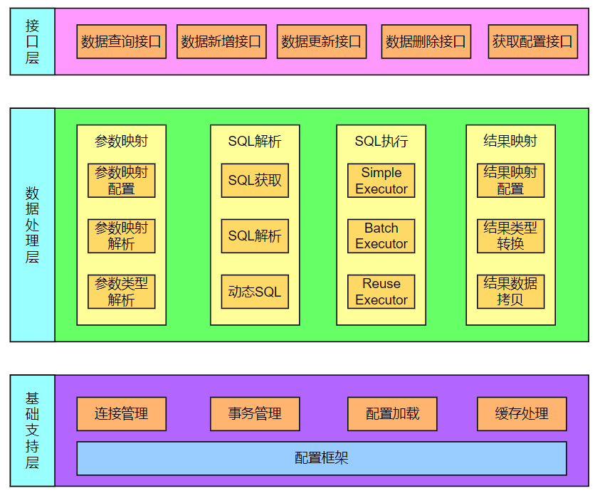

# MyBatis

## 前言

> [官方文档](https://mybatis.org/mybatis-3/)

> 在操作 MySQL 的时候，需要先启动服务，再使用客户端连接，开启一个会话（Session），才能在会话中进行增删改查操作。单纯的 JDBC 只能支持单个数据库连接，数据库操作需要频繁的打开和关闭会话连接。于是出现了数据源（DataSource），比如说 Druid DataSource，维护一个连接池，管理和维护多个会话连接。不管是 JDBC 还是数据源，都不能饶过会话，所有对数据库的操作都是在会话中进行的。**会话是数据库操作中很重要的一环**。
>

> MyBatis 是一个持久层框架，支持定制化 SQL 以及高级映射，可将 Java 类型/接口/POJO 映射为数据库中的记录。MyBatis 可以使用的 XML 或编码的方式来创建和配置。
>
> 在引入了 MyBatis 后，可以将数据源交给 MyBatis 管理。数据源的连接池维护和管理多个会话，MyBatis 管理数据源，这样一来，MyBatis 也就间接的管理了会话。
>
> 会话很重要，在 MyBatis 中同样如此，所有的 MyBatis 操作都是通过会话进行的。因此就可以围绕 MyBatis **创建会话前要做什么，如何创建会话，创建会话后**这几个方面出发来了解 MyBatis。
>
> * 创建会话前，解析配置文件，处理接口和 XML 映射等
> * 如何创建会话，工厂模式（SqlSessionFactory）
> * 创建会话后，进行会话操作（SqlSession）

> **MyBatis 特点**
>
> MyBatis 是一个**半自动的 ORM **框架（Object Relational Mapping，对象关系映射），通过使用描述对象和数据库之间映射的元数据，将对象自动持久化到关系数据库中，本质上就是将数据从一种形式转换到另外一种形式。
>
> 一般来说，对数据库的操作包括：编写 SQL –> 预编译 –> 设置参数 –> 执行 SQL –> 封装结果。
>
> * MyBatis 将编写 SQL 的步骤交给开发者，是半自动的；
> * JPA 帮助开发者生成 SQL，是全自动的。
>
> 在 MyBatis 中支持编写原生 SQL，灵活度高。内部封装 JDBC，开发时只需要关注 SQL 语句本身。
>
> MyBatis 可以使用 **XML** 或**注解**来配置和进行关系映射，避免了几乎所有的 JDBC 连接和维护代码，同时也处理好了 POJO 和数据库记录之间的映射，以及将结果映射为 Java 对象。
>

> **优点**
>
> 1、基于 SQL 语句编程，相当灵活；提供 XML 标签，支持编写**动态 SQL **语句，支持 SQL 重用；
>
> 2、消除了 JDBC 大量冗余的代码；
>
> 3、与各种数据库兼容（内部封装 JDBC，只要 JDBC 支持的数据库 MyBatis 都支持）
>
> 4、提供**映射标签**，支持对象与数据库的 ORM 字段关系映射；提供**对象关系映射标签**，支持对象关系组件维护
>
> 5、能够与 Spring/SpringBoot 很好的集成
>
> <br>
>
> **缺点**
>
> 1、SQL 语句的编写工作量较大，尤其当字段多、关联表多时，SQL 语句较为复杂。
>
> 2、SQL 语句依赖于数据库，导致数据库移植性差，不能随意更换数据库

> **与 Hibernate 对比**
>
> 1、Hibernate 是全自动的 ORM 框架；
>
> 2、Hibernate 对象/关系映射能力强，数据库无关性好，对于关系模型要求高的软件，开发可以节省很多代码，提高效率；
>
> 3、MyBatis 支持编写原生 SQL，灵活度高。灵活的后果是 MyBatis 无法做到数据库无关性，如果需要实现支持多种数据库的软件，则需要自定义多套 SQL 映射。


<br>

## 整体架构

MyBatis 最顶层的是接口层，即 Mapper 接口定义，包含了对数据库的 CRUD 操作方法。数据处理层主要是配置 Mapper 到 XML 之间的参数映射，SQL 解析，SQL 执行，结果映射的过程；基础支持层包括连接管理，事务管理，配置加载和缓存管理等。




<br>

### 接口层

SqlSessionFactory 和 SqlSession 是 MyBatis 的核心接口。

> **SqlSessionFactory**
>
> 主要负责创建 SqlSession，SqlSessionFactory 有两个实现类：
>
> - DefaultSqlSessionFactory
> 
>  SqlSessionFactory 的默认实现类，这个类的实例是全局共享的，只会在首次调用时生成一个实例（单例模式），就一直存在直到应用关闭。
> 
>- SqlSessionManager
> 
>  已被废弃，内部需要维护一个 ThreadLocal，用来维护当前线程的 SqlSession。而使用 MyBatis 更多的是要与 Spring 进行集成，SqlSession 已经交由 Spring 来管理，再无维护 ThreadLocal 的意义。

> **SqlSession**
>
> SqlSession 接口中定义了一系列获取数据库连接方法、CRUD 操作方法、getMapper 方法、以及事务操作方法。


<br>

### 数据处理层

> **配置解析**
>
> 负责解析 MyBatis 配置，解析后的信息会保存到 Configuration 类中。

> **SQL 解析**
>
> * SqlSource，表示从 XML 文件或注释读取的映射语句的内容，它将从用户接收的输入参数传递给数据库，创建对应的 SQL。
> * MappedStatement，保存 SQL 语句、参数类型、结果类型、缓存等配置信息，每个 SQL 映射语句在 MyBatis 中都会被解析为一个 MappedStatement 对象。在运行时，MyBatis 会根据调用的方法，获取对应 MappedStatement 对象中的信息，生成相应的 SQL 语句，并执行该语句，然后将结果映射为 Java 对象。

> **SQL 执行**
>
> SQL 语句的执行涉及多个组件，包括：
>
> - ParameterHandler，负责将用户传递的参数转换成 JDBC Statement 所需要的参数；
> - StatementHandler，封装了 JDBC Statement 操作；
> - TypeHandler，用于 Java 类型和 JDBC 类型之间的转换；
> - SqlSession，执行 SQL 命令，获取映射，管理事务；
> - Executor，负责 SQL 语句的生成以及查询缓存的维护。

> **结果映射**
>
> ResultSetHandler，负责将 JDBC 返回的 ResultSet 结果集对象转换成 List 类型的集合。


<br>

### 基础支持层

> **反射模块**
>
> MyBatis 中的反射模块，对 Java 反射进行封装，缓存类的元数据（MetaClass）和对象的元数据（MetaObject）。
>
> **类型转换模块**
>
> 主要有两个功能：
>
> * MyBatis 的别名机制，为 POJO 设置别名；
> * JDBC 类型与 Java 类型的转换。在 SQL 语句绑定参数时，由 Java 类型转换成 JDBC 类型；在映射结果集时，由 JDBC 类型转换成 Java 类型。
>
> **日志模块**
>
> MyBatis 支持集成多种日志框架，日志模块的主要功能就是集成第三方日志框架。
>
> **资源加载模块**
>
> 封装类加载器，确定类加载器的使用顺序，并提供加载类文件和其它资源文件的功能。
>
> **解析器模块**
>
> 该模块有两个主要功能：
>
> * 封装 XPath，为 MyBatis 初始化时解析配置文件以及映射配置文件提供支持；
> * 为处理动态 SQL 语句中的占位符提供支持。
>
> **数据源模块**
>
> MyBatis 自身提供了相应的数据源实现，也提供了与第三方数据源集成的接口。
>
> **事务管理模块**
>
> 一般来说 MyBatis 与 Spring 框架集成，由 Spring 框架管理事务。MyBatis 自身也对数据库事务进行了抽象，提供了相应的事务接口和简单实现。
>
> **缓存模块**
>
> MyBatis 中有**一级缓存**和**二级缓存**，这两级缓存都依赖于缓存模块中的实现。需要注意，这两级缓存与MyBatis 以及整个应用是运行在同一个 JVM 中的，共享同一块内存。如果这两级缓存中的数据量较大，则可能影响系统中其它功能，所以需要缓存大量数据时，优先考虑使用 Redis、Memcache 等缓存产品。
>
> **Binding 模块**
>
> 在调用 SqlSession 相应方法执行数据库操作时，需要指定映射文件中定义的 SQL 节点，如果 SQL 中出现了拼写错误，那就只能在运行时才能发现。
>
> 为了能尽早发现这种错误，MyBatis 通过 Binding 模块将用户自定义的 Mapper 接口与映射文件关联起来，系统可以通过调用自定义 Mapper 接口中的方法执行相应的 SQL 语句完成数据库操作，从而避免上述问题。在开发中，只创建 Mapper 接口，并没有编写实现类，因为 MyBatis 自动为 Mapper 接口创建了动态代理对象。


<br>

## 配置文件

> 配置文件内的标签需要保持一定的顺序：
>
> * properties 属性
>
> * settings 设置
>
> * typeAliases 类型别名
>
> * typeHandlers 类型处理器
>
> * objectFactory 对象工厂，MyBatis 创建结果对象的新实例时，都会使用对象工厂来完成实例化工作
>
> * plugins 插件，MyBatis 允许在映射语句执行过程中的某些时刻进行拦截调用
>
> * environments 环境配置
>
> * databaseIdProvider 数据库厂商标识
>
> * mappers 映射器
>
> 顺序不能颠倒，比如 settings 不能放在 environments 后面。

```xml
<?xml version="1.0" encoding="UTF-8" ?>
<!DOCTYPE configuration
        PUBLIC "-//mybatis.org//DTD Config 3.0//EN"
        "http://mybatis.org/dtd/mybatis-3-config.dtd">
<configuration>
    <properties>
        <property name="username" value="root"/>
        <property name="password" value=""/>
        <property name="url" value="jdbc:mysql://localhost:3306/db_test?useSSL=false"/>
        <property name="driver" value="com.mysql.cj.jdbc.Driver"/>
    </properties>
    <typeAliases>
        <package name="com.demo.mapper"/>
    </typeAliases>
    <environments default="development">
        <environment id="development">
          	<transactionManager type="JDBC" />
            <dataSource type="POOLED">
                <property name="driver" value="${driver}"/>
                <property name="url" value="${url}"/>
                <property name="username" value="${username}"/>
                <property name="password" value="${password}"/>
            </dataSource>
        </environment>
    </environments>
    <mappers>
        <mapper resource="mapper/UserMapper.xml"/>
    </mappers>
</configuration>
```

<br>

**配置加载**

```java
String resource = "mybatis-config.xml";
// MyBatis 有一个 Resources 的工具类，包含获取资源的方法
InputStream inputStream = Resources.getResourceAsStream(resource);
SqlSessionFactory sqlSessionFactory = new SqlSessionFactoryBuilder().build(inputStream);
// 创建 SqlSession
SqlSession sqlSession = sqlSessionFactory.openSession();
// 获取到的实际上是一个动态代理 MapperProxy 对象
UserMapper userMapper = sqlSession.getMapper(UserMapper.class);
```


<br>

## 功能

### 结果映射

> * resultMap 标签，逐一定义数据库列名和对象属性名之间的映射关系
> * SQL 的 as 关键字设置列别名，将列的别名设置为对象属性名

有了列名与属性名的映射关系后，MyBatis 通过反射创建对象，使用反射给对象的属性逐一赋值并返回。找不到映射关系的属性，无法完成赋值。

```xml
<resultMap type="com.domain.Order" id="orderResultMap">
  <!–- id 属性映射主键字段 -–>  
  <id property="id" column="order_id">
  <!–- result 映射非主键字段，property 为实体类属性，column 为数据表字段 -–>
  <result property = "orderNo" column = "order_no" />    
  <result property="price" column="order_price" />
</reslutMap>
<select id="getOrder" parameterType="int" resultMap="orderResultMap">
  select * from orders where order_id=#{id}
</select>
```

<br>

### 参数传递

**`#{}` 表示占位符**

- 可以实现 preparedStatement 向占位符中设置值，自动进行 Java 类型和 JDBC 类型转换，可以有效防止 SQL 注入；

- 可以接收简单类型值或 POJO 属性值。MyBatis 在处理 `#{}` 时，会将 SQL 中的 `#{}` 替换为 `?` 号，调用 PreparedStatement 的 set 方法来赋值。

**`${}` 表示拼接 SQL 串**

通过 `${}` 可以将 parameterType 传入的内容拼接在 SQL 中且不进行 JDBC 类型转换。MyBatis 在处理 `${}` 时，就是把 `${}` 替换成方法参数的值。

<br>

### 多参数传递

> 有 3 种方式：
>
> * 数字占位
> * @param 注解
> * 多参数封装成 map
>
> 常用前两种。

**数字占位**

```java
// 对应的 xml 中 #{0} 代表接收第一个参数，#{1} 代表第二参数，以此类推
public User selectUser(String name, int id);
```

```xml
<select id="selectUser" resultMap="BaseResultMap">     
	select * from user where name = #{0} and id = #{1}
</select>
```

<br>

**@param 注解**

```java
public interface UserMapper {
    User selectUser(@param(“name”) String username,
                    @param(“id”) int id);
}
```

```xml
<select id="selectUser" resultType="User">
  select *
  from user
  where username = #{username}
  and id = #{id}
</select>
```

**多参数封装成 Map**

```xml
<select id="selectUser" resultType="Map">
	select * from user limit #{start}, #{end}
</select>
```

```java
int start, end;
Map<String, Object> params = new HashMap<>();
params.put("start", 0);
params.put("end", 5);
sqlSession.selectList(params)
```


<br>

### 模糊查询

在 Java 代码中添加 SQL 通配符

```java
String param = "%smi%";
List<String> names = mapper.selectLike(param);
```

```xml
<select id="selectLike">
	select * from user where name like #{value}
</select>
```

在 SQL 语句中拼接通配符（会引起 SQL 注入）

```java
String param = "smi";
List<String> names = mapper.selectLike(param);
```

```xml
<select id="selectLike">
	select * from user where name like "%"#{value}"%"
</select>
```


<br>

### 获取自动生成(主)键值

insert 方法总是返回一个 int 值 ，这个值代表的是插入的行数。如果采用自增长策略，自动生成的键值在 insert 方法执行完后可以被设置到传入的参数对象中。

```xml
<insert id ="insertname" usegeneratedkeys="true" keyproperty="id" >
    insert into names (name) values (#{name})
</insert>
```

```java
User user = new User();
user.setName(“fred”);

int rows = mapper.insertUser(user);
// 完成后 id 已经被设置到对象中
system.out.println(“rows inserted = ” + rows);
system.out.println(“generated key value = ” + user.getId());
```

**在 xml 中使用返回的主键值**

```xml
<!--
	keyProperty="id": 将返回的主键放入传入参数的 id 中保存.
	order: 当前函数相对于 insert 语句的执行顺序，
				在 insert 前执行是 BEFORE，在 insert 后执行是 AFTER
-->
<insert id="insertBook" parameterType="Book">
    <selectKey keyProperty="bookId" order="AFTER" resultType="java.lang.Integer">
        select
        LAST_INSERT_ID()
    </selectKey>
    insert into
    book (bookname,price)
    values (#{bookName},#{price})
</insert>
```


<br>

### 分页

MyBatis 中有两种分页方式：

* 使用 RowBounds 对象进行分页，是针对 ResultSet 结果集执行的内存分页；
* 在 SQL 中添加 limit 参数来完成物理分页功能，也可以使用分页插件来完成物理分页。

分页插件的基本原理是拦截待执行的 SQL，然后重写 SQL，根据 Dialect 方言，添加对应的物理分页语句和物理分页参数。


<br>

### 插件

> MyBatis 允许在映射语句执行过程中的某一时刻进行拦截调用，默认情况下，MyBatis 允许使用插件来拦截的方法调用包括
>
> - Executor 接口中的方法，如 update/query/flushStatements/commit/rollback/getTransaction/close/isClosed
> - ParameterHandler 接口中的方法，如 getParameterObject/setParameters
> - ResultSetHandler 接口中的方法，如 handleResultSets/handleOutputParameters
> - StatementHandler 接口中的方法，如 prepare/parameterize/batch/update/query

**自定义插件**

```java
// 拦截 Executor 的 update(MappedStatement, Object) 方法
@Intercepts({@Signature(
  type= Executor.class,
  method = "update",
  args = {MappedStatement.class,Object.class})})
public class ExamplePlugin implements Interceptor {
  private Properties properties = new Properties();

  @Override
  public Object intercept(Invocation invocation) throws Throwable {
    // pre processing
    Object returnObject = invocation.proceed();
    // post processing
    return returnObject;
  }

  @Override
  public void setProperties(Properties properties) {
    this.properties = properties;
  }
}
```

**注册插件**

```xml
<!-- 将插件注册到 MyBatis -->>
<plugins>
  <plugin interceptor="org.mybatis.example.ExamplePlugin">
    <property name="someProperty" value="100"/>
  </plugin>
</plugins>
```

<br>


## 核心接口/类

### 配置解析

下面是一段从 XML 配置文件创建 SqlSessionFactory 和 SqlSession 的代码：

```java
String resource = "mybatis-config.xml";
// MyBatis 提供 Resources 工具类，包含获取配置资源的方法
InputStream inputStream = Resources.getResourceAsStream(resource);
SqlSessionFactory sqlSessionFactory = new SqlSessionFactoryBuilder().build(inputStream);// 创建 SqlSession
SqlSession sqlSession = sqlSessionFactory.openSession();
// 获取到的实际上是一个动态代理 MapperProxy 对象
UserMapper userMapper = sqlSession.getMapper(UserMapper.class);
```

总结一下其中步骤如下：

1. 解析 XML 配置；
2. 创建 Configuration 类；
3. 根据配置 SqlSessionFactory；
4. 调用 SqlSessionFactory#openSession，创建 SqlSession。

接下来先简单看一下其中的代码逻辑：

<br>

#### SqlSessionFactoryBuilder

负责创建 SqlSessionFactory，内部定义了多种方法，用于从不同途径创建 SqlSessionFactory，比如 XML 文件、输入流、Configuration 配置类等。

```java
public class SqlSessionFactoryBuilder {
  // 从输入流创建 SqlSessionFactory
  public SqlSessionFactory build(InputStream inputStream) {
    return build(inputStream, null, null);
  }
  public SqlSessionFactory build(InputStream inputStream, String environment, Properties properties) {
    try {
      // 解析 XML 输入流
      // 这一步会创建 Configuration 类
      XMLConfigBuilder parser = new XMLConfigBuilder(inputStream, environment, properties);
      
      // parser.parse() 方法会先检查是否解析过 XML，如果已解析过就抛异常
      // 否则开始解析配置文件，最后返回 Configuration 对象
      return build(parser.parse());
    }
  }
  
  // 创建 SqlSessionFactory
  // 实际上 SqlSessionFactoryBuilder 中的方法最后调用的都是 build 方法
  // Configuration 类定义了 MyBatis 的各种配置，如环境信息、缓存、懒加载等。
  public SqlSessionFactory build(Configuration config) {
    return new DefaultSqlSessionFactory(config);
  }
}
```

<br>

#### SqlSessionFactory*

从 XML 文件中构建 SqlSessionFactory 的实例，可以使用类路径下的资源文件进行配置，也可以使用任意的输入流（InputStream）实例，比如用文件路径字符串或 `file://URL` 构造的输入流。

```java
public interface SqlSessionFactory {
  SqlSession openSession();
  Configuration getConfiguration();
}
```

<br>

#### DefaultSqlSessionFactory

SqlSessionFactory 子类，用于创建 SqlSession。

```java
public class DefaultSqlSessionFactory implements SqlSessionFactory {
  // 从 DataSource 开启 session
  // 一般来说，如果配置了 DataSource 就会使用此方法打开 session
  private SqlSession openSessionFromDataSource(ExecutorType execType, TransactionIsolationLevel level, boolean autoCommit) {
    try {
      // ...
      // 创建 SqlSession
      return new DefaultSqlSession(configuration, executor, autoCommit);
    }
  }

  // 从 Connection 开启 session
  private SqlSession openSessionFromConnection(ExecutorType execType, Connection connection) {
    try {
      // ...
      return new DefaultSqlSession(configuration, executor, autoCommit); // 创建 sesion
    }
  }
}
```

<br>

上述创建流程比较简单，得到 SqlSession 之后就可以进行数据库操作了。SqlSession 接口中定义了关于数据库操作的 CRUD 方法、获取 Mapper 映射的方法和事务有关的方法。

思考一下，我们在 XML 中编写一条 SQL，在 Java 的接口中编写一个方法就能完成对数据库的操作，这是如何完成的？**mapper 标签中的 SQL 如何与 Java 接口方法对应起来？**接着往下看。

<br>

### 接口与映射绑定

实际上创建 Configuration 的时候会初始化 MapperRegistry，用于注册 Mapper 接口与映射文件的信息。

```java
// Configuration.java 
// 初始化 Configuration 类时创建 MapperRegistry 用于注册 Mapper 映射和 Mapper 接口信息
protected final MapperRegistry mapperRegistry = new MapperRegistry(this);
```

然后解析配置文件中的 mapper 标签，大概流程如下：

1. 使用 XMLConfigBuilder 类解析 XML 标签，比如 mapper 标签；
2. 将 Java Mapper 接口和对应的 XML 映射绑定；
3. 创建 Java 接口代理，将接口信息和接口代理保存到 MapperRegistry。

<br>

XMLConfigBuilder#parseConfiguration 会逐个解析 XML 文件的标签，遇到 mapper 标签的时候会将其注册到 MapperRegistry 中，MapperRegistry 实际上是使用 HashMap 来保存 mapper 映射关系的。

先来看一下 XMLConfigBuilder 如何解析 mapper 标签：

1、XMLConfigBuilder#parseConfiguration 解析配置文件

2、XMLConfigBuilder#mapperElement 处理 mapper 标签

3、如果是：

* `<package name="">` 直接添加 Configuration#addMappers(String)
* `<mapper resource=""> ` 或 `<mapper url=""> ` 使用 XMLMapperBuilder#parse -> XMLMapperBuilder#bindMapperForNamespace -> Configuration#addMapper
* `<mapper class=""> ` 直接添加 Configuration#addMapper

详细分析 XMLConfigBuilder#mapperElement：

```java
private void mapperElement(XNode parent) throws Exception { // 处理 mapper 标签
  if (parent != null) {
    for (XNode child : parent.getChildren()) {
      if ("package".equals(child.getName())) { // <package name="">
        String mapperPackage = child.getStringAttribute("name");
        configuration.addMappers(mapperPackage);
      } else {
        // <mapper resource="">
        String resource = child.getStringAttribute("resource");
        // <mapper url="">
        String url = child.getStringAttribute("url");
        // <mapper class="">
        String mapperClass = child.getStringAttribute("class");
        if (resource != null && url == null && mapperClass == null) {
          // 处理 resource
          try(InputStream inputStream = Resources.getResourceAsStream(resource)) {
            // XMLMapperBuilder 专门解析 Mapper.xml
            XMLMapperBuilder mapperParser = new XMLMapperBuilder(inputStream, configuration, resource, configuration.getSqlFragments());
            mapperParser.parse();
          }
        } else if (resource == null && url != null && mapperClass == null) {
          // 处理 url
          try(InputStream inputStream = Resources.getUrlAsStream(url)){
            XMLMapperBuilder mapperParser = new XMLMapperBuilder(inputStream, configuration, url, configuration.getSqlFragments());
            mapperParser.parse();
          }
        } else if (resource == null && url == null && mapperClass != null) {
          // 处理 class
          Class<?> mapperInterface = Resources.classForName(mapperClass);
          configuration.addMapper(mapperInterface); // 接口与映射绑定关键
        }
      }
    }
  }
}
```

先看一下 resource/url/class 这三种情况：先使用 Resources 工具类，从输入流解析 Mapper 文件，将 Mapper 信息保存到 XMLMapperBuilder 类，然后开始解析。

```java
public void parse() {
  if (!configuration.isResourceLoaded(resource)) { // 如果当前 XXXMapper.xml 未解析
		// 从 mapper 根标签开始逐个标签进行解析
    configurationElement(parser.evalNode("/mapper"));
    configuration.addLoadedResource(resource); // 添加到已解析集合
    bindMapperForNamespace(); // 将 Mapper 接口和映射文件绑定
  }
	// ...
}
```

```java
private void bindMapperForNamespace() {
  String namespace = builderAssistant.getCurrentNamespace(); // 获取 xml 中的 namespace
  if (namespace != null) {
    Class<?> boundType = null;
    try {
      boundType = Resources.classForName(namespace); // 利用反射创建对应 class
    }
    if (boundType != null && !configuration.hasMapper(boundType)) {
      // Spring may not know the real resource name so we set a flag
      // to prevent loading again this resource from the mapper interface
      // look at MapperAnnotationBuilder#loadXmlResource
      configuration.addLoadedResource("namespace:" + namespace);
      configuration.addMapper(boundType);
    }
  }
}
```

接口与映射绑定关键在于 Configuration#addMapper 方法：

```java
public <T> void addMapper(Class<T> type) {
  if (type.isInterface()) {
    // if (hasMapper(type)) { throw new BindingException(); }
    boolean loadCompleted = false;
    try {
      // 将接口信息和接口代理放入 knownMappers
      // 实际执行数据库操作的是 MapperProxyFactory 类
      knownMappers.put(type, new MapperProxyFactory<>(type));
      // ...
    } finally {
      if (!loadCompleted) {
        knownMappers.remove(type);
      }
    }
  }
}
```

knownMappers 实际上就是一个 HashMap：

```java
// org.apache.ibatis.binding.MapperRegistry
private final Map<Class<?>, MapperProxyFactory<?>> knownMappers = new HashMap<>();
```

到这里我们大概了解了 Mapper 接口和映射文件之间如何绑定，接下来看一下**接口中的方法会被如何处理？我们并没有编写方法的实现，但是却能正常执行对应的方法，这是如何做到的？**

<br>

### 接口方法生成

#### XMLConfigBuilder

#### MapperRegistry

将 Mapper 接口和 Mapper 映射保存在 knownMappers 属性中，实际上 knownMappers 是一个 HashMap。key 是 Mapper 接口的全限定类名，value 是 Mapper 接口的动态代理类 MapperProxyFactory 的实例

```java
public class MapperRegistry {
  private final Configuration config;
  // 保存 Mapper 与 Mapper 代理
  private final Map<Class<?>, MapperProxyFactory<?>> knownMappers = new HashMap<>();
}
```


<br>

#### MappedStatement

保存 xml 映射文件信息，以及 Mapper 接口中的方法和 xml 映射文件对应 SQL 对应信息。在 xml 映射文件中，每一个 select/insert/update/delete 标签都会被解析为一个 MapperStatement 对象。

> Mapper 接口没有实现类，当调用接口方法时，接口全限名和对应方法名拼接作为 key 值，可定位唯一个 MapperStatement。
>
> 例如，执行 `com.demo.mapper.userMapper#count`，会定位到 id 为 `com.demo.mapper.UserMapper.count` 的 MapperStatement，然后执行对应的 SQL 语句。

```java
public final class MappedStatement {
  // 代理对象实例对应的 mapper 映射
  // 比如当前实例是 UserMapper
  // resource="mapper/UserMapper.xml"
  private String resource;
  // MyBatis 配置类
  private Configuration configuration;
  // 当前执行的方法
  // 比如当前执行 UserMapper#count
  // id= com.demo.mapper.UserMapper.count
  private String id;
  // STATEMENT | PREPARED | CALLABLE
  private StatementType statementType;
  private ResultSetType resultSetType;
  // 执行方法对应的 SQL 语句
  private SqlSource sqlSource;
  private Cache cache;
  private ParameterMap parameterMap;
  private List<ResultMap> resultMaps;
  private boolean flushCacheRequired;
  private boolean useCache;
  private boolean resultOrdered;
  // SQL 类型 select|update|insert|delete
  private SqlCommandType sqlCommandType;
  // 主键生成器
  private KeyGenerator keyGenerator;
  private String[] keyProperties;
  private String[] keyColumns;
  private boolean hasNestedResultMaps;
  private String databaseId;
  private Log statementLog;
  private LanguageDriver lang;
  private String[] resultSets;
}
```

<br>


### 执行阶段

#### SqlSession*

> MyBatis 的主要接口，定义了 SQL 执行、Mapper 映射获取、事务管理等方法。

```java
public interface SqlSession extends Closeable
```

**内部方法**

```java
<T> T selectOne(String statement);
<E> List<E> selectList(String statement);
<K, V> Map<K, V> selectMap(String statement, String mapKey);
int insert(String statement);
int update(String statement);
int delete(String statement);
void commit();
void rollback();
<T> T getMapper(Class<T> type);
Connection getConnection();
```


<br>

#### DefaultSqlSession

> SqlSession 的默认实现类。

```java
public class DefaultSqlSession implements SqlSession
```

```java
// selectList 为例
// statement = 全限定类名+方法名
private <E> List<E> selectList(String statement, Object parameter, RowBounds rowBounds, ResultHandler handler) {
  try {
    // 获取对应的 MappedStatement
    MappedStatement ms = configuration.getMappedStatement(statement);
    // executor 执行查询方法，会调用 CachingExecutor#query
    return executor.query(ms, wrapCollection(parameter), rowBounds, handler);
  }
}
```


<br>

#### MapperProxy

> Mapper 接口的动态代理类。MyBatis 在初始化阶段会为每一个 Mapper 接口创建一个代理类，保存在 MapperRegistry 的 knownMappers 属性中。

```java
public class MapperProxy<T> implements InvocationHandler, Serializable
```

```java
// 获取到的实际上是一个动态代理 MapperProxy 对象
UserMapper userMapper = sqlSession.getMapper(UserMapper.class);
```


<br>

#### MapperMethod

> 负责执行代理类 MapperProxy 的方法。

```java
public class MapperMethod {}
```

```java
public Object execute(SqlSession sqlSession, Object[] args) {
  Object result;
  switch (command.getType()) { // 根据 Type 执行不同的方法
    case INSERT: {}
    case UPDATE: {}
    case DELETE: {}
    case SELECT:
      break;
    case FLUSH:
      result = sqlSession.flushStatements();
      break;
    default:
      // throw new BindingException();
  }
  if (result == null && method.getReturnType().isPrimitive() && !method.returnsVoid()) {/**throw new BindingException();*/}
  return result;
}
```

以 select 查询为例，执行流程如下：

1、MapperMethod#execute

2、DefaultSqlSession#selectOne(String, Object)

3、DefaultSqlSession#selectList(String, Object, RowBounds, ResultHandler)

4、BaseExecutor#query(MappedStatement,Object,RowBounds,ResultHandler,CacheKey,BoundSql)


<br>

**Mapper 接口的方法不可重载**

Mapper 接口的方法不能重载。因为在定位唯一 MapperStatement 时，使用的是 `全限名+方法名` 的策略。如果存在多个同名方法则无法定位到唯一的 MapperStatement。


<br>

## Spring 集成

> [mybatis-spring](https://mybatis.org/spring/zh/)

### SqlSessionFactoryBean

> 用于创建 SqlSessionFactory 的 FactoryBean.

```java
public class SqlSessionFactoryBean
    implements FactoryBean<SqlSessionFactory>, InitializingBean, ApplicationListener<ApplicationEvent>
```

**创建 SqlSessionFactoryBean** 

> MybatisAutoConfiguration#sqlSessionFactory 会创建一个全局共享的 SqlSessionFactoryBean 交由 Spring IoC 管理

```java
@Bean
@ConditionalOnMissingBean
public SqlSessionFactory sqlSessionFactory(DataSource dataSource) throws Exception {
  SqlSessionFactoryBean factory = new SqlSessionFactoryBean();
}
```

**创建 SqlSessionFactoryBuilder**

```java
// 实例化 SqlSessionFactoryBean 的时候就会跟着创建 SqlSessionFactoryBuilder
private SqlSessionFactoryBuilder sqlSessionFactoryBuilder = new SqlSessionFactoryBuilder();
```

<br>

### SqlSessionTemplate

> SqlSession 的实现类，由 Spring 管理，效果类似 DefaultSqlSession。

```java
public class SqlSessionTemplate implements SqlSession, DisposableBean
```


<br>

### SqlSessionUtils

管理 SqlSession 的生命周期，可以注册 SqlSession 到 Spring 或者从 Spring 中获取 SqlSession。提供了几个静态方法：

* closeSqlSession
* getSqlSession
* isSqlSessionTransactional(SqlSession, SqlSessionFactory)，如果传过去的参数 SqlSession 已经被 Spring 管理则返回 true


<br>

## SpringBoot 集成

> [mybatis-spring-boot](https://mybatis.org/spring-boot-starter/mybatis-spring-boot-autoconfigure/)

> 所有核心接口/类的创建都是从 MybatisAutoConfiguration 的初始化及其内部对应方法调用开始的。Mabais 的核心配置类为 MybatisProperties，配置文件的位置和 mapper 映射文件的位置等都是在这个类内部配置的


<br>

## 参考

[MyBatis SQL 如何执行](https://mp.weixin.qq.com/s/N4LPTmlKRrUPvZ0axzO0GA)

[MyBatis 的 mapper接口如何工作？](https://mp.weixin.qq.com/s/5A6RHkAjJlcEjBdMW6kqVQ)

https://mp.weixin.qq.com/s/E6sRawj1YdnRapwqYXC2gg