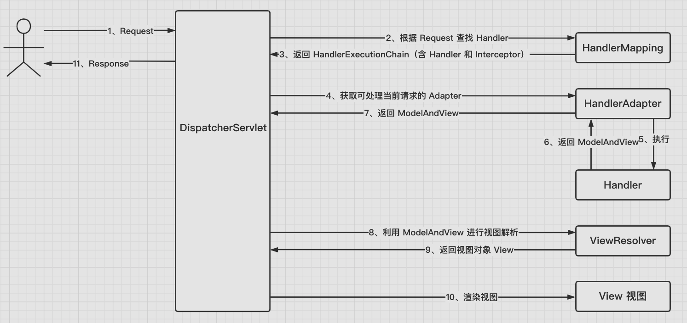
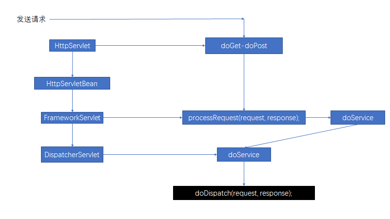
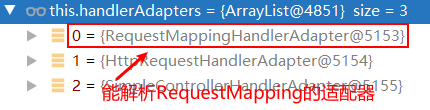

#  Spring MVC

## 前言

> Spring Web MVC 是建立在 Servlet API 上的 Web 框架


<br />

## 使用

**依赖**

```xml
<dependency>
    <groupId>org.springframework</groupId>
    <artifactId>spring-webmvc</artifactId>
  	<version>@latest</version>
</dependency>
```


<br />

## Servlet

**Servlet 容器**

先说**容器**概念，一个 Web 程序需要运行在一个 Web 容器中，如 Tomcat/Undertow 等，Web 容器为 Web 程序提供运行环境。Web 容器可以通过使用 Servlet 容器来管理 Servlet，以及进行监听和过滤请求等操作。


<br />

### Servlet Config

在一个 Servlet 环境中，可以通过编码或者 xml 配置的方式来配置 Servlet 容器的属性。


<br />

### DispatcherServlet

> Spring Web MVC 是基于 Servlet 构建的 Web 框架，DispatcherServlet 是核心类，用于将来自客户端的请求分发到其他组件，实际的工作是委托其他组件来完成的。
>
> DispatcherServlet 和其它的 Servlet 一样，需要在 Java 或者 xml 文件中配置 Servlet 映射。


#### 配置

**编码实现**

> 在 Servlet 容器中注册一个 DispatcherServlet 并配置映射

```java
public class MyWebApplicationInitializer implements WebApplicationInitializer {

    @Override
    public void onStartup(ServletContext servletContext) {

        // Load Spring web application configuration
        AnnotationConfigWebApplicationContext context = new AnnotationConfigWebApplicationContext();
        context.register(AppConfig.class);

        // Create and register the DispatcherServlet
        DispatcherServlet servlet = new DispatcherServlet(context);
        ServletRegistration.Dynamic registration = servletContext.addServlet("app", servlet);
      	// 配置当前 DispatcherServlet 的启动优先级
      	// 默认值是 -1
      	// 大于等于 0 表示容器必须在 ServletContext 的初始化阶段对当前 Servlet 进行实例化和初始化
        registration.setLoadOnStartup(1);
        registration.addMapping("/app/*");
    }
}
```


WebApplicationInitializer 是 Spring MVC 提供的一个接口，用于初始化和配置 Servlet 容器。

除此之外，还可以使用 [AbstractDispatcherServletInitializer](https://docs.spring.io/spring-framework/docs/current/reference/html/web.html#mvc-container-config) 重写对应的方法，以更方便的注册 DispatcherServlet 和修改容器配置：

* createDispatcherServlet，实现自定义 DispatcherServlet
* getServletMappings，修改 Servlet 映射
* getServletFilters，增加 Filter
* ...


<br />

**xml 实现**

```xml
<web-app>
    <listener>
        <listener-class>org.springframework.web.context.ContextLoaderListener</listener-class>
    </listener>
    <context-param>
        <param-name>contextConfigLocation</param-name>
        <param-value>/WEB-INF/app-context.xml</param-value>
    </context-param>
    <servlet>
        <servlet-name>dispatcherServlet</servlet-name>
        <servlet-class>org.springframework.web.servlet.DispatcherServlet</servlet-class>
        <load-on-startup>1</load-on-startup>
    </servlet>
    <servlet-mapping>
        <servlet-name>dispatcherServlet</servlet-name>
        <url-pattern>/*</url-pattern>
    </servlet-mapping>
</web-app>
```


<br />

#### WebApplicationContext


<br />

#### 分发请求

当 DispatcherServlet 接收到请求时，它会将请求委派给**指定的类**来处理该请求，或者渲染指定的视图。

**指定的类**，指的是由 Spring IoC 容器管理的，用于 Web 操作的实例对象，包括：

| Bean type                             | 解释说明                                                     |
| ------------------------------------- | ------------------------------------------------------------ |
| HandlerMapping                        | 将请求映射到对应 handler（handler 实际上对应的就是一个 Java 类），并带有一系列预处理和后处理拦截器。有两个主要实现类：RequestMappingHandlerMapping（用以支持 @RequestMapping） 和 SimpleUrlHandlerMapping（将 URL 与指定的 handler 映射）。 |
| HandlerAdapter                        | 帮助 DispatcherServlet 处理 handler 与 request 的映射        |
| HandlerExceptionResolver              | 异常处理                                                     |
| ViewResolver                          | 将 handler 返回的字符串视图名解析为一个实际的视图，并渲染到 response |
| LocaleResolver, LocaleContextResolver | 提供国际化支持                                               |
| ThemeResolver                         | 主题解析器                                                   |
| MultipartResolver                     | 文件上传相关的抽象类                                         |
| FlashMapManager                       | 通常用于重定向，保存和获取 `FlashMap`，可将属性保存到 FlashMap 中，重定向时从一个请求传递到另一个请求 |

以上 9 个接口/类称为 Spring MVC 的 9 大组件。

Servlet 容器启动过程中，会检查 DispatcherServlet，看是否有上述 9 大组件的自定义实现。如果有，则进行配置；如果没有，则使用[默认配置](https://github.com/spring-projects/spring-framework/blob/main/spring-webmvc/src/main/resources/org/springframework/web/servlet/DispatcherServlet.properties)处理请求。


<br />

#### 请求处理流程

1、当请求来到 DispatcherServlet，WebApplicationContext 会作为一个属性绑定在请求中，提供给其他组件使用，默认被绑定在 `DispatcherServlet.WEB_APPLICATION_CONTEXT_ATTRIBUTE` 属性中；

2、如果需要 LocaleResolver，则将 LocaleResolver 绑定到请求上，以便让流程中的其他步骤在处理请求时使用（渲染视图、准备数据等）；

3、如果需要 ThemeResolver，则绑定到请求上；

4、如果指定 MultipartResolver，将请求包装成 MultipartHttpServletRequest；

5、查找合适的 handler。如果找到，将会运行一条与当前请求相关联的执行链（pre-processor/post-processor/controller），以准备渲染 model；对于带注解的 Controller，可以在 HandlerAdapter 中呈现响应而不是返回视图；

6、如果有 model 返回，则渲染对应的 view；如果没有 model 返回（可能是前/后置处理器拦截了该请求），则无需渲染 view，因为请求已经完成了


<br />

### Web MVC Config

可以使用 @EnableWebMvc 注解来开启 Spring Web MVC 配置，xml 文件中使用 `<mvc:annotation-driven>` 来代替。

```java
@Configuration
@EnableWebMvc
public class WebConfig {}
```


如果想要扩展配置，可以自定义实现 WebMvcConfigurer 接口，并重写对应的方法

* addFormatters 自定义类型转换

* addInterceptors 自定义拦截器

* addCorsMappings 自定义跨域请求

* configurePathMatch 自定义映射路径

  ```java
  // 加上统一前缀
  configurer.addPathPrefix("/api", HandlerTypePredicate.forAnnotation(RestController.class));
  ```

* ...


<br />

### 路径匹配

Servlet API 依据 Servlet 映射，将完整的请求路径切分为 contextPath，servletPath 和 pathInfo 三部分。Spring MVC 在排除了 contextPath 和 servletMapping 这两个前缀路径之后，需要判断使用哪个 handler 来处理该请求。Spring MVC 在 5.3 版本引入 PathPatternParser 来解析请求路径，并在 6.0 版本正式启用。


<br />

### Interceptor

所有的 HandlerMapping 实现类都支持使用拦截器进行拦截。所有的 Interceptor 都必须实现 HandlerInterceptor，并实现其中的三个方法：

* preHandle，handler 执行之前
* postHandle，handler 执行之后
* afterCompletion，request 请求完成之后

> 注意：在实现 preHandle 方法的时候需要返回 true/false 表示放行或者打断当前请求。返回 true 该请求才能被后续操作处理；如果返回 false，DispatcherServlet 则认为当前 Interceptor 有能力处理好当前请求，不会再将该请求在执行链上往下传递。


<br />

### Exception

如果在请求映射或者请求处理的过程中出现异常，DispatcherServlet 会把异常请求委托给 HandlerExceptionResolver 来处理。Spring 实现了一系列子类：

| 实现类                            | 说明                                                         |
| --------------------------------- | ------------------------------------------------------------ |
| SimpleMappingExceptionResolver    | 处理视图渲染异常                                             |
| DefaultHandlerExceptionResolver   | 处理 Spring MVC 内部异常                                     |
| ResponseStatusExceptionResolver   | 处理标注 @ResponseStatus 注解的异常，并将响应状态和 HTTP 响应码映射 |
| ExceptionHandlerExceptionResolver | 处理 @Controller 或者 @ControllerAdvice 类中标注有 @ExceptionHandler 注解的方法出现的异常 |


### 异常责任链

通过在配置中声明多个 HandlerExceptionResolver，并根据需要设置它们的顺序属性来形成一个异常解析器链。顺序属性越高，异常解析器的位置就越靠后。如果前面的异常解析器无法处理，会将该异常提供给后续的解析器尝试，如果异常最后仍然无法解决，将会抛给 Servlet 容器。


<br />

### 视图解析

> Spring MVC 定义了 ViewResolver 和 View 接口，可以在浏览器中渲染模型，不需要绑定到特定的视图技术。ViewResolver 提供了视图名称和实际视图之间的映射

Spring MVC 视图解析器支持重定向和转发操作：

* 重定向 `redirect:`
* 转发 `forward:`


> ContentNegotiatingViewResolver 不会自己解析视图，而是根据内容将请求委托给其他视图解析器。


<br />

## Filter

Spring Web MVC 模块实现了几个常用的 Filter

* Form Data

  FormContentFilter 可以拦截 `application/x-www-form-urlencoded` 类型的 HTTP PUT/PATCH/DELETE 请求

* Forwarded Headers，Header 内容转发

* Shallow ETag

  通过缓存保存响应内容，并计算出 MD5 来创建一个 Shallow ETag。客户端下次发送时，比较两个请求的 MD5，如果两者相等，则返回 304（NOT_MODIFIED）

* CORS

  Spring MVC 通过 Controller 上的 @CorsFilter 注解为 CORS 配置提供了细粒度的支持（CorsFilter 的优先级应该总是最前面的）


<br />

## Controller

* @Controller，标注在类上，表示当前类是一个 *Controller*
* @RestController，由 @Controller 和 @ResponseBody 组合成的复合注解


## RequestMapping

@RequestMapping 标注在类或方法上，支持多个参数 URL/HTTP 方法/请求参数/请求头/媒体类型


**存在 5 个变种**

* `@GetMapping`
* `@PostMapping`
* `@PutMapping`
* `@DeleteMapping`
* `@PatchMapping`


<br />

在 Sprign MVC 中可以使用 `@GetMapping` 或者 `@RequestMapping(method = RequestMethod.GET)` 两种方法来发起 GET 请求（其他几种请求同理）

> 注意：在一些 API 工具如 Postman/Apifox 等允许 GET 请求携带 json 请求体，但在编码中这“应该”是不被允许的。之所以说是“应该”，因为 Spring 框架并没有明令禁止这种做法，也不会抛出异常，但是如果 GET 请求和 `@RequestBody` 一起使用则可能会出现 *[405] Method Not Allow* 之类的错误。


<br />

## 请求处理方法

### 方法参数

**默认参数**

| 参数                           | 说明                                                   |
| ------------------------------ | ------------------------------------------------------ |
| WebRequest/NativeWebRequest    | 对请求参数以及请求和会话属性的通用访问                 |
| ServletRequest/ServletResponse | 当前处理的请求/响应                                    |
| HttpSession                    | 当前链接会话（线程不安全，当前链接共享同一个 Session） |
| PushBuilder                    | Servlet 4.0 开始，用于编程式 HTTP/2 资源推送           |
| Principal                      | 当前认证的用户，可能是一个特定的 Principal 实现类      |
| HttpMethod                     | 当前请求类型                                           |
| Locale                         | 当前请求 Locale                                        |
| TimeZone/ZoneId                | 当前请求 TimeZone/ZoneId                               |
| InputStream/Reader             | 用于访问 Servlet API 暴露的原始请求体                  |
| OutputStream/Writer            | 用于访问 Servlet API 暴露的原始响应体                  |

<br />

**自定义参数**

* `HttpEntity<B>`

  用于访问请求头和请求体，`<B>` 表示请求体类型，会使用 HttpMessageConverter 对请求体进行转换

* @PathVariable，URI 路径变量

* @RequestParam，请求携带的参数（包括文件）

* @RequestHeader，访问请求头

  ```java
  @GetMapping("/demo")
  public void handle(
          @RequestHeader("Accept-Encoding") String encoding, 
          @RequestHeader("Keep-Alive") long keepAlive) {}
  ```

* @CookieValue，访问请求携带的 Cookie

  ```java
  @GetMapping("/demo")
  public void handle(@CookieValue("JSESSIONID") String cookie) { 
      //...
  }
  ```

  

* @RequestBody，访问 HTTP 请求体，并通过 HttpMessageConverter 将请求体转换成指定对象

* @RequestAttribute，标注在方法参数中，从 Request 中获取对应的属性值

* @SessionAttribute，标注在方法参数中，从 Session 中获取对应的属性值

* @MatrixVariable

  用于访问 URI 路径中的 key-value 对，使用 `;` 分割。如请求 `GET /pets/42;q=11;r=22`

  ```java
  @GetMapping("/pets/{petId}")
  public void findPet(@PathVariable String petId, @MatrixVariable int q) {
      // petId == 42
      // q == 11
  }
  
  // GET /owners/42;q=11/pets/21;q=22
  @GetMapping("/owners/{ownerId}/pets/{petId}")
  public void findPet(
          @MatrixVariable(name="q", pathVar="ownerId") int q1,
          @MatrixVariable(name="q", pathVar="petId") int q2) {
  
      // q1 == 11
      // q2 == 22
  }
  
  // GET /owners/42;q=11;r=12/pets/21;q=22;s=23
  @GetMapping("/owners/{ownerId}/pets/{petId}")
  public void findPet(
          @MatrixVariable MultiValueMap<String, String> matrixVars,
          @MatrixVariable(pathVar="petId") MultiValueMap<String, String> petMatrixVars) {
  
      // matrixVars: ["q" : [11,22], "r" : 12, "s" : 23]
      // petMatrixVars: ["q" : 22, "s" : 23]
  }
  ```

  

* Map/Model/ModelMap，和视图相关，可以将变量信息保存到 Map/Model/ModelMap 中，在视图中读取

* [@ModelAttribute](https://docs.spring.io/spring-framework/docs/current/reference/html/web.html#mvc-ann-modelattrib-method-args)

  和视图相关，可以使用 @ModelAttribute 注释来访问 Model 中的属性，或者如果不存在，则实例化该属性

* @RequestPart，用于获取上传的文件数据

* ...


<br />

### 方法返回值

* String
* void
* @ResponseBody
* `ResponseEntity<B>`
* HttpHeaders，仅返回 Header，无响应体
* View
* Map/Model
* ...

> [Return Values](https://docs.spring.io/spring-framework/docs/current/reference/html/web.html#mvc-ann-return-types)


<br />

### 类型转换

> 对于 Java 原生类型之外的类型，需要自定义类型转换器，将其转换成需要的对象实例


<br />

### JSON 支持

> Spring MVC Web 提供对 Jackson JSON 的支持


<br />

#### JSON Views

> Spring MVC 为 Jackson 的序列化视图提供了内置支持，它只允许渲染一个对象中所有字段的子集。可以使用 Jackson 的 @JsonView 注解来激活一个序列化视图类。

```java
@RestController
public class UserController {

    @GetMapping("/user")
    @JsonView(User.WithoutPasswordView.class)
    public User getUser() {
        return new User("eric", "7!jd#h23");
    }
}

public class User {

    public interface WithoutPasswordView {};
    public interface WithPasswordView extends WithoutPasswordView {};

    private String username;
    private String password;

    public User() {
    }

    public User(String username, String password) {
        this.username = username;
        this.password = password;
    }

    @JsonView(WithoutPasswordView.class)
    public String getUsername() {
        return this.username;
    }

    @JsonView(WithPasswordView.class)
    public String getPassword() {
        return this.password;
    }
}
```


<br />

## 异常处理

@ExceptionHandler 注解可以标注在 @Controller 和 [@ControllerAdvice](https://docs.spring.io/spring-framework/docs/current/reference/html/web.html#mvc-ann-controller-advice) 类上，用来处理标注类方法出现的异常。对于匹配的异常类型，最好将目标异常作为方法参数来声明。

```java
@Controller
public class SimpleController {
  	// 处理此类方法中出现的 IOException
    @ExceptionHandler
    public ResponseEntity<String> handle(IOException ex) {
        // ...
    }
  
  	// 缩小异常处理范围
  	// 只处理 IOException 的子异常：FileSystemException 和 RemoteException
    @ExceptionHandler({FileSystemException.class, RemoteException.class})
    public ResponseEntity<String> handle(IOException ex) {
        // ...
    }
}
```


<br />

**@ControllerAdvice**

从 Spring MVC 5.3 开始，@ControllerAdvice 中标注有 @ExceptionHandler 的方法可以用来处理任何从 Controller/Handler 中抛出的异常，可以借助这个特性来实现全局异常处理。

@ControllerAdvice 和 @RestControllerAdvice 都是 Spring MVC 中的元注解，@RestControllerAdvice 是 @ControllerAdvice 和 @ResponseBody 组成的复合注解。

在启动的时候 RequestMappingHandlerMapping 和 ExceptionHandlerExceptionResolver 就开始扫描标有 @ControllerAdvice 的类，并在运行时应用。


异常只会被捕获一次，@ControllerAdvice 中标注有 @ExceptionHandler 的全局异常处理方法优先级低于类自身实现的标注 @ExceptionHandler 的方法。

如果存在多个 @ControllerAdvice 标注的类，可以在 @ControllerAdvice 中声明当前类处理的根异常，类方法中再缩小异常处理范围。

```java
@ControllerAdvice
public class GlobalIOExceptionHandler {

    @ExceptionHandler(value = { FileSystemException.class })
    public void handleFileSystemException(HttpServletRequest request, HttpServletResponse response) {}

    @ExceptionHandler(value = { FileUploadIOException.class })
    public void handleFileUploadException(HttpServletRequest request, HttpServletResponse response) {}

    @ExceptionHandler(value = { IOException.class })
    public void handleRootIOException(HttpServletRequest request, HttpServletResponse response) {}

}
```

Spring MVC 会根据异常最精确匹配来处理该异常，如果出现 FileUploadIOException，会交给 handleFileUploadException 方法来进行处理。


> 异常处理方法[参数](https://docs.spring.io/spring-framework/docs/current/reference/html/web.html#mvc-ann-exceptionhandler-args)和[返回值](https://docs.spring.io/spring-framework/docs/current/reference/html/web.html#mvc-ann-exceptionhandler-return-values)与请求处理方法类似


<br />

## 异步请求

首先将 Servlet 容器的异步请求支持开启

```java
Wrapper servlet = tomcat.addServlet(context, "dispatcherServlet", dispatcherServlet);
servlet.setLoadOnStartup(1);
servlet.addMapping("/*");
// 开启异步请求支持
servlet.setAsyncSupported(true)
```


<br />

### 方法返回值

> 不管是返回 Callable 或者 DeferredResult，Servlet 容器都需要开启异步请求支持

* Callable

  ```java
      @GetMapping("/callable")
      public Callable<String> testCallable() {
          log.info("Before callable");
          Callable<String> callable = () -> {
              // do something
              log.info("callable do something");
              return "testCallable() callable execute Done";
          };
          log.info("After callable");
          return callable;
      }
  ```

  

* DeferredResult

  一旦在 Servlet 容器中启用异步请求处理功能，控制器方法可以用 DeferredResult 包裹任何支持的控制器方法的返回值。返回的时候结果可能还没得到，可以将 DeferredResult 保存起来，在别的地方设置结果。

  ```java
  Map<String, DeferredResult> defs = new HashMap<>();
  
  @GetMapping("/getDef")
  public DeferredResult<String> getDeferred() {
      DeferredResult<String> def = new DeferredResult<>();
      defs.put("getDeferred", def);
      return def;
  }
  
  @GetMapping("/setDef")
  public void doSomething() {
      DeferredResult def = defs.get("getDeferred");
      try {
          Thread.sleep(1000 * 3);
      } catch (InterruptedException e) {
          throw new RuntimeException(e);
      }
      def.setResult("[TestController] - doSomething()");
  }
  ```

  首先执行 `GET /getDef` 请求，此时 DeferredResult 还未设置值，请求会一直循环等待。调用 `GET /setDef`  请求后，DeferredResult 的值设置成功，`GET /getDef` 请求获取到结果，结束等待。


### 执行流程

**DeferredResult**

* Controller 返回 DeferredResult，并将其保存起来；
* Spring MVC 调用 `request.startAsync()`；
* 同时 DispatcherServlet 和所有配置的过滤器退出请求处理线程，但响应仍然开放；
* 应用程序从某个线程设置 DeferredResult，Spring MVC 将请求分派回 Servlet 容器；
* DispatcherServlet 被再次调用，处理异步生成的返回值。

<br />

**Callable**

* Controller 返回 Callable；
* Spring MVC 调用 `request.startAsync()`，并另外开启线程，执行 Callable；
* 同时，DispatcherServlet 和所有配置的过滤器退出请求处理线程，但响应仍然开放；
* 最终，Callable 产生一个结果，Spring MVC 将请求转发回 Servlet 容器以完成处理；
* DispatcherServlet 再次被调用，并且处理从 Callable 中异步生成的返回值。


<br />

### 异步 Spring MVC 与 Spring WebFlux

* 从**设计**上看

  Servlet API 是为了实现 Filter-Servlet 链的单次通过而构建的。异步请求处理可以让应用程序退出 Filter-Servlet 链，但保留响应以供进一步处理。

  Spring MVC 异步支持围绕该机制而建立。当一个控制器返回 DeferredResult 时，Filter-Servlet 链将被退出，并释放 Servlet 容器线程。当 DeferredResult 被设置时，会发出 ASYNC dispatch (到相同的 URL) ，在其中再映射一遍 Controller，但不是执行它；而是使用 DeferredResult 值(就好像 Controller 返回了它) 来重新处理流程。

  相比之下，Spring WebFlux 不建立在 Servlet API 上的，不需要这样的异步请求处理功能，因为它在设计上就是异步的。

* **编程模型**角度上看

  从编程模型的角度来看，Spring MVC 和 Spring WebFlux 都支持异步和 Reactive 类型作为控制器方法的返回值。但是 Spring MVC 对响应的单独写入仍然是阻塞的，而 WebFlux 依赖于非阻塞的 I/O，不需要为每次写入增加一个线程。

* 从**配置**的角度来看，异步请求处理功能必须在 Servlet 容器级别启用；WebFlux 则原生支持。


<br />

## 跨域请求

Spring MVC 的 HandlerMapping 实现提供了对 CORS 的内置支持。在成功地将一个请求映射到一个 Controller 后， HandlerMapping 会检查给定请求和 Controller 的 CORS 配置并采取进一步的行动。预检请求被直接处理，而实际的 CORS 请求会被拦截、验证，并设置必要的 CORS 响应头。

可以使用 @CrossOrigin 注解，标注在对应的 Controller 或对应的方法上，让该类/方法支持跨域请求。

<br />

### @CrossOrigin

**默认配置**

默认情况下，@CrossOrigin 允许

* All origins
* All headers
* All HTTP methods


<br />

**标注位置**

* 标注在类上

  ```java
  @CrossOrigin(origins = "https://domain.com", maxAge = 3600)
  @RestController
  public class AccountController {}
  ```

  

* 标注在方法上

  ```java
  @CrossOrigin
  @GetMapping("/{id}")
  public Account getOne(@PathVariable Long id) {
      // ...
  }
  ```

  

* 同时标注在类和方法上

  ```java
  @CrossOrigin(maxAge = 3600)
  @RestController
  public class AccountController {
      @CrossOrigin("https://domain2.com")
      @GetMapping("/{id}")
      public Account retrieve(@PathVariable Long id) {
          // ...
      }
  }
  ```


<br />

### 全局配置

```java
@Configuration
@EnableWebMvc
public class WebConfig implements WebMvcConfigurer {
    @Override
    public void addCorsMappings(CorsRegistry registry) {
        registry.addMapping("/api/**")
            .allowedOrigins("https://domain2.com") // 最好设置准确的主机名，而不是 *
            .allowedMethods("PUT", "DELETE")
            .allowedHeaders("header1", "header2", "header3")
            .exposedHeaders("header1", "header2")
            .allowCredentials(true).maxAge(3600);

        // Add more mappings...
    }
}
```


<br />

### CORS Filter

> ...


<br />

## 原理解析

### 核心接口/类

* DispatcherServlet
* HandlerMapping
* HandlerAdapter


<br />

#### DispatcherServlet

配置 DispatcherServlet 需要用到 WebApplicationContext（ApplicationContext 的子类）。WebApplicationContext 是 Spring 为 Web 应用提供的配置接口，在程序运行时，该接口是只读的，可以进行重载（如果子类允许）。

WebApplicationContext 为 ApplicationContext 接口增加了一个 getServletContext 方法。


<br />

### 请求流程

DispatcherServlet 在 onRefresh 方法调用一系列初始化逻辑，比如 initHandlerMappings 和 initHandlerExceptionResolvers 等组件的初始化。

> 接收到请求：
>
> -> DispatcherServlet#doService -> doDispatch -> getHandler
>
> -> HandlerMapping#getHandler
>
> -> DispatcherServlet#getHandlerAdapter
>
> -> HandlerAdapter#handle // 真正执行目标方法
>
> -> DispatcherServlet#processDispatchResult

> **具体流程**
>
> * 请求发送 -> DispatcherServlet，DispatcherServlet 作为请求分发器，收到请求后将请求委派给其他组件处理
> * DispatcherServlet -> HandlerMapping，HandlerMapping 会把请求映射为 HandlerExecutionChain 对象（其中包含 Handler 和 Interceptor）
> * DispatcherServlet -> HandlerAdapter，把 Handler 包装成 Adapter，以支持执行不同 Handler
> * HandlerAdapter#handle 适配器执行目标方法，并返回一个 ModelAndView 对象
> * ViewResolver -> 解析 ModelAndView 对象，并渲染对应的视图




<br />

### 请求执行流程



### 流程细节

### doDispatch

```java
/*
处理向处理程序的实际分派。 处理程序将通过依次应用servlet的HandlerMappings获得。 通过查询servlet已安装HandlerAdapters 来找到第一个支持处理程序类的HandlerAdapter。 所有HTTP方法均由该方法处理。由HandlerAdapters或处理程序自己决定可接受的方法。
*/

protected void doDispatch(HttpServletRequest request, HttpServletResponse response) throws Exception {
   HttpServletRequest processedRequest = request;
   HandlerExecutionChain mappedHandler = null;
   boolean multipartRequestParsed = false;

   WebAsyncManager asyncManager = WebAsyncUtils.getAsyncManager(request);

   try {
      ModelAndView mv = null;
      Exception dispatchException = null;

      try {
         // 检查是否为文件上传请求
         processedRequest = checkMultipart(request);
         multipartRequestParsed = (processedRequest != request);

         // 确定处理当前请求的handler（Controller）
         // 即：根据当前请求url找到能处理的类
         // Determine handler for the current request.
         mappedHandler = getHandler(processedRequest);
         // 如果找不到能处理当前请求的类(Controller/Handler)则404或者抛异常
         if (mappedHandler == null) {
            
            noHandlerFound(processedRequest, response);
            return;
         }

         // 确定能执行当前请求的处理器适配器（RequestMappingHandlerAdapter）
         // Determine handler adapter for the current request.
         HandlerAdapter ha = getHandlerAdapter(mappedHandler.getHandler());

         // Process last-modified header, if supported by the handler.
         String method = request.getMethod();
         boolean isGet = "GET".equals(method);
         if (isGet || "HEAD".equals(method)) {
            long lastModified = ha.getLastModified(request, mappedHandler.getHandler());
            if (new ServletWebRequest(request, response).checkNotModified(lastModified) && isGet) {
               return;
            }
         }

         if (!mappedHandler.applyPreHandle(processedRequest, response)) {
            return;
         }

         // 处理器适配器来执行目标方法。处理器（Handler）/控制器（Controller）的方法被调用
         // 将目标方法执行完后的返回值作为视图名，设置保存到ModelAndView中
         // 无论目标方法内部如何工作，处理器适配器都会将执行完成之后的信息封装为ModelAndView
         // Actually invoke the handler.
         mv = ha.handle(processedRequest, response, mappedHandler.getHandler());

         // 判断当前方法是否是异步方法，如果是直接返回
         if (asyncManager.isConcurrentHandlingStarted()) {
            return;
         }

         // 如果没有视图名，则设置一个默认的视图名。即请求的路径名
         applyDefaultViewName(processedRequest, mv);
         mappedHandler.applyPostHandle(processedRequest, response, mv);
      }
      catch (Exception ex) {
         dispatchException = ex;
      }
      catch (Throwable err) {
         // As of 4.3, we're processing Errors thrown from handler methods as well,
         // making them available for @ExceptionHandler methods and other scenarios.
         dispatchException = new NestedServletException("Handler dispatch failed", err);
      }
      // 转发来到目标页面
      // 根据方法最终执行完成之后的ModelAndView转发到相应的页面，并且将ModelAndView中的数据封装到请求域中
      processDispatchResult(processedRequest, response, mappedHandler, mv, dispatchException);
   }
   catch (Exception ex) {
      triggerAfterCompletion(processedRequest, response, mappedHandler, ex);
   }
   catch (Throwable err) {
      triggerAfterCompletion(processedRequest, response, mappedHandler,
            new NestedServletException("Handler processing failed", err));
   }
   finally {
      if (asyncManager.isConcurrentHandlingStarted()) {
         // Instead of postHandle and afterCompletion
         if (mappedHandler != null) {
            mappedHandler.applyAfterConcurrentHandlingStarted(processedRequest, response);
         }
      }
      else {
         // Clean up any resources used by a multipart request.
         if (multipartRequestParsed) {
            cleanupMultipart(processedRequest);
         }
      }
   }
}
```


**总结**

1. 发送请求，DispatcherServlet 收到请求

2. 调用 doDispatch() 处理请求

   1. `getHandler(processedRequest);`，返回一条执行链（HandlerExecutionChain）。根据当前请求地址找到能处理此请求的handler（对应的Controller类）。

      **根据当前请求，在HandlerMapping中找到这个请求的映射信息，获取目标处理器类**

   2. `getHandlerAdapter(mappedHandler.getHandler());`，返回（RequestMappingHandlerAdapter）。

      **根据获取到的目标处理器类，找到当前能执行当前处理器类的的处理器适配器HandlerAdapter**

   3. `mv = ha.handle(processedRequest, response, mappedHandler.getHandler());`调用处理器适配器的handler()方法利用反射执行目标方法

   4. 目标方法执行完成之后会返回一个ModelAndView对象

   5. 根据ModelAndView的信息转发到相应的页面，并将ModelAndView的信息封装到请求域中

### getHandler

怎么根据当前请求找到相应的类来处理？

getHandler()返回相应目标处理器的执行链

```java
protected HandlerExecutionChain getHandler(HttpServletRequest request) throws Exception {
    // HandlerMapping处理器映射器，保存了每个处理器（Handler）能处理哪些映射信息
    if (this.handlerMappings != null) {
      for (HandlerMapping mapping : this.handlerMappings) {
         HandlerExecutionChain handler = mapping.getHandler(request);
         if (handler != null) {
            return handler;
         }
      }
   }
   return null;
}
```

### getHandlerAdapter

如何找到目标处理器类的适配器？

需要用适配器来执行目标方法



```java
protected HandlerAdapter getHandlerAdapter(Object handler) throws ServletException {
   if (this.handlerAdapters != null) {
      for (HandlerAdapter adapter : this.handlerAdapters) {
         if (adapter.supports(handler)) {
            return adapter;
         }
      }
   }
   throw new ServletException("No adapter for handler [" + handler +
         "]: The DispatcherServlet configuration needs to include a HandlerAdapter that supports this handler");
}
```


### 九大组件初始化

> **何为九大组件？**
>
> SpringMVC 工作的时候的关键位置都是由这些组件完成的。
>
> 共同点：九大组件全部都是接口；接口就是规范，可自定义实现类，提供了强大的扩展性。


```java
/** MultipartResolver used by this servlet.
	文件上传解析器。与文件上传有关
*/
@Nullable
private MultipartResolver multipartResolver;

/** LocaleResolver used by this servlet.
	区域信息解析器。与国际化有关
*/
@Nullable
private LocaleResolver localeResolver;

/** ThemeResolver used by this servlet.
	主题解析器。实现主题效果更换
*/
@Nullable
private ThemeResolver themeResolver;

/** List of HandlerMappings used by this servlet.
	处理器映射器。
*/
@Nullable
private List<HandlerMapping> handlerMappings;

/** List of HandlerAdapters used by this servlet.
	处理器适配器。
*/
@Nullable
private List<HandlerAdapter> handlerAdapters;

/** List of HandlerExceptionResolvers used by this servlet.
	处理器异常解析器。与SpringMVC的异常解析功能有关
*/
@Nullable
private List<HandlerExceptionResolver> handlerExceptionResolvers;

/** RequestToViewNameTranslator used by this servlet.
	请求到视图名转换器。若没有跳转到的试图，则默认将请求地址转换为视图名
*/
@Nullable
private RequestToViewNameTranslator viewNameTranslator;

/** FlashMapManager used by this servlet.
	FlashMap管理器。SpringMVC中允许携带数据重定向功能。
	数据取出即销毁。
*/
@Nullable
private FlashMapManager flashMapManager;

/** List of ViewResolvers used by this servlet.
	视图解析器。
*/
@Nullable
private List<ViewResolver> viewResolvers;
```


**初始化细节**

有些组件在容器中是使用类型查找的，有些组件是根据ID查找的。

如果在容器中没有找到需要的组件，则使用默认配置的组件。

```java
/**
 * org.springframework.web.servlet.DispatcherServlet#initStrategies
 * 初始化此servlet使用的策略对象。可以在子类中重写，以初始化其他策略对象。
 * Initialize the strategy objects that this servlet uses.
 * <p>May be overridden in subclasses in order to initialize further strategy objects.
 */
protected void initStrategies(ApplicationContext context) {
   initMultipartResolver(context);
   initLocaleResolver(context);
   initThemeResolver(context);
   initHandlerMappings(context);
   initHandlerAdapters(context);
   initHandlerExceptionResolvers(context);
   initRequestToViewNameTranslator(context);
   initViewResolvers(context);
   initFlashMapManager(context);
}
```


```java
// 初始化HandlerMappings
private void initHandlerMappings(ApplicationContext context) {
   this.handlerMappings = null;

   // this.detectAllHandlerMappings默认为true
   if (this.detectAllHandlerMappings) {
      // 在ApplicationContext中查找所有HandlerMappings，包括父类上下文
      // Find all HandlerMappings in the ApplicationContext, including ancestor contexts.
      Map<String, HandlerMapping> matchingBeans =
            BeanFactoryUtils.beansOfTypeIncludingAncestors(context, HandlerMapping.class, true, false);
      if (!matchingBeans.isEmpty()) {
         this.handlerMappings = new ArrayList<>(matchingBeans.values());
         // We keep HandlerMappings in sorted order.
         AnnotationAwareOrderComparator.sort(this.handlerMappings);
      }
   }
   else {
      try {
         HandlerMapping hm = context.getBean(HANDLER_MAPPING_BEAN_NAME, HandlerMapping.class);
         this.handlerMappings = Collections.singletonList(hm);
      }
      catch (NoSuchBeanDefinitionException ex) {
         // Ignore, we'll add a default HandlerMapping later.
      }
   }

   // Ensure we have at least one HandlerMapping, by registering
   // a default HandlerMapping if no other mappings are found.
   if (this.handlerMappings == null) {
      this.handlerMappings = getDefaultStrategies(context, HandlerMapping.class);
      if (logger.isTraceEnabled()) {
         logger.trace("No HandlerMappings declared for servlet '" + getServletName() +
               "': using default strategies from DispatcherServlet.properties");
      }
   }
}
```


### 目标方法执行

```java
// org.springframework.web.servlet.mvc.method.annotation.RequestMappingHandlerAdapter#invokeHandlerMethod
@Nullable
protected ModelAndView invokeHandlerMethod(HttpServletRequest request,
      HttpServletResponse response, HandlerMethod handlerMethod) throws Exception {

   // 将原生的request, response包装成webRequest
   ServletWebRequest webRequest = new ServletWebRequest(request, response);
   try {
      // 获取参数绑定工厂
      WebDataBinderFactory binderFactory = getDataBinderFactory(handlerMethod);
      ModelFactory modelFactory = getModelFactory(handlerMethod, binderFactory);

      ServletInvocableHandlerMethod invocableMethod = createInvocableHandlerMethod(handlerMethod);
      if (this.argumentResolvers != null) {
         // 设置处理方法的参数解析器
         invocableMethod.setHandlerMethodArgumentResolvers(this.argumentResolvers);
      }
      if (this.returnValueHandlers != null) {
         // 设置处理方法的返回值处理器
         invocableMethod.setHandlerMethodReturnValueHandlers(this.returnValueHandlers);
      }
      // 设置参数绑定工厂
      invocableMethod.setDataBinderFactory(binderFactory);
      // 设置参数名的发现者
      invocableMethod.setParameterNameDiscoverer(this.parameterNameDiscoverer);

      ModelAndViewContainer mavContainer = new ModelAndViewContainer();
      mavContainer.addAllAttributes(RequestContextUtils.getInputFlashMap(request));
      modelFactory.initModel(webRequest, mavContainer, invocableMethod);
      mavContainer.setIgnoreDefaultModelOnRedirect(this.ignoreDefaultModelOnRedirect);

      AsyncWebRequest asyncWebRequest = WebAsyncUtils.createAsyncWebRequest(request, response);
      asyncWebRequest.setTimeout(this.asyncRequestTimeout);

      WebAsyncManager asyncManager = WebAsyncUtils.getAsyncManager(request);
      asyncManager.setTaskExecutor(this.taskExecutor);
      asyncManager.setAsyncWebRequest(asyncWebRequest);
      asyncManager.registerCallableInterceptors(this.callableInterceptors);
      asyncManager.registerDeferredResultInterceptors(this.deferredResultInterceptors);

      if (asyncManager.hasConcurrentResult()) {
         Object result = asyncManager.getConcurrentResult();
         mavContainer = (ModelAndViewContainer) asyncManager.getConcurrentResultContext()[0];
         asyncManager.clearConcurrentResult();
         LogFormatUtils.traceDebug(logger, traceOn -> {
            String formatted = LogFormatUtils.formatValue(result, !traceOn);
            return "Resume with async result [" + formatted + "]";
         });
         invocableMethod = invocableMethod.wrapConcurrentResult(result);
      }

      // 执行目标方法
      invocableMethod.invokeAndHandle(webRequest, mavContainer);
      if (asyncManager.isConcurrentHandlingStarted()) {
         return null;
      }

      return getModelAndView(mavContainer, modelFactory, webRequest);
   }
   finally {
      webRequest.requestCompleted();
   }
}
```


```java
public void invokeAndHandle(ServletWebRequest webRequest, ModelAndViewContainer mavContainer,
      Object... providedArgs) throws Exception {

   // 执行目标方法
   Object returnValue = invokeForRequest(webRequest, mavContainer, providedArgs);
   setResponseStatus(webRequest);

   if (returnValue == null) {
      if (isRequestNotModified(webRequest) || getResponseStatus() != null || mavContainer.isRequestHandled()) {
         disableContentCachingIfNecessary(webRequest);
         mavContainer.setRequestHandled(true);
         return;
      }
   }
   else if (StringUtils.hasText(getResponseStatusReason())) {
      mavContainer.setRequestHandled(true);
      return;
   }

   mavContainer.setRequestHandled(false);
   Assert.state(this.returnValueHandlers != null, "No return value handlers");
   try {
      this.returnValueHandlers.handleReturnValue(
            returnValue, getReturnValueType(returnValue), mavContainer, webRequest);
   }
   catch (Exception ex) {
      if (logger.isTraceEnabled()) {
         logger.trace(formatErrorForReturnValue(returnValue), ex);
      }
      throw ex;
   }
}
```


<br />

## 参考

[内置tomcat整合springMVC](https://www.cnblogs.com/lovozcf/p/14289531.html)

