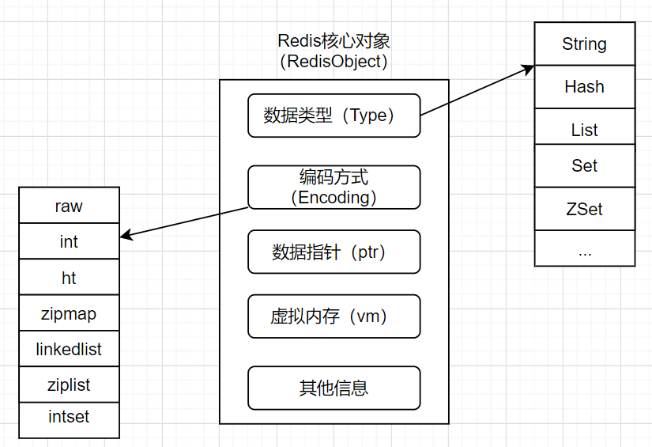
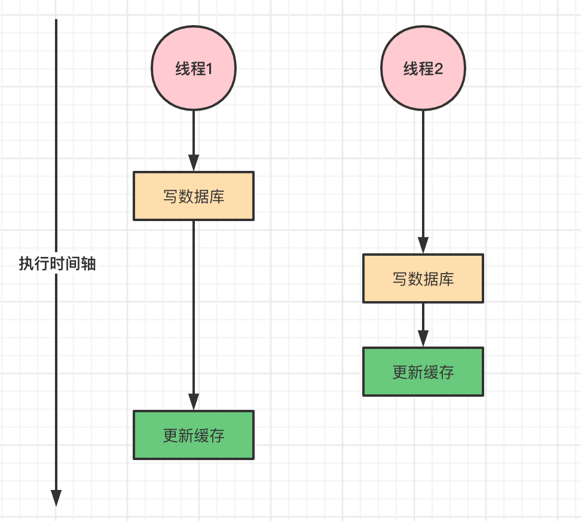
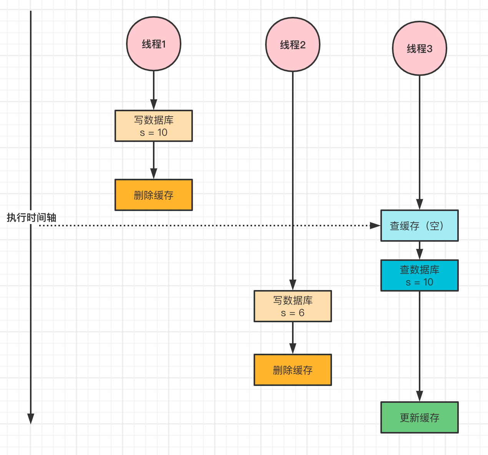

# Redis

## 前言


<br>

### 特点

1、**完全基于内存**，数据存在内存中，查找和操作的时间复杂度是 O(1)

> 以 MySQL 为例，MySQL 的数据和索引都是持久化到磁盘上的，当 SQL 语句执行一条查询命令时，如果目标数据库的索引还没被加载到内存中，首先要先把索引加载到内存，再根据索引，把数据对应的磁盘块加载到内存中，最后再读取数据

2、**数据结构简单，数据操作简单**

> Redis 的数据结构是有特殊设计的
>
> * 比如 String 类型采用 SDS 数据结构来存储。**String 空间不够时，总是尝试去申请更多的内存；空间多余的时候，不归还多余空间，而是将多余的空间维护起来**。以此来减少内存的申请，可以更快实现对数据的操作。
> * **有序集合 ZSet 采用的跳跃表，获取数据时可以通过不同的层次间跳跃来达到加速访问节点的效果**

3、**Redis 的 IO 读写操作是单线程的**，避免了不必要的上下文切换和竞争条件，不存在多线程导致的 CPU 切换。不用考虑各种锁的问题，不存在加锁释放锁操作，没有死锁问题导致的性能消耗。Redis 的性能不在 CPU，而在内存。

> 多线程环境中，当一个线程的状态由 Runnable 转换为非 Runnable（Blocked、Waiting、TimedWaiting）时，相应线程的上下文信息（包括 CPU 的寄存器和程序计数器在某一时间点的内容等）需要被保存，以便相应线程稍后再次进入 Runnable 状态时能够在之前的执行进度的基础上继续前进。而一个线程从非 Runnable 状态进入 Runnable 状态可能涉及恢复之前保存的上下文信息。这个对线程的上下文进行保存和恢复的过程就被称为上下文切换

4、使用 IO 多路复用模型，非阻塞 IO

> IO 多路复用就是多个 TCP 连接复用一个线程。如果采用多个请求起多个进程或者多个线程的模式，除了要考虑到进程或者线程的切换之外，还要用户去检查事件是否到达，效率低下。Redis 支持 select、poll、epoll 模式的多路复用，默认情况下，会选择系统支持的最好的模式。通过 IO 多路复用技术，用户不用去遍历 fd set 集合。通过内核通知告诉事件的到达，效率比较高

5、[渐进式 Rehash](##渐进式哈希)


<br>

**Redis 与线程**

> Redis 是一个 Key-Value 对的非关系型数据库，Redis 单线程主要是指网络 IO 和 KV 的读写是由一个主线程来完成的。但 Redis 的其他功能，比如说持久化、异步删除、集群数据同步，其实是开启了额外的线程来完成的。


<br>

## **常用命令**


```shell
# 切换数据库0-15
select dbIndex
# 遍历当前库所有键
keys *
# 查询当前库总键数
dbsize
# 存在返回1，不存在返回0
exists key
# 删除键
del key
# flushdb只清除当前数据库，flushall清除所有数据库
flushdb
flushall

# （不建议再生产环境中使用）把指定的键从源数据库移动到目标数据库
move key db

# 键数据类型
type key
# 键重命名，若newkey已存在，将会被覆盖
rename key newkey
# 只有newkey不存在时才会被覆盖
renamenx key newkey
# 随机返回一个键
randomkey

# 当超过过期时间，会自动删除，key在seconds秒后过期
expire key seconds
# 键在秒级时间戳timestamp后过期
expireat key timestamp
# 当超过过期时间，会自动删除，key在milliseconds毫秒后过期
pexpire key milliseconds
# key在豪秒级时间戳timestamp后过期
pexpireat key milliseconds-timestamp
# 命令可以查看键hello的剩余过期时间，单位：秒（>0剩余过期时间；-1没设置过期时间；-2键不存在）
ttl
# 毫秒级ttl
pttl

# 排序
sort mylist
# 字母排序
sort mylist alpha desc limit 0 2
# by 命令
sort list by it:* desc
# get 参数
sort list by it:* desc get it:*
# sort 命令之 store 参数：表示把 sort 查询的结果集保存起来
sort list by it:* desc get it:* store sorc:result
```


<br>

## 内部结构

> Redis 内部使用一个 `redisObject` 对象来表示所有的 key-value


**redisObject 内部属性**

- type，表示一个 value 对象具体是何种数据类型

- encoding，是不同数据类型在 Redis 内部的存储方式
  
  type=string，表示 value 存储的是一个普通字符串， encoding 可以是 raw 或者 int




<br>

## 数据类型

### String

> String 是 Redis 最基本的类型，String 类型是二进制安全的，意思是 Redis 的 String 类型可以包含任何数据，比如 jpg 图片或者序列化的对象。String 类型的值最大能存储 512M


**操作**

```shell
set key value
# 键必须不存在，才可以设置成功
setnx key value
# 为键值设置秒级过期时间
setex key value
# 从index开始替换value
setrange key index value 

# 批量设置值
mset k1 v1 k2 v2 k3 v3
mget k1 k2 k3

# key计数增
incr key
# key计数增，每次增increment
incr key by increment
# key计数减
decr key
decr key by increment

# 追加值，向key中的value字符串尾部追加值
append key value

# 字符串长度，每个汉字占用3个字字节
strlen key

# 设置并返回原值
getset key value

# 获取部分字符串，start和end分别为开始和结束的偏移量，偏移量从0开始
getrange key start end 

# 设置指定位置的字符，offeset是字符串下标
setrange key offeset value
> set key aaa
OK
> get key
"aaa"
> setrange key 0 b
(integer) 3
> get key
"baa"
```


**String key设置约定**

```shell
# 中间不能用空格来隔开
表名:主键名:主键值:字段名 字段值
user:id:1001:name aaa
```


<br>

### List

> 字符串列表，按照插入顺序排序，可以添加一个元素到列表的头部（左边）或者尾部（右边）。


**实现方式**

底层实现是一个双向链表，可以支持反向查找和遍历，可以用来当消息队列用。

```c
typedef struct listNode {
    struct listNode *prev;
    struct listNode *next;
    void *value;
} listNode;

typedef struct listIter {
    listNode *next;
    int direction;
} listIter;

typedef struct list {
    listNode *head;
    listNode *tail;
    void *(*dup)(void *ptr);
    void (*free)(void *ptr);
    int (*match)(void *ptr, void *key);
    unsignedlong len;
} list;
```


**操作**

```shell
#添加
# 从右边插入元素
rpush lists elements[elements . . .]
rpush lists a b c d
# 从左边插入元素
lpush lists elements[elements . . .]
# 向某个元素前或者后插入元素
linsert lists BEFORE|AFTER element value

[1]> linsert list before a z
(integer) 5
[1]> lrange list 0 -1
1) "z"
2) "a"
3) "b"
4) "c"
5) "d"

# 遍历
# 获取指定范围内的元素列表
lrange key 0 -1
# 获取列表指定下标的元素
lindex key 0
# 获取列表长度
llen key

# 删除
# 从列表左侧弹出元素
lpop key
# 从列表右侧弹出元素
rpop key
# 删除count个指定元素value，若是指定元素个数小于count，则全部删除
lrem key count value

# 修改
# 修改指定索引下标的元素
lset key index newValue
```


<br>

### Hash

> 键值对集合，适合存储对象。


**数据结构**

```c
typedef struct dictht {
    dictEntry **table; // 哈希表数组
    unsigned long size; // 哈希表大小
    unsigned long sizemask; // 哈希表大小掩码，用于计算索引值，总是等于 size - 1
    unsigned long used; // 该哈希表已有节点的数量
} dictht;

typedef struct dict {
    dictType *type;
    void *privdata;
    dictht ht[2]; // 内部有两个 dictht 结构
    long rehashidx; /* rehashing not in progress if rehashidx == -1 */
    unsigned long iterators; /* number of iterators currently running */
} dict;

typedef struct dictEntry {
    void *key; // 键
    union { // 值
        void *val;
        uint64_t u64;
        int64_t s64;
        double d;
    } v;
    struct dictEntry *next; // 指向下个哈希表节点，形成链表
} dictEntry;
```


**操作**

```shell
# 设置值
hset key field value
hsetnx key filed value
# 批量设置值
Hmset key field value [field value]
# 判断field是否存在
hexists key field

# 获取值
hget key field
# 批量获取值
Hmget key field [field ......]
# 计算field的个数
hlen key
# 计算value字符串的长度
hstrlen key field
# 获取所有field
hkeys key
# 获取所有value
hvals key
# 获取所有的field、value
hgetall key
# hincrby hincrbyfloat 作用域是field
hincrby key field
hincrbyfloat key field

[2]> hset user:1 name aaa age 18
(integer) 2
[2]> hget user:1 name
"aaa"
[2]> hget user:1 age
"18"
[2]> hget user:1 password
(nil)

# 删除field，会删除一个或多个field，返回结果为成功删除fiel的个数
hdel key field
```


<br>

#### 渐进式哈希

> 在 Redis 中，键值对是由**字典（Dict）**保存的，而字典底层是通过**哈希表**来实现的。通过哈希表中的节点保存字典中的键值对。以 HashMap 为例，当发生哈希冲突时，会进行 Resize 的操作，Redis 也一样

在 Redis 的具体实现中，使用**渐进式哈希（Rehash）**机制来**提高字典的缩放效率**，避免 Redis 对服务器性能造成影响。假如 Redis 中有大量的 key，一次性对全部的数据进行 Rehash，可能会导致 Redis 在一段时间内停止服务。在 Redis中，哈希表扩容需要维护两个哈希表，分别是 *哈希表 0* 和 *哈希表 1*。Rehash 过程需要将哈希表 0 里面的所有键值对 Redis 到哈希表 1 中。Rehash 动作是分多次、渐进式地完成的。

* 扩容

  当 Redis 的哈希槽数量不足以存放当前的键值对数量时，需要扩容。扩容时，Redis 会创建容量为旧哈希槽两倍大小的新哈希槽，并将原有的键值对重新分布到新的哈希槽中

* 缩小

  当 Redis 的哈希槽数量过多，但其中的某些哈希槽中没有键值对时，可以考虑缩容。缩容时，Redis 会合并一些相邻的哈希槽，并将其合并后的键值对重新分布到新的哈希槽中


<br>

**Rehash 步骤**

1、为哈希表 1 分配空间，且空间大小为哈希表 0 的两倍，让字典同时持有哈希表 0 和哈希表 1 两个哈希表

2、在字典中维持一个索引计数器变量 *rehashidx*（哈希表的下标），并将它的值设置为 0，表示 Rehash 工作正式开始

3、在 Rehash 进行期间，每次对字典执行 CRUD 操作时，程序除了执行指定的操作以外，还会顺带将哈希表 0 在 *rehashidx* 索引上的键值对 Rehash，并放到哈希表 1。 当 Rehash 工作完成之后，程序将 rehashidx 属性的值加上 1

4、随着字典操作的不断执行，哈希表 0 的所有键值对都会被 Rehash 至哈希表 1，这时程序将 *rehashidx* 属性的值设为 -1 ，表示 Rehash 操作已完成。


<br>

**Rehash 期间的 CRUD 操作**

因为在进行渐进式 Rehash 的过程中，字典会同时使用哈希表 0 和哈希表 1 两个哈希表，所以在渐进式 Rehash 进行期间， **CRUD 操作会在两个哈希表上同时进行**。

在渐进式 Rehash 执行期间，新添加到字典的键值对会被保存到哈希表 1，而哈希表 0 不再进行任何添加操作。这一措施保证哈希表 0 包含的键值对数量会只减不增，并随着 Rehash 操作的执行而最终变成空表。要在字典里面查找一个键的话，程序会先在哈希表 0 里面进行查找，如果没找到，就会到哈希表 1 中进行查找。


<br>

**Rehash 带来的问题**

渐进式哈希避免了 Redis 阻塞，但是需要分配一个新的哈希表，同时有两个哈希表在使用，会使内存使用量增加。如果当前 Redis 结点的内存占用量达到 *maxmemory*，会触发内存淘汰机制，导致大量的 Key 被驱逐。


<br>

### Set

> Set 是无序集合。集合是通过 hashtable 实现的


**操作**

```shell
# 添加
# 返回结果为添加成功的元素个数
sadd key element [element .....]

# 获取
smembers key
# 获取set中元素个数
scard key
# 判断元素是否存在set中，存在返回1，否则返回0 
sismember key element
# 随机从集合返回指定个数元素，count可以省略，默认是1
srandmember key [count]

# 删除
# 返回结果为删除成功的元素个数
srem key element [element .....]
# 从set中随机pop元素，count可以省略，默认1
spop key [count]

# set集合间的操作
# 交集
sinter key [key . . .]
# 并集
sunion key [key . . .]
# 差集
sdiff key [key . . .]

# 将交集、并集、差集的结果保存，destination：保存到的目的地
sinterstore destination key [ key ......]
sunionstore destination key [ key ......]
sdiffstore destination key [ key ......]
```


<br>

### ZSet

> ZSet 和 Set 一样是无重复元素集合，且插入是有序的，即自动排序。和 Set 相比，ZSet（Sorted Set）关联了一个 Double 类型权重的参数 Score，使得集合中的元素能够按照 Score 进行有序排列。Redis 正是通过 Score 来为集合中的成员进行从小到大的排序

ZSet 的内部使用 HashMap 和跳跃表（SkipList）来保证数据的存储和有序。HashMap 存储的是成员与 Score 的映射；跳跃表里存放的是所有的成员，排序依据是 HashMap 里存的 Score。使用跳跃表的结构可以获得比较高的查找效率，并且在实现上比较简单


**操作**

```shell
# 添加
# Add one or more members to a sorted set, or update its score if it already exists
zadd key [NX|XX] [GT|LT] [CH] [INCR] score member [score member ...]
zadd key score member [score member ...]

# 增加成员的分数
zincrby key increment member

# 返回指定排名范围的成员
# 从低分到高分
zrange key start end [withscores]
# 从高分到低分
zrevrange key start end [withscores] 

# 返回指定分数范围的成员
# 按照分数从低分到高分
zrange key min max [withscores] [limit offset count ]
# 按照分数从高分到低分
zrevrange key max min [withscores] [limit offset count ]
# 返回指定分数范围的成员个数
zcount key min max

# 计算成员个数
zcard key
# 计算某个成员分数
zsore key member
# 从0开始计算成员的排名
zrank key member

# 删除
# 删除成员
zrem key member [member .......]
# 删除指定排名内的升序元素
zremrangebyrank key start end
# 删除指定分数范围的成员
zremrangebystore key min max

# zset集合操作
# 交集
zinter key [key . . .]
# 并集
zunion key [key . . .]
# 差集
zdiff key [key . . .]

# 将交集、并集、差集的结果保存，destination：保存到的目的地
zinterstore destination key [ key ......]
zunionstore destination key [ key ......]
zdiffstore destination key [ key ......]
```


<br>

**跳跃表**

Zset 需要高效的插入和删除，数组插入删除的时间复杂度为 O(n)，不适合使用数组实现。需要使用链表，链表的插入删除的时间复杂度为 O(1)。当插入新元素时需要根据 score 插入到链表合适的位置，保证链表的有序性，高效的办法是通过**二分查找**去找到插入点。那么问题就来了，**二分查找的对象必须是有序数组，只有数组支持快速定位，链表做不到该怎么办呢?**

这就需要**跳跃表**了，SkipList 数据结构如下：

```c
/* ZSETs use a specialized version of Skiplists */
typedefstruct zskiplistNode {
    // value
    sds ele;
    // 分值
    double score;
    // 后退指针
    struct zskiplistNode *backward;
    // 层
    struct zskiplistLevel {
        // 前进指针
        struct zskiplistNode *forward;
        // 跨度
        unsignedlong span;
    } level[];
} zskiplistNode;

typedefstruct zskiplist {
    // 跳跃表头指针
    struct zskiplistNode *header, *tail;
    // 表中节点的数量
    unsignedlong length;
    // 表中层数最大的节点的层数
    int level;
} zskiplist;
```


关于排序问题，我们也很容易就想到 **红黑树/平衡树** 这样的**树形结构，为什么 Redis 不使用这样一些结构呢？**

1. 性能考虑：在高并发的情况下，树形结构需要执行 rebalance 这样的可能涉及整棵树的操作，相对来说跳跃表的变化只涉及局部；
2. 实现考虑：在复杂度与红黑树相同的情况下，跳跃表实现起来更简单。


<br>

[跳跃表实现原理](https://mp.weixin.qq.com/s/Pc8GWsRbqpnUC6ExMXtX9g)

[Redis 5.0 跳跃表](https://www.jianshu.com/p/c2841d65df4c)

[Redis 跳跃表](https://mp.weixin.qq.com/s/Pc8GWsRbqpnUC6ExMXtX9g)

[Redis 数据结构——跳跃表](https://www.cnblogs.com/hunternet/p/11248192.html)

[Redis 系列](https://juejin.cn/post/6991080701365846046)


<br>

### Geospatial

> 地理位置，记录某地点的经纬度，可用来求两地的距离、距离范围内的值等

**操作**

```shell
# 添加
geoadd  key [NX|XX] [CH] longitude latitude member [longitude latitude member ...]
# 例子
geoadd china:city 120.20000 30.26667 hangzhou
geoadd china:city 120.20000 30.26667 hangzhou 121.473720 31.230350 shanghai

# 获取
geopos key member [member. . .]
geoadd china:city hangzhou shanghai

# 获取两地距离，默认距离单位m
geodist china:key hangzhou shanghai
geodist china:key hangzhou shanghai km
# 以某个地理位置为中心，找出某半径内的包含的位置
georadius key longitude latitude radius m|km|ft|mi [WITHCOORD] [WITHDIST] [WITHHASH] [COUNT count [ANY]] [ASC|DESC] [STORE key] [STOREDIST key]
georadius key 经度 纬度 半径 半径单位m/km 包含直线距离 显示经纬度 count 显示的个数 升序/降序
# 根据给定的成员元素，找出指定距离内的其他元素
georadiusbymember china:city hangzhou 200 km withcoord withdist

# 获取位置元素地理位置的哈希值
geohash key member [member. . .]


[5]> geodist china:city shanghai hangzhou km
"162.2105"
[5]> georadius china:city 120.2 30.2 200 km
1) "hangzhou"
2) "shanghai"
[5]> georadius china:city 120.2 30.2 200 km withdist
1) 1) "hangzhou"
   2) "7.4155"
2) 1) "shanghai"
   2) "167.2338"
[5]> georadius china:city 120.2 30.2 200 km withdist withcoord
1) 1) "hangzhou"
   2) "7.4155"
   3) 1) "120.20000249147415161"
      2) "30.2666706589875858"
2) 1) "shanghai"
   2) "167.2338"
   3) 1) "121.47371917963027954"
      2) "31.2303488312778228"
[5]> georadiusbymember china:city hangzhou 200 km withcoord withdist
1) 1) "hangzhou"
   2) "0.0000"
   3) 1) "120.20000249147415161"
      2) "30.2666706589875858"
2) 1) "shanghai"
   2) "162.2105"
   3) 1) "121.47371917963027954"
      2) "31.2303488312778228"

[5]> geohash china:city hangzhou
1) "wtmkpjyuph0"
```


<br>

### Hyperloglog

> 基数，数据集中不重复的元素个数，可用于求集合（交并补）。用于网页的访问量（UV）、点赞量，一个用户多次访问，也只能算作一次。

**操作**

```shell
# 添加
pfadd key element [element . . .]
# 获取 key 基数
pfcount key
# 将多个 hyperloglog 合并为一个
pfmerge destkey sourcekey [sourcekey . . .]

[6]> pfadd hyper a b c d e f g
(integer) 1
[6]> pfcount hyper
(integer) 7
[6]> pfadd hyper a a b c
(integer) 0
[6]> pfcount hyper
(integer) 7
[6]> pfadd hyper2 a c h i
(integer) 1
[6]> pfmerge hyper0 hyper hyper2
OK
[6]> pfcount hyper0
(integer) 9
```


> [Hyperloglog 原理](https://mp.weixin.qq.com/s/MqEkb5-hQHg7C9WZ3Pdbmw)


<br>

### Bitmap

> 位图场景，有两个状态，0 和 1。可用于签到统计、状态统计等

**操作**

```shell
# 设置值，一般设置 0 或 1
setbit key value
# 获取值
getbit key offset
# 统计某个键其值为 1 的数量
bitcount key [start end]

[7]> setbit sign 1 1
(integer) 0
[7]> setbit sign 2 1
(integer) 0
[7]> setbit sign 3 1
(integer) 0
[7]> setbit sign 4 0
(integer) 0
[7]> setbit sign 5 1
(integer) 0
[7]> getbit sign 1
(integer) 1
[7]> bitcount sign
(integer) 4
```


**Bitmap 统计日活**

建立一个 BitMap，可以统计今日登录的用户数，每一位标识一个用户 ID（假设是 1 亿，空间使用量 `1亿/8/1024/1024≈12MB`，仅要 12MB 就能统计 1 亿用户日活）

每次用户登录时会执行一次 `setbit  key user_id  1`。将 Bitmap 中对应位置的值置为 1，时间复杂度是  O(1)。执行 `bitcount key` 统计 bitmap 结果有多少个 1（即活跃用户数）

```shell
# 每个用户登录一次就设置一次
# 位图中的位偏移是从左到右进行编号的，从 0 开始。因此，位偏移为 111000 表示要设置位图中的第 111000 位为 1
setbit activity_user_yyyymmdd 111000 1
# 统计某日活跃用户数
bitcount activity_user_yyyymmdd

# 对一个或多个保存二进制位的字符串 key 进行位元操作，并将结果保存到 destkey 上
# operation 可以是 AND 逻辑并、 OR 逻辑或、 NOT 逻辑非、 XOR 逻辑异或 这四种操作中的任意一种
# 除了 NOT 操作之外，其他操作都可以接受一个或多个 key 作为输入
# BITOP 的复杂度为 O(N) 
# 当处理大型矩阵或者进行大数据量的统计时，最好将任务指派到附属节点进行，避免阻塞主节点
# 返回值：保存到 destkey 的字符串的长度，和输入 key 中最长的字符串长度相等
bitop operation destkey key [key ...]

# 将一周内连续登录用户保存到 weekCount 中
bitop and weekCount activity_0809 activity_0810 activity_0811 activity_0812 activity_0813 activity_0814 activity_0815

# 统计一周内连续登录用户
bitcount weekCount
# 判断某个用户是否在七天内连续登录，返回 1，即七天内连续登录
getbit weekCount userId

# 统计周活
bitop or weekCount activity_0809 activity_0810 activity_0811 activity_0812 activity_0813 activity_0814 activity_0815
# 获取周活
bitcount weekCount
```


<br>

## 事务

> Redis 事务的**本质是一组命令的集合**，可以一次执行多个命令

<br>

### 事务锁

**乐观锁**，认为无论执行什么操作都不会出问题，无论执行什么操作都不会加锁

- 用 version 做标识，更新数据时检查当前 version 和期望 version 是否一致，判断期间是否修改过数据
- 提交的 version 必须大于记录当前 version 才能执行更新

**悲观锁**，认为无论执行什么操作都会出问题，无论执行什么操作都会加锁


<br>

### 事务特点

* 一个事务中所有的命令都会被序列化，一次性按顺序地，串行化执行，不会被其他命令插入
* 同一个队列中，一次性、顺序性、排他性的执行一系列命令

* <mark>Redis **保证单条命令的原子性**，但是 Redis **不保证事务操作的原子性**，事务执行失败后没有回滚操作</mark>

* <mark>Redis 事务中**没有隔离级别的概念**</mark>

* <mark>所有命令在事务开启后并没有被直接执行，只有发起执行指令的时候才会执行</mark>

<br>

**事务执行流程**

1. 开启事务，`multi`

2. 输入一组命令，命令入队

3. 执行事务，`exec`，执行之后本次事务结束，若还要使用事务则需要再次开启

4. 取消事务，`discard`

5. 监视 key 值，`watch key [key...]`，类似乐观锁，在事务执行时，若是这个或这些 key 值被其他命令改动，那么事务将会被打断。执行了 `exec` 命令之后，之前加的监控锁都会被取消

   

<br>

### 事务不能正常开启

* 编译异常，输入的命令编译异常，事务中所有的命令都不会成功执行

* 运行异常，输入的命令在执行期间出现异常，除了出错的命令，其它命令均能正常执行


<br>

**事务操作**

```shell
# 标记一个事务的开始
multi
# 执行事务内的命令
exec

# 监视一个或者多个key，如果事务执行之前，这个kye被其它命令所动，则事务被打断
watch key [key ...]
# 取消watch命令对所有key的监视
unwatch

# 取消执行事务块内的所有命令
discard
```

```shell
> multi
OK
> discard
OK

> keys *
1) "k222"
2) "k333"
> multi
OK
> set k1 v111
QUEUED
> get k222
QUEUED
> set k333 3333
QUEUED
> exec
1) OK
2) "\"v222\""
3) OK
```


<br>

## 持久化

> Redis 最大的特点就是基于内存的，当 Redis 服务器宕机，数据就会丢失。所以 Redis 对需要持久化的数据做一些处理，分别是：RDB 和 AOF。


<br>

### RDB

> 在指定时间间隔内，将内存中的数据保存到磁盘上的一个 dump 文件，定时保存。恢复的时候将 dump 快照文件直接读到内存中，实现快速恢复。

<br>

**快照文件生成**

Redis 提供了两个命令来生成 RDB 快照文件，分别是：

* `save` 在主线程中执行，会导致阻塞；
*  `bgsave` 创建一个子进程，用于写入 RDB 文件的操作，避免了对主线程的阻塞，**是 RDB 的默认配置**。

<br>

**自动触发**

```conf
# save <second> <change>
# save 单位时间 s 修改次数

# 3600s 内修改超过 1 次，就将数据持久化到储存
save 3600 1 
save 300 100
save 60 10000
```

<br>

**手动触发**

1. 执行完命令之后，手动执行 save 指令
2. 执行 `flushdb` 指令，执行 flushdb 指令之后，会生成一个空的 `dump.rdb` 文件，并将之前的 RDB 文件覆盖。

> *注意*：如果 Redis 命令是以 flushdb 命令结尾，那么下次启动的时候会导致数据丢失。

<br>

**禁用快照**

1. 配置文件中开启 `save "" `
2. 命令行执行 `config set save ""`


<br>

**异常 dump 文件修复**

```shell
# redis-check-dump 在 redis-server 同级目录下
redis-check-dump --fix dump.rdb
# 之后重启 Redis 生效
```

<br>

**RDB 持久化过程**

Redis 会单独 fork 一个子进程来进行持久化工作（）。Redis 会先将需要持久化的数据写到一个临时文件中，等持久化过程都结束了，再用这个临时文件替换上次持久化的文件。

> *注意*：fork 的作用是复制一个与当前进程一样的子进程。子进程的所有数据（变量，环境变量，程序计数器等）都与原来的进程一致，是一个全新的进程。

**RDB 持久化注意细节**

- RDB 保存的是 `dump.rdb` 文件，备份的 rdb 文件最好保存在与运行 Redis 的服务器不同的另一台服务器上。
- 如果要进行**大规模的数据恢复**，且对于**数据恢复的完整性要求不是非常敏感**，RDB 方式要比 AOF 方式更加的高效。

<br>

**RDB 优点**

1. rdb 格式文件内容紧凑，占用空间小；
2. 在生成 rdb 文件时，父进程唯一需要做的就是 fork 出一个子进程，接下来的工作全部由子进程来做。父进程不需要再做其他的 IO 操作，只需要专注于自己的工作。所以 RDB 持久化方式可以最大化 Redis 的性能。
3. **在恢复大的数据集的时候，RDB 方式会比 AOF 更快**。为什么？**因为 rdb 是数据的快照，基本上就是数据的复制，不用重新读取再写入内存**。

<br>

**RDB 缺点**

1. 数据丢失风险大。在一定间隔时间内做一次备份，如果 Redis 意外宕机，就会丢失最后一次快照后的所有修改。
2. fork 子线程的时候，线程的数据也被克隆了一份，需要占用额外的空间。在数据集比较大的时候 fork 的过程是非常耗时的。

<br>

**Redis 如何解决在 bgsave 做快照的时候允许数据读写？**具体操作如下：

1、如果主线程执行读操作，主线程和 bgsave 子进程互相不影响；

2、如果主线程执行写操作，则被修改的数据会复制一份副本，子进程会把该副本数据写入 RDB 文件，在这个过程中，主线程仍然可以直接修改原来的数据。


<br>

### AOF

AOF（*Append Only File*），以日志的形式来记录每个写操作，将 Redis 执行过的**所有写指令**记录下来（读指令不记录），**只许追加文件而不改写文件**。

> *注意*：Redis 启动时会读取 AOF 日志文件，根据日志文件的内容将指令从前到后执行执行一次，以完成数据的恢复工作。为什么不是 rdb 呢？因为 aof 文件追加的指令操作较为密集，保存的数据比 rdb 完整。

<br>

**写后日志**

AOF 采用的是**写后日志**的方式记录指令。主要是由于 Redis 在写入日志之前，不对命令进行语法检查，所以只记录执行成功的命令，避免出现记录错误命令的情况，而且在命令执行后再写日志不会阻塞当前的写操作。

后写日志主要有两个风险可能会发生：

- 数据可能会丢失。如果 Redis 刚执行完命令，发生故障宕机，会导致这条命令存在丢失的风险。
- 可能阻塞其他操作。AOF 操作也是在主线程中执行，所以当 Redis 把日志文件写入磁盘的时候，还是会阻塞后续的操作。

<br>

**AOF 命令**

**启用 AOF 快照**

配置文件修改 appendonly

```
appendonly yes
```

<br>

**AOF 同步策略**

```
appendfsync everysec
```

1. `always`，每次发生数据变更会被立即记录到 AOF 文件，性能较差但是数据完整性较好。
2. `everysec`，出厂默认，每秒记录，如果系统 1s 内宕机，会出现数据丢失。
3. `no`

<br>

**aof 文件异常修复**

```shell
# redis-check-aof 在 redis-server 同级目录下
redis-check-aof --fix appendonly.aof
# 之后重启 Redis 生效
```

<br>

**AOF 重写机制**

AOF 采用文件追加的方式，文件会越来越大，为了避免出现这种情况，AOF 新增了重写机制。当 AOF 文件的大小超过所设定的阈值时，Redis 就会启动 AOF 文件的内容压缩，只保留可以恢复数据的最小指令集。可以使用 `bgrewriteaof` 命令手动开启 aof 重写。

<br>

**触发重写**

```
auto-aof-rewrite-percentage 100
auto-aof-rewrite-min-size 64mb
```

Redis 会记录上次重写时的 aof 文件的大小，默认配置是当 aof 文件大小是上次重写后大小的一倍，且文件大于 64MB 时触发。如果是重启 Redis 后第一次触发重写机制，则重写时对照的 aof 文件的大小是 Redis 启动时使用的 aof 文件的大小。

<br>

**重写过程**

Redis 会 fork 一个新进程来进行 AOF 重写操作（先写入临时文件再重命名）。重写 AOF 文件的操作并没有读取到旧的 AOF 文件，而是将整个内存中的数据库内容用命令的方式重写一个新的 AOF 文件。

<br>

**AOF 细节**

- 若是目录下同时存在 `dump.rdb` 和 `appendonly.aof`，Redis 会优先加载 aof 文件进行数据恢复。因为在通常情况下，aof  文件保存的数据要比 rdb 文件保存的数据更完整。
- aof 文件会记录 `flusdb` 和 `flushall` 指令，若在操作的最后执行了 `flushdb`，在下次启动时从 aof 文件恢复的指令中末尾就是 `flushdb`，数据会被再次清空。

<br>

**AOF 优点**

1. aof 文件有序地保存了对数据库执行的所有写入操作，这些写入操作以 aof 格式的文件进行保存，aof 文件内容易于读懂，对文件进行分析也很轻松
2. 同步策略配置灵活
3. Redis 可以在 AOF 文件过大时在后台自动的对 AOF 文件进行重写


**AOF 缺点**：对相同数据集的数据而言，AOF 文件要远大于 RDB 文件，恢复速度要慢于 RDB 文件。


<br>

### 混合持久化

重启 Redis 时，很少使用 RDB 来恢复数据，因为会丢失大量数据，通常使用 AOF 日志重放。但是重放 AOF 日志性能相对 RDB 来说要慢很多，这样在 Redis 实例很大的情况下，启动需要花费很长的时间。Redis 为了解决这个问题，带来了一个新的持久化方式：混合持久化


**开启混合持久化配置**

```conf
aof-use-rdb-preamble yes
```

如果开启了混合持久化，AOF 在重写时不再是单纯将内存数据转换为 RESP 命令写入 AOF 文件，而是将重写这一刻之前的内存做 RDB 快照处理，并且将 RDB 快照内容和增量的 AOF 修改内存数据的命令存在一起，都写入新的 AOF 临时文件，重写完再对 aof 文件进行重命名，覆盖原有的 AOF 文件，完成新旧两个 AOF 文件的替换。

在 Redis 重启的时候，可以**先加载 RDB 文件，再重放增量 AOF 日志**，就可以完全替代之前的 AOF 全量文件重放， 重启效率得到提升并且数据完整性也得到保证。


<br>

## 高可用

### 主从复制

> 主机数据更新后根据配置和策略自动同步到备机的机制，Master 以写为主，Slave 以读为主，可以用作读写分离和容灾恢复。

<br>

**一主多从配置**（仅需要配置从库，不配置主库）

一、修改配置文件

1、拷贝`redis.conf` 文件备份

2、开启 `deamonlize yes`

3、指定端口

3.1、同一台机上多个 Redis 服务改不同端口

3.2、不同机子上 Redis 服务无需修改端口

3.3、Pid 文件名

```conf
# redis.conf
pidfile /var/run/redis端口号.pid
```

3.4、Log 文件名

```conf
# redis.conf
logfile "端口号.log"
```

3.5、`dump.rdb` 名

```conf
dbfilename dump端口号.rdb
```


二、从库配置，有两种方法可指定 master

1. 命令行指定，每次与 master 断开之后，都需要重新连接
   
   ```conf
   # redis 客户端命令行
   slaveOf 主机ip 主机port
   ```

2. 配置文件指定，在 `redis.conf` 中指定 master


三、查看主从复制信息

```shell
# redis 客户端命令行
info replication
```

<br>

**去中心化配置**（上一个 Slave 是下一个 Slave 的 Master）

接力配置，Slave 同样可以接受其他 Slave 的连接和同步请求，中间的 Slave 作为链条中下一个 Slave的 Master，可以有效减轻 Master 的写压力。

> *注意*：中途变更两种不同的 master-slave 配置会清除之前的数据，重新建立拷贝最新的数据。


配置步骤同一主多从，仅在 slaveOf 命令处有改动

```shell
slaveOf 新主库ip 新主库port
```

<br>

**主从工作原理**

1、为 Master 配置了一个 Slave 之后，不管这个 Slave 是否是第一次连接上 Master，它都会发送一个 `PSYNC` 命令给 Master 同步数据。

2、Master 收到 `PSYNC` 命令后，会在后台通过 `bgsave` 进行数据持久化，生成最新的 RDB 快照文件。持久化进行完毕以后，Master 会把持久化数据发给 Slave，Slave 接收到数据后加载到内存中。

持久化期间，Master 会继续接收客户端的请求，它会把修改数据的请求缓存在内存中。最后 Master 再将之前缓存在内存中的命令发送给 Slave。

3、当 Master 与 Slave 之间的连接由于某些原因而断开时，Slave 能够自动重连 Master，如果 Master 收到了多个 Slave 并发连接请求，它只会进行一次持久化，而不是一个连接一次，然后再把这一份持久化的数据发送给多个并发连接的 Slave

4、当 Master 和 Slave 断开重连后，一般都会对整份数据进行复制。从 Redis 2.8 开始，Master 和 Slave 断开重连后支持**部分复制**

<br>

**数据的复制**

1、**全量复制**：Master 会在内存中创建一个**复制数据用的缓存队列**，缓存最近一段时间的数据。Master 和它的所有 Slave 都维护了复制的数据下标 offset 和 Master 的进程 id。当网络连接断开后，Slave 会请求 Master 继续进行未完成的复制，从所记录的数据下标开始。如果 Master 进程 id 变化了，或者从节点数据下标 offset 太旧，已经不在 Master 的缓存队列里了，将会进行一次全量数据的复制

2、**增量复制**：Master 继续将新的所有收集到的修改命令一次传给 Slave，完成同步。但是只要是重新连接 Master，将会自动执行一次完全的同步（全量复制）


<br>

### 哨兵模式

> 哨兵（Sentinel）是特殊的 Redis 服务，**不提供读写服务，主要用来监控 Redis 实例节点**。能够后台监控主机是否故障，如果故障了根据投票数自动将从库转换为主库

哨兵架构下，客户端第一次从哨兵找到 Master 节点，后续就直接访问 Redis 的主节点，不会每次都通过哨兵访问  Master。当 Master 发生变化，哨兵会第一时间感知到，并且通知客户端

在 Redis 3.0 以前要实现集群一般是借助 Sentinel 工具来监控 Master 节点的状态。<mark>如果 Master 节点异常，则会做主从切换，将某一台 Slave 作为 Master</mark>。

哨兵的配置略微复杂，并且性能和高可用性等各方面表现一般，特别是在主从切换的瞬间存在访问瞬断的情况。而且哨兵模式只有一个主节点对外提供服务，没法支持很高的并发，且单个主节点内存也不宜设置得过大，否则会导致持久化文件过大，影响数据恢复或主从同步的效率

<br>

**配置**

1. 配置一主多从

2. 自定义的 Redis 配置文件目录新建 `sentinel.conf` 文件

3. 配置哨兵，一组 sentinel 能监控多个 Master
   
   ```conf
   # sentinel.conf 最后的数字 1 表示，主机挂掉后 Slave 投票，看谁得票多让谁接替成为主机
   sentinel minitor 被检控的主机名 主机ip 主机port 1
   ```

4. 启动哨兵
   
   ```shell
   # redis 目录命令行
   redis-sentinel /opt/redis/conf/sentinel.conf
   ```

5. 注意，<mark>若是原 Master 宕机，就会从剩下的 Slave 中选出新的 Master。原 Master 重新启动之后不再是 Master，而是成为新 Master 的 Slave</mark>

<br>

**哨兵 Leader 选举流程**

1、当一个 Sentinel 的 Master 服务被某 Sentinel 视为客观下线状态后，该 Sentinel 会与其他 Sentinel 协商选出 Sentinel 的 Leader 进行故障转移工作。

2、每个发现 Master 服务器进入客观下线的 Sentinel 都可以要求其他 Sentinel 选自己为 Sentinel 的 Leader，选举是先到先得。同时每个 Sentinel 每次选举都会自增配置纪元（选举周期），每个周期只会选择一个Leader。

3、如果所有超过一半的 Sentinel 选举某 Sentinel 作为 Leader。之后该 Sentinel 进行故障转移操作，从存活的 Slave 中选举出新的 Master，这个选举过程跟集群的 Master 选举很类似

哨兵集群可以只有一个哨兵节点，Redis 的主从也能正常运行以及选举 Master，如果 Master 挂了，那唯一的那个哨兵节点就是哨兵 Leader 了，可以正常选举新 Master

不过为了高可用一般都推荐至少部署三个哨兵节点。推荐奇数个哨兵节点原理跟集群奇数个 Master 节点类似


<br>

### Redis 集群

> Redis 集群是一种**分布式去中心化的运行模式**，在 Redis 3.0 中推出 Redis 集群方案，它将数据分布在不同的服务器上，以此来降低系统对单主节点的依赖，从而提高 Redis 服务的读写性能，它具有复制、高可用和分片特性

<br>

> 使用哨兵模式在数据上有副本数据做保证，在可用性上又有哨兵监控，一旦 Master 宕机会选举 Slave 节点为 Slave 节点，这已经满足了我们的生产环境需要，**那为什么还需要使用集群模式呢？**
>
> **哨兵模式归根到底节点还是主从模式，在主从模式下我们可以通过增加 Slave 节点来扩展读并发能力，但是没办法扩展写能力和存储能力，存储能力只能是 Master 节点能够承载的上限。**<mark>为了扩展写能力和存储能力</mark>，引入集群模式
>
> Redis 集群不需要哨兵也能完成节点移除和故障转移的功能。需要将每个节点设置成集群模式，这种集群模式没有中心节点，可水平扩展。**Redis 集群的性能和高可用性均优于哨兵模式，且配置非常简单**

<br>

> **Redis 集群在存储的时候如何确定选择哪个节点呢？**
>
> Redis 集群采用的是**类一致性哈希算法**实现节点选择的。Redis 集群将所有数据分成 16384 个槽位（Slot），哈希槽类似于数据分区。每个节点负责其中一部分槽位，槽位的信息存储于每个节点中。
>
> 当客户端连接集群时，它会得到一份集群的槽位配置信息，并将其缓存在客户端本地。当客户端要查找某个 key 时，可以直接定位到目标节点。因为槽位的信息可能会存在客户端与服务器不一致的情况，还需要纠正机制来实现槽位信息的校验调整。

<br>

> **槽位定位算法**
>
> 每个键值对都会根据它的 key，被映射到一个哈希槽中，具体执行过程分为两大步。
>
> - 根据键值对的 key，按照 CRC16 算法计算一个 16 bit 的值。
> - 再用 16 bit 值对 16384 取模，得到 `0 ~ 16383` 范围内的模数，每个模数代表一个相应编号的哈希槽，`HASH_SLOT = CRC16(key) mod 16384`


**跳转重定位**

> 当客户端向一个错误的节点发出了指令，该节点会发现指令的 key 所在的槽位并不归自己管理，这时它会向客户端发送一个特殊的跳转指令携带目标操作的节点地址，告诉客户端去连这个节点去获取数据。客户端收到指令后除了跳转到正确的节点上去操作，还会同步更新纠正本地的槽位映射表缓存，后续所有 key 将使用新的槽位映射表。


<br>

**Redis 集群节点间的通信机制**

Redis 集群节点间采取 **`gossip` 协议**进行通信，维护集群的元数据有两种方式：<mark>集中式和`gossip`</mark>

1、**集中式**优点在于元数据的更新和读取，时效性非常好，一旦元数据出现变更立即就会更新到集中式的存储中，其他节点读取的时候立即就可以立即感知到；不足在于所有的元数据的更新压力全部集中在一个地方，可能导致元数据的存储压力

2、`gossip` 协议的优点在于元数据的更新比较分散，不是集中在一个地方，更新请求会陆陆续续，打到所有节点上去更新，**有一定的延时，降低了压力**；缺点在于元数据更新有延时可能导致集群的一些操作会有一些滞后。

gossip 协议包含多种消息，包括 `ping/pong/meet/fail` 等

* `ping` 每个节点都会频繁给其他节点发送 `ping`，其中包含自己的状态以及维护的集群元数据
* `pong` 返回 `ping` 和 `meet`，包含自己的状态和其他信息，也可以用于信息广播和更新
* `fail` 某个节点判断另一个节点 `fail` 之后，就发送 `fail` 给其他节点，通知其他节点，指定的节点宕机
* `meet` 某个节点发送 `meet` 给新加入的节点，让新节点加入集群中，然后新节点就会开始与其他节点进行通信，不需要发送形成网络的所需的所有 `CLUSTER MEET` 命令


<br>

**Redis 集群选举原理分析**

当 Slave 发现自己的 Master 变为 `FAIL` 状态时，便尝试进行 Failover，以期成为新的 Master。由于挂掉的 Master 可能会有多个 Slave，从而存在多个 Slave 竞争成为 Master 节点的过程

1、Slave 发现自己的 Master 变为 `FAIL`

2、将自己记录的集群 `currentEpoch` 加 1，并广播 `FAILOVER_AUTH_REQUEST` 信息

3、其他节点收到该信息，只有 Master 响应，判断请求者的合法性，并发送 `FAILOVER_AUTH_ACK`，对每一个 epoch 只发送一次 ack

4、尝试 failover 的 Slave 收集 Master 返回的 `FAILOVER_AUTH_ACK`

5、Slave 收到超过半数 Master 的 ack 后变成新 Master (集群为什么至少需要三个主节点？如果只有两个，当其中一个挂了，只剩一个主节点是不能选举成功的)

6、Slave 广播 `pong` 消息通知其他集群节点

> Slave 节点并不是在 Master 节点一进入 `FAIL` 状态就马上尝试发起选举，而是有一定延迟。一定的延迟确保 `FAIL` 状态能在集群中传播。Slave 如果立即尝试选举，其它 Master 或许尚未意识到 `FAIL`状态，可能会拒绝投票


<br>

**Redis 集群为什么至少需要三个 Master 节点，并且推荐节点数为奇数？**

因为新 Master 的选举需要大于半数的集群 Master 节点同意才能选举成功，如果只有两个 Master 节点，当其中一个挂了， 是达不到选举新 Master 的条件的。

奇数个 Master 节点可以在满足选举该条件的基础上节省一个节点，比如三个 Master 节点和四个 Master 节点的集群相比：大家如果都挂了一个 Master 节点都能选举新 Master 节点，如果都挂了两个 Master 节点都没法选举新 Master 节点了，奇数的 Master 节点更多的是从节省机器资源角度出发


<br>

## 消息发布/订阅

> 进程间的一种消息通信模式，发送者（pub）发送消息，订阅者（sub）接收消息

稍作了解即可，生产中消息发布订阅交给MQ来处理


<br>

## 缓存


<br>

### 缓存穿透

> 缓存穿透，指的是 key 值在**缓存和数据库中都不存在**，每次针对 key 的请求在缓存中不存在，请求都会到数据库，从而压垮数据库

**解决方案**

1. **API 接口层增加校验**，如用户鉴权校验，对 ID 做基础校验，ID 小于 0 直接拦截
2. **缓存空对象**，从缓存取不到的数据，在数据库中也没有取到，这时可以将 `key-value` 对写为`key-null`，缓存有效时间可以设置得短一点，如 30s（设置太长会导致正常情况也没法使用）。这样可以防止攻击用户反复用同一个 ID 暴力攻击
3. **布隆过滤器**，将所有可能存在的数据哈希到一个足够大的 bitmap 中，一定不存在的数据会被会被这个 bitmap 拦截掉，从而减少了对底层存储系统的查询压力


<br>

### 缓存击穿

> 缓存击穿，指的是在**缓存过期后，有大量的请求并发的请求过期的键**，这时因为缓存已经过期，所有的请求都会发送到数据库中

**解决方案**

1、设置**热点数据永不过期**

2、加**互斥锁**

```java
public String getData(String key) {
    String res = getDataFromCache(key);
    if (res == null) {
        // tryLock，获取成功，去数据库取数据
        if (lock.tryLock()) {
            res = getDataFromCache(key);
            if (res != null) {
                setDataToCache(key, res);
            }
            // 释放锁资源
            lock.unlock();
        }
    } else {
        // 等待一段时间后再重新获取数据
        try {
            Thread.sleep(1000 * 3);
            getData(key);
        } catch (InterruptedException e) {
            e.printStackTrace();
        }
    }
    return res;
}
```


<br>

### 缓存雪崩/缓存失效

> 缓存雪崩，指**缓存中有数据大批量过期，而对过期缓存的查询量又巨大，此时查询都到数据库，引起数据库压力过大**。与缓存击穿不同的是，缓存击穿是并发查同一条数据，缓存雪崩是不同数据都过期了，数据在缓存中查不到从而查数据库

**解决方案**

1、缓存数据**设置随机过期时间**，防止同一时间大量数据过期现象发生

2、通过**加锁**或者**队列**来**控制读数据库写缓存的线程数量**，比如某个 key 只允许一个线程查询数据和写缓存，其他线程等待。

3、如果缓存数据库是分布式部署，将热点数据均匀分布在不同的缓存数据库中

4、设置热点数据永不过期

5、设置**缓存标记**

> **缓存标记**
>
> 记录缓存数据是否过期，如果过期会触发通知另外的线程在后台去更新缓存。将缓存数据的过期时间设置为缓存标记过期时间的二倍。当标记缓存 key 过期后，实际缓存还能把旧数据返回给调用端，直到另外的线程在后台更新完成，才会返回新缓存。


<br>

## 内存管理

### 过期数据回收

> 因为 Redis 是基于内存的，数据不可能无上限的存储，必定会存在一个淘汰策略定期删除一些 key

Redis 有两种过期数据删除策略：**定时删除**和**惰性删除**

#### 定时删除/主动删除

Redis 将每个设置了过期时间的 key 放到一个独立的 hash 表中，默认每秒定时遍历这个 hash 表。Redis 不会遍历所有的 key，而是采用一种贪心策略。步骤如下：

1、从过期 key 字典中，随机找 20 个 key；

2、删除 20 个 key 中过期的 key；

3、如果 (2) 中过期的 key 超过 1/4，则重复第一步


#### 惰性删除/被动删除

因为定时删除会漏掉一部分已过期的 key，所以 Redis 引入一个惰性删除来删除那些漏掉了的 key。客户端访问的时候，会对这个 key 的过期时间进行检查，如果过期了就立即删除


<br>

### 内存淘汰机制

> 通过统计访问频率，将访问频率最少，即最不经常使用的 KV 淘汰

如果 Redis 采用的是主从架构，那么以上两种淘汰策略是基于 Redis 主库的，每当主库触发了缓存淘汰策略，即会在 AOF 文件写入一个 `del` 命令，从库的淘汰策略是基于主从同步来完成的。

> 如果定期删除漏掉了大量的 key，且后面也没有访问这些 key，没有触发惰性删除，那么内存中会残留大量无用 key。直到某一个时刻，Redis 内存总会被填满，此时 Redis 会触发内存淘汰机制

Redis 可以设置内存的最大使用量 `maxmemory <bytes>`，内存使用到达限度时会根据设置的策略进行内存管理，默认策略为 `maxmemory-policy noeviction`。

| 名称                                  | 描述                                                       |
| ------------------------------------- | ---------------------------------------------------------- |
| volatile-lru（Least Recently Used）   | 从 `已设置过期时间` 数据中淘汰 `最近最少使用` 数据         |
| volatile-lfu（Least Frequently Used） | 从 `已设置过期时间` 数据中淘汰 `最不经常使用` 数据         |
| volatile-ttl                          | 从 `已设置过期时间` 数据中淘汰 `将要过期` 数据             |
| volatile-random                       | 从 `已设置过期时间` 数据中淘汰 `随机` 数据                 |
| allkeys-lru                           | 当 `内存不足写入新数据` 时，淘汰 `最近最少使用` 数据       |
| allkeys-lfu                           | 当 `内存不足写入新数据` 时，淘汰 `最不经常使用` 数据       |
| allkeys-random                        | 当 `内存不足写入新数据` 时，淘汰 `随机选择` 数据           |
| noeviction                            | 当 `内存不足写入新数据` 时，写入操作会报错，同时不删除数据 |


<br>

## 分布式锁

> 分布式锁 RedLock (Redis Distributed Lock)，即使用 Redis 实现的分布式锁


### 分布式存储问题

> 在高并发情况下，同时操作数据库与缓存会存在数据不一致性问题

1、双写不一致



2、读写不一致



**MySQL 和 Redis 双写/读写不一致解决方案**

1. 对于**并发几率很小**的数据（如个人维度的订单数据、用户数据等)，很少会发生缓存不一致，可以**给缓存数据加上过期时间**，每隔一段时间触发读的主动更新即可。

2. **并发很高**，如果业务上**能容忍短时间的缓存数据不一致**（如商品名称，商品分类菜单等）**，缓存加上过期时间**依然可以解决大部分业务对于缓存的要求。

3. 如果**不能容忍缓存数据不一致**，可以通过**加读写锁**保证并发读写或写写的时候按顺序排好队，读读的时候相当于无锁

4. 也可以 **通过监听数据库的 binlog 日志**及时的去修改缓存，但是引入了新的中间件，增加了系统的复杂度

   > 比如，阿里的 canal，工作原理就是**伪装成 MySQL Slave**，模拟 MySQL Slave 的交互协议向 MySQL Mater 发送 dump 请求，MySQL Mater 收到请求，推送 binary log 给 canal，canal 解析 binary log，再发送到存储目的地

以上针对的都是**读多写少**的情况加入缓存提高性能，如果**写多读多**的情况又不能容忍缓存数据不一致，那就没必要加缓存了，可以直接操作数据库。**放入缓存的数据应该是对实时性、一致性要求不是很高的数据。**


<br>

> 对于分布式应用，显然简单的读写锁是满足不了的，此时就需要用分布式锁来解决这个问题了。

**分布式锁的特点**

* 互斥性：同一时刻只能用一个线程持有锁
* 可重入性：同一个节点上的同一个线程获取了锁之后能够再次获取
* 锁超时处理：支持锁超时，防止死锁
* 高性能和高可用：加锁和解锁需要高效，同时也需要保证高可用，防止分布式锁失效
* 阻塞和非阻塞：能够及时从阻塞状态中被唤醒


<br>

### 分布式锁实现

> 4 种实现方式
>
> [基于Redis的分布式锁的实现](https://juejin.cn/post/6844903830442737671)


#### 加锁的实现

**setnx + expire**

> 错误的做法

```java
public boolean tryLock(String key,String requset,int timeout) {
    Long result = jedis.setnx(key, requset);
    // result = 1 时，设置成功，否则设置失败
    if (result == 1L) {
        return jedis.expire(key, timeout) == 1L;
    } else {
        return false;
    }
}
```

setnx 和 expire 是分开的两步操作，不具有原子性，如果执行完第一条指令应用异常或者重启了，锁将无法过期。

一种改善方案就是使用 Lua 脚本来保证原子性（包含 setnx 和 expire 两条指令）

<br>

**Lua 脚本**

> 包含 setnx 和 expire 两条指令

```java
public boolean tryLock_with_lua(String key, String UniqueId, int seconds) {
    String lua_scripts = "if redis.call('setnx',KEYS[1],ARGV[1]) == 1 then" +
            "redis.call('expire',KEYS[1],ARGV[2]) return 1 else return 0 end";
    List<String> keys = new ArrayList<>();
    List<String> values = new ArrayList<>();
    keys.add(key);
    values.add(UniqueId);
    values.add(String.valueOf(seconds));
    Object result = jedis.eval(lua_scripts, keys, values);
    //判断是否成功
    return result.equals(1L);
}
```

<br>

**set key value ex nx**

> 正确做法

```shell
# EX seconds: 设定过期时间，单位为秒
# PX milliseconds: 设定过期时间，单位为毫秒
# NX: 仅当 key 不存在时设置值
# XX: 仅当 key 存在时设置值
SET key value [EX seconds] [PX milliseconds] [NX|XX]
```


<br>

#### 解锁的实现

释放锁时需要验证 value 值：在获取锁的时候需要设置一个 value，不能直接用 `del key `，因为直接 `del key` 任何客户端都可以进行解锁。**解锁时，需要基于 value 值来判断，锁是否属于当前线程**

```java
// Lua 脚本的方式，尽量保证原子性
public boolean releaseLock_with_lua(String key,String value) {
    String luaScript = "if redis.call('get',KEYS[1]) == ARGV[1] then " +
            "return redis.call('del',KEYS[1]) else return 0 end";
    return jedis.eval(luaScript, Collections.singletonList(key), Collections.singletonList(value)).equals(1L);
}
```


> ⚠ 使用 `set key value [EX seconds][PX milliseconds][NX|XX]` 命令实际上在 Redis 集群的时候也会出现问题，比如说 A 客户端在 Redis 的 master 节点上拿到了锁，但是这个加锁的 key 还没有同步到 slave 节点，master 故障，发生故障转移，一个 slave 节点升级为 master 节点，B 客户端也可以获取同个 key 的锁，但客户端 A 也已经拿到锁了，这就导致多个客户端都拿到锁

<br>

#### Redisson

> Redisson 是在 Redis 基础上实现的一款分布式服务相关工具。底层使用 Netty 框架，并提供了与 Java 对象相应的分布式对象，分布式集合和分布式锁和同步器，分布式服务等一系列 Redisson 分布式对象。

对于 Java 而言，Jedis 是 Redis 的 Java 客户端，除了 Jedis 之外，Redisson 也是 Java 的客户端，Jedis 是阻塞式 IO，而 Redisson 底层使用 Netty 可以实现非阻塞 IO，该客户端封装了锁的实现，继承了 JUC 的 Lock 接口，所以可以像使用 ReentrantLock 一样使用 Redisson


**Redlock 算法 与 Redisson 实现**


<br>

## 秒杀系统设计的思考

**关键问题**

秒杀系统其实主要解决两个问题，**并发读和并发写**。并发读的核心优化理念是尽量减少用户到服务端读取数据，或者让用户读更少的数据。并发写的处理原则也一样，可以在数据库层独立出来一个库，做特殊处理。另外还要对秒杀系统做一些保护措施，针对意料之外情况的保底方案，防止最坏情况发生。


**架构要求**

1、**高性能**，秒杀设计大量的并发读和写，因此支持高并发访问这点是非常关键的。对应的方案比如动静分离方案（CDN）、热点的预热与隔离、请求的削峰与分层过滤、服务端的优化等。

2、**一致性**，秒杀中商品减库存的实现方式同样关键。可想而知，有限数量的商品在同一时刻被很多被的请求同时来减库存，减库存又分为拍下减库存和付款减库存以及预扣款等几种，在大并发更新的过程中都要保证数据的准确性。

3、**高可用**，现实中难免会出现一些在系统设计时未考虑到的情况，所以要保证高可用的正确定，还要设计一个保底的方案，以便在最坏情况发生时仍然能够从容应对


**前置步骤**

1、**准备阶段**，也叫做系统预热阶段，会提前预热秒杀系统的业务数据。秒杀开始前用户往往会不断刷新秒杀页面，此时可以将秒杀商品存入 Redis 进行预热，并将过期时间设置到比秒杀结束稍晚的时刻。

2、**秒杀阶段**，这个阶段主要是秒杀活动的过程，会产生瞬时的高并发流量，对系统资源会造成巨大的冲击，在秒杀阶段一定要做好系统防护。可以利用 MQ 进行异步下单，单独使用一个库来处理数据等。

3、**结算阶段**，用户抢到订单后的后续操作，如何进行结算，异常问题处理，商品回仓处理等。


**异步下单流程**

1、用户发起秒杀请求

1）检测验证码是否正确

2）是否需要进行限流

3）发送 MQ


2、异步处理秒杀订单

1）判断活动是否结束

2）判断请求是否属于黑名单

3）扣减缓存中的库存数量


<br>

## 参考

[Redis 5.0 跳跃表](https://www.jianshu.com/p/c2841d65df4c)

[Redis 跳跃表](https://mp.weixin.qq.com/s/Pc8GWsRbqpnUC6ExMXtX9g)

[Redis 数据结构——跳跃表](https://www.cnblogs.com/hunternet/p/11248192.html)

[Redis 系列](https://juejin.cn/post/6991080701365846046)

[基于Redis的分布式锁实现](https://juejin.cn/post/6844903830442737671)

[redis 分布式锁](https://juejin.cn/post/6844904134764658702)

[Redis为什么这么快？](https://juejin.cn/post/7049148028875178020)

[Redis 核心篇：唯快不破的秘密](https://mp.weixin.qq.com/s?__biz=MzkzMDI1NjcyOQ==&mid=2247487752&idx=1&sn=72a1725e1c86bb5e883dd8444e5bd6c4)

