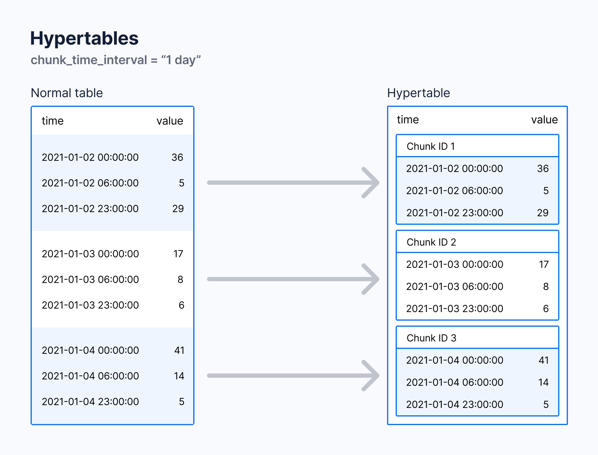
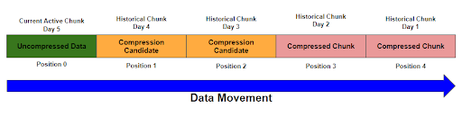

# TimescaleDB

> Databases have always had time fields, but using a special database for handling time-series data can make your database work much more effectively. 
>
> Specialized time-series databases, like Timescale, are designed to handle large amounts of database writes, so they work much faster. They are also optimized to handle schema changes, and use more flexible indexing, so you don't need to spend time migrating your data whenever you make a change.


## 使用

以 PostgreSQL 扩展的形式

> You can use PostgreSQL extensions with Timescale. These are the currently supported extensions:
>
> | Extension                                                    | Description                                                  |
> | :----------------------------------------------------------- | :----------------------------------------------------------- |
> | [postgis](https://docs.timescale.com/use-timescale/latest/extensions/postgis/) | PostGIS geometry and geography spatial types and functions   |
> | timescaledb_toolkit                                          | TimescaleDB Toolkit                                          |
> | timescaledb                                                  | Enables scalable inserts and complex queries for time-series data |
> | …                                                            |                                                              |


## Hypertables

> https://docs.timescale.com/use-timescale/latest/hypertables/#hypertables

**What is Hypertable?**

* Hypertables are PostgreSQL tables with special features that make it easy to handle time-series data.

* Hypertables are PostgreSQL tables that automatically partition your data by time.


**How Hypertable exists?**

In Timescale, hypertables exist alongside regular PostgreSQL tables.


**The differences with normal tables?**

* A hypertable is always partitioned on time, but can also be partitioned on additional columns as well.
* The other special thing about hypertables is that they are broken down into smaller tables called **chunks**.


**The same behaviours with normal tabls?**

Anything you can do with regular PostgreSQL tables, you can do with hypertables. Such as create an index.


**How Hypertable works?**

With hypertables, Timescale makes it easy to improve insert and query performance by *partitioning time-series data on its time parameter*.


### Create

create a normal table.

```postgresql
CREATE TABLE stocks_real_time (
  time TIMESTAMPTZ NOT NULL,
  symbol TEXT NOT NULL,
  price DOUBLE PRECISION NULL,
  day_volume INT NULL
);
```

convert a normal table into a hypertable partitioned on the `time` column using the `create_hypertable()` function provided by Timescale.

```postgresql
SELECT create_hypertable('stocks_real_time','time');
```


### Partitioning

* When you create and use a hypertable, it automatically partitions data by time, and optionally by space.
* Each hypertable is made up of child tables called chunks. Each chunk is assigned a range of time, and only contains data from that range.
* If the hypertable is also partitioned by space, each chunk is also assigned a subset of the space values.

Hypertable 中的每个 chunk 都只包含特定时间范围内的数据。当现有的 chunk 不包括新插入数据的时间范围，TimescaleDB 会自动创建新的 chunk 存储该数据。

默认情况下 chunk 包含的时间范围是 7 天，可以使用 `chunk_time_interval` 设置成 1 天或者其他自定义值。




### Chunk interval

Hypertable 中的数据根据一个 interval 来划分为不同的 chunk。查看当前的 interval：

```postgresql
SELECT h.table_name, c.interval_length
  FROM _timescaledb_catalog.dimension c
  JOIN _timescaledb_catalog.hypertable h
    ON h.id = c.hypertable_id;
```

输出内容大概如下：

```shell
table_name | interval_length
-----------+-----------------
metrics    |    604800000000
(1 row)
```

可以在建表的时候指定 interval：

```postgresql
SELECT create_hypertable(
  'conditions', -- table name
  'time', -- timestamp colum
  chunk_time_interval => INTERVAL '1 day'
);
```

也可以修改已存在表的 interval：

```postgresql
SELECT set_chunk_time_interval(
    'conditions', -- table name
    INTERVAL '24 hours' -- the new interval
);
```

> When you change the `chunk_time_interval`, the new setting only applies to new chunks, not to existing chunks. If you need to correct this situation, create a new hypertable and migrate your data.


**最佳实践**

1、[chunk_time_interval 的设置](https://docs.timescale.com/use-timescale/latest/hypertables/change-chunk-intervals/)。

分区 chunk 的大小会影响到数据插入和查询的性能。你可能会想使用足够小的 chunk 保存在内存中，这样一来在插入和查询最近的数据时就不需要和磁盘打交道。但同时你可能不想有太多的 chunk 碎片，在后续这会影响到数据的查询和压缩效率。

推荐的 `chunk_time_interval` 有这样一个公式：chunk 占用的空间 = 内存空间的 25%。如果每天产生 2GB 的数据，且内存大小为 64GB，那么 `chunk_time_interval` 应该设置为一个星期比较合适。因为 chunk 占用的空间 = 7 * 2GB = 14 GB ≈ 64 GB * 25% = 16 GB。

> 如果使用了类似 PostGIS 地理位置索引这类代价较为昂贵的索引类型， 需要注意 chunk 和它的索引占用的总空间大小。可以使用 chunks_detailed_size 方法。

2、如何优化 [chunk_time_interval](https://www.timescale.com/blog/timescale-cloud-tips-testing-your-chunk-size/)。


### Alter a hypertable

* add a column

  ```postgresql
  ALTER TABLE conditions
    ADD COLUMN humidity DOUBLE PRECISION NULL;
  ```

* rename a hypertable

  ```postgresql
  ALTER TABLE conditions
    RENAME TO weather;
  ```


### Hypertable index

* 默认情况下在创建 hypertable 的同时也会自动创建索引。可以将 `create_default_indexes` 设置为 `false` 来阻止这一行为。

* 默认时间为分区的 hypertable 自动创建的索引包括 time 列降序排序；在以空间为分区的 hypertable 中，自动创建的索引包括空间分区的列和时间列。

* [创建唯一索引](https://docs.timescale.com/use-timescale/latest/hypertables/hypertables-and-unique-indexes/)包含一些约束条件：

  The unique index must contain all the partitioning columns of the hypertable, and optionally additional columns.


### 分布式超表

> https://docs.timescale.com/self-hosted/latest/distributed-hypertables/


### 超表限制

#### 普通超表

* 用作分区的时间维度（列）不允许为 NULL；
* 唯一索引必须包含所有用作分区的列；
* 不支持在分区之间移动值的更新语句（包括 `insert ... on conflict update`）。


#### 分布式超表

普通超级表中的限制同样适用于分布式超级表。此外，分布式超级表还有以下限制：

> https://docs.timescale.com/use-timescale/latest/limitations/#distributed-hypertable-limitations


## Time buckets

> Time buckets enable you to aggregate data by time interval. For example, you can group data into 5-minute, 1-hour, and 3-day buckets to calculate summary values.

[Time buckets](https://docs.timescale.com/use-timescale/latest/time-buckets/) 能以时间间隔的方式将数据聚合起来。例如，可以将 5 分钟、10 分钟、15 分钟这三个时间段的数据分成不同的时间桶，再进行统一的数据操作。和 PostgreSQL 中的 [date_bin](https://www.postgresql.org/docs/current/functions-datetime.html#FUNCTIONS-DATETIME-BIN) 方法类似。


## Schema 管理

> A database schema defines how the tables and indexes in your database are organized. Using a schema that is appropriate for your workload can result in significant performance improvements.

> https://docs.timescale.com/use-timescale/latest/schema-management/


## 数据操作

### 数据插入

Writing data to TimescaleDB works the same way as writing data to regular PostgreSQL.

> https://docs.timescale.com/use-timescale/latest/write-data/#writing-data


### 数据查询

> https://docs.timescale.com/use-timescale/latest/query-data/

* 所有 PostgreSQL 适用的语句 TimescaleDB 同样适用。
* 可以使用 [SkipScan](https://docs.timescale.com/use-timescale/latest/query-data/skipscan/) 加速 `distinct` 关键字的查询速度。
* TimescaleDB 提供 [Hyperfunctions](https://docs.timescale.com/use-timescale/latest/hyperfunctions/) 来优化数据分析查询语句的编写体验。
* TimescaleDB 提供 [Function pipelines](https://docs.timescale.com/use-timescale/latest/hyperfunctions/function-pipelines/) 来将函数式编程带入到 SQL 语句中，适用于连续的数据处理操作。
* [进阶的分析查询方法](https://docs.timescale.com/use-timescale/latest/query-data/advanced-analytic-queries/)


## 数据压缩

> https://docs.timescale.com/use-timescale/latest/compression/

### Why

> Time-series data can be compressed to reduce the amount of storage required, and increase the speed of some queries. 
>
> 减少空间使用，加快查询速度。

### When

> When new data is added to your database, it is in the form of uncompressed rows. Timescale uses a built-in job scheduler to convert this data to the form of compressed columns. **When you enable compression**, the data in your hypertable is compressed chunk by chunk. 
>
> 新增数据会被添加到为被压缩的列，当启用了压缩 Timescale 会将超表中的数据按照一个个 chunk 来压缩。

### Benefits

> Compressing your time-series data allows you to reduce your chunk size by **more than 90%**. This saves on storage costs, and keeps your queries operating at lightning speed.
>
> When the chunk is compressed, multiple records are grouped into a single row. The columns of this row hold an array-like structure that stores all the data. This means that instead of using lots of rows to store the data, it stores the same data in a single row.
>
> Because a single row takes up less disk space than many rows, it decreases the amount of disk space required, and can also speed up your queries.
>
> 减少超过 90% 的空间占用，加快查询速度。
>
> chunk 被压缩时会根据设置的压缩字段（compress_segmentby）将多行记录进行分组，组成一行。单行内的数据按照指定的排序字段（compress_orderby）排列，组成类似数组一样的数据结构。


### 数据压缩操作

可以在 hypertable 上分别开启压缩功能，只要指定分段压缩依据的列即可。

```postgresql
-- 在 example 表上开启数据压缩
-- 压缩的数据根据 device_id 这一列来分段
ALTER TABLE example SET (
  timescaledb.compress,
  -- timescaledb.compress_orderby -- The default is the descending order of the hypertable's time column.
  timescaledb.compress_segmentby = 'device_id'
);
```

开启完成后添加压缩策略，设置数据压缩的时间间隔为 7 天：

```postgresql
SELECT add_compression_policy('example', INTERVAL '7 days');
```

查看当前的压缩策略：

```postgresql
SELECT * FROM timescaledb_information.jobs
  WHERE proc_name='policy_compression';
```

查看压缩状态：

```postgresql
SELECT * FROM chunk_compression_stats('example');
```

删除某个表上的压缩策略：

```postgresql
SELECT remove_compression_policy('example'); -- 删除 example 表的压缩策略
```

关闭数据压缩功能：

```postgresql
ALTER TABLE example SET (timescaledb.compress=false);
```


### 数据压缩阶段

一个 chunk 在被压缩的过程中分为下面三个阶段：

* `Active` and uncompressed
* `Compression candidate` and uncompressed
* `Compressed`

`Active` 阶段未进行压缩，并且允许数据插入。压缩进程如下图：




### 压缩分段列

开启数据压缩需要指定一个列来作为分段依据，最好是包含重复值较多的，具有单个值的列。

> 在时序数据库中因为要记录某个点位数据的变化情况，通常来说 id 列会包含较多的重复值。

| time                 | device_id | cpu            | disk_io  | energy_consumption |
| :------------------- | :-------- | :------------- | :------- | :----------------- |
| [12:00:02, 12:00:01] | 1         | [88.2, 88.6]   | [20, 25] | [0.8, 0.85]        |
| [12:00:02, 12:00:01] | 2         | [300.5, 299.1] | [30, 40] | [0.9, 0.95]        |

如上表所示，单值列 device_id 就能直接映射到一整行数据，在使用 `WHERE` 从句来进行查询过滤的时候就更加高效。而且使用单值列可以在数据查询过滤之后再对结果进行解压，而不是先解压再过滤。不像其他多值列一样需要先解压才能对比，


### 压缩顺序

默认情况下按照 hypertable 的时间列的降序进行压缩，在很多情况下默认设置都能发挥较好的作用。如果应用场景比较复杂，可以使用 `compress_orderby` 来修改压缩顺序。

```postgresql
ALTER TABLE  example
  SET (timescaledb.compress,
       timescaledb.compress_orderby = 'device_id, time DESC');
```

> `orderby` 和 `segmentby` 可能会达到相同的结果，如果你设置了 segmentby 但是没有设置 orderby，在进行数据压缩的时候 timescale 也能按照 segmentby 的设置压缩顺序进行合适的调整。


### 手动压缩

> 很多情况下自动压缩已经满足需求了，如果需要对压缩过程进行更加细致的控制，可以尝试使用[手动压缩](https://docs.timescale.com/use-timescale/latest/compression/manual-compression/)。


### 压缩块数据修改

> TimescaleDB 2.11 之后，支持对已压缩的 chunk 数据进行[修改和插入操作](https://docs.timescale.com/use-timescale/latest/compression/modify-compressed-data/)。


### 压缩块解压

> Timescale automatically supports `INSERT`s into compressed chunks. But if you need to insert a lot of data, for example as part of a bulk backfilling operation, you should first decompress the chunk. Inserting data into a compressed chunk is more computationally expensive than inserting data into an uncompressed chunk. This adds up over a lot of rows.

> https://docs.timescale.com/use-timescale/latest/compression/decompress-chunks/

```postgresql
-- 按照时间顺序将所有的 chunk 解压
SELECT decompress_chunk(c, true)
    FROM show_chunks('table_name', older_than, newer_than) c;
```


## 数据迁移

### 普通表迁移

> https://docs.timescale.com/self-hosted/latest/migration/

TimescaleDB 可以借助 PostgreSQL 提供的 [pg_dump](https://www.postgresql.org/docs/current/app-pgdump.html) 和 [pg_restore](https://www.postgresql.org/docs/current/app-pgrestore.html) 工具来完成数据迁移操作。

**数据备份**

```postgresql
-- 从名为 tsdb 的数据库备份
pg_dump -Fc -f tsdb.bak tsdb

-- 备份远程数据库
pg_dump -h <REMOTE_HOST> -p 5432 -U tsdbadmin -Fc -f tsdb.bak tsdb
```

> 注意：**不要使用 pd_dump 工具直接备份超表**，因为使用这个方法生成的 dump 文件缺少超表需要的一些必要文件，会导致超表无法能够正确恢复。

…

**数据恢复**

```postgresql
-- 1
CREATE DATABASE tsdb; -- 创建数据库
\c tsdb -- 连接
CREATE EXTENSION IF NOT EXISTS timescaledb; -- 创建扩展

-- 2
-- put your database in the right state for restoring
SELECT timescaledb_pre_restore();

-- 3
-- Restore the database
\! pg_restore -Fc -d tsdb tsdb.bak

-- 4
-- return your database to normal operations
SELECT timescaledb_post_restore();
```

> 注意：不能使用 `pg_restore -j` 因为 `-j` 参数会导致数据库无法正确恢复 TimescaleDB 的目录结构。

…

---

### 超表迁移

> **旧的方法**
>
> ---
>
> **超表备份**
>
> 1、备份超表结构
>
> ```postgresql
> pg_dump -s -d old_db --table <table-name> -N _timescaledb_internal | \
> grep -v _timescaledb_internal > schema.sql
> ```
>
> 2、将超表数据备份到 csv 文件
>
> ```postgresql
> psql -d old_db \
> -c "\COPY (SELECT * FROM table_name) TO data_name.csv DELIMITER ',' CSV"
> ```
>
> …
>
> ---
>
> **超表恢复**
>
> 1、恢复表结构
>
> ```postgresql
> psql -d new_db < schema.sql
> ```
>
> 2、重新创建超表
>
> ```postgresql
> psql -d new_db -c "SELECT create_hypertable(
>     '<table-name>', '<time-colum>',
>     chunk_time_interval => INTERVAL '<CHUNK_TIME_INTERVAL>'
> )"
> ```
>
> 3、恢复数据
>
> ```postgresql
> psql -d new_db -c "\COPY table_name FROM data_name.csv CSV"
> ```
>
> …
>
> When you create the new hypertable with the `create_hypertable` command, you do not need to use the same parameters as existed in the old database. This can provide a good opportunity for you to re-organize your hypertables if you need to. For example, you can change the partitioning key, the number of partitions, or the chunk interval sizes.

…

---

> 下面是新的方法

1、首先备份数据库的 schema

```postgresql
pg_dump -U <SOURCE_DB_USERNAME> -w \
-h <SOURCE_DB_HOST> -p <SOURCE_DB_PORT> -Fc -v \
--section=pre-data --exclude-schema="_timescaledb*" \
-f dump_pre_data.bak <DATABASE_NAME>
```

2、恢复 schema

```postgresql
pg_restore -U tsdbadmin -w \
-h <HOST> -p <PORT> --no-owner -Fc \
-v -d tsdb dump_pre_data.bak
```

> To avoid permissions errors, include the `--no-owner` flag.

3、重新创建超表（每一个超表都需要重新创建）

```postgresql
SELECT create_hypertable(
   '<TABLE_NAME>', '<TIME_COLUMN_NAME>',
    chunk_time_interval =>
        INTERVAL '<CHUNK_TIME_INTERVAL>');
```

4、数据备份到 csv

```postgresql
\COPY (SELECT * FROM <TABLE_NAME>) TO <TABLE_NAME>.csv CSV
```

> 如果表很大，可以将表拆分成不同的时间段
>
> ```postgresql
> \COPY (SELECT * FROM TABLE_NAME WHERE time > '2022-11-01' AND time < '2023-11-02') TO TABLE_NAME_DATE_RANGE.csv CSV
> ```
>
> *Split each table by time range, and copy each range individually.*

使用 `COPY` 备份数据全部都会变成未压缩的状态，可能会造成占用的存储空间成倍增长。为了避免空间不足的情况，尽量将压缩数据解压，再进行 COPY 操作。

5、数据恢复到超表，有两种方法：1、使用 PostgreSQL 提供的 `COPY` 命令；2、使用其他工具如 `timescaledb-parallel-copy`。后者比较快，但是非默认提供的，需要[手动安装](https://github.com/timescale/timescaledb-parallel-copy)。

5.1、使用 COPY 命令

连接上目标数据库

```shell
psql "postgres://tsdbadmin:<PASSWORD>@<HOST>:<PORT>/tsdb?sslmode=require"
```

进行数据恢复

```postgresql
\COPY <TABLE_NAME> FROM '<TABLE_NAME>.csv' WITH (FORMAT CSV);
```

5.2、使用 timescaledb-parallel-copy

```shell
# 首先，先安装 go

#使用 go 安装 timescaledb-parallel-copy
go get github.com/timescale/timescaledb-parallel-copy/cmd/timescaledb-parallel-copy

# 对每个表都需要进行导入操作
timescaledb-parallel-copy \
--connection "host=<HOST> \
user=tsdbadmin password=<PASSWORD> \
port=<PORT> \
sslmode=require" \
--db-name tsdb \
--table <TABLE_NAME> \
--file <FILE_NAME>.csv \
--workers <NUM_WORKERS> \
--reporting-period 30s
```

6、恢复 schema-post 数据，例如约束数据

```shell
# 从原数据库备份 schema 后置数据
pg_dump -U <SOURCE_DB_USERNAME> -w \
-h <SOURCE_DB_HOST> -p <SOURCE_DB_PORT> -Fc -v \
--section=post-data --exclude-schema="_timescaledb*" \
-f dump_post_data.bak <DATABASE_NAME>

# 将后置数据恢复到目标库
pg_restore -U tsdbadmin -w \
-h <HOST> -p <PORT> --no-owner -Fc \
-v -d tsdb dump_post_data.bak
```

7、如果存在持续聚合表，[重新创建](https://docs.timescale.com/self-hosted/latest/migration/schema-then-data/#recreate-continuous-aggregates)

8、如果存在自定义的策略（持续聚合刷新策略、数据留存策略、压缩策略、重排序策略），[重新创建](https://docs.timescale.com/self-hosted/latest/migration/schema-then-data/#recreate-policies)

9、最后，执行 PostgreSQL 提供的 [Analyze 命令](https://www.postgresql.org/docs/10/sql-analyze.html)，更新数据表数据。

```postgresql
ANALYZE;
```

…

---

## 持续聚合

> https://docs.timescale.com/use-timescale/latest/continuous-aggregates/

在 TimescaleDB 中，有三种聚合方式：

* 视图（Materialized View），标准的 PostgreSQL 方法，用来存储复杂查询的结果，并在后续的操作中重用。存储的结果不会自动刷新，需要手动再次执行视图 SQL 进行刷新。
* 持续聚合（Continuous Aggregate），TimescaleDB 提供的方法，和视图的工作方式类似，但是可以在后台自动刷新，开销小于视图。持续聚合基于超表，可以像其他表格一样对其进行相应的操作，同样支持*数据压缩*和*数据整理*。
* 实时聚合（Realtime Aggregate），TimescaleDB 提供的方法，类似持续聚合，但是时间上更加敏感，在聚合数据被写入之前就会对其进行相应的操作。


时序数据通常增长很快，这意味着对大量的数据进行聚合操作会随着变得个很慢。为此，TimescaleDB 提供了一个持续聚合功能。

如果对数据的采集非常频繁，比如一秒钟才存一次温度数据，且想要对一分钟或者一小时内的数据进行聚合操作，比如求一小时内温度的平均值。当你的数据量非常大的时候运行这条聚合 SQL 会非常慢，每次运行这条 SQL 数据库都需要进行全表扫描，再重新计算平均值。

持续聚合是超表中的一个在后台自动刷新的功能，当你添加新数据或者修改老数据时，超表会在后台自动刷新你需要的温度平均值，不在需要你手动的去执行 SQL 语句。


## 数据导入

> https://docs.timescale.com/use-timescale/latest/ingest-data/

> [timescaledb-parallel-copy](https://github.com/timescale/timescaledb-parallel-copy)

## 数据留存

> https://docs.timescale.com/use-timescale/latest/data-retention/

数据留存策略能通过删除旧数据，帮助你降低存储的花销。可以通过结合*数据留存*和*持续聚合*这两个功能来向下采集数据。

> In time-series applications, data often becomes less useful as it gets older. If you don't need your historical data, you can delete it once it reaches a certain age.

### 数据留存操作

* [自动数据留存策略](https://docs.timescale.com/use-timescale/latest/data-retention/create-a-retention-policy/)
* [手动删除 chunk](https://docs.timescale.com/use-timescale/latest/data-retention/manually-drop-chunks/)

### 数据留存+持续聚合

> Often, you want to keep summaries of your historical data, but you don't need the raw data. You can downsample your older data by [combining data retention with continuous aggregates](https://docs.timescale.com/use-timescale/latest/data-retention/data-retention-with-continuous-aggregates/).


### Manage data by chunk

> Timescale data retention works on chunks, not on rows. Deleting data row-by-row, for example with the PostgreSQL `DELETE` command, can be slow. But dropping data by the chunk is faster, because it deletes an entire file from disk. It doesn't need garbage collection and defragmentation.
>
> Whether you use a policy or manually drop chunks, Timescale drops data by the chunk. It only drops chunks where *all* the data is wihin the specified time range.


## 数据整理

> https://docs.timescale.com/use-timescale/latest/data-tiering/

> Save on storage costs by tiering data to a low-cost object-storage layer.

> * [手动进行数据整理](https://docs.timescale.com/use-timescale/latest/data-tiering/tier-data-object-storage/#manually-tier-a-chunk)
> * [添加自动数据整理策略](https://docs.timescale.com/use-timescale/latest/data-tiering/tier-data-object-storage/#automate-chunk-tiering-with-a-data-tiering-policy)
> * [取消数据整理](https://docs.timescale.com/use-timescale/latest/data-tiering/untier-data/)


## Hyperfunctions

> https://docs.timescale.com/use-timescale/latest/hyperfunctions/

> Hyperfunctions allow you to perform critical time-series queries quickly, analyze time-series data, and extract meaningful information.

> 一些由 TimescaleDB 提供的方法集合，用来操作、分析和管理 TimescaleDB。


## TSDB 数据库备份

* 使用 [WAL-E](https://github.com/wal-e/wal-e)，参考：[官方描述](https://docs.timescale.com/self-hosted/latest/backup-and-restore/docker-and-wale/#perform-the-backup-using-the-wal-e-sidecar)
* 物理备份（全量备份）
* …


### 全量备份工具

* pg_basebackup，PostgreSQL 官方提供，会备份整个 PostgreSQL 实例数据。
* [pgBackRest](https://pgbackrest.org/)
* [barman](https://github.com/EnterpriseDB/barman)


### pg_basebackup

```shell
pg_basebackup -U repl -h <source-db-ip> -p 5432 -F p -X stream -P -R -v -D /pgdata/dump
```

> 详情参考 PostgreSQL 该篇文章。


## 高可用部署

> 先部署 PostgreSQL 高可用再安装 TimescaleDB 插件即可。


## 数据库监控/告警

> https://docs.timescale.com/use-timescale/latest/alerting/

