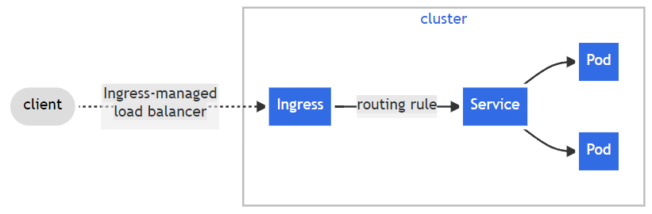
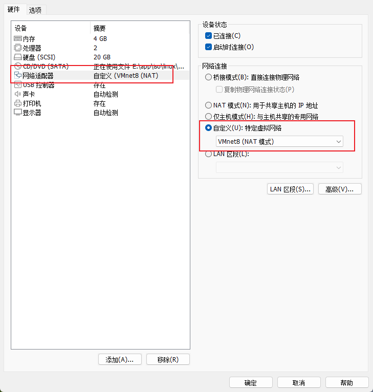
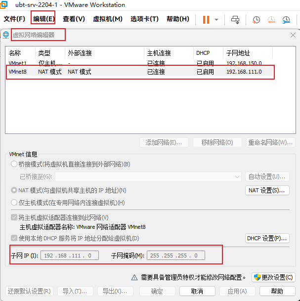
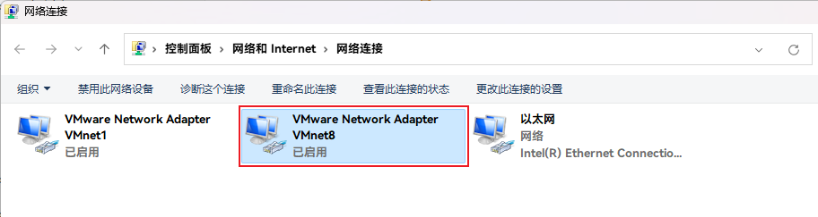
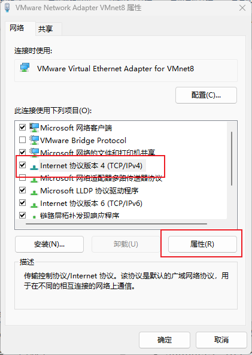
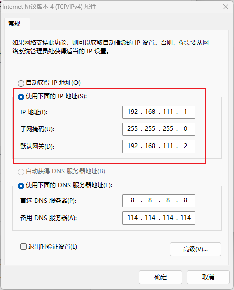
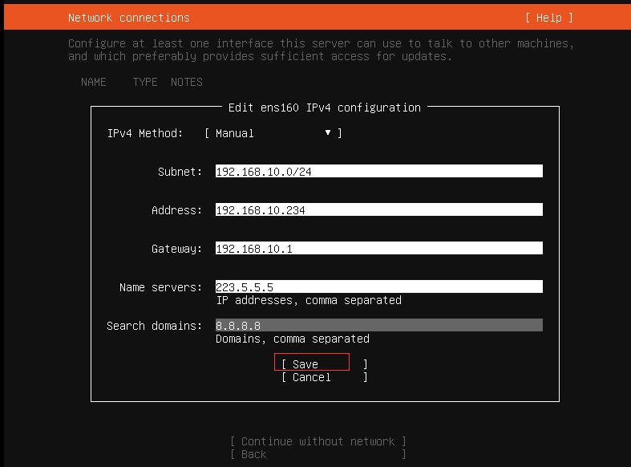
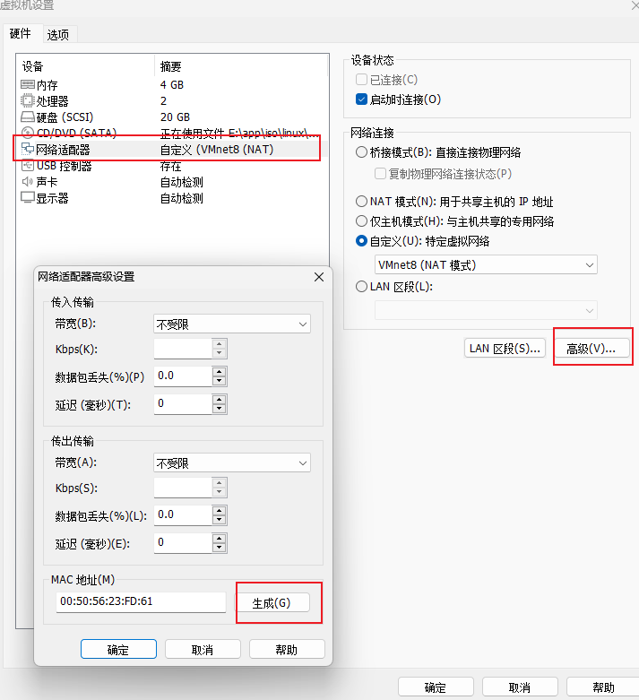

# K8s


## 前言

使用 Docker 时可能会出现这样几个问题：

* 如何协调和调度在 Docker 容器内以及不同容器之间运行的服务？
* 如何保证在升级应用程序时不会中断服务？
* 如何监视应用程序的运行状况？
* 如何批量重启容器里的程序？
* …

我们需要对容器内的应用服务进行编排、管理和调度，由此催生出 K8s。K8s 主要围绕 Pod 进行工作，Pod 是 K8s 中的最小调度单位，可以包含一个或多个容器。

> [是否真的需要 K8s？](https://www.v2ex.com/t/780960)

## 架构

K8s 一般都是以集群的形式出现的，一个 K8s 集群主要包括：master 节点（主节点）和 node 节点（工作节点）。


> * K8s 组件：https://kubernetes.io/docs/concepts/overview/components/
>
> * K8s 架构：http://docs.kubernetes.org.cn/251.html


### 节点

#### Master 节点


Master 节点如上图，包括：

* *API Server*，整个 K8s 服务对外的接口，供客户端和其他组件调用。
* *Controller Manager*，负责维护集群的状态，比如副本数量、故障检测、自动扩展、滚动更新等。
* Scheduler，负责对集群内部的资源进行调度，按照调度策略将 Pod 调度到对应的机器上。
* etcd，键值数据库，负责保存 K8s 集群的所有数据。


#### Node 节点


Node 节点包括以下内容：

* Kubelet，负责维护 node 状态并和 master 节点通信。

* Kube-Proxy，负责实现集群网络服务，为 Service 提供集群内部的服务发现和负载均衡。

* Pod，K8s 中部署的最小单位，可以包含一个或多个容器。

> 除非容器之间的服务紧密耦合，否则通常都是一个 Pod 中只有一个容器，方便管理、并易于扩展。

<br/>

#### 插件

除了以上核心组件还有其他插件：

* CoreDNS，负责未整个集群提供 DNS 服务。
* *Ingress Controller*，可以认为是类似 nginx 的代理服务，为 K8s 集群内的服务提供外网入口。
* Prometheus，提供资源监控。
* Federation，提供跨区可用的集群。


### 集群

K8s 的 master 节点和多个 node 工作节点组成 K8s 集群。


Master 负责集群的管理，协调集群中的所有行为/活动，例如应用的运行、修改、更新等；Node 节点作为工作节点，Node 可以是 VM 虚拟机，也可以是物理机。


## 单机部署

使用单机 K8s 需要部署以下组件：

* Docker；
* K8s 的命令行客户端 kubectl；
* K8s 运行环境，比如 minikube；


**开始**

1、[下载并安装 kubectl](https://kubernetes.io/docs/tasks/tools/#kubectl)

2、[安装 minikube](https://minikube.sigs.K8s.io/docs/start/)

3、启动 minicube

```bash
minikube start
```


## kubectl

kubectl 命令管理工具常见的命令如下：

- `kubectl create <deployment|namespace|xxx> <create-name>` 创建资源。
- `kubectl get <deployments | pods | services | rs>`，获取资源。
- `kubectl describe <pods | nodes | services>`，显示资源的详细信息。
- `kubectl logs`，打印 pod 中的容器日志。
- `kubectl exec`，运行 pod 中容器内部的命令。
- `kubectl delete <pod|deployment|service|ingress|namspace> <name-to-delete>` 删除某个资源。

> 删除指定状态的 pod：
>
> * `kubectl delete pod --field-selector="status.phase==Failed"` 删除默认命名空间中所有状态为 `evicted` 的 pod
> * `kubectl delete pod -A --field-selector="status.phase==Failed"` 删除所有命名空间中状态为 `evicted` 的 pod
>
> 参考: https://gist.github.com/ipedrazas/9c622404fb41f2343a0db85b3821275d?permalink_comment_id=3417466#gistcomment-3417466


## 上手

> 这里有一个快速指南还不错：https://zhuanlan.zhihu.com/p/39937913

### 创建 Deployment

0、镜像 kubernetes-bootcamp 在部署之后能通过 http://host:8001/version 访问到它的版本信息

1、使用 kubectl 拉取镜像并创建 Deployment

```bash
kubectl create deployment kubernetes-bootcamp --image=gcr.io/google-samples/kubernetes-bootcamp:v1
```

> 当你创建了一个 Deployment，K8s 会创建一个 Pod 实例。Deployment 可以看成是 Pod 的部署、管理工具，可以进行 Pod 更新，控制副本数量，回滚，重启等操作。

2、查看已创建的资源

```bash
# 查看所有 deployments
kubectl get deployments

# 查看所有 Pod
kubectl get pods

kubectl get pods -A # 显示 K8s 系统级别的 Pod
```

Pod 已经部署好了，但是此时请求 http://host:8001/version 会发现无法访问到该容器。为什么？

因为：

> Pods that are running inside Kubernetes are running on a private, isolated network. By default they are visible from other pods and services within the same kubernetes cluster, but not outside that network. 

运行在 K8s 内部的 Pod 是使用的是 K8s 私有的、与外部环境相互隔离的网络。默认情况下，Pod 的网络服务只对同一个 K8s 集群环境中的其他 Pod 可见，对外部环境不可见。

因此，我们需要使用代理，让外部的网络请能达到 K8s 集群内部的私有网络。

3、打开新的终端窗口，创建对 K8s 内部网络的代理。

```bash
kubectl proxy
```

> In order for the new Deployment to be accessible without using the proxy, a Service is required.
>
> 除了使用代理还可以使用 Service 来暴露服务，后续会介绍。

4、访问测试

```bash
curl http://localhost:8001/version
```

返回结果大概如下：

```json
{
  "major": "1",
  "minor": "27",
  "gitVersion": "v1.27.3",
  "gitCommit": "25b4e43193bcda6c7328a6d147b1fb73a33f1598",
  "gitTreeState": "clean",
  "buildDate": "2023-06-14T09:47:40Z",
  "goVersion": "go1.20.5",
  "compiler": "gc",
  "platform": "linux/amd64"
}
```

至此，一个简单的上手 demo 就完成了。


### 什么是 Pod

Pod 是 K8s 上的最小的可操作单元。当我们在 K8s 上创建 Deployment 的时候，Deployment 会创建具有一个或多个容器的 Pod。可以将 Deployment 看成是 Pod 的控制器/管理器，用来管理 Pod 的创建、扩展、销毁。


Pod 是一个抽象（逻辑）概念，可以包括一个或者多个容器，比如，一个 Pod 中可以有 Web 后端服务和前端服务两个容器。

同时还 Pod 包含了容器之间共享资源，包括：

* 共享的存储，以 Volume 的形式表示；
* 网络，同一个 Pod 中的容器 IP 地址相同，共享同一片端口区域；
* 每个容器的运行信息，比如容器镜像版本、容器使用的端口等信息。

> Pod 是 K8s 集群中所有业务类型的基础，可以看作运行在 K8s 集群中的小机器人，不同类型的业务就需要不同类型的小机器人去执行。目前 K8s 中的业务主要可以分为长期伺服型（long-running）、批处理型（batch）、节点后台支撑型（node-daemon）和有状态应用型（stateful application）；分别对应的小机器人控制器为 Deployment、Job、DaemonSet 和 PetSet。


### Pod 如何运行


Pod 在 Node 上运行，每个 Pod 都会被绑定到 Node 节点上，直到被终止或删除。Node 由 K8s 的控制面板（*Control Panel*）进行管理。

> *Control Panel* 实际上就是 Master 节点。

一个 Node 可以包含多个 Pod，K8s 通过 Master 中的 Scheduler 组件来自动管理和调度 Pod 到指定的 Node 上。

每个 Node 上至少运行以下内容：

* Kubelet，管理 Master 和 Node 节点之间的通信；管理机器上运行的 Pod。
* *Container Runtime*，负责镜像管理以及 Pod 和容器的运行，例如 Docker。

> Pod 是有生命周期的。当一个 Node 工作节点销毁时，节点上运行的 Pod 也会销毁。


### Pod 重启

1、`kubectl rollout restart`

```shell
kubectl rollout restart deployment <deployment_name> -n <namespace>
```

2、`kubectl scale`

```shell
kubectl scale deployment <deployment name> -n <namespace> --replicas=0

kubectl scale deployment <deployment name> -n <namespace> --replicas=10
```

<br/>

## 服务访问暴露


Service 是一个抽象的概念，它定义了 Pod 的逻辑分组和访问策略。

> A Service in Kubernetes is an abstraction which defines a logical set of Pods and a policy by which to access them. 

尽管每个 Pod 都有唯一的 IP，但是没有 Service 的控制， Pod 的 IP 地址都不会从 K8s 内部暴露出去。

可以通过 Service 指定不同的方式将内部服务暴露：

* ClusterIP，默认值，IP 只暴露在集群内部。
* NodePort，将 Node 中的对应端口暴露，外部可以通过 `<NodeIP>:<NodePort>` 来访问集群内的服务。
* LoadBalancer，通过云服务提供商的负载均衡器（如果支持）像外部暴露服务。
* ExternalName，通过返回 CNAME 和它的值，将服务映射到 ExternalName 字段（和 DNS 有关）。

<br/>

Service  通过 *label selector* 匹配 Pod，以对 K8s 中的一组对象进行逻辑分组。Label 是一个 key/value 键值对，主要用来描述以下几个内容的对象：

* 区分生产、开发、测试环境；
* 对 Pod 进行分类；
* 对 Pod 版本进行标记。

Label 可以在 Pod 创建时指定，也可以在任何时间进行修改。


### 创建 Service

1、检查是否存在 Service 

```bash
kubectl get services
```

2、将之前的 [Deploment](#上手) 通过 Service 暴露

```bash
# deployment/kubernetes-bootcamp 将名为 kubernetes-bootcamp 的 deployment 从 K8s 内部暴露
# --type="NodePort" 暴露的方式时 NodePort
# --port 8080 指定服务端口为 8080，表示外部请求通过公开端口进入 K8s 内部后被转发到 Pod 的 8080 端口
kubectl expose deployment/kubernetes-bootcamp --type="NodePort" --port 8080
```

再次执行

```shell
kubectl get services
```

结果如下：

```shell
NAME                  TYPE        CLUSTER-IP       EXTERNAL-IP   PORT(S)          AGE
kubernetes-bootcamp   NodePort    10.100.174.206   <none>        8080:30201/TCP   5m59s
```

可以看到现在有了一个 Service，名叫 kubernetes-bootcamp，并将 30201 端口暴露了出去。

此外还可以通过下面的命令，查看 Pod 描述，查看哪个端口被暴露

```bash
kubectl describe services/kubernetes-bootcamp
```

得到以下结果：

```bash
Name:                     kubernetes-bootcamp
Namespace:                default
Labels:                   app=kubernetes-bootcamp
Annotations:              <none>
Selector:                 app=kubernetes-bootcamp
Type:                     NodePort
IP Family Policy:         SingleStack
IP Families:              IPv4
IP:                       10.100.174.206
IPs:                      10.100.174.206
Port:                     <unset>  8080/TCP
TargetPort:               8080/TCP
NodePort:                 <unset>  30201/TCP
Endpoints:                10.244.0.5:8080
Session Affinity:         None
External Traffic Policy:  Cluster
Events:                   <none>
```

可以看到，30201 端口被暴露出去了。如果使用的是 K3s/K8s 现在就可以通过 `<NodeIP>:<exposePort>` 来访问到暴露出来的服务了。使用 MiniKube 还需要进行端口转发操作：

3、获取 Minukube 的 IP

```
minikube ip
```

4、接下来只要通过 `<Minikube IP>:<暴露出来的端口>` 即可访问目标服务

在这里<mark>踩 Minikube 的坑</mark>：通过 `minikube ip` 获取到 IP 后发现无法 ping 通该 IP。

查看 Minikube 文档，发现在 Minikube 中创建一个 service 并暴露网络的流程如下：

> The easiest way to access this service is to let minikube launch a web browser for you:
>
> ```shell
> minikube service hello-minikube
> ```
>
> Alternatively, use kubectl to forward the port:
>
> ```shell
> kubectl port-forward service/hello-minikube 7080:8080
> ```
>
> Tada! Your application is now available at http://host:7080/.


执行命令：

```shell
minikube service kubernetes-bootcamp
```

显示内容大概长这样：

```shell
|-----------|---------------------|-------------|---------------------------|
| NAMESPACE |        NAME         | TARGET PORT |            URL            |
|-----------|---------------------|-------------|---------------------------|
| default   | kubernetes-bootcamp |        8080 | http://192.168.49.2:30201 |
|-----------|---------------------|-------------|---------------------------|
🏃  Starting tunnel for service kubernetes-bootcamp.
|-----------|---------------------|-------------|------------------------|
| NAMESPACE |        NAME         | TARGET PORT |          URL           |
|-----------|---------------------|-------------|------------------------|
| default   | kubernetes-bootcamp |             | http://127.0.0.1:38451 |
|-----------|---------------------|-------------|------------------------|
🎉  Opening service default/kubernetes-bootcamp in default browser...
👉  http://127.0.0.1:38451
❗  Because you are using a Docker driver on linux, the terminal needs to be open to run it.
```

Minikube 会将外部的请求转发到对应的端口上。然后就可以通过 http://127.0.0.1:38451 来访问内部服务了。


### 使用 Label

1、查看 Label

在我们使用 `kubectl create deploment` 创建服务的时候，Deploment 会帮我们的 Pod 自动创建一个 Label，可以通过下面的命令查看：

```bash
kubectl describe deployment
```

 显示内容大概如下：

```
Name:                   kubernetes-bootcamp
Namespace:              default
CreationTimestamp:      Thu, 20 Jul 2023 11:58:00 +0800
Labels:                 app=kubernetes-bootcamp
```

2、手动创建 Label

```bash
# 在 <your-pod-name>  这个 pod 上创建一个 label：version=v1
kubectl label pods <your-pod-name> version=v1
```

3、查看创建的 Label

```
kubectl describe pods <your-pod-name>
```

返回结果如下：

```shell
Name:             kubernetes-bootcamp-855d5cc575-w7xxs
Namespace:        default
Priority:         0
Service Account:  default
Node:             minikube/192.168.49.2
Start Time:       Thu, 20 Jul 2023 11:58:00 +0800
Labels:           app=kubernetes-bootcamp
                  pod-template-hash=855d5cc575
                  version=v1
```

4、可以看到新创建的 Label 生效了。接下来就可以使用这个 Label 了：

```shell
kubectl get pods -l version=v1
kubectl get pods -l app=kubernetes-bootcamp
# or
kubectl get services -l app=kubernetes-bootcamp
# or
kubectl get pods -l 'environment in (production),tier in (frontend)'
```


### 删除 Service

> To delete Services you can use the `delete service` subcommand. Labels can be used also here:
>
> ```bash
> kubectl delete service -l app=kubernetes-bootcamp
> ```
>


## K8s 中的对象

> 操作暂时告一段落，关于上面提到的 deployment/pod/service 都是 K8s 中的 API 资源对象。K8s 常用的资源对象如下：
>
> * Pod
> * Deployment
> * Service
> * NameSpace 命名空间
> * *Replication Controller*，RC 复制控制器
> * *Replica Set*，RS 副本集（新一代的 RC）
> * Ingress，Ingress 是允许入站连接到达后端定义的端点的规则集合。
>

### 对象概念

API 对象是 K8s 集群中的管理操作单元，K8s 集群系统每支持一项新功能，引入一项新技术，一定会新引入对应的 API 对象，用来对该功能的管理操作提供支持。例如副本集 *Replica Set* 对应的 API 对象是 RS。

在 K8s 中一旦创建了对象，K8s 系统就会确保对象存在。可以通过创建对象告诉 K8s 你希望集群的是如何工作的，比如：

* 应用如何运行，在哪些节点上运行；
* 应用可用资源；
* 应用运行策略、重启策略、升级和容错策略。

### 对象属性

每个 API 对象都有 3 大类属性：

* metadata 元数据；
* spec 规范；
* status 状态。

元数据是用来标识 API 对象的，每个对象都至少有 1 个 name 元数据。除此以外还有各种各样的标签 labels 用来标识和匹配不同的对象。例如：用户可以用标签 env 来标识区分不同的服务部署环境，分别用 env=dev、env=testing、env=production 来标识开发、测试、生产的不同服务。

spec 规范描述了用户期望 K8s 集群中的分布式系统达到的理想状态，例如，用户可以通过 RC/RS 设置期望的 Pod 副本数为 3。

K8s 中所有的配置都是通过 API 对象的 spec 去设置的，用户配置好理想状态，系统则根据用户配置来运行。

> 这是 K8s 重要设计理念之一，所有的操作都是声明式（Declarative）的而不是命令式（Imperative）的。

Status 描述了系统实际当前达到的状态，例如系统当前实际的 Pod 副本数为 2；那么 RC/RS 当前的逻辑就是自动启动新的 Pod，争取达到副本数为 3。


### 常见的对象

* Deployment

* Service

* RC 是 K8s 集群中最早的保证 Pod 高可用的 API 对象。

* RS，新一代 RC。

* Namespace，命名空间，为 K8s 集群提供虚拟的隔离作用，可以通过创建新的命名空间来满足开发/测试/部署需要。K8s 集群初始有两个名字空间，分别是 default 和系统 kube-system。

* Job，Job 是 K8s 用来控制批处理型任务的 API 对象。批处理业务与长期伺服业务的主要区别是批处理业务的运行有头有尾，而长期伺服业务在用户不停止的情况下会永远运行；Job 管理的 Pod 根据用户的设置把任务成功完成就自动退出了。

* DaemonSet，长期伺服型服务（后台支撑服务）集合，典型的后台支撑型服务包括，存储，日志和监控等。

* PetSet，有状态服务集。

  在云原生应用的体系里，有下面两组近义词：第一组是无状态（stateless）、牲畜（cattle）、无名（nameless）、可丢弃（disposable）；第二组是有状态（stateful）、宠物（pet）、有名（having name）、不可丢弃（non-disposable）。

  RC/RS 主要是控制提供无状态服务的，其所控制的 Pod 的名字是随机设置的，一个 Pod 出故障了就被丢弃掉，在另一个地方重启一个新的 Pod，名字变了、名字和启动在哪儿都不重要，重要的只是 Pod 总数；而 PetSet 是用来控制有状态服务，PetSet 中的每个 Pod 的名字都是事先确定的，不能更改。

  此外，对于 RC/RS 中的 Pod，一般不挂载存储或者挂载共享存储，保存的是所有 Pod 共享的状态；而 PetSet 中的 Pod，每个 Pod 挂载自己独立的存储，如果一个 Pod 出现故障，从其他节点启动一个同样名字的 Pod，要挂载上原来 Pod 的存储继续以它的状态提供服务。

  > **应用场景**：
  >
  > 1、适合于 PetSet 的业务包括数据库服务 MySQL/PostgreSQL，集群化管理服务 Zookeeper、etcd 等有状态服务。
  >
  > 2、PetSet 的另一种典型应用场景是作为一种比普通容器更稳定可靠的模拟虚拟机的机制。传统的虚拟机正是一种有状态的宠物，运维人员需要不断地维护它，容器刚开始流行时，我们用容器来模拟虚拟机使用，所有状态都保存在容器里，而这已被证明是非常不安全、不可靠的。使用 PetSet，Pod 仍然可以通过漂移到不同节点提供高可用，而存储也可以通过外挂的存储来提供高可靠性，PetSet 做的只是将确定的 Pod 与确定的存储关联起来保证状态的连续性。

* Volume，存储卷。K8s 集群中的存储卷跟 Docker 的存储卷有些类似，只不过 Docker 的存储卷作用范围为一个容器，而 K8s 的存储卷的生命周期和作用范围是一个 Pod。每个 Pod 中声明的存储卷由 Pod 中的所有容器共享。

* [ConfigMap](https://kubernetes.io/zh-cn/docs/tasks/configure-pod-container/configure-pod-configmap/)，很多应用在其初始化或运行期间要依赖一些配置信息。 ConfigMap 是 K8s 提供的一个配置对象，可让你将配置数据注入到 Pod 中。

* [Secret](https://kubernetes.io/zh-cn/docs/concepts/configuration/secret/)，密钥对象是用来保存和传递密码、密钥、认证凭证这些敏感信息的对象。

  使用 Secret 的好处是可以避免把敏感信息明文写在配置文件里。在 K8s 集群中配置和使用服务不可避免的要用到各种敏感信息实现登录、认证等功能，例如访问 AWS 存储的用户名密码。为了避免将类似的敏感信息明文写在所有需要使用的配置文件中，可以将这些信息存入一个 Secret 对象，而在配置文件中通过 Secret 对象引用这些敏感信息。

* Federation，集群联邦。

  在云计算环境中，服务的作用距离范围从近到远一般可以有：同主机（Host，Node）、跨主机同可用区（Available Zone）、跨可用区同地区（Region）、跨地区同服务商（Cloud Service Provider）、跨云平台。

  K8s 的设计定位是单一集群在同一个地域内，因为同一个地区的网络性能才能满足 K8s 的调度和计算存储连接要求。而联合集群服务就是为提供跨 Region 跨服务商 K8s 集群服务而设计的。

* …


### 创建对象

1、提供对象的 metadata 信息以及指定对象的 spec 信息， `deployment.yaml` ：

```yaml
apiVersion: apps/v1 # Which version of the Kubernetes API you're using to create this object
kind: Deployment # What kind of object you want to create
metadata: # Data that helps uniquely identify the object, including a name string, UID, and optional namespace
  name: nginx-deployment
spec: # What state you desire for the object
  selector:
    matchLabels:
      app: nginx
  replicas: 2 # tells deployment to run 2 pods matching the template
  template: # 创建副本的时候按照模板内描述的内容来创建
    metadata:
      labels:
        app: nginx
    spec:
      containers:
      - name: nginx
        image: nginx:1.14.2
        ports:
        - containerPort: 80
```

```yaml
apiVersion: v1
kind: Service
metadata:
  name: nginx-service
spec:
  selector:
    app: nginx # 只对 label 为 nginx 的 pod 生效
  ports:
    - protocol: TCP
      port: 80
      targetPort: 80  # 提供给集群内部其他服务访问
```

> The precise format of the object `spec` is different for every Kubernetes object, and contains nested fields specific to that object. The [Kubernetes API Reference](https://kubernetes.io/docs/reference/kubernetes-api/) can help you find the spec format for all of the objects you can create using Kubernetes.

2、使用 `kubectl apply` 来创建对象

```shell
kubectl apply -f ./deployment.yaml
```


### K8s API

在上面的两个资源对象中有还有一个需要注意的地方：`apiVersion`。不同的对象 K8s 提供的 API 组和 API 版本都可能是不同的，比如 Deployment 使用的是 `apps/v1` 而 Service 使用的是 `v1`。

API 的使用和版本的区别可以在 [Kubernetes API](https://kubernetes.io/zh-cn/docs/reference/kubernetes-api/) 找到参考。


### 对象创建/管理方式

> 参考：https://kubernetes.io/zh-cn/docs/tasks/manage-kubernetes-objects/

| 创建/管理方式  | 适用对象     | 推荐场景 |
| -------------- | ------------ | -------- |
| 指令式         | 对象         | 开发     |
| 指令式对象配置 | 独立文件     | 生产     |
| 声明式对象配置 | 路径中的文件 | 生产     |

> 对象管理应该自始至终都使用同一种方式，交叉使用产生的结果可能和预期会不一致。


#### 指令方式

```shell
# 使用 kubectl 创建一个 live object
kubectl create deployment nginx --image nginx
```

优点：

* 单一动作；
* 只需要一步操作就可以管理对象。

缺点：

* 后面的命令无法与前面的命令产生交互；
* 不提供与更改相关的审计跟踪；
* 不提供用以创建新对象的模板。


#### 指令配置方式

```shell
kubectl create -f nginx.yaml # create

kubectl apply -f nginx.yaml # create|update

kubectl replace -f nginx.yaml # replace

kubectl delete -f nginx.yaml -f redis.yaml # delete
```

优点：

* 对象配置可以保存在远程；
* 对象配置执行前可以进行推送前审查更改等流程；
* 对象配置提供模板用以创建新对象。

缺点：

* 需要对配置文件结构有大致的了解；
* 需要编写 yaml 文件。

与声明式对象配置相比具有以下*优点*：

* 更加易于学习和理解；
* 随着 K8s 1.5 版本的到来，命令行配置变得更加成熟。

与声明式对象配置相比具有以下*缺点*：

* Imperative object configuration works best on files, not directories.
* Updates to live objects must be reflected in configuration files, or they will be lost during the next replacement.


#### 声明式配置

> 了解即可…

> When using declarative object configuration, a user operates on object configuration files stored locally, however the user does not define the operations to be taken on the files. Create, update, and delete operations are automatically detected per-object by `kubectl`. This enables working on directories, where different operations might be needed for different objects.

```shell
kubectl diff -f configs/
kubectl apply -f configs/
```

支持目录递归：

```shell
kubectl diff -R -f configs/
kubectl apply -R -f configs/
```


## RC/RS

**复制控制器**（*Replication Controller*， RC）通过监控运行中的 Pod 来保证集群中运行指定数目的 Pod 副本。指定的数目可以是多个也可以是 1 个；少于指定数目，RC 就会启动运行新的 Pod 副本；多于指定数目，RC 就会销毁多余的 Pod 副本。

> 即使在指定数目为 1 的情况下，通过 RC 运行 Pod 也比直接运行 Pod 更明智，因为 RC 也可以发挥它高可用的能力，保证永远有 1 个 Pod 在运行。

**副本集**（Replica Set，RS）是新一代 RC，提供同样的高可用能力，但是 RS 能支持更多种类的匹配模式。RS 对象一般不单独使用，而是作为 Deployment 的理想状态参数使用。


## Deployment

Deployment 表示对 K8s 集群的一次更新操作。作用范围比 RS 更广，可以是创建或者更新一个服务，也可以是滚动升级一个服务。

> 滚动升级一个服务，实际是创建一个新的 RS，然后逐渐将新 RS 中副本数增加到理想状态，将旧 RS 中的副本数减小到 0 的复合操作；这样一个复合操作用一个 RS 是不太好描述的，所以用一个更通用的 Deployment 来描述。


## Service

RC、RS 和 Deployment 只是保证了支撑服务的微服务 Pod 的数量，但是没有解决如何访问这些服务的问题。一个 Pod 只是一个运行服务的实例，随时可能在一个节点上停止，在另一个节点以一个新的 IP 启动一个新的 Pod，因此不能以确定的 IP 和端口号提供服务。

要稳定地提供服务需要服务发现和负载均衡能力，K8s 提供了 Service 对象。每个 Service 会对应一个集群内部有效的虚拟 IP，集群内部通过虚拟 IP 访问该 Service。


**Label/Selector**

> https://kubernetes.io/docs/concepts/overview/working-with-objects/labels/


## 应用伸缩/多实例部署

### 实例扩张

**应用伸缩之前**


**应用伸缩之后**


> *Scaling* is accomplished by changing the number of replicas in a Deployment.

在创建 Deploment 的时候只需要修改 `replicas` 参数的值就可以实现应用伸缩。伸缩/扩展 Deployment 能确保新的 Pod 在具有可用资源的 Node 上被创建，并且能减少 Pod 的数量到理想状态。

> K8s 可以实现应用的自动伸缩扩展，同时也能实现将 Pod 的数量减少到 0。

运行应用的多个实例需要一个方法将网络请求分发给它们，而 Service 正好带着负载均衡的功能，能将外部请求均匀的转发给内部应用。Service 会使用端点持续监控正在运行的 Pod，以确保流量仅发送到可用的 Pod。

**实现应用伸缩/扩展**

1、查看已经创建的 ReplicaSet 

```bash
kubectl get rs
```

输出类似下面的内容：

```
NAME                             DESIRED   CURRENT   READY   AGE
kubernetes-bootcamp-855d5cc575   1         1         1       5h28m
```

我们需要关注的字段有 2 个：

* *DESIRED*，显示当前应用期望的副本数，可以在创建 Deployment 的时候指定。
* *CURRENT*，表示当前有多少副本数正在运行。

 2、扩展副本数，使用 `kubectl scale` 命令

```shell
# 将期望副本数增加到 4 个
kubectl scale deployments/kubernetes-bootcamp --replicas=4
```

再次通过下面的命令查看，发现应用实例已经变成了 4 个。

```bash
kubectl get deployments
```

通过下面的命令查看当前 Pod 数量：

```
kubectl get pods -o wide
```

输出内容如下：

```
NAME                                   READY   STATUS    RESTARTS      AGE   IP           NODE       NOMINATED NODE   READINESS GATES
kubernetes-bootcamp-855d5cc575-gr922   1/1     Running   1 (15h ago)   15h   10.244.0.9   minikube   <none>           <none>
kubernetes-bootcamp-855d5cc575-ngsp2   1/1     Running   1 (15h ago)   15h   10.244.0.5   minikube   <none>           <none>
kubernetes-bootcamp-855d5cc575-nzsbl   1/1     Running   1 (15h ago)   15h   10.244.0.2   minikube   <none>           <none>
kubernetes-bootcamp-855d5cc575-w7xxs   1/1     Running   3 (15h ago)   21h   10.244.0.4   minikube   <none>           <none>
```

可以看到，每个 Pod 的 IP 地址都是不同的。

3、创建针对多个实例的 service，命令还是和之前的一样

```bash
kubectl expose deployment/kubernetes-bootcamp --type="NodePort" --port 8080
```

4、使用 `minikube service <service-name>` 将 minikube 网络暴露出来

```bash
🎉  Opening service default/kubernetes-bootcamp in default browser...
👉  http://127.0.0.1:44013
❗  Because you are using a Docker driver on linux, the terminal needs to be open to run it.
```

6、打开另一个终端窗口，`curl http://127.0.0.1:44013`，请求几次就可以看到，K8s 会将请求以 LoadBalance 的形式分发到各个可用的 Pod 上。

```bash
> curl http://127.0.0.1:44013
Hello Kubernetes bootcamp! | Running on: kubernetes-bootcamp-855d5cc575-ngsp2 | v=1
> curl http://127.0.0.1:44013
Hello Kubernetes bootcamp! | Running on: kubernetes-bootcamp-855d5cc575-gr922 | v=1
> curl http://127.0.0.1:44013
Hello Kubernetes bootcamp! | Running on: kubernetes-bootcamp-855d5cc575-w7xxs | v=1
```


### 实例缩减

除了扩张应用实例，K8s 同样支持缩减应用实例，命令和扩张一致，只是参数 `replicas` 的值不同

```bash
kubectl scale deployments/kubernetes-bootcamp --replicas=2
```


## 应用滚动更新

更新之前


更新第一个实例


更新第二个实例


更新第三、四个实例


K8s 中的滚动更新通过 Deployments 实现应用实例在不中断、不停机情况下更新，新的 Pod 会逐步调度到有可用的资源 Node 节点上。

K8s 的滚动更新支持以下功能：

* 应用升级；
* 版本回退；
* 不停机实现持续集成和分发。

<br/>

### 应用升级

1、首先获取一个新版本的镜像

```bash
# kubectl set image 更新一个或多个 Pod 镜像
# deployments/kubernetes-bootcamp 指定要更新的 Deployment
# kubernetes-bootcamp=jocatalin/kubernetes-bootcamp:v2 指定新的镜像
kubectl set image deployments/kubernetes-bootcamp kubernetes-bootcamp=jocatalin/kubernetes-bootcamp:v2
```

2、查看 Pod 变更状态

```bash
> kubectl get pods
NAME                                   READY   STATUS              RESTARTS      AGE
kubernetes-bootcamp-69b6f9fbb9-jzdkl   0/1     ContainerCreating   0             1s
kubernetes-bootcamp-69b6f9fbb9-n8w8x   0/1     ContainerCreating   0             8s
kubernetes-bootcamp-69b6f9fbb9-xx9s6   1/1     Running             0             8s
kubernetes-bootcamp-855d5cc575-gr922   1/1     Running             1 (15h ago)   15h
kubernetes-bootcamp-855d5cc575-ngsp2   1/1     Terminating         1 (15h ago)   15h
kubernetes-bootcamp-855d5cc575-nzsbl   1/1     Terminating         1 (15h ago)   15h
kubernetes-bootcamp-855d5cc575-w7xxs   1/1     Running             3 (15h ago)   21h
```

3、等到 Pod 状态都重新变成 Running 时继续将网络暴露，发送请求验证更新

```bash
> curl http://127.0.0.1:37417
Hello Kubernetes bootcamp! | Running on: kubernetes-bootcamp-69b6f9fbb9-wwkvx | v=2
> curl http://127.0.0.1:37417
Hello Kubernetes bootcamp! | Running on: kubernetes-bootcamp-69b6f9fbb9-n8w8x | v=2
> curl http://127.0.0.1:37417
Hello Kubernetes bootcamp! | Running on: kubernetes-bootcamp-69b6f9fbb9-xx9s6 | v=2
```

从结果可以看到，应用负载均衡状态正常，版本更新状态正常，从 v1 升级到了 v2。

4、还可以使用 `kubectl rollout status deployments/<deployment-name>` 命令检查更新状态

```bash
> kubectl rollout status deployments/kubernetes-bootcamp
deployment "kubernetes-bootcamp" successfully rolled out
```

输出类似的结果表示应用滚动更新成功。

5、此外，还可以通过检查 Pod 镜像查看滚动更新结果

```bash
$ kubectl describe pods
Name:             kubernetes-bootcamp-69b6f9fbb9-jzdkl
Namespace:        default
Priority:         0
Service Account:  default
Node:             minikube/192.168.49.2
Start Time:       Fri, 21 Jul 2023 09:30:38 +0800
Labels:           app=kubernetes-bootcamp
                  pod-template-hash=69b6f9fbb9
Annotations:      <none>
Status:           Running
IP:               10.244.0.12
IPs:
  IP:           10.244.0.12
Controlled By:  ReplicaSet/kubernetes-bootcamp-69b6f9fbb9
Containers:
  kubernetes-bootcamp:
    Container ID:   docker://e63f22e3bb9082ff462859f4c37ce1898e5e38bc1c0960f442ad8af033195ecf
    Image:          jocatalin/kubernetes-bootcamp:v2
    Image ID:       docker-pullable://jocatalin/kubernetes-bootcamp@sha256:fb1a3ced00cecfc1f83f18ab5cd14199e30adc1b49aa4244f5d65ad3f5feb2a5
```

从输出结果可以看到，Image 已经变成了新指定的镜像。


### 版本回退

该命令会撤销更新操作，默认回退到上一个已知版本。更新是有版本控制的，可以恢复到任何以前已知的部署状态。

1、可以使用 `kubectl rollout undo` 命令来进行版本回退，默认回退到上一个版本

```bash
kubectl rollout undo deployments/kubernetes-bootcamp
```

2、查询历史发布的 Deployment

```bash
kubectl rollout history deployments/<deployment-name>
```

输出内容大概如下：

```bash
deployment.apps/node-hello
REVISION  CHANGE-CAUSE
1         <none>
2         <none>
3         <none>
```

3、回退到指定版本

```bash
kubectl rollout undo deployments/<roll-back-name> --to-revision=<revision-number>
```


## 自定义服务部署

1、编写 `server.js`：

```js
const http = require('http');

const handleRequest = function(request, response) {
  console.log('Received request for URL: ' + request.url);
  response.writeHead(200);
  response.end('Hello World! V1');
};
const www = http.createServer(handleRequest);
www.listen(8080);
```

2、编写 Dockerfile：

```dockerfile
FROM node:latest
EXPOSE 8080
COPY server.js .
CMD node server.js
```

3、构建镜像，有两种方式：

3.1、使用 `minikube build`，进入 Dockerfile 所在的目录

```bash
minikube image build -t <image-name>:<build-version> .
```

3.2、使用与 Minikube VM 相同的 Docker 主机构建镜像

```bash
eval $(minikube docker-env)
docker build -t <image-name>:<build-version> .

# 退出 VM 主机
eval $(minikube docker-env -u)
```

4、查看镜像构建结果

```bash
minikube image ls
```

输出结果大概如下：

```bash
$ minikube image ls
docker.io/library/node-hello:v1
docker.io/library/hello-node:v11
```

说明镜像构建成功

5、创建 Deployment

```bash
kubectl create deployment --image=<image-name>:<version>
```

6、修改代码，发布 V2

7、重新构建镜像，使用 `kubectl set image deployments` 滚动更新应用

8、修改代码，发布 V3

9、重新构建，滚动更新应用

10、从 V3 回滚 V1

```bash
kubectl rollout undo deployments/ndoe-hello --to-revision=1
```


## Namespace

当存在大量不同类型的应用时，可以使用 namespace 来区分；还能隔离资源的使用。在 K8s 中，相同 namespace 下的应用具有相同的资源访问控制策略。

### 查看

查看当前的 namespace

```bash
kubectl get namespace
```

输出内容大概如下：

```bash
NAME                   STATUS   AGE
default                Active   29h
kube-node-lease        Active   29h
kube-public            Active   29h
kube-system            Active   29h
kubernetes-dashboard   Active   29h
```

K8s 默认存在多个 namesapce，若未指定 namespace，就会被分配到 default 命名空间。

### 创建 namespace

命令行创建

```
kubectl create namespace new-namespace
```

通过文件创建

```yaml
apiVersion: v1
kind: Namespace
metadata:
  name: new-namespace
```

### 删除 namespace

```
kubectl delete namespaces new-namespace
```

> 注意：
>
> * 删除一个 namespace 会自动删除该 namespace 下的所有资源。
> * default 和 kube-system 命名空间不可删除。


### 配置 Pod 限额

> http://docs.kubernetes.org.cn/749.html

### 配置 CPU 限额

> http://docs.kubernetes.org.cn/747.html

### 配置内存限额

> http://docs.kubernetes.org.cn/746.html


## StatefulSet

> http://docs.kubernetes.org.cn/443.html


## CronJob

> cronjob 容器内部时间与外部主机对应不上最有效的解决办法：将外部主机的 localtime 挂载到容器内部。
>
> ```yaml
> apiVersion: batch/v1
> kind: CronJob
> ...
> spec:
>   ...
>   jobTemplate: 
>     spec:
>       template:
>         spec:
>           ...
>           volumeMounts: 
>           - name: localtime
>             readOnly: true
>             mountPath: /etc/localtime
>         volumes:
>         - name: localtime
>           hostPath:
>             type: File
>             path: /etc/localtime
> ```
>
> …


## Ingress

> 关于 Ingress：https://www.v2ex.com/t/968820

Ingress 可以将 K8s 集群中的 Serivce 通过 http/https 暴露到集群外部，提供给外部访问。访问的规则被定义在 Ingress 中。



### Ingress Controller

可以把 Ingress 看成接口，或者看成是一个规则集。仅仅有 Ingress 是不够的，还需要 *Ingress Controller* 来负责实现。可以这样认为：Ingress 相当于 `nginx.conf`；*Ingress Controller* 相当于 nginx 本体。光有 Ingress 是无效的，需要两者配合才能起作用。


### 最小化 Ingress

`minimal-ingress.yaml`：

```yaml
apiVersion: networking.k8s.io/v1
kind: Ingress
metadata:
  name: minimal-ingress
spec:
  # If the ingressClassName is omitted, a default Ingress class should be defined.
  # https://kubernetes.io/docs/concepts/services-networking/ingress/#default-ingress-class
  # ingressClassName: traefik # 在有多个 ingress controller 的情况下才需要使用此字段
  rules:
  - http:
      paths:
      - path: /
        pathType: Prefix # 前缀匹配。此外还有  Exact 精确匹配 https://kubernetes.io/docs/concepts/services-networking/ingress/#examples
        backend:
          service:
            name: test-svc
            port:
              number: 8080 # service 暴露的 port
```

每个 http 规则都包含了下列信息：

* host，可选，如果指定了 host 所有定义的规则都会只对该 host 生效；否则对所有的 IP 都生效。
* paths，所有匹配的路径请求会被 ingress 分发到对应的 service 服务上。
* service 表示 ingress 收到请求后发送到的服务。
* 此外还有一个 `defaultBackend` 配置用来指定某个服务处理未匹配到的请求。


### 单 Service

1、创建 `my-ingress.yaml`：

```yaml
apiVersion: networking.k8s.io/v1
kind: Ingress
metadata:
  name: my-ingress
spec:
  rules:
    - http:
        paths:
          - path: /
            pathType: Prefix
            backend:
              service:
                name: my-server-svc
                port:
                  number: 8080
```

2、查看 Ingress 信息

```shell
kubectl describe ingress my-ingress
```

可以看到输出信息大概如下：

```shell
Name:             my-ingress
Labels:           <none>
Namespace:        default
Address:          192.168.111.11,192.168.111.12
Ingress Class:    traefik
Default backend:  <default>
Rules:
  Host        Path  Backends
  ----        ----  --------
  *
              /   my-server-svc:8080 (10.42.1.15:8080,10.42.1.16:8080)
Annotations:  field.cattle.io/publicEndpoints:
                [{"addresses":["192.168.111.11","192.168.111.12"],"port":80,"protocol":"HTTP","serviceName":"default:my-server-svc","ingressName":"default...
Events:       <none>
```

接下来就可以从 `AddressIP:80` 访问到 my-server-svc 服务。


### 多 Service

```yaml
apiVersion: networking.k8s.io/v1
kind: Ingress
metadata:
  name: my-ingress
spec:
  rules:
    - http:
        paths:
          - path: /foo
            pathType: Prefix
            backend:
              service:
                name: my-server-svc
                port:
                  number: 8080
          - path: /bar
            pathType: Prefix
            backend:
              service:
                name: your-server-svc
                port:
                  number: 8888
```


### 开启 traefik dashboard

1、[安装 traefik](https://github.com/traefik/traefik-helm-chart)

2、进行端口转发

```shell
kubectl get pods -A
kubectl port-forward traefik-xxxx-xxx --address 0.0.0.0 9000:9000
```

3、访问 `https://<your-ip>:9000/dashboard/`

> 不要忘记最后面的 `/`，它也是需要的。

参考：https://github.com/traefik/traefik-helm-chart/issues/85


### k3s 切换 ingress-nginx

在 k3s 中默认使用 traefik 来作为 *Ingress Controller*，除此之外还有 ingress-nginx 等 controller。

> 其他 [*Ingress Controller*](https://kubernetes.io/docs/concepts/services-networking/ingress-controllers/)

如果想要将 k3s 的 treafik 切换成 ingress-nginx，按照以下步骤进行：

1、用`--disable traefik`启动 K3s server，然后部署你需要的 ingress。

2、[可以使用 helm 或者 kubectl 来安装 ingress-nginx](https://docs.rancherdesktop.io/zh/how-to-guides/setup-NGINX-Ingress-Controller)：

> 建议开全局代理

```shell
helm upgrade --install ingress-nginx ingress-nginx \
  --repo https://kubernetes.github.io/ingress-nginx \
  --namespace ingress-nginx --create-namespace
```

3、等待 ingress pod 运行并检查状态：

```shell
kubectl get pods --namespace=ingress-nginx
```

4、接下来就可以编写 ingress 然后愉快的使用了~

```yaml
apiVersion: networking.k8s.io/v1
kind: Ingress
metadata:
  name: my-ingress
spec:
  rules:
    - http:
        paths:
          - path: /
            pathType: Prefix
            backend:
              service:
                name: my-server-svc
                port:
                  number: 8080
```

5、如果只能通过内外访问，无法使用外部 IP 访问 *ingress controller*，可以尝试修改 ingress-nginx-controller 的 service 配置：

```shell
kubectl edit service/ingress-nginx-controller --namespace ingress-nginx
```

将 `spec.externalTrafficPolicy` 的值设置为 `Local`。

> 上面的步骤是通过命令自动部署并运行 ingress-nginx，此外还可以通过手动的方式运行，可以参考：https://www.cnblogs.com/syushin/p/15271304.html

<br>

### 切换 controller 踩坑

> Ingress 还支持 `spec.ingressClassName` 这个字段，网上很多资料都填得很随便 `nginx-example` 或者 `nginx-1`。我也尝试随便填了 `nginx-1`：
>
> ```yaml
> apiVersion: networking.k8s.io/v1
> kind: Ingress
> metadata:
>   name: my-ingress
> spec:
>   ingressClassName: nginx-1
> ...
> ```
>
> 一同操作后创建 `my-ingress`：
>
> ```shell
> kubectl apply -f my-ingress.yaml
> ```
>
> 发现 *ingress not work as I expected*，使用 `kubectl describe ingress my-ingress` 查看发现 `Address` 一栏为空，查询许久无果。:cry:
>
> 后面在查看 [`ingress-nginx-controller.yaml`](https://raw.githubusercontent.com/kubernetes/ingress-nginx/controller-v1.1.2/deploy/static/provider/cloud/deploy.yaml) 的时候发现它的 IngressClass 配置如下：
>
> ```yaml
> apiVersion: networking.k8s.io/v1
> kind: IngressClass
> metadata:
>   name: nginx
> ...
> spec:
>   controller: k8s.io/ingress-nginx
> ```
>
> 注意看 `name: nginx`，随后尝试修改 `my-ingress.yaml`：
>
> ```yaml
> spec:
>   ingressClassName: nginx
> ```
>
> 重新创建 ingress，*it works*！`Address` 通过设置的 ingress 规则现在能成的访问到指定的服务了。
>
> 因此，在未弄清 `ingressClassName` 字段的作用的情况下，还是留空使用默认的 *ingress controller* 为妙。


volume


<br>

## Kubenetes Dashboard

> 参考：https://docs.rancher.cn/docs/k3s/installation/kube-dashboard/_index

1、下载 yaml 配置，https://github.com/kubernetes/dashboard/releases

```shell
# 以 2.7.0 为例
curl -O https://raw.githubusercontent.com/kubernetes/dashboard/v2.7.0/aio/deploy/recommended.yaml
```

2、运行创建 deployment

```shell
kubectl apply -f recommended.yaml
# 也可以直接
kubectl apply -f https://raw.githubusercontent.com/kubernetes/dashboard/v2.7.0/aio/deploy/recommended.yaml
```

3、配置用户

3.1、创建 `dashboard.admin-user.yml`

```yaml
apiVersion: v1
kind: ServiceAccount
metadata:
  name: admin-user
  namespace: kubernetes-dashboard
```

3.2、创建 `dashboard.admin-user-role.yml`

```yaml
apiVersion: rbac.authorization.k8s.io/v1
kind: ClusterRoleBinding
metadata:
  name: admin-user
roleRef:
  apiGroup: rbac.authorization.k8s.io
  kind: ClusterRole
  name: cluster-admin
subjects:
  - kind: ServiceAccount
    name: admin-user
    namespace: kubernetes-dashboard
```

4、部署 admin-user

```shell
kubectl create -f dashboard.admin-user.yml -f dashboard.admin-user-role.yml
```

5、获取 token

```shell
kubectl -n kubernetes-dashboard create token admin-user
```

6、开启代理

> 参考：https://github.com/kubernetes/dashboard/blob/master/docs/user/accessing-dashboard/README.md#login-not-available

从外部访问有以下几种方式

> **方法一：端口转发**
>
> ```shell
> Get the Kubernetes Dashboard URL by running:
>   export POD_NAME=$(kubectl get pods -n kubernetes-dashboard -l "app.kubernetes.io/name=kubernetes-dashboard,app.kubernetes.io/instance=kubernetes-dashboard" -o jsonpath="{.items[0].metadata.name}")
>   echo https://127.0.0.1:8443/
>   kubectl -n kubernetes-dashboard port-forward $POD_NAME 8443:8443
> ```
>
> ```shell
> # 监听 8080，并转发至 443
> kubectl port-forward -n kubernetes-dashboard --address 0.0.0.0 service/kubernetes-dashboard 8080:443
> ```
>
> * 访问地址：`https://<your-ip>:8080/`
> * 使用 `admin-user/token` 登录
>
> <br>
>
> **方法二：NodePort**
>
> 编辑 kubernetes-dashboard 命名空间中的 kubernetes-dashboard 服务
>
> ```shell
> kubectl -n kubernetes-dashboard edit service kubernetes-dashboard
> ```
>
> ```yaml
> apiVersion: v1
> kind: Service
> ...
> ...
>   ports:
>   - nodePort: 30169
>     port: 443
>     protocol: TCP
>     targetPort: 8443
>   selector:
>     k8s-app: kubernetes-dashboard
>   sessionAffinity: None
>   type: NodePort # 修改这一行即可，原为 ClusterIP
> status:
>   loadBalancer: {}
> ```
>
> 重新查看 kubernetes-dashboard 服务的端口地址
>
> ```shell
> kubectl -n kubernetes-dashboard get service kubernetes-dashboard
> ```
>
> 显示大概如下：
>
> ```shell
> > kubectl -n kubernetes-dashboard get service kubernetes-dashboard
> NAME                   TYPE       CLUSTER-IP      EXTERNAL-IP   PORT(S)         AGE
> kubernetes-dashboard   NodePort   10.43.191.193   <none>        443:30511/TCP   32m
> ```
>
> 现在就可以通过 `https://<your-server-ip>:30511/` 访问到控制台。
>
> **方法三：Ingress**


## Rancher

> 参考：https://ranchermanager.docs.rancher.com/pages-for-subheaders/rancher-on-a-single-node-with-docker

K8s 的配置、使用、集群管理方面基本上都是基于 `yaml` 文件，可以使用 Rancher 来管理 K8s 集群、进行项目部署等工作。

> Rancher 和 K8s 有什么区别？
>
> Rancher 和 K8s 都是用来作为容器的调度与编排系统。但是 Rancher 不仅能够管理应用容器，还能管理 K8s 集群。Rancher 2.x 底层基于 K8s 调度引擎，通过 Rancher 的封装，开发者可以在不熟悉 K8s 概念的情况下轻松的通过 Rancher 来部署容器到 K8s 集群当中。
>
> 为实现上述的功能，Rancher 自身提供了一套完整的用于管理 K8s 的组件，包括 Rancher API Server, Cluster Controller, Cluster Agent, Node Agent 等等。组件相互协作使得 Rancher 能够掌控每个 K8s 集群，从而将多集群的管理和使用整合在统一的 Rancher 平台中。Rancher 增强了一些 K8s 的功能，并提供了面向用户友好的使用方式。
>
> 参考：https://www.zhihu.com/question/309076492。

1、通过 docker 启动

```shell
docker run -d --restart=unless-stopped \
  -p 80:80 -p 443:443 \
  --privileged \
  rancher/rancher:latest
```

2、通过 `https://<host>:443` 访问


## K8s 衍生产品

* k0s: https://github.com/k0sproject/k0s，槽点：相比于 microk8s 和 k3s/k3d 体积稍大
* microk8s: https://github.com/canonical/microk8s，槽点：通过 snap 分发
* k3s: https://github.com/k3s-io/k3s/
* k3d: https://github.com/k3d-io/k3d，在 Docker 容器中运行 k3s
* minikube: https://github.com/kubernetes/minikube，槽点：不支持多节点


## K3S/K8s/K9S

> https://juejin.cn/post/6955368911705473060

> 搜索了一番暂时没有发现从 K3s 迁移/升级到 K8s 的案例。


## MICROK8S/K3s/Minikube

> MicroK8s vs K3s vs minikube: https://microk8s.io/compare


## K3s

### K3s 部署

> 参考：https://github.com/k3s-io/k3s

1、master 节点部署。

```shell
# 下载并安装
curl -sfL https://get.k3s.io | sh -
# 查看 k3s 启动状态
systemctl status|restart|stop|start k3s

# 节点查询
sudo kubectl get nodes
```

> `K3S_TOKEN` is created at `/var/lib/rancher/k3s/server/node-token` on your server.

2、worker 节点部署。

```shell
export NODE_TOKEN=<your-node-token>
curl -sfL https://get.k3s.io | K3S_URL=https://<your-server-ip>:6443 K3S_TOKEN=${NODE_TOKEN} sh -
```

3、或者手动配置 worker 节点。

```shell
export NODE_TOKEN=<your-node-token>
sudo k3s agent --server https://<your-server-ip>:6443 --node-label worker --token ${NODE_TOKEN}
```

4、设置节点角色

```shell
kubectl label nodes k8s-node1 node-role.kubernetes.io/worker=worker

node-role.kubernetes.io/worker = yes # worker 角色
node-role.kubernetes.io/master = yes # master 角色
```

### K3s 操作

**停止**

```shell
/usr/local/bin/k3s-killall.sh

systemctl stop|restart|start|status k3s
systemctl stop|restart|start|status k3s-agent
```

**卸载 Server**

```shell
/usr/local/bin/k3s-uninstall.sh
```

**卸载 Agent**

```shell
/usr/local/bin/k3s-agent-uninstall.sh
```


### 设置私有仓库地址

> 每一个节点都需要设置

编辑文件：`/etc/rancher/k3s/registries.yaml`

```yaml
mirrors:
  192.168.2.203:5000:
    endpoint:
      - "http://192.168.2.203:5000"
```


### 设置 node-role

```shell
kubectl label nodes <your-node-name> kubernetes.io/role=<node-role>
```


### 使用 Docker 来作为运行时

> 参考：[使用 Docker 作为容器运行时](https://docs.rancher.cn/docs/k3s/advanced/_index)

```shell
# 使用 containerd 安装命令
curl -sfL https://get.k3s.io | sh -
# 使用 docker 的安装命令
curl -sfL https://get.k3s.io | sh -s - --docker
# agent 同理，将 - 修改成 -s - --docker
```


## 多节点部署

> 记录 K3s 多节点的安装过程。

### 虚拟机配置

> 为了尽可能的模拟生产环境，选择 VMware 虚拟机来进行操作。

1、分配虚拟机 IP。

本次使用的系统是 ubuntu-server-22.04，安装过程中需要注意为虚拟机分配 ip，以保证各个节点之间的通讯。在 VMware 中选择好镜像首次配置好之后，在“网络适配器”一栏选择 NAT 模式：



记住此时选择的虚拟网卡是 “VMnet8”，接下来选择 VMware 左上角菜单栏“编辑”=>“虚拟网络编辑器”：



接下来虚拟机系统的 IP 地址就是要根据这个子网 IP 来配置。或者在下面的配置中需要用到“子网IP”，或者打开“控制面板\网络和 Internet\网络连接”，找到 “VMnet8”：



右键属性：



再次进入 IPv4 属性：



按照 IPv4 中的信息添加虚拟机的网络配置。

2、在虚拟机的安装过程中会出现类似下面的图：



选择手动配置 IP，根据自己的情况：

* subnet: 192.168.111.0/24
* address: 192.168.111.xx，自定义 IP
* gateway: 192.168.111.2
* name server: 8.8.8.8,225.5.5.5

其中这几个字段分别是：

* subnet，子网，对着 Windows 下的默认网关修改，将最后一位改为 0/24
* address，为此虚拟机分配的 IP，跟 Windows 保持在同一网段下。
* gateway，网关，与 Windows 一致。
* name server 表示 dns 服务器地址。

2、接下来就可以启动虚拟机了。后续还想扩充其他节点的话可以使用 VMware 的克隆功能。选择对应的虚拟机，右键 => 管理 => 克隆。克隆完成后需要修改 mac 地址：



3、克隆后的虚拟机 IP 和 hostname 都和被克隆的虚拟机一致，需要做一些修改。

3.1、修改主机名，编辑 `/etc/hostname`；

3.2 修改 IP，编辑 `/etc/netplan/*.yaml`。

保存，重启虚拟机。


### [安装 K3s 集群](#K3s 部署)


### [安装 Rancher](#Rancher)

> 使用 Rancher 管理 K3s 集群。


### 服务部署测试

1、沿用[自定义服务](#自定义服务部署)

2、将服务打包成 docker 镜像之后推送到自定义的 docker-registry

3、在每一台装有 k3s 的系统上创建文件 `/etc/rancher/k3s/registries.yaml`，内容如下

```yaml
mirrors:
  <your-ip>:<your-port>:
    endpoint:
      - "<your-ip>:<your-port>"
```

> 参考：[私有镜像仓库配置](https://docs.rancher.cn/docs/k3s/installation/private-registry/_index/)

保存后重启 K3s 服务，此时 K3s 服务就可以拉取到 Docker 私服上的镜像了。

4、测试 `my-server-deployment.yaml`：

```yaml
apiVersion: apps/v1
kind: Deployment
metadata:
  name: my-deployment
spec:
  selector:
    matchLabels:
      app: my-server
  replicas: 2
  template:
    metadata:
      labels:
        app: my-server
    spec:
      containers:
      - name: my-server
        image: my-server:latest
        ports:
        - containerPort: 8080
```

```shell
kubectl create -f my-server-deployment.yaml
```

5、创建 Service 对象 `my-server-src`：

```yaml
apiVersion: v1
kind: Service
metadata:
  name: my-service
spec:
  selector:
    app: my-server # 只对 label 为 my-server 的 pod 生效
  ports:
    - name: my-server # name of this port | optional
      protocol: TCP
      port: 8080
      targetPort: 8080  # 提供给集群内部其他服务访问
```

6、配置 Ingress，`my-server-ingress.yaml`：

```yaml
apiVersion: networking.k8s.io/v1
kind: Ingress
metadata:
  name: my-ingress
spec:
  rules:
    - http:
        paths:
          - path: /
            pathType: Prefix
            backend:
              service:
                name: my-service
                port:
                  number: 8080
```


## Harbor

> docker-registry 与 harbor：https://cloud.tencent.com/developer/article/1080444


## Helm

> 如果把 K8s 看成一个操作系统，那么 helm 就类似于 Ubuntu 中的 apt，作为一个包管理器 helm 可以用来快速安装 K8s 中的各种插件和工具。

> https://helm.sh/zh/docs/

> K3s 中使用 helm 报错：`Error: Kubernetes cluster unreachable: Get "http://localhost:8080/version": dial tcp 127.0.0.1:8080: connect: connection refused`。
>
> 解决办法：
>
> ```shell
> export KUBECONFIG=/etc/rancher/k3s/k3s.yaml
> ```
>
> 参考：https://github.com/k3s-io/k3s/issues/1126


## Volume

K8s 容器中的数据在磁盘上是临时存放的，并且每个 Pod 产生的数据是相互隔离的。此外如果 Pod 被销毁，那么 Pod 产生的数据也会跟着消失。

K8s 使用 Volume 来解决这个问题。Volume 不是单独的对象，不能被独立创建，只能在 Pod 中定义。因此 Volume 的生命周期和 Pod 的生命周期是一致的。


### Volume 的类型

* emptyDir，一个空目录
* hostPath，将主机的某个目录挂载到容器中
* ConfigMap、Secret，特殊类型，将 K8s 的特定对象挂在到 Pod 中
* PersistentVolume、PersistentVolunmeClaim，K8s 的持久化存储类型

### EmptyDir


### HostPath

### PersistentVolume

### PersistentVolumeClaim


## 部署 MySQL

### 使用 HostPath

1、配置文件 `ms.yaml`

```yaml
apiVersion: v1
kind: Service
metadata:
  name: mysql
  namespace: test
spec:
  selector:
    app: mysql
  clusterIP: None
  ports:
  - port: 3306
---
apiVersion: apps/v1 # Which version of the Kubernetes API you're using to create this object
kind: StatefulSet # What kind of object you want to create
metadata:
  name: mysql
  namespace: test
spec: # What state you desire for the object
  selector:
    matchLabels:
      app: mysql
  replicas: 1
  template: # 创建副本的时候按照模板内描述的内容来创建
    metadata:
      labels:
        app: mysql
    spec:
      containers:
      - name: mysql
        image: mysql:latest
        ports:
          - containerPort: 3306
        env:
          - name: MYSQL_ROOT_PASSWORD
            value: "123456"
        volumeMounts:
        - name: mysql-local
          mountPath: /var/lib/mysql # 将容器内部的 /var/lib/mysql 路径挂载到主机上的 /data/mysql
      volumes:
      - name: mysql-local
        hostPath:
          path: /data/mysql
```

2、创建资源对象

```shell
kubectl create namespace test
kubectl apply -f ms.yaml
```

3、创建完成连接到 MySQL 创建 user 数据库

4、删除资源对象

```shell
kubectl delete -f ms.yaml
```

5、重新创建资源对象，并查询数据库

```shell
mysql> show databases;
+--------------------+
| Database           |
+--------------------+
| goods              |
| information_schema |
| mysql              |
| performance_schema |
| sys                |
| user               |
+--------------------+
6 rows in set (0.00 sec)
```

可以看到，原先创建的 user 数据库依旧存在。

> 需要**注意**
>
> HostPath 存储的内容与节点相关，所以它不适合像数据库这类的应用，如果数据库的 Pod 被调度到别的节点，那读取的内容就完全不一样了。

---

### 使用 PV/PVC

如果要求 Pod 重新调度后仍然能使用之前读写过的数据，就只能使用网络存储了。网络存储种类非常多，且有不同的使用方法。通常，一个云服务提供商至少有块存储、文件存储、对象存储三种。

K8s 抽象了 PV（PersistentVolume）和 PVC（PersistentVolumeClaim）这两个资源对象来解耦这个问题。

* PV：描述的是持久化存储卷，定义一个持久化存储在宿主机上的目录，比如一个 NFS 的挂载目录。
* PVC：描述的是 Pod 所希望使用的持久化存储的属性，比如，Volume 存储的大小、可读写权限等。

**PV 制作方式**

* 静态制作：管理员手动创建，一般用在数量 PV 数量较少的情况下。
* 动态制作：大规模集群中可能会存在大量的 PV，此时就可以使用 StorageClass 来定义好 PV 的属性来动态创建 PV。

> StorageClass：PV 是运维人员来创建的，开发操作 PVC，可是大规模集群中可能会有很多 PV，如果这些 PV 都需要运维手动来处理这也是一件很繁琐的事情，所以就有了动态供给概念，也就是 *Dynamic Provisioning*。而我们上面的创建的 PV 都是静态供给方式，也就是 *Static Provisioning*。而动态供给的关键就是 StorageClass，它的作用就是创建 PV 模板。

**本地 PV 制作**

1、在对应节点创建并挂载本地目录

```shell
mkdir -p /mnt/disks

for vol in vol1 vol2 vol3; do
    mkdir /mnt/disks/$vol
    mount -t tmpfs $vol /mnt/disks/$vol
done
```

2、创建 `mysql-pv.yaml`

```yaml
apiVersion: storage.k8s.io/v1
kind: StorageClass
metadata:
  name: mysql-sc
  namespace: test
provisioner: kubernetes.io/no-provisioner
volumeBindingMode: WaitForFirstConsumer # 延迟 PVC 绑定，直到 pod 被调度
---
apiVersion: v1
kind: PersistentVolume
metadata:
  name: mysql-pv
  namespace: test
spec:
  capacity:
    storage: 1Gi
  volumeMode: Filesystem
  accessModes:
    - ReadWriteMany
  persistentVolumeReclaimPolicy: Retain # PVC 被删除后，PV 的留存策略
  storageClassName: mysql-sc
  local: # 表示 pv 使用本地存储
    path: /mnt/disks/vol1
  # 使用 local pv 需要定义 nodeAffinity，k8s 需要根据 nodeAffinity 将 Pod 调度到有对应 local volume 的 node 上
  nodeAffinity:
    required:
      nodeSelectorTerms:
      - matchExpressions:
        - key: kubernetes.io/hostname
          operator: In
          values:
            - ubt-srv-2
---
apiVersion: v1
kind: PersistentVolumeClaim
metadata:
  name: mysql-pvc
  namespace: test
spec:
  accessModes:
  - ReadWriteMany
  storageClassName: mysql-sc
  resources:
    requests:
      storage: 1Gi # 声明存储的大小
  volumeName: mysql-pv # 绑定 PV
```

> Local PV 目前尚不支持 *Dynamic Provisioning*，无法在创建 PVC 的时候就自动创建出对应的 PV。

3、创建资源对象

```shell
kubectl create namespace test

kubectl apply -f mysql-pv.yaml
# 查看资源信息
kubectl get sc -n test
kubectl get pv -n test
kubectl get pvc -n test
```

4、使用 PVC

```yaml
apiVersion: v1
kind: Service
metadata:
  name: mysql
  namespace: test
spec:
  selector:
    app: mysql
  clusterIP: None
  ports:
  - port: 3306
---
apiVersion: apps/v1 # Which version of the Kubernetes API you're using to create this object
kind: StatefulSet # What kind of object you want to create
metadata: # Data that helps uniquely identify the object, including a name string, UID, and optional namespace
  name: mysql
  namespace: test
spec: # What state you desire for the object
  selector:
    matchLabels:
      app: mysql
  replicas: 1
  template: # 创建副本的时候按照模板内描述的内容来创建
    metadata:
      labels:
        app: mysql
    spec:
      containers:
      - name: mysql
        image: mysql:latest
        imagePullPolicy: IfNotPresent
        ports:
          - containerPort: 3306
        env:
          - name: MYSQL_ROOT_PASSWORD
            value: "123456"
        volumeMounts:
        - name: mysql-local-pvc
          mountPath: /var/lib/mysql
      volumes:
      - name: mysql-local-pvc
        persistentVolumeClaim:
          claimName: mysql-pvc
```

5、查看对应节点下的挂载的目录信息

```shell
> df -h
Filesystem                         Size  Used Avail Use% Mounted on
vol1                               1.9G  188M  1.8G  10% /mnt/disks/vol1
```

删除并重新创建对应的资源对象可以发现数据依然能被完整保存。

---

### 设置时区

```yaml
spec: # What state you desire for the object
  ...
  template: # 创建副本的时候按照模板内描述的内容来创建
    ...
    spec:
      containers:
      - name: mysql
        volumeMounts:
        - name: localtime
          readOnly: true
          mountPath: /etc/localtime
      volumes:
      - name: localtime
        hostPath:
          type: File
          path: /etc/localtime
```


---

### 自定义配置文件

通过创建 ConfigMap 并挂载到容器中，可自定义 MySQL 配置文件。

1、创建 `mysql-cm.yaml`

```yaml
apiVersion: v1
kind: ConfigMap
metadata:
  name: mysql-config
  namespace: test
data:
  my.cnf: | # | 符号被称为折叠标记，表示下方缩进的区块中包含多行文本数据
    [mysqld]
    default_storage_engine=innodb
    lower_case_table_names=1
    character-set-server=utf8
    default-time_zone='+8:00'
    log_bin=/opt/mysql/log
```

2、使用 ConfigMap

```yaml
apiVersion: apps/v1
kind: StatefulSet
...
spec:
  containers:
  - name: mysql
    ...
    volumeMounts:
    - name: mysql-config
      # /etc/my.cnf.d/my.cnf 只对特定的 MySQL 实例生效
      # /etc/mysql/conf.d 存放 MySQL 的全局配置文件
      mountPath: /etc/my.cnf.d/my.cnf
      subPath: my.cnf
  volumes:
  - name: mysql-config
    configMap:
      name: mysql-config
```

3、进入容器内部

```shell
cat /etc/my.cnf.d/my.cnf
```

可以发现我们设置的配置生效了。

---

### 使用 Secret

像是测试环境中直接将密码明文暴露的设置方法在生产环境中是不被允许的。在 K8s 中可以借助 `Secret` 来配置犹如密码等敏感信息。

**Secret 的类型**

| 内置类型                              | 用法                                     |
| ------------------------------------- | ---------------------------------------- |
| `Opaque`                              | 用户定义的任意数据                       |
| `kubernetes.io/service-account-token` | 服务账号令牌                             |
| `kubernetes.io/dockercfg`             | `~/.dockercfg` 文件的序列化形式          |
| `kubernetes.io/dockerconfigjson`      | `~/.docker/config.json` 文件的序列化形式 |
| `kubernetes.io/basic-auth`            | 用于基本身份认证的凭据                   |
| `kubernetes.io/ssh-auth`              | 用于 SSH 身份认证的凭据                  |
| `kubernetes.io/tls`                   | 用于 TLS 客户端或者服务器端的数据        |
| `bootstrap.kubernetes.io/token`       | 启动引导令牌数据                         |

如果 `type` 值为空字符串，则被视为 `Opaque` 类型。

1、创建 `mysql-secret.yaml`

```yaml
apiVersion: v1
kind: Secret
metadata:
  name: mysql-secret
  namespace: test
type: Opaque
data:
  mysql-root-password: MTIzNDU2 # 经过 base64 加密后的密码
```

2、在容器配置中以变量引用的方式使用 Secret

```yaml
apiVersion: v1
kind: StatefulSet
spec:
  ...
  template:
    ...
    spec:
      containers:
      - name: mysql
        image: mysql:latest
        imagePullPolicy: IfNotPresent
        env:
          - name: MYSQL_ROOT_PASSWORD
            valueFrom:
              secretKeyRef:
                name: mysql-secret
                key: mysql-root-password
```

---

### 定期自动备份

可以使用 K8s 的 CronJob 来实现数据库的定期自动备份。

1、修改 Secret

```yaml
apiVersion: v1
kind: Secret
metadata:
  name: mysql-secret
  namespace: test
type: Opaque
data:
  mysql-root-password: MTIzNDU2 # 经过 base64 加密后的密码
  mysql-username: cm9vdA==
```

2、编辑 ConfigMap

```yaml
apiVersion: v1
kind: ConfigMap
metadata:
  name: mysql-ext-config
data:
  mysql-host: 127.0.0.1
```

3、编辑 Cron 配置

```yaml
apiVersion: batch/v1
kind: CronJob
metadata:
  name: mysql-backup
  namespace: test
spec:
  schedule: "* * * * *"
  #timeZone: "Etc/UTC"
  jobTemplate:
    spec:
      template:
        spec:
          restartPolicy: OnFailure
          containers:
          - name: mysql-backup
            image: mysql:latest
            imagePullPolicy: IfNotPresent
            env:
            - name: MYSQL_ROOT_PASSWORD
              valueFrom:
            - name: MYSQL_USERNAME
              valueFrom:
                secretKeyRef:
                  name: mysql-config
                  key: mysql-username
            - name: MYSQL_HOST
              valueFrom:
                configMapKeyRef:
                  name: mysql-ext-config
                  key: mysql-host
            - name: TZ
              value: Asia/Shanghai
            command:
            - /bin/sh
            - -c
            - |
              set -ex
              mysqldump --host=$MYSQL_HOST --user=$MYSQL_USERNAME \
              		--password=$MYSQL_ROOT_PASSWORD \
              		--routines --all-databases --single-transaction \
              		> /opt/mysql-all-db-backup-`date +"%Y%m%d"`.sql
            volumeMounts:
            - name: localtime
              readOnly: true
              mountPath: /etc/localtime
            - name: mysql-config
              mountPath: /etc/my.cnf.d/my.cnf
              subPath: my.cnf
            - name: mysql-config-ext
          volumes:
          - name: localtime
            hostPath:
              type: File
              path: /etc/localtime
```

> `set -ex` 用于设置脚本的执行选项。其中，`-e` 选项表示一旦脚本中的任何命令执行失败，就立即终止脚本的执行，`-x` 选项用于在执行每个命令之前打印该命令及其参数。

---

### 主从复制架构

0、Secret

```yaml
apiVersion: v1
kind: Secret
metadata:
  name: mysql-secret
  namespace: dev
type: Opaque
data:
  mysql-username: cm9vdA== # root
  mysql-root-password: MTIzNDU2 # 经过 base64 加密后的密码
```

1、主

```yaml
apiVersion: apps/v1 # Which version of the Kubernetes API you're using to create this object
kind: StatefulSet # What kind of object you want to create
metadata:
  name: mysql-master
  namespace: dev
spec: # What state you desire for the object
  selector:
    matchLabels:
      app: mysql
  replicas: 1
  template:
    metadata:
      labels:
        app: mysql
    spec:
      containers:
      - name: mysql-master
        image: mysql:latest
        ports:
          - containerPort: 3306
        env:
          - name: MYSQL_ROOT_PASSWORD
            valueFrom:
              secretKeyRef:
                name: mysql-secret
                key: mysql-root-password
        volumeMounts:
        - name: mysql-local
          mountPath: /var/lib/mysql # 将容器内部的 /var/lib/mysql 路径挂载到主机上的 /data/mysql
        - name: mysql-config
          mountPath: /etc/my.cnf.d/my.cnf
          subPath: my.cnf
      volumes:
      - name: mysql-local
        hostPath:
          path: /data/mysql
      - name: mysql-config
        configMap:
          name: mysql-config-master
---
apiVersion: v1
kind: ConfigMap
metadata:
  name: mysql-config-master
  namespace: dev
data:
  my.cnf: | # | 符号被称为折叠标记，表示下方缩进的区块中包含多行文本数据
    [client]
    default-character-set=utf8
    [mysql]
    default-character-set=utf8
    [mysqld]
    server_id=1
    default_storage_engine=innodb
    lower_case_table_names=1
    default-time_zone='+8:00'
    log_bin=/opt/mysql/log
    skip-character-set-client-handshake
    skip-name-resolve
    read-only=0
    replicate-ignore-db=mysql
    replicate-ignore-db=sys
    replicate-ignore-db=information_schema
    replicate-ignore-db=performance_schema
    binlog-do-db=db_user
    binlog-do-db=db_goods
```

2、从

```yaml
apiVersion: apps/v1 # Which version of the Kubernetes API you're using to create this object
kind: StatefulSet # What kind of object you want to create
metadata:
  name: mysql-slave
  namespace: dev
spec: # What state you desire for the object
  selector:
    matchLabels:
      app: mysql
  replicas: 2
  template:
    metadata:
      labels:
        app: mysql
    spec:
      containers:
      - name: mysql-slave
        image: mysql:latest
        ports:
          - containerPort: 3306
        env:
          - name: MYSQL_ROOT_PASSWORD
            valueFrom:
              secretKeyRef:
                name: mysql-secret
                key: mysql-root-password
        volumeMounts:
        - name: mysql-config
          mountPath: /etc/my.cnf.d/my.cnf
          subPath: my.cnf
      volumes:
      - name: mysql-config
        configMap:
          name: mysql-config-salve
---
apiVersion: v1
kind: ConfigMap
metadata:
  name: mysql-config-salve
  namespace: dev
data:
  my.cnf: | # | 符号被称为折叠标记，表示下方缩进的区块中包含多行文本数据
    [client]
    default-character-set=utf8
    [mysql]
    default-character-set=utf8
    [mysqld]
    default_storage_engine=innodb
    lower_case_table_names=1
    default-time_zone='+8:00'
    log_bin=/opt/mysql/log
    skip-character-set-client-handshake
    skip-name-resolve
    read-only=1
    replicate-ignore-db=mysql
    replicate-ignore-db=sys
    replicate-ignore-db=information_schema
    replicate-ignore-db=performance_schema
    binlog-do-db=db_user
    binlog-do-db=db_goods
```

3、Service

```yaml
apiVersion: v1
kind: Service
metadata:
  name: mysql
  namespace: dev
spec:
  selector:
    app: mysql
  clusterIP: None
  ports:
  - port: 3306
```

4、服务部署完毕进行配置

4.1、主从都要开启 root 账户允许远程访问

```sql
grant all privileges on *.* to 'root'@'%' identified by '123456' with grant option;

flush privileges;
```

4.2、主库添加主从复制账户

```sql
CREATE USER 'repl'@'%' IDENTIFIED BY '123456';
GRANT REPLICATION SLAVE ON *.* TO 'repl'@'%';
```

4.3、查看主库状态（从库连接的时候需要用到同步的 File 和同步的 Position 信息）

```sql
mysql> show master status;
+---------------+----------+--------------+------------------+-------------------+
| File          | Position | Binlog_Do_DB | Binlog_Ignore_DB | Executed_Gtid_Set |
+---------------+----------+--------------+------------------+-------------------+
| binlog.000007 |      157 |              |                  |                   |
+---------------+----------+--------------+------------------+-------------------+
1 row in set (0.00 sec)
```

4.3、从库连接主库

```sql
change master to 
master_host='<master-host>',
master_port=3306,
master_user='repl',
master_password='123456',
master_log_file='binlog.000007', # 需要和 master status 中的文件名一致
master_log_pos=157; # 需要和 master status 中的 position 一致
```

4.4、从库开启同步

```sql
start slave;

-- 此外还有以下命令
stop slave;
reset slave;
```

4.5、查看从库状态

```sql
mysql> show slave status\G
*************************** 1. row ***************************
               Slave_IO_State: Waiting for source to send event
                  Master_Host: 10.42.1.178
                  Master_User: repl
                  Master_Port: 3306
                Connect_Retry: 60
              Master_Log_File: binlog.000007
          Read_Master_Log_Pos: 766
               Relay_Log_File: mysql-slave-0-relay-bin.000002
                Relay_Log_Pos: 323
        Relay_Master_Log_File: binlog.000007
             Slave_IO_Running: Yes -- 关注
            Slave_SQL_Running: Yes -- 关注
              Replicate_Do_DB:
          Replicate_Ignore_DB:
           Replicate_Do_Table:
       Replicate_Ignore_Table:
      Replicate_Wild_Do_Table:
  Replicate_Wild_Ignore_Table:
                   Last_Errno: 0
                   Last_Error:
                 Skip_Counter: 0
          Exec_Master_Log_Pos: 766
              Relay_Log_Space: 541
              Until_Condition: None
               Until_Log_File:
                Until_Log_Pos: 0
           Master_SSL_Allowed: No
           Master_SSL_CA_File:
           Master_SSL_CA_Path:
              Master_SSL_Cert:
            Master_SSL_Cipher:
               Master_SSL_Key:
        Seconds_Behind_Master: 0
Master_SSL_Verify_Server_Cert: No
                Last_IO_Errno: 0
                Last_IO_Error:
               Last_SQL_Errno: 0
               Last_SQL_Error:
  Replicate_Ignore_Server_Ids:
             Master_Server_Id: 1
                  Master_UUID: c6d6274f-5c35-11ee-91a0-2a660ebe931b
             Master_Info_File: mysql.slave_master_info
                    SQL_Delay: 0
          SQL_Remaining_Delay: NULL
      Slave_SQL_Running_State: Replica has read all relay log; waiting for more updates -- 关注
           Master_Retry_Count: 10
                  Master_Bind:
      Last_IO_Error_Timestamp:
     Last_SQL_Error_Timestamp:
               Master_SSL_Crl:
           Master_SSL_Crlpath:
           Retrieved_Gtid_Set:
            Executed_Gtid_Set:
                Auto_Position: 0
         Replicate_Rewrite_DB:
                 Channel_Name:
           Master_TLS_Version:
       Master_public_key_path:
        Get_master_public_key: 0
            Network_Namespace:
1 row in set, 1 warning (0.00 sec)
```

主要关注这几个线程和状态：Slave_IO_State、Slave_IO_Running、Slave_SQL_Running、Slave_SQL_Running_State 和 Last_IO_Error。

5、如果主从复制过程中出现异常，一般会显示在 Last_IO_Error 字段，或者也可以查看日志表的记录

```sql
select* from performance_schema.replication_applier_status_by_worker\G -- 或者其他类似的表，如果状态异常 MySQL 会在 Slave_IO_State 或者 Slave_SQL_Running_State 中给出提示。
```

6、检查账户是否有某种权限

```sql
select * from mysql.user where User='username';

mysql> select * from mysql.user where User='repl'\G
*************************** 1. row ***************************
                    Host: %
                    User: repl
             Select_priv: N
             Insert_priv: N
             Update_priv: N
             Delete_priv: N
             Create_priv: N
               Drop_priv: N
             Reload_priv: N
           Shutdown_priv: N
            Process_priv: N
               File_priv: N
              Grant_priv: N
         References_priv: N
              Index_priv: N
              Alter_priv: N
            Show_db_priv: N
              Super_priv: N
   Create_tmp_table_priv: N
        Lock_tables_priv: N
            Execute_priv: N
         Repl_slave_priv: Y
        Repl_client_priv: N
        Create_view_priv: N
          Show_view_priv: N
     Create_routine_priv: N
      Alter_routine_priv: N
        Create_user_priv: N
              Event_priv: N
            Trigger_priv: N
  Create_tablespace_priv: N
                ssl_type:
              ssl_cipher: 0x
             x509_issuer: 0x
            x509_subject: 0x
           max_questions: 0
             max_updates: 0
         max_connections: 0
    max_user_connections: 0
                  plugin: caching_sha2_password
   authentication_string: $A$005$
                                 j}e! _A|lO.9j\qdmwgjpkRYRy/3USOLMjb1OCVds4g1KT8H.ZYLcF0rt3
        password_expired: N
   password_last_changed: 2023-09-27 09:49:01
       password_lifetime: NULL
          account_locked: N
        Create_role_priv: N
          Drop_role_priv: N
  Password_reuse_history: NULL
     Password_reuse_time: NULL
Password_require_current: NULL
         User_attributes: NULL
1 row in set (0.00 sec)
```

可以看到 `Repl_slave_priv: Y` 说明 repl 用户拥有主从复制的权限。

### 报错

1、`Authentication requires secure connection`

```sql
Last_IO_Error: Error connecting to source 'repl@10.42.1.217:3306'. This was attempt 1/10, with a delay of 60 seconds between attempts. Message: Authentication plugin 'caching_sha2_password' reported error: Authentication requires secure connection.
```

是因为MySQL 8 以上版本更换了[身份验证插件](https://dev.mysql.com/doc/refman/8.0/en/caching-sha2-pluggable-authentication.html) caching_sha2_password，使用复制用户请求服务器公钥：

```sql
mysql -u repl -p123456 -h 118.31.127.96 -P3307 --get-server-public-key
```

2、`Error executing row event: 'Unknown database 'xxx''`

在开启主从复制之前需要先将主库数据全量备份，并恢复到从库，主从复制前保证主从库的数据一致。

---

## 部署 PostgreSQL

### 准备工作

1、**仓库添加**

```shell
helm repo add bitnami https://charts.bitnami.com/bitnami

helm repo update
```

2、**Release 拉取**

```shell
helm pull bitnami/postgresql
```


### 测试环境

拉取成功后解压，编辑 `values.yaml`

```yaml
primary:
  postgresql:
    auth:
      password: "123456" # 配置 postgres 用户的密码
  service:
    type: LoadBalancer # 修改此处成 LoadBalancer 或者 NodePort，暴露给外部访问，视情况而定
```

修改完成启动服务

```shell
kubectl create namespace pg

helm install postgresql -n pg -f values.yaml bitnami/postgresql

# 查看暴露的 IP 和端口
kubectl get svc --namespace pg -w postgresql
```

自此，测试环境下应该就能正常访问了。


## 参考

### 概念

* https://kubernetes.io/docs
* http://docs.kubernetes.org.cn/
* https://zhuanlan.zhihu.com/p/345798544
* https://zhuanlan.zhihu.com/p/53260098
* https://zhuanlan.zhihu.com/p/39937913
* https://blog.csdn.net/lly337/article/details/110917930

### K8s 落地方式

* https://zhuanlan.zhihu.com/p/82666719

### 上手

* https://zhuanlan.zhihu.com/p/39937913

### Ingress

* 配置 ingress-nginx service：https://mmxblog.com/p-7005/Mmx.html

### VMware

* https://www.cnblogs.com/yeyouqing/articles/17021253.html
* https://blog.csdn.net/cal_room2032/article/details/124629068
* https://developer.aliyun.com/article/12321

局域网无法 ping：

* https://www.cnblogs.com/abc1069/p/16296050.html
* https://zhuanlan.zhihu.com/p/531664664
* https://developer.aliyun.com/article/1252261
* https://cloud.tencent.com/developer/article/2015588

### Dashboard

* https://docs.rancher.cn/docs/k3s/installation/kube-dashboard/_index
* https://www.ywbj.cc/?p=684

### Volume

* https://support.huaweicloud.com/basics-cce/kubernetes_0029.html
* https://kubernetes.io/zh-cn/docs/tasks/run-application/run-single-instance-stateful-application/
* https://kubernetes.io/zh-cn/docs/tasks/run-application/run-replicated-stateful-application/
* StorageClass：https://www.cnblogs.com/rexcheny/p/10925464.html