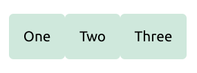

# CSS

## 布局

### Flex

> 专门设计出来用于创建横向或是纵向的一维页面布局

**使用**

在想要进行 flex 布局的父元素上应用`display: flex` ，所有直接子元素都将会按照 flex 进行布局：

* 所有子元素排成一行，因为父元素上`flex-direction`的默认值是`row`。
* 它们全都被拉伸至和最高的元素高度相同，是因为父元素上`align-items`属性的初值是`stretch`。这就意味着所有的子元素都会被拉伸到它们的 flex 容器的高度，在这个案例里就是所有 flex 项中最高的一项。
* 所有项目都从容器的开始位置进行排列，排列成一行后，在尾部留下一片空白。

```css
.wrapper {
  display: flex;
}
```

```html
<div class="wrapper">
  <div class="box1">One</div>
  <div class="box2">Two</div>
  <div class="box3">Three</div>
</div>
```


