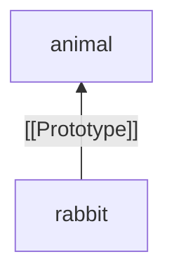
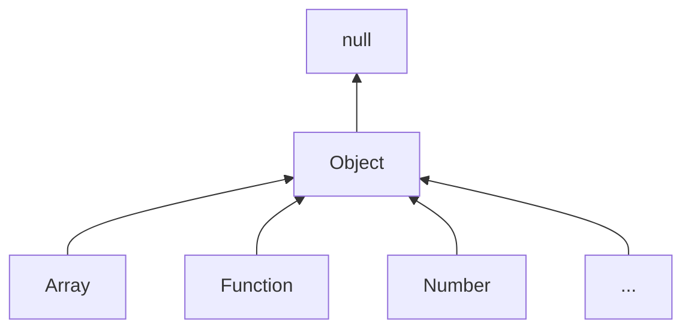
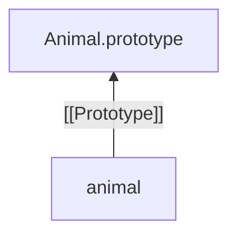
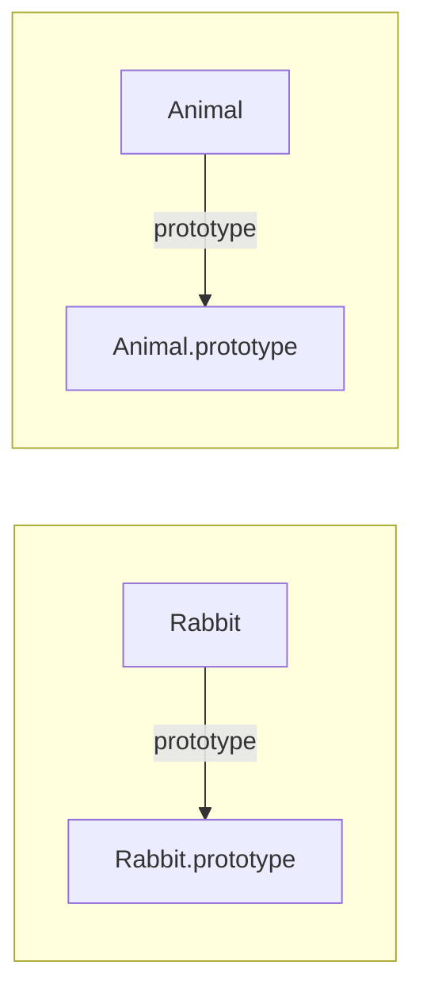
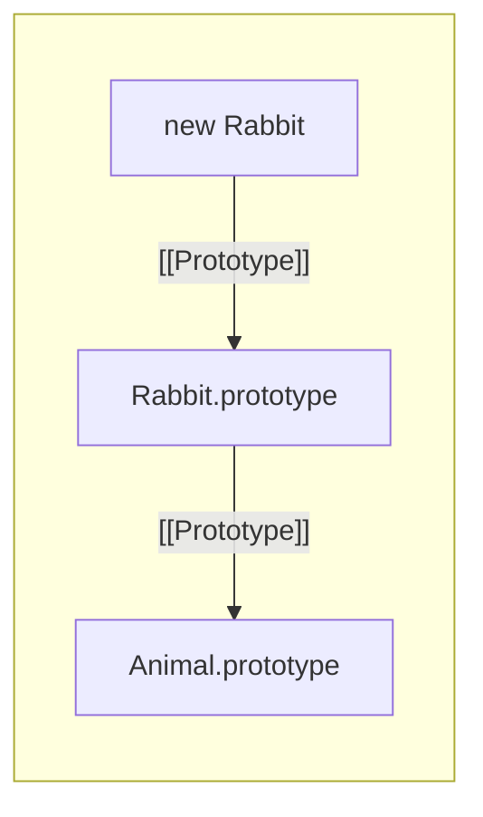
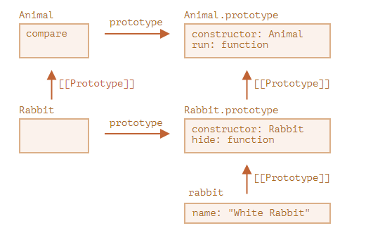
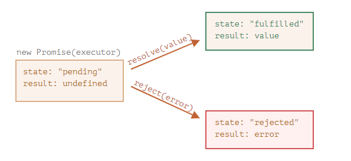

# JavaScript


## 1. 前言

<br>

### 1.1 什么是 JavaScript

首先了解几个名词：

* **函数优先**
* **原型编程**
* **多范式编程**


[函数优先（First Class Function）](https://developer.mozilla.org/zh-CN/docs/Glossary/First-class_Function)，当一门编程语言的函数可以被当作变量一样使用时，则可以认为该语言拥有**函数优先**这一特性。例如，函数可以被*当作参数*传递给其他函数，可以*作为另一个函数的返回值*，还可以被*赋值给一个变量*。


[原型编程](https://developer.mozilla.org/zh-CN/docs/Glossary/Prototype-based_programming)是一种面向对象编程的风格。在这种风格中不用显式地定义**类**，而是通过*向其它类的实例（对象）中添加属性和方法*来创建类，甚至使用*空对象*来创建类。


[多范式编程](https://en.wikipedia.org/wiki/Programming_paradigm)，指编程时的指导思想，是设计程序结构所采用的设计风格。目前主流的编程范式有：命令式编程、函数式编程、面向对象编程等


> **JavaScript**是一种具有**函数优先**的轻量级，解释型或即时编译型的编程语言。JavaScript 是一种基于**原型编程**、**多范式**的动态脚本语言，支持面向对象、命令式和声明式（如函数式编程）编程风格。JavaScript 拥有自己的语言规范，即 [ECMAScript](https://developer.mozilla.org/zh-CN/docs/Glossary/ECMAScript)，同时它的官方名称也叫做 **ECMAScript**

<br>

### 1.2 引擎

JavaScript 不仅可以在浏览器中执行，也可以在服务端执行，甚至可以在任意搭载了 [JavaScript 引擎](https://en.wikipedia.org/wiki/JavaScript_engine) 的设备中执行。不同浏览器和运行环境上搭载的 JavaScript 引擎如下：

* [V8](http://v8.js.cn/)（Chrome、Edge、[Node.js](https://nodejs.org/)）
* [SpiderMonkey](https://spidermonkey.dev/)（FireFox）


JavaScript 引擎的工作流程：

1、读取/解析 JavaScript 脚本

2、将脚本转换为机器语言

3、执行机器代码

> 除了作为 JavaScript 引擎，V8 和 SpiderMonkey 还可以作为 [WebAssembly](https://www.jianshu.com/p/e4d002780cf8) 引擎


<br>

### 1.3 作用/能力

> 现代的 JavaScript 是一种**安全的**编程语言。它*不提供对内存或 CPU 的底层访问*，因为它最初是为浏览器创建的，不需要这些功能。

JavaScript 的能力很大程度上取决于它运行的环境。例如，`Node.js` 支持允许 JavaScript 读取/写入任意文件，执行网络请求等的函数。

<br>

根据 JavaScript 运行的环境不同，它的能力也不同。例如，在**浏览器中 JavaScript 能做的功能**有：

* 在网页中添加新的 HTML，修改网页已有内容和网页的样式。
* 响应用户的行为，响应鼠标的点击，指针的移动，按键的按动。
* 向远程服务器发送网络请求，下载和上传文件。
* 获取或设置 cookie。
* 操作客户端的数据（本地存储/会话存储）

<br>

为了用户的（信息）安全，在浏览器中的 JavaScript 的能力是受限的。目的是防止恶意网页获取用户私人信息或损害用户数据。因此，JavaScript 在浏览器中受限的内容包括：

* JavaScript 最开始是专门为浏览器设计的一门语言，因此网页中的 JavaScript 不能读、写、复制和执行硬盘上的任意文件。**JavaScript 没有直接访问操作系统的功能**。

  > 现代浏览器允许 JavaScript 做一些文件相关的操作，但是这个操作是*受到限制的*。仅当用户做出特定的行为，JavaScript 才能操作这个文件。例如，用户把文件*拖放*到浏览器中，或者*通过 `<input>` 标签选择*了文件。

* 与设备上的相机/麦克风等权限时，需要获得用户的明确许可。

* 不同的标签页/窗口之间通常互不了解。可以通过一个标签页使用 JavaScript 打开另一个标签页，但如果两个标签页打开的不是同一个网站（域名、协议或者端口任一不相同的网站），它们都不能相互通信。

  > 这就是浏览器的**同源策略**，要解决这个问题，可以使用 [CORS（Cross-Origin Resource Sharing） 跨域资源共享](https://developer.mozilla.org/zh-CN/docs/web/http/cors)


<br>

### 1.4 开发手册

> 对于一些作用和意义不太明确的内置方法和 API，可以使用 MDN 的 JavaScript 参考手册来搜索相关内容，查找相关解释

* [MDN JavaScript 参考](https://developer.mozilla.org/zh-CN/docs/Web/JavaScript/Reference)

<br>

### 1.5 兼容性表

>JavaScript 是一门还在发展中的语言，定期会添加一些新功能，可以通过兼容性表查看不同浏览器中对新功能的支持情况

* [MDN JavaScript 参考](https://developer.mozilla.org/zh-CN/docs/Web/JavaScript/Reference)
* [Caniuse](https://caniuse.com/)


<br>

### 1.6 代码风格

* [JavaScript 代码风格](https://zh.javascript.info/coding-style)


<br>

## 2. 基础

**JavaScript 的使用形式**

* 使用`<script>`标签的`src`属性引入，添加到 HTML 文件中
* 在`<script>`标签内编写 JavaScript 脚本内容

> ⚠
>
> 一般来说，*简单*的脚本才嵌入到 HTML 中。复杂的脚本存放在单独的文件中。
>
> 使用独立文件的好处是浏览器会下载它，然后将它保存到浏览器的缓存中，其他页面想要相同的脚本就会从缓存中获取，而不是下载它。所以文件实际上只会下载一次（节省流量，加快页面加载）


<br>

### 2.1 基础交互

JavaScript 提供了以下三个基础的交互方式：

* `alert`，它会显示一条信息，并等待用户确认。`alert`会自动调用输出参数的`toString`方法，而`console.log`不会
* `confirm`，显示一个带有问题以及确定和取消两个按钮的模态窗口。点击确定返回 `true`，点击取消返回 `false`。
* `prompt`，显示一个带有文本消息的模态窗口，还有 input 框和确定/取消按钮。


> ⚠
>
> 上述三个方法**都是模态的：它们暂停脚本的执行，并且不允许用户与该页面的其余部分进行交互，直到窗口被解除。**


<br>

### 2.2 数据类型

除了`Object`是复杂类型，其他都是原始类型。原始类型并不像对象一样存储键值属性。

* `Number`

* `BigInt`
* `String`
* `Boolean`
* `Object`
* `Symbol`
* `null`
* `undefined`


<br>

#### 2.2.1 **Number**

> 双精度浮点数，以 64 位的格式进行存储

**Number** 包含几个特殊值：`Infinity`、`-Infinity`、`NaN`

* `Infinity`，表示无穷大，可以通过 `1 / 0` 来得到它
* `NaN`，代表一个计算错误，它是一个不正确的或者一个未定义的数学操作所得到的结果。`NaN` 是粘性的。任何对 `NaN` 的进一步数学运算都会返回 `NaN`，只有一个例外：`NaN ** 0 === 1`。很好理解，任何一个`Number`类型的 0 次幂结果都是 1

> 在 JavaScript 中做数学运算是安全的，可以做任何事，包括除以 0。不会像 Java 一样报错，最坏的情况仅仅是得到一个`NaN`结果


```js
let billion = 1000000000;

// 也可以使用下划线 _ 作为分隔符：
let billion = 1_000_000_000;
// 下划线扮演了“语法糖”的角色，使得数字具有更强的可读性，JavaScript 引擎会直接忽略数字之间的下划线

let billion = 1e9;  // 10 亿，字面意思：数字 1 后面跟 9 个 0
alert( 7.3e9 );  // 73 亿（与 7300000000 和 7_300_000_000 相同）

let mcs = 0.000001;
let mcs = 1e-6; // 1 的左边有 6 个 0

// -3 除以 1 后面跟着 3 个 0 的数字
1e-3 === 1 / 1000; // 0.001

// -6 除以 1 后面跟着 6 个 0 的数字
1.23e-6 === 1.23 / 1000000; // 0.00000123
```

<br>

**进制转换**

```js
let num = 255;

// 进制范围可以从 2 到 36。默认情况下是 10。
alert( num.toString(16) );  // ff
alert( num.toString(2) );   // 11111111

// 当我们需要将一个较长的数字标识符转换成较短的时候，例如做一个短的 URL。可以简单地使用基数为 36 的数字系统表示
alert( 123456..toString(36) ); // 2n9c

// 使用两个点来调用一个方法
// 如果想直接在一个数字上调用一个方法，比如上面例子中的 toString，那么我们需要在它后面放置两个点 ..
// 如果放置一个点：123456.toString(36)，那么就会出现一个 error，因为 JavaScript 语法隐含了第一个点之后的部分为小数部分
// 如果我们再放一个点，那么 JavaScript 就知道小数部分为空，然后调用该方法
```

<br>

**常用方法**

```js
// 向下取整
Math.floor

// 向上取整
Math.ceil

//  四舍五入
Math.round

// 单单舍弃小数点后的内容，而不进行四舍五入操作（不支持 IE）
Math.trunc

// 四舍五入，保留小数点后 n 位，返回结果是字符串
Number.toFixed(n)
let sum = 0.1 + 0.2
// 将结果转换为数字
let res = +sum.toFixed(2)

// 将其参数转换为数字，然后测试它是否为 NaN
isNaN(value) 
// 不能只使用 === NaN 比较吗？
// 不行。值 “NaN” 是独一无二的，它不等于任何东西，包括它自身
// js 傻逼吧？🙄

// 将其参数转换为数字，如果是常规数字，则返回 true
// 有时 isFinite 被用于验证字符串值是否为常规数字
isFinite(value) 
```

<br>

**`parseInt` 和 `parseFloat`**

使用加号 `+` 或 `Number()` 的数字转换是严格的。如果一个值不完全是一个数字，就会失败。此时可以使用`parseInt`和`parseFloat`。

它们可以从字符串中“读取”数字，直到无法读取为止。如果发生错误，则返回收集到的数字。函数 `parseInt` 返回一个整数，而 `parseFloat` 返回一个浮点数

```js
parseInt('10001px100') // 10001

alert( parseInt('100px') ); // 100
alert( parseFloat('12.5em') ); // 12.5

alert( parseInt('12.3') ); // 12，只有整数部分被返回了
alert( parseFloat('12.3.4') ); // 12.3，在第二个点出停止了读取

// 某些情况下，parseInt/parseFloat 会返回 NaN
alert( parseInt('a123') ); // NaN，第一个符号停止了读取
```

<br>

**`parseInt(str, radix)` 的第二个参数**

`parseInt()` 函数具有可选的第二个参数。它指定了数字系统的基数，因此 `parseInt` 还可以解析十六进制数字、二进制数字等的字符串

```js
alert( parseInt('0xff', 16) ); // 255
alert( parseInt('ff', 16) ); // 255，没有 0x 仍然有效

alert( parseInt('2n9c', 36) ); // 123456
```


> * [更多](https://developer.mozilla.org/zh-CN/docs/Web/JavaScript/Reference/Global_Objects/Number)关于`Number`的内容
> * [更多](https://developer.mozilla.org/zh-CN/docs/Web/JavaScript/Reference/Global_Objects/Math)关于`Math`的内容


<br>

#### 2.2.2 **BigInt**

`Number`的范围是`-2^53 ~ 2^53`。对于超过或者小于`Number`类型的整数，例如用于加密或者微秒精度的时间戳，可以使用`BigInt`来表示。`BigInt`可以表示任意长度的整数，创建时需要在数值的末尾加上`n`来表示这是一个`BigInt`类型。

```javascript
// 尾部的 "n" 表示这是一个 BigInt 类型
const bigInt = 1234567890123456789012345678901234567890n;
```


> [更多](https://developer.mozilla.org/zh-CN/docs/Web/JavaScript/Reference/Global_Objects/BigInt)关于`BigInt`的内容


<br>

#### 2.2.3 **String**

在 JavaScript 中有3种字符串比表达方式：

1、单引号

2、双引号

3、反引号

```javascript
let str = "Hello";
let str2 = 'World';
// 反引号常用作变量嵌入，或者表达式嵌入
let str3 = `can embed another ${str}`;

// 反引号还支持换行
let str4 = `
line1
*
line2
*
line3
`

// 特殊字符需要使用 \ 来进行转义
```

<br>

**`length`属性**

* `str.length`

与其他语言的`length()`方法不同，JavaScript 中`length`是字符串的一个属性

<br>

**访问字符**

* `str[index]`
* `str.charAt(index)`

在 JavaScript 中，字符串类型可以通过中括号`[index]`和`chatAt(index)`方法来访问某个下标的字符内容。相对来说使用中括号访问是一种更为现代的方法，这两种方法不同的地方在于如果访问的位置不存在字符内容，`[]`返回`undefined`，而`charAt`返回空字符。

<br>

**遍历字符**

可以使用`for...of`循环来遍历字符

```js
let str = 'abcdefg'
for(let s of str) {
    console.log(s)
}
// a
// b
// c
// ...
```

<br>

**截取字符**

* `slice(start[, end])`，返回一个字符串，从 start 开始，到 end 结束，但不包括 end（start 不能大于 end）。end 可以忽略，表现结果即为从 start 开始，一直到末尾。支持负值（逆序，最后一个字符下标为 -1）。

  ```js
  let str = 'abcdegf'
  
  let str1 = str.slice(2) // cdegf
  
  let str2 = str.slice(2, 4) // cd
  
  let str3 = str.slice(-4, -1) // deg
  ```

  

* `substring(start[, end])`，与`slice()`几乎相同。但不支持负值，允许 start 大于 end。

  ```js
  let str = 'abcdegfh'
  
  // start > end 相当于从 end 开始取到 start，但是不包括 start
  let str1 = str.substring(6, 2) // cdeg
  // slice 不支持 start > end
  let str1 = str.slice(6, 2) // “”
  ```

  

* `substr(start[, length])`，返回从 start 开始，长为`length`部分的内容。与上面的两个方法相比，允许指定长度而不是结束位置。start 允许为负数


> ❓
>
> **应该使用哪个方法？**
>
> 比较推荐`slice`，相对于其他两个方法来说，`slice`比较灵活，允许负值，且写法更为简短。

<br>

**字符串值比较**

字符串比较按照字母顺序逐个比较，小写字母总是大于大写字母。在 JavaScript 中所有的字符串都使用`UTF-16`编码，每个字符都有对应的数字代码。

```js
"z".codePointAt(0) // 122
"Z".codePointAt(0) // 90

String.fromCodePoint(90) // Z
String.fromCodePoint(122) // z

let str = '';

for (let i = 65; i <= 220; i++) {
  str += String.fromCodePoint(i);
}
alert( str );
// ABCDEFGHIJKLMNOPQRSTUVWXYZ[\]^_`abcdefghijklmnopqrstuvwxyz{|}~€‚ƒ„
// ¡¢£¤¥¦§¨©ª«¬­®¯°±²³´µ¶·¸¹º»¼½¾¿ÀÁÂÃÄÅÆÇÈÉÊËÌÍÎÏÐÑÒÓÔÕÖ×ØÙÚÛÜ
```


正确的字符串比较方式是采用`localeCompare()`方法

```js
str.localeCompare(str2)

// 如果 str 排在 str2 前面，则返回负数
// 如果 str 排在 str2 后面，则返回正数
// 如果它们在相同位置，则返回 0
```


> [更多](https://developer.mozilla.org/zh-CN/docs/Web/JavaScript/Reference/Global_Objects/String)关于`String`的内容


<br>

#### 2.2.4 **null**

JavaScript 中`null`值**不是**代表**引用或者 null 指针**，**而是**代表**值未知、空、无**的特殊类型值


<br>

#### 2.2.5 **undefined**

JavaScript 中`undefined`的含义是**未被赋值**。如果一个变量已被声明，但未被赋值，那么它的值就是`undefined`。


根据上述，因此可以显示的给一个变量赋予`undefined`

```js
let age = 100;

// 将值修改为 undefined
age = undefined;
```

> 但是不建议这样做。通常是使用 `null` 将一个**空**或者**未知**的值赋予变量，而 `undefined` 则保留作为未进行初始化的事物的默认初始值。


<br>

#### 2.2.6 **Object**

`Object` 类型是一个特殊的类型。其他所有的数据类型都被称为**原始类型/基础类型**，`Object`则是一个**复杂数据类型**，因为它们的值只包含一个单独的内容（字符串、数字或者其他）。`Object` 则用于储存数据集合和更复杂的实体。


<br>

#### 2.2.7 **Symbol**

> 应用场景：“隐藏”属性（非全局`Symbol`的使用）、系统`Symbol`（全局`Symbol`的使用）

根据 JavaScript 规范，只有两种类型能够用来作为对象的键值：字符串和`symbol`。如果使用其他类型会被自动转换为字符串：`obj[1]`等价于`obj["1"]`，`obj[true]`等价于`obj["true"]`。


> `Symbol` 类型用于**创建对象的唯一标识符**。并且任何`Symbol`都具有 `description` 属性


```js
// 创建一个 Symbol 类型的变量
let id = Symbol('id')

// Symbol 严格保证是唯一的。
// 即使我们创建了许多具有相同描述的 Symbol，它们的值也是不同。描述只是一个标签，不影响任何东西。

let id = Symbol("id")
let id2 = Symbol(id)

id == id2 // false
```


`Symbol`类型的变量不会自动转换为字符串

```js
let id = Symbol("id");
alert(id); // 类型错误：无法将 symbol 值转换为字符串。

// 这是一种防止混乱的“语言保护”，因为字符串和 symbol 有本质上的不同，不应该意外地将它们转换成另一个。
// 如果我们真的想显示一个 symbol，需要用它的 toString() 方法

let id = Symbol("id");
alert(id.toString()); // Symbol(id)，现在它有效了

// 获取 symbol.description 属性
let id = Symbol("id");
alert(id.description); // id
```


<br>

**“隐藏”属性**

> “隐藏”属性并不是真正意义上的“隐藏”，只是外部代码无法访问，并且不显示在`for...in`而已

```js
Symbol('id') == Symbol('id') // false
```

因为任何两个`Symbol`无论描述是否一致都是不相等的，因此可以使用`Symbol`来创建一个其他部分的代码无法访问到的属性。例如，需要给对象添加标识符：

```js
// User.js
let id = Symbol('id')
let user = {
    name: 'aaa',
    // 在对象字面量中使用 Symbol 需要使用计算属性
    [id]: 1,
}

// 其他部分的代码
// index.js
let id = Symbol('id')
user[id] // 无法访问
```


<br>

**特别的**

1、`Symbol`属性在`for...in`中会被跳过

```js
let id = Symbol('id')
let user = {
    name: 'aaa',
    [id]: 1
}

for (let u in user) {
    console.log(u)
}

// output
name
```


2、`Object.keys(object)`也会忽略`Symbol`属性

3、`Object.assign(target, source)`会同时复制字符串和`symbol`属性


<br>

**全局 Symbol**

如上文所说，就算两个`Symbol`的名字相同，但是本质上它们还是不同的两个对象。但有时其他部分的代码需要访问这个`Symbol`属性的内容，如何实现？可以使用**全局`Symbol`注册表**。

可以在注册表中创建`Symbol`对象，并在之后使用它们，这就能确保每次访问相同名字的`Symbol`时，返回的都是相同的`Symbol`。

要从注册表中读取`Symbol`对象，可以使用`Symbol.for(key)`。该调用会检查全局注册表，如果有一个描述为`key`的`Symbol`对象则返回，如果该对象不存在则创建，并存储在注册表中。

```js
// 通过 name 获取 symbol
let sym = Symbol.for("name");
let sym2 = Symbol.for("id");

// 通过 symbol 获取 name
alert( Symbol.keyFor(sym) ); // name
alert( Symbol.keyFor(sym2) ); // id
```


对于全局`Symbol`来说，不仅有`Symbol.for(key)`，还有它的反向操作：`Symbol.keyFor(symbol)`，作用就是根据`Symbol`返回它的名字。需要注意的是，`Symbol.keyFor` 内部使用全局`Symbol `注册表来查找`Symbol`的键。所以它不适用于非全局`Symbol`。如果`Symbol`不是全局的，它将无法找到它并返回 `undefined`。

```js
let globalSymbol = Symbol.for("name");
let localSymbol = Symbol("name");

alert( Symbol.keyFor(globalSymbol) ); // name，全局 symbol
alert( Symbol.keyFor(localSymbol) ); // undefined，非全局

alert( localSymbol.description ); // name
```


<br>

**系统 Symbol**

JavaScript 内部有很多**系统的**`Symbol`，我们可以使用它们来**微调对象的各个方面**。

* `Symbol.toPrimitive`
* `Symbol.hasInstance`
* `Symbol.iterator`
* …

> [更多](https://tc39.es/ecma262/#sec-well-known-symbols)关于系统`Symbol`的内容


<br>

#### 2.2.8 原始类型内置方法

```js
let str = 'hello'

// 调用原始类型 String 的内置方法 toUpperCase
str.toUpperCase() // HELLO
```


当调用原始类型的内置方法时，JavaScript 进行了以下操作：

1. 字符串`str`是一个原始值，在访问其属性时，会创建一个包含字符串字面值的特殊对象，并且具有有效的方法，例如 `toUpperCase()`
2. 该方法运行并返回一个新的字符串
3. 特殊对象被销毁，只留下原始值 `str`

JavaScript 引擎高度优化了这个过程。它甚至可能跳过创建额外的对象。但是它仍然必须遵守规范，并且表现得好像它创建了一样。所以原始类型可以提供方法，但它们依然是轻量级的。


> ⚠
>
> `null/undefined`没有任何内置方法


<br>

### 2.3 类型转换

<br>

**String 类型转换**

字符串转换最明显。`false` 变成 `"false"`，`null` 变成 `"null"` 等。


<br>

**Number 类型转换**

在算术函数和表达式中，会自动进行`number`类型转换。

```js
alert( "6" / "2" ); // 3, string 类型的值被自动转换成 number 类型后进行计算
```

也可以使用 `Number(value)` 显式地将这个 value 转换为`number`类型。

```js
// string to number 
// 去掉首尾空格后的纯数字字符串中含有的数字。如果剩余字符串为空，则转换结果为 0。
// 当类型转换出现 error 时返回 NaN。
let str = "123";
let num = Number(str); // 变成 number 类型 123
alert(num); // 123

// 如果输入的内容不是一个有效的字符串
let age = Number("an arbitrary string instead of a number");
alert(age); // NaN，转换失败

Number('') // 0
Number(true) // 1
Number(false) // 0
Number(null) // 0
Number(undefined) // NaN

// +value 的效果和 Number(value) 的效果相同
```


<br>

**Boolean 类型转换**

- 直观上为**空**的值（如 `0`、空字符串、`null`、`undefined` 和 `NaN`）变为 `false`。
- 其他值变成 `true`


<br>

### 2.4 运算符

* 数学运算符
* 赋值运算符
* 逗号运算符
* `typeof`运算符
* 逻辑运算符


<br>

#### 2.4.1 数学运算

**幂运算**

```js
// 求 n 的 m 次方
let res = n ** m
```


<br>

#### 2.4.2 赋值运算符

**链式赋值**

```js
let a = b = c = 1 + 2 
// a = 2
// b = 2
// c = 2
```


<br>

#### 2.4.3 逗号运算符

```js
let a = (1 + 2, 3 + 4);

alert( a ); // 7（3 + 4 的结果）

// 如果没有括号
let b = 1 + 2, 3 + 4
alert(b) // 3，后面的表达式不会执行

const firstFunc = () => {
    console.log('do some thing first')
    return 1
}
const secFunc = () => {
    console.log('the second function')
    return 2
}
let a = (firstFunc(), secFunc())
console.log(a) 
// do some thing first
// the second function
// 2
```

第一个语句 `1 + 2` 运行了，但是它的结果被丢弃了。随后计算 `3 + 4`，并且该计算结果被返回


<br>

#### 2.4.4 逻辑运算符

<br>

**或运算**

1、或运算符**寻找第一个真值**

```js
let result = value1 || value2 || value3;
```

或运算符 `||` 做了如下的事情：

* 从左到右依次计算操作数。
* 处理每一个操作数时，都将其转化为布尔值。如果结果是 `true`，就停止计算，返回这个操作数的初始值。
* 如果所有的操作数都被计算过（也就是，转换结果都是 `false`），则返回最后一个操作数。

**返回的值是操作数的初始形式，不会做布尔转换。**

```js
alert( 1 || 0 ); // 1（1 是真值）

alert( null || 1 ); // 1（1 是第一个真值）
alert( null || 0 || 1 ); // 1（第一个真值）

alert( undefined || null || 0 ); // 0（都是假值，返回最后一个值）
```


2、或运算短路求值

这指的是，`||` 对其参数进行处理，直到达到第一个真值，然后立即返回该值，而无需处理其他参数。

```js
true || alert("not printed");
false || alert("printed");

// 在第一行中，或运算符 || 在遇到 true 时立即停止运算，所以 alert 没有运行。只会打印第二条信息
```


<br>

**与运算**

1、与运算**寻找第一个假值**

```js
let result = value1 && value2 && value3;
```

与运算 `&&` 做了如下的事：

* 从左到右依次计算操作数。
* 在处理每一个操作数时，都将其转化为布尔值。如果结果是 `false`，就停止计算，并返回这个操作数的初始值。
* 如果所有的操作数都被计算过（例如都是真值），则返回最后一个操作数。

换句话说，与运算返回第一个假值，如果没有假值就返回最后一个值。

```js
// 如果第一个操作数是真值，
// 与运算返回第二个操作数：
alert( 1 && 0 ); // 0
alert( 1 && 5 ); // 5

// 如果第一个操作数是假值，
// 与运算将直接返回它。第二个操作数会被忽略
alert( null && 5 ); // null
alert( 0 && "no matter what" ); // 0
```


> ⚠
>
> 与运算 `&&` 的优先级比或运算 `||` 要高。**与运算** `&&` **在或运算** `||` **之前进行**


<br>

#### 2.4.5 一元操作符

##### 一元正值/负值符

```js
// 一元正值
let y = 1
// 加号 + 应用于单个值，对数字没有任何作用
y = +y
alert(y) // 1

// 如果运算元不是数字，加号 + 则会将其转化为数字。+value 的效果和 Number(value) 的效果相同
// 转化非数字
alert( +true ); // 1
alert( +"" );   // 0

// 一元负值
let x = 1
x = -x //
alert(x) // -1
```

<br>

##### typeof

`typeof` 运算符返回参数的类型。可以进行数据类型检验。

```js
typeof undefined // "undefined"

typeof 0 // "number"

typeof 10n // "bigint"

typeof true // "boolean"

typeof "foo" // "string"

typeof Symbol("id") // "symbol"

// Math 是一个提供数学运算的内置 object
typeof Math // "object"

typeof null // "object"

// typeof null 的结果为 "object"。这是官方承认的 typeof 的错误，这个问题来自于 JavaScript 语言的早期阶段，并为了兼容性而保留了下来。null 绝对不是一个 object。null 有自己的类型，它是一个特殊值。typeof 的行为在这里是错误的。
// check link: https://zh.javascript.info/types#type-typeof

// JavaScript 中的基本数据类型都存储在 32 位的二进制单元当中，低三位的数字用于表示该数据的类型。object 的前三位是 0，null 的二进制表示是全 0。typeof 的实现就是通过判断低三位的数字来判断值类型的，因此 typeof null 会返回结果“object”

//  alert 在 JavaScript 中是一个函数
typeof alert // "function"
```

> `typeof(X)`语法与`typeof X`相同


<br>

##### delete

`delete` 操作符用于删除一个对象的属性或者一个数组中某一个键值

```js
// objectName 是一个对象名，property 是一个已经存在的属性
delete objectName.property;
// index 是数组中的一个已经存在的键值的索引值
delete objectName[index];
```

**只能使用 `delete` 删除各种各样的隐式声明的变量**， 被`var/let/const`声明的显式变量则不能删除。

```js
x = 42;
var y = 43;
myobj = new Number();
myobj.h = 4;    // create property h
delete x;       // returns true (can delete if declared implicitly)
delete y;       // returns false (cannot delete if declared with var)
delete Math.PI; // returns false (cannot delete predefined properties)
delete myobj.h; // returns true (can delete user-defined properties)
delete myobj;   // returns true (can delete if declared implicitly)
```


<br>

**删除数组元素**

删除数组中的元素时，数组的长度是不变的，例如删除`a[3]`, `a[4]`，`a[4]`和`a[3]` 仍然存在，只是值变成了`undefined`。

> ⚠
>
> 如果想让数组中存在一个元素，但是值为`undefined`，应该使用`undefined`关键字赋值，而不是`delete`操作


> [更多](https://developer.mozilla.org/zh-CN/docs/Web/JavaScript/Reference/Operators/delete)关于`delete`的内容


<br>

##### void

> [更多](https://developer.mozilla.org/zh-CN/docs/Web/JavaScript/Reference/Operators/void)关于`void`的内容


<br>

#### 2.4.6 关系操作符


##### in

[in 操作符](https://developer.mozilla.org/en-US/docs/Web/JavaScript/Reference/Operators/in)，如果所指定的**属性**确实存在于所指定的对象中，则会返回`true`

```js
propNameOrNumber in objectName
```

在这里`propNameOrNumber `可以是一个代表着属性名的字符串或者是一个代表着数组索引的数值表达式，而`objectName`则是一个对象名。

```js
// Arrays
var trees = new Array("redwood", "bay", "cedar", "oak", "maple");
0 in trees;        // returns true
3 in trees;        // returns true
6 in trees;        // returns false
"bay" in trees;    // returns false (you must specify the index number,
                   // not the value at that index)
"length" in trees; // returns true (length is an Array property)

// Predefined objects
"PI" in Math;          // returns true
var myString = new String("coral");
"length" in myString;  // returns true

// Custom objects
var mycar = {make: "Honda", model: "Accord", year: 1998};
"make" in mycar;  // returns true
"model" in mycar; // returns true

// 如果省略引号，就意味着左边是一个变量，它应该包含要判断的实际属性名。例如：
let user = { age: 30 };

let key = "age";
alert( key in user ); // true，属性 "age" 存在
```


<br>

##### instanceof

如果所判别的对象确实是所指定的类型，则返回`true`。

```js
objectName instanceof objectType
```

`objectName` 是需要做判别的对象的名称，`objectType`是假定的对象的类型

当你需要确认一个对象在运行时的类型时，可使用`instanceof`。例如，需要`catch`异常时，你可以针对抛出异常的类型，来做不同的异常处理


通常，`instanceof` 在检查中会将原型链考虑在内，`obj instanceof Class` 算法的执行过程大致如下：

1. 如果有静态方法 `Symbol.hasInstance`，那就直接调用这个方法

   ```js
   class Animal {
     static [Symbol.hasInstance](obj) {
       if (obj.canEat) return true;
     }
   }
   
   let obj = { canEat: true };
   
   alert(obj instanceof Animal); // true
   ```

   

2. 大多数类没有实现 `Symbol.hasInstance`。在这种情况下，检查 `Class.prototype` 是否等于 `obj` 的原型链中的原型之一。换句话说，就是一个接一个地比较

   ```js
   obj.__proto__ === Class.prototype?
   obj.__proto__.__proto__ === Class.prototype?
   obj.__proto__.__proto__.__proto__ === Class.prototype?
   // ...
   // 如果任意一个的答案为 true，则返回 true
   // 否则，如果我们已经检查到了原型链的尾端，则返回 false
   ```

   ```js
   class Animal {}
   class Rabbit extends Animal {}
   
   let rabbit = new Rabbit();
   alert(rabbit instanceof Animal); // true
   
   // rabbit.__proto__ === Animal.prototype（无匹配）
   // rabbit.__proto__.__proto__ === Animal.prototype（匹配！）
   ```


需要注意的是，`instanceof` 并不关心函数，而是关心函数的与原型链匹配的 `prototype`：

```js
function Rabbit() {}
let rabbit = new Rabbit();

// 修改了 prototype
Rabbit.prototype = {};

// ...再也不是 rabbit 了！
alert( rabbit instanceof Rabbit ); // false
```


这里还要提到一个方法 [objA.isPrototypeOf(objB)](https://developer.mozilla.org/zh/docs/Web/JavaScript/Reference/Global_Objects/object/isPrototypeOf)，如果 `objA` 处在 `objB` 的原型链中，则返回 `true`。所以，可以将 `obj instanceof Class` 检查改为 `Class.prototype.isPrototypeOf(obj)`。


<br>

#### 2.4.7 空值合并运算符

空值合并运算符（nullish coalescing operator）的写法为两个问号 `??`。由于它对待 `null` 和 `undefined` 的方式类似，暂且将值既不是 `null` 也不是 `undefined` 的表达式称为*已定义的（defined）*，与之进行区分。

`a ?? b` 的结果是：

* 如果 `a` 是已定义的，则结果为 `a`
* 如果 `a` 不是已定义的，则结果为 `b`

即如果第一个参数不是 `null/undefined`，则 `??` 返回第一个参数。否则，返回第二个参数。


<br>

**与或运算对比**

或运算符 `||` 可以以与 `??` 运算符相同的方式使用。它们之间重要的区别是：

* `||` 返回第一个 **真** 值。
* `??` 返回第一个 **已定义的** 值。

`||` 无法区分 `false`、`0`、空字符串 `""` 和 `null/undefined`，对于`||`来说它们都是假值（falsy value），如果其中任何一个是 `||` 的第一个参数，那么我们将得到第二个参数作为结果。


在实际中，我们可能只想在变量的值为 `null/undefined` 时使用默认值。也就是说，当该值确实未知或未被设置时，考虑下面这种情况：

```js
let height = 0;

alert(height || 100); // 100
alert(height ?? 100); // 0
```

高度 `0` 是一个有效值，它不应该被替换为默认值。所以 `??` 运算得到的是正确的结果。


> ⚠
>
> 出于安全原因，JavaScript 禁止将 `??` 运算符与 `&&` 和 `||` 运算符一起使用，除非使用括号明确指定了优先级。


<br>

### 2.5 值比较

**比较运算符**

* 大于等于`>=`，小于等于`<=`
* 值相等`==`，会自动进行类型转换，然后进行值比较
* 严格相等`===`，不会进行类型转换，比较值和类型
* 不相等`!=`，严格不等`!==`


<br>

**字符串比较**

字符串是按字符（母）根据**Unicode 编码顺序**逐个进行比较的


<br>

**不同类型比较**

当对不同类型的值进行比较时，JavaScript 会首先将其转化为数字（number）再判定大小。

```js
alert( '2' > 1 ); // true，字符串 '2' 会被转化为数字 2
alert( '01' == 1 ); // true，字符串 '01' 会被转化为数字 1
```


<br>

**null 和 undefined 比较**

```js
// JavaScript 存在一个特殊的规则，会判定它们相等
null == undefined // true
null === undefined // false

// 到这里可能感觉有点傻逼🤮。
// 根据上文，当对不同类型的值进行比较时，JavaScript 会将它们转化未数值类型进行比较
// Number(null) = 0
// Number(undefined) = NaN
// 0 == NaN 结果为 false
// 但 null 与 undefined 进行 == 比较时，结果却为 true？
// 往下看
```


<br>

**特别的现象**

```javascript
alert( null > 0 );  // (1) false
alert( null == 0 ); // (2) false
alert( null >= 0 ); // (3) true
```

会出现这种反常结果，这是因为**相等性检查 `==` 和普通比较符 `>、<、>=、<=` 的代码逻辑是相互独立的**。

**进行值的比较时，`null`和`undefined` 会被转化为数字**，此处`null`被转化为了 `0`。所以 （1）和（3）结果为true。

另一方面，**`undefined` 和 `null` 在相等性检查 `==` 中不会进行任何的类型转换，它们有自己独立的比较规则，所以除了它们之间互等外，不会等于任何其他的值**。这就解释了为什么（2）中 `null == 0` 会返回 false。


<br>

**如何避免**

* 除了严格相等 `===` 外，其他但凡是有 `undefined/null` 参与的比较，都需要仔细分辨。
* 除非你非常清楚自己在做什么，否则永远不要使用 `>= > < <=` 去比较一个可能为 `null/undefined` 的变量。对于取值可能是 `null/undefined` 的变量，请按需要分别检查它的取值情况。


<br>

### 2.6 switch 语句

* `switch` 语句有至少一个 `case` 代码块和一个可选的 `default` 代码块。
* `switch` 和`case`值进行的是**严格相等**的比较


**case 分组**

```js
let a = 3;

switch (a) {
  case 4:
    alert('Right!');
    break;

  case 3: // (*) 下面这两个 case 被分在一组
  case 5:
    alert('Wrong!');
    alert("Why don't you take a math class?");
    break;

  default:
    alert('The result is strange. Really.');
}
```


<br>

### 2.7 for 循环

#### 循环标签

有时候我们需要一次从多层嵌套的循环中跳出来。例如，下述代码中有两个循环：

```js
for (let i = 0; i < 10; i++) {
  for (let j = 0; j < 10; j++) {
    // 想从这里退出并直接执行 alert('Done!')，可以 break 到相应的标签退出
  }
}
alert('Done!');
```

**标签** 是在循环之前带有冒号的标识符：

```js
labelName: for (...) {
  ...
}
```

`break <labelName>` 语句跳出循环至标签处

```js
outer: for (let i = 0; i < 10; i++) {
  for (let j = 0; j < 10; j++) {
    // 中断并跳出这两个循环。
    if (false) break outer; // (1)
  }
}
alert('Done!'); // (2)
```

上述代码中，`break outer` 向上寻找名为 `outer` 的标签并跳出当前循环。因此，代码运行直接从 `(1)` 转至 `(2)`。

```js
// 还可以将标签移至单独一行：
outer:
for (let i = 0; i < 3; i++) { ... }
```

`continue` 指令也可以与标签一起使用。在这种情况下，执行跳转到标记循环的下一次迭代。

`break/continute` 指令必须在代码块内。从技术上讲，任何被标记的代码块都有效，例如：

```js
label: {
  // ...
  break label; // 有效
  // ...
}
```


**`for...in`和`for...of`**

* `for...in`遍历的是对象的属性名称（键），如果遍历`Array`对象，拿到的是`Array`对象的属性名，如下标和`length`等。

  `for..in` 循环适用于普通对象，并且做了对应的优化。但通常来说，不应该使用`for...in`来遍历数组，因为`for...in`会遍历所有属性，不仅仅是数组下标，还有其他额外的属性。

* `for...of`遍历的是对象的属性值（值），如果遍历`Array`对象，拿到的是每个元素的值。


> ⚠
>
> `for...of` 不能遍历普通对象，准确的来说是不能遍历不可迭代的对象。


<br>

## 3. 函数

> **在 JavaScript 中，无论函数如何创建，它始终都是一个值/一个变量**。可以当作参数传递、可以作为返回值、也可以赋值给其他变量


### 3.1 函数形态

```javascript
// 函数声明
function func() {
    console.log("函数的声明形态")
}

// 匿名函数
function () {
    // do something
}

// 函数表达式 之一
let func0 = function() {
    console.log("函数的表达式形态");
}

// 函数表达式 之二 
// IIFE（Immediately-Invoked Function Expression，立即执行函数）
(function func1() {
    console.log("我是立即运行的匿名函数");
})() // 声明函数，并立即执行

(function func11(param) {
    consoloe.log(param)
})(123) // 声明函数，传入参数，并立即执行

// 函数的嵌套形态
let func2 = function() {
    console.log("函数的嵌套形态");
    let func3 = function() {
        console.log("func2嵌套在func1里")
    }
    func3();
}

// 函数的闭包形态
let func4 = function() {
    let a = "func4"; 
    return function() {
        console.log("我是以闭包形态存在的函数: " + a );
    }
}

// 箭头函数
let func_arr = () => {};

// 直接通过函数名并不能调用函数，需要在函数名后面加上括号，才能调用函数，执行函数体内的代码
// 所有的函数都通过一对括号“()”调用
func();
func0();
func2();
func4()();

func_arr()

// 将函数赋值给一个变量
let newFunc = func
// 调用 newFunc
newFunc()
```


<br>

### 3.2 函数声明与函数表达式

**创建与调用时机**

* 在函数声明被定义之前，它就可以被调用。

  ```js
  sayHi("John"); // Hello, John
  
  function sayHi(name) {
    alert( `Hello, ${name}` );
  }
  ```

* 函数表达式是在代码执行到达时被创建，并且仅从那一刻起可用。

  ```js
  sayHi("John"); // error!
  
  let sayHi = function(name) {  // (*) no magic any more
    alert( `Hello, ${name}` );
  };
  ```

  

<br>

**使用场景**

```js
// 以下情况使用函数表达式，其他情况使用函数声明可以使得代码的可读性更好
let age = prompt("What is your age?", 18);
let welcome;
if (age < 18) {
  welcome = function() {
    alert("Hello!");
  };
} else {
  welcome = function() {
    alert("Greetings!");
  };
}
welcome(); // 现在可以了
```


<br>

### 3.3 IIFE

> IIFE（Immediately-Invoked Function Expression，立即执行函数）


**IIFE 实现自身调用**

每个函数都有个 `arguments` 属性，代表函数参数的集合，该集合又有一个方法叫 `callee`，代表函数本身，这样就可以通过 `arguments.callee()` 调用了自身

```js
(function (i){
    console.log("第"+i+"次调用")
    if( i<3 ){//递归出口
        arguments.callee(++i);
    }
})(1);
```

> ⚠️ 
>
> 在严格模式下，第 5 版 ECMAScript （ES 5） 已经禁止使用`arguments.callee()`。当一个函数必须调用自身的时候，不推荐使用`arguments.callee()`，尽量通过函数命名然后通过该名字调用自身。


<br>

### 3.4 箭头函数

用`(参数) => { 表达式 }`这种写法声明一个函数，就叫箭头函数（也叫`lamda 表达式`）。箭头函数是 ES 6 的语法糖之一，主要意图是定义轻量级的内联回调函数。用`function`关键字声明一个匿名函数，和用箭头`=>`声明函数是等效的。

```js
let fun = (i) => {
    console.log(i);
}
```


> ⚠️ 
>
> 1、箭头函数不暴露`aguments`对象，如访问`arguments`，将会当做一个普通变量进行访问；
>
> 2、箭头函数一个明显作用就是可以**保持`this`的指向**，总是指向定义它时所在的上下文环境；
>
> 3、箭头函数没有自己的 `super`或 `new.target`。即箭头函数不能作为构造函数，因此无法被`new`操作，也就没有`new.target`。


<br>

### 3.5 回调函数

如下代码所示，`ask` 的两个参数值 `showOk` 和 `showCancel` 可以被称为 **回调函数** 或简称 **回调**。

```js
function ask(question, yes, no) {
  if (confirm(question)) {
      yes()
  } else {
      no()
  } 
}

function showOk() {
  alert( "You agreed." );
}

function showCancel() {
  alert( "You canceled the execution." );
}

// 用法：函数 showOk 和 showCancel 被作为参数传入到 ask
ask("Do you agree?", showOk, showCancel);
```


<br>

### 3.6 高阶函数

> 如果某个函数可以接收另一个函数作为参数，该函数就称之为高阶函数。高阶函数的概念源自于函数式编程。

高阶函数最常见的形式之一就是回调函数。

```js
function fn1(callback){
    if(callback){
        callback();
    }
}

fn1(function(){
    console.log("高阶函数");
});
```


<br>

**函数重载**

> 所谓重载，就是函数名称一样，但是随着传入的参数个数不一样，调用的逻辑或返回的结果会不一样。重载是面向对象编程语言（比如 Java、C#）里的特性，**JavaScript 并不支持该特性**。


<br>

### 3.7 arguments 变量

每一个函数中都有一个名为 `arguments` 的特殊的**类数组对象**，该对象按参数索引包含所有参数。

```js
function showName() {
  alert( arguments.length );
  alert( arguments[0] );
  alert( arguments[1] );

  // 它是可遍历的
  // for(let arg of arguments) alert(arg);
}

// 尽管 arguments 是一个类数组，也是可迭代对象，但它终究不是数组。它不支持数组方法
```


> ⚠
>
> **箭头函数没有** `"arguments"`。如果我们在箭头函数中访问 `arguments`，访问到的 `arguments` 并不属于箭头函数，而是属于箭头函数外部的*普通*函数。

```js
function f() {
  let showArg = () => alert(arguments[0]);
  showArg();
}

f(1); // 1
```

之前已经提到箭头函数没有`this`，现在再加上一条：箭头函数没有`arguments`


<br>

### 3.8 Rest 参数

**Rest 参数`...`/任意数量的参数**

```js
function sumAll(...args) { // args 是一个数组
  let sum = 0;

  for (let arg of args) sum += arg;

  return sum;
}

alert( sumAll(1) ); // 1
alert( sumAll(1, 2) ); // 3
alert( sumAll(1, 2, 3) ); // 6

// 也可以选择获取第一个参数作为变量，并将剩余的参数收集起来
function showName(firstName, lastName, ...titles) {
  let fullname = firstName + ' ' + lastName

  // 剩余的参数被放入 titles 数组中
}
```


> ⚠
>
> **Rest 参数必须放到参数列表的末尾**，Rest 参数会收集剩余的所有参数


<br>

### 3.9 *new Function* 语法

```js
// new Function() 创建函数
let func = new Function ([arg1, arg2, ...argN], functionBody);

// 有参数和函数体
let sum = new Function('a', 'b', 'return a + b');
alert( sum(1, 2) ); // 3

// 只有函数体
let sayHi = new Function('alert("Hello")');
sayHi(); // Hello
```

与我们已知的其他方法相比，这种方法最大的不同在于，它实际上是通过运行时通过参数传递过来的字符串创建的。 `new Function` 允许我们将任意字符串变为函数。例如，我们可以从服务器接收一个新的函数并执行它：

```js
let str = /* ... 动态地接收来自服务器的代码 ... */

let func = new Function(str);
func();
```

使用 `new Function` 创建函数的应用场景非常特殊，比如在复杂的 Web 应用程序中，我们需要从服务器获取代码或者动态地从模板编译函数时才会使用。


<br>

**闭包**

如果我们使用 `new Function` 创建一个函数，那么该函数的 `[[Environment]]` 并不指向当前的词法环境，而是指向全局环境。因此，此类函数无法访问外部（outer）变量，只能访问全局变量。

```js
function getFunc() {
  let value = "test";

  let func = new Function('alert(value)');

  return func;
}

getFunc()(); // error: value is not defined
```


<br>

## 对象

### 计算属性

当创建一个对象时，可以**在对象字面量中使用方括号**。这叫做**计算属性**。

```js
let fruit = prompt("Which fruit to buy?", "apple");
let bag = {
  [fruit]: 5, // 属性名是从 fruit 变量中得到的
};
alert( bag.apple ); // 如果 fruit="apple"，输出 5 

// same as below

let fruit = prompt("Which fruit to buy?", "apple");
let bag = {};

// 从 fruit 变量中获取值
bag[fruit] = 5;
```

可以在方括号中使用更复杂的表达式：

```js
let fruit = 'apple';
let bag = {
  [fruit + 'Computers']: 5 // bag.appleComputers = 5
};
```

方括号比点符号更强大。它允许任何属性名和变量。大部分请款下，当属性名是已知且简单的时候，就使用点符号。如果需要一些更复杂的内容，那么就用方括号。


<br>

### for…in 循环

为了遍历一个对象的所有键（key），可以使用一个特殊形式的循环：`for..in`

```js
for (let key in object) {
  // 对此对象属性中的每个键执行的代码
}
```


<br>

### 对象属性名

**属性名限制**

JavaScript 对象的**属性名没有限制**。属性名**可以是任何字符串或者`symbol`类型**，使用其他类型作为属性名会自动转为字符串。

需要注意的一点是，`__proto__`这个属性名是 JavaScript 预留的与**对象原型**有关的属性，无法将它设置成**非对象**的值

```js
let obj = {};
obj.__proto__ = 5; // 分配一个数字
alert(obj.__proto__); // [object Object]，值为对象，与预期结果不同
```


<br>

**属性名顺序**

> 遍历一个对象，获取属性的顺序是和属性添加时的顺序相同吗？在 JavaScript 对象中，**整数属性会被进行排序，其他属性则按照创建的顺序显示**。**整数属性**指的是一个可以在不做任何更改的情况下与一个整数进行相互转换的字符串。

整数属性例子如下：

```js
// 不同国家电话号码区号
let codes = {
  "49": "Germany",
  "41": "Switzerland",
  "44": "Great Britain",
  // ..,
  "1": "USA"
};

for(let code in codes) {
  alert(code); // 1, 41, 44, 49
}

// 因为这些电话号码是整数，所以它们以升序排列。所以我们看到的是 1, 41, 44, 49。
```

如果属性名不是整数，那它们就按照创建时的顺序来排序，例如：

```js
let user = {
  name: "John",
  surname: "Smith"
};
user.age = 25; // 增加一个

// 非整数属性是按照创建的顺序来排列的
for (let prop in user) {
  alert( prop ); // name, surname, age
}
```

为了解决电话号码的问题，我们可以使用非整数属性名来 **欺骗** 程序。只需要给每个键名加一个加号 `"+"` 前缀就行了：

```js
let codes = {
  "+49": "Germany",
  "+41": "Switzerland",
  "+44": "Great Britain",
  // ..,
  "+1": "USA"
};

for (let code in codes) {
  alert( +code ); // 49, 41, 44, 1
}
```


<br>

### 引用和拷贝

**引用**

```js
// 创建一个对象
let obj = {
    name: 'aaa'
}

// 变量 obj 存储的不是对象的本身，而是对象在内存中的地址，也就是对象的引用

// 将对象变量赋值给其他变量
let newObj = obj

// 对象自身并没有被复制，而是将对象的引用复制了一份，保存在 newObj 中

// obj 和 newObj 指向的都是同一个对象
obj == newObj // true

let a = {}
let b = {}

a == b // false
// 虽然 a 和 b 指向的对象内容都为空，但是它们指向的是两个不同的对象
```

<br>

**浅拷贝**

1、使用 `for...in` 循环

```js
const target = {}
for (let property in sourceObj) {
    target[property] = sourceObj[property]
}
```


2、使用 `Object.assign(target, sourceObject)`

```js
const sourceObj = {
    // ...
}
const target = {}
Object.assign(target, sourceObj)
```


3、解构赋值

```js
const sourceObj = {
    // ...
}
const target = {
    ...sourceObj
}
```

<br>

**深拷贝**

> 对于深拷贝，可以使用递归来实现，也可以使用已经实现的 [lodash](https://lodash.com/) 库的 [_.cloneDeep(obj)](https://lodash.com/docs#cloneDeep)


<br>

### this 关键字

在没有对象的情况下调用`this`，`this == undefined`

```js
// 在这种情况下，严格模式下的 this 值为 undefined
function sayHi() {
  alert(this);
}

sayHi(); // undefined

// 在非严格模式的情况下，this 将会是 全局对象（浏览器中的 window）
```


在 JavaScript 中，`this` 是*自由的*，它的值是在调用时计算出来的，它的值并不取决于方法声明的位置，而是取决于在*点符号前*的是什么对象。

在运行时对 `this` 求值的这个概念既有优点也有缺点。一方面，函数可以被重用于不同的对象。另一方面，更大的灵活性造成了更大的出错的可能。


```js
let user = {
  firstName: "Ilya",
  sayHi() {
    let arrow = () => alert(this.firstName);
    arrow();
  }
};

user.sayHi(); // Ilya
```

> ⚠
>
> 箭头函数中没有自己的`this`，在箭头函数中使用到的`this`取决于箭头函数外部的上下文内容。


<br>

### 构造函数

构造函数有两个约定：

* 命名以大写字母开头
* 只能由`new`操作符执行


```js
function User(name) {
  this.name = name;
  this.isAdmin = false;
}

let user = new User("aaa");
// 如果没有参数，可以省略括号。
// 但是对于 JavaScript 编程规范来说，这不是个好的代码风格
// let user = new User

alert(user.name); // aaa
alert(user.isAdmin); // false
```

<br>

**关于 `new.target`**

在一个函数内部，可以使用`new.target`属性来检查该函数是否被使用`new`进行调用了。`new.target`属性的默认值为`undefined`，使用`new`调用函数之后，`new.target`的值等于该函数

```js
function User() {
  alert(new.target);
}

// 不带 new
User(); // undefined

// 带 new
new User(); // function User { ... }
```

通过检查我们也可以让 `new` 调用和常规调用做相同的工作

```js
function User(name) {
  if (!new.target) { // 如果没有通过 new 运行我
    return new User(name); // 添加 new
  }

  this.name = name;
}

let usr = User("AAA"); // 将调用重定向到新用户
alert(john.name); // AAA
```

<br>

**构造函数的`return`**

通常来说，构造函数是没有`return`语句的，默认返回的是`this`。如果一个构造函数有`return`语句：

* 如果`return`的是一个对象，则返回的是这个对象，而不是默认的`this`
* 如果`return`的是一个原始类型，忽略


<br>

### new 操作符

当一个函数被使用`new`操作符执行时：

* 一个新的空对象被创建，并分配给函数的`this`
* 函数体执行，通常会修改`this`，为`this`添加属性
* 返回`this`的值


类似的执行流程如下：

```js
function User(name) {
  // this = {};（隐式创建）

  // 添加属性到 this
  this.name = name;
  this.isAdmin = false;

  // return this;（隐式返回）
}


// 使用时
let user = new User('aaa')

// 等效于
let user = {
  name: "aaa",
  isAdmin: false
};
```

此时如果我们需要创建很多个不同的对象，可以依次调用`new User(name)`，代码量比每次都用字面量创建要短很多，这也是**构造器的主要目的，实现可重用的对象创建代码**


> 任何函数（除了箭头函数，它没有自己的 `this`）都可以用作构造器。即可以通过 `new` 来运行，它会执行上面的算法。“首字母大写”是一个共同的约定，以明确表示一个函数将被使用 `new` 来运行。


<br>

**特别的**

<mark>使用`new`操作符来调用构造器 `String/Number/Boolean` 方法的行为仅供内部使用</mark>


像 Java，允许使用 `new Number(1)` 或 `new Boolean(false)` 等语法，明确地为原始类型创建“对象包装器”。

在 JavaScript 中，由于历史原因，这也是可以的，但极其不推荐。因为这样会出问题。

```js
alert( typeof 0 ); // "number"

alert( typeof new Number(0) ); // "object"

let zero = new Number(0);

if (zero) { // zero 为 true，因为它是一个对象
  alert( "zero is truthy?!?" );
}
```

另一方面，调用不带 `new`的 `String/Number/Boolean` 函数是完全合理和符合规范的。它们将一个值转换为相应的类型：转成字符串、数字或布尔值（原始类型）。

```js
let num = Number("123"); // 将字符串转成数字
```


<br>

### 可选链

如果可选链 `?.` 前面的值为 `undefined` 或者 `null`，它会停止运算并返回 `undefined`。以`value?.property`为例：

* 如果 `value` 存在，则结果与 `value.property` 相同
* 否则（当 `value` 为 `undefined/null` 时）则返回 `undefined`


```js
let user = {}; // user 没有 address 属性
alert( user?.address?.street ); // undefined（不报错）

// 如果没有符合的元素，则为 undefined
let html = document.querySelector('.elem')?.innerHTML;
```


使用可选链会带来短路效应。如果 `?.` 左边部分不存在，就会立即停止运算，如果在 `?.` 的右侧有任何进一步的函数调用或操作，它们均不会执行。

可选链 `?.` 不是一个运算符，而是**一个特殊的语法结构**。它还可以与函数和方括号一起使用。将 `?.()` 用于调用一个可能不存在的函数，语法 `?.[]` 也可以使用来调用对象的属性


> ⚠
>
> 1、不要过度使用可选链
>
> 2、可选链前的变量必须已声明
>
> 3、可以使用可选链来进行安全的读取或删除，但是不能用来写入


<br>

### 对象迭代

* [Object.keys(obj)](https://developer.mozilla.org/zh/docs/Web/JavaScript/Reference/Global_Objects/Object/keys)，返回一个包含该对象所有的键的**数组**

- [Object.values(obj)](https://developer.mozilla.org/zh/docs/Web/JavaScript/Reference/Global_Objects/Object/values)，返回一个包含该对象所有的值的**数组**
- [Object.entries(obj)](https://developer.mozilla.org/zh/docs/Web/JavaScript/Reference/Global_Objects/Object/entries)，返回一个包含该对象所有`[key, value]`键值对的**数组**

相似的还有`Map.keys/values/entries`，不同的是`Object.*`返回的是数组，而`Map.*`返回的是可迭代对象。


> ⚠ `Object.keys/values/entries`像`for...in`一样，会忽略使用`Symbol`作为键的属性。如果需要可以使用[Object.getOwnPropertySymbols(obj)](https://developer.mozilla.org/zh-CN/docs/Web/JavaScript/Reference/Global_Objects/Object/getOwnPropertySymbols)，返回一个给定对象自身的所有`Symbol`属性的数组。还有一方法是[Reflect.ownKeys(obj)](https://developer.mozilla.org/zh/docs/Web/JavaScript/Reference/Global_Objects/Reflect/ownKeys)，它会返回目标对象所有的键。


现在我们知道，`Object.*`进行迭代的方法会返回一个数组，因此在操作对象属性的时候，如果需要对某一个属性进行如`map/filter/reduce`之类的数组操作，可以使用`Object.entries`将对象转成数组，操作完成之后使用`Object.fromEntries`将数组再转成对象即可。

```js
let prices = {
  banana: 1,
  orange: 2,
  meat: 4,
};

let doublePrices = Object.fromEntries(
  // 将价格转换为数组，将每个键/值对映射为另一对
  // 然后通过 fromEntries 再将结果转换为对象
  Object.entries(prices).map(entry => [entry[0], entry[1] * 2])
);

alert(doublePrices.meat); // 8
```


<br>

### 属性标志配置


<br>

**属性标志**

对象属性除 `value` 外，还有三个特殊的特性（Attributes）/标志/描述符，也就是所谓的*标志*：

* `writable`，如果为 `true`，则值可以被修改，否则它是只可读的
* `enumerable`，如果为 `true`，则会被在循环中列出，否则不会被列出
* `configurable`，如果为 `true`，则此属性可以被删除，这些特性也可以被修改，否则不可以

以上三个属性默认都为`true`，我们可以使用[Object.getOwnPropertyDescriptor](https://developer.mozilla.org/en-US/docs/Web/JavaScript/Reference/Global_Objects/Object/getOwnPropertyDescriptor) 方法查询有关属性的 **完整** 信息。返回值是一个*属性描述符*对象，它**包含值和所有的标志**。

```js
/**
 {Object} obj 需要从中获取信息的对象
 {String} propertyName 属性的名称
 */
let descriptor = Object.getOwnPropertyDescriptor(obj, propertyName);
```

```js
let user = {
  name: "John"
};

let descriptor = Object.getOwnPropertyDescriptor(user, 'name');

alert( JSON.stringify(descriptor) );
/* 属性描述符：
{
  "value": "John",
  "writable": true,
  "enumerable": true,
  "configurable": true
}
*/
```


<br>

**修改属性标志**

可以使用 [Object.defineProperty](https://developer.mozilla.org/en-US/docs/Web/JavaScript/Reference/Global_Objects/Object/defineProperty)：

```js
// obj，propertyName 要应用描述符的对象及其属性
Object.defineProperty(obj, propertyName, descriptor)
```

`descriptor`表示要应用的属性描述符对象。如果该属性存在，`defineProperty` 会更新其标志。否则，它会使用给定的值和标志创建属性；在这种情况下，如果没有提供标志，则会默认它是 `false`。

```js
let user = {};

Object.defineProperty(user, "name", {
  value: "John"
});

let descriptor = Object.getOwnPropertyDescriptor(user, 'name');

alert( JSON.stringify(descriptor) );
/*
{
  "value": "John",
  "writable": false,
  "enumerable": false,
  "configurable": false
}
 */
```


<br>

**只读**

```js
let user = {
  name: "John"
};

// 属性存在
Object.defineProperty(user, "name", {
  writable: false
});

let user = {}
// 属性不存在
Object.defineProperty(user, "name", {
  value: "John",
  // 对于新属性，我们需要明确地列出哪些是 true
  enumerable: true,
  configurable: true
});

user.name = "Pete"; // Error: Cannot assign to read only property 'name'
```


> ⚠
>
> 在非严格模式下，在对不可写的属性等进行写入操作时，不会出现错误。但是操作仍然不会成功。在非严格模式下，违反标志的行为（flag-violating action）只会被默默地忽略掉。


<br>

**不可枚举**

通常，对象中内建的 `toString` 是不可枚举的，它不会显示在 `for..in` 中。但是对于自定义的 `toString`，那么默认情况下它将显示在 `for..in` 中。此时我们可以将它修改成不可枚举

```js
let user = {
  name: "John",
  toString() {
    return this.name;
  }
};

Object.defineProperty(user, "toString", {
  enumerable: false
});

// 现在我们的 toString 消失了：
for (let key in user) alert(key); // name
```


>不可枚举的属性也会被 `Object.keys` 排除


<br>

**不可配置**

不可配置标志（`configurable:false`）有时会预设在内建对象和属性中（`Math.PI`）。不可配置的属性不能被删除，它的特性（Attribute）不能被修改（有一个例外：可以将可写配置成不可写，反之不行）。

>⚠
>
>使属性变成不可配置是一条单行道。我们无法通过 `defineProperty` 再把它改回来。`configurable: false` 防止更改和删除属性标志，但是允许更改对象的值。


<br>

**定义多个属性描述**

方法 [Object.defineProperties(obj, descriptors)](https://developer.mozilla.org/en-US/docs/Web/JavaScript/Reference/Global_Objects/Object/defineProperties)，允许一次定义多个属性

```js
Object.defineProperties(obj, {
  prop1: descriptor1,
  prop2: descriptor2
  // ...
});

// 例如
Object.defineProperties(user, {
  name: { value: "John", writable: false },
  surname: { value: "Smith", writable: false },
  // ...
});
```


<br>

**获取所有属性描述符**

使用 [Object.getOwnPropertyDescriptors(obj)](https://developer.mozilla.org/en-US/docs/Web/JavaScript/Reference/Global_Objects/Object/getOwnPropertyDescriptors) 方法，返回包含`Symbol`类型的和不可枚举的属性在内的 **所有** 属性描述符。


<br>

**特别的**

属性描述符在单个属性的级别上工作，还有一些限制访问 **整个** 对象的方法：

* [Object.preventExtensions(obj)](https://developer.mozilla.org/en-US/docs/Web/JavaScript/Reference/Global_Objects/Object/preventExtensions)，禁止向对象添加新属性
* [Object.seal(obj)](https://developer.mozilla.org/en-US/docs/Web/JavaScript/Reference/Global_Objects/Object/seal)，禁止添加/删除属性。为所有现有的属性设置 `configurable: false`
* [Object.freeze(obj)](https://developer.mozilla.org/en-US/docs/Web/JavaScript/Reference/Global_Objects/Object/freeze)，禁止添加/删除/更改属性。为所有现有的属性设置 `configurable: false, writable: false`
* [Object.isExtensible(obj)](https://developer.mozilla.org/en-US/docs/Web/JavaScript/Reference/Global_Objects/Object/isExtensible)，如果添加属性被禁止，则返回 `false`，否则返回 `true`
* [Object.isSealed(obj)](https://developer.mozilla.org/en-US/docs/Web/JavaScript/Reference/Global_Objects/Object/isSealed)，如果添加/删除属性被禁止，并且所有现有的属性都具有 `configurable: false`则返回 `true`
* [Object.isFrozen(obj)](https://developer.mozilla.org/en-US/docs/Web/JavaScript/Reference/Global_Objects/Object/isFrozen)，如果添加/删除/更改属性被禁止，并且所有当前属性都是 `configurable: false, writable: false`，则返回 `true`


<br>

### 访问器属性

对象属性有两种类型：第一种是 **数据属性**；第二种类型是 **访问器属性（accessor property）**，**本质上是用于获取和设置值的函数**，但从外部代码来看就像常规属性。

访问器属性由`getter`和`setter`方法表示，在对象字面量中，它们使用`get`和`set`表示：

```js
let obj = {
  get propName() {
    // 当读取 obj.propName 时，getter 起作用
  },

  set propName(value) {
    // 当执行 obj.propName = value 操作时，setter 起作用
  }
}
```

```js
let user = {
  name: "John",
  surname: "Smith"
};

let user = {
  name: "John",
  surname: "Smith",

  get fullName() {
    return `${this.name} ${this.surname}`;
  }
};

alert(user.fullName); // John Smith

// fullName 只有一个 getter
// 严格模式下，赋值操作 user.fullName = xxx，将会出现错误
// 为 user.fullName 添加一个 setter 来修复
let user = {
  name: "John",
  surname: "Smith",

  get fullName() {
    return `${this.name} ${this.surname}`;
  },

  set fullName(value) {
    [this.name, this.surname] = value.split(" ");
  }
};

// set fullName 将以给定值执行
user.fullName = "Alice Cooper";

alert(user.name); // Alice
alert(user.surname); // Cooper
```

从外表看，访问器属性看起来就像一个普通属性。这就是访问器属性的设计思想。我们不以函数的方式 **调用** `user.fullName`，而是正常 **读取** 它


<br>

**特别的**

访问器属性的*描述符*与数据属性的不同，对于访问器属性，没有 `value` 和 `writable`，但是有 `get` 和 `set` 函数。所以访问器描述符可能有：

* `get`
* `set`
* `enumerable`
* `configurable` 


> ⚠
>
> 一个属性要么是访问器（具有 `get/set` 方法），要么是数据属性（具有 `value`），但不能两者都是。如果我们试图在同一个描述符中同时提供 `get` 和 `value`，则会出现错误：`Error: Invalid property descriptor`


<br>

**更灵活的访问器属性**

首先要知道，在写 JavaScript 的时候，有一个众所周知的约定，即以下划线 `"_"` 开头的属性是内部属性，不应该从对象外部进行访问。

在给对象的属性赋值时，如果我们想要验证一下所给的值是否符合预期，可以在`set`访问器中做这些操作：

```js
// 设置 user.name 的时候校验 name 的长度
let user = {
  // 对外访问属性 name
  get name() {
    // 实际上在对象内部我们将数据保存在内部属性 _name 中
    return this._name;
  },

  set name(value) {
    if (value.length < 4) {
      alert("Name is too short, need at least 4 characters");
      return;
    }
    // 对象内部的操作也是针对 _name 的
    this._name = value;
  }
};

user.name = "Pete";
alert(user.name); // Pete

user.name = ""; // Name is too short, need at least 4 characters
```


<br>

**结合属性标志**

有一个场景如下，目前有一个`user`对象

```js
function User(name, age) {
  this.name = name;
  this.birthday = birthday;
}
```

在使用过程中发现，现在需要知道用户的`age`，因为它看起来更直观。我们该怎么修改呢？直接添加`age`是一种做法，但是不够优雅。可以利用`Object.defineProperty`来修改访问属性`get`

```js
function User(name, birthday) {
  this.name = name;
  this.birthday = birthday;

  // 年龄是根据当前日期和生日计算得出的
  Object.defineProperty(this, "age", {
    get() {
      let todayYear = new Date().getFullYear();
      return todayYear - this.birthday.getFullYear();
    }
  });
}
```


<br>

## 原始值转换

对于两个对象来说，如果进行两个对象相加或者相减，并将结果打印：

```js
let obj1 = {name: 'aaa'}
let obj2 = {age: 20}

obj1 + obj2 // [object Object][object Object]
```

这是因为 JavaScript 不允许使用自定义运算符来处理对象。在此类运算的情况下，**对象会被自动转换为原始值（七种原始类型的某一种，主要看重写的方法中返回的是何种类型），然后对这些原始值进行运算，并得到运算结果**。

转换可以分为三种情况，通常被称为 hint：

* hint 为`string`，对象到字符串的转换
* hint 是`number`，对象到数字的转换
* hint 是`default`，在少数情况下，当期望值不确定时进行的转换


原始值转换，类似于 Java 中`toString/equals/compareTo`这几个方法。在 JavaScript 中可以通过重写`[Symbol.toPrimitive](hint)/toString/valueOf`这几个方法来实现。


其中，`obj[Symbol.toPrimitive](hint)`方法的参数 hint 有三种情况：`“string”/"number"/"default"`，如果某个操作需要将对象转换为字符串来处理，则 hint 为`“string”`；如果对像本身进行一元数学运算符操作或者和数字类型比较大小，hint 为`“number”`；其他情况如对象进行`==`比较， hint 为`“default”`


这三个方法视情况来调用：

* 调用`obj[Symbol.toPrimitive](hint)`，如果这个方法存在的话
* 否则，如果`hint`是`string`，尝试调用`obj.toString()`或者`obj.valueOf()`
* 否则，如果`hint`是`number`或`default`，尝试调用`obj.valueOf()`或者`obj.toString()`


**自定义转换规则**

> 需要使用系统`Symbol`中的`Symbol.toPrimitive`来完成，用来给转换方法命名

```js
let obj = {
    name: 'aaa',
	count: 100,
    // 如果 Symbol.toPrimitive 方法存在，则它会被用于所有 hint，无需更多其他方法
    [Symbol.toPrimitive](hint) {
        // hint = "string"、"number" 或 "default" 中的一个，JavaScript 会根据操作自动进行识别
        // 将此对象转换为原始值
        // 此方法必须返回一个原始值
        console.log(`call toPrimitive, hint: ${hint}`)
        return hint == 'string' ? `{name: ${this.name}}` : this.count
    },
}

// obj 对象进行以下操作时会进行原始值转换

// 对自身进行一元数学运算符操作
alert(obj) // hint: string
+obj // hint: number
obj > 1 // hint: number
obj == 1 // hint: default
obj + '' // hint: default
obj + 1 // hint: default

// 如果没有 [Symbol.toPrimitive](hint) 方法
let obj = {
    name: 'aaa',
    count: 200,
    toString() {
        console.log('call toString')
        return 2
    },
    valueOf() {
        console.log('call valueOf')
        return 3
    },
}

alert(obj) // toString
+obj // valueOf
obj + 1 // valueOf
obj + '' // valueOf
obj == 1 // valueOf
obj > 1 // valueOf
```


如果没有`[Symbol.toPrimitive]`方法，JavaScript 将尝试寻找 `toString` 和 `valueOf` 方法：

* hint 为 `"string"` ：调用 `toString` 方法，如果它不存在，则调用 `valueOf` 方法（对于字符串转换，优先调用 `toString`）
* 对于其他 hint：调用 `valueOf` 方法，如果它不存在，则调用 `toString` 方法（对于数学运算，优先调用 `valueOf` 方法）


`toString` 和 `valueOf` 方法很早就出现在 JavaScript 中了，它们都必须返回一个原始值。如果 `toString` 或 `valueOf` 返回了一个对象，那么返回值会被忽略（和没有重写这个方法的时候相同）。

默认情况下，普通对象具有 `toString` 和 `valueOf` 方法：

* `toString` 方法返回一个字符串 `"[object Object]"`

* `valueOf` 方法返回对象自身

  ```js
  let user = {name: "AAA"};
  
  alert(user); // [object Object]
  alert(user.valueOf() === user); // true
  ```

  

> [更多](https://zh.javascript.info/object-toprimitive)关于原始值转换的内容


<br>

### Array

> 数组可以存储任何类型的元素

```js
let arr = ['aaa', 'bbb', 'ccc', 'ddd']
let str = 'abcd'

// 数组可以通过下标修改数组的元素
arr[0] = 'abc' // ['abc', 'bbb', 'ccc', 'ddd']

// 但是不能通过下标修改字符串内容，因为字符串是不可变的
str[1] = 'a' // nothing happens

// 类数组 array-like
let arrayLike = { // 有索引和 length 属性 => 类数组对象
  0: "Hello",
  1: "World",
  length: 2
};
```

<br>

#### 获取数组元素

通常使用的是`[]`中括号来获取指定下标的数组元素。在我们不知道数组的长，但是需要获取数组的最后一位元素时，可以使用`at(index)`方法来获取，index 可以是任何**有效的**数组下标。同时支持正值和负值，负值即代表从末尾开始取。

```js
const arr = [1, 2, 3, 4, 5]

// 取数组的最后一位
arr.at(2) // 3

arr.at(-1) // 5
```


<br>

#### 数组遍历

```js
const arr = [1, 2, 3, 4, 5]

// 普通 for 遍历
for(let index = 0; index < arr.length; index++) {
    console.log(arr[index]);
}

// for...of 遍历
// 遍历数组元素的值
for (let value of arr) {
    console.log(value);
}


// forEach 遍历
arr.forEach(function(item, index, array) {
  // ... do something with item
});

// for...in 也能遍历数组，但是一般不推荐。
// 详见 [#2.7 for 循环] 章节
```


<br>

#### 数组方法

* **`push(el)`**，在数组的末端添加元素，可以添加一个或多个

  

* **`pop()`**，从数组的末端取出一个元素

  

* **`shift()`**，取出数组头的第一个元素

  

* **`unshift(el)`**，在数组的首端添加元素，可以添加一个或多个

  

* **`splice(start[, deleteCount, elem1, elem2, ..., elemN])`**，从索引 `start` 开始修改数组：删除 `deleteCount` 个元素，并在当前位置插入 `elem1, ..., elemN`。最后返回已被删除元素的数组。

  

* **`slice([start, end])`**，将所有从索引 `start` 到 `end`（不包括 `end`）的数组项复制到一个新的数组并返回新数组。和字符串的 `str.slice` 方法有点像，就是把子字符串替换成子数组。不带参数地调用它：`arr.slice()` 会创建一个 `arr` 的副本。其通常用于获取副本，以进行不影响原始数组的进一步转换。

  

* **`concat(arg1, arg2...)`**，接受任意数量的参数，数组或值都可以。创建一个以自身开头，参数拼接在后面的新数组。如果参数 `argN` 是一个数组，那么其中的所有元素都会被复制。否则，将复制参数本身。

  

* **`indexOf(item, from)`**，从索引 `from` 开始搜索 `item`，如果找到则返回索引，否则返回 `-1`

  

* **`lastIndexOf(item, from)`**，从索引 `from` 开始搜索 `item`，如果找到则返回索引，否则返回 `-1`。从右向左搜索。

  

* **`includes(item, from)`**，从索引 `from` 开始搜索 `item`，如果找到则返回 `true`

  

* **`reverse()`**，于颠倒数组中元素的顺序。

  

* **`split(delim[, arrayLength])`**，通过给定的分隔符 `delim` 将字符串分割成一个数组。第二个参数指定生成数组的长。

  

* **`join(glue)`**，将数组元素通过指定分隔符连接成字符串


> `push/pop` 方法运行的比较快，而 `shift/unshift` 比较慢

`shift` 操作必须做三件事:

1. 移除索引为 `0` 的元素。
2. 把所有的元素向左移动，把索引 `1` 改成 `0`，`2` 改成 `1` 以此类推，对其重新编号。
3. 更新 `length` 属性。

**数组里的元素越多，移动它们就要花越多的时间，也就意味着越多的内存操作。**`unshift` 也是一样：为了在数组的首端添加元素，我们首先需要将现有的元素向右移动，增加它们的索引值。

而 `push/pop` 不需要移动任何东西。如果从末端移除一个元素，`pop` 方法只需要清理索引值并缩短 `length` 就可以了。


```js
// splice test

let arr = ["I", "study", "JavaScript"];
arr.splice(1, 1); // 从索引 1 开始删除 1 个元素
alert( arr ); // ["I", "JavaScript"]

// 删除数组的前三项，并使用其他内容代替它们
let arr = ["I", "study", "JavaScript", "right", "now"];
arr.splice(0, 3, "Let's", "dance");
alert( arr ) // 现在 ["Let's", "dance", "right", "now"]

// 将 deleteCount 设置为 0，splice 方法就能够插入元素而不用删除任何元素
let arr = ["I", "study", "JavaScript"];

// 从索引 2 开始
// 删除 0 个元素
// 然后插入 "complex" 和 "language"
arr.splice(2, 0, "complex", "language");
alert( arr ); // "I", "study", "complex", "language", "JavaScript"

// splice 允许负向索引
let arr = [1, 2, 5];

// 从索引 -1（尾端前一位）
// 删除 0 个元素，
// 然后插入 3 和 4
arr.splice(-1, 0, 3, 4);

alert( arr ); // 1,2,3,4,5
```


```js
// slice test

let arr = ["t", "e", "s", "t"];
alert( arr.slice(1, 3) ); // e,s（复制从位置 1 到位置 3 的元素）
alert( arr.slice(-2) ); // s,t（复制从位置 -2 到尾端的元素）
```


```js
// concat test

let arr = [1, 2];

// create an array from: arr and [3,4]
alert( arr.concat([3, 4]) ); // 1,2,3,4

// create an array from: arr and [3,4] and [5,6]
alert( arr.concat([3, 4], [5, 6]) ); // 1,2,3,4,5,6

// create an array from: arr and [3,4], then add values 5 and 6
alert( arr.concat([3, 4], 5, 6) ); // 1,2,3,4,5,6

// concat 只复制数组中的元素。其他的 array-like 对象仍然会被作为一个整体添加
let arr = [1, 2];

let arrayLike = {
  0: "something",
  length: 1
};

alert( arr.concat(arrayLike) ); // 1,2,[object Object]

// 如果类似数组的对象具有 Symbol.isConcatSpreadable 属性，那么它就会被 concat 当作一个数组来处理
let arr = [1, 2];

let arrayLike = {
  0: "something",
  1: "else",
  [Symbol.isConcatSpreadable]: true,
  length: 2
};

alert( arr.concat(arrayLike) ); // 1,2,something,else
```


```js
// indexOf/lastIndexOf/includes test
// 这几个方法内部都是严格的 === 比较

// includes 的一个非常小的差别是它能正确处理NaN，而不像 indexOf/lastIndexOf
const arr = [NaN];
alert( arr.indexOf(NaN) ); // -1（应该为 0，但是严格相等 === equality 对 NaN 无效）
alert( arr.includes(NaN) );// true（这个结果是对的）
```


```js
// reverse test

let arr = [1, 2, 3, 4, 5];
arr.reverse();

alert( arr ); // 5,4,3,2,1
```


```js
// split test
let arr = 'Bilbo, Gandalf, Nazgul, Saruman'.split(', ', 2);

alert(arr); // Bilbo, Gandalf

// join test
let arr = ['Bilbo', 'Gandalf', 'Nazgul'];
let str = arr.join(';'); // 使用分号 ; 将数组粘合成字符串
alert( str ); // Bilbo;Gandalf;Nazgul
```


<br>

#### 高级数组方法

* **`find/findIndex/findLastIndex(function (item, index, array) {})`**，找到元素本身或者元素下标。

  

* **`filter(function (item, index, array) {})`**，将所有符合过滤条件的元素组合成新数组并返回。

  

* **`map(function (item, index, array) {})`**，数组元素映射转换方法

  

* **`sort(fn)`**，对数组进行**原位（in-place）排序**（原位是指在此数组内，而非生成一个新数组）。返回排序后的数组，但是返回值通常会被忽略，因为已经修改了 `arr` 本身，使用数组本身即可。需要注意的是：`sort`方法排序数组元素默认情况下被按字符串进行排序。通常需要自己实现比较逻辑。返回值需要是数值类型。

  

* **`reduce/reduceRight(function (accumulator, item, index, array){}, [initial])`**，用于根据数组计算单个值。`accumulator` 表示上一次调用的结果，第一个调用的时候等于`initial`（如果提供了`initial`的话）。应用函数时，上一次函数调用的结果将作为第一个参数传递给下一次函数调用。`reduceRight`功能也是类似的，只是遍历顺序为从右到左。

  

* **`some(fn)/every(fn)`**，对数组的每个元素调用函数 `fn`。如果**任何/所有**结果为 `true`，则返回 `true`，否则返回 `false`。类似于 `||` 和 `&&` 运算符，如果 `fn` 返回一个真值，`arr.some()` 立即返回 `true` 并停止迭代其余数组项；如果 `fn` 返回一个假值，`arr.every()` 立即返回 `false` 并停止对其余数组项的迭代。可以使用 `every` 来比较数组。

  

* **`fill(value[, start, end])`**，从索引 `start` 到 `end`，用重复的 `value` 填充数组

  

* **`copyWithin(target, start, end)`**，将位置 `start` 到 `end` 的所有元素复制到 **自身** 的 `target` 位置（覆盖现有元素）。

  

* **`flat(depth)/flatMap(fn)`**，从多维数组创建一个新的扁平数组


```js
// find/findIndex/findLastIndex test

/**
 * @array 数组本身 
 */
let item = arr.find((item, index, array) => {
    // 返回元素本身
    // 未找到返回 undefined
})

let index = arr.findIndex((item, index, array) => {
    // 返回元素下标
    // 未找到返回 -1
})


// filter test
let results = arr.filter(function(item, index, array) {
  // 如果 true item 被 push 到 results，迭代继续
  // 如果什么都没找到，则返回空数组
});

// map test
// 将每个元素转换为它的字符串长度
let lengths = ["Bilbo", "Gandalf", "Nazgul"].map(item => item.length);
alert(lengths); // 5,7,6

// sort test
let arr = [ 1, 2, 15 ];

// 该方法重新排列 arr 的内容
arr.sort();

alert( arr );  // 1, 15, 2 
// 为何会出现这种情况？
// 因为元素默认情况下被按字符串进行排序

// 自定义比较逻辑
// 注意使用的比较方法是 a - b 而不是 a > b
// 因为 sort 需要返回数值类型
arr.sort((a, b) => a - b)
alert( arr );  // 1, 2, 15 // 结果符合预期 


// reduce test
// check link: https://zh.javascript.info/array-methods#reducereduceright
// check link: https://developer.mozilla.org/zh-CN/docs/Web/JavaScript/Reference/Global_Objects/Array/reduce
let arr = [1, 2, 3, 4, 5];
let result = arr.reduce((sum, current) => sum + current, 0);
alert(result); // 15

// some/every test
// 比较数组
function arraysEqual(arr1, arr2) {
  return arr1.length === arr2.length && arr1.every((value, index) => value === arr2[index]);
}

alert( arraysEqual([1, 2], [1, 2])); // true

// flat test
// check link: https://developer.mozilla.org/zh-CN/docs/Web/JavaScript/Reference/Global_Objects/Array/flat
const arr = [0, 1, 2, [3, 4]];
console.log(arr.flat()); // [0, 1, 2, 3, 4]

const arr2 = [0, 1, 2, [[[3, 4]]]];
console.log(arr2.flat(2)); // [0, 1, 2, [3, 4]]

// 使用 Infinity，可展开任意深度的嵌套数组
var arr3 = [1, 2, [3, 4, [5, 6, [7, 8, [9, 10]]]]];
arr3.flat(Infinity); // [1, 2, 3, 4, 5, 6, 7, 8, 9, 10]

// flat() 方法会移除数组中的空项
var arr4 = [1, 2, , 4, 5];
arr4.flat();
// [1, 2, 4, 5]

// flatMap test
// flatMap = flat + map
// check link: https://developer.mozilla.org/zh-CN/docs/Web/JavaScript/Reference/Global_Objects/Array/flatMap
var arr1 = [1, 2, 3, 4];

arr1.map(x => [x * 2]);
// [[2], [4], [6], [8]]

arr1.flatMap(x => [x * 2]);
// [2, 4, 6, 8]
```


上述方法除了`sort`之外都接受一个可选的`thisArg`参数，但是很少使用。完整的语法应该为：

```js
arr.find(func, thisArg);
arr.filter(func, thisArg);
arr.map(func, thisArg);
// ...
// thisArg 是可选的最后一个参数
// thisArg 参数的值在 func 中变为 this

let army = {
  minAge: 18,
  maxAge: 27,
  canJoin(user) {
    return user.age >= this.minAge && user.age < this.maxAge;
  }
};

let users = [
  {age: 16},
  {age: 20},
  {age: 23},
  {age: 30}
];

// 找到 army.canJoin 返回 true 的 user
let soldiers = users.filter(army.canJoin, army);

alert(soldiers.length); // 2
alert(soldiers[0].age); // 20
alert(soldiers[1].age); // 23

// 可以使用 users.filter(user => army.canJoin(user)) 
// 替换 users.filter(army.canJoin, army)
// 前者的使用频率更高，因为对于大多数人来说，它更容易理解
```


<br>

#### length 属性

当我们修改数组的时候，`length` 属性会自动更新。准确来说，它实际上不是数组里元素的个数，而是最大的数字索引值加一。

例如，一个数组只有一个元素，但是这个元素的索引值很大，那么这个数组的 `length` 也会很大：

```js
let fruits = [];
fruits[123] = "Apple";

alert( fruits.length ); // 124
```

`length` 属性的还有一个需要注意的点是它是**可写**的。

```js
let arr = [1, 2, 3, 4, 5];

// 如果减少它，数组就会被截断
arr.length = 2; // 截断到只剩 2 个元素
alert( arr ); // [1, 2]

arr.length = 5; // 又把 length 加回来
alert( arr[3] ); // undefined：被截断的那些数值并没有回来
```

清空数组最简单的方法就是：`arr.length = 0;`


<br>

#### toString

数组有自己的 `toString` 方法的实现，会返回以逗号隔开的元素列表。

```js
let arr = [1, 2, 3];

alert( arr ); // 1,2,3
alert( String(arr) === '1,2,3' ); // true


// 数组没有 Symbol.toPrimitive，也没有 valueOf，它们只能执行 toString 进行转换
// [] 就变成了一个空字符串
alert( [] + 1 ); // "1"
// [1] 变成了 "1"
alert( [1] + 1 ); // "11"
// [1,2] 变成了 "1,2"
alert( [1,2] + 1 ); // "1,21"
```


<br>

#### 数组的本质

数组实际上是一种**特殊的对象**。使用方括号`[]`来访问元素实际上是来自对象的语法，实际上与`obj[key]`相同，数组使用数字来作为键。

数组扩展了对象，提供了特殊的方法来处理有序的数据集合以及 `length` 属性。**但从本质上讲，它仍然是一个对象。**

在 JavaScript 中只有 8 种基本的数据类型。数组是一个对象，因此其行为也像一个对象。例如，它是通过引用来复制的：

```js
let fruits = ["Banana"]

let arr = fruits; // 通过引用复制 (两个变量引用的是相同的数组)

alert( arr === fruits ); // true

arr.push("Pear"); // 通过引用修改数组

alert( fruits ); // Banana, Pear
```


<br>

#### 数组对象的方法

* `Array.isArray()`

数组是基于对象的，不构成单独的语言类型。所以 `typeof` 不能帮助从数组中区分出普通对象。

```js
alert(typeof {}); // object
alert(typeof []); // object

// 此时可以使用 Array.isArray() 方法来判断
alert(Array.isArray({})); // false
alert(Array.isArray([])); // true
```


> 当检测 `Array` 实例时，`Array.isArray` 优于 `instanceof`


* `Array.from()`

对一个**类数组**或**可迭代对象**创建一个新的，浅拷贝的数组实例。

```js
// Array.from(arrayLike[, mapFn[, thisArg]])

console.log(Array.from('foo')); // Array ["f", "o", "o"]

console.log(Array.from([1, 2, 3], x => x + x)); // Array [2, 4, 6]

let range = [1, 2, 3, 4, 5]
let arr = Array.from(range, num => num * num);
alert(arr); // 1,4,9,16,25

// Array.from 将一个字符串转换为单个字符的数组
let str = 'hello'
let chars = Array.from(str);
chars // ['h', 'e', 'l', 'l', 'o']
// 与 str.split 方法不同，它依赖于字符串的可迭代特性
```


* `Array.of()`

创建一个具有可变数量参数的新数组实例，而不考虑参数的数量或类型。 `Array.of()` 和 `Array` 构造函数之间的区别在于处理整数参数：`Array.of(7)` 创建一个具有单个**元素`7`**的数组，而 `Array(7)` 创建一个**长度为 7** 的空数组

```js
// Array.of(element0[, element1[, ...[, elementN]]])

Array.of(7);       // [7]
Array.of(1, 2, 3); // [1, 2, 3]

Array(7);          // [ , , , , , , ]
Array(1, 2, 3);    // [1, 2, 3]
```


<br>

#### 多维数组

```js
let matrix = [
  [1, 2, 3],
  [4, 5, 6],
  [7, 8, 9]
];

alert( matrix[1][1] ); // 5
```


> 👇
>
> [更多](https://developer.mozilla.org/zh-CN/docs/Web/JavaScript/Reference/Global_Objects/Array)关于`Array`的内容


<br>

### 可迭代对象

**可迭代（Iterable）** 对象是数组的泛化。这个概念是说任何对象都可以被定制为可在 `for..of` 循环中使用的对象。数组是可迭代的。但不仅仅是数组。很多其他内建对象也都是可迭代的。例如字符串也是可迭代的。

但是，普通对象就不可以使用`for...of`迭代，因为它不是一个可迭代对象。


<br>

**将普通对象变成可迭代**

```js
let range = {
  from: 1,
  to: 5
};

for (let value of range) {
    console.log(value)
}

// ERROR: range is not iterable

// 将 range 变成可迭代对象
let range = {
    from: 1,
    to: 5,
    // 实现 [Symbol.iterator] 方法，返回一个可迭代对象
    [Symbol.iterator]() {
        return {
            current: this.from,
            last: this.to,
            // next() 在 for..of 的每一轮循环迭代中被调用
            // 会返回 {done:.., value :...} 格式的对象
            next() {
                // current <= last 说明迭代未结束，继续执行
                if (this.current <= this.last) {
                    return {
                        done: false,
                        value: this.current++
                    }
                } else {
                    // 迭代结束
                    return {
                        done: true
                    }
                }
            }
        }
    }
}

for (let value of range) {
    console.log(value)
}
// now it works !
```


`range` 自身没有 `next()` 方法。是通过调用 `range[Symbol.iterator]()` 创建了另一个对象，即所谓的**迭代器**对象，并且它的 `next` 会为迭代生成值。因此，迭代器对象和与其进行迭代的对象是分开的。

还有一种情况是迭代器对象即对象本身：

```js
et range = {
  from: 1,
  to: 5,

  [Symbol.iterator]() {
    this.current = this.from;
    return this;
  },

  next() {
    if (this.current <= this.to) {
      return { done: false, value: this.current++ };
    } else {
      return { done: true };
    }
  }
};

for (let num of range) {
  alert(num); // 1, 然后是 2, 3, 4, 5
}
```

现在 `range[Symbol.iterator]()` 返回的是 `range` 对象自身：它包括了必需的 `next()` 方法，并通过 `this.current` 记忆了当前的迭代进程。

但缺点是，现在不可能同时在对象上运行两个 `for..of` 循环了：它们将共享迭代状态，因为只有一个迭代器，即对象本身。


<br>

**显式调用迭代器**

> `Symbol.iterator` 方法会被 `for..of` 自动调用，也可以手动调用

```js
// 字符串也是可迭代的，以字符串为例

let str = 'Hello'

// 获取迭代器对象
let iterator = str[Symbol.iterator]();
while(true) {
    let result = iterator.next()
    if (result.done) {
        break
    } else {
        // 迭代未结束，一个个的输出字符
        console.log(result.value)
    }
}
```

很少需要我们这样做，但是比 `for..of` 给了我们更多的控制权。例如，我们可以拆分迭代过程：迭代一部分，然后停止，做一些其他处理，然后再恢复迭代。


<br>

#### **可迭代和类数组**

可迭代（iterator）和类数组（array-like）这两个官方术语看起来差不多，但其实大不相同：

* 可迭代是实现了 `Symbol.iterator` 方法的对象
* 类数组是有索引和 `length` 属性的对象，所以它们看起来很像数组

一个可迭代对象也许不是类数组对象。反之亦然，类数组对象可能不可迭代。也有可能两者都是，例如，字符串即是可迭代的（`for..of` 对它们有效），又是类数组的（它们有数值索引和 `length` 属性）。


> **非真正的数组该如何优化**❓
>
> 可迭代对象和类数组对象通常都 **不是数组**，它们没有 `push` 和 `pop` 等方法。如果我们有一个这样的对象，并想像数组那样操作它，那就非常不方便。例如，我们想使用数组方法操作 `range`，应该如何实现呢？

可以使用`Array.from()`实现，从一个类数组或者可迭代对象创建一个浅拷贝的数组对象。

```js
let arrayLike = { // 有索引和 length 属性 => 类数组对象
  0: "Hello",
  1: "World",
  length: 2
};

const arr = Array.from(arrayLike)

arr.pop(); // 现在可以使用数组方法操作了
```


<br>

### Map/Set

#### Map

**常用方法和属性**

* `new Map()`，创建`Map`
* `map.set(key, value)`，根据键存储值。与对象不同，键不会被转换成字符串。键可以是任何类型。甚至是对象也可以作为一个键。支持链式调用。
* `map.get(key)`，根据键来返回值，如果 `map` 中不存在对应的 `key`，则返回 `undefined`。
* `map.has(key)`，如果 `key` 存在则返回 `true`，否则返回 `false`。
* `map.delete(key)`，删除指定键和值。
* `map.clear()`，清空`Map`
* `map.size`，返回当前元素个数


```js
// set 链式调用
map
  .set('1', 'str1')
    .set(1, 'num1')
    .set(true, 'bool1');
```


<br>

**Map 键值的比较**

`Map` 使用 [SameValueZero](https://tc39.github.io/ecma262/#sec-samevaluezero) 算法来比较键是否相等。它和严格等于 `===` 差不多，区别是 `NaN === Nan`结果为`false`。而`SameValueZero`算法 `NaN`和`Nan`比较是相等的。所以 `NaN` 也可以被用作键。


<br>**Map 迭代**

**`Map` 自身迭代：**

* `for...of`
* `forEach`

```js
map.forEach((value, key, thisArg) => {})
```


**键值对迭代：**

* `map.keys()`，遍历并返回所有的键，返回的是一个可迭代对象
* `map.values()` ，遍历并返回所有的值，返回的是一个可迭代对象
* `map.entries()`，遍历并返回所有的实体，返回的是一个可迭代对象。`for..of` 在默认情况下使用的就是这个。


<br>

**从对象创建 Map**
`Object.entries(obj)`返回对象的键/值对数组，该数组格式完全按照 `Map` 所需的格式。

```js
// 键值对 [key, value] 数组
let map = new Map([
  ['1',  'str1'],
  [1,    'num1'],
  [true, 'bool1']
]);

alert( map.get('1') ); // str1

// 从对象创建 Map
let obj = {
  name: "John",
  age: 30
};

let map = new Map(Object.entries(obj));
```


<br>

**从 Map 创建对象**

`Object.fromEntries` 方法的作用是相反的：给定一个具有 `[key, value]` 键值对的数组，它会根据给定数组创建一个对象：

```js
let prices = Object.fromEntries([
  ['banana', 1],
  ['orange', 2],
  ['meat', 4]
]);

// 现在 prices = { banana: 1, orange: 2, meat: 4 }

alert(prices.orange); // 2

// 还可以
let obj = Object.fromEntries(map); // 省掉 .entries()
```


<br>

#### Set

主要方法和属性如下：

* `new Set(iterable)` ，创建一个 `Set`，如果提供了一个 `iterable` 对象（通常是数组），将会从数组里面复制值到 `Set` 中。
* `set.delete(value)`，删除值，如果 `value` 在这个方法调用的时候存在则返回 `true` ，否则返回 `false`。
* `set.has(value)`，如果 `value` 在`set`中，返回 `true`，否则返回 `false`。
* `set.clear()`，清空`set`。
* `set.size`，返回元素个数


```js
// 根据 new Set([iterator])，数组去重最快的方式
let arr = [/*...*/]
arr = Array.from(new Set(arr))
```


<br>

**Set 迭代**

* `for...of`
* `forEach`


```js
set.forEach((value, valueAgain, thisArg) => {
  alert(value);
});
```


> ⚠
>
> 在 `Map` 和 `Set` 中迭代总是按照值插入的顺序进行的，所以我们不能说这些集合是无序的，但是我们不能对元素进行重新排序，也不能直接按其编号来获取元素。


### WeakMap/WeakSet

在[Map](#Map)章节中说过，`Map`的键可以是原始类型也可以是普通对象。当我们使用一个普通对象作为一个键，即使在之后不再使用这个对象，因为在`Map`中作为键，所以该对象即使没有别的引用也不会被作为垃圾回收。


#### WeakMap

而`WeakMap`不同，它只允许使用对象来作为键，不允许使用原始类型。并且它不会阻止垃圾回收机制对作为键的对象的回收。

```js
let weakMap = new WeakMap();

let obj = {};

weakMap.set(obj, "ok"); // 正常工作（以对象作为键）

// 不能使用字符串作为键
weakMap.set("test", "Whoops"); // Error，因为 "test" 不是一个对象
```


如果我们在`WeakMap `中使用一个对象作为键，并且没有其他对这个对象的引用，该对象将会被从内存（和`WeakMap`）中自动清除

```js
let john = { name: "John" };

let weakMap = new WeakMap();
weakMap.set(john, "...");

john = null; // 覆盖引用

// john 被从内存中删除
```


此外，`WeakMap`和`Map`的另一个不同点是：`WeakMap`不支持迭代，因此就没有办法获取`WeakMap`的键和值。它只支持以下方法：

- `weakMap.get(key)`
- `weakMap.set(key, value)`
- `weakMap.delete(key)`
- `weakMap.has(key)`


> ❓
>
> **为何不能获取`WeakMap`的键值对呢？**
>
> 如果一个对象丢失了其它所有引用（就像上面示例中的 `john`），那么它就会被垃圾回收机制自动回收。但是我们并不能准确知道它 **何时会被回收**。
>
> 这些都是由 JavaScript 引擎决定的。JavaScript 引擎可能会选择立即执行内存清理，如果现在正在进行很多删除操作，那么 JavaScript 引擎可能就会选择等一等，稍后再进行内存清理。因此，从技术上讲，`WeakMap` 的当前元素的数量是未知的。JavaScript 引擎可能清理了其中的垃圾，可能没清理，也可能清理了一部分。因此，暂不支持访问 `WeakMap` 的所有键/值的方法。


**使用场景**

* 临时数据存储
* 缓存


#### WeakSet

* 与 `Set` 类似
* 只能向 `WeakSet` 添加对象（不能是原始值）
* 跟 `Set` 一样，`WeakSet` 支持 `add`，`has` 和 `delete` 方法，但不支持 `size` 和 `keys()`，并且不可迭代


**使用场景**

使用`WeakSet`来存储**已读**消息

```js
let unreads = [
  {text: "Hello", from: "aaa"},
  {text: "How goes?", from: "aaa"},
  {text: "See you soon", from: "bbb"}
]

let reads = new WeakSet()

// 当第一条消息已读
reads.add(unreads[0])

// 检查消息是否已读
reads.has(unreads[0])

// 从未读消息中删除
unreads.shift()
```


> ❓
>
> **为什么`WeakSet`保存的是已读不是未读？**
>
> 如果在`WeakSet`中保存未读消息，因为`WeakSet`不支持`get`方法，就无法将未读消息取出读取或者做其他操作


另一种未读消息的实现方式是使用`Symbol`，添加一个是否已读属性。


<br>

### 解构赋值

**解构赋值** 是一种特殊的语法，它使我们可以将数组或对象*拆包*至一系列变量中。它通过将数组或对象中的各元素复制到变量中来达到*解构*的目的。但数组/对象本身是没有被修改的。

<br>

#### 数组解构

```js
// 我们有一个存放了名字和姓氏的数组
let arr = ["John", "Smith"]

// 解构赋值
// sets firstName = arr[0]
// and surname = arr[1]
let [firstName, surname] = arr;

alert(firstName); // John
alert(surname);  // Smith

// 解构可以看成是以下语法的精简写法
let firstName = arr[0];
let surname = arr[1];
```

<br>

**忽略使用逗号的元素**

```js
// 不需要第二个元素
let [firstName, , title] = ["Julius", "Caesar", "Consul", "of the Roman Republic"];

// 数组的第二个元素被跳过了，第三个元素被赋值给了 title 变量
// 数组中剩下的元素也都被跳过了（因为在这没有对应给它们的变量）
alert( title ); // Consul
```

<br>

**等号右侧可以是任何可迭代对象**

```js
// 在内部，解构赋值是通过迭代右侧的值来完成工作的
// 这是一种用于对在 = 右侧的值上调用 for..of 并进行赋值的操作的语法糖
let [a, b, c] = "abc"; // ["a", "b", "c"]
let [one, two, three] = new Set([1, 2, 3]);
```

<br>

**赋值给等号左侧的任何内容**

```js
let user = {};
[user.name, user.surname] = "John Smith".split(' ');

alert(user.name); // John
alert(user.surname); // Smith
```

<br>

**交换变量值的技巧**

```js
let guest = "Jane";
let admin = "Pete";

// 交换变量
[guest, admin] = [admin, guest];

alert(`${guest} ${admin}`); // Pete Jane
```

<br>

**其余的`...`**

通常，如果数组比左边的列表长，那么*其余的*数组项会被省略

```js
// 只取了两项，其余的就被忽略
let [name1, name2] = ["Julius", "Caesar", "Consul", "of the Roman Republic"];

alert(name1); // Julius
alert(name2); // Caesar
// 其余数组项未被分配到任何地方
```

此时可以使用 `"..."` 来获取*其余*数组项

```js
// rest 的值就是数组中剩下的元素组成的数组
let [name1, name2, ...rest] = ["Julius", "Caesar", "Consul", "of the Roman Republic"];

rest = ["Consul", "of the Roman Republic"]
alert(rest[0]); // Consul
alert(rest[1]); // of the Roman Republic
alert(rest.length); // 2
```

<br>

**默认值**

如果数组比左边的变量列表短，这里也不会出现报错。缺少的值被认为是 `undefined`

```js
let [firstName, surname] = [];

alert(firstName); // undefined
alert(surname); // undefined
```

可以给未赋值的变量一个**默认值**

```js
// 默认值
let [name = "Guest", surname = "Anonymous"] = ["Julius"];

alert(name);    // Julius
alert(surname); // Anonymous
```

默认值可以是更加复杂的表达式甚至可以是函数调用，这些表达式或函数只会在这个变量未被赋值的时候才会被计算。

```js
// 只会提示输入 surname
let [name = prompt('name?'), surname = prompt('surname?')] = ["Julius"];

alert(name);    // Julius（来自数组）
alert(surname); // 输入的值
```


<br>

#### 对象解构

在等号右侧是一个已经存在的对象，等号左侧包含了对象相应属性的一个类对象*模式（pattern）*

```js
let options = {
  title: "Menu",
  width: 100,
  height: 200
};

let { title, width, height } = options;

alert(title);  // Menu
alert(width);  // 100
alert(height); // 200


// 可以只提取所需的内容
let options = {
  title: "Menu",
  width: 100,
  height: 200
};

// 仅提取 title
let { title } = options;
```

<br>

**解构映射**

等号左侧可以更加复杂，并且指定了属性和变量之间的映射关系

```js
let options = {
  title: "Menu",
  width: 100,
  height: 200
};

// 将 width 从 options 中解构，并且赋值到变量 w 中
let { width: w, height: h, title } = options;
alert(title);  // Menu
alert(w);      // 100
alert(h);      // 200
```


<br>

**默认值**

同样的对象的解构赋值也可以设置默认值

```js
let options = {
  title: "Menu"
};

let {width = prompt("width?"), title = prompt("title?")} = options;

alert(title);  // Menu
alert(width);  // (prompt 的返回值)
```

还可以将映射和默认值结合起来

```js
let options = {
  title: "Menu"
};

let {width: w = 100, height: h = 200, title} = options;

alert(title);  // Menu
alert(w);      // 100
alert(h);      // 200
```


**剩余模式（pattern）`...`**

```js
let options = {
  title: "Menu",
  height: 200,
  width: 100
};

// title = 名为 title 的属性
// rest = 存有剩余属性的对象
let {title, ...rest} = options;

// 现在 title="Menu", rest={height: 200, width: 100}
alert(rest.height);  // 200
alert(rest.width);   // 100
```

<br>

**特别的**

在上面的示例中，变量都是在赋值中通过正确方式声明的：`let {…} = {…}`。如果我们使用已有的变量：

```js
let title, width, height; 

// Unexpected token '='
{ title, width, height } = {title: "Menu", width: 200, height: 100}; // 这一行发生错误 
```

因为 JavaScript 把 `{...}` 当做一个代码块来处理

```js
{ title, width, height }
```

为了告诉 JavaScript 这不是一个代码块，我们可以把整个赋值表达式用括号 `(...)` 包起来

```js
let title, width, height;

// 现在就可以了
({title, width, height} = {title: "Menu", width: 200, height: 100});

alert( title ); // Menu
```


> 为了避免这种情况，开发中应该使用`let {…} = {…}`比较好


#### 嵌套解构

如果一个对象或数组嵌套了其他的对象和数组，我们可以在等号左侧使用更复杂的*模式（pattern）*来提取更深层的数据。

```js
let options = {
  size: {
    width: 100,
    height: 200
  },
  items: ["Cake", "Donut"],
  extra: true
};

// 为了清晰起见，解构赋值语句被写成多行的形式
let {
  // 把 size 赋值到这里
  size: { 
    width,
    height
  },
  items: [item1, item2], // 把 items 赋值到这里
  title = "Menu" // 在对象中不存在（使用默认值）
} = options;

// 注意，size 和 items 没有对应的变量，因为我们取的是它们的内容

alert(title);  // Menu
alert(width);  // 100
alert(height); // 200
alert(item1);  // Cake
alert(item2);  // Donut

// 对象 options 的所有属性，除了 extra 属性在等号左侧不存在，都被赋值给了对应的变量
```


#### 智能函数参数

当我们开发一个菜单的时候，或许会有这么一个方法：

```js
function showMenu(title = "Untitled", width = 200, height = 100, items = []) {
  // ...
}
```

但是这么多参数对于之后的调用来说就太不友好了，需要记住每一个参数的位置并赋值，显得有点麻烦了。

```js
// 在采用默认值就可以的位置设置 undefined
showMenu("My Menu", undefined, undefined, ["Item1", "Item2"])
```

此时可以使用解构赋值来处理这种情况，将所有参数当作一个对象来传递，然后函数把这个对象解构成多个变量：

```js
let options = {
  title: "My menu",
  items: ["Item1", "Item2"]
};

showMenu(options);

function showMenu({title = "Untitled", width = 200, height = 100, items = []}) {
  // title, items 提取于 options，
  // width, height 使用默认值
  alert( `${title} ${width} ${height}` ); // My Menu 200 100
  alert( items ); // Item1, Item2
}

// 如果想让所有的参数都使用默认值，传递一个空对象s
showMenu({}); 

showMenu();// 报错，可以通过指定空对象作为整个参数的默认值来解决
function showMenu({/* options */} = {}) {}
```


<br>

### Spread 语法

> 在函数的 **Rest 参数**中我们知道，可以给一个函数传入多个参数，会被合并成一个参数数组。如果我们有一个参数数组该怎么将它传入一个含有 Rest 参数的函数？


#### 展开数组/对象

使用 Spread 语法，它会把可迭代对象*展开*到参数列表中。以 `Math.max` 为例：

```js
let arr = [3, 5, 1];
alert( Math.max(...arr) );

// 还可以通过这种方式传递多个可迭代对象
let arr1 = [1, -2, 3, 4];
let arr2 = [8, 3, -8, 1];

alert( Math.max(...arr1, ...arr2) ); // 8

// 将 Spread 语法与常规值结合使用
let arr1 = [1, -2, 3, 4];
let arr2 = [8, 3, -8, 1];

alert( Math.max(1, ...arr1, 2, ...arr2, 25) ); // 25
```

<br>

**合并数组/对象**

```js
// 使用 Spread 语法来合并数组
let arr = [3, 5, 1];
let arr2 = [8, 9, 15];

let merged = [0, ...arr, 2, ...arr2];

alert(merged);

// 任何可迭代对象都可以使用 Spread 语法
let str = "Hello";

alert( [...str] ); // H,e,l,l,o

// 还可以使用 Array.from 来实现
let str = "Hello";

// Array.from 将可迭代对象转换为数组
alert( Array.from(str) ); // H,e,l,l,o
// 不过 Array.from(obj) 和 [...obj] 存在一个细微的差别
// Array.from 适用于类数组对象也适用于可迭代对象
// Spread 语法只适用于可迭代对象
// 对于转换为数组的任务，Array.from 往往更通用
```


Spread 语法内部使用了迭代器来收集元素，与 `for..of` 的方式相同。对于一个字符串，`for..of` 会逐个返回该字符串中的字符，`...str` 也同理会得到 `"H","e","l","l","o"` 这样的结果。随后，字符列表被传递给数组初始化器 `[...str]`。


<br>

#### 复制数组/对象

像`Object.assign(target, source)`一样，进行浅拷贝。

```js
// 复制数组
let arr = [1, 2, 3];

// 将数组 Spread 到参数列表中
// 然后将结果放到一个新数组
let arrCopy = [...arr]; 

// 两个数组内容相同，但不是同一个数组对象
alert(JSON.stringify(arr) === JSON.stringify(arrCopy)); // true
alert(arr === arrCopy); // false（它们的引用是不同的）

// 复制对象
let obj = { a: 1, b: 2, c: 3 };

// 将对象 spread 到参数列表中
// 然后将结果返回到一个新对象
let objCopy = { ...obj }; 


// 两个对象中的内容相同吗？
alert(JSON.stringify(obj) === JSON.stringify(objCopy)); // true

// 两个对象相等吗？
alert(obj === objCopy); // false (not same reference)
```


<br>

### 日期和时间

#### 创建

* `new Date()`，不带参数
* `new Date(milliseconds)`，传入的整数参数代表的是自`1970-01-01 00:00:00`以来经过的毫秒数，该整数被称为 **时间戳**。
* `new Date(datestring)`，只有一个参数，并且是字符串，它会被自动解析。解析字符串使用的算法与 `Date.parse` 所使用的算法相同
* `new Date(year, month, date, hours, minutes, seconds, ms)`，`year` 必须是四位数；`month` 计数从 `0`（一月）开始，到 `11`（十二月）结束；`date` 是当月的具体某一天，如果缺失，则为默认值 `1`；如果 `hours/minutes/seconds/ms` 缺失，则均为默认值 `0`。

```js
let now = new Date();
alert( now ); // 显示当前的日期/时间

// 0 表示 01.01.1970 UTC+0
let Jan01_1970 = new Date(0);
alert( Jan01_1970 );

// 在 01.01.1970 之前的日期带有负的时间戳
// 31 Dec 1969
let Dec31_1969 = new Date(-24 * 3600 * 1000);
alert( Dec31_1969 );

let date = new Date("2017-01-26");
alert(date);
// 该时间未被设定，因此被假定为格林尼治标准时间（GMT）的午夜（midnight）
// 并会根据你运行代码时的时区进行调整
// 因此，结果可能是
// Thu Jan 26 2017 11:00:00 GMT+1100 (Australian Eastern Daylight Time)
// 或
// Wed Jan 25 2017 16:00:00 GMT-0800 (Pacific Standard Time)

new Date(2011, 0, 1, 0, 0, 0, 0); // 1 Jan 2011, 00:00:00
new Date(2011, 0, 1); // 同样，时分秒等均为默认值 0

// 时间度量最大精确到 1 毫秒（1/1000 秒）
let date = new Date(2011, 0, 1, 2, 3, 4, 567);
alert( date ); // 1.01.2011, 02:03:04.567

// Date 对象不能只创建日期，或者只创建时间，Date 对象总是同时创建两者。
```


<br>

#### 日期方法

**获取时间与日期**

* `getTime()`，返回日期的时间戳，从`1970-1-1 00:00:00 UTC+0`开始到现在所经过的毫秒数
* `getFullYear()`，获取年份（4 位数）
* `getMonth()`，获取月份，**从 0 到 11**
* `getDate()`，获取当月的具体日期，**从 1 到 31**
* `getHours()/getMinutes()/getSeconds()/getMilliseconds()`，获取相应的时间
* `getDay()`，获取一周中的第几天，从 `0`（星期日）到 `6`（星期六）
* `getTimezoneOffset()`，返回 UTC 与本地时区之间的时差，以分钟为单位

**以上的所有方法返回的组件都是基于当地时区的。**也有与当地时区的 UTC 对应项，它们会返回基于`UTC+0`时区的日、月、年：`getUTCYear/Month/Day	`等


> ⚠
>
> 注意不是`geYear()`，而是`getFullYear()`。不推荐使用`geYear()`。它是一个非标准化的方法，有时候可能会返回 2 位的年份信息

<br>

**设置时间与日期**

- `setFullYear(year, [month\], [date])`
- `setMonth(month, [date\])`
- `setDate(date)`
- `setHours(hour, [min\], [sec], [ms])`
- `setMinutes(min, [sec\], [ms])`
- `setSeconds(sec, [ms\])`
- `setMilliseconds(ms)`
- `setTime(milliseconds)`（使用自`1970-01-01 00:00:00 UTC+0`以来的毫秒数来设置整个日期）

以上方法除了 `setTime()` 都有 UTC 变体，例如：`setUTCHours()`


<br>

#### 自动校准

**自动校准** 是 `Date` 对象的一个非常方便的特性。我们可以设置超范围的数值，它会自动校准

```js
let date = new Date(2013, 0, 32); // 32 Jan 2013 ?
// 超出范围的日期组件将会被自动分配
alert(date); // 1st Feb 2013
```

得益于这个特性，我们可以获取给定日期之后的某个时间

```js
// 获取两天后的日期
let date = new Date();
date.setDate(date.getDate() + 2);
alert( date );

// 70 秒后的时间
let date = new Date();
date.setSeconds(date.getSeconds() + 70);
alert( date );

// 获取某月的第一天
let date = new Date();
date.setDate(1); // 设置为当月的第一天
alert( date );

// 天数最小可以设置为 1，所以这里设置的是上一月的最后一天
date.setDate(0); 
alert( date ); 
```


#### 对象方法

**Date.now()**

`Date.now()`是`Date`对象的一个特殊方法，它会返回当前的时间戳。它相当于 `new Date().getTime()`，但它不会创建中间的 `Date` 对象。因此它更快，而且不会对垃圾处理造成额外的压力。


<br>

**Date.parse(str)**

`Date.parse(str)`可以从一个字符串中读取日期，字符串的格式应该为：`YYYY-MM-DDTHH:mm:ss.sssZ`。字符 `"T"` 是一个分隔符，可选字符 `'Z'` 为 `+-hh:mm` 格式的时区。单个字符 `Z` 代表`UTC+0`时区。简短形式也是可以的，比如 `YYYY-MM-DD` 或 `YYYY-MM`，甚至可以是 `YYYY`。

`Date.parse(str)` 调用会解析给定格式的字符串，并返回时间戳（自`1970-01-01 00:00:00`起所经过的毫秒数）。如果给定字符串的格式不正确，则返回 `NaN`。

```js
let ms = Date.parse('2022-01-26T13:51:50.417+08:00');

alert(ms);
```


> ⚠
>
> **和其他系统不同，JavaScript 中时间戳以毫秒为单位，而不是秒**。有时我们需要更加精准的时间度量。JavaScript 自身并没有测量微秒的方法（百万分之一秒），但大多数运行环境会提供。
>
> 例如：浏览器有 [performance.now()](https://developer.mozilla.org/zh/docs/Web/API/Performance/now) 方法来给出从**页面加载开始**的以毫秒为单位的微秒数（精确到毫秒的小数点后三位）


<br>

### JSON 方法

JavaScript 提供了如下方法：

- `JSON.stringify` 将对象转换为 JSON
- `JSON.parse` 将 JSON 转换回对象


#### JSON.stringify

方法 `JSON.stringify(target)` 接收对象并将其转换为字符串，得到的对象是一个被称为 **JSON 编码（JSON-encoded）** 或 **序列化（serialized）** 或 **字符串化（stringified）** 或 **编组化（marshalled）** 的对象。`JSON.stringify` 可以应用于对象/数组/原始对象。


JSON 编码的对象与对象字面量有几个重要的区别：

- 字符串使用双引号。JSON 中没有单引号或反引号。
- 对象属性名称也是双引号的。这是强制性的。
- JSON 不支持注释。向 JSON 添加注释无效


JSON 是语言无关的纯数据规范，因此一些特定于 JavaScript 的对象属性会被 `JSON.stringify` 跳过：

- 函数属性（方法）
- `Symbol`类型的键和值
- 存储 `undefined` 的属性


> ⚠
>
> JSON 序列化的对象**不能有循环引用**

```js
let room = {
  number: 23
};

let meetup = {
  title: "Conference",
  participants: ["john", "ann"]
};

meetup.place = room;       // meetup 引用了 room
room.occupiedBy = meetup; // room 引用了 meetup

JSON.stringify(meetup); // Error: Converting circular structure to JSON
```


<br>

**排除和转换**

`JSON.stringify`的完整语法是：`JSON.stringify(value[, replacer, space])`。`replacer`指的是需要进行`JSON`序列化的属性组成的数组，或映射函数`function(key, value)`，`space`用于格式化空格数量。


大部分情况，`JSON.stringify` 仅与第一个参数一起使用。但是如果我们需要微调替换过程，比如过滤掉循环引用，我们可以使用 `JSON.stringify` 的第二个参数。

如果我们传递一个属性数组给它，那么只有这些属性会被编码：

```js
let room = {
  number: 23
};

let meetup = {
  title: "Conference",
  participants: [{name: "John"}, {name: "Alice"}],
  place: room // meetup 引用了 room
};

room.occupiedBy = meetup; // room 引用了 meetup

// 只对 title 属性进行 JSON 序列化
JSON.stringify(meetup, ['title']);
// {"title":"Conference"}

// 此时如果我们需要对序列化的属性进行处理，可以使用函数代替数组
let json = JSON.stringify(obj, (key, value) => Number.isFinite(value) ? value * 2 : value)
```


<br>

**格式化**

`JSON.stringify(value, replacer, spaces)` 的第三个参数是用于优化格式的空格数量。第三个参数也可以是字符串。在这种情况下，字符串用于缩进，而不是空格的数量。`spaces` 参数仅用于日志记录和美化输出。

```js
let user = {
  name: "John",
  age: 25,
  roles: {
    isAdmin: false,
    isEditor: true
  }
};

alert(JSON.stringify(user, null, 2));
/* 两个空格的缩进：
{
  "name": "John",
  "age": 25,
  "roles": {
    "isAdmin": false,
    "isEditor": true
  }
}
*/

/* 对于 JSON.stringify(user, null, 4) 的结果会有更多缩进：
{
    "name": "John",
    "age": 25,
    "roles": {
        "isAdmin": false,
        "isEditor": true
    }
}
*/
```


<br>

**自定义`toJSON`**

像 `toString` 进行字符串转换，对象也可以提供 `toJSON` 方法来进行 JSON 转换。如果可用，`JSON.stringify` 会自动调用它。

```js
let obj = {
    date: new Date()
}

// Date 对象进行 JSON 序列化的时候变成了字符串
// 因为所有日期都有一个内建的 toJSON 方法来返回这种类型的字符串
let json = JSON.stringify(obj); // '{"date":"2022-05-13T07:01:57.085Z"}'
```

如果一个对象具有 `toJSON()`，那么它会被 `JSON.stringify()` 调用

```js
// 我们也可以自定义 toJSON 方法
let obj = {
    name： 'aaa',
    age: '18',
    password: '123456', // 我们不希望密码被序列化
    // toJSON 方法返回自定义格式的字符串
    toJSON() {
        return `{
            name: ${this.name},
            age: ${this.age}
        }`
    }
}
```


<br>

#### JSON.parse

解析`JSON`对象，可以使用`JSON.parse(str[, reviver])`方法。`str`指的是需反序列化的字符串，`reviver`是一个可选函数，该函数将为每个 `(key, value)` 对调用，并可以对值进行转换。


<br>

## 变量作用域

> JavaScript 是一种非常面向函数的语言。它给了我们很大的自由度。在 JavaScript 中，我们可以随时创建函数，可以将函数作为参数传递给另一个函数，并在完全不同的代码位置进行调用。

我们已经知道函数可以访问其外部的变量。但是：

* 如果在函数被创建之后，外部变量发生了变化会怎样？函数会获得新值还是旧值？

* 如果将函数作为参数传递并在代码中的另一个位置调用它，该函数将访问的是新位置的外部变量吗？


<br>

#### 词法环境

在 JavaScript 中，每个运行的函数，代码块 `{...}` 以及整个脚本，都有一个被称为 **词法环境（Lexical Environment）** 的内部（隐藏）的关联对象

词法环境对象由两部分组成：

1. **环境记录（Environment Record）**，一个存储所有局部变量作为其属性（包括一些其他信息，例如 `this` 的值）的对象。
2. 对 **外部词法环境** 的引用，与外部代码相关联。


<br>

#### 变量

一个*变量*只是 **环境记录** 这个特殊的内部对象的一个属性。*获取或修改变量*意味着*获取或修改词法环境的一个属性*

```js
let str = 'hello'
console.log(str) // hello
```

上面这段代码只有一个词法环境。上文说到，词法环境包含了**环境记录**和**外部词法环境的引用**。但是上面这段代码的词法环境比较简单，并没有外币词法环境对它的引用，仅有环境记录。这就是所谓的与整个脚本相关联的 **全局** 词法环境，全局词法环境没有外部引用。


```js
let str;
str = 'hello';
str = 'world'
```

上面的代码中，全局词法环境会发生以下变化：

1. 当脚本开始运行，词法环境预先填充了所有声明的变量，使它们处于**未初始化（Uninitialized）**状态。

   这是一种特殊的内部状态，这意味着引擎知道变量，但是在用 `let` 声明前，不能引用它。几乎就像变量不存在一样

2. 然后 `let` 定义出现了，但是它尚未被赋值，因此它的值为 `undefined`

3. `str`被赋予了一个值

4. `str`的值被修改


<br>

以下代码中的`console.log(x)`输出什么？

```js
let x = 1;

function func() {
  console.log(x);
  let x = 2;
}

func();
```

> ⚠
>
> 这是一个小陷阱。从上文得知：当脚本开始运行，词法环境预先填充了所有声明的变量，使它们处于**未初始化（Uninitialized）**状态。脚本运行到`func`函数声明时，也是一样的。预先填充了变量`x`，但是未执行`let`步骤，所以它还是处于*未初始化*状态的。因此，此处会报错*`ReferenceError: Cannot access 'x' before initialization`*。换句话说，一个变量从技术的角度来讲是存在的，但是在 `let` 之前还不能使用。

更容易理解的是下面这段代码：

```js
function func() {
  // 引擎从函数开始就知道局部变量 x，
  // 但是变量 x 一直处于“未初始化”（无法使用）的状态，直到结束 let
  // 因此答案是 error

  console.log(x); // ERROR: ReferenceError: Cannot access 'x' before initialization

  let x = 2;
}
```


**总的来说**：

* 变量是特殊内部对象的属性，与当前正在执行的（代码）块/函数/脚本有关
* 操作变量实际上是操作该对象的属性


> ⚠
>
> **词法环境是一个规范对象**
>
> *词法环境*是一个规范对象（Specification Object）：它仅仅是存在于 [编程语言规范](https://tc39.es/ecma262/#sec-lexical-environments) 中的*理论上*存在的，用于描述事物如何运作的对象。我们无法在代码中获取该对象并直接对其进行操作。
>
> 但 JavaScript 引擎同样可以优化它，比如清除未被使用的变量以节省内存和执行其他内部技巧等，但显性行为应该是和上述的无差。


<br>

#### 函数声明

一个函数其实也是一个值，就像变量一样。**不同之处在于函数声明的初始化会被立即完成**。当创建了一个词法环境时，函数声明会立即变为即用型函数（立即可用，不像 `let` 那样直到声明处才可用）。

这就是为什么我们可以在函数声明的定义之前调用函数。（正常来说，这种行为仅适用于函数声明，而不适用于我们将函数分配给变量的函数表达式，例如 `let say = function(name)...`）


向词法环境中添加一个函数声明时：

```js
let str = 'hello'
function func() {/* do something */}
```

全局词法环境中发生的变化：

* `str`处于初始化状态时，函数声明的初始化立即完成，当下即可调用。


<br>

#### 内部/外部词法环境

在一个函数运行时，在调用刚开始时，会自动创建一个**新的词法环境**以**存储这个调用的局部变量和参数**。

```js
let str = 'hello'
function func(name) { /* do something */ }
let str = 'world'

// 调用函数
// 获取到的是 str 的最新值 world
func(str)
```

在这个函数调用期间，我们有两个词法环境：内部一个（用于函数调用）和外部一个（全局）：

* 内部词法环境与`func`当前执行环境相对应，它具有一个`name`属性
* 外部词法环境是全局词法环境，它具有`str`变量和`func`函数
* 内部词法环境引用了外部词法环境

**当代码要访问一个变量时：首先会搜索内部词法环境，然后搜索外部环境，然后搜索更外部的环境，以此类推，直到全局词法环境。**

如果在任何地方都找不到这个变量，那么在严格模式下就会报错（在非严格模式下，为了向下兼容，给未定义的变量赋值会创建一个全局变量）

在上述代码中，搜索的过程如下：

1. 对于变量`name`，当`func`函数需要访问到它时，会立即在内部词法环境中寻找
2. 当函数试图访问`str`变量，并且在内部词法环境找不到的话，它就会顺着对外部词法环境的引种找到外部的`str`变量，获取`str`的最新值。


<br>

#### 返回函数

```js
function makeCounter() {
  let count = 0;

  return function() {
    return count++;
  };
}

let counter = makeCounter();
let counter2 = makeCounter();
```

在每次`makeCounter`调用时，都会创建一个*新的词法环境对象*，以存储该`makeCounter`运行时的变量。即`counter`和`counter2`的外部词法环境的引用是不同的，`counter`的外部词法环境有自己的`count`属性，`counter2`的外部词法环境中也有自己的`count`属性，二者互不干扰。

在执行 `makeCounter()` 的过程中创建了一个仅占一行的嵌套函数：`return count++`。我们尚未运行它，仅创建了它。

所有的函数在*诞生*时都会记住创建它们的词法环境，所有函数都有名为 `[[Environment]]` 的隐藏属性，该属性*保存了对创建该函数的词法环境的引用*。当调用 `counter()` 时，会为该调用创建一个新的词法环境，并且其外部词法环境引用获取于 `counter.[[Environment]]`

当 `counter()` 中的代码查找 `count` 变量时，它首先搜索自己的词法环境（为空，因为那里没有局部变量），然后是外部 `makeCounter()` 的词法环境，**在变量所在的词法环境中更新变量。**

调用 `counter()` 多次，`count` 变量将在同一位置增加到 `2`，`3` 等。调用`counter2()`，流程也和`counter()`一样，在最近的词法环境中找到`count`变量，然后从 0 开始递增。


<br>

#### 闭包

[闭包](https://en.wikipedia.org/wiki/Closure_(computer_programming)) **一个记住其外部变量并可以访问这些变量的函数**。在 JavaScript 中，所有函数都是天生闭包的（只有一个例外）。JavaScript 中的函数会自动通过隐藏的 `[[Environment]]` 属性记住创建它们的位置，所以它们都可以访问外部变量。

> 作用就是让函数外部可以访问函数内部局部变量。

<br>

#### 词法环境垃圾回收

通常，函数调用完成后，会将词法环境和其中的所有变量从内存中删除。因为现在没有任何对它们的引用了。与 JavaScript 中的任何其他对象一样，词法环境仅在可达时才会被保留在内存中。

在下面这个例子中，即使在（外部）函数执行完成后，它的词法环境仍然可达。因此，此词法环境仍然有效。

```js
function f() {
  let value = 123;

  return function() {
    alert(value);
  }
}

let g = f(); // g.[[Environment]] 存储了对相应 f() 调用的词法环境的引用
```

如果多次调用 `f()`，并且返回的函数被保存，那么所有相应的词法环境对象也会保留在内存中。

```js
function f() {
  let value = Math.random();

  return function() { alert(value); };
}

// 数组中的 3 个函数，每个都与来自对应的 f() 的词法环境相关联
let arr = [f(), f(), f()];
```

当词法环境对象变得不可达时，它就会被当成垃圾回收。嵌套函数被删除后，其封闭的词法环境（以及其中的 `value`）也会被从内存中删除。

```js
function f() {
  let value = 123;

  return function() {
    alert(value);
  }
}

let g = f(); // 当 g 函数存在时，该值会被保留在内存中

g = null; // ……现在内存被清理了
```


<br>

#### 执行引擎对词法环境的优化

理论上当函数可达时，它外部的所有变量也都将存在。但在实际中，JavaScript 引擎会试图优化它。它们会分析变量的使用情况，**如果从代码中可以明显看出有未使用的外部变量，那么就会将其删除**。

**在 V8（Chrome，Edge，Opera）中的一个重要的副作用是，此类变量在调试中将不可用**。例如下面的代码：

```js
function f() {
  let value = Math.random();

  function g() {
    // 它应该是可以访问的，但引擎把它优化掉了
    debugger; // 在 Console 中：输入 alert(value); No such variable!
  }

  return g;
}

let g = f();
g();
```

如果有同名的外部变量：

```js
let value = "Surprise!";

function f() {
  let value = "the closest value";

  function g() {
    debugger; // 在 console 中：输入 alert(value); Surprise!
  }

  return g;
}

let g = f();
g();
```


<br>

## 变量声明方式

三种变量声明方式：

* `var`，老的变量声明方式
* `let`
* `const`


 **var 声明的特点**：

* 没有块级作用域，它们仅在当前函数内可见，或者全局可见（如果变量是在函数外声明的）。

* 允许重新声明变量

* 声明在函数开头就会被处理（脚本启动对应全局变量），可以在变量声明前调用

* 在浏览器中，除非使用 [modules](https://zh.javascript.info/modules)，否则使用 `var` 声明的全局函数和变量会成为全局对象的属性

  ```js
  var gVar = 5;
  
  alert(window.gVar); // 5（成为了全局对象的属性）
  ```

…

在使用 `let/const` 时，如果一个值需要在全局范围内可用，可以直接作为属性。

```js
// 将当前用户信息全局化，以允许所有脚本访问它
window.currentUser = {
  name: "John"
};

// 代码中的另一个位置
alert(currentUser.name);  // John

// 或者，如果我们有一个名为 "currentUser" 的局部变量
// 从 window 显式地获取它（这是安全的！）
alert(window.currentUser.name); // John
```


<br>

## 全局对象

全局对象提供可在任何地方使用的变量和函数。默认情况下，这些全局变量内建于语言或环境中。

* 在浏览器中，它的名字是`window`
* 对 Node.js 而言，它的名字是`global`
* 其它环境可能用的是别的名字。
* …

`globalThis` 是 JavaScript 中全局对象的标准名称，所有环境都应该支持该名称，所有主流浏览器都支持它。

…

<br>

## 函数对象

### name 属性

一个函数的名字可以通过属性`name`来访问。

```js
function sayHi() {
  alert("Hi");
}

alert(sayHi.name); // sayHi
```

名称赋值的逻辑很智能。即使函数被创建时没有名字，名称赋值的逻辑也能给它赋予一个正确的名字，然后进行赋值。

```js
let sayHi = function() {
  alert("Hi");
};

alert(sayHi.name); // sayHi（有名字！）
```

当以默认值的方式完成了赋值时，它也有效：

```js
function f(sayHi = function() {}) {
  alert(sayHi.name); // sayHi（生效了！）
}

f();
```

规范中把这种特性叫做**上下文命名**。如果函数自己没有提供，那么在赋值中，会根据上下文来推测一个。

对象方法也有名字：

```js
let user = {

  sayHi() {
    // ...
  },

  sayBye: function() {
    // ...
  }

}

alert(user.sayHi.name); // sayHi
alert(user.sayBye.name); // sayBye
```

有时会出现无法推测名字的情况。此时，属性 `name` 会是空：

```js
// 函数是在数组中创建的
let arr = [function() {}];

alert( arr[0].name ); // <空字符串>
// 引擎无法设置正确的名字，所以没有值
```

实际上，大多数函数都是有名字的。


<br>

#### length 属性

返回函数入参的个数。

```js
function f1(a) {}
function f2(a, b) {}
function many(a, b, ...more) {}

alert(f1.length); // 1
alert(f2.length); // 2
// rest 参数不参与计数
alert(many.length); // 2
```


<br>

#### 命名函数表达式

命名函数表达式（NFE，Named Function Expression），指带有名字的函数表达式的术语。

```js
// 普通函数表达式
let sayHi = function(who) {
  alert(`Hello, ${who}`);
};

// 命名函数表达式
let sayHi = function func(who) {
  alert(`Hello, ${who}`);
};
// 给函数命名 func
```

首先请注意，它仍然是一个函数表达式。在 `function` 后面加一个名字 `"func"` 没有使它成为一个函数声明，因为它仍然是作为赋值表达式中的一部分被创建的。函数依然可以通过 `sayHi()` 来调用。

```js
let sayHi = function func(who) {
  alert(`Hello, ${who}`);
};

sayHi("John"); // Hello, John
```

关于名字 `func` 有两个特殊的地方，这就是添加它的原因：

1. 允许函数在内部引用自己
2. 在函数外是不可见的

```js
let sayHi = function func(who) {
  if (who) {
    alert(`Hello, ${who}`);
  } else {
    func("Guest"); // 使用 func 再次调用函数自身
  }
};

sayHi(); // Hello, Guest

// 不工作
func(); // Error, func is not defined（在函数外不可见）
```


>❓
>
>为什么不直接使用 `sayHi` 进行嵌套调用？

问题在于函数表达式的变量名 `sayHi` 的值可能会被函数外部的代码改变，如果该函数被赋值给另外一个变量（`sayHi`变成`sayHello`或者其他），那么函数就会开始报错：

```js
let sayHi = function(who) {
  if (who) {
    alert(`Hello, ${who}`);
  } else {
    sayHi("Guest"); // Error: sayHi is not a function
  }
};

let welcome = sayHi;
sayHi = null;

welcome(); // Error，嵌套调用 sayHi 不再有效！
```

发生这种情况是因为该函数从它的外部词法环境获取 `sayHi`。没有局部的 `sayHi` 了，所以使用外部变量。而当调用时，外部的 `sayHi` 是 `null`。我们给函数表达式添加的可选的名字，正是用来解决这类问题的。

```js
let sayHi = function func(who) {
  if (who) {
    alert(`Hello, ${who}`);
  } else {
    func("Guest"); // 现在一切正常
  }
};

let welcome = sayHi;
sayHi = null;

welcome(); // Hello, Guest（嵌套调用有效）
```

因为名字 `func` 是函数局部域的。它不是从外部获取的（而且它对外部也是不可见的）。规范确保它只会引用当前函数。


> ⚠
>
> 命名函数表达式仅仅是对于函数表达式而言的，对于函数声明，没有用来添加*内部名*的语法。


<br>

### setTimeout 和 setInterval

如果我们不想立即执行一个函数，而是等待特定一段时间之后再执行，目前有两种方式可以实现：

* `setTimeout` 允许我们将函数推迟到一段时间间隔之后再执行。
* `setInterval` 允许我们从一段时间间隔之后开始运行，之后以该时间间隔连续重复运行该函数。


<br>

### setTimeout

**语法和使用**

```js
let timerId = setTimeout(func|code, [delay], [arg1], [arg2], ...)
```

* **func|code**，想要执行的函数或代码字符串。 一般传入的都是函数。由于某些历史原因，支持传入代码字符串，但是不建议这样做。
* **delay**，执行前的延时，以毫秒为单位（1000 毫秒 = 1 秒），默认值是 0；
* `arg1`**，**`arg2`**…**，要传入被执行函数（或代码字符串）的参数列表


```js
// 1s 后执行
function sayHi() {
  alert('Hello');
}
setTimeout(sayHi, 1000);

// 带参数
function sayHi(phrase, who) {
  alert( phrase + ', ' + who );
}
setTimeout(sayHi, 1000, "Hello", "John"); // Hello, John

// 如果第一个参数位传入的是字符串，JavaScript 会自动为其创建一个函数。
setTimeout("alert('Hello')", 1000);
// 但是，不建议使用字符串，可以使用箭头函数代替
```


> ⚠
>
> `setTimeout`需要的是传入一个函数的引用`func`，而不是一个函数的调用`func()`


<br>

**clearTimeout 取消调度**

`setTimeout` 在调用时会返回一个**定时器标识符**（timer identifier），我们可以使用它来取消执行。

```js
let timerId = setTimeout(...);
clearTimeout(timerId);

// 对一个函数进行了调度，紧接着取消了这次调度，最后什么也没发生
let timerId = setTimeout(() => alert("never happens"), 1000);
alert(timerId); // 定时器标识符

clearTimeout(timerId);
alert(timerId); // 还是这个标识符（并没有因为调度被取消了而变成 null）
```

在浏览器中，定时器标识符是一个数字。在其他环境中，可能是其他的东西。例如`Node.js`返回的是一个定时器对象，这个对象包含一系列方法。


<br>

**setTimeout 零延时**

当我们使用`setTimeout(func, 0)`或者`setTimeout(func)`时，并不是真正的立即执行，只有在当前正在执行的脚本执行完成后，调度程序才会调用它。也就是说，该函数被调度在当前脚本执行完成**之后**立即执行。

例如，下面这段代码会先输出 “Hello”，然后立即输出 “World”：

```js
setTimeout(() => alert("World")); // 第一行代码“将调用安排到日程（calendar）0 毫秒处”

alert("Hello"); // 调度程序只有在当前脚本执行完毕时才会去“检查日程”

// 先输出 "Hello"，然后才输出 "World"
```


> ⚠
>
> **零延时在浏览器中实际上不为 0**
>
> 在浏览器环境下，嵌套定时器的运行频率是受限制的。根据 [HTML5 标准](https://html.spec.whatwg.org/multipage/timers-and-user-prompts.html#timers) 所讲：“经过 5 重嵌套定时器之后，时间间隔被强制设定为至少 4 毫秒”。对于服务端的 JavaScript，就没有这个限制，并且还有其他调度即时异步任务的方式。例如 Node.js 的 [setImmediate](https://nodejs.org/api/timers.html#timers_setimmediate_callback_args)。


<br>

### setInterval

**语法和使用**

`setInterval` 方法和 `setTimeout` 的语法相同，参数也一样。不过 `setTimeout` 只执行一次，`setInterval` 是每间隔给定的时间周期性执行。

```js
let timerId = setInterval(func|code, [delay], [arg1], [arg2], ...)
```

想要阻止后续调用，我们需要调用 `clearInterval(timerId)`

```js
// 每 2 秒重复一次
let timerId = setInterval(() => alert('tick'), 2000);

// 5 秒之后停止
setTimeout(() => { clearInterval(timerId); alert('stop'); }, 5000);
```


<br>

**嵌套 setTimeout 代替 setInterval**

```js
/** instead of:
let timerId = setInterval(() => alert('tick'), 2000);
*/

let timerId = setTimeout(function tick() {
  alert('tick');
  timerId = setTimeout(tick, 2000); // (*)
}, 2000);
```

嵌套的 `setTimeout` 要比 `setInterval` 灵活得多。采用这种方式可以根据当前执行结果来调度下一次调用，因此下一次调用可以与当前这一次不同。

例如，我们要实现一个服务（server），每间隔 5 秒向服务器发送一个数据请求，但如果服务器过载了，那么就要降低请求频率，比如将间隔增加到 10、20、40 秒等。

```js
let delay = 5000;

let timerId = setTimeout(function request() {
  /* ...发送请求... */

  if (request failed due to server overload) {
    // 下一次执行的间隔是当前的 2 倍
    delay *= 2;
  }

  timerId = setTimeout(request, delay);

}, delay);
```

**嵌套的 `setTimeout` 能够精确地设置两次执行之间的延时，而 `setInterval` 却不能。**

下面来比较这两个代码片段。第一个使用的是 `setInterval`：

```js
let i = 1;
setInterval(function() {
  func(i++);
}, 100);
```

第二个使用的是嵌套的 `setTimeout`：

```js
let i = 1;
setTimeout(function run() {
  func(i++);
  setTimeout(run, 100);
}, 100);
```

对 `setInterval` 而言，内部的调度程序会每间隔 100 毫秒执行一次 `func(i++)`。其实**使用 `setInterval` 时，`func` 函数的实际调用间隔要比代码中设定的时间间隔要短**。因为调用`func`也是需要占用时间的，`func` 的执行所花费的时间*消耗*了一部分间隔时间。

也可能出现这种情况，就是 `func` 的执行所花费的时间比我们预期的时间更长，并且超出了 100 毫秒。在这种情况下，JavaScript 引擎会等待 `func` 执行完成，然后检查调度程序，如果时间到了，则 **立即** 再次执行它。

极端情况下，如果函数每次执行时间都超过 `delay` 设置的时间，那么每次调用之间将完全没有停顿。**嵌套的 `setTimeout` 就能确保延时的固定**。因为下一次调用是在前一次调用完成时再调度的。


<br>

**垃圾回收与 setTimeout/setInterval**

当一个函数传入 `setInterval/setTimeout` 时，将为其创建一个内部引用，并保存在调度程序中。这样，即使这个函数没有其他引用，也能防止垃圾回收器（GC）将其回收。

```js
// 在调度程序调用这个函数之前，这个函数将一直存在于内存中
setTimeout(function() {...}, 100);
// 对于 setInterval，传入的函数也是一直存在于内存中，直到 clearInterval 被调用。
```

这里还要提到一个副作用。如果函数引用了外部变量（闭包），那么只要这个函数还存在，外部变量也会随之存在。它们可能比函数本身占用更多的内存。因此，当我们不再需要调度函数时，最好取消它，即使这是个（占用内存）很小的函数。


<br>

## 装饰器模式

**装饰器（decorator）**，一个特殊的函数，它接受另一个函数并改变它的行为。

```js
// 接受另一个函数[1]并改变它的行为[2]
// [1] 像下面的方法这样，它的参数是一个函数，返回的也是一个函数
// [2] 改变它的行为指的是作为参数的函数不一定执行，或者执行过程可以由开发者把控。
// 像下面的方法一样，如果 cache 中已经包含 x 作为参数的执行结果，那就不需要再次执行函数，直接返回结果即可。如果未包含 x 才需要执行方法。
function cachingDecorator(func) {
    let cache = new Map()

    return function(x) {
        if (cache.has(x)) {
            return cache.get(x)
        } else {
            let res = func(x)
            cache.set(func, res)
            return res
        }
    }
}

// cachingDecorator(func) 的结果可以看成是一个“包装器”
// function(x) 将 func(x) 的调用“包装”到缓存逻辑中
// 从外部代码来看，包装后的 func 函数执行的仍然是与之前相同的操作。它只是在其行为上添加了缓存功能
```

假设我们有一个 CPU 重负载的函数，对于相同的参数，它总是返回相同的结果。此时就可以使用装饰器模式。

使用装饰器模式的好处：

* 装饰器是可重用的。我们可以将它应用于另一个函数
* 缓存逻辑是独立的，它没有增加*被包装*函数本身的复杂性
* 可以组合多个装饰器（其他装饰器将遵循同样的逻辑），应用于不同的场景


<br>

### call/apply 转发 this


**call**

需要注意的是，上面提到的缓存装饰器不适用于对象方法。例如：

```js
let obj = {
  name: 'aaa',
  getNum() {
    return 1
  },
  func(x) {
    console.log('call func')
    return this.getNum() + x // *
  }
}

function cacheDecorator(func) {
  const cache = new Map()

  return function(x) {
    if (cache.has(x)) {
      return cache.get(x)
    } else {
      let res = func(x)
      cache.set(x, res)
      return res
    }
  }
}

obj.func = cacheDecorator(obj.func)
console.log(obj.func(123))
// 执行到第 * 行代码的时候出错 TypeError: this.getNum is not a function
```

这是因为包装器将调用传递给原始方法，但没有上下文 `this`。因此，发生了错误。此时我们需要借助一个内置的方法`func.call(context, arg1, arg2, ...)`，它允许调用一个显式设置 `this` 的函数，提供的第一个参数作为 `this`，后面的作为参数。

```js
function sayHi() {
  alert(this.name);
}

let user = { name: "John" };
let admin = { name: "Admin" };

// 使用 call 将不同的对象传递为 "this"
sayHi.call( user ); // John
sayHi.call( admin ); // Admin

// 带参数
function say(phrase) {
  alert(this.name + ': ' + phrase);
}

let user = { name: "John" };

// user 成为 this，"Hello" 成为第一个参数
say.call( user, "Hello" ); // John: Hello
```

因此，我们可以对装饰器方法进行一点修改：

```js
function cacheDecorator(func) {
  const cache = new Map()

  return function(x) {
    if (cache.has(x)) {
      return cache.get(x)
    } else {
      let res = func.call(this, x) // 现在 "this" 被正确地传递了
      cache.set(x, res)
      return res
    }
  }
}

obj.func = cacheDecorator(obj.func)
console.log(obj.func(123)) // 124
```

执行流程如下：

* 在经过装饰器之后，`obj.func` 现在是装饰过后的方法 `function (x) { ... }`
* 当 `obj.func(123)` 执行时，包装器将 `2` 作为参数，并且 `this=obj`（它是点符号 `.` 之前的对象）
* 在装饰器内部，假设结果尚未缓存，`func.call(this, x)` 将当前的 `this`（`obj`）和当前的参数（`123`）传递给原始方法。


> ❓
>
> **思考一下，对于任意数量的参数传递，该怎么保存 cache 中的 key ？**

* 设计一种更加通用的数据结构对象，能够涵盖所有的参数，使用这个对象来作为键
* 使用一个哈希函数，使用所有的参数来计算出哈希值作为键


<br>

**apply**

可以使用 `func.apply(this, arguments)` 代替 `func.call(this, ...arguments)`。`call` 和 `apply` 之间唯一的语法区别是，`call` 期望一个**参数列表**，而 `apply` 期望一个包含这些**参数的类数组对象**。除此之外这两个方法在其他方面的行为是等效的。

关于参数传递的区别：

* 允许将 **可迭代对象** `args` 作为列表传递给 `call`
* `apply` 只接受 **类数组** `args`

对于即可迭代又是类数组的对象，例如一个真正的数组，我们使用 `call` 或 `apply` 均可，但是 `apply` 可能会更快，因为大多数 JavaScript 引擎在内部对其进行了优化。

```js
function func(...args) {
  console.log(this.name)
  console.log(args)
}

let obj = {
  name: 'aaa'
}

func.call(obj, 1, 2, 3, 4)
func.apply(obj, [1, 2, 3, 4])
// same result
```


<br>

**方法借用**

假如我们使用一个哈希函数来将所有的参数哈希值计算出来：

```js
function hash() {
  // 使用 arguments 属性获取所有参数
  return arguments.join('')
}
```

看起来很不错，因为我们将所有的参数都考虑到了。

但是这里存在一个问题，使用`arguments`属性获取到的是一个**类数组对象**，而类数组对象无法使用数组方法`join`，那么这个计算哈希函数的方法就会报错。

如果你想得起来的话，可以使用前面[Array](#Array)一章中出现过的方法`Array.from`：

```js
function hash() {
    return Array.from( arguments ).join('')
}
```

此外还有一种方式就是：**方法借用（method borrowing）**。我们从常规数组 `[].join` 中获取（借用）`join`方法，并使用 `[].join.call` 在 `arguments` 的上下文中运行它。

```js
function hash() {
  return [].join.call(arguments)
}
```

它为什么有效？那是因为原生方法 `arr.join(glue)` 的内部算法非常简单。从规范中可以看到`join`方法的解释如下：

* 让 `glue` 成为第一个参数，如果没有参数，则使用逗号 `","`
* 让 `result` 为空字符串
* 将 `this[0]` 附加到 `result`
* 附加 `glue` 和 `this[1]`
* 附加 `glue` 和 `this[2]`
* 以此类推，直到 `this.length` 个元素被粘在一起
* 返回 `result`


> 还有一种解决办法是使用 Rest 参数，Rest 参数对象是一个真正的数组，因此不再需要进行方法借用

```js
function hash(...args) {
    return args.join('')
}
```


<br>

**特别的**

通常，用装饰的函数替换一个函数或一个方法是安全的。如果原始函数有属性，例如 `func.getXXX` 或其他，**装饰后的函数将不再提供这些属性**。因为你实际上执行的是装饰器给你返回的包装函数，不会含有其他属性。


> ⚠
>
> 装饰器可以看成是 AOP 中的环绕通知方法，可以在方法执行前和方法执行完毕后进行一些操作，但是不会给方法本身添加任何其他操作。


<br>

### 防抖

**什么是防抖？**

防抖的实现就是对装饰器模式的一个很好的应用。`debounce(f, ms)` 装饰器的结果是一个包装器，该包装器将暂停对 `f` 的调用，直到经过 `ms` 毫秒的非活动状态（没有函数调用），然后使用最新的参数调用 `f` 一次。

举个例子，我们有一个函数 `f`，并将其替换为 `f = debounce(f, 1000)`。如果包装函数分别在 0ms、200ms 和 500ms 时被调用了，之后没有其他调用，那么实际的 `f` 只会在 1500ms 时被调用一次。也就是说：从最后一次调用开始经过 1000ms 的冷却期之后。并且，它将获得最后一个调用的所有参数，其他调用的参数将被忽略。


假设用户输入了一些内容，我们想要在用户输入完成时向服务器发送一个请求。我们没有必要为每一个字符的输入都发送请求。相反，我们想要等一段时间，然后处理整个结果。

在 Web 浏览器中，我们可以设置一个事件处理程序，一个在每次输入内容发生改动时都会调用的函数。通常，监听所有按键输入的事件的处理程序会被调用的非常频繁。但如果我们为这个处理程序做一个 1000ms 的 `debounce` 处理，它仅会在最后一次输入后的 1000ms 后被调用一次。


<br>

**如何实现**

```js
function debounce(fn, ms) {
    let timeout
    return function() {
        if(timeout) {
            clearTimeout(timeout)
        }
        timeout = setTimeout(() => fn.apply(this, arguments), ms)
    }
}
```

以 Web 开发中监听滚动条显示返回顶部按钮为例，这个按钮只有在滚动条到距离顶部一定的距离时才会显示，这时候就需要我们去监听滚动条的高度。

```js
const showTopHeight = 500
function showTop() {
    const scrollTop = document.body.scrollTop || document.documentElement.scrollTop
    console.log('滚动条高度: ', scrollTop)
    
    if (scrollTop >= showTopHeight) {
        // 显示返回顶部按钮
    }
}

windows.onscroll = showTop
```

但是，在实现过程中你会发现，滚动条滚动的频率太高了，每次滚动都会执行好几次`showTop`方法。此时就可以使用防抖装饰器，来实现性能优化。

```js
// 用户滚动暂停 1s 后才开始执行方法
windows.onscroll = debounce(showTop, 1000)
```


<br>

### 节流

**什么是节流？**

可以看成是一个类似控制阀门一样定期开放的函数，也就是让函数执行一次后，在某个时间段内暂时失效，过了这段时间后再重新激活（类似于技能冷却时间）。

如果短时间内大量触发同一事件，那么在函数执行一次之后，该函数在指定的时间期限内不再工作，直至过了这段时间才重新生效。

```js
function f(a) {
  console.log(a);
}

// f1000 最多每 1000ms 将调用传递给 f 一次
let f1000 = throttle(f, 1000);

f1000(1); // 显示 1
f1000(2); // (节流，尚未到 1000ms)
f1000(3); // (节流，尚未到 1000ms)

// 当 1000ms 时间到...
// ...输出 3，中间值 2 被忽略
```


**如何实现**

```js
// 冷却 ms 时间
function throttle(fn, ms) {
  // 是否处于冷却状态
  let flag = false

  return function () {
    // 处于冷却状态，函数不执行
    if (flag) {
      return
    }

    flag = true

    setTimeout(() => {
      // 执行函数
      fn()

      // 执行结束
      flag = false
    }, ms)
  }
}
```


**防抖和节流的区别**

* 防抖：活动停止 n 时间后，函数执行
* 节流：每 n 时间段内，函数最多执行一次


<br>

## this 绑定

在之前，我们已经遇到过将方法传递到与对象分离的其他地方执行时`this`丢失的情况。

```js
let obj = {
    age: 18,
    getAge() {
        return this.age
    },
}

let age = obj.getAge

age() // undefinded 此时 age 中的 this 不是指向 obj，而是 age 执行时的上下文
```

此时可以通过内置方法`bind`绑定`this`来解决，它**返回绑定了上下文的新函数**。

```js
let obj = {
    age: 18,
    getAge() {
        return this.age
    },
}

let age = obj.getAge
age = age.bind(obj)
age() // 18
```


<br>

**特别的**

* 一个函数不能被重复绑定，它只会第一次绑定的上下文
* 函数在执行`bind`之后返回的是一个新的函数，新的函数不包含旧函数的属性


如果一个对象有很多方法，并且我们都打算将它们都传递出去，那么我们可以在一个循环中完成所有方法的绑定：

```js
for (let key in user) {
  if (typeof user[key] == 'function') {
    user[key] = user[key].bind(user);
  }
}
```

>JavaScript 库还提供了方便批量绑定的函数，例如 lodash 中的 [_.bindAll(object, methodNames)](http://lodash.com/docs#bindAll)


`bind`的完整语法如下：

```js
func.bind(context, [arg1], [arg2], ...);
```

不仅可以绑定上下文，还可以绑定函数的起始参数。


<br>

### 偏函数

**偏函数（Partial Functions）**，通过绑定先有函数的一些参数来创建一个新函数。

例如我们有一个方法：

```js
function mul(a, b) {
  return a * b;
}
```

让我们使用 `bind` 在该函数基础上创建一个 `double` 函数：

```js
function mul(a, b) {
  return a * b;
}

// 这里我们实际上没有用到 this。但是 bind 需要它，所以必须传入 null 之类的
let double = mul.bind(null, 2);

alert( double(3) ); // = mul(2, 3) = 6
alert( double(4) ); // = mul(2, 4) = 8
alert( double(5) ); // = mul(2, 5) = 10

// 类似的，我们还可以创建 triple 方法
let triple = mul.bind(null, 3);

alert( triple(3) ); // = mul(3, 3) = 9
alert( triple(4) ); // = mul(3, 4) = 12
alert( triple(5) ); // = mul(3, 5) = 15
```

这样的做法，好处是我们可以创建一个具有可读性高的名字（`double`，`triple`）的独立函数。我们可以使用它，并且不必每次都提供完整的参数，因为我们事先绑定了一部分参数。

当我们有一个非常通用的函数，并希望有一个通用型更低的该函数的变体时，偏函数会非常有用。

例如，我们有一个函数 `send(from, to, text)`。然后，在一个 `user` 对象的内部，我们可能希望对它使用 `send` 的偏函数变体：从当前`user`发送 `sendTo(to, text)`。


<br>

## 原型继承


### [[Prototype]]

例如，我们有一个 `user` 对象及其属性和方法，并希望将 `admin` 和 `guest` 作为基于 `user` 稍加修改的变体。我们想重用 `user` 中的内容，而不是复制/重新实现它的方法，而只是在其之上构建一个新的对象。可以使用**原型继承（Prototypal inheritance）**来实现。


在 JavaScript 中，对象有一个**特殊的隐藏属性** `[[Prototype]]`（规范中所命名的），属性 `[[Prototype]]` 是内部的而且是隐藏的，它**要么为 `null`，要么就是对另一个对象的引用**。该对象被称为***原型***。

当我们从对象中读取一个缺失的属性时，JavaScript 会自动从原型中获取该属性。在编程中，这被称为**原型继承**。


<br>

**设置对象原型**

可以通过给对象的`__proto__`属性来设置对象的`[[Prototype]]`：

```js
let animal = {
  eats: true
};
let rabbit = {
  jumps: true
};

rabbit.__proto__ = animal;

// 如果我们从 rabbit 中读取一个它没有的属性，JavaScript 会自动从 animal 中获取
alert( rabbit.eats ); // true
```

我们可以说*`animal` 是 `rabbit` 的原型*，或者说 *`rabbit` 的原型是从 `animal` 继承而来的*。 `animal` 中的属性和方法，在 `rabbit` 中也一样可用。这种被称为**继承**。


原型链可以很长，但是设置原型需要注意：

* 原型对象的引用不能形成闭环。如果我们试图在一个闭环中分配 `__proto__`，JavaScript 会抛出错误
* `__proto__` 的值可以是对象，也可以是 `null`。而其他的类型都会被忽略
* 一个对象只能有一个 `[[Prototype]]`。一个对象不能从其他两个对象获得继承（不能多继承）


<br>

> ❓
>
> **为什么是`__proto__`**？

`__proto__` 与内部的 `[[Prototype]]` **不一样**。

`__proto__` **是** `[[Prototype]]` **的因历史原因而留下来的`getter/setter`**，而且`__proto__` 属性有点**过时**了，它的存在是出于历史的原因，现在我们应该使用`Object.getPrototypeOf/Object.setPrototypeOf` 来取代 `__proto__` 去获取和设置原型


<br>

**原型链查找速度**

假设我们有以下对象

```js
let head = {
  glasses: 1
};

let table = {
  pen: 3
};

let bed = {
  sheet: 1,
  pillow: 2
};

let pockets = {
  money: 2000
};
```

之后我们给它们设置原型，原型链如下：

``` 
pockets → bed → table → head
```

请问，通过 `pockets.glasses` 或 `head.glasses` 获取 `glasses`，哪个更快？

在现代引擎中，从性能的角度来看，我们是从对象还是从原型链获取属性都是**没区别**的。**引擎会记住**在哪里找到的某个属性，并在下一次请求中重用它。

对于 `pockets.glasses` 来说，引擎会记得在哪里找到的 `glasses`（在 `head` 中），这样下次就会直接在这个位置进行搜索。并且引擎是经过优化的，一旦有内容更改，它就会自动更新内部缓存。


<br>

**原型中的方法可重写**

```js
let animal = {
  eats: true,
  walk() {
    /* 不会使用此方法 */
  }
};

let rabbit = {
  __proto__: animal
};

rabbit.walk = function() {
  alert(" rabbit walk ");
};

rabbit.walk() // 将在对象中找到该方法并执行，而无需使用原型
// rabbit walk
```


<br>

**原型属性值不可修改**

仅可以读取原型属性，而不能修改。对于写入/删除操作可以直接在对象上进行。

```js
let user = {
  name: "AAA",
  surname: "BBB",

  set fullName(value) {
    [this.name, this.surname] = value.split(" ");
  },

  get fullName() {
    return `${this.name} ${this.surname}`;
  }
};

let admin = {
  __proto__: user,
  isAdmin: true
};

// 属性 admin.fullName 在原型 user 中有一个 getter，因此它会被调用
alert(admin.fullName); // AAA BBB (*)

// 属性在原型中有一个 setter，因此它会被调用
admin.fullName = "CCC DDD"; // (**)

// admin 内容被修改
alert(admin.fullName); // CCC DDD

// 原型 user 内容未被修改
alert(user.fullName);  // AAA BBB
```

<br>

>【⚡】
>
>这么说可能更好理解：**实例不能修改原型属性的值**，如果在实例上添加与原型对象中同名的属性，那就会在实例上创建这个属性，并且会遮住原型上的属性。


<br>

**`for...in`循环**

`for..in` 循环也会迭代原型继承的属性。

```js
let animal = {
  eats: true
};

let rabbit = {
  jumps: true,
  __proto__: animal
};

// Object.keys 只返回自己的 key
alert(Object.keys(rabbit)); // jumps

// for..in 会遍历自己以及继承的键
for(let prop in rabbit) alert(prop); // jumps，然后是 eats
```

如果想排除继承的属性，可以使用内建方法 [obj.hasOwnProperty(key)](https://developer.mozilla.org/en-US/docs/Web/JavaScript/Reference/Global_Objects/Object/hasOwnProperty)，如果 `obj` 具有自己的（非继承的）名为 `key` 的属性，则返回 `true`。可以过滤掉继承的属性。

```js
let animal = {
  eats: true
};

let rabbit = {
  jumps: true,
  __proto__: animal
};

for(let prop in rabbit) {
  let isOwn = rabbit.hasOwnProperty(prop);

  if (isOwn) {
    alert(`Our: ${prop}`); // Our: jumps
  } else {
    alert(`Inherited: ${prop}`); // Inherited: eats
  }
}
```


现在，考虑一下`hasOwnProperty(key)`这个方法从哪来？我们并没有事先定义它。答案是：该方法是 `Object.prototype.hasOwnProperty` 提供的，也就是说从`Object`对象继承的。

如果 `for..in` 循环会列出继承的属性，那为什么 `hasOwnProperty` 没有像 `eats` 和 `jumps` 那样出现在 `for..in` 循环中？

因为它是不可枚举的。就像 `Object.prototype` 的其他属性，`hasOwnProperty` 有 `enumerable:false` 标志。并且 `for..in` 只会列出可枚举的属性。这就是为什么它和其余的 `Object.prototype` 属性都未被列出。


> ⚠
>
> **几乎所有其他键/值获取方法都忽略继承的属性**
>
> 几乎所有其他键/值获取方法，例如 `Object.keys` 和 `Object.values` 等，都会忽略继承的属性。
>
> 它们只会对对象自身进行操作。**不考虑** 继承自原型的属性。


<br>

### F.prototype

之前提到，我们可以使用`new F()` 这样的构造函数来创建一个新对象。如果对象`F`的`prototype`属性是一个对象，那么`new`操作符就会将它设置为新对象的`[[Prototype]]`。

例子如下：

```js
let animal = {
  eats: true
};

function Rabbit(name) {
  this.name = name;
}

// 字面意思是：当使用 new Rabbit() 创建对象时，把它的 [[Prototype]] 赋值为 animal
Rabbit.prototype = animal;

let rabbit = new Rabbit("White Rabbit"); //  rabbit.__proto__ == animal

alert( rabbit.eats ); // true
```

这里的`prototype`自指的是一个常规属性，类似`name/age/gender`之类的，因此`Rabbit`和`animal`之间的关系是这样的：


而`rabbit`是通过`new`操作符新建出来的对象，它的原型被赋值为`animal`，因此它和`animal`之间的关系是这样的：




> ⚠
>
> **`F.prototype` 属性仅在 `new F` 被调用时使用**，它为新对象的 `[[Prototype]]` 赋值。如果在创建之后，`F.prototype` 属性有了变化（`F.prototype = <another object>`），那么通过 `new F` 创建的新对象也将随之拥有新的对象作为 `[[Prototype]]`，但已经存在的对象将保持旧有的值。


<br>

**默认的 F.prototype**

每个函数都有 `"prototype"` 属性，即使我们没有提供它。默认的 `"prototype"` 是一个只有属性 `constructor` 的**对象**，属性 `constructor` **指向函数自身**。

```js
function Rabbit() {}

// default prototype
// Rabbit.prototype = { constructor: Rabbit };

Rabbit.prototype.constructor == Rabbit // true
```


<br>

## 原生的原型

假设我们有一个空对象：

```js
let obj = {}

alert(obj) // "[object Object]"
```

我们知道输出的结果是因为调用了`obj`的`toString`方法，但是这是一个空对象，并没有任何方法。

> ❓
>
> `toString`从哪里来？

其实，表达式 `obj = {}` 和 `obj = new Object()` 是一个意思，其中 `Object` 就是一个内建的对象构造函数，其自身的 `prototype` 指向一个带有 `toString` 和其他方法的对象。

当 `new Object()` 被调用（或一个字面量对象 `{...}` 被创建），新对象的 `[[Prototype]]` 属性被设置为 `Object.prototype`。之后当 `obj.toString()` 被调用时，这个方法是从 `Object.prototype` 中获取的

```js
let obj = {};

alert(obj.__proto__ === Object.prototype); // true

alert(obj.toString === obj.__proto__.toString); //true
alert(obj.toString === Object.prototype.toString); //true
```


>⚠
>
>请注意在 `Object.prototype` 上方的链中没有更多的 `[[Prototype]]`

```js
alert(Object.prototype.__proto__); // null
```


<br>

### 内置对象原型

其他内建对象，像 `Array`、`Date`、`Function` 及其他，都对`prototype`赋值了一个原型对象。

例如，当我们创建一个数组 `[1, 2, 3]`，在内部会默认使用 `new Array()` 构造器。因此 `Array.prototype` 变成了这个数组的 prototype，并为这个数组提供数组的操作方法。这样内存的存储效率是很高的。

按照规范，所有的内建原型顶端都是 `Object.prototype`。



一些方法在原型上可能会发生重叠，例如，`Array.prototype` 有自己的 `toString` 方法来列举出来数组的所有元素并用逗号分隔每一个元素。`Object.prototype` 也有 `toString` 方法，但是 `Array.prototype` 在原型链上更近，所以数组对象原型上的方法会被使用。


<br>

### 更改原生原型

**原生的原型是可以被修改的**。例如，我们向 `String.prototype` 中添加一个方法，这个方法将对所有的字符串都是可用的。

```js
String.prototype.show = function() {
  alert(this);
};

"aaa".show(); // aaa
```


> ⚠
>
> 修改原生原型，这通常是一个很不好的想法。因为原型是全局的，修改之后会影响到原生对象原型链下的所有对象。


<br>

### Polyfill

在现代编程中，只有一种情况下允许修改原生原型。那就是 **Polyfilling**。Polyfilling 是一个术语，表示某个方法在 JavaScript 规范中已存在，但是特定的 JavaScript 引擎尚不支持该方法，那么我们可以通过手动实现它，并用以填充内建原型。

```js
if (!String.prototype.repeat) { // 如果这儿没有这个方法
  // 那就在 prototype 中添加它

  String.prototype.repeat = function(n) {
    // 重复传入的字符串 n 次

    // 实际上，实现代码比这个要复杂一些（完整的方法可以在规范中找到）
    // 但即使是不够完美的 polyfill 也常常被认为是足够好的
    return new Array(n + 1).join(this);
  };
}

alert( "La".repeat(3) ); // LaLaLa
```


<br>

### 原型方法借用

如果我们要创建类数组对象，则可能需要向 `Array` 借用方法。

```js
let obj = {
  0: "Hello",
  1: "world",
  length: 2,
};

// 内建的方法 join 的内部算法只关心正确的索引和 length 属性。它不会检查这个对象是否是真正的数组。
obj.join = Array.prototype.join;

alert( obj.join(',') ); // Hello,world
```

另一种方式是通过将 `obj.__proto__` 设置为 `Array.prototype`，这样 `Array` 中的所有方法都自动地可以在 `obj` 中使用了。但是如果 `obj` 已经从另一个对象进行了继承，那么这种方法就不可行了。因为 JavaScript 中的对象不能进行多继承。


<br>

**总结**

* 所有的内建对象都遵循相同的模式：

  * 方法都存储在`prototype`属性中（`Array.prototype`、`Object.prototype`、`Date.prototype` 等）

  * 对象本身只存储数据（数组元素、对象属性、日期）

* 原始数据类型也将方法存储在包装器对象的`prototype`中。

  * `Number.prototype`
  * ``String.prototype` 
  *  `Boolean.prototype`
  * 只有 `undefined` 和 `null` 没有包装器对象

* 内建原型可以被修改或被用新的方法填充。但是不建议更改它们。唯一允许的情况可能是，当我们添加一个还没有被 JavaScript 引擎支持，但已经被加入 JavaScript 规范的新标准时，才可能允许这样做。


<br>

### 现代原型方法

在之前 [原型继承](#原型继承) 的内容中我们提到过，使用`__proto__`这个`getter/setter`方法来给对象设置原型的做法是*过时*的，现在已经不推荐使用。

现在可使用的方法有：

* [`Object.create(proto, [descriptors])`](https://developer.mozilla.org/zh/docs/Web/JavaScript/Reference/Global_Objects/Object/create) ，利用给定的 `proto` 作为 `[[Prototype]]` 和可选的属性描述来创建一个空对象。
* [`Object.getPrototypeOf(obj)`](https://developer.mozilla.org/zh/docs/Web/JavaScript/Reference/Global_Objects/Object/getPrototypeOf) ，返回对象的 `[[Prototype]]`
* [`Object.setPrototypeOf(obj, proto)`](https://developer.mozilla.org/zh/docs/Web/JavaScript/Reference/Global_Objects/Object/setPrototypeOf)，将对象 的 `[[Prototype]]` 设置为 `proto`

现在，在编程中我们应该使用这些方法来代替`__proto__`。

```js
let animal = {
  eats: true
};

// 创建一个以 animal 为原型的新对象
let rabbit = Object.create(animal);

alert(rabbit.eats); // true

alert(Object.getPrototypeOf(rabbit) === animal); // true

Object.setPrototypeOf(rabbit, {}); // 将 rabbit 的原型修改为 {}
```


`Object.create` 有一个可选的第二参数：属性描述器。我们可以在此处为新对象提供额外的属性：

```js
let animal = {
  eats: true
};

let rabbit = Object.create(animal, {
  jumps: {
    value: true
  }
});

alert(rabbit.jumps); // true
```


可以使用 `Object.create` 来实现比复制 `for..in` 循环中的属性更强大的对象克隆方式：

```js
let clone = Object.create(Object.getPrototypeOf(obj), Object.getOwnPropertyDescriptors(obj));
```

此调用可以对 `obj` 进行真正准确地拷贝，包括所有的属性：可枚举和不可枚举的，数据属性和`setters/getters`，包括所有内容，并带有正确的 `[[Prototype]]`。


<br>

### 原型历史

从开始接触原型到这里，我们已经见过很多设置对象原型的方法：

* 构造器的`prototype`，从一开始就存在
* `__proto__`，2012 年`Object.create`出现在标准中。它提供了使用给定原型创建对象的能力。但没有提供 `get/set` 它的能力。浏览器厂商实现了非标准的 `__proto__` 访问器，允许用户随时`get/set`原型。
* `Object.setPrototypeOf/getPrototypeOf`在 2015 年被加入标准中，执行与 `__proto__` 相同的功能。由于 `__proto__` 实际上已经在所有地方都得到了实现，但它已过时，所以被加入到该标准的附件 B 中，即：在非浏览器环境下，它的支持是可选的。


> ⚠
>
> 如果对速度的要求很高，不要修改已存在对象的`[[Prototype]]`。从技术上来讲，我们可以在任何时候操作 `[[Prototype]]`。但是通常我们只在创建对象的时候设置它一次，自那之后不再修改。
>
> 并且，JavaScript 引擎对此进行了高度优化。用 `Object.setPrototypeOf` 或 `obj.__proto__=` 更改原型**是一个非常缓慢的操作**，因为它**破坏了对象属性访问操作的内部优化**。


<br>

**Very plain Object**

如果我们给一个空对象的`__proto__`属性赋值：

```js
let obj = {};
obj[key] = "some value";

alert(obj[key]); // [object Object]，并不是 "some value"
```

这是因为`__proto__` 属性很特别：它的值必须是对象或者 `null`。`__proto__` 不是一个对象的属性，只是 `Object.prototype` 的访问器属性。如果 `obj.__proto__` 被读取或者赋值，那么对应的`getter/setter`会被从它的原型中调用，获取或设置 `[[Prototype]]`。


如果我们就是要为`__proto__`属性赋字符串值要怎么做？

在之前说过我们可以使用`Object.create(proto[, descriptors])`在创建对象的同时设置对象的原型。如果我们将对象的原型设置为`null`：

```js
let obj = Object.create(null)

obj[key] = "some value";

alert(obj[key]); // "some value"
```

`Object.create(null)` 创建了一个空对象，这个对象没有原型（`[[Prototype]]` 是 `null`）。它没有继承 `__proto__` 的`getter/setter`方法。现在它被作为正常的数据属性进行处理。我们可以把这样的对象称为*very plain* 或 *pure dictionary* 对象，因为它们甚至比通常的普通对象（Plain Object）还要简单。


<br>

### Object.prototype.toString

一个普通对象被转化为字符串时为 `[object Object]`

```js
let obj = {};

alert(obj); // [object Object]
alert(obj.toString()); // 同上
```

这是通过 `toString` 方法实现的。内建的 `toString` 方法可以被从对象中提取出来，并在任何其他值的上下文中执行。其结果取决于该值。

- 对于`number`类型，结果是 `[object Number]`
- 对于`boolean`类型，结果是 `[object Boolean]`
- 对于 `null`：`[object Null]`
- 对于 `undefined`：`[object Undefined]`
- 对于数组：`[object Array]`
- …


```js
// 方便起见，将 toString 方法复制到一个变量中
let objectToString = Object.prototype.toString;

// 它是什么类型的？
let arr = [];

alert( objectToString.call(arr) ); // [object Array]
```

在内部，`toString` 的算法会检查 `this`，并返回相应的结果。


可以使用特殊的对象属性 `Symbol.toStringTag` 自定义对象的 `toString` 方法的行为。

```js
let user = {
  [Symbol.toStringTag]: "User"
};

alert( {}.toString.call(user) ); // [object User]
```


对于大多数特定于环境的对象，都有一个这样的属性：

```js
// 特定于环境的对象和类的 toStringTag：
alert( window[Symbol.toStringTag]); // Window
alert( XMLHttpRequest.prototype[Symbol.toStringTag] ); // XMLHttpRequest

alert( {}.toString.call(window) ); // [object Window]
alert( {}.toString.call(new XMLHttpRequest()) ); // [object XMLHttpRequest]
```

输出结果恰好是 `Symbol.toStringTag`（如果存在），只不过被包裹进了 `[object ...]` 里。

所以，如果我们想要获取内建对象的类型，并希望把该信息以字符串的形式返回，而不只是检查类型的话，我们可以用 `{}.toString.call` 替代 `instanceof`。


>从技术上讲，`{}.toString` 是一种*更高级的* `typeof`。


<br>

## 类

>在面向对象的编程中，`class` 是用于创建对象的可扩展的程序代码模版，它为对象提供了状态（成员变量）的初始值和行为（成员函数或方法）的实现


### class 语法

```js
class MyClass {
  prop = value; // 属性

  constructor(...) { // 构造器
    // ...
  }

  method(...) {} // method

  get something(...) {} // getter 方法
  set something(...) {} // setter 方法

  [Symbol.iterator]() {} // 有计算名称（computed name）的方法（此处为 symbol）
  // ...
}
```

然后使用 `new MyClass()` 来创建具有上述列出的所有方法的新对象。。`new` 会自动调用 `constructor()` 方法，因此我们可以在 `constructor()` 中初始化对象。

```js
class User {

  constructor(name) {
    this.name = name;
  }

  sayHi() {
    alert(this.name);
  }
}

// 用法
let user = new User("AAA");
user.sayHi(); // AAA
```


<br>

### class 本质

在 JavaScript 中，`class`实际上是一种函数。

```js
class Clazz {}

// 可以看到 Clazz 是一个函数
typeof Clazz // function
```


在我们`new Clazz()`的时候，实际上做了这些事：

* 创建一个名为 `Clazz` 的函数，该函数成为类声明的结果。该函数的代码来自于 `constructor` 方法（如果未提供则未空）
* 存储类中的方法到`prototype`中


```js
class User {
  constructor(name) { this.name = name; }
  
  // 将类中的方法存储
  // User.prototype.sayHi = sayHi
  sayHi() { alert(this.name); }
}

alert(typeof User); // function
```

当 `new User` 对象被创建后，当我们调用其方法时，它会从原型中获取对应的方法。

```js
class User {
  constructor(name) { this.name = name; }
  sayHi() { alert(this.name); }
}

// class 是一个函数
alert(typeof User); // function

// 更确切地说，是 constructor 方法
alert(User === User.prototype.constructor); // true

// 方法在 User.prototype 中，例如：
alert(User.prototype.sayHi); // sayHi 方法的代码

// 在原型中实际上有两个方法
alert(Object.getOwnPropertyNames(User.prototype)); // constructor, sayHi
```

和纯函数实现相比，这个定义的结果与使用类得到的结果基本相同：

```js
// 用纯函数重写 class User

// 1. 创建构造器函数
function User(name) {
  this.name = name;
}
// 函数的原型（prototype）默认具有 "constructor" 属性，
// 所以，我们不需要创建它

// 2. 将方法添加到原型
User.prototype.sayHi = function() {
  alert(this.name);
};

// 用法：
let user = new User("John");
user.sayHi();
```


但是它们之间还是存在较大差异的：

* 通过 `class` 创建的函数具有特殊的内部属性标记 `[[IsClassConstructor]]: true`
* 与普通函数不同，必须使用 `new` 来调用类
* 类方法不可枚举
* 类总是使用 `use strict`。在类构造中的所有代码都将自动进入严格模式。


<br>

### 类表达式

与函数表达式一样，类也拥有表达式：

```js
let User = class {
  sayHi() {
    alert("Hello");
  }
};


// 命名函数表达式

// (规范中没有这样的术语，但是它和命名函数表达式类似)
let User = class MyClass {
  sayHi() {
    alert(MyClass); // MyClass 这个名字仅在类内部可见
  }
};
```


<br>

**动态地*按需*创建类**

```js
function makeClass(phrase) {
  // 声明一个类并返回它
  return class {
    sayHi() {
      alert(phrase);
    }
  };
}

// 创建一个新的类
let User = makeClass("Hello");

new User().sayHi(); // Hello
```


<br>

### getter/setter 和计算属性

和对象字面量一样，类也会有`getter/setter`和计算属性等。


<br>

**getter/setter**

```js
class User {

  constructor(name) {
    // 调用 setter
    this.name = name;
  }

  get name() {
    return this._name;
  }

  set name(value) {
    if (value.length < 4) {
      alert("Name is too short.");
      return;
    }
    this._name = value;
  }

}

let user = new User("John");
alert(user.name); // John

user = new User(""); // Name is too short.
```


<br>

**计算属性**

和对象一样也是使用中括号`[]`。

```js
class User {
  ['say' + 'Hi']() {
    alert("Hello");
  }
}

new User().sayHi();
```


<br>

### 类字段

**类字段**是一种允许添加任何属性的语法。

```js
class User {
  // 只需在表达式中写 " = "
  name = "John";

  sayHi() {
    alert(`Hello, ${this.name}!`);
  }
}

new User().sayHi(); // Hello, John!

// 类字段重要的不同之处在于，它们会在每个独立对象中被设好，而不是设在 User.prototype
let user = new User();
alert(user.name); // John
alert(User.prototype.name); // undefined
```


<br>

**类字段绑定**

在对象中我们知道，一个对象方法被传递到某处，或者在另一个上下文中被调用，则 `this` 将不再是对其对象的引用。`class`也和对象一样。

```js
class Button {
  constructor(value) {
    this.value = value;
  }

  click() {
    alert(this.value);
  }
}

let button = new Button("hello");

setTimeout(button.click, 1000); // undefined
```

这个问题我们之前也遇到过，解决的方法有两种：

* 使用箭头函数来包装
* 使用`bind`将方法绑定到对象


类字段提供了另一种语法：

```js
class Button {
  constructor(value) {
    this.value = value;
  }
  click = () => {
    alert(this.value);
  }
}

let button = new Button("hello");

setTimeout(button.click, 1000); // hello
```

类字段 `click = () => {...}` 是基于每一个对象被创建的，在这里对于每一个 `Button` 对象都有一个独立的方法，在内部都有一个指向此对象的 `this`。我们可以把 `button.click` 传递到任何地方，而且 `this` 的值总是正确的。**在浏览器环境中，它对于进行事件监听尤为有用。**


<br>

### 静态方法

我们可以把一个方法作为一个整体赋值给类。这样的方法被称为 **静态的（static）**。在一个类的声明中，它们以 `static` 关键字开头：

```js
class User {
  static staticMethod() {
    alert(this === User);
  }
}

User.staticMethod();

// 这实际上跟直接将其作为属性赋值的作用相同
class User { }

User.staticMethod = function() {
  alert(this === User);
};
User.staticMethod();
```

静态方法被用于实现属于整个类的功能。它与具体的类实例无关。


<br>

### 静态属性

```js
class Article {
  static publisher = "Levi Ding";
}

alert( Article.publisher );

// 等同于直接给 Article 赋值
Article.publisher = "Levi Ding";
```


<br>

## 类继承

在类中我们使用关键字`extends`来实现类继承。

```js
class Animal {
  constructor(name) {
    this.speed = 0;
    this.name = name;
  }
  run(speed) {
    this.speed = speed;
    alert(`${this.name} runs with speed ${this.speed}.`);
  }
  stop() {
    this.speed = 0;
    alert(`${this.name} stands still.`);
  }
}

let animal = new Animal("My animal");
```

`animal`和`Animal`之间的关系如下：





让`Rabbit`类继承`Animal`

```js
class Rabbit extends Animal {
  hide() {
    alert(`${this.name} hides`);
  }
}

let rabbit = new Rabbit("White Rabbit");
// 调用父类方法
rabbit.run(5);
// 调用自己的方法
rabbit.hide()
```

在内部，关键字 `extends` 使用了很好的旧的原型机制进行工作。它将 `Rabbit.prototype.[[Prototype]]` 设置为 `Animal.prototype`。所以，如果在 `Rabbit.prototype` 中找不到一个方法，JavaScript 就会从 `Animal.prototype` 中获取该方法。






> ⚠
>
> 类语法不仅允许指定一个类，**在 `extends` 后可以指定任意表达式**。

```js
function f(phrase) {
  return class {
    sayHi() { alert(phrase); }
  };
}

class User extends f("Hello") {}

new User().sayHi(); // Hello
```


<br>

### 类方法重写 super

JavaScript 中，支持对继承方法的重写。但是通常来说，我们不希望完全替换父类的方法，而是希望在父类方法的基础上进行**调整或扩展**其功能。我们在子类的方法中进行一些操作，但是在它之前或之后或在过程中会调用父类方法。

JavaScript 提供了一个`super`关键字：

* 执行 `super(...)` 来调用一个父类构造器方法（只能在子类的构造器中）
* 执行 `super.method(...)` 来调用一个父类方法


> ⚠
>
> 还记得我们一开始就说的吗？箭头函数没有`super`。如果被访问，它会从外部函数获取。

```js
class Rabbit extends Animal {
  stop() {
    setTimeout(() => super.stop(), 1000); // 1 秒后调用父类的 stop
  }
}
```

箭头函数中的 `super` 与 `stop()` 中的是一样的，所以它能按预期工作。如果我们在这里指定一个普通函数：

```js
// 意料之外的 super
// 会出错
setTimeout(function() { super.stop() }, 1000);
```


<br>

### 重写构造方法

定义一个`Rabbit`：

```js
class Rabbit extends Animal {}
```

目前为止，`Rabbit`还没有自己的`constructor`。此时默认生成一个空的构造函数：

```js
class Rabbit extends Animal {
  // 为没有自己的 constructor 的扩展类生成的
  constructor(...args) {
    super(...args);
  }
}
```

它调用了父类的 `constructor`，并传递了所有的参数。

现在，我们给 `Rabbit` 添加一个自定义的构造函数：

```js
class Animal {
  constructor(name) {
    this.speed = 0;
    this.name = name;
  }
  // ...
}

class Rabbit extends Animal {

  constructor(name, earLength) {
    this.speed = 0;
    this.name = name;
    this.earLength = earLength;
  }

  // ...
}

// 报错
let rabbit = new Rabbit("White Rabbit", 10); // Error: this is not defined.
```

因为**继承类的构造函数必须调用 `super(...)`，并且一定要在使用 `this` 之前调用**。

这是为什么？

在 JavaScript 中，**继承类的构造函数与其他函数之间是有区别的**。派生构造器具有特殊的内部属性 `[[ConstructorKind]]:"derived"`。这是一个特殊的**内部标签**。该标签会影响它的 `new` 行为：

* 当通过 `new` 执行一个常规函数时，它将创建一个空对象，并将这个空对象赋值给 `this`
* 当继承类的构造函数执行时，它不会执行此操作。它**期望父类的构造器来完成这项工作**


因此，派生类的构造函数必须调用 `super` 才能执行其父类的构造函数，否则 `this` 指向的那个对象将不会被创建。

所以在上面的代码中我们收到一个报错。为了让 `Rabbit` 的构造函数可以工作，它需要在使用 `this` 之前调用 `super()`：

```js
class Animal {
  constructor(name) {
    this.speed = 0;
    this.name = name;
  }
}

class Rabbit extends Animal {
  constructor(name, earLength) {
    super(name);
    this.earLength = earLength;
  }
}

let rabbit = new Rabbit("White Rabbit", 10);
alert(rabbit.name); // White Rabbit
alert(rabbit.earLength); // 10
```


<br>

### 重写类字段

```js
class Animal {
  name = 'Animal'

  constructor() {
    console.log(this.name)
  }
}

class Rabbit extends Animal{
  name = 'Rabbit'

  constructor() {
    super();
    console.log(this.name)
  }
}

new Animal() // (1)
new Rabbit() // (2)
```

在上面的代码中，`Rabbit` 继承自 `Animal`，并且用它自己的值重写了 `name` 字段。因为 `Rabbit` 中没有自己的构造器，所以 `Animal` 的构造器被调用了。

得到的结果是，`(1)`和`(2)`打印的都是`Animal`。这和想象中的不太一样，为什么`new Rabbit()`不打印`Rabbit`？


这是因为，JavaScript 中，**父类构造器总是会使用它自己字段的值，而不是被重写的那一个**。

类继承的时候，字段初始化的顺序如下：

* 对于基类（没有继承任何类），在**构造函数调用前**初始化
* 对于派生类，**在 `super()` 后**立刻初始化


在上面的例子中，`Rabbit` 是派生类，没有自己的 `constructor()`，只有`super(...args)` 的空构造器。所以`new Rabbit()` 调用了 `super()`，在父类构造器被执行的时候，`Rabbit` 还没有自己的类字段，这就是为什么 `Animal` 类字段被使用了。


### [[HomeObject]]

让我们来思考一下，子类继承了父类之后，执行父类方法时是如何运作的？让我们来模拟以下：

```js
let animal = {
    name: 'animal',
    eat() {
        console.log(`${this.name} eat`)
    }
}

let rabbit = {
    __proto__: animal,
    name: 'rabbit',
    eat() {
        this.__proto__.eat.call(this)
    }
}

rabbit.eat() // rabbit eat 运行成功

// 如果我们的继承链再加长一点
let whiteRabbit = {
    __proto__: rabbit,
    name: 'white rabbit',
    eat() {
        this.__proto__.eat.call(this)
    }
}

whiteRabbit.eat() // Error: Maximum call stack size exceeded 运行错误
```

这是为什么呢？

让我们再回头看看：

* 执行`whiteRabbit.eat()`，`this.__proto__.eat.call(this)`此时的`this`是`whiteRabbit`，变成`rabbit.eat.call(this)`
* 方法进入在`rabbit.eat`中，因为`this`指的是`whiteRabbit`，所以调用变成`rabbit.eat.call(this)`
* 因为`this`一直指的是`whiteRabbit`，所以调用会一直在`rabbit.eat`这个方法中循环调用，而不是在原型链上向上寻找方法


为了提供解决方法，JavaScript 为函数添加了一个特殊的内部属性：`[[HomeObject]]`。

当一个函数被定义为类或者对象方法时，它的 `[[HomeObject]]` 属性就成为了该对象。然后 `super` 使用`[[HomeObject]]`来解析父原型及其方法。

它的工作流程如下：

```js
let animal = {
  name: "Animal",
  eat() {         // animal.eat.[[HomeObject]] == animal
    alert(`${this.name} eats.`);
  }
};

let rabbit = {
  __proto__: animal,
  name: "Rabbit",
  eat() {         // rabbit.eat.[[HomeObject]] == rabbit
    super.eat();
  }
};

let longEar = {
  __proto__: rabbit,
  name: "Long Ear",
  eat() {         // longEar.eat.[[HomeObject]] == longEar
    super.eat();
  }
};

longEar.eat();  // Long Ear eats. 正确执行
```

它基于 `[[HomeObject]]` 运行机制按照预期执行。一个方法，例如 `longEar.eat`，知道其 `[[HomeObject]]` 并且从其原型中获取父方法。并没有使用 `this`。


<br>

### 方法不是自由的

正如我们之前所知道的，函数通常都是*自由*的，并没有绑定到 JavaScript 中的对象。正因如此，它们可以在对象之间复制，并用另外一个 `this` 调用它。`[[HomeObject]]` 的存在违反了这个原则，因为方法记住了它们的对象。`[[HomeObject]]` 不能被更改，所以这个绑定是永久的。

在 JavaScript 语言中 `[[HomeObject]]` 仅被用于 `super`。所以，如果一个方法不使用 `super`，那么我们仍然可以视它为自由的并且可在对象之间复制。但是用了 `super` 再这样做可能就会出错。


<br>

### 方法不是函数属性

`[[HomeObject]]` 是为类和普通对象中的方法定义的。但是对于对象而言，方法必须确切指定为 `method()`，而不是 `"method: function()"`。

```js
let animal = {
  eat: function() { // 这里是故意这样写的，而不是 eat() {...
    // ...
  }
};

let rabbit = {
  __proto__: animal,
  eat: function() {
    // 未设置 [[HomeObject]] 属性，继承无效
    super.eat();
  }
};

rabbit.eat();  // 错误调用 super（因为这里没有 [[HomeObject]]）
```


<br>

### 继承静态方法/属性

静态属性和方法是可被继承的。和普通方法继承一样，静态属性和静态方法也是通过原型来工作的。

```js
class Animal {
  static planet = "Earth";

  constructor(name, speed) {
    this.speed = speed;
    this.name = name;
  }

  run(speed = 0) {
    this.speed += speed;
    alert(`${this.name} runs with speed ${this.speed}.`);
  }

  static compare(animalA, animalB) {
    return animalA.speed - animalB.speed;
  }

}

// 继承于 Animal
class Rabbit extends Animal {
  hide() {
    alert(`${this.name} hides!`);
  }
}

let rabbits = [
  new Rabbit("White Rabbit", 10),
  new Rabbit("Black Rabbit", 5)
];

rabbits.sort(Rabbit.compare);

rabbits[0].run();

alert(Rabbit.planet);
```

`extends` 让 `Rabbit` 的 `[[Prototype]]` 指向了 `Animal`。



`Rabbit extends Animal` 创建了两个 `[[Prototype]]` 引用：

1. `Rabbit` 函数原型继承自 `Animal` 函数（为了获取静态方法）
2. `Rabbit.prototype` 原型继承自 `Animal.prototype`（为了获取实例方法）


<br>

## 类属性修饰

在 JavaScript 中，有两种类型的对象字段（属性和方法）：

* 公共的：可从任何地方访问。它们构成了外部接口
* 私有的：只能从类的内部访问。这些用于内部接口


<br>

### 受保护的属性

在 JavaScript 中，**受保护的属性通常以下划线 `_` 作为前缀**。


> 【⚡】
>
> **受保护的字段是可以被继承的**，我们可以从派生类中自由访问受保护的字段。


> 这不是在语言级别强制实施的，但是程序员之间有一个众所周知的约定，即不应该从外部访问此类型的属性和方法。


<br>

### 只读属性

如果我们想让一个属性只读，只需要设置`getter`，而不设置`setter`：

```js
class User {
    constructor(id) {
        this._id = id
    }
    
    get id() {
        return this._id
    }
}

// 另一种 getter/setter 语法
// 这看起来有点长，但函数更灵活。它们可以接受多个参数
class User {
    constructor(name) {
        this._name = name
    }
    
    getName() {
        return this._name
    }
    
    setName(name) {
        this._name = name
    }
}
```


<br>

### 私有属性

**私有属性和方法应该以 `#` 开头**，它们只在类的内部可被访问。在语言级别，`#` 是该字段为私有的特殊标志。我们无法从外部或从继承的类中访问它。私有字段与公共字段不会发生冲突，我们可以同时拥有。

> 与受保护的字段不同，私有字段由语言本身强制执行。


> 私有字段不能通过`this[name]`访问


<br>

## 扩展内部类

内建的类，例如 `Array`，`Map` 等也都是可以扩展的，让我们来继承原生 `Array` ：

```js
// 给 PowerArray 新增了一个方法（可以增加更多）
class PowerArray extends Array {
  isEmpty() {
    return this.length === 0;
  }
}

let arr = new PowerArray(1, 2, 5, 10, 50);
alert(arr.isEmpty()); // false

let filteredArr = arr.filter(item => item >= 10);
alert(filteredArr); // 10, 50
alert(filteredArr.isEmpty()); // false
```

内建的方法例如 `filter`，`map` 等返回的是子类 `PowerArray` 的新对象。它们内部使用了对象的 `constructor` 属性来实现这一功能。

在上面的例子中：

```js
arr.constructor === PowerArray
```

当 `arr.filter()` 被调用时，它的内部使用的是 `arr.constructor` 来创建新的结果数组，而不是使用原生的 `Array`。因此我们可以在结果数组上继续使用 `PowerArray` 的方法。


改变这种行为我们可以给这个类添加一个特殊的静态`getter`：`Symbol.species`。如果这个`getter`存在， JavaScript 在内部用来在 `map` 和 `filter` 等方法中创建新实例。

```js
class PowerArray extends Array {
  isEmpty() {
    return this.length === 0;
  }

  // 将使用这个方法作为 PowerArray 的 constructor
  static get [Symbol.species]() {
    return Array;
  }
}
```

其他集合，例如 `Map` 和 `Set` 的工作方式类似。它们也使用 `Symbol.species`。


<br>

### 内部类没有静态方法继承

内建对象有它们自己的静态方法，例如 `Object.keys`，`Array.isArray` 等。通常，当一个类扩展另一个类时，静态方法和非静态方法都会被继承。但内建类却是一个例外。它们相互间不继承静态方法。

例如，`Array` 和 `Date` 都继承自 `Object`，所以它们的实例都有来自 `Object.prototype` 的方法。但 `Array.[[Prototype]]` 并不指向 `Object`，所以它们没有例如 `Array.keys()`（或 `Date.keys()`）这些静态方法。


<br>

## Mixin 模式

在 JavaScript 中不支持多继承，因此在扩展类的时候具有一定的局限性。此时可以使用**`Mixin` 模式**，来帮我们完成需要的功能。

`Mixin` 是一个包含可以被其他类使用而无需继承的方法类。`Mixin` 类提供了实现特定行为的方法，但是我们并不会单独使用它，而是将它的这些方法添加到其他类中使用。

```js
let mxin = {
    hello() {},
    world() {}
}

class User {}

// 将 mxin 中的方法 mixin 到 User 类中
Object.assign(User.prototype, mxin)

// 之后在 User 的实例中就能使用 mxin 中定义的地方
const u = new User()
u.hello()
```


此外，`Mixin`类可以在自己的内部使用继承

```js
let mx = {
    say() {}
}

let mxin = {
    __proto__: mx,
    sayHi(arg) {
        super.say(`Hello ${arg}`)
    }
}

class User {}

// 将 mxin 中的方法 mixin 到 User 类中
Object.assign(User.prototype, mxin)

// 之后在 User 的实例中就能使用 mxin 中定义的地方
const u = new User()
u.sayHi('A')
```

执行`sayHi`方法时，内部对父类方法`super.say`方法的调用会在`mxin`原型中查找。这是因为`sayHi`方法最初是在`mxin`中创建的，即使将它们复制到`User`中，它们的`[[HomeObject]]`内部属性仍然引用的是`mxin`。

当`super`在`[[HomeObject]].[[Prototype]]`中寻找父方法时，意味着它搜索的是`mxin.[[Prototype]]`，而不是`User.[[Prototype]]`。


> 【⚡】
>
> 如果 Mixins 意外覆盖了现有类的方法，那么它们可能会产生冲突。因此，通常应该仔细考虑 mixin 的命名方法，以最大程度地降低发生这种冲突的可能性。


<br>

## 异常机制

### try-catch 错误处理

JavaScript 中错误处理语法如下：

```js
try {

  // 代码...

} catch (err) {

  // 错误捕获

}
```


执行步骤如下：

1. 首先，执行 `try {...}` 中的代码
2. 如果这里没有错误，则忽略 `catch (err)`：执行到 `try` 的末尾并跳过 `catch` 继续执行
3. 如果这里出现错误，则 `try` 执行停止，控制流转向 `catch (err)` 的开头。变量 `err`（我们可以使用任何名称）将包含一个 error 对象，该对象包含了所发生事件的详细信息。`try {...}` 块内的错误不会停止脚本执行，我们有机会在 `catch` 中处理它


`catch` 块只知道如何处理已知错误，而其他错误（由代码中其他未知原因导致的）应该被扔出（fall through）


> 【⚡】
>
> `try...catch` **仅对运行时的 error 有效**。JavaScript 引擎首先会读取代码，然后运行。在读取阶段发生的错误被称为*解析时间（parse-time）*错误。此时的错误`try...catch`无法处理，`try...catch` 只能处理有效代码中出现的错误。这类错误被称为*运行时的错误（runtime errors）*，有时被称为*异常（exceptions）*


> 【⚡】
>
> 如果在*计划的（scheduled）*代码中发生异常，例如在 `setTimeout` 中，则 `try...catch` 不会捕获到异常。因为 `try...catch` 包裹了计划要执行的函数，该函数本身要稍后才执行，但是这时引擎已经离开了 `try...catch` 结构。为了捕获到这种情况下的异常， `try...catch` 必须在这个函数内。


<br>

### try-catch-finally

`try...catch` 结构可能还有一个代码子句：`finally`。如果它存在，它在所有情况下都会被执行到。

```js
try {
   ... 尝试执行的代码 ...
} catch (err) {
   ... 处理 error ...
} finally {
   ... 总是会执行的代码 ...
}
```

没有 `catch` 子句的 `try...finally` 结构也很有用。

```js
function func() {
  // 开始执行需要被完成的操作（比如测量）
  try {
    // ...
  } finally {
    // 完成前面我们需要完成的那件事儿，即使 try 中的执行失败了
  }
}
```


> 【⚡】关于`finally`和 `return`
>
> `finally` 子句适用于 `try...catch` 的 **任何** 出口。这包括显式的 `return`。

```js
function func() {

  try {
    return 1;

  } catch (err) {
    /* ... */
  } finally {
    alert( 'finally' );
  }
}

alert( func() ); // 先执行 finally 中的 alert，然后执行这个 alert
```


<br>

### Error 对象

发生错误时，JavaScript 会生成一个*包含有关其详细信息*的对象。然后将该对象作为参数传递给 `catch`。

```js
try {
  // ...
} catch (err) { // <-- “error 对象”，也可以用其他参数名代替 err
  // ...
}
```


常见的异常对象有：

* `Error`
* `SyntaxError`
* `ReferenceError`
* `TypeError`


`Error` 对象具有主要属性：

* `name`，异常的名称
* `message`，异常的详细描述
* `stack`，异常调用栈，用于调试目的的字符串，其中包含有关导致异常的嵌套调用序列的信息


> 【❓】
>
> 何时使用`try...catch`呢？在我们不确定是否会出错的时候，比如说解析网络请求接收到的 JSON 串的时候，可以使用`try...catch`来处理。


<br>

### Throw 操作符

`throw` 操作符会生成一个`Error`对象。

```js
throw <error object>
```

技术上讲，我们可以将任何东西用作`Error`对象。甚至可以是一个原始类型数据，例如数字或字符串，但最好使用对象，最好使用具有 `name` 和 `message` 属性的对象（某种程度上保持与内建`Error`的兼容性）

```js
function func() {
    if(1) {
        
    } else {
        // throw new Error('some error messages')
        // throw new SyntaxError('some error messages')
        // throw new ReferenceError('some error messages')
    }
}
```

如果在`try...catch`代码块中执行到`throw`语句，`try` 块中的代码立即停止，控制流转向 `catch` 块。


<br>

### Rethrowing 再次抛出

在`catch`块中，我们可以捕获到`try`中出现的`Error`，处理它或者将它再次抛出。

通常，我们可以使用 `instanceof` 操作符判断错误类型：

```js
try {
  user = { /*...*/ };
} catch (err) {
  if (err instanceof ReferenceError) {
    alert('ReferenceError'); // 访问一个未定义（undefined）的变量产生了 "ReferenceError"
  } else {
      // 遇到无法解决的异常，再次抛出，给外部代码来处理
      throw err // 再次抛出
  }
}
```


<br>

### 全局异常

规范中没有相关内容，但是代码的执行环境一般会提供这种机制，Nodejs 中可以使用`process.on("uncaughtException")`，监听`"uncaughtException"`事件；在浏览器中，可以使用`window.onerror` 属性，给它赋值一个函数，来处理全局异常。

```js
// {message} Error 信息
// {url} 发生 error 的脚本的 URL
// {line，col} 发生 error 处的代码的行号和列号
// {error} Error 对象
window.onerror = function(message, url, line, col, error) {
  // ...
};
```

全局错误处理程序 `window.onerror` 的**作用通常不是恢复脚本的执行** ，作用是将错误信息发送给开发者


<br>

### 自定义 Error

自定义的异常类最好继承自`Error`类，以便使用`obj instanceof Error`操作来识别异常时能够准确识别。

```js
// 自定义异常
class ValidationError extends Error {
  constructor(message) {
    super(message);
    this.name = "ValidationError";
  }
}
```


<br>

### 包装异常

> [更多](https://zh.javascript.info/custom-errors#bao-zhuang-yi-chang)关于包装异常的内容


<br>

## Promise

为了避免造成*回调地狱*这样的情况，我们可以使用`Promise`。

Promise 对象的构造器（constructor）语法如下：

```js
let promise = new Promise(function(resolve, reject) {
  // executor
});
```

传递给 `new Promise` 的函数被称为 **executor**，当 `new Promise` 被创建，executor 会自动运行。它的参数 `resolve` 和 `reject` 是由 JavaScript 自身提供的回调。

* `resolve(value)`，如果任务成功完成并带有结果
* `reject(error)`，如果出现了异常

executor 会自动运行并尝试执行一项工作。尝试结束后，如果成功则调用 `resolve`，如果出现 error 则调用 `reject`。


由 `new Promise` 构造器返回的 `promise` 对象具有以下内部属性：

* `state`，执行状态，初始状态是 `"pending"`，在 `resolve` 被调用时变为 `"fulfilled"`；在 `reject` 被调用时变为 `"rejected"`
* `result` ，执行结果，初始状态是 `undefined`，在 `resolve(value)` 被调用时变为 `value`；在 `reject(error)` 被调用时变为 `error`。

`Promise` 对象的 `state` 和 `result` 属性都是内部的。无法直接访问它们。与最初的`"pending"`状态的`promise `相反，一个 `resolved `或 `rejected `的 `promise `会被称为 `“settled”`。


```js
const getDataFromNetwork = new Promise(((resolve, reject) => {
  const data = {
    code: 200,
    msg: 'success',
    data: {
      name: 'aaa',
      age: 18,
      list: [1, 2, 3, 4, 5]
    }
  }
  setTimeout(() => {
    if (data) {
      resolve(data)
    } else {
      reject(new Error('something are went wrong'))
    }
  }, 2000)
}))

getDataFromNetwork.then(res => {
  console.log(res)
}).catch(err => {
  console.log(err)
})

```


executor 只能调用一个 `resolve` 或一个 `reject`，任何状态的更改都是最终的。最终，`Promise`的状态会是以下两种状态之一：



所有其他的再对 `resolve` 和 `reject` 的调用都会被忽略：

```js
let promise = new Promise(function(resolve, reject) {
  resolve("done");

  reject(new Error("…")); // 被忽略
  setTimeout(() => resolve("…")); // 被忽略
});
```


> 【⚡】以`Error`对象作为`reject`的参数
>
> 如果`executor`执行过程中出了什么问题，executor 应该调用 `reject`。它使用任何类型的参数（`resolve` 也一样）。但是建议使用 `Error` 对象（或继承自 `Error` 的对象）

<br>

> 【⚡】`resolve/reject`可以立即进行
>
> executor 通常是异步执行某些操作，并在一段时间后调用 `resolve/reject`，但这不是必须的。可以立即调用 `resolve` 或 `reject`

```js
let promise = new Promise(function(resolve, reject) {
  // 不花时间去做这项工作
  resolve(123); // 立即给出结果：123
});
```


<br>

### then-catch-finally

**then**

```js
promise.then(
  // 第一个参数是一个函数，该函数将在 promise resolved 后运行并接收结果
  function(result) { /* handle a successful result */ },
  // 第二个参数也是一个函数，该函数将在 promise rejected 后运行并接收 error
  function(error) { /* handle an error */ }
);

// 使用如下

let promise = new Promise(function(resolve, reject) {
  setTimeout(() => resolve("done!"), 1000);
});

// resolve 运行 .then 中的第一个函数
promise.then(
  result => alert(result), // 1 秒后显示 "done!"
  error => alert(error) // 不运行
)

// 如果我们只对成功完成的情况感兴趣，那么我们可以只为 .then 提供一个函数参数
let promise = new Promise(resolve => {
  setTimeout(() => resolve("done!"), 1000);
});

promise.then(alert); // 1 秒后显示 "done!"
```


<br>

**catch**

如果我们只对 error 感兴趣，那么我们可以使用 `null` 作为第一个参数：`.then(null, errorHandlingFunction)`。或者使用 `.catch(errorHandlingFunction)`，

```js
let promise = new Promise((resolve, reject) => {
  setTimeout(() => reject(new Error("Whoops!")), 1000);
});

// .catch(f) 与 promise.then(null, f) 一样
promise.catch(alert);
```


<br>

**finally**

就像常规 `try {...} catch {...}` 中的 `finally` 子句一样，`Promise`中也有 `finally`。`.finally(f)` 调用与 `.then(f, f)` 类似，在某种意义上，`f` 总是在`Promise`被`“settled ”`时运行：即 `promise `被 `resolve `或 `reject`。


> `finally` 是执行清理（cleanup）的很好的处理程序（handler）

```js
new Promise((resolve, reject) => {
  /* 做一些需要时间的事儿，然后调用 resolve/reject */
}).finally(() => {
    // cleanup
})
```


<br>

**特别的**

* `finally` 处理程序（handler）没有参数。在 `finally` 中，我们不知道 `promise `是否成功。

* `finally` 处理程序将结果或 `error `传递给下一个处理程序（`then/catch`）

  ```js
  // 结果被从 finally 传递给了 then
  new Promise((resolve, reject) => {
    setTimeout(() => resolve("result"), 2000)
  })
    .finally(() => alert("Promise ready"))
    .then(result => alert(result)); // <-- .then 对结果进行处理
  
  
  //  error 被从 finally 传递给了 catch
  new Promise((resolve, reject) => {
    throw new Error("error");
  })
    .finally(() => alert("Promise ready"))
    .catch(err => alert(err));  // <-- .catch 对 error 对象进行处理
  ```

  因为 `finally` 并不是意味着要处理 `promise`的结果。所以它将结果传递了下去。


> 如果 `promise `为 `"pending"`状态，`.then/catch/finally` 处理程序（handler）将等待它。如果 `promise `已经是 `“settled”`状态，它们就会运行

```js
// 下面这 promise 在被创建后立即变为 resolved 状态
let promise = new Promise(resolve => resolve("done!"));

promise.then(alert); // done!（现在显示）
```


<br>

### Promise 调用链

每个对 `.then` 的调用都会返回了一个新的`promise`。当处理程序返回一个值时，它将成为该`promise`的结果，可以使用它调用下一个 `.then`。

```js
new Promise(function(resolve, reject) {

  setTimeout(() => resolve(1), 1000); // (*)

}).then(function(result) { // (**)

  alert(result); // 1
  return result * 2;

}).then(function(result) { // (***)

  alert(result); // 2
  return result * 2;

}).then(function(result) {

  alert(result); // 4
  return result * 2;

});
```

链式调用中的下一个`.then`会等待上一个`.then`变成`settled`之后再获取其返回的结果，然后执行。


```js
//思考一下以下情况是否相同

// 1
promise
    .then(f1)
    .catch(f2);


// 2
promise.then(f1, f2);
```

答案是不相同。对于第一种情况，如果 `f1` 中出现异常，它会被 `.catch` 处理。而第二种情况则不会，因为 error 是沿着链传递的，而在第二段代码中，`f1` 下面没有链。

换句话说，`.then` 将`result/error`传递给下一个 `.then/.catch`。所以在第一个例子中，在下面有一个 `catch`，而在第二个例子中并没有 `catch`，所以`error`未被处理。


<br>

### Thenable

确切地说，处理程序返回的不完全是一个`promise`，而是返回的被称为*Thenable*的对象。它是一个具有方法 `.then` 的任意对象。它会被当做一个`promise`来对待。这个特性允许我们将自定义的对象与`promise`链集成在一起，而不必继承自 `Promise`。

```js
// 我们也可自己自定义 thenable 对象
class Thenable {
  constructor(num) {
    this.num = num;
  }
  then(resolve, reject) {
    alert(resolve); // function() { native code }
    // 1 秒后使用 this.num*2 进行 resolve
    setTimeout(() => resolve(this.num * 2), 1000); // (**)
  }
}

new Promise(resolve => resolve(1))
  .then(result => {
    return new Thenable(result); // (*)
  })
  .then(alert); // 1000ms 后显示 2
```

JavaScript 检查由 `.then` 处理程序返回的对象时，如果它具有名为 `then` 的可调用方法，那么它将调用该方法，并提供原生的函数 `resolve` 和 `reject` 作为参数，并等待直到其中一个函数被调用。


<br>

### Promise 异常处理

`Promise`链在错误处理中十分强大。当一个`promise`被`reject`时，控制权将移交至最近的`rejection`处理程序。

下面代码中所 `fetch` 的 URL 是错的，`.catch` 对这个`error`进行了处理：

```js
fetch('https://no-such-server.blabla') // rejects
  .then(response => response.json())
  .catch(err => alert(err))
```

`.catch` 不必是立即的。它可能在一个或多个 `.then` 之后出现。

```js
fetch('url')
  .then()
  .then()
  .catch(error => alert(error.message));
```

通常情况下， `.catch` 不会被触发。但是如果上述任意一个`promise`被 `reject`的话，`.catch` 就会捕获它。


<br>

**隐式 try…catch**

`Promise`的执行者（executor）和处理程序（handler）周围有一个*隐式*的 `try..catch`。如果发生异常，就会被捕获，并被视为`rejection`进行处理。

```js
// 1
new Promise((resolve, reject) => {
  throw new Error("Whoops!");
}).catch(alert);

// 2
new Promise((resolve, reject) => {
  reject(new Error("Whoops!"));
}).catch(alert);
```

这两段代码工作上完全相同，在`executor`周围的*隐式* `try..catch`捕获到`error`，并将其变为`rejected`的`promise`。

这不仅仅发生在`executor`函数中，同样也发生在其处理程序中。如果我们在 `.then` 中 `throw`，这意味着`promise`被 `rejected`，控制权移交至最近的`.catch`。

```js
new Promise((resolve, reject) => {
  resolve("ok");
}).then((result) => {
  throw new Error("Whoops"); // reject 这个 promise
}).catch(alert); // Error: Whoops
```

对于所有的`error`都会发生这种情况，而不仅仅是由 `throw` 语句导致的这些`error`。


<br>

**再次抛出**

在常规的 `try..catch` 中，可以在`catch`中处理异常，如果无法处理，可以将其再次抛出。`promise`中的`.catch`也是一样。

如果在 `.catch` 中 `throw`，控制权就会被移交到下一个最近的`error`处理程序。如果能够处理该`error`并正常完成，它将继续到最近的 `.then` 。

```js
// 执行流：catch -> then
// 这里 .catch 块正常完成。所以下一个成功的 .then 处理程序就会被调用。
new Promise((resolve, reject) => {

  throw new Error("Whoops!");

}).catch(function(error) {

  alert("The error is handled, continue normally");

}).then(() => alert("Next successful handler runs"));
```


如果将`.catch`的异常再次抛出：

```js
// 执行流：catch -> catch
new Promise((resolve, reject) => {

  throw new Error("Whoops!");

}).catch(function(error) { // (*)

  if (error instanceof URIError) {
    // 处理它
  } else {
    alert("Can't handle such error");

    throw error; // 再次抛出此 error 或另外一个 error，执行将跳转至下一个 catch
  }

}).then(function() {
  /* 不在这里运行 */
}).catch(error => { // (**)

  alert(`The unknown error has occurred: ${error}`);
  // 不会返回任何内容 => 执行正常进行

});
```


<br>

**未处理的 rejection**

当一个 error 没有被处理会发生什么？例如，我们忘了在链的尾端附加 `.catch`

```js
new Promise(function() {
  noSuchFunction(); // 这里出现 error（没有这个函数）
})
  .then(() => {
    // 一个或多个成功的 promise 处理程序（handler）
  }); // 尾端没有 .catch！
```


回忆一下，当 JavaScript 发生一个常规的错误并且未被 `try..catch` 捕获时会发生什么？JavaScript 停止运行，并在控制台中留下错误信息。在`promise`中未被处理的`rejection`，也会发生类似的事。

JavaScript 引擎会跟踪此类 rejection，在这种情况下会生成一个全局的 error。在浏览器中，我们可以使用 `unhandledrejection` 事件来捕获这类 error：

```js
window.addEventListener('unhandledrejection', function(event) {
  // 这个事件对象有两个特殊的属性：
  alert(event.promise); // [object Promise] - 生成该全局 error 的 promise
  alert(event.reason); // Error: Whoops! - 未处理的 error 对象
});

new Promise(function() {
  throw new Error("Whoops!");
}); // 没有用来处理 error 的 catch
```


> [更多](https://zh.javascript.info/promise-error-handling)关于`Promise`异常处理的内容


<br>

### Promise API

`Promise`提供了以下几个静态方法：

* `Promise.all`
* `Promise.allSettled`
* `Promise.race`
* `Promise.any`
* `Promise.resolve/reject`


<br>

**Promise.all**

假设我们希望并行执行多个`promise`，并等待所有`promise`都准备就绪后再对它们进行处理。可以使用`Promise.all`。

```js
let promise = Promise.all(iterable);
```

`Promise.all` 接受一个可迭代对象（通常是一个数组项为`promise`的数组），并返回一个新的`promise`。当所有给定的`promise`都`resolve`时，新的`promise`才会`resolve`，并且其结果数组将成为新`promise`的结果。

```js
// 在 3 秒之后 settled
Promise.all([
  new Promise(resolve => setTimeout(() => resolve(1), 3000)), // 1
  new Promise(resolve => setTimeout(() => resolve(2), 2000)), // 2
  new Promise(resolve => setTimeout(() => resolve(3), 1000))  // 3
]).then(alert); // 结果是一个 [1, 2, 3] 数组
```

结果数组中元素的顺序与其在源`promise`中的顺序相同，上面的代码中即使第一个`promise`花费了最长的时间才 `resolve`，但它仍是结果数组中的第一个。


一个常见的技巧是，将一个任务数据数组映射到一个`promise`数组，然后将其包装到 `Promise.all`。

```js
let urls = [
  'http:///urls/1',
  'http:///urls/2',
  'http:///urls/3',
];

// 将每个 url 映射到 promise 中
let requests = urls.map(url => fetch(url));

// Promise.all 等待所有任务都 resolved
Promise.all(requests)
  .then(responses => responses.forEach(
    response => alert(`${response.url}: ${response.status}`)
  ));
```


> 【⚡】
>
> 如果任意一个`promise`被`reject`，由 `Promise.all` 返回的`promise`就会立即`reject`，并且返回的就是`reject`出现的异常。

```js
Promise.all([
  new Promise((resolve, reject) => setTimeout(() => resolve(1), 1000)),
  new Promise((resolve, reject) => setTimeout(() => reject(new Error("Whoops!")), 2000)),
  new Promise((resolve, reject) => setTimeout(() => resolve(3), 3000))
]).catch(alert); // Error: Whoops!
```

<br>

> 【⚡】
>
> 如果某个`Promise`出现了 error，那么其他`Promise`将会被忽略

<br>

> 【⚡】
>
> `Promise.all(iterable)`允许在 `iterable` 中使用*non-promise*的*常规*值。通常，`Promise.all(...)` 接受含有`promise`项的可迭代对象（大多数情况下是数组）作为参数。但是如果这些对象中的任何一个不是 `promise`，那么它将被*按原样*传递给结果数组。

```js
Promise.all([
  new Promise((resolve, reject) => {
    setTimeout(() => resolve(1), 1000)
  }),
  2,
  3
]).then(alert); // 1, 2, 3
```

所以我们可以在方便的地方将准备好的值传递给 `Promise.all`。


<br>

**Promise.allSettled**

`Promise.allSettled` 等待所有的`promise`都被`settle`，无论结果如何。

* `{status:"fulfilled", value:result}` 对于成功的响应
* `{status:"rejected", reason:error}` 对于 error


例如，我们想要获取多条网络请求结果。即使其中一个请求失败，我们仍然对其他的感兴趣。

```js
let urls = [
  'http:///urls/1',
  'http:///urls/2',
  'http:///urls/3',
];

let requests = urls.map(url => fetch(url));

Promise.allSettled(requests).then(results => {
    results.forEach((res, key) => {
        if (result.status == "fulfilled") {
        alert(`${urls[key]}: ${result.value.status}`);
      }
      if (result.status == "rejected") {
        alert(`${urls[key]}: ${result.reason}`);
      }
    })
})
```


<br>

**Promise.race**

只等待**第一个`settled`的`promise`**并获取其结果（或 error）。

```js
let promise = Promise.race(iterable);
```

这里第一个`promise `最快，所以结果是它。

```js
Promise.race([
  new Promise((resolve, reject) => setTimeout(() => resolve(1), 1000)),
  new Promise((resolve, reject) => setTimeout(() => reject(new Error("Whoops!")), 2000)),
  new Promise((resolve, reject) => setTimeout(() => resolve(3), 3000))
]).then(alert); // 1
```


<br>

**Promise.any**

与 `Promise.race` 类似，区别在于 `Promise.any` 只等待**第一个`fulfilled`的`promise`**，并将这个`fulfilled`的`promise`返回。

如果给出的`promise`都`rejected`，那么则返回`rejected`的`promise`和 [`AggregateError`](https://developer.mozilla.org/zh/docs/Web/JavaScript/Reference/Global_Objects/AggregateError) 错误类型的 error 实例。它是一个特殊的 error 对象，在其 `errors` 属性中存储着所有`promise`出现的 error。

```js
let promise = Promise.any(iterable);
```

下面的结果将是`1`，这里的第一个`promise`是最快的，但被`rejected`了，所以第二个`promise`成为了结果。

```js
Promise.any([
  new Promise((resolve, reject) => setTimeout(() => reject(new Error("Whoops!")), 1000)),
  new Promise((resolve, reject) => setTimeout(() => resolve(1), 2000)),
  new Promise((resolve, reject) => setTimeout(() => resolve(3), 3000))
]).then(alert); // 1
```

下面是所有`Promise`都失败了的例子：

```js
Promise.any([
  new Promise((resolve, reject) => setTimeout(() => reject(new Error("Ouch!")), 1000)),
  new Promise((resolve, reject) => setTimeout(() => reject(new Error("Error!")), 2000))
]).catch(error => {
  console.log(error.constructor.name); // AggregateError
  console.log(error.errors[0]); // Error: Ouch!
  console.log(error.errors[1]); // Error: Error!
});
```

在 `AggregateError` 错误类型的 error 实例的 `errors` 属性中可以访问到失败的`promise`的 error 对象。


<br>

**Promise.resolve/reject**

`Promise.resolve(value)` 用结果 `value` 创建一个`resolved`的`promise`。

```js
let promise = new Promise(resolve => resolve(value));
```


`Promise.reject(error)` 用 `error` 创建一个`rejected`的`promise`。

```js
let promise = new Promise((resolve, reject) => reject(error));
```


> 这两个方法实际上用的很少


<br>

### Promisification

指将一个接受回调的函数转换为一个返回`promise`的函数。由于许多函数和库都是基于回调的，因此，在实际开发中经常会需要进行这种转换。

因为使用`promise `更加方便，所以将基于回调的函数和库`promisify`是有意义的。

假如我们有一个基于回调的加载脚本的方法：

```js
function loadScript(src, callback) {
  let script = document.createElement('script');
  script.src = src;

  // 成功回调
  script.onload = () => callback(null, script);
  // 错误回调
  script.onerror = () => callback(new Error(`Script load error for ${src}`));

  document.head.append(script);
}

// 用法：
// loadScript('path/script.js', (err, script) => {...})
```

该函数通过给定的 `src` 加载脚本，然后在出现错误时调用 `callback(err)`，或者在加载成功时调用 `callback(null, script)`。

接下来让我们将其`promisify`

```js
let loadScriptPromise = function(src) {
  return new Promise((resolve, reject) => {
    loadScript(src, (err, script) => {
      if (err) reject(err);
      else resolve(script);
    });
  });
};

// 用法：
// loadScriptPromise('path/script.js').then(...)
```

我们仅向它传入 `src`（没有 `callback`）并通过该函数的`return`获得一个`promise`，当脚本加载成功时，该 `promise`将以 `script` 为结果`resolve`，如果出现的`error`则`reject`。

新的函数其实是对原始的 `loadScript` 函数的包装。新函数调用它，并提供了自己的回调来将其转换成`promise。`


在实际开发中，我们可能需要`promisify`很多函数，所以可以实现一个包装方法。我们将其称为 `promisify(f)`：它接受一个需要被`promisify` 的函数 `f`，并返回一个包装函数。

```js
function promisefiy(fn) {
    return function(...args) {
        return new Promise((resolve, reject) => {
            function callback(err, result) {
                if(err) {
                    reject(err)
                } else {
                    resolve(result)
                }
            }
            args.push(callback)
            fn.apply(this, args)
        })
    }
}

function calc(...args) {
    const cb = args.slice(-1)[0]
    if(!args[1]){
        cb(new Error('the 2nd parameter can not be 0'))
    } else {
        const result = args[0] / args[1]
        cb(null, result)
    }
}

let calcP = promisefiy(calc)
calcP(1, 0).then(res => {console.log(res)}).catch(err => {console.log(err.message)})
calcP(1, 1).then(res => {console.log(res)}).catch(err => {console.log(err.message)})
```


<br>

### 微任务

`Promise`的处理程序`.then`、`.catch` 和 `.finally` 都是**异步**的。即便一个`promise`立即被 `resolve`，在它**后面** 的代码也会在这些处理程序之前被执行。

```js
let promise = Promise.resolve();

promise.then(() => alert("promise done!"));

alert("code finished"); // code finished 这个 alert 先显示，然后才是 promise done
```


这就涉及到 JavaScript 中的另一个概念*微任务（Microtask）*和*微任务队列（Microtask Queue）*。

异步任务需要适当的管理。为此 ECMA 标准规定了一个内部队列 `PromiseJobs`，通常被称为**微任务队列**。该队列有以下特点：

* 队列是先进先出的，首先进队的任务会首先执行
* 只有在 JavaScript 引擎中没有其他任务在运行时，才开始执行任务队列中的任务


当一个`promise`准备就绪时，它的 `.then/catch/finally` 处理程序就会被放入队列中，但是它们不会立即被执行。当 JavaScript 引擎执行完当前的代码，它会从队列中获取任务并执行它。

如果有一个包含多个 `.then/catch/finally` 的链，那么它们中的每一个都是异步执行的。它会首先进入队列，然后在当前代码执行完成并且先前排队的处理程序都完成时才会被执行。


>如果执行顺序对我们很重要该怎么办？

很简单，只需要像下面这样使用 `.then` 将其放入队列：

```js
Promise.resolve()
  .then(() => alert("promise done!"))
  .then(() => alert("code finished"));

// 现在代码就是按照预期执行的
```


<br>

**未处理的 rejection**

如果一个`promise`的`error`未被在微任务队列的末尾进行处理，则会出现*未处理*的 `rejection`。

正常来说，我们会在`promise`链上添加 `.catch` 来处理可能会出现的`error`。但是如果我们忘记添加 `.catch`，在`promise`中出现的异常会被全局异常处理监听到，并捕获。

```js
let promise = Promise.reject(new Error("Promise Failed!"));

// Promise Failed!
window.addEventListener('unhandledrejection', event => alert(event.reason));
```

如果我们迟一点再处理这个 error：

```js
let promise = Promise.reject(new Error("Promise Failed"));
setTimeout(() => promise.catch(err => alert('caught')), 1000);

// Error: Promise Failed
window.addEventListener('unhandledrejection', event => alert(event.reason));
```

那么这个异常会被全局异常监听器先捕获到，然后才被`.catch`捕获。

这是因为当微任务队列中的任务都完成时，引擎会检查`promise`，如果`promise`中的任意一个出现`“rejected”`状态，`unhandledrejection` 事件就会被触发。


<br>

## async/await

`async/await`关键字是以更舒适的方式使用`promise`的一种特殊语法，同时它也非常易于理解和使用。

<br>

### Async

`async` 可以被放置在一个函数前面：

```js
async function f() {
  return 1;
}
```

这个关键字表达了一个简单的事情：

* 这个函数总是返回一个`promise`。返回值将自动被包装在一个`resolved`的 `promise`中
* 允许在该函数内使用`await`


下面这个函数返回一个结果为 `1` 的`resolved promise`：

```js
async function f() {
  return 1;
}

f().then(alert); // 1
```

也可以显式地返回一个`promise`，结果是一样的：

```js
async function f() {
  return Promise.resolve(1);
}

f().then(alert); // 1
```


<br>

### Await

关键字 `await` 让 JavaScript 引擎等待直到`promise`完成（settle）并返回结果。

```js
// 只在 async 函数内工作
let value = await promise;
```


```js
async function f() {

  let promise = new Promise((resolve, reject) => {
    setTimeout(() => resolve("done"), 1000)
  });

  let result = await promise; // 等待，直到 promise resolve

  alert(result); // done
}

f();
```

`await` 实际上会暂停函数的执行，直到`promise`状态变为`settled`，拿到`promise`的结果后继续执行。这个行为不会耗费任何 CPU 资源，因为 JavaScript 引擎可以同时处理其他任务：执行其他脚本，处理事件等。

相比于 `promise.then`，它只是获取`promise`的结果的一个更优雅的语法。并且也更易于读写。


> 【⚡】不能在普通函数中使用 `await`，否则会报语法错误


使用`async/await`代替`.then`

```js
async function fetchData() {

  let response = await fetch('url');
  let user = await response.json();

  // 读取 user 用户信息
  // ...
}

fetchData();
```


> 【⚡】现在浏览器再`modules`里允许顶层的`await`。如果没有使用`modules`，但想在顶层中使用，则可以将操作包装到匿名函数中。

```js
(async () =>{
    let res = await fetch('url')
})()
```


> 【⚡】`await`可以接收`thenables`，像 `promise.then` 那样，`await` 允许我们使用`thenable`对象。

```js
class Thenable {
  constructor(num) {
    this.num = num;
  }
  then(resolve, reject) {
    alert(resolve);
    // 1000ms 后使用 this.num*2 进行 resolve
    setTimeout(() => resolve(this.num * 2), 1000); // (*)
  }
}

async function f() {
  // 等待 1 秒，之后 result 变为 2
  let result = await new Thenable(1);
  alert(result);
}

f();
```

如果 `await` 接收了一个非`promise`的但是提供了 `.then` 方法的对象，它就会调用这个 `.then` 方法，并将内建的函数 `resolve` 和 `reject` 作为参数传入（就像它对待一个常规的 `Promise` executor 一样）。然后 `await` 等待直到这两个函数中的某个被调用，然后使用得到的结果继续执行后续任务。


> 【⚡】**Class 中的 async 方法**
>
> 要在`class `中声明 `async` 方法，只需在对应方法前面加上 `async` 即可。它确保了方法的返回值是一个`promise`并且可以在方法中使用 `await`

```js
class Waiter {
  async wait() {
    return await Promise.resolve(1);
  }
}

new Waiter()
  .wait()
  .then(alert); // 1（alert 等同于 result => alert(result)）
```


<br>

### 异常处理

如果一个`promise`正常`resolve`，`await promise` 返回的就是其结果。但是如果`promise`被`reject`，它将 `throw`这个`error`。

```js
// 1
async function f() {
  await Promise.reject(new Error("Whoops!"));
}

// 2
async function f() {
  throw new Error("Whoops!");
}

// 1 和 2 效果相同
```


在真实开发中，`promise`可能需要一点时间后才`reject`。在这种情况下，在 `await` 抛出一个`error`之前会有一个延时，此时可以用 `try..catch` 来捕获该`error`。

```js
async function f() {
  try {
    let response = await fetch('http://no-such-url');
  } catch(err) {
    alert(err); // TypeError: failed to fetch
  }
}

f();
```

如果有`error`发生，执行控制权马上就会被移交至 `catch` 块。

也可以用 `try` 包装多行 `await` ：

```js
async function f() {

  try {
    let response = await fetch('/no-user-here');
    let user = await response.json();
  } catch(err) {
    // 捕获到 fetch 和 response.json 中的错误
    alert(err);
  }
}

f();
```

如果我们没有 `try..catch`，那么 `f()` 生成的`promise`将变为`rejected`。我们可以在函数调用后面添加 `.catch` 来处理这个 error：

```js
async function f() {
  let response = await fetch('http://no-such-url');
}

// f() 变成了一个 rejected 的 promise
f().catch(alert); // TypeError
```

如果忘了在这添加 `.catch`，那么就会得到一个未处理的`promise error`，之前篇幅讲过，此时可使用全局事件处理程序 `unhandledrejection` 来捕获这类`error`。


> 【⚡】**`async/await` 和 `promise.then/catch`**
>
> 当我们使用 `async/await` 时，几乎就不会用到 `.then` 了，因为 `await` 为我们处理了等待。并且我们使用常规的 `try..catch` 而不是 `.catch`。
>
> 但是当我们在代码的顶层时，也就是在所有 `async` 函数之外，我们在语法上就不能使用 `await` 了，所以这时候通常的做法是添加 `.then/catch` 来处理最终的结果


> 【⚡】`async/await` **可以和** `Promise.all` **一起使用**
>
> 如果出现`error`，也会正常传递，从失败了的`promise`传到 `Promise.all`，然后变成我们能通过使用 `try..catch` 在调用周围捕获到的异常

```js
// 等待结果数组
let results = await Promise.all([
  fetch(url1),
  fetch(url2),
  ...
]);s
```


<br>

## 垃圾回收

### 判断是否是垃圾

**可达性分析**

某个对象不再可达，垃圾回收器会认为它是垃圾数据并进行回收，然后释放内存。


### 垃圾如何回收

**标记清除算法**

* 垃圾收集器找到所有的根对象，并“标记”
* 然后遍历并“标记”根对象的所有引用
* 然后层层递归遍历并标记根对象所引用的对象的引用，所有被遍历到的对象都会被记住，以免将来再次遍历到同一个对象。
* 如此操作，直到所有（从根部）可达的引用都被访问到
* 删除没有被标记的对象。


### 垃圾收集器的优化

* **分代收集（Generational collection）**，对象被分成两组：“新的”和“旧的”。大部分对象的生命周期都是：出现，完成工作，到结束。它们很快就会被清理。那些长期存活的对象会变“老”，被检查的频次也会减少。

* **增量收集（Incremental collection）**，如果有许多对象，在标记时，一次遍历并标记整个对象集，可能需要一些时间，并在执行过程中带来明显的延迟。所以引擎会将垃圾收集工作分成几部分来做，然后将这几部分会逐一进行处理。虽然这需要有额外的开销来追踪标记的变化，但是这写开销带来的仅仅是微小的延迟，而不是一个大的延迟。

  **闲时收集（Idle-time collection）**，垃圾收集器只会在 CPU 空闲时尝试运行，以减少可能对代码执行的影响


> 垃圾收集方面有点类似 Java，如果之前看过 Java 的这部分内容，很容易理解。


<br>

## 参考

https://zh.javascript.info/

https://developer.mozilla.org/zh-CN/docs/Web/JavaScript/Guide

[前端内参](https://coffe1891.gitbook.io/frontend-hard-mode-interview)
