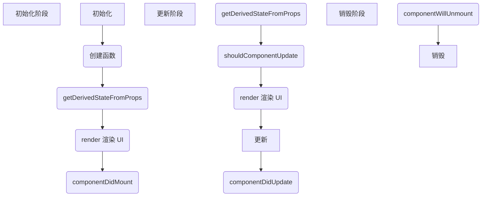

# React

<br>

## 开始

**使用 webpack**

```shell
npx create-react-app project-name
```

**使用 Vite**

```shell
# react, react-ts

# npm 6.x
npm create vite@latest my-react-app --template react

# npm 7+, extra double-dash is needed:
npm create vite@latest my-react-app -- --template react
```

<br>

## 组件

<br>

### 组件生命周期

> 分为初始化、更新和销毁三个阶段

* 初始化阶段，创建虚拟 DOM，渲染 UI
* 更新阶段，更新虚拟 DOM，重新渲染 UI
* 销毁阶段，删除虚拟 DOM，移除 UI



<br>

### 组件创建

#### 类组件

```js
import { Component } from "react";
import './Home.css'

export default class Home extends Component {

  // props 是只读属性，props 是传入函数的参数，是传入组件内部的数据，是从父组件传递到子组件的数据
  constructor(props) {
    super(props);

    // state 是私有的，可以认为 state 是组件的“私有属性”，用 setState() 来修改
    // 若直接修改 state，组件不会触发 render 函数，页面不会渲染
    this.state = {
      info: 'This is Home page',
      homeSte: 'default_Home_State',
    }

// props 是组件对外的接口，state 是组件对内的接口
// props 用于组件间数据传递，state 用于组件内部的数据传递
  }

  render() {
    const info = 'This is Home content.'
    return (
      <div className='Home'>
        <header className='Home-header'>
          <h1>{info}</h1>
          <p>{this.state.homeSte}</p>
        </header>
      </div>
    )
  }
}
```

#### 函数式组件

```js
import { useState } from "react";
import './About.css'

export default function About() {
  const [ste, setSte] = useState('defaultState');

  const info = 'this is About\'s content'

  return (
    <div className='About'>
      <div className='About-header'>
        <h1>{info}</h1>
      </div>
    </div>
  )

}
```

<br>

### 组件通信

#### Props 父传子

```js
// 父组件
import { Component } from "react";
import Son from "./child/son/Son";

export default class Home extends Component {
  constructor(props) {
    super(props);
    this.state = {
        homeVal: 100
      }
  }

  render() {
    return (
      <div className='Home'>
        <div className='Home-content'>
          <Son homeVal={this.state.homeVal} />
        </div>
      </div>
    )
  }
}

// 子组件
import {Component} from "react";

export default class Son extends Component {
  constructor(props) {
    super(props);
  }

  render() {
    return (
      <div className='Son'>
        <div className='Son-content'>
          // 使用 props 接收
          <p>{this.props.homeVal}</p>
        </div>
      </div>
    )
  }
}
```

<br>

#### Props 子传父

```js
// 父组件
import { Component } from "react";
import Son from "./child/son/Son";

export default class Home extends Component {
  constructor(props) {
    super(props);
    this.state = {
      sonVal: null
    }
  }

  sonCallBack = val => {
    // val 就是从子组件传递过来的数据
    this.setState({
      sonVal: val
    }, () => {
      // 数据同步
      console.log(this.state.sonVal)
    })

    // 数据不同步
    console.log(this.state.sonVal)

  }

  render() {
    return (
      <div className='Home'>
        <div className='Home-content'>
          <p>get value from son: {this.state.sonVal}</p>

          <Son sonCallBack={this.sonCallBack} />

        </div>
      </div>
    )
  }
}

// 子组件
import {Component} from "react";
import './Son.css'

export default class Son extends Component {
  constructor(props) {
    super(props);
  }

  data2Home = evt => {
    console.log(evt.target.value)
    this.props.sonCallBack(evt.target.value)
  }

  render() {
    return (
      <div className='Son'>
        <div className='Son-content'>
          <input type='text' onChange={this.data2Home} placeholder='transfer data to home'/>
        </div>
      </div>
    )
  }
}
```

<br>

#### Context 跨层级通信

> Context 适用于跨层级组件的通信。react-redux 和 react-router 等组件内部很多都使用了 Context 来实现

**单个 Context**

```js
// context.js
import React from 'react'

// 创建 context 并暴露 Consumer 和 Provide
const { Consumer, Provider } = React.createContext(null)
export { Consumer, Provider }


// Father.jsx
import { Provider } from "../../utils/context";
import ContextSon from "./ContextSon";

export default class Father extends Component {
  constructor(props) {
    super(props);

    this.state = {
      info: 'data for context'
    }
  }

  render() {
    return (
      <div className='Father'>
        <div className='Father-header'>
          <h1>This is Father's content</h1>
        </div>
        <Provider value={this.state.info}>
          <div>
            <p>father: {this.state.info}</p>
            <ContextSon />
          </div>
        </Provider>
      </div>
    )
  }
}

// ContextSon.jsx
import { Consumer } from "../../utils/context";
import GrandSon from "./GrandSon";

export default class Son extends Component {
  constructor(props) {
    super(props);
  }

  render() {
    return (
      <div className='ContextSon'>
        <div className='header'>
          <h2>context son</h2>
        </div>
        <div className='context'>
          <Consumer>
            {/* 注意： 接收 context 传递的值时，最外层只有一个大括号 */}
            {(value) =>
              <div>
                <p>son: {value}</p>
                <GrandSon />
              </div>
            }
          </Consumer>
        </div>
      </div>
    )
  }
}

// GrandSon.jsx
import { Consumer } from "../../utils/context";

export default class GrandSon extends Component {
  constructor(props, context) {
    super(props, context);
  }

  render() {
    return (
      <div className='GrandSon'>
        <div className='header'>
          <h3>grandson</h3>
        </div>
        <div className='context'>
          <Consumer>
            {(value) =>
              <div>
                <p>grandson: {value}</p>
              </div>
            }
          </Consumer>
        </div>
      </div>
    )
  }
}
```

**多个 Context**

```js
// MultiContext.jsx
import React, {Component} from "react";
import MultiSon from "./MultiSon";

export const Context1 = React.createContext(null)
export const Context2 = React.createContext(null)

export default class MultiContext extends Component {
  constructor(props) {
    super(props);
    this.state = {
      cVal1: '111111',
      cVal2: '222222'
    }
  }

  render() {
    return (
      <div>
        <Context1.Provider value={this.state.cVal1}>
          <Context2.Provider value={this.state.cVal2}>
            <MultiSon />
          </Context2.Provider>
        </Context1.Provider>
      </div>
    )
  }
}

// MultiSon.jsx
import {Component} from "react";
import {Context1, Context2} from "./MultiContext";

export default class MultiSon extends Component {
  constructor(props) {
    super(props);
  }
  render() {
    return (
      <div>
        <Context1.Consumer>
          {val1 =>
            <div>
              <Context2.Consumer>
                {val2 =>
                  <div>
                    <p>{val1}</p>
                    <p>{val2}</p>
                  </div>
                }
              </Context2.Consumer>
            </div>
          }
        </Context1.Consumer>
      </div>
    )
  }

}
```

<br>

#### onRef 父子方法调用

> 原理是通过 props 将子组件的组件实例（也是我们常说的 this）当作参数，通过回调传到父组件，然后在父组件就可以拿到子组件的实例，拿到了它的实例就可以调用它的方法

```js
// OnRefFather.jsx
import OnRefSon from "./OnRefSon";

export default class OnRefFather extends Component {
  constructor(props) {
    super(props);
    this.state = {
      info: ''
    }
  }
  child = null

  // 拿到子组件实例
  sonOnRef = (ref) => {
    this.child = ref
  }

  clearSonInput = () => {
    // 执行子组件方法
    this.child.clearInput()
  }

  render() {
    return (
      <div>
        <OnRefSon onRef={this.sonOnRef} />
        <button onClick={this.clearSonInput}>clear Son input</button>
      </div>
    )
  }
}


// OnRefSon.jsx
export default class OnRefSon extends Component {
  constructor(props) {
    super(props);
    this.state = {
      info: 'sonOnRef'
    }
  }

  componentDidMount() {
    this.props.onRef(this)
  }

  handleChange = (evt) => {
    this.setState({
      info: evt.target.value
    })
  }

  clearInput = () => {
    this.setState({
      info: ''
    })
  }

  render() {
    return (
      <div>
        <p>{this.state.info}</p>
        <input type='text' onChange={this.handleChange} />
      </div>
    )
  }
}
```

<br>

#### ref 访问组件/DOM 结点

> 使用 ref 常见的场景有管理焦点，文本选择或媒体播放、触发强制动画、集成第三方 DOM 库等

```js
// RefFater.jsx
import RefSon from "./RefSon";

export default class RefFather extends Component {
  son = null
  constructor(props) {
    super(props);
    // 通过 React 创建 ref
    this.son = React.createRef()
  }

  clearSonInput = () => {
    // 需要通过 this.son.current 拿到子组件的实例
    console.log(this.son)
    const {current} = this.son
    current.clearInput()
  }

  render() {
    return (
      <div>
        <RefSon ref={this.son}/>
        <button onClick={this.clearSonInput}>clear son's input</button>
      </div>
    )
  }
}

// RefSon.jsx
import {Component} from "react";

export default class RefSon extends Component {
  constructor(props) {
    super(props);
    this.state = {
      info: 'Ref_Son'
    }
  }

  handleChange = (evt) => {
    this.setState({
      info: evt.target.value
    })
  }

  clearInput = () => {
    this.setState({
      info: ''
    })
  }

  render() {
    return (
      <div>
        <p>{this.state.info}</p>
        <input type='text' onChange={this.handleChange} />
      </div>
    )
  }
}
```

<br>

#### events 发布订阅

> 适用于没有任何嵌套关系的组件通信。其原理就是使用事件订阅。

**安装**

```shell
npm install events
# or
yarn add events
```

**使用**

```js
// event.js
import { EventEmitter } from 'events'
export default new EventEmitter()

// EmitFather.jsx
import emitter from '../../utils/event'
import EmitSon1 from "./EmitSon1";
import EmitSon2 from "./EmitSon2";

export default class EmitFather extends Component {
  constructor(props) {
    super(props);
  }

  handleClick = () => {
    emitter.emit('info', 'arguments or params from father')
  }

  render() {
    return (
      <div>
        <button onClick={this.handleClick}>点击发布事件</button>
        <EmitSon1 />
        <EmitSon2 />
      </div>
    )
  }
}

// EmitSon1.jsx

// 通过 emitter.addListener(事件名称,函数名)，进行事件监听/订阅
// 通过 emitter.removeListener(事件名称,函数名) ，进行事件销毁/取消订阅
import emitter from '../../utils/event'

export default class EmitSon1 extends Component {
  constructor(props) {
    super(props);
    this.state = {
      info: 'EmitSon1'
    }
  }

  componentDidMount() {
    // 组件加载完成后开始监听
    emitter.addListener('info', info => {
      this.setState({
        info: 'Son111 接收到消息 -- ' + info
      })
    })
  }

  componentWillUnmount() {
    // 组件销毁前移除监听
    emitter.removeListener('info', info => {
      this.setState({
        info: 'Son1 移除监听 -- ' + info
      })
    })
  }

  render() {
    return (
      <div>
        <p>{this.state.info}</p>
      </div>
    )
  }
}

// EmitSon2.jsx

// 通过 emitter.addListener(事件名称,函数名)，进行事件监听/订阅
// 通过 emitter.removeListener(事件名称,函数名) ，进行事件销毁/取消订阅
import emitter from '../../utils/event'

export default class EmitSon2 extends Component {
  constructor(props) {
    super(props);
    this.state = {
      info: 'EmitSon2'
    }
  }

  componentDidMount() {
    // 组件加载完成后开始监听
    emitter.addListener('info', info => {
      this.setState({
        info: 'Son222 接收到消息 -- ' + info
      })
    })
  }

  componentWillUnmount() {
    // 组件销毁前移除监听
    emitter.removeListener('info', info => {
      this.setState({
        info: 'Son222 移除监听 -- ' + info
      })
    })
  }

  render() {
    return (
      <div>
        <p>{this.state.info}</p>
      </div>
    )
  }
}
```

<br>

#### 兄弟组件传递

* 使用 props，可将父组件作为中转站，组件 A 先将数据传递到父组件，父组件再将数据传递到组件 B
* 使用 context，例如组件 A 为提供者，组件 B 为消费者
* 使用 OnRef，执行兄弟组件的方法
* 使用 events

<br>

### 组件插槽

> 稍后补充…

https://juejin.cn/post/6975864046058733576#heading-19

<br>

## 路由

> react 提供 `react-router` 来管理路由，react-router 包含
>
> * react-router
> * react-router-dom （网页）
> * 和 react-router-native（native）

**安装**

```shell
npm install react-router-dom
```

<br>

### 路由组件

* `BrowserRouter`
* `HashRouter`

使用时需要将根组件 `</App>` 包裹在路由组件中

```js
import { BrowserRouter } from 'react-router-dom';
...
<BrowserRouter>
    <App />
</BrowserRouter>
...
```

<br>

### 匹配组件

* `<Switch>`，在 6.0 版本之后改成 `<Routes>`
* `<Route>`

这两个组件通常是放在一起用的，在 `<Routes>` 里面包裹多个 `<Route>`，它会逐步去比对每个 `<Route>` 的 `path` 属性和浏览器当前 `location` 的 `pathname` 是否一致，如果一致则返回内容，否则返回 `null`。所以 `<Switch>` 组件只会 `render` 第一个匹配到的路由

```js
<Routes>
    <Route path='/' index element={<App />}></Route>
    <Route path='/home' element={<Home />}></Route>
    <Route path='/about' element={<About />}></Route>
    {/* 当上面的组件都没有匹配到的时候, 404 页面就会被 render */}
    <Route path='*' element={<NotFound />}></Route>
</Routes>
```

<br>

### 导航组件

* `<Link>`，`<Link>` 在页面上会被渲染成 `<a>`
  
  ```js
  <Link to='/'>Home</Link>
  
  // 渲染后 
  <a href='/'>Home</a>
  ```

* `<NavLink>`，`<NavLink>` 是一种特殊的 `<Link>` ，当 `<NavLink>` 中的地址和浏览器地址匹配成功的时候，会添加一个激活样式
  
  ```js
  <NavLink to='/about' activeClassName='active'>
    About
  </NavLink>
  
  // 页面中会被渲染成
  <a href='/about' className='active'>
    About
  </a>
  ```

* `<Redirect>`，强制跳转到某个页面，比如未登录不能进入首页，这个时候可以使用 `<Redirect>`
  
  ```js
  <Redirect to='/login' />
  ```

<br>

### 嵌套路由

> 当路由被嵌套时，网页的某一部分放弃不变，只有网页的子局部发生变化。

**局部嵌套**

```js
// index.js
<Routes>
    <Route path='/' element={<App />}>
        <Route path='/home' element={<Home />}></Route>
        <Route path='/about' element={<About />}></Route>
    </Route>
</Routes>

// App.jsx
<div>
    <nav style={{border: 'red solid 2px', padding: '10px'}}>
        <NavLink to='/home'>Home</NavLink> |
        <NavLink to='/about'>About</NavLink>
    </nav>
    // home 和 about 组件的内容会在 <Outlet /> 位置显示
    <Outlet />         
</div>
```

<br>

**全局嵌套**

```js
function App() {
  return (
    <Routes>
      <Route path="user" element={<Users />}>
        <Route path=":id" element={<UserDetail />} />
        <Route path="create" element={<NewUser />} />
      </Route>
    </Routes>
  );
}

// 访问 /user/123 时，组件树
<App>
    <Users>
        <UserDetail/>
    </Users>
</App>

// 访问 /user/create 时，组件树
<App>
   <Users>
       <NewUser/>
   </Users>
</App>
```

<br>

**嵌套路由默认渲染**

> 添加 `index` 属性来指定默认路由

```js
function App() {
  return (
    <Routes>
      <Route path="/" element={<App />}>
          // 默认渲染 Home 组件
        <Route index element={<Home />} />
        <Route path="user" element={<Home />} />
        <Route path="about" element={<About />} />
      </Route>
    </Routes>
  );
}
```

<br>

### 路由通配符

```js
// 支持以下通配符

/groups
/groups/admin
/users/:id
/users/:id/messages
/files/*
/files/:id/*
```

<br>

### 路由参数

> 使用 `useParams` 和 `useSearchParams` 获取参数

**`useParams`**

```js
// App.js
function App() {
 return (
   <Routes>
     <Route path="user" element={<Users />}>
       <Route path=":id" element={<UserDetail />} />
     </Route>
   </Routes>
 );
}

// UserDetail.js
import { useParams } from "react-router-dom";
export default function UserDetail() {
  let params = useParams();
  return <h2>User: {params.id}</h2>;
}
```

<br/>

**`useSearchParams`**

`useSearchParams ` 返回的是一个当前值和 set 方法

```js
let [searchParams, setSearchParams] = useSearchParams();

// 可以用 searchParams.get("id") 来获取参数
// 页面内也可以 setSearchParams({"id":2}) 来改变路由
```

<br/>

### useNavigate

> `useNavigate` 是替代原 V5 中的 `useHistory` 的新 hooks，用法和 `useHistory` 类似，使用起来更轻量

```jsx
// js 写法
let navigate = useNavigate();
function handleClick() {
    navigate("/home");
}

// 组件写法
function App() {
    return <Navigate to="/home" replace state={state} />;
}

// 替代原有的 go/goBack/goForward
<button onClick={() => navigate(-2)}>Go 2 pages back</button>

<button onClick={() => navigate(-1)}>Go back</button>

<button onClick={() => navigate(1)}>Go forward</button>

<button onClick={() => navigate(2)}>Go 2 pages forward</button>
```

<br/>

### useRoutes

> 可以使用 `useRoutes` 将路由信息抽取出来

```jsx
import { Navigate } from 'react-router-dom';
import Home from './Home';
import User from './User';
import About from './About';
import UserAdd from './UserAdd';
import UserProfile from './UserProfile';

// 抽取 routes
const routes = [
    { path: "/", element: <Home /> },
    { 
        path: "/user/*", 
        element: <User />,
        // 设置子路由
        children: [
            {path: "add", element: <UserAdd />},
            {path: "profile", element: <UserProfile/>}
        ]
    },
    { path: "/about", element: <About /> },
    // 如果没有匹配到任何路由，就跳转根目录（或者404页面）
    { path: "*", element: <Navigate to="/" /> },
]
export default routes


// App.js
// 使用 useRouts
import { useRoutes } from 'react-router-dom';
import routes from "./routes";

function App() {
  // 调用路由数组
  return useRoutes(routes) 
}

export default App;


// index.js
import {BrowserRouter as Router} from "react-router-dom";

ReactDOM.render(
  <React.StrictMode>
    <Router>
      <App />
    </Router>
  </React.StrictMode>,
  document.getElementById('root')
);
```

<br/>

**分模块管理**

```jsx
import { 
  BrowserRouter as Router, 
  useRoutes 
} from 'react-router-dom';
import RecLayout from 'xxxx';
import AdminLayout from 'xxxx';

const GetRecRoutes = () => { // 获取前台路由
  const routes = useRoutes([
    {
      path:'',
      element: <RecLayout />,
      children: [
        {
          path: '',
          element: <div>前台首页</div>
        },
        {
          path: 'a',
          element: <div>rec-aaa</div>
        }
      ]
    },
    {
      path: '*',
      element: <div>前台404</div>,
    }
  ]);
  return routes;
}

const GetAdminRoutes = () => { // 获取后台路由
  const routes = useRoutes([
    {
      path:'',
      element: <AdminLayout />,
      children: [
        {
          path: '',
          element: <div>后台首页</div>
        },
        {
          path: 'a',
          element: <div>admin-aaa</div>
        },
      ]
    },
    {
      path: '*',
      element: <div>后台404</div>,
    }
  ]);
  return routes;
}

const GetAllRoutes = () => {
  const routes = useRoutes([
    {
      path: '/*',
      element: <GetRecRoutes />,
    },
    {
      path:'/admin/*',// 末尾的 /* 必不可少
      element: <GetAdminRoutes />,
    },
    {
      path: '*', // 这个 404 页面不会被匹配到
      element: <div>404</div>,
    }
  ])
  return routes;
}

const SetRoutes = () => {
  return (
    <Router>
      <GetAllRoutes />
    </Router>
  )
}
```

<br/>

### useLocation

> `useLocation` 会返回当前 URL 的 `location` 对象

<br/>

### 权限认证

```jsx
<Router>
  <main>
    <nav>
      <ul>
        <li>
          <Link to="/">Home</Link>
        </li>
        <li>
          <Link to={`/about/${name}`}>About</Link>
        </li>
        <li>
          <Link to="/contact">Contact</Link>
        </li>
      </ul>
    </nav>
    <Routers>
      <Route path="/" exact component={Home} />
      {isAuthenticated ? (
        <>
          <Route path="/about/:name" component={About} />
          <Route path="/contact" component={Contact} />
        </>
      ) : (
        <Redirect to="/" />
      )}
    </Routers>
  </main>
</Router>
```

<br/>

## React Hooks

<br/>

### 父子传值

[React Hooks 父子传值](https://www.jianshu.com/p/f782386e431e)

<br/>

### useState

<br/>

### useEffect

```jsx
/*
* 一个组件内可以有多个 useEffect
* 若第二个参数不传，则在每次页面渲染 UI 后调用
* 若第二个参数为空数组，则等同于 componentDidMount
* 若第二个参数为非空数组，数组内参数变化后调用 componentDidUpdate
* 若在 useEffect return 一个函数，函数执行的时期相当于 componentWillUnmount
*/

import './NavBar.css'
import logo from '@/assets/img/logo.png'
import homeIcon from '@/assets/img/icon/home.svg'
import analyseIcon from '@/assets/img/icon/analyse.svg'
import scheduleIcon from '@/assets/img/icon/schedule.svg'
import avatar from '@/assets/img/avatar.png'
import {useState, useEffect} from "react";
import {NavLink, useLocation} from "react-router-dom";

function NavBar() {
  const [avatarMenu, setAvatarMenu] = useState(false)
  const [homeActive, setHomeActive] = useState(false)
  const [analyseActive, setAnalyseActive] = useState(false)
  const [scheduleActive, setScheduleActive] = useState(false)

  useEffect(() => {
    console.log('effect 渲染 ui 后调用 111')
  })

  useEffect(() => {
    console.log('第二个参数为空数组，等同 componentDidMount 222')
  }, [])

  let location = useLocation()
  let activePath = location.pathname

  useEffect(() => {
    console.log('第二个参数为非空数组，则在数据内参数变化后调用 333')

    console.log(activePath)

    switch (activePath) {
      case '/':
        setHomeActive(true)
        setAnalyseActive(false)
        setScheduleActive(false)
        break
      case '/home':
        setHomeActive(true)
        setAnalyseActive(false)
        setScheduleActive(false)
        break
      case '/analyse':
        setHomeActive(false)
        setAnalyseActive(true)
        setScheduleActive(false)
        break
      case '/schedule':
        setHomeActive(false)
        setAnalyseActive(false)
        setScheduleActive(true)
        break
      default:
        break
    }

  }, [activePath])

  const avatarClick = () => {
    setAvatarMenu(!avatarMenu)

    setInterval(() => {
      if (avatarMenu) {
        setAvatarMenu(!avatarMenu)
      }
    }, 2500)
  }

  return (
    <div className='NavBar'>
      <NavLink to={'/'} className='nav-logo'>
        
      </NavLink>

      <NavLink to='/home' className={['Nav-item nav-home', homeActive ? 'bg-blue-400': ''].join(' ')}>
        
      </NavLink>

      <NavLink to='/analyse' className={['Nav-item nav-analyse', analyseActive ? 'bg-blue-400': ''].join(' ')}>
        
      </NavLink>

      <NavLink to='/schedule' className={['Nav-item nav-schedule', scheduleActive ? 'bg-blue-400': ''].join(' ')}>
        
      </NavLink>

      <div className='nav-avatar relative'>
        

        <div className={['nav-avatar-menu ', avatarMenu ? '':'invisible'].join(" ")}>
          setting and about and something
          setting and about and something
          setting and about and something
        </div>
      </div>

    </div>
  )
}

export default NavBar;
```

<br/>

## 状态管理

> React 的状态管理是通过 Redux 来实现的

<br/>

### Store

> `Store` 就是保存数据的地方，可以把它看成一个容器。整个应用只能有一个 `Store`。`Store` 中包含多个 `state`，并且其中的 `state` 是不能直接修改的，需要通过 `action` 来修改

```js
// Redux 提供了一个 createStore 方法来创建 state
import { createStore } from 'redux'
const store = createStore(reducer)
```

<br/>

### Action

> Redux 将每一个更改动作描述为一个 `action`，要更改 `state` 中的内容，你需要发送 `action`。一个 `action` 是一个简单的对象，用来描述 `state` 发生了什么变更

每个 `action` 必须有一个 `type` 属性，这表示 `action` 的名称，然后还可以有一个 `payload` 属性，这个属性可以带一些参数，用作 `Store` 变更

```js
// Action 是一个对象。其中的 type 属性是必须的，表示 Action 的名称。其他属性可以自由设置
const action = {
  type: 'ADD_ITEM',
  payload: 'new item', // 可选属性
}
```

Redux 可以用 `Action Creator` 批量来生成一些 `action`

<br/>

### Reducer

> `Store` 表示数据，`Action` 表示对数据的操作，`Reducer` 则是一个纯函数，`Reducer ` 函数负责生成  `state`，根据 `Action` 来对 `state` 进行操作，然后返回一个新的 `state`

一个 `store` 可以添加多个 `reducer`，还可以分文件创建其它的操作，便于分类管理。只要创建 `store` 的时候使用 `combineReducers` 将 `reducer` 全部绑定到一起即可

**操作流程**

1、`store` 通过 `dispatch` 分发到对应的 `action`

2、当 `dispatch` 发起一个 `action` 之后，请求会到达 `reducer`。`reducer` 接收两个参数，一个是当前  `state` 和需要执行的 `action`，经过 `reducer` 操作返回一个新的 `state`，来进行对 `state` 的变更

```jsx
// App.js
import store from "../../redux/store";
import {incrementAction, decrementAction} from "../../redux/action/action";
import {useEffect, useState} from "react";

function App() {
  const [state, setState] = useState(0)

  useEffect(() => {

    // store.subscribe(() => {
    //   console.log('states were changed')
    // })

  }, [])

  const increase = () => {
    console.log('before increase ', store.getState())

    // store.dispatch 接受一个 Action 对象作为参数，将它发送出去
    store.dispatch(incrementAction(1))

    setState(store.getState().reducer)

    console.log('after increase ', store.getState())

  }

  const decrease = () => {
    store.dispatch(decrementAction(1))
    setState(store.getState().reducer)
  }

  return (
<div>
    <button type='button' onClick={increase}>+ 1</button>
    <span>{state}</span>
    <button type='button' onClick={decrease}>- 1</button>
</div>
  )
}
export default App
```

```js
// redux/store.js
import {createStore} from "redux";

// 导入并组合所有的 reducer
import {combineReducers} from "redux";
import {reducer} from "./reducer/reducer";

const rootReducer = combineReducers({
  reducer
})
const store = createStore(rootReducer);
export default store
```

```js
// redux/action/actionTypes.js
export const INCREMENT = 'increment'
export const DECREMENT = 'decrement'

// redux/action/action.js
import {INCREMENT, DECREMENT} from "./actionTypes";
export const incrementAction = (payload) => ({
  type: INCREMENT,
  payload
})

export const decrementAction = (payload) => ({
  type: DECREMENT,
  payload
})
```

```js
import { DECREMENT, INCREMENT } from "../action/actionTypes";

const iniState = 0

// reducer 是一个纯函数，接收旧 state，和对 state 进行操作的 action，返回一个新的 state
// 由于 Reducer 是纯函数，就可以保证同样的 State，必定得到同样的 View。
// 但也正因为这一点，Reducer 函数里面不能改变 State，必须返回一个全新的对象
// 最好把 State 对象设成只读

const reducer = (state = iniState, action) => {
  switch (action.type) {
    case INCREMENT:

      console.log('old state ', state)
      // 处理 state
      console.log('new state ', state + action.payload)

      // 返回新的 state
      return state + action.payload
    case DECREMENT:
      return state - action.payload
    default:
      break
  }

  return state
}

// State 是一个对象
function reducer1(state, action) {
  return Object.assign({}, state, { thingToChange });
  // 或者
  return { ...state, ...newState };
}

// State 是一个数组
function reducer2(state, action) {
  return [...state, newItem];
}

export {
  reducer, reducer1, reducer2
}
```

<br>

### 中间件

> 在 Reducer 中有异步操作怎么办？Action 发出以后，过一段时间再执行 Reducer，比如网络请求，在 Reducer 中如何请求结束并进行 State 计算？此时需要使用 Redux 中间件 `redux-thunk` 来解决

**`applyMiddlewares`**

`applyMiddlewares()` 是 Redux 的原生方法，作用是将所有中间件组成一个数组，依次执行。有的中间件有次序要求，使用前要查一下文档。比如，`logger` 就一定要放在最后，否则输出结果会不正确。

```js
import { applyMiddleware, createStore } from 'redux';
import createLogger from 'redux-logger';
import thunk from 'redux-thunk';
const logger = createLogger();

const store = createStore(
  reducer,
  applyMiddleware(thunk, logger)
);
```

<br>

### react-redux

**安装**

```shell
npm i react-redux
```

<br>

#### 使用 connect

```js
// store、action 和 reducer 部分和 redux 相同

// 主要区别在 react-redux 引入了容器组件和 UI 组件两个概念
// 容器组件用来可以接收 store，并分发到它包裹的 UI 组件内
// UI 组件想要使用 redux 需要使用 connet 来和容器组件链接起来
// connet 函数包含两个主要参数
// mapStateToProps 将 state 的值映射到 UI 组件的 props
// mapDispatchToProps 将 action 映射到 props
// UI 组件获取 state 需要从 mapStateToProps 获取
// UI 组件操作 state 需要使用 mapDispatchToProps 定义的方法

// connect、mapStateToProps、mapDispatchToProps 做了解即可，后面使用 useSelector 和 useDispatch 这两个钩子函数进行对 redux 的操作，更加方便

import {incrementAction, decrementAction} from "../../redux/action/action";
import {useEffect, useState } from "react";
import {useDispatch} from "react-redux";
import {connect} from "react-redux";

// 将 state 的值映射到 props
const mapStateToProps = (state) => {
  return {
    ...state
  }
}

// 将 action 映射到 props
const mapDispatchToProps = (dispatch) => {
  return {
    incrementClick: (payload) => dispatch(incrementAction(payload)),
    decrementClick: (payload) => dispatch(decrementAction(payload)),
  }
}

const AppConn = connect(mapStateToProps, mapDispatchToProps)(Analyse)

function Analyse(props) {
  const [state, setState] = useState(0)

  let dispatch = useDispatch();

  console.log(props)

  const { reducer } = props

  const {incrementClick, decrementClick} = props

  useEffect(() => {

    // store.subscribe(() => {
    //   console.log('states were changed')
    // })

  }, [])

  const increase = () => {
    // console.log('before increase ', store.getState())

    // store.dispatch 接受一个 Action 对象作为参数，将它发送出去
    // dispatch(incrementAction(1))

    incrementClick(1)

    setState(reducer)

    // console.log('after increase ', store.getState())

  }

  const decrease = () => {
    // dispatch(decrementAction(1))

    decrementClick(2)

    setState(reducer)
  }

  return (
    <div className={'space-x-4 m-2 text-xl w-full'}>
        <button type='button' onClick={increase}>+ 1</button>
        <span>{state}</span>
        <button type='button' onClick={decrease}>- 1</button>
    </div>
  )
}

export {
  Analyse,
  AppConn
}
```

```js
// main.js
ReactDOM.render(
  <React.StrictMode>
    <Provider store={store}>
      <AppConn />
    </Provider>
  </React.StrictMode>,
  document.getElementById('root')
)
```

<br>

#### 使用 Hooks

> `useSelector` 和 `useDispatch`

```js
// 以登录认证作为例子

// redux/user/actionTypes.js
export const SET_AUTH = 'set_user_auth'

// redux/user/userActions.js
import { SET_AUTH } from "./actionTypes";

export const setAuthAction = (payload) => ({
  type: SET_AUTH,
  payload
})

// redux/user/userReducer.js
import { SET_AUTH } from "../../action/user/actionTypes";

const userInfo = {
  uid: null,
  isAuth: false,
};

const userReducer = (state = userInfo, action) => {
  const { type, payload } = action
  switch (type) {
    case SET_AUTH:
      const nextState = Object.assign({}, state)
      nextState.isAuth = payload
      return nextState
    default:
      return state;
  }
}

export {
  userReducer
}

// redux/store.js
import { createStore } from "redux";
import { userReducer } from "./reducer/user/userReducer";

const store = createStore(userReducer)

export default store

// App.jsx
import store from "./redux/store";
import {Provider} from "react-redux";

ReactDOM.render(
  <React.StrictMode>
    <Provider store={store}>
      <AppRoutes>
        <App />
      </AppRoutes>
    </Provider>
  </React.StrictMode>,
  document.getElementById('root')
)

// Login.jsx
import {useDispatch} from "react-redux";
import {useNavigate} from "react-router-dom";
import {setAuthAction} from "../../redux/action/user/userActions";

export default function Login() {

  const dispatch = useDispatch()
  const navigate = useNavigate();

  const loginClick = () => {
      if (login success) {
          dispatch(setAuthAction(res))

          // redirect to /
          navigate('/')
      }
  }
  return ( <div></div> )
}

// Auth.jsx
import {createContext, useEffect, useState} from "react";
import {useSelector} from "react-redux";
import {useNavigate} from "react-router-dom";

export default function Auth(props) {

  const isAuth = useSelector(state => state.isAuth)
  const navigate = useNavigate();

  const [webSocket, setWebSocket] = useState(null)

  useEffect(() => {
    authCheck()
  }, [])

  const authCheck = () => {
    // console.log(isAuth)

    // 未登录，跳转到登录页
    if (!isAuth) {
      navigate('/login')
    } else {
      // 已登录，创建 websocket 连接，并加载聊天页面
      const ws = "@/network/websocket/websocket";
      setWebSocket(ws)
    }
  }

  return (
    <Context.Provider value={webSocket}>
      { isAuth ? props.children : <></> }
    </Context.Provider>
  )
}
```

<br>

### connected-react-router

> 当我们在项目中同时用了 `react-router` 和 `redux` 的时候，可以把他们两个深度整合。我们想要在 `store` 里面拿到 `router`，甚至可以操作 `router`，还可以记录 `router` 的改变。例如我们把用户是否登录的状态存在 `redux` 里面，在登录之后会进行页面的跳转

稍后补充。。。

https://juejin.cn/post/6844904183934484494#heading-24

<br>

## 使用 Tailwind CSS

> https://tailwindcss.com/docs/installation/framework-guides

```shell
# 安装相关依赖
npm install -D tailwindcss@latest postcss@latest autoprefixer@latest

# 生成 tailwind.config.js 和 postcss.config.js 
npx tailwindcss init -p
```

```js
// postcss.config.js
module.exports = {
  plugins: {
    tailwindcss: {},
    autoprefixer: {},
  },
}
```

```js
// tailwind.config.js
module.exports = {
  content: [
    "./src/**/*.{js,jsx,ts,tsx}",
  ],
  theme: {
    extend: {},
  },
  plugins: [],
}
```

```css
/* index.css */
@tailwind base;
@tailwind components;
@tailwind utilities;
```

<br>

## 参考

[Redux 中文文档 ](https://www.redux.org.cn/)

https://juejin.cn/post/6844904183934484494

https://juejin.cn/post/7033313711947251743

https://juejin.cn/post/6948226424427773983

https://www.jianshu.com/p/7232e02ff7ba

https://www.jianshu.com/p/e3a7021fdb1f

https://www.jianshu.com/p/4bad3633c197

https://segmentfault.com/a/1190000019900931

https://www.cnblogs.com/jsydb/p/9480216.html

https://blog.csdn.net/ncgNCGg/article/details/122409089

https://blog.csdn.net/wzc_coder/article/details/104352176

https://www.ruanyifeng.com/blog/2016/09/redux_tutorial_part_one_basic_usages.html