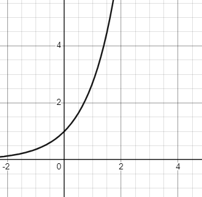

# Math

## 函数

### 概念与特性

#### 概念

设变量 $x$ 和 $y$，数集 $D$，若对于每一个 $x \in D$，按照**一定的对应法则** $f$，都有**一个确定的值** $y \in R$ 与之对应，则称 $y$ 为 $x$ 的函数。记作 $y = f(x)$ ，其中 $x$ 称为*自变量*，$y$ 称为*因变量*。数集 $D$ 称为*定义域*，$R$ 称为*值域*。

> 【❓】
>
> **比较两个函数**
>
> **两个函数相等** $\Longleftrightarrow$ 相同的**定义域** + 相同的**对应法则**

 

#### 特性

函数具有四个特性：

* **有界性**
* **单调性**
* **奇偶性**
* **周期性**

 

##### 有界性

>讨论有界性时，首先需要指定区间，不知区间无法讨论有界性。如果未指明，一般默认是在定义域上讨论

有界性指的是在定义域 $D$ 上，总是能够找到某个**正数** $K \in D$，使得 $-K \le f(x) \le K$，即**函数的值**始终不会超过某个区间。如果这样的 $K$ 不存在，则称 $f(x)$ 在 $D$ 上无界。

也可以这么说，总是能找到两个数 $K_1 < K_2$，使得 $K_1 \le f(x) \le K_2$ 。

函数有界指的是函数有**上界**和**下界**：

* **有上界**，指的是对于**任意**的 $x \in D$ ，总是能找到某个数 $K_1$，使得 $f(x) \le K_1$ （函数值始终小于 $K_1$）

* **有下界**，指的是对于**任意**的 $x \in D$ ，总是能找到某个数 $K_2$，使得 $K_2 \le f(x)$ （函数值始终大于 $K_2$）

> 【⚡】
>
> 有界性实际上表示的是函数值的取值范围，在图像上表现为函数图像能被**上界** $y=K$ 和**下界** $y=-K$ 两条线夹在中间；从解析上说，找到某个正数 $K$，使得 $K \le f(x)$，即可说明函数有界。

如何判断函数有界？

* 函数有界 $\Longleftrightarrow$ 即有上界也有下界

* 连续函数的最值定理

  若函数在某个**闭区间**上连续，则它在该区间上有界，且一定能取得它的两个最值

> 【⚡】
>
> 事实上，只要在区间 $D$ 上或者其端点处存在点 $x_0$，使得 $\lim_{x\to{x0}}f(x)$ 的值为无穷大，则没有任何两条直线能够把 $f(x)$ 的图像*包起来*，这就叫无界

 

##### 单调性

> 讨论单调性时要明确讨论区间

函数单调性指的是：

* **单调递增**，指的是对于任意 $x_1, x_2 \in D$，且 $x_1 < x_2$，有 $f(x_1) < f(x_2)$，则称 $f(x)$ 在定义域 $D$ 上 单调递增
* **单调递减**，指的是对于任意 $x_1, x_2 \in D$，且 $x_1 < x_2$，有 $f(x_1) > f(x_2)$，则称 $f(x)$ 在定义域 $D$ 上 单调递减

> 单调性实际上表示的是函数值的变化趋势，单调递增说明函数值一直在增大，单调递减说明函数值一直在减小

如何判断单调性？

* 利用定义判断
* 利用一阶导数判断

 

**定义法其他判别形式**

对于任意的 $x_1, x_2 \in D, \ x1 \ne x_2$，有：

* $f(x)$ 是**单增**函数 $\Longleftrightarrow$ $(x_1 - x_2)[f(x_1) - f(x_2)] > 0$；
* $f(x)$ 是**单减**函数 $\Longleftrightarrow$ $(x_1 - x_2)[f(x_1) - f(x_2)] < 0$；
* $f(x)$ 是**不减**函数 $\Longleftrightarrow$ $(x_1 - x_2)[f(x_1) - f(x_2)] \ge 0$；
* $f(x)$ 是**不增**函数 $\Longleftrightarrow$ $(x_1 - x_2)[f(x_1) - f(x_2)] \le 0$

 

##### 奇偶性

> 讨论奇偶性时，函数的定义域必须关于原点对称

在函数的定义域 $D$ 关于原点对称的前提下：

* **奇函数**，指的是对于任意的 $x \in D$， 恒有 $f(-x)= -f(x)$，则称 $f(x)$ 为奇函数 
* **偶函数**，指的是对于任意的 $x \in D$， 恒有 $f(-x)= f(x)$，则称 $f(x)$ 为偶函数

图像上：

* 偶函数图像关于 $y$ 轴对称。当 $f'(0)$ 存在时，必有 $f'(0)=0$；
* 奇函数图像关于原点对称。当 $f(x)$ 在 $x=0$ 处有定义时，必有 $f(0)=0$；

> 【⚡】
>
> 由函数图像拓展：
>
> * 函数 $f(x)$ 与 $-f(x)$ 关于 $x$ 轴对称；函数 $f(x)$ 与 $f(-x)$ 关于 $y$ 轴对称；函数 $f(x)$ 与 $-f(-x)$ 关于原点对称
>
> * 函数 $y=f(x)$ 的图形关于直线 $x=T$ 对称的充分必要条件是
>
>   $f(x)=f(2T-x)$ 或 $f(x+T)=f(T-x)$

如何判断奇偶性？

* 利用定义判断

> 【⚡】
>
> 设 $f(x)$ 是定义在 $[-k, k]$ 上的任意函数，则 $F_1(x)=f(x)-f(-x)$ 必为**奇函数**；$F_2=f(x)+f(-x)$ 必为**偶函数**。
>
> 显然 $u(x)=\frac12[f(x)+f(-x)]$ 是偶函数，$v(x)=\frac12[f(x)-f(-x)]$ 是奇函数。
>
> 而 $f(x)=\frac12[f(x)+f(-x)] + \frac12[f(x)-f(-x)]=u(x) + v(x)$ 。

 

##### 周期性

设$f(x)$ 的定义域为 $D$，若存在**正数** $\Tau$ ，对于任意的 $x \in D$，有 $x \pm T \in D$ 且 $ f(x)=f(x+ \Tau )$，称 $f(x)$ 为周期函数，称 $\Tau$ 为函数的周期。

> 【⚡】
>
> 从几何上看，周期函数的定义域内，相邻两个长度为 $T$ 的区间上，函数的图像完全一样。

如果一个函数 $f(x)$ 的所有周期中存在一个最小的正数，那么这个最小的正数就叫做 $f(x)$ 的最小正周期。

> 一般说的周期指的都是最小正周期（但是有的函数没有最小正周期）

不是所有的函数都存在最小正周期。例如常数函数 $f(x) = c, \ (x\in D)$ （$c$ 是常数），无论 $x$ 取定义域内的任何值，函数的值都是 $c$ 。

对于函数 $f(x)$ 定义域内的任何值 $x$ ，都有 $f(x) = f(x + \Tau)$ ，因此 $f(x)$ 是周期函数。$\Tau$ 可以是任意不为 0 的正数，而正数集合中没有*最小值*，所以常函数 $f(x)$ 没有最小正周期。

 

#### 反函数

设函数 $y=f(x)$ 的定义域为 $D$ ，值域为 $R$ ，如果对于每一个 $y \in R$，必存在唯一的 $x \in D$ ，使得 $y=f(x)$ 成立，则由此定义一个新的函数 $x = \psi(y)$ ，这个函数就称为函数 $y=f(x)$ 的**反函数**，写作 $x = f^{-1}(y)$ 。它的定义域为 $R$ ，值域为 $D$。相对于反函数来说，原来的函数也被称为**直接函数**。反函数的定义域、值域和对应法则与原函数互逆。

 

**说明**：

1. 严格单调函数必有反函数，如函数 $y=x^2$ 在定义域区间 $x \in [0, +\infty)$ 内严格单调递增，因此必有反函数。反函数和原函数的单调性相同。

2. 如果把 $y=f(x)$ 和 $x=f^{-1}(y)$ 的图像画在同一个坐标系中，则它们会完全重合。只有将反函数 $x=f^{-1}(y)$ 写成 $y=f^{-1}(x)$ 之后，反函数的图像和原函数的图像才会关于直线 $y=x$ 对称（实际上这也是字母 $x$ 和 $y$ 互换的结果 ）

> 【⚡】
>
> 针对说明`<1>`，反过来，有反函数的函数不一定是单调函数。比如**分段函数**：
> $$
> f(x)=
> \begin{cases}
> &x, \ x \ge 0 ,\\
> &\frac1x, \ x \lt 0
> \end{cases}
> $$
> 其反函数即为 $f=(x)$ 本身，但 $f(x)$ 不是单调函数。

如何求反函数？

将 $x$ 当作未知数，$y$ 当作已知，求出 $x$，再将 $x$ 与 $y$ 字母替换即可

 

#### 复合函数

设函数 $y=f(u)$ 的定义域为 $D$，函数 $u=g(x)$ 的值域为 $R$，若 $D \bigcap R \ne \emptyset$，则称函数 $y=f[g(x)]$ 为**复合函数**。其中 $x$ 称为自变量，$u$ 称为中间变量，$y$ 称为因变量。

$D \bigcap R$ 为函数 $y=f(u)$ 的定义域（$D \bigcap R \ne \emptyset$）

#### 重要结论

以下 7 条重要结论才是这部分内容的重点：

1. **若 $f(x)$ 是可导的偶函数，则 $f'(x)$ 是奇函数**；

2. **若 $f(x)$ 是可导的奇函数，则 $f'(x)$ 是偶函数**；

3. **若 $f(x)$ 是可导的周期函数，周期为 $T$，则 $f'(x)$ 是也是周期函数，周期也为 $T$**；

4. **连续的奇函数的一切原函数都是偶函数；**

5. **连续的偶函数的原函数中仅有一个原函数是奇函数；**

6. **若连续函数 $f(x)$ 周期为 $T$，且 $\int^{T}_{0}f(x)d=0$，则 $f(x)$ 的一切原函数也以 $T$ 为周期；**

7. **若 $f(x)$ 在 $(a, b)$ 内可导，且 $f'(x)$ 有界，则 $f(x)$ 在 $(a, b)$ 内有界**

   > 【证明】
   >
   > 因为 $f(x)$ 在 $(a, b)$ 内可导，所以 $f(x)$ 在 $(a, b)$ 内连续，因此对于任意的 $x_0 \in (a, b)$，$f(x_0)$ 都存在。
   >
   > 对任意的 $x_0 \in (a, b)$，可以设 $x < x_0$，对 $f(x)$ 在区间 $[x, x_0]$ 上使用[拉格朗日中值定理](#拉格朗日中值定理)有
   > $$
   > f(x)-f(x_0)=f'(\xi)(x-x_0),\ \xi \in (x, x_0) \\
   > 则 \ |f(x)| \le |f'(\xi)||(x-x_0)| + |f(x_0)| \\
   > 由于 f'(x) 在 (a, b) 内有界， \\
   > 故存在 k > 0，使得对任意的 x \in (a, b) \\
   > 有 \ f'(x) \le k，\\
   > 则 \ f'(\xi) \le k， \\
   > 故 \ |f(x)| \le k(x-x_0) + |f(x_0)| < k(a-b) + |f(x_0)| \xlongequal{记} M \\
   > 即 \ f(x) 在 (a, b) 内有界
   > $$

 

### 基本初等函数与图像

> 常、反、对、幂、指、三

 

**常数函数**

$y=C$，$C$ 是常数，其图像为平行于 $x$ 轴的水平直线。

 

**幂函数**

$y=x^a$，$a$ 是实数。

> 【⚡】
>
> (1) $y=x^a$ 的定义域和值域取决于 $a$ 的值；
>
> (2) 常见的幂函数有：$y=\frac1x,\ y=\sqrt x, \ y=\sqrt[3]x, \ y=x^2,\ y=x^3 $；
>
> (3) 当 $x>0$，由于 $y=x,\ y=\sqrt x,\ y=\sqrt[3]x,\ y=ln \ x$ 具有相同的单调性，且与 $y=\frac1x$ 具有相反的单调性：
>
> * 见到 $\sqrt x \ 与 \sqrt[3]x$ ，可使用 $x$ 来研究最值；
> * 见到 $|x|$ 时，由 $|x| = \sqrt{x^2}$，可用 $x^2$ 来研究最值；
> * 见到 $ x_1 x_2 x_3 $ 时，可用 $ln(x_1 x_2 x_3)=ln \ x_1 + ln \ x_2 + ln \ x_3 $ 来研究最值
> * 见到 $\frac1x$ 时，可以使用 $x$ 来研究最值（结论相反，即 $\frac1x$ 和 $x$ 的最大最小值点相反）

 

**幂函数图像**

蓝、紫、绿分别是 $y=x^2,\ y=x,\ y=x^\frac12 $

蓝、绿分别是 $y=x^3$ 和 $y=\sqrt[3]x$

函数 $y=\frac1x$ 图像

 

**指数函数**

$y=a^x$，$a>0$ 且 $a \ne 1$

 

**指数函数图像**

黑、红分别是 $0 \lt a \lt 1 $ 和 $a > 1$ 时，函数 $y=a^x$ 的图像

函数 $y=e^x$ 图像

> 【⚡】
>
> (1) 指数函数定义域为 $(-\infty, \infty)$，值域为 $(0, +\infty)$；
>
> (2) 对于函数 $y=a^x$ 来说，当 $a>1$ 时，函数单调递增，当 $0 < a < 1$ 时函数单调递减；
>
> (3) 常见的指数函数：$y=e^x$；
>
> (4) 极限：$lim_{x \to -\infty}e^x = 0,\ lim_{x \to +\infty}e^x = +\infty $；
>
> (5) 特殊函数值：$a^0=1, \ e^0=1 $

 

**对数函数**

$y=log_ax$，$a>0$ 且 $a \ne 1$。

 

**对数函数图像**

红、蓝分别是 $log_ax \ 在 \ a>1 和 a<1 时的函数$

函数 $y=ln \ x$ 图像

 

> 【⚡】
>
> (1) 定义域：$(0, + \infty)$，值域：$(- \infty, + \infty)$；
>
> (2) 单调性：当 `a > 1` 时，$y=log_ax$ 单调递增，当`0 < a < 1`时，单调递减；
>
> (3) 常用的对数函数：$log_ex=ln \ x$，`e = 2.71828...`；
>
> (4) 特殊函数值：$log_a1=0,\ log_aa=1,\ ln \ 1=0,\ ln \ e = 1 $；
>
> (5) 极限：$lim_{x \to 0^+}{ln \ x}=- \infty,\ lim_{x \to + \infty}{ln \ x}= \infty $；
>
> (6) 常用公式：$x=e^{lin \ x} \ (x>0),\ u^v = e^{ln \ u^v } = e^{v ln \ u } $

 

**三角函数**

* $y=sin \ x$
* $y=cos \ x$
* $y=tan \ x$，正切（Tangent）
* $y=cot \ x$，余切（Cotangent）
* $y=sec \ x$，正割（Secant）
* $y=csc \ x$，余割（Cosecant）

 

**正弦与余弦函数**

(1) 定义域：$(- \infty, + \infty)$，值域：$[-1, 1]$；

(2) 在定义域的范围内，`sin x`是奇函数，`cos x` 是偶函数；

(3) 在定义域范围内，`sin x`和`cos x`都以 $2 \pi$ 为最小正周期；

(4) `|sin x| <= 1`，`|cos x| <= 1`，`sin x`和`cos x`均有界。

(5) 特殊函数值：

| x                 | sin x            | cos x            |
| ----------------- | ---------------- | ---------------- |
| 0                 | 0                | 1                |
| $\frac{\pi}{6}$   | $\frac12$        | $\frac{\sqrt3}2$ |
| $\frac{\pi}{4}$   | $\frac{\sqrt2}2$ | $\frac{\sqrt2}2$ |
| $\frac{\pi}{3}$   | $\frac{\sqrt3}2$ | $\frac12$        |
| $\frac{\pi}{2}$   | 1                | 0                |
| ${\pi}$           | 0                | -1               |
| $\frac{3 \pi}{2}$ | -1               | 0                |
| ${2 \pi}$         | 0                | 1                |

 

**反三角函数**

* $y=arcsin \ x$
* $y=arccos \ x$
* $y=arctan \ x$，正切（Tangent）
* $y=arccot \ x$，余切（Cotangent）
* $y=arcsec \ x$，正割（Secant）
* $y=arccsc \ x$，余割（Cosecant）

> 效率有点低😕暂停施工

