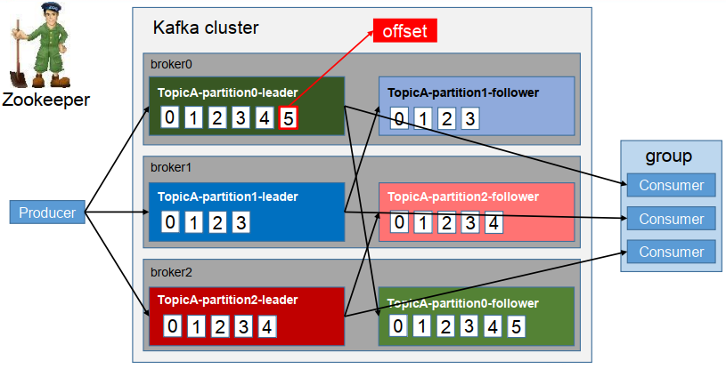

#  Kafka

<br>

## 前言

Kafka 是一个分布式流处理平台，基于发布/订阅模式的消息队列，主要应用于大数据实时处理领域。使用 Kafka 可以帮助进行解耦、异步、削峰等操作。


<br>

## 基础架构




<br>

## 相关概念

- Producer，消息生产者。

- Consumer，消息消费者，从 Broker 拉取消息。

- *Consumer Group*，消费者组，组内每个消费者负责消费不同分区的数据，一个分区只能由一个组内消费者消费。所有的消费者都属于某个消费者组，消费者组是逻辑上的一个订阅者。

  

- Broker，一个 Kafka 服务就是一个 Broker，一个 Broker 可以容纳多个 Topic，一个集群由多个 Broker 组成。

- Topic，Topic 可以分成多个分区存在于多个 Broker 上。

- Partition，一个 Topic 可以分为多个 Partition，每个 Partition 是一个有序的队列。

  > Topic 是逻辑上的概念，Partition 是物理上的概念。

  


<br>

### Zookeeper 与 Nameserver

> Kafka 中 Zookeeper 和 RocketMQ 的 Nameserver 功能相似，都是用来管理集群中的节点信息。但是它们的职责不完全相同：
>
> * Zookeeper 用来管理分布式应用。主要作用是维护和管理分布式应用的配置、命名、分布式同步和群组服务等，同时它还具有分布式锁和分布式队列等功能。
>* Nameserver 是轻量级的命名服务，管理所有生产者和消费者信息，包括主题、队列、消费组等。Nameserver 通过将生产者和消费者注册到其管理的主题中，使得生产者和消费者能够互相发现和通信。
> 
> <br>
>
> |              | Zookeeper                                        | Nameserver                               |
>| ------------ | ------------------------------------------------ | ---------------------------------------- |
> | 功能         | 分布式协调和管理、数据存储、分布式锁和分布式队列 | 消费者和生产者管理、主题路由和自动化分区 |
> | 数据存储     | 分层的命名空间、可靠的数据存储                   | 内存数据库                               |
> | 一致性       | 原子/版本/事务保持一致性                         | 集群中的主节点选举                       |
> | 可用性和容错 | 高度可用性和容错性                               | 容错性较弱                               |
> | 应用场景     | 分布式应用程序                                   | 分布式消息系统                           |


<br>

### 消费模式

* 点对点。一对一，生产者生产消息发送到消息队列，消费者从队列中主动拉取并消费消息。消息消费后，队列中不再存储。一个消息队列支持多个消费者进行消费，但是一条消息只有一个消费者可以消费。
* 发布/订阅。一对多，消息被消费后不会被清除。消息生产者将消息发布到 Topic 中，同时可以有多个消费者订阅该 Topic。和点对点方式不同，发布到 Topic 的消息被消费后不会被清除，会被所有订阅者消费。


<br>

## 安装与启动

**Docker**

```dockerfile
# 先 build
# docker build -t kfk-docker .
# 再 run，run 之前需要修改 server.properties 中的 advertised.listeners
# docker run --name=kfk -d -v "./server.properties:/opt/kafka/config/server.properties" -p 9092:9092 kfk-docker

# 使用基础镜像
FROM adoptopenjdk/openjdk8

# 先下载 Kafka 并解压到当前目录，重命名为 kafka
# https://kafka.apache.org/documentation/#quickstart
# 复制本地的 Kafka
COPY kafka /opt/kafka

# 设置工作目录
WORKDIR /opt

# 设置环境变量
ENV KAFKA_HOME /opt/kafka
ENV PATH $KAFKA_HOME/bin:$PATH

# 从当前目录 kafka 文件夹内复制 zookeeper.properties 和 server.properties 到当前文件夹，并配置好
# 这步可以省略
COPY zookeeper.properties $KAFKA_HOME/config/zookeeper.properties
COPY server.properties $KAFKA_HOME/config/server.properties

# 暴露 Kafka 和 ZooKeeper 端口
EXPOSE 2181 9092

# 启动 ZooKeeper 和 Kafka
CMD ["sh", "-c", "$KAFKA_HOME/bin/zookeeper-server-start.sh $KAFKA_HOME/config/zookeeper.properties & $KAFKA_HOME/bin/kafka-server-start.sh $KAFKA_HOME/config/server.properties"]
```

```shell
# -e KAFKA_BROKER_ID=0 在 kafka 集群中，每个 kafka 都有一个 BROKER_ID 来区分
# -e KAFKA_ZOOKEEPER_CONNECT=IP地址:2181 配置 zk
# -e KAFKA_ADVERTISED_LISTENERS=PLAINTEXT://IP地址:9092 kafka 服务注册到 zk
# -e KAFKA_LISTENERS=PLAINTEXT://0.0.0.0:9092 配置 kafka 监听端口
```


<br>

##  基本操作

> [operations](https://kafka.apachecn.org/documentation.html#operations)

```shell
# 创建 topic
# --topic 定义 topic 名
# --replication-factor 定义副本数
# --partitions 定义分区数
kafka-topics.sh --create --topic topic_name --bootstrap-server localhost:9092

# 查看所有 topic
kafka-topics.sh --list --bootstrap-server localhost:9092
# 除了自定义的 Topic，还有一个名为 __consumer_offsets 的 Topic，用于保存消费者的消费 Offset

# 删除 topic
kafka-topics.sh --delete --topic topic_name --bootstrap-server localhost:9092
# 需要 config/server.properties 中设置 delete.topic.enable=true 否则只是标记删除

# 查看某个 topic 的详情
kafka-topics.sh --describe --topic topic_name --bootstrap-server localhost:9092

# 修改 topic 分区数
kafka-topics.sh --alter --topic topic_name --partitions 6 --bootstrap-server localhost:9092

# 消息生产
kafka-console-producer.sh --topic topic_name --bootstrap-server localhost:9092
> the 1st message

# 消费消息
kafka-console-consumer.sh --bootstrap-server localhost:9092 --topic topic_name --from-beginning
```


<br>

## 消息生产

<br>

### 生产者 ACK

为保证生产者发送的数据能可靠的发送到指定的 Topic，对应分区收到消息后会根据 ACK 策略向生产者发送 ACK。如果生产者收到 ACK，就会进行下一轮的发送，否则重新发送上一条消息。

**何时发送 ACK？**

确保有 Follower 与 Leader 同步完成，Leader 再发送 ACK。这样才能保证 Leader 故障后仍有完整的数据保存在 Follower 中，才能选举出新的 Leader。

**有多少个 Follower 同步完成发送 ACK？**

1、半数以上的 Follower 同步完成，可发送 ACK。

2、全部的 Follower 同步完成，才发送 ACK。

**Kafka 选用第二种方式**。如果只要求半数副本成功就发送 ACK，存在以下问题：

* 数据一致性：半数副本成功就发送 ACK，可能会导致不同副本之间的数据不一致
* 可用性：半数副本成功就发送 ACK，当出现副本故障或网络故障时，可能会导致消息丢失

第二种方式缺点是增加了延迟，但是 Kafka 作为一个分布式系统，数据可靠才是最重要的。


<br>

**生产者 ISR**

> 采用第二种方案之后，设想以下情景：Leader 收到数据，所有 Follower 都开始同步数据，但有一个 Follower 发生故障不能与 Leader 进行同步，Leader 就要一直等待，直到 Follower 完成同步，才能发送 ACK。**这个问题怎么解决呢？**

Leader 维护了一个动态的 ISR（*In-Sync Replica Set*），同步状态的备份的集合，表示和 Leader 保持同步的 Follower 集合。

当 ISR 中的 Follower 完成数据的同步之后，就会给 Leader 发送 ACK。如果 Follower 长时间（由 `replica.lag.time.max.ms` 参数设定）未向 Leader 同步数据，将其从 ISR 剔除。等待 Follower 恢复正常再重新加入 ISR。

> ISR 还有一个作用：当 Leader 发生故障，Kafka 就会从 ISR 中选举新的 Leader。


<br>

**ACK 策略/级别**

对于不太重要的数据，对数据的可靠性要求不高，能够容忍数据少量丢失，不必等 ISR 中的 Follower 全部接收成功。Kafka 为用户提供了三种级别 ACK：

* `ack=0`

  生产者不等 Broker 的 ACK，提供最低的延迟。Broker 接收消息到还没有写入磁盘就已经返回 ACK，Broker 故障时有可能丢失数据

* `ack=1`

  等到 Leader 落盘成功后返回 ACK。如果在 Follower 同步成功之前 Leader 故障，将会丢失数据

* `ack=-1（all）`

  等到 Leader 和 ISR 的 Follower 全部落盘成功后才返回  ACK。如果在 Follower 同步完成后，在 Broker 发送 ACK 之前 Leader 发生故障，会造成数据重复


<br>

### 生产者分区

> **原因**
>
> * 提高并发，以分区为单位读写，多个分区可以处理更多的读操作
> * 方便在集群中扩展，每个分区可调整以适应它所在的机器

> **分区策略**
>
> 1. 指明分区的情况下，直接发送到对应的分区
> 2. 没有指明分区，但有 key 时，将 key 的 hash 值与分区数进行取余操作，得到存储的分区号
> 3. 既没有指明分区，又没有 key 时，第一次调用：随机生成一个整数（后面每次调用在这个整数上自增），将其与 Topic 可用的分区总数取余得到发送到的分区号，即 round-robin 算法


<br>

## 消息消费

### 消费方式

- 拉模式

  拉模式从 Broker 中读取数据。如果 Broker 没有数据，消费者可能会陷入循环中，一直返回空数据。针对这一点，Kafka 在拉模式消费中定义了一个超时参数。消费者拉取消息，如果有消息马上返回；如果没有消息，消费者等待直到超时，再次发起拉消息请求。拉模式可以根据 Consumer 的消费能力以适当的速率消费消息。

- 推模式

  消息推送速率由 Broker 决定，Broker 尽可能以最快速度传递消息，但消费者消费速度可能跟不上。


<br>

### 消费者分区

**分区分配再平衡机制**

> 分区分配再平衡指的是在消费者订阅的 Topic 发生变化时发生的一种分区重分配机制。一般有三种情况会触发再平衡：
>
> - 消费者组中的新增或删除某个消费者，导致其所消费的分区需要分配到组内其他的消费者上
>- 消费者订阅的 Topic 发生变化，比如订阅的 Topic 采用的是正则表达式的形式，如 `topic-*`，此时如果有一个新建了一个 `topic-user`，这个 Topic 的所有分区也会自动分配给当前消费者
> - 消费者所订阅的 Topic 发生了新增分区的行为，新增的分区就会分配给当前的消费者

> [Kafka 再平衡机制详解](https://zhuanlan.zhihu.com/p/86718818)

<br>

**分区分配策略**

> 一个消费者组中有多个消费者，一个 Topic 有多个分区，消费时需要确定哪个分区由哪个消费者来消费。有两种分配策略：
>
> - round-robin 轮询
>- range


<br>

### 消费 Offset

> 消费者在出现故障恢复后，需要从故障前的位置的继续消费，所以消费者需要实时记录自己消费到了哪个 Offset，以便故障恢复后继续消费。
>
> 消费者默认将 Offset 保存在 Kafka 名为 `__consumer_offsets` 的内置 Topic 中。


<br>

## 消息操作

### 消息存储

一个 Topic 可分为多个 Partition，生产者生产的消息会不断追加到不同分区中的 log 文件末尾。为防止 log 文件过大导致数据定位效率低下，Kafka 采取了**分片**和**索引**机制，将每个 Partition 分为多个 Segment。

每个 Segment 对应两个文件：`.index` 和 `.log` 文件。这些文件位于一个文件夹下，文件夹的命名规则为：`Topic 名称 + 分区序号`。例如，topic-first 有 3 个分区，则其对应的文件夹为 topic-first-0，topic-first-1，topic-first-2。

文件命名是以当前 Segment 的第一条消息的 Offset 命名，当文件大小达到配置的大小（默认 1G）时会根据新的 Offset 生成新的文件。

```
00000000000000000000.index
00000000000000000000.log
00000000000000170410.index
00000000000000170410.log
00000000000000239430.index
00000000000000239430.log
```


<br>

### 消息日志删除

由于不删除消息，硬盘有被占满的时刻，Kakfa 提供了几种策略解决：一是基于时间；二是基于起始偏移量；三是基于分区文件的大小。

* 日志删除任务会检查当前日志文件中是否有保留时间超过设定的阈值来寻找可删除的日志分段文件集合
* 一般情况下，日志文件的起始偏移量 logStartOffset 等于第一个日志分段的 baseOffset。基于日志起始偏移量的保留策略的判断依据是某日志分段的起始偏移量 baseOffset 是否小于等于 logStartOffset，若是，则可以删除此日志分段
* 日志删除任务会检查当前日志的大小是否超过设定的阈值来寻找可删除的日志分段的文件集合


<br>

### 消息流向

Kafka 中消息是以 Topic 进行分类的，消息的生产和消费都是面向 Topic 的。**Topic 是逻辑上的概念，而 Partition 是物理上的概念**。

每个 Partition 对应于一个 log 文件，该 log 文件中存储的就是生产者生产的数据（Topic = N partition，partition = log）。

Producer 生产的数据会被不断追加到该 log 文件末端，且每条数据都有自己的 Offset。消费者组中的每个消费者会实时记录自己消费到了哪个 Offset，以便出错恢复时从上次的位置继续消费。

> 生产者 -> Topic（实际上是 Partition Log File） -> 消费者


<br>

## 高可用

一个 Topic 的每个 Partition 都有若干个副本，一个 Leader 和零个或若干个 Follower。

**Leader**

一个分区只有一个 Leader，领导一个或多个副本。一个 Partition 的数据只能由 Leader 来处理。生产者发送数据的对象，以及消费者消费数据的对象都是 Leader。

**Follower**

实时从 Leader 中同步数据，Leader 发生故障时，从 ISR 列表中的 Follower 中选出新的 Leader。


<br>

## 数据一致性问题

> 首先了解两个概念
>
> * LEO（Log End Offset），每个副本的最后一个 Offset
>
> * HW（High Watermark）高水位，指的是消费者能见到的最大的 Offset，ISR 队列中最小的 LEO


**Follower 故障和 Leader 故障**

- Follower 故障：Follower 发生故障后会被**临时**踢出 ISR，待该 Follower 恢复后，Follower 会读取本地磁盘记录的上次的 HW，并将 log 文件高于 HW 的部分截取掉，从 HW 开始向 Leader 进行同步。等该Follower 的 HW 追上 Leader 之后，就可以重新加入 ISR
- Leader 故障：会从 ISR 中选出一个新的 Leader，为保证多个副本之间的数据一致性， 其余的 Follower 会先将各自的 log 文件高于 HW 的部分截掉，然后从新的 Leader 同步数据

> **注意**：这只能保证副本之间的数据一致性，并不能保证数据不丢失或者不重复


<br>

## ExactlyOnce

**消息发送语义**

- 将 ACK 级别设置为 -1（all），可以保证生产者到 Broker 之间不会丢失数据，保证生产者消息至少发送一次，即 *At Least Once* 语义
- 将 ACK 级别设置为 0，可以保证生产者每条消息只会被发送一次，即 *At Most Once* 语义
- **消息持久化幂等性**。就是指生产者不论发送多少次重复数据，Broker 只会持久化一条。将生产者的参数 `enable.idempotence` 设置为 `true` 即可启用幂等性支持。Kafka 幂等性实现其实就是将原来下游需要做的去重放在了数据上游。

<br>

**何时需要 ExactlyOnce？**

*At Least Once* 可以保证数据不丢失，但是不能保证数据不重复；*At Most Once* 可以保证数据不重复，但是不能保证数据不丢失。但是对于一些非常重要的消息，比如说**交易消息**，要求数据既不重复也不丢失，即 *Exactly Once* 语义。

幂等性结合 *At Least Once* 语义，构成 Kafka 的 *Exactly Once* 语义。`At Least Once + 幂等性 = Exactly Once`。

<br>

**ExactlyOnce 不可跨分区跨会话**

开启幂等性的生产者在初始化时会被分配一个 PID，发往同一个分区的消息会附带 *Sequence Number*，Broker 会将 `<PID, Partition, SeqNumber>` 缓存起来当作主键。当具有相同主键的消息提交时，Broker 只会持久化一条。

但服务重启 PID 就会变化，不同的分区具有不同主键，所以幂等性无法保证跨分区跨会话的 *Exactly Once*。


<br>

## 事务

> 事务可以保证 Kafka 在 *Exactly Once* 语义基础上，生产和消费跨分区和会话要么全部成功，要么全部失败。

**生产者事务**

> 为了实现跨分区跨会话的事务，需要引入一个全局唯一的 `Transaction ID`，并将生产者的 PID 和 *Transaction ID* 绑定。生产者重启后就可以通过正在进行的 *Transaction ID* 获得原来的 PID。
>
> 为了管理事务，Kafka 引入了一个新的组件 *Transaction Coordinator*。生产者通过和 *Transaction Coordinator* 交互获得 *Transaction ID* 对应的任务状态。
>
> *Transaction Coordinator* 还负责将所有事务写入 Kafka 的一个内部 Topic，这样即使整个服务重启，进行中的事务状态依然可以恢复进行。

**消费者事务**

> 对于消费者而言，事务的保证就会相对较弱，尤其是无法保证 commit 的信息被精确消费。这是因为消费者可以通过 Offset 访问任意信息，而且不同的 Segment File 生命周期不同，同一事务的消息可能会出现重启后被删除的情况。


<br>

## 高效读写

<br>

### 顺序写磁盘

> Kafka 的生产者生产数据，会写入到 log 文件中，写的过程是一直追加到文件末端，为顺序写。顺序写**省去了大量磁头寻址的时间**。
>
> 实际上不管是内存还是磁盘，快或慢关键在于寻址的方式。磁盘分为顺序读写与随机读写，内存也一样分为顺序读写与随机读写。顺序读写性能高于随机读写。

> 收到生产者消息后 Kafka 会把数据写入文件末尾，这种方法有一个缺陷：无法删除某条数据。所以 Kafka 会把所有的数据都保留下来，每个消费者对每个 Topic 都有一个 Offset 用来表示 读取到了第几条数据。


<br>

### Page Cache

> 为了优化读写性能，Kafka 利用了操作系统本身的 *Page Cache*，用于缓存磁盘上的消息：
>
> - 避免 Object 消耗，如果是使用 Java 堆，Java 对象的内存消耗比较大，通常是所存储数据的两倍甚至更多
> - 避免 GC 问题，随着 JVM 中数据不断增多，垃圾回收会变得复杂/缓慢，使用系统缓存就不会存在 GC 问题
>
> Kafka 将消息写入磁盘时，也会将其缓存在 *Page Cache* 中。当应用程序需要访问这些消息时，*Page Cache* 会将它们从磁盘加载到内存中，以便更快读取。
>
> 相比于使用 JVM 或 *In-Memory Cache* 等，利用操作系统的 *Page Cache* 更加简单可靠：
>
> * 操作系统层面的缓存利用率会更高，存储的都是紧凑的字节结构而不是独立的对象
>
> * 操作系统本身对 *Page Cache* 做了优化，提供 *write-behind/read-ahead/flush* 等多种机制
>
> * 即使服务进程重启，系统缓存依然存在，避免 *In-Process Cache* 重建缓存的过程


<br>

### 零拷贝技术

> Linux 操作系统零拷贝机制使用了 sendfile 方法，允许操作系统将数据从 *Page Cache* 直接发送到网络。只需要最后一步的 copy 操作将数据复制到 NIC（*Network Interface Controller*） 网络接口控制器缓冲区， 避免重新复制数据。通过零拷贝机制，*Page Cache* 结合 sendfile 方法，Kafka 消费端的性能也大幅提升。
>
> 
>
> 
>
> 从 File => PageCache => ApplicationCache => SocketCache => NIC，
>
> 变成 File => PageCache  => NIC

<br>

当 Kafka 客户端从服务器读取数据时，如果不使用零拷贝技术，那么大致需要经历这样的一个过程：

1. 操作系统将数据从磁盘上读入到内核空间的读缓冲区中
2. 应用程序（也就是 Kafka）从内核空间的读缓冲区将数据拷贝到用户空间的缓冲区中
3. 应用程序将数据从用户空间的缓冲区再写回到内核空间的 socket 缓冲区中
4. 操作系统将 socket 缓冲区中的数据拷贝到 NIC 缓冲区中，然后通过网络发送给客户端

数据在内核空间和用户空间之间穿梭了两次，能否避免这个多余的过程呢？

Kafka 使用了零拷贝技术，直接将数据从内核空间的读缓冲区直接拷贝到内核空间的 socket 缓冲区，再写入到 NIC 缓冲区，避免了在内核空间和用户空间之间穿梭。

> *注意：这里的零拷贝并非指一次拷贝都没有，而是避免了在内核空间和用户空间之间的拷贝*


<br>

### 分区分段 + 索引

> Topic => Partition => Segment
>
> 通过这种分区分段的设计，Kafka 的消息实际上是分布式存储在一个个的 Segment 中的，每次文件操作也是直接操作的 Segment。
>
> 为了进一步的查询优化，Kafka 默认为分段后的数据文件建立了索引文件，就是 `.index` 文件。这种分区分段+索引的设计，提升了数据读取的效率，也提高了数据操作的并行度。


<br>

### 批量读写

> Kafka 数据读写是批量的而不是单个的。在向 Kafka 写入数据时，启用批次写入可以避免在网络上频繁传输单个消息带来的延迟和带宽开销。
>


<br>

### 批量压缩

> 在很多情况下，系统的瓶颈不是 CPU 或磁盘，而是网络 IO。可以考虑进行数据压缩，虽然会消耗少量的 CPU 资源，不过对于 Kafka 而言，网络 IO 更应该需要考虑：
>
> 1. 如果每个消息都压缩，但是压缩率相对很低，Kafka 使用了批量压缩，多个消息一起压缩
> 2. Kafka 允许使用递归的消息集合，批量的消息可以通过压缩的形式传输并且在日志中也可以保持压缩格式，直到被消费者解压
> 3. Kafka 支持多种压缩协议，包括 Gzip 和 Snappy 压缩协议


<br>

## Zookeeper 的作用

> Kafka 集群中有一个 Broker 会被选举为 Controller，负责管理集群 Broker 的上下线，所有 Topic 的分区副本分配和 Leader 选举等工作。Controller 的管理工作都是依赖于 Zookeeper 进行的。
>
> 


<br>

## API 操作

### 生产者

<br>

#### 异步生产者

##### 普通生产者

```xml
<dependency>
    <groupId>org.apache.kafka</groupId>
    <artifactId>kafka-clients</artifactId>
    <version>latest</version>
</dependency>
```

```java
Properties props = new Properties();
props.put(ProducerConfig.BOOTSTRAP_SERVERS_CONFIG, "localhost:9092");
props.put(ProducerConfig.ACKS_CONFIG, "all"); // ack 级别 all
props.put(ProducerConfig.RETRIES_CONFIG, 1); // 重试次数
props.put(ProducerConfig.LINGER_MS_CONFIG, 1); // 等待时间
// 消息 k-v 序列化器
props.put(ProducerConfig.KEY_SERIALIZER_CLASS_CONFIG, "org.apache.kafka.common.serialization.StringSerializer");
props.put(ProducerConfig.VALUE_SERIALIZER_CLASS_CONFIG, "org.apache.kafka.common.serialization.StringSerializer");
Producer<String, String> producer = new KafkaProducer<>(props);
producer.send(new ProducerRecord<>("test-topic", "test-key",
            "test-value"));
producer.close();
```

<br>

##### 带回调函数生产者

```java
// 消费者配置列表 https://kafka.apache.org/documentation.html#consumerconfigs
Properties props = new Properties();
// set props 设置生产者配置
Producer<String, String> producer = new KafkaProducer<>(props);
producer.send(new ProducerRecord<>("test-cb-topic", "test-key-" + i,
        "callback-test-value-" + i), new Callback() {
    // 回调函数，在 Producer 收到 ack 时调用
    @Override
    public void onCompletion(RecordMetadata metadata, Exception exception) {
        if (null == exception) {
            System.out.println(metadata.toString());
        } else {
            exception.printStackTrace();
        }
    }
});
producer.close();
```

<br>

##### 自定义分区生产者

```java
// 具体内容填写可参考默认分区器 DefaultPartitioner
// 生产者配置中注册 props.put(ProducerConfig.PARTITIONER_CLASS_CONFIG, MyPartitioner.class);
public class MyPartitioner implements Partitioner {
    @Override
    public int partition(String topic, Object key, byte[] keyBytes, Object value, byte[] valueBytes, Cluster cluster) {
        return 0; // 返回结果就是自定义分区数
    }

    @Override
    public void close() {}

    @Override
    public void configure(Map<String, ?> configs) {}
}
```


<br>

#### 同步生产者

> 消息发送之后，会阻塞当前线程，直至返回 ack。由于 send 方法返回的是一个 Future 对象，根据 Futrue 对象的特点，也可以实现同步发送的效果，只需再调用 Future 对象的 get 方法即可


<br>

#### 生产拦截器

> 生产者拦截器主要用于实现客户端的定制化控制逻辑

生产拦截器能在消息发送前，以及生产者回调逻辑执行前，能对消息做一些定制化需求。比如修改消息内容、校验消息等。生产者允许指定多个拦截器，拦截器可以按序作用于同一条消息从而形成一个拦截链（*Interceptor Chain*）。

Intercetpor 的实现接口是 `ProducerInterceptor`，其定义的方法包括

- configure() 获取配置信息和初始化数据
- onSend(ProducerRecord) 该方法由 KafkaProducer#send 进行调用，运行在用户主线程中。 生产者确保**在消息被序列化以及计算分区前**调用该方法。用户可以在该方法中对消息做任何操作，但最好不要修改消息所属的 Topic 和分区，否则会影响目标分区的计算
- onAcknowledgement(RecordMetadata, Exception) 方法会在消息从 RecordAccumulator 成功发送到 Broker 后在发送过程中失败时调用。并且通常都是在生产者回调逻辑触发之前。onAcknowledgement 运行在生产者的 IO 线程中，不要在该方法中添加复杂的业务处理逻辑，否则会拖慢生产者的消息发送效率
- close 方法关闭拦截器，主要用于执行**资源清理**工作

生产拦截器可能被运行在多个线程中，因此在具体实现时需要确保线程安全。若指定了多个拦截器，生产者将按照指定顺序调用。

> *注意：生产者仅捕获每个拦截器可能抛出的异常并记录到错误日志中，不会向上传递。*


<br>

### 消费者

#### 普通消费者

```java
Properties props = new Properties();
props.put("bootstrap.servers", "127.0.0.1:9092");
props.put("group.id", "aaa");
props.put("enable.auto.commit", "true"); // 自动提交 offset 功能
props.put("auto.commit.interval.ms", "1000"); // 自动提交 offset 时间间隔
props.put("key.deserializer",
        "org.apache.kafka.common.serialization.StringDeserializer");
props.put("value.deserializer",
        "org.apache.kafka.common.serialization.StringDeserializer");
KafkaConsumer<String, String> consumer = new KafkaConsumer<>(props);

// 设置订阅的 topic
consumer.subscribe(Arrays.asList("test-topic"));
while (true) {
    ConsumerRecords<String, String> records = consumer.poll(100);
    for (ConsumerRecord<String, String> record : records) {
        // do something with record
    }
}
```

<br>

#### Offset 提交

> 消费者消费数据时的可靠性是很容易保证的，因为在 Kafka 中数据是持久化保存的，不用担心数据丢失.

因为消费者在消费过程中可能会出现故障，恢复后需要从故障前的位置的继续消费，所以消费者需要实时记录自己的消费 Offset，以便恢复后继续消费。Offset 的维护是消费者必须考虑的问题。

<br>

##### 自动提交 Offset

```java
// 自动重置 Offset
public static final String AUTO_OFFSET_RESET_CONFIG = "auto.offset.reset";
Properties props = new Properties();
// ...
props.put(ConsumerConfig.AUTO_OFFSET_RESET_CONFIG, "earliest");
props.put("group.id", "abcd");
// ...
KafkaConsumer<String, String> consumer = new KafkaConsumer<>(props);
```

<br>

##### 手动提交 Offset

> 自动提交 Offset 是基于时间提交，难以把握 Offset 提交的时机。因此 Kafka 还提供了手动提交 Offset 的方法。

**手动提交 Offset 的方法有两种**

1. commitSync，同步提交
2. commitAsync，异步提交

两者的**相同点**是，都会将本次 poll 的一批数据最高的 Offset 提交

**不同点**是，commitSync 会阻塞当前线程，直到提交成功，并且会自动失败重试；而 commitAsync 没有失败重试机制，有可能提交 Offset 失败。

<br>

**同步提交 Offset**

> 同步提交 Offset 有失败重试机制，更加可靠。

```java
props.put("enable.auto.commit", "false"); //关闭自动提交 offset
// ...
KafkaConsumer<String, String> consumer = new KafkaConsumer<>(props);
consumer.subscribe(Arrays.asList("first-topic")); //消费者订阅主题
while (true) {
  // 消费者拉取数据
  ConsumerRecords<String, String> records =
    consumer.poll(100);
  for (ConsumerRecord<String, String> record : records) {
    	// handle message record
  }
  // 同步提交，当前线程会阻塞直到 offset 提交成功
  consumer.commitSync();
}
```

<br>

**异步提交 Offset**

> 虽然同步提交 Offset 更可靠，但是会阻塞当前线程，吞吐量会受到很大的影响。更多情况下，会选用异步提交 Offset 的方式。

```java
props.put("enable.auto.commit", "false"); // 关闭自动提交 offset
// ...
KafkaConsumer<String, String> consumer = new KafkaConsumer<>(props);
consumer.subscribe(Arrays.asList("first-topic")); // 消费者订阅主题
while (true) {
  ConsumerRecords<String, String> records = consumer.poll(100); // 消费者拉取数据
  for (ConsumerRecord<String, String> record : records) {
    	// handle message record
  }
  // 异步提交
  consumer.commitAsync(new OffsetCommitCallback() {
    @Override
    public void onComplete(Map<TopicPartition, OffsetAndMetadata> offsets, Exception exception) {
      if (exception != null) {
        System.err.println("Commit failed for" + offsets);
      }
    }
  });
}
```


<br>

#### Offset 存储

Kafka 默认将 Offset 存储在 Kafka 的一个内置的 Topic 中。Kafka 还可以选择自定义存储 Offset。Offset 的维护是相当繁琐的，因为需要考虑到消费者的再平衡（Rebalace）。

当有新的消费者加入消费者组、已有的消费者退出消费者组或订阅主题的分区发生变化，就会触发分区的重新分配，重新分配的过程叫做 Rebalance。

消费者发生 Rebalance 之后，每个消费者消费的分区就会发生变化。因此消费者首先要获取到自己被重新分配到的分区，并且定位到每个分区最近提交的 Offset 位置继续消费。要实现自定义存储 Offset，需要借助 ConsumerRebalanceListener。

以下为示例代码，其中提交和获取 Offset 的方法，需要根据所选的 Offset 存储系统自行实现(可存入数据库)。

```java
public class CustomSaveOffset {
	private static Map<TopicPartition, Long> currentOffset = new HashMap<>();

	public static void main(String[] args) {
		Properties props = new Properties();
		props.put("enable.auto.commit", "false"); // 关闭自动提交 offset
		KafkaConsumer<String, String> consumer = new KafkaConsumer<>(props);
		
		consumer.subscribe(Arrays.asList("first"), 
			//<-------------------------------------
			new ConsumerRebalanceListener() {
			// 在 Rebalance 之前调用
			@Override
			public void onPartitionsRevoked(Collection<TopicPartition> partitions) {
				commitOffset(currentOffset);
			}

			// 在 Rebalance 之后调用
			@Override
			public void onPartitionsAssigned(Collection<TopicPartition> partitions) {

				currentOffset.clear();
				for (TopicPartition partition : partitions) {
					consumer.seek(partition, getOffset(partition));// 定位到最近提交的 offset 位置继续消费
				}
			}
		});
		
		while (true) {
			ConsumerRecords<String, String> records = consumer.poll(100);// 消费者拉取数据
			for (ConsumerRecord<String, String> record : records) {
				System.out.printf("offset = %d, key = %s, value = %s%n", record.offset(), record.key(), record.value());
				currentOffset.put(new TopicPartition(record.topic(), record.partition()), record.offset());
			}
			commitOffset(currentOffset);// 异步提交
		}
	}

	// 获取某分区的最新 offset
	private static long getOffset(TopicPartition partition) {
		return 0;
	}

	// 提交该消费者所有分区的 offset
	private static void commitOffset(Map<TopicPartition, Long> currentOffset) {}
}
```


<br>

#### 遗漏消费和重复消费

无论是同步提交还是异步提交 Offset，都有可能会造成数据的漏消费或者重复消费

* 先提交 Offset 后消费，有可能造成数据的漏消费
* 先消费后提交 Offset，有可能会造成数据的重复消费


<br>

## SpringBoot 集成

**依赖**

```xml
<dependency>
    <groupId>org.springframework.kafka</groupId>
    <artifactId>spring-kafka</artifactId>
</dependency>
```

**生产者配置**

```yaml
spring:
  kafka:
    producer:
      client-id: boot-kafka-producer
      bootstrap-servers: localhost:9092
      # key-serializer: 默认使用 StringSerializer.class
      # value-serializer: 默认使用 StringSerializer.class
      acks: -1
      retries: 5
```

**消费者配置**

```yaml
spring:
  kafka:
    consumer:
      group-id: "group-test"
      bootstrap-servers: localhost:9092
      client-id: boot-kafka-consumer
      auto-offset-reset: earliest
      auto-commit-interval: 100
      enable-auto-commit: true
      # key-deserializer: 默认 StringDeserializer.class;
      # value-deserializer:
```

**生产者实现**

```java
@SpringBootApplication
@RestController
public class KafkaProducerMain {
    public static void main(String[] args) {
        SpringApplication.run(KafkaProducerMain.class, args);
    }

    @Autowired
    private KafkaTemplate<String, Object> kafka;

    @GetMapping("/send/{data}")
    public String send(@PathVariable("data") String data) {
        kafka.send("topic-test", data);
        return "send " + data + " success";
    }
}
```

**消费者实现**

```java
@SpringBootApplication
public class KafkaConsumerMain {
    public static void main(String[] args) {
        SpringApplication.run(KafkaConsumerMain.class, args);
    }

    @KafkaListener(topics = {"topic-test"}, groupId = "group-test")
    public void receive(String message) {
        System.out.println("[received] " + message);
    }
}
```


<br>

## 图形界面

> Kafka Eagle 略

```
docker pull nickzurich/kafka-eagle:latest
docker run --name eagle -p 8048:8048 -e EFAK_CLUSTER_ZK_LIST=localhost:2181 -d nickzurich/kafka-eagle:latest
```


<br>

## 参考

[Kafka学习笔记](https://my.oschina.net/jallenkwong/blog/4449224)

[Kafka为什么吞吐量大、速度快？](https://mp.weixin.qq.com/s/QIK1N-ePm6DQE4tMQ9N3Gw)

[Kafka 提供哪些日志清理策略？](https://cloud.tencent.com/developer/article/1804041)
