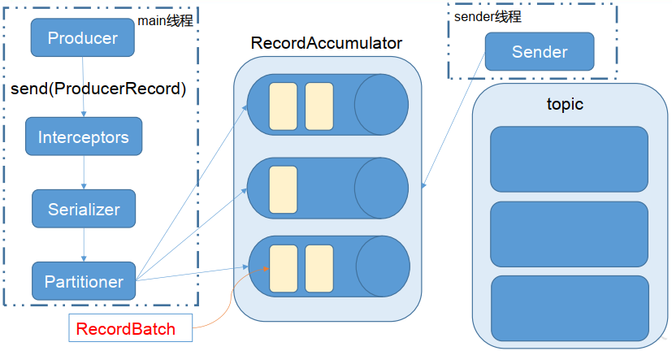

# Kafka Source

## 消息生产

### 消息生产模型

Kafka 的生产者发送消息采用的是异步发送的方式。在消息发送的过程中，涉及到了两个线程：main 线程和 Sender 线程，以及一个线程共享变量 RecordAccumulator。

main 线程将消息发送给 RecordAccumulator；Sender 线程不断从 RecordAccumulator 中拉取消息发送到 Broker。



**相关参数**

- `batch.size` 数据积累到 `batch.size` 之后， Sender 才会发送数据
- `linger.ms` 如果数据迟迟未达到 `batch.size`， Sender 等待 `linger.time` 后发送数据


<br>

### KafkaProducer

> 同步和异步发送都是调用 KafkaProducer#doSend 方法，同步发送 callback=null

**发送流程**

1、将信息包装成 AppendCallbacks（其中包含消息记录，消息拦截器，异步回调方法）

2、如果生产者已经关闭则发送失败，否则继续发送

3、从 Blocker 集群上获取元数据，包括主题和分区数据

4、使用指定的序列化器对消息 key 和 value 进行序列化

5、计算消息发送的目标分区，如果返回值为 RecordMetadata.UNKNOWN_PARTITION，则 RecordAccumulator 会根据内部逻辑选择分区

6、设置消息属性，计算消息序列化之后的大小

7、将消息和目标分区包装成 RecordAccumulator.RecordAppendResult

8、如果自定义分区器存在，则尝试利用 onNewBatch 方法得到新的批次

9、将记录添加到缓冲器中

10、如果添加记录后批次已满，或者已创建新批次，则唤醒 sender 线程进行数据发送

```java
public Future<RecordMetadata> send(ProducerRecord<K, V> record, Callback callback) {
    // intercept the record, which can be potentially modified; this method does not throw exceptions
    ProducerRecord<K, V> interceptedRecord = this.interceptors.onSend(record);
    return doSend(interceptedRecord, callback);
}

// 同步调用的是异步发送方法，只是 callback=null
private Future<RecordMetadata> doSend(ProducerRecord<K, V> record, Callback callback) {
    // 将信息包装成 AppendCallbacks（其中包含消息记录，消息拦截器，异步回调方法）
    AppendCallbacks<K, V> appendCallbacks = new AppendCallbacks<K, V>(callback, this.interceptors, record);
    try {
      	// 检查 Producer 是否已关闭，如果没有关闭，则继续执行该方法
        throwIfProducerClosed();
        // first make sure the metadata for the topic is available
        // 从 Broker 上获取指定主题和分区的元数据
        // 获取集群信息
      	// 将消息序列化
        
      	// 尝试计算分区，如果返回值为 RecordMetadata.UNKNOWN_PARTITION，

        // 设置消息属性与消息头

        // 获取序列化消息大小
      
      	// 判断是否是自定义分区。如果是可以调用 onNewBatch 回调函数

      	// 将消息和 partition 包装成 RecordAccumulator
      	// 如果自定义分区器存在，获取分区

        // 包装分区

      	// 如果消息批次满了，或者新批次创建
      	// 唤醒发送线程，发送消息
        if (result.batchIsFull || result.newBatchCreated) {
            log.trace("Waking up the sender since topic {} partition {} is either full or getting a new batch", record.topic(), appendCallbacks.getPartition());
          	// public class Sender implements Runnable
            this.sender.wakeup();
        }
        return result.future;
        // handling exceptions and record the errors;
        // for API exceptions return them in the future,
        // for other exceptions throw directly
    }
}
```

### Sender

```java
public void run() {
    // main loop, runs until close is called
    runOnce();
		/**...**/
}
```

```java
void runOnce() {
    if (transactionManager != null) { /** 如果事务管理器存在 **/ }
    long pollTimeout = sendProducerData(currentTimeMs);
    client.poll(pollTimeout, currentTimeMs);
}
```

```java
private long sendProducerData(long now) {
    Cluster cluster = metadata.fetch(); // 获取 Broker 集群信息
    // 获取准备发送数据的分区列表
    RecordAccumulator.ReadyCheckResult result = this.accumulator.ready(cluster, now);

    // if there are any partitions whose leaders are not known yet, force metadata update

    // remove any nodes we aren't ready to send to

    // create produce requests

    // Reset the producer id if an expired batch has previously been sent to the broker. 

  	// 如果有任何准备发送的节点+有可发送的数据，就用 0 超时轮询
    if (!result.readyNodes.isEmpty()) {ç
        pollTimeout = 0;
    }
    sendProduceRequests(batches, now);
    return pollTimeout;
}
```

```java
private void sendProduceRequest(long now, int destination, short acks, int timeout, List<ProducerBatch> batches) {
    final Map<TopicPartition, ProducerBatch> recordsByPartition = new HashMap<>(batches.size());

    // 进行 Kafka 新旧版本消息兼容操作

    // 检查是否是事务消息，设置事务 Id

    // build request

    String nodeId = Integer.toString(destination);
    ClientRequest clientRequest = client.newClientRequest(nodeId, requestBuilder, now, acks != 0,
            requestTimeoutMs, callback);
    client.send(clientRequest, now);
}
```

### NetworkClient#doSend

```java
private void doSend(/**...**/) {
  	/**...**/
    selector.send(new NetworkSend(clientRequest.destination(), send));
}
```

### Selector#send

```java
public void send(NetworkSend send) {
    /**...**/
  	channel.setSend(send);
  	/**...**/
}
```

### KafkaChannel#setSend

```java
public void setSend(NetworkSend send) {
    this.send = send;
    this.transportLayer.addInterestOps(SelectionKey.OP_WRITE); // 设置感兴趣的事件
}
```

<br>

### 总结

> 和 RocketMQ 的发送流程对比：
>
> * 发送方式
>
>   Kafka 借助了 nio 来进行消息发送，而 RocketMQ 则是借助 Netty 来实现消息发送。Netty 本质上也是 nio，只是对 nio 的进一步抽象，并提供一组更加易用的 API 操作。
>
> * 发送线程
>
>   Kafka 的发送操作涉及到两个线程一个 main 和一个 Sender 线程；RocketMQ 只有在发送异步消息的时候才涉及到多个线程。


<br>

## 消息消费

Kafka 的消费者均派生自  Consumer 接口。Consumer 接口预定义了一系列方法：

* subscription() Get the current subscription
* subscribe() Subscribe to the given list of topics to get dynamically assigned partitions
* assignment() Get the set of partitions currently assigned to this consumer
* poll() Fetch data for the topics or partitions specified using one of the subscribe/assign APIs 轮询拉取消息
* commitSync() Commit offsets returned on the last poll() for all the subscribed list of topics and partitions
* commitAsync() Commit offsets returned on the last poll(Duration) for all the subscribed list of topics and partition
* ...


<br>

### 消息消费过程

1、Consumer#subscribe 绑定订阅关系

2、Consumer#poll 消费者按照指定时间，轮询从指定主题或分区上获取数据，再依次消费

```java
// 订阅模式，设置订阅的 topic
consumer.subscribe(Arrays.asList("topic-test"));
while (true) {
    ConsumerRecords<String, String> records = consumer.poll(100);
    for (ConsumerRecord<String, String> record : records) {
        System.out.println("[received]: " + record);
    }
}
```

### KafkaConsumer#poll

```java
private ConsumerRecords<K, V> poll(final Timer timer, final boolean includeMetadataInTimeout) {
    // 确保消费者处于开启状态
    try {
        // if subscriptions.hasNoSubscriptionOrUserAssignment() -> Exception
        do {
            // client.maybeTriggerWakeup(); try to wake up comsumer
            final Fetch<K, V> fetch = pollForFetches(timer);
            if (!fetch.isEmpty()) {
                // 如果有网络问题，尽已经获取到的数据尽可能传输出去
              	// 传输到哪里？
              	// 源码内发现是将接收到的消息再发送回 Broker
              	// 很容易理解，消息接收过程因为网络问题可能未接收完毕，消费操作无法顺利完成。
              	// 为了保证消息消费完整性索性将接收到的消息再发送回 Broker，下一次再拉取消费，								// 能保证消息不会丢失
              	// 这样子能保证消息至少被消费一次 at least once，消费端再使用一些记录操作
              	// 保存已经消费过的消息 id，就能保证消息不重复消费。
                if (fetcher.sendFetches() > 0 || client.hasPendingRequests()) {
                    client.transmitSends();
                }
                // if (fetch.records().isEmpty())
                return this.interceptors.onConsume(new ConsumerRecords<>(fetch.records())); // 消息消费拦截器生效，再返回拦截器处理过的消息 ConsumerRecords
            }
        } while (timer.notExpired());
        return ConsumerRecords.empty();
    }
}
```

