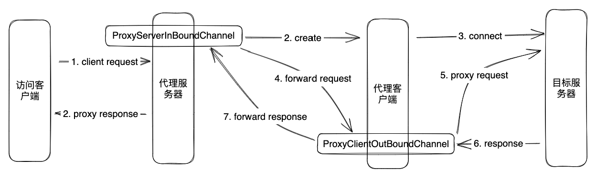

# Netty

> 基于 Java NIO 封装的网络框架


> 关于 IO 模型的演变以及多路复用可以看看[这篇文章](https://mp.weixin.qq.com/s/zAh1yD5IfwuoYdrZ1tGf5Q)，很详细。


<br>

## 基本使用

### 创建服务器

```java
public class EchoServer {
  private final int port;
  public EchoServer(int port) {
      this.port = port;
  }
  public void start() {
    	// NioEventLoopGroup 用来处理 I/O 操作的多线程事件循环器
    	// boss 接收到信息后注册到 worker 上，由 worker 来处理数据
      NioEventLoopGroup boss = new NioEventLoopGroup(); // 接收连接
      NioEventLoopGroup worker = new NioEventLoopGroup(); // 处理连接
      try {
        	// 启动 NIO 服务的辅助启动类
          ServerBootstrap server = new ServerBootstrap();
        	// Set the EventLoopGroup for the parent (acceptor) and the child (client)
          server.group(boss, worker)
            			// The Class which is used to create Channel instances
                  .channel(NioServerSocketChannel.class)
                  .childHandler(new ChannelInitializer<SocketChannel>() {
                      @Override
                      protected void initChannel(SocketChannel ch) throws Exception {
                          ch.pipeline().addLast(new EchoServerChannelHandler());
                      }
                  })
            			// Allow to specify a ChannelOption which is used for the Channel instances once they got created
                  .option(ChannelOption.SO_BACKLOG, 128)
            			// Allow to specify a ChannelOption which is used for the Channel instances once they get created (after the acceptor accepted the Channel)
                  .childOption(ChannelOption.SO_KEEPALIVE, true);
          // start
          ChannelFuture future = server.bind(port).sync();
          System.out.println("server started, listen on port " + port);
          future.channel().closeFuture().sync(); // 阻塞直到 future 关闭
      } catch (Exception e) {
          throw new RuntimeException(e);
      } finally {
          boss.shutdownGracefully();
          worker.shutdownGracefully();
      }
  }
  public static void main(String[] args) {
      new EchoServer(8080).start();
  }
}
```

```java
public class EchoServerChannelHandler extends ChannelInboundHandlerAdapter {
    // channelRead 方法会在收到客户端新消息时被调用
    @Override
    public void channelRead(ChannelHandlerContext ctx, Object msg) throws Exception {
        ByteBuf byteBuf = (ByteBuf) msg;
        try {
            System.out.println("[server] received " + byteBuf.toString(CharsetUtil.UTF_8));

            // response
            ctx.write("server echo");
            // ctx.flush();

        } finally {
            ReferenceCountUtil.release(msg);
        }
    }
    @Override
    public void channelReadComplete(ChannelHandlerContext ctx) throws Exception {
        super.channelReadComplete(ctx);
        ctx.writeAndFlush(Unpooled.EMPTY_BUFFER) // flush 缓存中的所有数据到到远程
                .addListener(ChannelFutureListener.CLOSE);
    }
    @Override
    public void exceptionCaught(ChannelHandlerContext ctx, Throwable cause) throws Exception {
        cause.printStackTrace();
        ctx.close(); // Close
    }
}
```


### 创建客户端

```java
public class EchoClient {
    private final String host;
    private final int port;
    public EchoClient(String host, int port) {
        this.host = host;
        this.port = port;
    }
    public void start() {
        NioEventLoopGroup workerGroup = new NioEventLoopGroup();
        try {
            Bootstrap b = new Bootstrap();
            b.group(workerGroup)
                    .channel(NioSocketChannel.class)
                    .remoteAddress(new InetSocketAddress(host, port))
                    .handler(new ChannelInitializer<SocketChannel>() {
                        @Override
                        protected void initChannel(SocketChannel ch) throws Exception {
                            ch.pipeline().addLast(new EchoClientChannelHandler());
                        }
                    });
            ChannelFuture future = b.connect().sync();
            System.out.println("echo client started");
            future.channel().closeFuture().sync(); // 阻塞直到 future 关闭
        } catch (InterruptedException e) {
            throw new RuntimeException(e);
        } finally {
            workerGroup.shutdownGracefully();
        }
    }
    public static void main(String[] args) {
        new EchoClient("localhost", 8080).start();
    }
}
```

```java
// @ChannelHandler.Sharable 表示这个类的实例可以在 pipeline 中多次共享
@ChannelHandler.Sharable
public class EchoClientChannelHandler extends SimpleChannelInboundHandler<ByteBuf> {
    @Override
    public void channelActive(ChannelHandlerContext ctx) throws Exception {
        ctx.writeAndFlush(Unpooled.copiedBuffer("hello! This is client", CharsetUtil.UTF_8));
    }
    @Override
    protected void channelRead0(ChannelHandlerContext ctx, ByteBuf msg) throws Exception {
        System.out.println("[client] received " + msg.toString(CharsetUtil.UTF_8));
    }
    @Override
    public void exceptionCaught(ChannelHandlerContext ctx, Throwable cause) throws Exception {
        cause.printStackTrace();
        ctx.close();
    }
}
```

<br>

### 总结

可以看到，相比于单纯使用 Java NIO，使用 Netty 来创建网络客服务器和客户端就少了很多代码。Java NIO 中 Selector、Channel、Buffer 三个部分都需要自行关注其逻辑实现；在 Netty 中更多的是关注如何处理数据，减少了很多代码和繁琐的创建逻辑，只需要关注业务逻辑。


<br>

## 类和接口

### ByteBuf

与 Java NIO 中的 ByteBuffer 一样，用作容器。Netty 使用引用计数来判断一个 ByteBuf 何时被释放。

**如何创建**

推荐通过 Unpooled 类来创建 ByteBuf 实例。

**访问索引**

ByteBuf 使用一个读和一个写索引作为数据访问指针。

```
+-------------------+------------------+------------------+
| discardable bytes | readable bytes   | writable bytes   |
|                   | (CONTENT)        |                  |
+-------------------+------------------+------------------+
|                   |                  |                  |
0     <=      readerIndex    <=   writerIndex    <=    capacity
```

**数据读取**

任何名称以 read 或 skip 开头的操作都会获取或跳过 readerIndex 之前的数据

**数据写入**

任何名称以 write 开头的操作都会在当前 writerIndex 处写入数据，如果没有足够的可写字节，报错 IndexOutOfBoundsException。

**数据丢弃**

任何在 readerIndex 之前的数据在调用 discardReadBytes() 方法之后都会被丢弃

```
 *  BEFORE discardReadBytes()
 *
 *      +-------------------+------------------+------------------+
 *      | discardable bytes |  readable bytes  |  writable bytes  |
 *      +-------------------+------------------+------------------+
 *      |                   |                  |                  |
 *      0      <=      readerIndex   <=   writerIndex    <=    capacity
 *
 *  AFTER discardReadBytes()
 *
 *      +------------------+--------------------------------------+
 *      |  readable bytes  |    writable bytes (got more space)   |
 *      +------------------+--------------------------------------+
 *      |                  |                                      |
 * readerIndex (0) <= writerIndex (decreased)        <=        capacity
```


**数据清空操作**

可以通过调用 clear() 方法来清空当前 ByteBuf

```
 *  BEFORE clear()
 *
 *      +-------------------+------------------+------------------+
 *      | discardable bytes |  readable bytes  |  writable bytes  |
 *      +-------------------+------------------+------------------+
 *      |                   |                  |                  |
 *      0      <=      readerIndex   <=   writerIndex    <=    capacity
 *
 *  AFTER clear()
 *
 *      +---------------------------------------------------------+
 *      |             writable bytes (got more space)             |
 *      +---------------------------------------------------------+
 *      |                                                         |
 *      0 = readerIndex = writerIndex            <=            capacity
```


<br>

**复合类型**

假设存在以下内容，在 NIO 中要创建一个新的大缓存区用来拷贝这两部分到这个新缓存区中。

```
 +--------+----------+
 | header |   body   |
 +--------+----------+
```

在 Netty 中可以将这两个类型都包装成 ByteBuf

```java
// 复合类型与组件类型是兼容的。
ByteBuf message = Unpooled.wrappedBuffer(header, body);

// 因此，你甚至可以通过混合复合类型与普通缓冲区来创建一个复合类型。
ByteBuf messageWithFooter = Unpooled.wrappedBuffer(message, footer);

// 由于复合类型仍是 ByteBuf，访问其内容很容易，
//并且访问方法的行为就像是访问一个单独的缓冲区，
//即使你想访问的区域是跨多个组件。
//这里的无符号整数读取位于 body 和 footer
messageWithFooter.getUnsignedInt(
     messageWithFooter.readableBytes() - footer.readableBytes() - 1);
```


**自动扩容**

```java
// 一种新的动态缓冲区被创建。在内部，实际缓冲区是被“懒”创建，从而避免潜在的浪费内存空间。
ByteBuf b = Unpooled.buffer(4);

// 当第一个执行写尝试，内部指定初始容量 4 的缓冲区被创建
b.writeByte('1');

b.writeByte('2');
b.writeByte('3');
b.writeByte('4');

// 当写入的字节数超过初始容量 4 时，
//内部缓冲区自动分配具有较大的容量
b.writeByte('5');
```


<br>

#### HeapBuffer

顾名思义，将缓冲数据保存在 JVM 的堆区中

#### DirectBuffer

Java NIO 新增的缓冲类，可以将缓冲数据保存到 JVM 堆外存中，不会被垃圾回收。

#### ByteBufHolder

> A packet which is send or receive.

#### ReferenceCounted

Buffer 引用计数器，ByteBuf 和 ByteBufHolder 均继承自 ReferenceCounted。活动的引用计数器大于 0 的对象被保证不被释放。当数量引用减少到 0，该实例将被释放


<br>

### Bootstrap

|                     | ServerBootstrap | Bootstrap            |
| ------------------- | --------------- | -------------------- |
| 网络功能            | 绑定本地端口    | 连接到远程主机和端口 |
| EventLoopGroup 数量 | 2               | 1                    |


#### ServerBootstrap

负责启动 Netty 服务端，使用 bind() 方法绑定指定端口后启动服务。

<br>

#### Bootstrap

负责启动 Netty 客户端，提供了一个用于应用程序网络层配置的容器。使用 connect() 方法进行 TCP 传输，bind() 方法进行 UDP 传输。

connect 和 bind 方法返回一个 ChannelFuture 表示异步 Channel I/O 操作的结果。


<br>

### Channel

连接到网络套接字（Socket）或能够执行 I/O 操作（例如读取、写入、连接和绑定）的组件。可以对 Channel 进行以下操作：

1、查看当前 Channel 的状态

2、查看 Channel 的配置

3、查看 Channel 支持的操作（读/写/连接/端口绑定）

4、获取和当前 Channel 相关的 ChannelPipeline

<br>

Channel 是可继承的，一个 Channel 可以有一个 parent（取决于 Channel 是如何创建的）。比如在客户端 Channel 中可能会收到来自服务端的 SocketChannel，客户端会使用 ServerSocketChannel 来接收数据并创建出该 SocketChannel，此时调用 SocketChannel#parent 得到的就是客户端的 ServerSocketChannel。


<br>

### ChannelFuture

表示异步 Channel 的操作结果，Netty 中所有 IO 操作都是异步的，任何 I/O 调用都会立即返回。但 Netty 不保证所请求的 I/O 操作在调用结束时已经完成，ChannelFuture 实例提供了关于 I/O 操作的结果或状态的信息。

* ChannelFuture 是一个 Future 类型的操作结果，是只读的。

* ChannelPromise 是 ChannelFuture 的一个子类，是可写的。


<br>

### ChannelHandler

处理一个 I/O 事件或拦截一个 I/O 操作，并将其转发给 ChannelPipeline 中的下一个 Handler。

ChannelHandler 本身没有提供很多方法，它提供以下子接口：

* ChannelInboundHandler 处理输入的 IO 事件
* ChannelOutboundHandler 处理输出的 IO 操作

此外还提供了一系列 Adapter，可以更方便的实现操作：

* ChannelInboundHandlerAdapter 处理输入事件
* ChannelOutboundHandlerAdapter 处理输出操作
* ChannelDuplexHandler 处理输入和输出事件
* SimpleChannelInboundHandler，ChannelInboundHandlerAdapter 的子类，允许处理指定的消息类型

业务逻辑处理基本上都是在各个 ChannelHandler 中进行的。

<br>

**@Sharable**

如果 ChannelHandler 使用了 @Sharable 注解，这意味该 ChannelHandler 可以在一个或多个 ChannelPipeline 中共享。如果不指定这个注解，必须每次将其添加到 ChannelPipeline 时创建一个新的 ChannelHandler 实例。


<br>

### ChannelHandlerContext

将 ChannelHandler 和 ChannelPipeline 相关联起来的上下文，ChannelHandlerContext 定义 pipeline() 方法可以用来获取与当前 ChannelHandler 相关联的 ChannelPipeline。

因为 ChannelHandler 可以被添加到多个 ChannelPipeline 中，所以一个共享的 ChannelHandler 实例（标注 @Sharable）可能有多个 ChannelHandlerContext。


<br>

### ChannelPipeline

ChannelPipeline 是 ChannelHandler 链的容器。每个 Channel 都有一个对应的 ChannelPipeline，用于管理 ChannelHandler，多个 ChannelHandler 在 ChannelPipeline 上形成一条调用链。

```
 *                                                 I/O Request
 *                                            				 or
 *                                        		ChannelHandlerContext
 *                                                      |
 *  +---------------------------------------------------+---------------+
 *  |                           ChannelPipeline         |               |
 *  |                                                  \|/              |
 *  |    +---------------------+            +-----------+----------+    |
 *  |    | Inbound Handler  N  |            | Outbound Handler  1  |    |
 *  |    +----------+----------+            +-----------+----------+    |
 *  |              /|\                                  |               |
 *  |               |                                  \|/              |
 *  |    +----------+----------+            +-----------+----------+    |
 *  |    | Inbound Handler N-1 |            | Outbound Handler  2  |    |
 *  |    +----------+----------+            +-----------+----------+    |
 *  |              /|\                                  .               |
 *  |               .                                   .               |
 *  | ChannelHandlerContext.fireIN_EVT() ChannelHandlerContext.OUT_EVT()|
 *  |        [ method call]                       [method call]         |
 *  |               .                                   .               |
 *  |               .                                  \|/              |
 *  |    +----------+----------+            +-----------+----------+    |
 *  |    | Inbound Handler  2  |            | Outbound Handler M-1 |    |
 *  |    +----------+----------+            +-----------+----------+    |
 *  |              /|\                                  |               |
 *  |               |                                  \|/              |
 *  |    +----------+----------+            +-----------+----------+    |
 *  |    | Inbound Handler  1  |            | Outbound Handler  M  |    |
 *  |    +----------+----------+            +-----------+----------+    |
 *  |              /|\                                  |               |
 *  +---------------+-----------------------------------+---------------+
 *                  |                                  \|/
 *  +---------------+-----------------------------------+---------------+
 *  |               |                                   |               |
 *  |       [ Socket.read() ]                    [ Socket.write() ]     |
 *  |                                                                   |
 *  |  Netty Internal I/O Threads (Transport Implementation)            |
 *  +-------------------------------------------------------------------+
```


<br>

**Pipeline 上的事件转发**

ChannelHandler 通过调用 ChannelHandlerContext 中的方法，将事件传递给调用链上的下一个 ChannelHandler。


<br>

**创建 Pipeline**

一个 Pipeline 上可能会有多和 ChannelHandler，分别负责不同的工作，比如：

* 协议解码器，将从 Channel 接收到的二进制数据转换成 Java 对象
* 协议编码器，将 Java 对象编码成二进制数据，通过 Channel 传输到远程
* 业务逻辑处理器，负责实现实际的业务逻辑


<br>

### EventLoop

在使用 Netty 来实现服务器的过程中你可能会奇怪，NIO 中的 Selector 角色在哪里？在 Netty 中 EventLoop 中就维护着一个 Selector 实例，用来处理 Channel 的 IO 操作。
Netty 启动时，会将多个 Channel 注册到 EventLoop 中，一个 EventLoop 可以处理多个 Channel 事件，一个 EventLoopGroup 可以包含多个 EventLoop。


<br>

### NioEventLoop

用于将 Channel 注册到 Selector 中，内部维护一个 SelectorTuple 类，


<br>

## 架构总览


缓冲（Buffer），通道（Channel），事件模型（Event Model）是 Netty 的三大核心。


<br>

## 编码/解码器

编码器能帮助我们将 Java 类型转换成 ByteBuf 发送到远程，解码器则将接收到的 ByteBuf 转换成 Java 类型来进行处理。Netty 提供了常见和常用的一些编解码器，能让我们更方便的来操作各种类型的数据：

* StringEncoder
* StringDecoder
* HttpRequestDecoder
* HttpResponseEncoder
* LineBasedFrameDecoder，将收到的 ByteBuf 在行尾处分割，使用行尾控制字符（`\n` 或 `\r\n`）作为分隔符来处理数据
* DelimiterBasedFrameDecoder，使用自定义的特殊字符作为消息的分隔符
* LengthFieldBasedFrameDecoder，通过指定长度来标识整包消息，这样就可以自动的处理黏包和半包消息
* ...

如在进行聊天系统的开发中，想要直接发送 String 类型，可以在 ChannelPipeline 中添加 StringEncoder 与 StringDecoder 用来帮助处理数据，这样就不用手动将数据在 String 和 ByteBuf 中来回转化。


> *注意：不论解码器还是编码器，接收的消息类型必须与待处理的消息类型一致，否则该编解码 ChannelHandler 不会被执行。*


<br>

### MessageToByteEncoder

继承自 ChannelOutboundHandlerAdapter，可以将 Java 类型转换成 ByteBuf 发送出去。

```java
public class IntegerEncoder extends MessageToByteEncoder<Integer> {
  	// This method will be called for each written message that can be handled by this encoder.
    @Override
    public void encode(ChannelHandlerContext ctx, Integer msg, ByteBuf out)
            throws Exception {
        out.writeInt(msg);
    }
}
```


<br>

### MessageToMessageEncoder

将出站数据从一种消息编码成另一种消息


<br>

### ByteToMessageDecoder

继承自 ChannelInboundHandlerAdapter，可以将接收到的 ByteBuf 类型转换成 Java 类型。

使用 ByteToMessageDecoder 需要调用 ByteBuf#readableBytes 方法检查接收到的数据是否满足一个 Frame，只有接收到一个 Frame 的数据才能将其完整的转换成 Java 类型。


> *注意：ByteToMessageDecoder 的子类不能标注 @Sharable。因为可能有多个读写操作在一个 ByteBuf 上同时进行，可能造成内存溢出。可以使用 ByteBuf#readSlice 切分出一个副本再进行操作。*

<br>

### ReplayingDecoder

ByteToMessageDecoder 的子类，使用起来更加方便，不需要手动的调用 ByteBuf#readableBytes 检查缓冲中的数据是否满足一个 Frame。

> The biggest difference between ReplayingDecoder and ByteToMessageDecoder is that ReplayingDecoder allows you to implement the decode() and decodeLast() methods just like all required bytes were received already

ReplayingDecoder#decode 的触发条件是接收到的数据已经满足一个 Frame，不用再关心过程，直接处理接收到的数据即可。

```java
// 自定义 MessageProtocol 类
public class MessageProtocol {
    private int len;
    private byte[] content;
    public int getLen() {
        return len;
    }
    public void setLen(int len) {
        this.len = len;
    }
    public byte[] getContent() {
        return content;
    }
    public void setContent(byte[] content) {
        this.content = content;
    }
    public MessageProtocol() {}
    public MessageProtocol(int len, byte[] content) {
        this.len = len;
        this.content = content;
    }
}
```

```java
// ByteBuf 解码成 MessageProtocol
public class MessageProtocolDecoder extends ReplayingDecoder<MessageProtocol> {
    @Override
    protected void decode(ChannelHandlerContext ctx, ByteBuf in, List<Object> out) throws Exception {
        // ByteBuf to MessageProtocol
        System.out.println("decode MessageProtocol");
        int len = in.readInt();
        byte[] buf = new byte[len];

        in.readBytes(buf); // 将 len 长度的数据读入 buf
        // 封装成 MessageProtocol 传递给下一个 handler 处理
        MessageProtocol messageProtocol = new MessageProtocol();
        messageProtocol.setLen(len);
        messageProtocol.setContent(buf);
        out.add(messageProtocol);
    }
}
```


<br>

### MessageToMessageDecoder

将入站数据从一种消息解码为另外一种消息


<br>

### ByteToMessageCodec

编解码器，可以认为是编码器和解码器的复合体

<br>

### MessageToMessageCodec

MessageToMessageEncoder 和 MessageToMessageDecoder 的复合体


<br>

### CombinedChannelDuplexHandler

结合解码器和编码器在一起可能会牺牲可重用性，为了避免这种情况，出现了 CombinedChannelDuplexHandler。

```java
public class CombinedByteCharCodec extends CombinedChannelDuplexHandler<ByteToCharDecoder, CharToByteEncoder> {
    public CombinedByteCharCodec() {
        super(new ByteToCharDecoder(), new CharToByteEncoder());
    }
}
```


<br>

## TCP 粘包和拆包

> [TCP 粘包和拆包及解决方案](https://dongzl.github.io/netty-handbook/#/_content/chapter09?id=第-9-章-tcp-粘包和拆包及解决方案)


<br>

## 使用 SSL/TLS 加密

> [使用 SSL/TLS 加密](https://waylau.com/essential-netty-in-action/CORE%20FUNCTIONS/Securing%20Netty%20applications%20with%20SSLTLS.html)


<br>

## RPC 调用实现

> [RPC 调用实现](https://dongzl.github.io/netty-handbook/#/_content/chapter11)


<br>

## 源码解析

### 服务端启动流程

下面是一段 Netty 服务端实例化并启动的流程

```java
NioEventLoopGroup boss = new NioEventLoopGroup();
NioEventLoopGroup worker = new NioEventLoopGroup();
try {
    ServerBootstrap server = new ServerBootstrap()
            .group(boss, worker)
            .channel(NioServerSocketChannel.class)
            .childHandler(new ChannelInitializer<SocketChannel>() {
                @Override
                protected void initChannel(SocketChannel ch) throws Exception {
                    ch.pipeline().addLast(new EchoServerChannelHandler());
                }
            })
            .option(ChannelOption.SO_BACKLOG, 128)
            .childOption(ChannelOption.SO_KEEPALIVE, true);

    // start
    ChannelFuture future = server.bind(port).sync();
    System.out.println("server started, listen on port " + port);

    // 对关闭 Channel 进行监听
    future.channel().closeFuture().sync(); // 阻塞直到 future 关闭
} catch (Exception e) {
    throw new RuntimeException(e);
} finally {
    boss.shutdownGracefully();
    worker.shutdownGracefully();
}
```


<br>

#### ServerBootstrap

先来回顾 Java NIO

```java
// open channel
ServerSocketChannel socketChannel = ServerSocketChannel.open();
// set non-block
socketChannel.configureBlocking(false);
// open Selector
Selector selector = Selector.open();
// register channel
SelectionKey selectionKey = socketChannel.register(selector, 0, socketChannel);
// 设置感兴趣的事件
selectionKey.interestOps(SelectionKey.OP_ACCEPT);
socketChannel.bind(new InetSocketAddress(8888));
```

需要手动打开 Channel，打开 Selector，再将 Channel 注册到 Selector 上。


<br>

先说结论：Bootstrap 就是帮助我们打开 Channel，并绑定端口的*启动类*或者说*辅助类*。

> Bootstrap sub-class which allows easy bootstrap of ServerChannel

翻译过来就是：ServerBootstrap 是 Bootstrap 的子类，开启一个 ServerChannel。

ServerBootstrap 有一个父类 AbstractBootstrap

> AbstractBootstrap is a helper class that makes it easy to bootstrap a Channel

AbstractBootstrap 是一个辅助类，用来开启一个 Channel。并提供一个 bind 方法用来绑定指定的端口进行 TCP/UDP 传输。


<br>

**ServerBootstrap 如何帮助我们打开 Channel？**

回顾一下上面的代码

```java
ServerBootstrap server = 
  new ServerBootstrap()
    .group(boss, worker) // [1]
    .channel(NioServerSocketChannel.class) // [2]
    .childHandler(new ChannelInitializer<SocketChannel>() { // [3]
        @Override
        protected void initChannel(SocketChannel ch) throws Exception {
            ch.pipeline().addLast(new EchoServerChannelHandler());
        }
    })
    .option(ChannelOption.SO_BACKLOG, 128)
    .childOption(ChannelOption.SO_KEEPALIVE, true);

// start
ChannelFuture future = server.bind(port).sync();
```

在第 [2] 行代码中，AbstractBootstrap#channel 方法需要我们传入一个 Channel 工厂类，再利用 Java 的反射来创建 Channel。

```java
// channelClass: The Class which is used to create Channel instances from
public B channel(Class<? extends C> channelClass) {
    return channelFactory(new ReflectiveChannelFactory<C>(
            ObjectUtil.checkNotNull(channelClass, "channelClass")
    ));
}
```

```java
public ReflectiveChannelFactory(Class<? extends T> clazz) {
    // ...
  	this.constructor = clazz.getConstructor();
  	// ...
}
```

在上面的代码中可以看到，ReflectiveChannelFactory 利用反射调用 NioServerSocketChannel 的无参构造器来创建 NioServerSocketChannel 实例。**到这里我们服务端需要的 Channel 就创建完毕了。**

<br>

回顾 Java NIO，在开启了一个 Channel 之后，我们需要手动的把它注册到 Selector 中，在 Netty 中这一个步骤如何进行？**创建了 Channel 之后，该如何注册到 Selector 中？**

让我们把目光转移到标号 [1] 这一行代码，接下来就到 NioEventLoopGroup 出场了。


<br>

#### NioEventLoopGroup

```java
// Debug 的时候注意一下这两个 NioEventLoopGroup，
// 后面可以用来和 AbstractBootstrap#initAndRegister 中的 config().group() 进行比较
NioEventLoopGroup boss = new NioEventLoopGroup();
NioEventLoopGroup worker = new NioEventLoopGroup();
```

上面两句代码中，分别创建了 boss 组和 worker 组，为什么要创建两个组呢？这是后话。我们使用 NioEventLoopGroup 的无参构造器来创建实例。

```java
// Create a new instance using the default number of threads, the default ThreadFactory and the SelectorProvider which is returned by SelectorProvider.provider().
public NioEventLoopGroup() { this(0); }
```

如果使用无参构造器，创建的 EventLoopGroup 使用的线程默认为 `CUP 核心数 * 2`

```java
DEFAULT_EVENT_LOOP_THREADS = Math.max(1, SystemPropertyUtil.getInt
("io.netty.eventLoopThreads", NettyRuntime.availableProcessors() * 2));
```


<br>

**还记得 Java NIO 中的内容吗？**

> *Selector#open 方法会使用系统默认的 SelectorProvider 创建一个 Selector；也可以使用自定义的 SelectorProvider 来创建 Selector。*

在 Netty 中，也是使用 SelectorProvider 来创建 Selector

```java
public NioEventLoopGroup(int nThreads, Executor executor) {
    this(nThreads, executor, SelectorProvider.provider());
}
```

```java
// SelectorProvider#provider -> provider = sun.nio.ch.DefaultSelectorProvider.create();
public static SelectorProvider create() {
    String osname = AccessController
        .doPrivileged(new GetPropertyAction("os.name"));
    if (osname.equals("SunOS"))
        return createProvider("sun.nio.ch.DevPollSelectorProvider");
    if (osname.equals("Linux"))
        return createProvider("sun.nio.ch.EPollSelectorProvider");
    return new sun.nio.ch.PollSelectorProvider();
}
```

可以看到，Netty 会根据 OS 使用不同的 SelectorProvider 来创建 Selector。

**Selector 在哪里呢？**顺着下面的流程：

1、NioEventLoopGroup()

2、MultithreadEventLoopGroup(int, Executor, Object...)

3、MultithreadEventExecutorGroup(int, Executor, EventExecutorChooserFactory, Object...)

4、NioEventLoopGroup#newChild

5、NioEventLoop(NioEventLoopGroup, Executor, SelectorProvider, SelectStrategy, RejectedExecutionHandler, EventLoopTaskQueueFactory, EventLoopTaskQueueFactory)

```java
NioEventLoop(/**...**/) {
    super(parent, executor, false, newTaskQueue(taskQueueFactory), newTaskQueue(tailTaskQueueFactory),
            rejectedExecutionHandler);
    this.provider = ObjectUtil.checkNotNull(selectorProvider, "selectorProvider"); // 设置 SelectorProvider
    this.selectStrategy = ObjectUtil.checkNotNull(strategy, "selectStrategy"); // IO 就绪事件轮询的策略
  	// SelectorTuple 包含：unwrappedSelector 和 selector
    final SelectorTuple selectorTuple = openSelector(); 
    this.selector = selectorTuple.selector;
    this.unwrappedSelector = selectorTuple.unwrappedSelector;
}
```

现在恍然大悟，原来一直没出现的 Selector 角色被 Netty ”藏“在了 EventLoop 中。由此我们也可以确定，Channel 是注册到 EventLoop 所管理的 Selector 中的。


<br>

到这里，Channel 开启了，Selector 有了，那**何时注册 Channel？**

还记得 AbstractBootstrap 吗？它是 ServerBootstrap 的父类，初始化并注册 Channel 的操作就是在 AbstractBootstrap#doBind 方法中进行的。

```java
private ChannelFuture doBind(final SocketAddress localAddress) {
  	// initAndRegister 初始化 Channel 并注册到 Selector 中
    final ChannelFuture regFuture = initAndRegister();
    final Channel channel = regFuture.channel();
  	// ...
}
```

```java
final ChannelFuture initAndRegister() {
    Channel channel = null;
  	// 反射拿到 Channel，同时创建 ChannelPipeline
    channel = channelFactory.newChannel();
  	// 初始化 Channel，设置 ChannelOption、设置 ChannelPipeline
    init(channel); // 这里有个细节，后续再聊
  	// 将 Channel 注册到 EventGroup 中
    ChannelFuture regFuture = config().group().register(channel);
}
```

从 AbstractBootstrap#initAndRegister 代码中可以看出，它主要负责创建和初始化 Channel。这里的 `init(channel)` 这句代码在后续会聊到。看到最后 `group().register(channel)` 这一句代码：将 Channel 注册到 EventLoopGroup 中。

<br>

顺着代码调用流程来观察一下，**看一下 Channel 注册的细节**：

1、AbstractBootstrap#doBind

2、AbstractBootstrap#initAndRegister 第一次执行 group() 方法拿到的是 AbstractBootstrap#group，即我们之前创建的 boss

3、MultithreadEventLoopGroup#register

4、SingleThreadEventLoop#register(Channel)

5、SingleThreadEventLoop#register(Channel, EventExecutor)，将 Channel 包装成 ChannelPromise，传入的 EventExecutor 参数是 SingleThreadEventLoop

6、SingleThreadEventLoop#register(ChannelPromise)

7、AbstractChannel.AbstractUnsafe#register 检查当前线程在不在当前 EventLoop 中

8、AbstractChannel.AbstractUnsafe#register0

9、AbstractNioChannel#doRegister

```java
protected void doRegister() throws Exception {
    boolean selected = false;
    for (;;) {
      	// javaChannel() 表示之前创建的 NioServerSocketChannel，具体看 NioServerSocketChannel#NioServerSocketChannel(ServerSocketChannel)
      	// eventLoop() 返回 AbstractBootstrap#group，即 bossGroup
      	// 将 Channel 注册到 bossGroup 中
        selectionKey = javaChannel().register(eventLoop().unwrappedSelector(), 0, this);
      	// ...
    }
}
```

10、AbstractSelectableChannel#register

```java
// ops 表示感兴趣的事件
// att 表示即将注册到当前 Selector 的 Channel
public final SelectionKey register(Selector sel, int ops,
                                   Object att)
    throws ClosedChannelException
{
    synchronized (regLock) {
        // 异常判断...
        if (!isOpen())
            throw new ClosedChannelException();
        if ((ops & ~validOps()) != 0)
            throw new IllegalArgumentException();
        if (isBlocking())
            throw new IllegalBlockingModeException();
      
        SelectionKey k = findKey(sel);
        if (k != null) {
            k.interestOps(ops);
            k.attach(att);
        }
        if (k == null) {
            // New registration
            synchronized (keyLock) {
                if (!isOpen())
                    throw new ClosedChannelException();
                k = ((AbstractSelector)sel).register(this, ops, att);
                addKey(k); // SelectionKey 集合
            }
        }
        return k;
    }
}
```

在上面的代码中，SelectionKey 出现了。回想一下 Java NIO，将 SelectableChannel 注册到 Selector 后由 SelectionKey 集合来表示。

**到这里就表示服务端自身的 Channel 注册完成了，是注册到 bossGroup 关联的 EventLoop 中的 Selector 的。**


<br>

好，现在可以回到我们上面的问题：**为什么要创建 boss 和 worker 两个组呢？它们是如何工作的？**

先给出结论：

* bossGroup 负责：1、连接新的 Channel；2、将 Channel 注册到 workerGroup 上
* workerGroup 用于处理已经建立的连接和执行具体的业务逻辑。


<br>

但是，走完上面的流程，我们只观察到了 Channel 注册到 bossGroup 中，**workerGroup 何时发挥作用？**

在讲到 AbstractBootstrap#initAndRegister 这个方法时，有一句代码 `init(channel);` 在这里发挥了重要作用。看到 ServerBootstrap#init

```java
void init(Channel channel) {
  	// 设置 ChannelOption
    setChannelOptions(channel, newOptionsArray(), logger);
  	// 设置 Channel 属性
    setAttributes(channel, newAttributesArray());
		// 获取 ChannelPipeline
  	// 在创建 Channel 的时候也会同步创建 ChannelPipeline
    ChannelPipeline p = channel.pipeline();
		// 主角 workerGroup 来了
    final EventLoopGroup currentChildGroup = childGroup;
    final ChannelHandler currentChildHandler = childHandler;
    final Entry<ChannelOption<?>, Object>[] currentChildOptions = newOptionsArray(childOptions);
    final Entry<AttributeKey<?>, Object>[] currentChildAttrs = newAttributesArray(childAttrs);
    p.addLast(new ChannelInitializer<Channel>() {
        @Override
        public void initChannel(final Channel ch) {
            final ChannelPipeline pipeline = ch.pipeline();
            ChannelHandler handler = config.handler();
            if (handler != null) {
                pipeline.addLast(handler);
            }

            ch.eventLoop().execute(new Runnable() {
                @Override
                public void run() {
                  	// ServerBootstrapAcceptor 是关键
                    pipeline.addLast(new ServerBootstrapAcceptor(
                            ch, currentChildGroup, currentChildHandler, currentChildOptions, currentChildAttrs));
                }
            });
        }
    });
}
```


<br>

#### ServerBootstrapAcceptor

ServerBootstrapAcceptor 本质是一个 ChannelInboundHandlerAdapter，我们关心的问题就在 ServerBootstrapAcceptor#channelRead 方法中。

```java
private static class ServerBootstrapAcceptor extends ChannelInboundHandlerAdapter {

    private final EventLoopGroup childGroup;
    private final ChannelHandler childHandler;
    private final Entry<ChannelOption<?>, Object>[] childOptions;
    private final Entry<AttributeKey<?>, Object>[] childAttrs;
    private final Runnable enableAutoReadTask;

    ServerBootstrapAcceptor(
            final Channel channel, EventLoopGroup childGroup, ChannelHandler childHandler,
            Entry<ChannelOption<?>, Object>[] childOptions, Entry<AttributeKey<?>, Object>[] childAttrs) {
        this.childGroup = childGroup;
        this.childHandler = childHandler;
        this.childOptions = childOptions;
        this.childAttrs = childAttrs;

        // Task which is scheduled to re-enable auto-read.
        // It's important to create this Runnable before we try to submit it as otherwise the URLClassLoader may
        // not be able to load the class because of the file limit it already reached.
        //
        // See https://github.com/netty/netty/issues/1328
        enableAutoReadTask = new Runnable() {
            @Override
            public void run() {
                channel.config().setAutoRead(true);
            }
        };
    }

    @Override
    public void channelRead(ChannelHandlerContext ctx, Object msg) {
        final Channel child = (Channel) msg;

        child.pipeline().addLast(childHandler);

        setChannelOptions(child, childOptions, logger);
        setAttributes(child, childAttrs);

        try {
          	// 将 Channel 添加到 childGroup，也就是 workGroup 中
            childGroup.register(child).addListener(new ChannelFutureListener() {
                @Override
                public void operationComplete(ChannelFuture future) throws Exception {
                    if (!future.isSuccess()) {
                        forceClose(child, future.cause());
                    }
                }
            });
        } catch (Throwable t) {
            forceClose(child, t);
        }
    }
}
```


<br>

接下来看一下 ServerBootstrap#childHandler，也就是上边的标号 [3] 这一行。

<br>

#### ChannelHandler

```java
// Set the ChannelHandler which is used to serve the request for the Channel's.
// 设置一个 ChannelHandler，即设置服务器中用来处理请求的 Channel
public ServerBootstrap childHandler(ChannelHandler childHandler) {
    this.childHandler = ObjectUtil.checkNotNull(childHandler, "childHandler");
    return this;
}
```

在设置 ChannelHandler 的时候，我们传入了一个匿名内部类 ChannelInitializer，它是 ChannelInboundHandler 的子类，使用它**能让我们更方便的来处理注册到 EventLoop 中的 Channel**。

从这里我们可以知道 ChannelInitializer 是客户端 Channel 注册到 EventLoop 过程中的一个关键类，注意看 ChannelInitializer#initChannel

```java
private boolean initChannel(ChannelHandlerContext ctx) throws Exception {
    if (initMap.add(ctx)) { // Guard against re-entrance.
        try {
          	// 初始化 Channel，执行的是 .childHandler() 方法中的 initChannel()
            initChannel((C) ctx.channel());
        } catch (Throwable cause) {
            // ...
        } finally {
            if (!ctx.isRemoved()) {
                ctx.pipeline().remove(this);
            }
        }
        return true;
    }
    return false;
}
```


<br>

> 客户端的启动流程跟服务端类似，就不再重复了。


<br>

## 实例

### Redis 客户端

创建了客户端之后添加好对应的编解码器：

```java
protected void initChannel(SocketChannel ch) throws Exception {
    ch.pipeline()
            .addLast(new RedisDecoder())
            .addLast(new RedisEncoder())
            .addLast(new RedisBulkStringAggregator())
            .addLast(new RedisArrayAggregator())
            .addLast(new GreenisChannelHandler());
}
```

其中，Redis 消息相关的编解码器 Netty 内部已经有实现了，接下来只要自定义处理好消息发送与接收即可：

```java
public class GreenisChannelHandler extends ChannelDuplexHandler {
    // 发送 redis 命令
    @Override
    public void write(ChannelHandlerContext ctx, Object msg, ChannelPromise promise) throws Exception {
        String[] cmds = ((String) msg).split("\\s+");
        ArrayList<RedisMessage> messages = new ArrayList<>(cmds.length);
        for (String cmd : cmds) {
            FullBulkStringRedisMessage redisMessage =
                    new FullBulkStringRedisMessage(ByteBufUtil.writeUtf8(ctx.alloc(), cmd));
            messages.add(redisMessage);
        }
        ArrayRedisMessage requestMessages = new ArrayRedisMessage(messages);
        ctx.write(requestMessages, promise);
    }

  	// 接收 redis 响应
    @Override
    public void channelRead(ChannelHandlerContext ctx, Object msg) throws Exception {
        RedisMessage message = (RedisMessage) msg;
        printResponse(message);
        System.out.print(">");
        ReferenceCountUtil.release(message);
    }

    private void printResponse(RedisMessage message) {
        if (message instanceof SimpleStringRedisMessage) {
            String content = ((SimpleStringRedisMessage) message).content();
            System.out.println(content);
        } else if (message instanceof IntegerRedisMessage) {
            long value = ((IntegerRedisMessage) message).value();
            System.out.println(value);
        } else if (message instanceof FullBulkStringRedisMessage) {
            ByteBuf content = ((FullBulkStringRedisMessage) message).content();
            System.out.println(content.toString(CharsetUtil.UTF_8));
        } else if (message instanceof ArrayRedisMessage) {
            List<RedisMessage> children = ((ArrayRedisMessage) message).children();
            for (RedisMessage child : children) {
                printResponse(child);
            }
        } else if (message instanceof ErrorRedisMessage) {
            String content = ((ErrorRedisMessage) message).content();
            System.out.println(content);
        } else {
            throw new RuntimeException("Unknown message type " + message);
        }
    }
}
```

<br>

### 代理服务器

原理如下图




<br>

### 内网穿透

> 在 [GitHub](https://github.com/wandererex/wormhole) 看到一个使用 Netty 实现内网穿透的工具，使用 Java 实现，学习一下。

比如，将 127.0.0.1:3307 代理到 127.0.0.1:3306。**如何实现呢？**

需要三个角色相互配合起作用：客户端服务、代理服务、目标服务。以 MySQL 连接为例：客户端服务连接到代理服务:3307，代理服务会将客户端的请求转发到目标服务:3306。因为代理服务依赖于目标服务，所以它们的启动顺序是：先启动目标服务，再启动代理服务，然后使用客户端连接到代理服务。

利用 Netty 来启动服务是很容易的，难点在数据帧的设计和 ChannelHandler 处理数据的逻辑上。先创建目标服务

<br>

## 参考

https://waylau.com/netty-4-user-guide

https://waylau.com/essential-netty-in-action

https://dongzl.github.io/netty-handbook

https://mp.weixin.qq.com/s/zAh1yD5IfwuoYdrZ1tGf5Q

https://mp.weixin.qq.com/s/IuIsUtpiye13L8ZyHWvzXA
