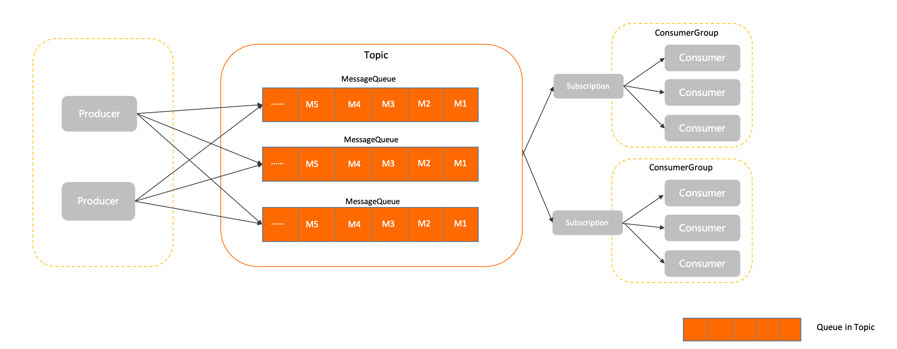
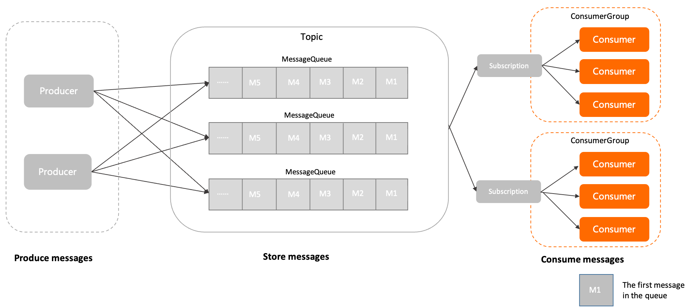
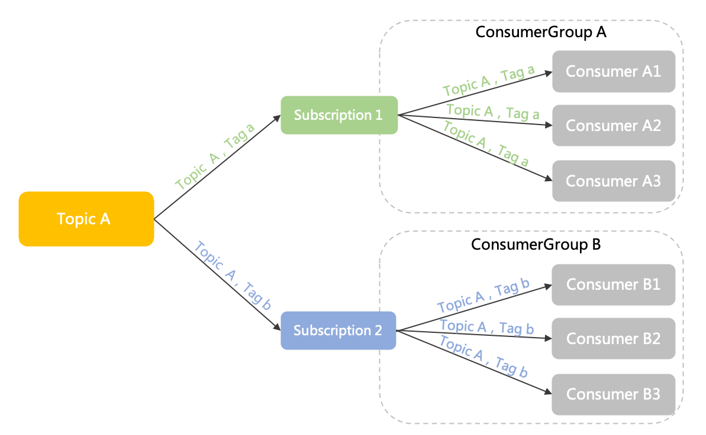

# RocketMQ 领域模型

## 前言

> RocketMQ 是一个分布式的中间件服务，采用异步通信模型和发布/订阅消息传输模型。


<br>

## 生产消费模型


> Apache RocketMQ 中消息的生命周期主要分为消息生产、消息存储、消息消费这三部分。生产者生产消息并发送至 RocketMQ 服务端，消息被存储在服务端的主题中，消费者通过订阅主题消费消息。
>


**Message Producer**

>消息生产者，用于产生消息的运行实体，一般集成于业务调用链路的上游。生产者是轻量级匿名无身份的。


**Message Comsumer**

> 消息消费者
>
> * ConsumerGroup
>
>   消费者组，定义在 RocketMQ 的 publish/subscribe 模型中，集中管理底层的消费者。**在同一个消费群组中的消费者彼此之间保持同样的消费逻辑**，使用同样的配置，并一起消费由群组订阅的消息，以此来扩展群组消费能力。
>
> * Consumer
>
>   消费者是在业务调用中最下游的部分，一个消费者必须指定对应的消费群组。
>
> * Subscription
>
>   RocketMQ 中发布/订阅模型的配置集合，包括消息过滤，重试等。订阅中的配置除了过滤规则，全部都会进行持久化处理，无论 Broker 重启还是关闭都不会改变。


**Message Storage**

> * Topic
>
>   用于传输和存储消息。一个 Topic 包含多个消息队列。消息的存储和水平扩展实际是通过主题内的队列实现的。
>
> * MessageQueue
>
>   消息传输和存储的实际单元容器，类似 Kafka 中的 Partition。RocketMQ 基于无限队列结构，消息按顺序存储在队列中，消费者可从任意位置消费消息（流式消费）。
>
> * Message
>
>   RocketMQ 中数据传输的最小单元，Message 初始化并存储后不可修改。


<br>

## 通信模型

>根据分布式系统结构的概念，一个复杂的系统可以被拆分不同的独立模块。系统必须确保服务之间可以进行远程交流，有两种典型的交流方式：
>
>* 基于 RPC 的同步交流方式；
>* 基于中间件的异步交流方式。

<br>

**基于 RPC 同步交流**


>远程系统之间进行直接交流，每个请求都是调用者直接发送到被调用方，被调用方立即将结果返回给调用者。RPC 也可以有异步非阻塞调用的调用方式，但本质上仍然是在指定时间内得到目标端的直接响应。

<br>

**基于中间件异步交流**


>在这个模式中，各个服务之间不以紧密耦合的方式连接，调用方需要将请求转换成异步事件或消息，然后发送到代理服务。只要消息发送完毕，调用就会被认为是完成了。代理服务会将消息分发到下游的被调用方服务，并确保消息最终被消费。代理服务这个角色就是一个消息中间件。

> 异步交互具有以下好处:
>
> * 更简单的系统拓扑，因为调用方和被调用方仅仅通过代理服务进行交流，不直接联系，这种结构更加易于维护和管理
>
> * 上下游耦合性弱，上下游系统之间弱耦合，结构更灵活，由中间代理负责缓冲和异步恢复。 上下游系统间可以独立升级和变更，不会互相影响。
>
> * 容量削峰填谷，基于消息的中间代理往往具备很强的流量缓冲和整形能力，业务流量高峰到来时不会击垮下游


<br>

## 消息传输模型

### 点对点模型


> 点对点模型也叫队列模型，具有如下特点：
>
> * 消费匿名，消息上下游沟通的唯一的渠道就是队列，下游消费者从队列获取消息时无法声明身份
> * 一对一通信，基于消费匿名特点，下游消费者即使有多个，都没有自己独立的身份，因此共享队列中的消息，每一条消息都只会被唯一一个消费者处理。因此点对点模型只能实现一对一通信


<br>

### 发布订阅模型


> 发布订阅模型具有如下特点：
>
> * 消费独立，相比队列模型的匿名消费方式，发布订阅模型中消费者都会具备的身份，一般叫做订阅组（订阅关系），不同订阅组之间相互独立不会相互影响
> * 一对多通信，基于独立身份的设计，同一个主题内的消息可以被多个订阅组处理，每个订阅组都可以拿到全量消息。因此发布订阅模型可以实现一对多通信


**两种传输模型对比**

> 点对点模型和发布订阅模型各有优势，点对点模型更为简单，而发布订阅模型的扩展性更高。 RocketMQ 使用的传输模型为发布订阅模型，因此也具有发布订阅模型的特点。


<br>

## Topic

> Topic 是 RocketMQ 中消息传输和存储的顶层容器，用于标识同一类业务逻辑的消息。
>
> 主题的作用主要如下：
>
> - **定义数据的分类隔离**，RocketMQ 建议将不同业务类型的数据拆分到不同的主题中管理，通过主题实现存储的隔离性和订阅隔离性；
> - **定义数据的身份和权限**，RocketMQ 的消息本身是匿名无身份的，同一分类的消息使用相同的主题来做身份识别和权限管理。


### 模型关系


> Topic 是一个逻辑概念，并不是实际的消息容器。Topic 内部由多个 MessageQueue 组成，消息的存储和水平扩展能力最终是由消息队列实现的；并且针对 Topic 的所有约束和属性设置，最终也是通过主题内部的队列来实现。


### 属性

* 名称，用于标识主题，Topic 名称集群内全局唯一；

* 消息队列（MessageQueue），多个消息队列组成一个 Topic，是消息存储的实际容器，一个 Topic 内包含一个或多个队列，消息实际存储在 Topic 的各队列内；

* [消息类型](#消息类型)，每个 Topic 只支持一种消息类型

  ```java
  public enum TopicMessageType {
      UNSPECIFIED("UNSPECIFIED"), // 未指定
      NORMAL("NORMAL"), // 普通消息
      FIFO("FIFO"), // FIFO 消息
      DELAY("DELAY"), // 延迟消息
      TRANSACTION("TRANSACTION"); // 事务消息
  }
  ```


### 校验

> RocketMQ 5.x 版本将消息类型拆分到主题中进行独立运维和处理，系统会对发送的消息类型和主题指定的消息类型进行强制校验，若校验不通过，则消息发送请求会被拒绝，并返回类型不匹配异常。
>
> * 消息类型必须一致发送的消息的类型，必须和目标主题定义的消息类型一致；
> * 主题类型必须单一每个主题只支持一种消息类型，不允许将多种类型的消息发送到同一个主题中。
>
> ```java
> // v4.9.2
> // org.apache.rocketmq.client
> // Validators#checkTopic rocketmq-client
> public static void checkTopic(String topic) throws MQClientException {
>     if (UtilAll.isBlank(topic)) {
>         throw new MQClientException("The specified topic is blank", null);
>     }
> 
>     if (!regularExpressionMatcher(topic, PATTERN)) {
>         throw new MQClientException(String.format(
>             "The specified topic[%s] contains illegal characters, allowing only %s", topic,
>             VALID_PATTERN_STR), null);
>     }
> 
>     if (topic.length() > TOPIC_MAX_LENGTH) {
>         throw new MQClientException(
>             String.format("The specified topic is longer than topic max length %d.", TOPIC_MAX_LENGTH), null);
>     }
> }
> 
> // v5.0.0
> // org.apache.rocketmq.common.topic
> // TopicValidator#validateTopic rocketmq-client
> public static boolean validateTopic(String topic, RemotingCommand response) {
>     if (UtilAll.isBlank(topic)) {
>         response.setCode(ResponseCode.SYSTEM_ERROR);
>         response.setRemark("The specified topic is blank.");
>         return false;
>     }
> 
>     if (isTopicOrGroupIllegal(topic)) {
>         response.setCode(ResponseCode.SYSTEM_ERROR);
>         response.setRemark("The specified topic contains illegal characters, allowing only ^[%|a-zA-Z0-9_-]+$");
>         return false;
>     }
> 
>     if (topic.length() > TOPIC_MAX_LENGTH) {
>         response.setCode(ResponseCode.SYSTEM_ERROR);
>         response.setRemark("The specified topic is longer than topic max length.");
>         return false;
>     }
> 
>     return true;
> }
> ```


> 错误使用场景：
>
> * 发送的消息类型不匹配。例如，创建主题时消息类型定义为顺序消息，发送消息时发送事务消息到该主题中，此时消息发送请求会被拒绝，并返回类型不匹配异常；
> * 单一消息主题混用。例如，创建主题时消息类型定义为普通消息，发送消息时同时发送普通消息和顺序消息到该主题中，则顺序消息的发送请求会被拒绝，并返回类型不匹配异常。


### 使用建议

**主题拆分**

> RocketMQ 的主题拆分设计应遵循大类统一原则，即将相同业务域内同一功能属性的消息划分为同一主题
>
> * 消息类型
>
>   不同类型的消息，如顺序消息和普通消息需要使用不同的主题；
>
> * 消息业务
>
>   如果业务没有直接关联，比如，淘宝交易消息和盒马物流消息没有业务交集，需要使用不同的消息主题；同样是淘宝交易消息，女装类订单和男装类订单可以使用同一个订单。当然，如果业务量较大或其他子模块应用处理业务时需要进一步拆分订单类型，您也可以将男装订单和女装订单的消息拆分到两个主题中；
>
> * 消息量级
>
>   数量级不同或时效性不同的业务消息建议使用不同的主题，例如某些业务消息量很小但是时效性要求很强，如果跟某些万亿级消息量的业务使用同一个主题，会增加消息的等待时长。


>**单一主题只收发一种类型消息，避免混用**。RocketMQ 主题的设计原则为通过主题隔离业务，不同业务逻辑的消息建议使用不同的主题。同一业务逻辑消息的类型都相同，因此，对于指定主题，应该只收发同一种类型的消息。
>
>
>
>**正确拆分示例：** 线上商品购买场景下，订单交易如订单创建、支付、取消等流程消息使用一个主题，物流相关消息使用一个主题，积分管理相关消息使用一个主题。
>
>
>
>**错误拆分示例：**
>
>- 拆分粒度过粗：会导致业务隔离性差，不利于独立运维和故障处理。例如，所有交易消息和物流消息都共用一个主题；
>- 拆分粒度过细：会消耗大量主题资源，造成系统负载过重。例如，按照用户 ID 区分，每个用户 ID 使用一个主题。


**主题管理**

>RocketMQ 架构中，主题属于顶层资源和容器，拥有独立的权限管理、可观测性指标采集和监控等能力，创建和管理主题会占用一定的系统资源。因此，生产环境需要严格管理主题资源，请勿随意进行增、删、改、查操作。


<br>

## MessageQueue

> RocketMQ 中消息存储和传输的实际容器，也是 RocketMQ 消息的**最小存储单元**。所有主题都是由多个队列组成，以此实现队列数量的水平拆分和队列内部的流式存储。


> 队列的主要作用如下：
>
> * 存储顺序性
>
>   队列天然具备顺序性，消息按照进入队列的顺序写入存储，同一队列间的消息天然存在顺序关系，队列头部为最早写入的消息，队列尾部为最新写入的消息。消息在队列中的位置和消息之间的顺序通过 Offset 进行标记管理。
>
> * 流式操作语义
>
>   RocketMQ 基于队列的存储模型可确保消息从任意位点读取任意数量的消息，以此实现类似聚合读取、回溯读取等特性，这些特性是 RabbitMQ、ActiveMQ 等非队列存储模型不具备的。


### 模型关系



> RocketMQ 默认提供消息可靠存储机制，所有发送成功的消息都被持久化存储到队列中，配合生产者和消费者客户端的调用可实现至少投递一次的可靠性语义。
>
> RocketMQ 队列模型和 Kafka 的分区（Partition）模型类似。在 RocketMQ 消息收发模型中，队列属于主题的一部分，虽然所有的消息资源以主题粒度管理，但实际的操作实现是面向队列。例如，生产者指定某个主题，向主题内发送消息，但实际消息发送到该主题下的某个队列中。
>
> 通过修改队列数量，可以实现横向的水平扩容和缩容。


### 队列名称

> RocketMQ 服务端的不同版本中有如下差异：
>
> * 服务端 3.x/4.x 版本：队列名称由 `{主题名称}+{BrokerID}+{QueueID}` 三元组组成，和物理节点绑定；
> * 服务端 5.x 版本：队列名称为一个集群分配的全局唯一的字符串组成，和物理节点解耦。


### 读写权限

> 当前队列是否可以读写数据，由服务端定义：
>
> - 6：读写状态，当前队列允许读取消息和写入消息；
> - 4：只读状态，当前队列只允许读取消息，不允许写入消息；
> - 2：只写状态，当前队列只允许写入消息，不允许读取消息；
> - 0：不可读写状态，当前队列不允许读取消息和写入消息。


<br>

## Message

> 消息是 RocketMQ 中的**最小数据传输单元**。生产者将业务数据的负载和拓展属性包装成消息发送到 RocketMQ 服务端，服务端按照相关语义将消息投递到消费端进行消费。


> RocketMQ 的消息模型具备如下特点：
>
> * **不可变**
>
>   消息本质上是已经产生并确定的事件，一旦产生后，消息的内容不会发生改变。即使经过传输链路的控制也不会发生变化，消费端获取的消息都是只读的消息视图；
>
> * **持久化**
>
>   RocketMQ 会默认对消息进行持久化，即将接收到的消息存储到 RocketMQ 服务端的存储文件中，保证消息的可回溯性和系统故障场景下的可恢复性。


### 模型关系


**生产消费流程**

1. 消息由生产者初始化并发送到 RocketMQ 服务端；
2. 消息按照到达 RocketMQ 服务端的顺序存储到队列中；
3. 消费者按照指定的订阅关系从 RocketMQ 服务端中获取消息并消费。


### 属性

>常见属性如下
>
>* 主题，当前消息所属的主题的名称，集群内全局唯一；
>* 消息类型，当前消息的类型；
>* 消息队列，实际存储当前消息的队列；
>* 消息 Offset，当前消息存储在队列中的位置；
>* 消息 ID，消息的唯一标识，集群内每条消息的 ID 全局唯一；
>* 消息 Payload，业务消息的实际报文数据


> 消息大小不得超过其类型所对应的限制，否则消息会发送失败。系统默认的消息最大限制如下：
>
> * 普通和顺序消息：4 MB;
> * 事务和定时或延时消息：64 KB
>
> 如果单条消息过大容易造成网络传输层压力，不利于异常重试和流量控制。生产环境中如果需要传输超大负载，建议按照固定大小做报文拆分，或者结合文件存储等方法进行传输。


### 消息类型

>RocketMQ 中有四种消息类型：
>
>* 普通消息；
>* FIFO 顺序消息，RocketMQ 通过消息 MessageGroup 标记一组特定消息的先后顺序，可以保证消息的投递顺序严格按照消息发送时的顺序；
>* Delay 延迟消息，通过指定延迟时间控制消息的投递时机，在延时间隔后才对消费者可见；
>* 事务消息，RocketMQ 支持分布式事务消息，支持应用数据库更新和消息调用的事务一致性保障。
>
>```java
>public enum MessageType {
>    Normal_Msg("Normal"),
>    Order_Msg("Order"),
>    Trans_Msg_Half("Trans"),
>    Trans_msg_Commit("TransCommit"),
>    Delay_Msg("Delay");
>}
>```


<br>

## Producer

> 生产者是 RocketMQ 系统中用来构建并传输消息到服务端的运行实体。生产者通常被集成在业务系统中，将业务消息按照要求封装成 RocketMQ 的 Message 并发送至服务端。
>
> 在消息生产者中，可以定义如下传输行为：
>
> - 发送方式：支持同步传输和异步传输；
> - 批量发送：批量发送的消息条数或消息大小；
> - 事务行为：对于事务消息需要生产者配合进行事务检查等行为保障事务的最终一致性。


### 模型关系


>生产者和主题的关系为多对多关系，即同一个生产者可以向多个主题发送消息，对于平台类场景如果需要发送消息到多个主题，并不需要创建多个生产者；同一个主题也可以接收多个生产者的消息，以此可以实现生产者性能的水平扩展和容灾。


### 属性

>* 客户端 ID，生产者客户端的标识，用于区分不同的生产者，集群内全局唯一
>* 通信/连接参数，NameServer 地址等
>* 事务检查器
>* 重试机制


### 使用建议

> **不建议单一进程创建大量生产者**
>
> RocketMQ 的生产者和主题是多对多的关系，支持同一个生产者向多个主题发送消息。对于生产者的创建和初始化，建议遵循够用即可、最大化复用原则，如果有需要发送消息到多个主题的场景，无需为每个主题都创建一个生产者。
>
> **不建议频繁创建和销毁生产者**
>
> RocketMQ 的生产者是可以重复利用的底层资源，类似数据库的连接池。因此不需要在每次发送消息时动态创建生产者，且在发送结束后销毁生产者。这样频繁的创建销毁会在服务端产生大量短连接请求，严重影响系统性能。


<br>

## ConsumerGroup

> 消费者组是 RocketMQ 系统中承载多个消费行为一致的消费者的负载均衡分组。和消费者不同，消费者分组并不是运行实体，而是一个逻辑资源。在 RocketMQ 中，通过消费者分组内初始化多个消费者实现消费性能的水平扩展以及高可用容灾。


### 模型关系

> 在RocketMQ 领域模型中，消费者的管理通过消费者分组实现，同一分组内的消费者共同分摊消息进行消费。


### 属性

> * **名称**，消费者分组的名称，用于区分不同的消费者分组，集群内全局唯一；
> * **投递顺序性**，RocketMQ 向消费者投递消息的顺序。RocketMQ 提供顺序投递和并发投递两种方式，默认并发投递；
> * **消费重试策略**，消费消息失败时，系统会按照重试策略，将指定消息投递给消费者重新消费；
> * **订阅关系**，当前消费者分组关联的订阅关系集合。包括消费者订阅的主题，以及消息的过滤规则等。订阅关系由消费者动态注册到消费者分组中，RocketMQ 服务端会持久化订阅关系并匹配消息的消费进度。


<br>

## Consumer

> 消费者是 RocketMQ 中用来接收并处理消息的运行实体。 消费者通常被集成在业务系统中，从 RocketMQ 服务端获取消息，并将消息转化成业务可理解的信息，供业务逻辑处理。
>
> 在消息消费端：
>
> * 消费者必须关联一个指定的消费者分组，以获取分组内统一定义的行为配置和消费状态；
> * 消费者类型，RocketMQ 面向不同的开发场景提供了多样的消费者类型，包括 *PushConsumer* 类型、 *SimpleConsumer* 类型、*PullConsumer* 类型（仅推荐流处理场景使用）；
> * 消费者本地运行配置，消费者根据不同的消费者类型，控制消费者客户端本地的运行配置。例如消费者客户端的线程数，消费并发度等，实现不同的传输效果。


### 模型关系



### 使用建议

> **不建议在单一进程内创建大量消费者**
>
> RocketMQ 的消费者在通信协议层面支持非阻塞传输模式，网络通信效率较高，并且支持多线程并发访问。因此，大部分场景下，单一进程内同一个消费分组只需要初始化唯一的一个消费者即可，开发过程中应避免以相同的配置初始化多个消费者。
>
> **不建议频繁创建和销毁消费者**
>
> RocketMQ 的消费者是可以重复利用的底层资源，类似数据库的连接池。因此不需要在每次接收消息时动态创建消费者，且在消费完成后销毁消费者。这样频繁地创建销毁会在服务端产生大量短连接请求，严重影响系统性能。


<br>

## Subscription

> 订阅关系是 RocketMQ 系统中消费者获取消息、处理消息的规则和状态配置。订阅关系由消费者分组动态注册到服务端系统，并在后续的消息传输中按照订阅关系定义的过滤规则进行消息匹配和消费进度维护。
>
> 通过配置订阅关系，可控制如下传输行为：
>
> * 消息过滤规则
>
>   用于控制消费者在消费消息时，选择主题内的哪些消息进行消费，设置消费过滤规则可以高效地过滤消费者需要的消息集合，灵活根据不同的业务场景设置不同的消息接收范围；
>
> * 消费状态
>
>   RocketMQ 服务端默认提供订阅关系持久化的能力，即消费者分组在服务端注册订阅关系后，当消费者离线并再次上线后，可以获取离线前的消费进度并继续消费。


### 模型关系


### 订阅关系

> RocketMQ 的订阅关系按照消费者分组和主题粒度设计，一个订阅关系指的是指定某个消费者分组对于某个主题的订阅，判断原则如下：
>
> * 不同消费者分组对于同一个主题的订阅相互独立。如下图所示，Group A 和 Group B 分别以不同的订阅关系订阅了同一个 Topic A，这两个订阅关系互相独立，可以各自定义，不受影响；
>
>   
>
> * 同一个消费者分组对于不同主题的订阅也相互独立。如下图所示，Group A 订阅了 Topic A 和 Topic B，对于 Group A 中的消费者来说，Topic A 为一个订阅关系，Topic B 为另外一个订阅关系，且这两个订阅关系互相独立，可以各自定义，不受影响。
>
>   


### 属性

> **主题类型**
>
> 消息过滤规则的类型。订阅关系中设置消息过滤规则后，系统将按照过滤规则匹配主题中的消息，只将符合条件的消息投递给消费者消费，实现消息的再次分类。
>
> 可以按照 Tag 字符串进行全文过滤匹配，也可以按照 SQL 语法对消息属性进行过滤匹配。
>
> ```java
> public Message(String topic, String tags /**...*/ )
> ```
>
> **Tag 滤表达式**
>
> Only support or operation such as "tag1 || tag2 || tag3" if null or * expression, meaning subscribe all.


## 参考

[Apache RocketMQ docs](https://rocketmq.apache.org/docs/)