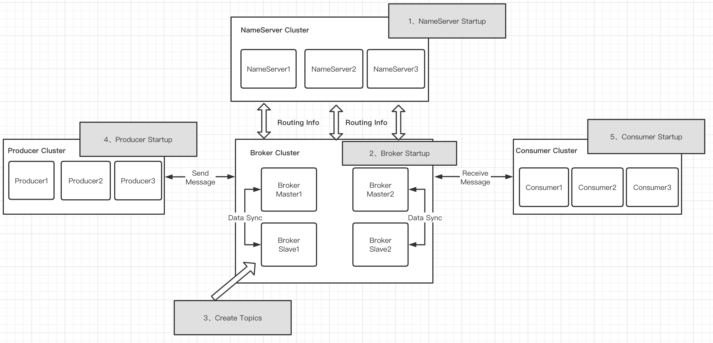
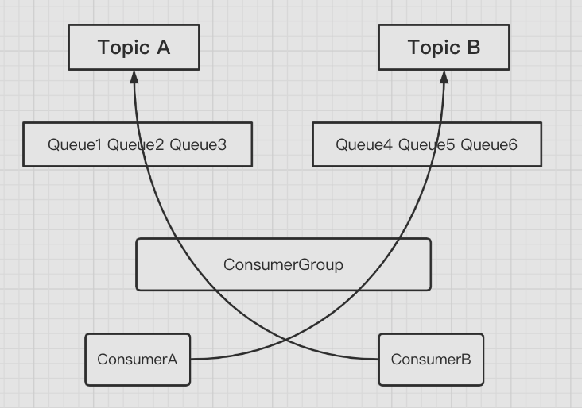
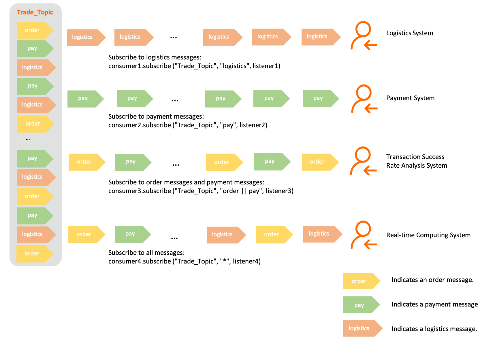
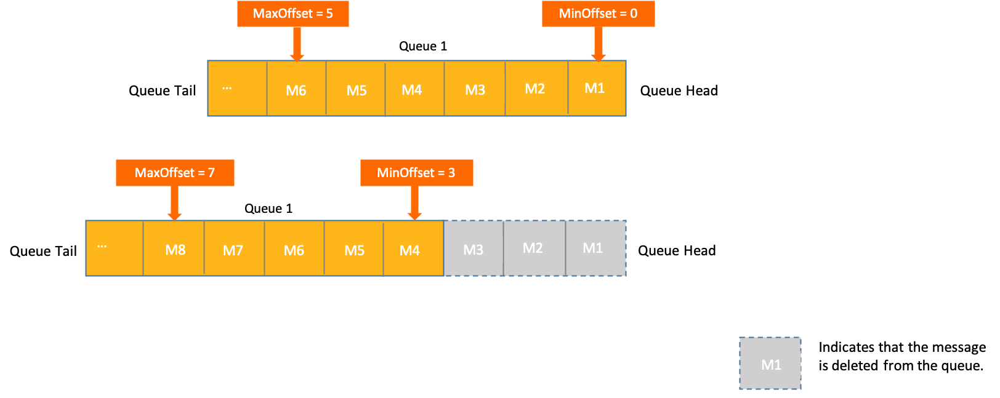
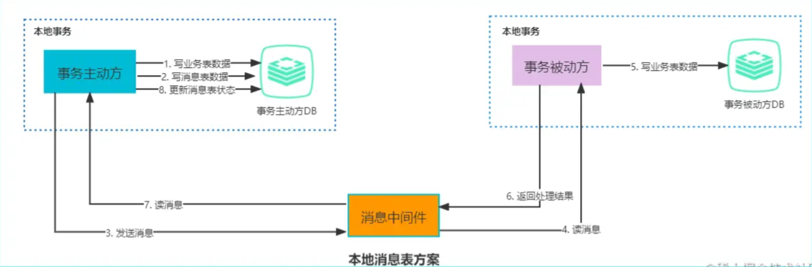
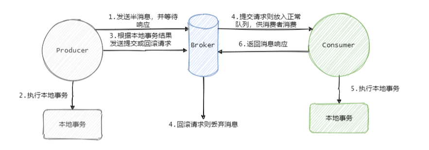
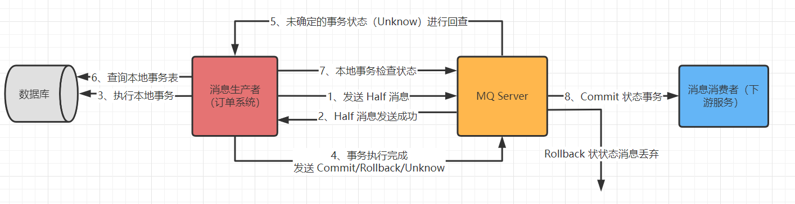

# RocketMQ

## 前言

*为何需要 MQ？它能帮助我们做什么？*

1、异步解耦，两个互相调用的系统之间解耦。

2、削峰，在系统遇到流量激增的情况下，消息队列可以将业务分散处理，保证系统的稳定性。

3、顺序收发，保证消息的 FIFO。

<br>

*引入 MQ 又会带来什么问题？*

1、系统可用性降低。外部依赖增加，一旦 MQ 宕机，就会对系统业务造成影响，要考虑高可用性。

2、系统复杂度提高。系统之间的远程调用从 RPC 变成了通过 MQ 进行异步调用。需要考虑消息是否被重复消费，怎么处理丢失消息，怎么保证消息传递的顺序性。

3、保证一致性问题。若是某个业务由多个系统一起完成，A 系统完成业务，通过 MQ 给 B、C、D 三个系统发送消息，如果 B 和 C 系统处理成功，D 系统处理失败，如何保证消息数据处理的一致性？此时就要考虑事务消息。

<br>

[RocketMQ 优势对比](https://juejin.cn/post/6844903511235231757)

[RocketMQ 与其他 MQ 的区别](https://juejin.cn/post/6844904170651172871)

<br>

## 开始

[下载](https://rocketmq.apache.org/dowloading/releases/)

[Quick Start](https://rocketmq.apache.org/docs/quick-start/)

<br>

**Windows 启动和关闭**

1、设置系统环境变量

2、设置系统环境变量

```
ROCKETMQ_HOME="rocketmq 解压目录"
NAMESRV_ADDR="localhost:9876"
```

3、启动 NameServer

```shell
.\bin\mqnamesrv.cmd
```

4、启动 Broker

```shell
.\bin\mqbroker.cmd -n localhost:9876 autoCreateTopicEnable=true
```

5、关闭服务，直接关闭命令窗口即可（先关闭 Broker，再关闭 NameServer）

<br>

**Linux 启动和关闭**

1、修改 `rocketmq/bin/runserver.sh` 和 `runbroker.sh` 设置合适的 JVM 参数。

```sh
# runserver.sh
JAVA_OPT="${JAVA_OPT} -server -Xms256m -Xmx256m -Xmn128m -XX:MetaspaceSize=128m -XX:MaxMetaspaceSize=320m"

# runbroker.sh
JAVA_OPT="${JAVA_OPT} -server -Xms256m -Xmx256m -Xmn128m"
```

2、启动 NameServer

```sh
# 以后台运行的方式启动 nameserver，需要注意带的是公网 IP，而不是 localhost
nohup sh bin/mqnamesrv -n 公网IP:9876 &
# 从日志查看是否成功启动，tial -f
# control+c 退出日志
tail -f ~/logs/rocketmqlogs/namesrv.log
```

4、启动 Broker

```sh
# 以后台运行的方式启动 broker，并连接到 nameserver
# 修改 conf/broker.conf，添加 brokerIP1=公网IP
nohup sh bin/mqbroker -n nameserver公网IP:9876 -c conf/broker.conf autoCreateTopicEnable=true &
# 查看是否启动成功
tail -f ~/logs/rocketmqlogs/broker.log 
```

5、关闭服务

```sh
# 先关闭 broker
sh bin/mqshutdown broker
# 再关闭 nameserver
sh bin/mqshutdown namesrv
```

<br>

测试消息发送与消费测试（Windows 为例）

```shell
# 发送
.\bin\tools.cmd org.apache.rocketmq.example.quickstart.Producer

# 消费
.\bin\tools.cmd  org.apache.rocketmq.example.quickstart.Consumer
```


<br>

## 基本概念

### 主要角色

RocketMQ 主要包含以下角色：

* NameServer，提供轻量级的服务发现和路由；
* Broker 负责存储消息；
* Producer 负责生产消息；
* Consumer 负责消费消息；
* Group，具有相同角色组成 Group，分为 *Producer Group* 和 *Consumer Group*。如果原生产者交易崩溃，Broker 可以联系同一个组的不同生产者进行提交或回退交易。




<br>

#### NameServer

命名服务。类似于注册中心（Zookeeper/Eureka），提供轻量级的服务发现和路由。主要进行 Broker 管理和路由信息管理，保存 Topic、消息队列等信息。

NameServer 接受来自 Broker 群集的注册，并提供检测信号机制以检查 Broker 是否还存在。多个 NameServer 实例组成集群。

> 集群中的 NameServer 节点之间相互独立，不会进行信息交换。

<br>

#### Broker

消息存储中心，接收来自生产者的消息并存储，提供给消费者读取。单个 Broker 节点与所有的 NameServer 节点保持长连接及心跳，并会定时将 Topic 信息注册到 NameServer。Broker 负责消息存储，以 Topic 为维度支持轻量级的队列。

<br>

#### 生产者

负责产生消息，并向 Broker 发送消息，发送过程支持快速失败并且延迟低。生产者支持分布式部署，分布式生产者通过多种负载平衡模式将消息发送到 Broker 集群。支持三种方式发送消息：同步、异步和单向。

<br>

#### 消费者

负责消费消息，消费者从 Broker 拉取信息。RocketMQ 的消费者支持**推/拉**模型，还支持集群使用和消息广播。


<br>

### 消息模型

**主题**（Topic）

负责消息存储（逻辑上），表示**消息的第一级类型**，是最细粒度的订阅单位。每个 Broker 定义多个 Topic，每个 Topic 中的消息也可以**分片**存储在不同 Broker 上。Topic 一般为领域范围，比如交易和物流，是两个不同的领域，可以分为两个 Topic。

> 一个消费者组可以订阅多个 Topic 的消息，同一个组中的消费者必须订阅相同的 Topic。（可以看下面的图理解）

<br>

***Message Queue***

消息队列，Topic 被划分为一个或多个消息队列。负责存储消息的物理地址。所有消息队列都是持久化的，消息队列的引入使得消息的存储可以分布式集群化，具有了水平扩展能力。相当于 Kafka 中的 Partition。

<br>

**标签**（Tag）

可以看作子主题，表示**消息的第二级类型**，可以使用相同的 Topic，不同的 Tag 来表示同一业务模块的不同任务的消息，比如交易消息又可以分为：交易创建消息，交易完成消息等。

<br>

**消息**（Message）

Message 必须包含一个 Topic，可选的 Tag。

<br>

> *注意：同一个消费者组的消费者必须具有完全相同的 Topic 订阅。
>
> 
>
> 因为 RocketMQ 中消息队列在分配消息的时候是以消费组为单位的，而组又会根据每个消费者的消费情况进行负载均衡消费分配，而不会在意消费者订阅了哪个主题。
>
> 假设存在 TopicA 和 TopicB，以及 ConsumerA 和 ConsumerB，ConsumerA 订阅 TopicB，ConsumerB 订阅 TopicA。当有 TopicA 或 TopicB 消息分发到消费者组时，消费者组不关注哪个消费者订阅了哪个 Topic，它只会将消息均匀分配给群组内的消费者。此时可能会将 TopicA 的消息分发给 ConsumerA，但是 ConsumerA 并没有订阅该主题，就可能会报错：*the consumer's subscription not exist*。


<br>

### 整体流程

1、启动 NameServer。等待 Broker/Producer/Consumer 连接。

2、启动 Broker，注册到每一个 NameServer。

注册成功后，NameServer 集群中就有 Topic 跟 Broker 的映射关系。Broker 跟所有的 NameServer 保持长连接，定时发送心跳包。心跳包中包含当前 Broker 信息（IP/端口等）以及存储所有 Topic 信息。

3、创建 Topic。

收发消息前先创建 Topic ，需要指定该 Topic 要存储在哪些 Broker上，也可以在发送消息时自动创建Topic。

4、Producer 生产消息。

Producer 启动后先跟 NameServer 集群中的其中一台建立长连接，并从 NameServer 中获取当前消息发送的 Topic 存在哪些 Broker 上。然后跟对应的 Broker 建立长连接，并定时向 Broker 定时发送心跳。

> Producer 可直接向 Broker 发消息，但是只能发送到 Broker 集群中的 Master。

5、Consumer 消费消息。

Consumer 启动后先跟其中一台 NameServer 建立长连接，获取当前订阅 Topic 存在哪些 Broker 上。然后直接跟 Broker 建立连接通道，开始消费消息。

> 与 Producer 不同：Consumer 可同时向 Broker 的 Master 和 Broker Slave 建立长连接，既可以从 Master 订阅消息，也可以向 Slave 订阅消息。


<br>

了解完 RocketMQ 的基本概念和整体流程，接下来开始上手操作

<br>

## 消息生产

> RocketMQ 生产者生产的消息分为：同步消息、异步消息和单向消息。

<br>

### 生产步骤

1. 创建生产者，指定生产者组；
2. 指定 NameServer；
3. 启动生产者；
4. 创建消息对象，设置主题 Topic、Tag 和消息体；
5. 发送消息。


<br>

**依赖**

```xml
<dependency>
    <groupId>org.apache.rocketmq</groupId>
    <artifactId>rocketmq-client</artifactId>
    <version>依赖版本需要和部署的 RocketMQ 版本一致</version>
</dependency>
```

<br>

### 同步消息

> 同步消息使用的较为广泛，如：重要的消息通知、短信。

```java
// 同步消息生产者
public class SyncProducer {
    public static void main(String[] args) throws MQClientException, MQBrokerException, RemotingException, InterruptedException {
        // 1、创建消息生产者 Producer，指定生产者组名
        DefaultMQProducer producer = new DefaultMQProducer("group_default");
        // 2、指定 NameServer 地址，集群使用分号隔开：mqhost1:9876;mqhost2:9876；mqhost3:9876
        producer.setNamesrvAddr("localhost:9876");
        // 3、启动 Producer
        producer.start();
        // 4、创建消息对象，指定主题 Topic、Tag 和消息体
        for (int i = 0; i < 10; i++) {
            
            /**
             * 创建消息对象
             * topic 消息主题
             * tags 消息Tag
             * body 消息内容
             */
            Message msg = new Message("topic_default","tag_default",  ("hello, this is msg for rocketmq." + i).getBytes(StandardCharsets.UTF_8));

            //  5、发送消息，超时时间 10000ms。最好加上超时时间，否则可能发送报错
            SendResult sendResult = producer.send(msg, 10000);
            System.out.println(sendResult.toString());

            TimeUnit.SECONDS.sleep(1);
        }
        // 6、关闭 Producer
        producer.shutdown();
    }
}
```

<br>

### 异步消息

> 异步消息通常用在对响应时间敏感的业务场景，发送不能容忍长时间的等待的消息。

```java
// 异步发送消息
producer.send(msg, new SendCallback() {
    // 发送成功回调函数
    @Override
    public void onSuccess(SendResult sendResult) {
        System.out.println(sendResult);
    }
    // 发送异常回调函数
    @Override
    public void onException(Throwable e) {
        System.out.println(e.getMessage());
    }
});
```

<br>

### 单向消息

> 适用于某些耗时非常短且不怎么关心消息发送结果的场景，例如日志收集。

```java
// 单向消息生产者
public class OnewayProducer {
    public static void main(String[] args) throws MQClientException, RemotingException, InterruptedException {
        // ...
      	// 发送单向消息
        producer.sendOneway(msg);
      	// ...
    }
}
```


<br>

### 负载均衡

生产者的负载均衡：先从 NameServer 获取关于 Broker 的路由信息，生产消息后通过轮询算法向不同队列投放消息，以达到负载均衡的效果。


<br>

## 消息消费

<br>

### 消费步骤

1. 创建消费者，指定消费者要消费的组名
2. 指定 NameServer 地址
3. 指定主题 Topic 和 Tag
4. 注册消息监听器，设置回调函数，处理消息
5. 启动消费者

<br>

### 推拉消费

**推拉消费模式**

* **Push**

  Push 模式是 **MQ 主动**推送信息，有信息就推送，但是可能会推送太多消息，导致消费者的消费速度跟不上推送速度

* **Pull**

  Pull 模式是**客户端主动**向 MQ 请求数据，主动权在客户端，取消息的过程需要自定义实现。先拉取数据再消费，不会因为推送太快而处理不及时

<br>

**两种模式的区别**

* 推模式指的是客户端与服务端建立长连接，服务端直接通过长连接通道推送到客户端。优点是及时，一旦有数据变更，客户端立马能感知到；

  推模式对客户端来说逻辑简单，不需要关心有无数据这些逻辑处理。缺点是不知道客户端的数据消费能力，可能导致数据积压在客户端，来不及处理。

* 拉模式指的是客户端主动向服务端发出请求，拉取相关数据。优点是此过程由客户端发起请求，不存在推模式中数据积压的问题。缺点是消息消费可能不够及时，对客户端来说需要考虑数据拉取相关逻辑，何时拉取，拉取的频率怎么控制等等。

  拉模式中，为了保证消息消费的实时性，采取了长轮询消息服务器拉取消息的方式。每隔一定时间，客户端向服务端发起一次请求，服务端有数据就返回数据，服务端如果此时没有数据，保持连接。等到有数据返回，或者超时返回。

  长轮询的好处是可以减少无效请求，保证消息的实时性，又不会造成客户端积压

<br>

**推拉消费者**

RocketMQ 的消费者被分为两类：MQPullConsumer 和 MQPushConsumer。**本质都是拉模式**，消费者轮询从 MQ 拉取消息。

* 拉模式消费者**主动从消息服务器拉取**信息，只要批量拉取到消息，消费者就会启动消费过程，所以 Pull 称为主动消费型
* 推模式消费者封装了消息的拉取、消费进度和其他的内部维护工作，将消息到达时执行的回调接口留给用户应用程序来实现，称为被动消费类型。但从实现上看，是从消息服务器中拉取消息，而且 Push 模式首先要注册消费监听器，当监听器处触发后才开始消费消息

<br>

### 消息消费粒度

* 队列维度：同一消费者分组内的多个消费者将按照队列粒度消费消息，即每个队列仅被一个消费者消费
* 消息维度：同一消费者分组内的多个消费者将按照消息粒度平均分摊主题中的所有消息，即同一个队列中的消息，可被平均分配给多个消费者共同消费

<br>

### 消费者分类

|              | PushConsumer                                                 | SimpleConsumer                                     | PullConsumer                                       |
| ------------ | ------------------------------------------------------------ | -------------------------------------------------- | -------------------------------------------------- |
| 实现方式     | 使用监听器回调接口返回消费结果，消费者仅允许在监听器范围内处理消费逻辑 | 业务方自行实现消息处理，并主动调用接口返回消费结果 | 业务方自行按队列拉取消息，并可选择性地提交消费结果 |
| 消费并发度   | 由服务端管理消费并发度                                       | 由业务方消费逻辑自行管理消费线程                   | 由业务方消费逻辑自行管理消费线程                   |
| 负载均衡粒度 | 5.0 版本是消息粒度，更均衡，早期版本是队列维度               | 消息粒度，更均衡                                   | 队列粒度，吞吐性能更好，但容易不均衡               |
| 接口灵活度   | 高度封装，不够灵活                                           | 原子接口，可灵活自定义                             | 原子接口，可灵活自定义                             |
| 适用场景     | 适用于无自定义流程的业务消息开发场景                         | 适用于需要高度自定义业务流程的业务开发场景         | 仅推荐在流处理框架场景下集成使用                   |

<br>

### 消费者负载均衡

> 多个消费者同时存在的情况下，默认为 CLUSTERING 模式

```java
public enum MessageModel {
    BROADCASTING("BROADCASTING"), // 广播模式
    CLUSTERING("CLUSTERING"); // 集群/负载均衡模式
}
```

<br>

**集群模式 CLUSTERING**

> 或称负载均衡模式，使用集群消费模式时，RocketMQ 认为任意一条消息只需要被集群内的任意一个消费者处理即可

```java
// 消息消费者
public class DefaultConsumer {
    public static void main(String[] args) throws MQClientException {
        // 1、创建消费者 Consumer，制定消费者组名
        DefaultMQPushConsumer consumer = new DefaultMQPushConsumer("group_default");
        // 2、指定 nameserver 地址
        consumer.setNamesrvAddr("localhost:9876");
        // 3、指定订阅的主题 topic 和 tag，若是多个 tag 使用 || 隔开，所有 tag 使用 * 号
        consumer.subscribe("topic_default", "");
        // 4、设置回调函数，处理消息
        // new MessageListenerOrderly 顺序消费，有序地使用消息意味着消息的消费顺序与生产者为每个消息队列发送消息的顺序相同
        // new MessageListenerConcurrently 并行消费，在此模式下不再保证消息顺序，消费的最大并行数量受每个消费者客户端指定的线程池限制。
        consumer.registerMessageListener(new MessageListenerConcurrently() {
            // 接收消息内容
            @Override
            public ConsumeConcurrentlyStatus consumeMessage(List<MessageExt> msgs, ConsumeConcurrentlyContext context) {
                for (MessageExt msg : msgs) {
                    System.out.println(new String(msg.getBody()));
                }
                return ConsumeConcurrentlyStatus.CONSUME_SUCCESS;
            }
        });
        // 5、启动消费者
        consumer.start();
    }
}
```

<br>

**广播模式 BROADCASTING**

> 当使用广播消费模式时，RocketMQ 会将每条消息推送给所有的消费者，保证消息至少被每个消费者消费一次

```java
// 设置消费模
consumer.setMessageModel(MessageModel.BROADCASTING);
```

<br>

### 消息过滤

> RocketMQ 的消息过滤功能通过生产者和消费者对消息的属性、标签进行定义，并在 RocketMQ 服务端根据过滤条件进行筛选匹配，将符合条件的消息投递给消费者进行消费


```java
// producer
Message message = new Message(SimpleMQConstant.TOPIC_DEFAULT, "tag_filter", ...);

// consumer
DefaultMQPushConsumer consumer = new DefaultMQPushConsumer(...);
consumer.subscribe("TOPIC", "tagA || tagB || tagC");
```

<br>

**使用场景**

电商交易场景为例，从客户下单到收到商品这一过程会生产一系列消息：

- 订单消息
- 支付消息
- 物流消息

这些消息会发送到名称为 Trade_Topic 的 Topic 中，被各个不同的下游系统所订阅：

- 支付系统：订阅支付消息
- 物流系统：订阅物流消息
- 交易成功率分析系统：需订阅订单和支付消息
- 实时计算系统：需要订阅所有和交易相关的消息



<br>

**Tag 使用事项**

* Tag 由生产者发送消息时设置，每条消息允许设置一个 Tag 标签；
* Tag 使用可见字符，建议长度不超过 128 个字符

<br>

**Tag 匹配规则**

* 单 Tag 精确匹配
* 多 Tag 匹配，使用两个竖线（||）隔开，例如 Tag1||Tag2||Tag3
* 全部匹配，使用星号（*）作为全匹配表达式


> [SQL 属性过滤](https://rocketmq.apache.org/zh/docs/featureBehavior/07messagefilter#sql%E5%B1%9E%E6%80%A7%E8%BF%87%E6%BB%A4)


<br>

### 消费顺序

* **Orderly 顺序消费**，有序地消费消息，消息的消费顺序与生产者发送消息的顺序相同；

  ```java
  public interface MessageListenerOrderly extends MessageListener {}
  ```

* **Concurrently 并行消费**，不保证消息顺序，消费的最大并行数量受每个消费者客户端指定的线程池限制。

  ```java
  public interface MessageListenerConcurrently extends MessageListener {}
  ```

  

<br>

### 消费进度

在 RocketMQ 中，所有消息队列都是持久化，长度无限的数据结构。长度无限是指队列中的每个存储单元都是定长，访问存储单元可以使用 Offset 来访问。也可以认为消息队列是一个长度无限的数组，Offset 就是下标，Offset 为 64 位的 Java Long 类型。

消息是按到达服务端的先后顺序存储在指定主题的多个队列中，每条消息在队列中都有一个唯一的 Long 类型坐标，这个坐标被定义为消息位点。任意一个消息队列在逻辑上都是无限存储，即消息位点会从 0 到 `Long.MAX` 无限增加。通过主题、队列和位点就可以定位任意一条消息的位置。


RocketMQ 定义队列中最早一条消息的位点为最小消息位点（MinOffset）；最新一条消息的位点为最大消息位点（MaxOffset）。虽然消息队列逻辑上是无限存储，但由于服务端物理节点的存储空间有限，RocketMQ 会滚动删除队列中存储最早的消息。因此，消息的最小消费位点和最大消费位点会一直递增变化。



**消费点位**

RocketMQ 领域模型为发布订阅模式，每个主题的队列都可以被多个消费者分组订阅。若某条消息被某个消费者消费后直接被删除，则其他订阅了该主题的消费者将无法消费该消息。

RocketMQ 通过消费位点管理消息的消费进度。每条消息被某个消费者消费完成后不会立即在队列中删除，RocketMQ 会基于每个消费者分组维护一份消费记录，该记录指定消费者分组消费某一个队列时，消费过的最新一条消息的位点，即消费位点。

> 消息消费完成后不马上删除消息是为了后续可以进行消息的回溯消费。

当消费者客户端离线，又再次重新上线时，会严格按照服务端保存的消费进度继续处理消息。如果服务端保存的历史位点信息已过期被删除，此时消费位点向前移动至服务端存储的最小位点。

> 消费位点的保存和恢复是基于 RocketMQ 服务端的存储实现，和任何消费者无关。因此 RocketMQ 支持跨消费者的消费进度恢复。

队列中消息位点 MinOffset、MaxOffset 和每个消费者分组的消费位点 ConsumerOffset 的关系如下：


**消费位点初始值**

消费位点初始值指的是首次启动消费者时，服务端保存的消费位点的初始值。RocketMQ 定义消费位点的初始值为消费者首次获取消息时最大的消息位点，相当于消费者将从队列中最新的消息开始消费。

**重置消费点位**

* 初始消费位点不符合需求：因初始消费位点为当前队列的最大消息位点，即客户端会直接从最新消息开始消费。若业务上线时需要消费部分历史消息，可以通过重置消费位点功能消费到指定时刻前的消息；
* 消费堆积快速清理：当下游消费系统性能不足或消费速度小于生产速度时，会产生大量堆积消息。若这部分堆积消息可以丢弃，可以通过重置消费位点快速将消费位点更新到指定位置，绕过这部分堆积的消息，减少下游处理压力；
* 业务回溯，纠正处理：由于业务消费逻辑出现异常，消息被错误处理。若希望重新消费已被处理的消息，可以通过重置消费位点快速将消费位点更新到历史指定位置，实现消费回溯。


<br>

### 回溯消费

回溯消费是指消费者已经消费成功的消息，由于业务上需求需要重新消费。

在 RocketMQ 在向消费者投递消息成功后，**消息仍会保留**，并且重新消费一般是按照时间维度。例如由于消费者系统故障，恢复后需要重新消费 1 小时前的数据，那么 Broker 要提供一种机制，可以按照时间维度来回退消费进度。


<br>

### 消息堆积

消息堆积意味着生产者发送的消息太多，消费者处理不过来。可以对生产者端服务进行限流，也可以增加多个消费者来进行消费。堆积问题排查可以从消费者入手，查看是否是消费者出现消费错误，或者某个线程消费过程中产生了死锁等。


<br>

### 重复消费

RocketMQ 不保证消息不重复，如果需要保证严格的不重复消息，需要在业务端去重

1、消费端处理消息的业务逻辑保持幂等性

2、保证每条消息都有唯一编号且保证消息处理成功与去重表的日志同时出现


<br>

### 消费重试

消费重试指的是，消费者在消费某条消息失败后，RocketMQ 会根据重试策略重新消费该消息，超过一次定数后若还未消费成功，则该消息将不再继续重试，直接被发送到死信队列中。

**触发条件**

* 消费失败，包括消费者返回消息失败状态标识或抛出非预期异常
* 消息处理超时，包括在 PushConsumer 中排队超时

**重试策略**

* 重试过程状态机：控制消息在重试流程中的状态和变化逻辑
* 重试间隔：上一次消费失败或超时后，下次重新尝试消费的间隔时间
* 最大重试次数：消息可被重试消费的最大次数

**最大重试次数**

例如，最大重试次数为 3 次，则该消息最多可被投递 4 次，1 次为原始消息，3 次为重试投递次数。


<br>

### 消费速度慢

* 提高消费并行度。同一个 ConsumerGroup 下，通过增加 Consumer 实例数量来提高并行度；提高单个 Consumer 的消费并行线程，PushConsumer 为例 `PushConsumerBuilder.setConsumptionThreadCount()` 设置线程数
* 批量消费
* 重置消息点位，跳过非重要消息。发生消息堆积时，如果消费速度一直追不上发送速度，如果业务对数据要求不高的话，可以选择丢弃不重要的消息
* 优化业务系统中消息的消费逻辑


<br>

### 消息丢失

> [RocketMQ 如何防止消息丢失？](https://juejin.cn/post/7039959533707329566)


<br>

## 消息类型

<br>

### 普通消息

> 普通消息一般应用于微服务解耦、事件驱动、数据集成等场景，这些场景大多数要求数据传输通道具有可靠传输的能力，且对消息的处理时机、处理顺序没有特别要求。

**使用场景**

* 服务解耦
* 数据传输

<br>

**生命周期**

* 初始化：消息被生产者构建并完成初始化，待发送到服务端；
* 待消费：消息被发送到服务端，对消费者可见，等待消费者消费；
* 消费中：消息被消费者获取，并按照消费者本地的业务逻辑进行处理的过程。此时服务端会等待消费者完成消费并提交消费结果，如果一定时间后没有收到消费者的响应，RocketMQ 会对消息进行重试处理；
* 消费提交：消费者完成消费处理，并向服务端提交消费结果，服务端标记当前消息已经被处理（包括消费成功和失败）。 RocketMQ 默认支持保留所有消息，此时消息数据并不会立即被删除，只是逻辑标记已消费。消息在保存时间到期或存储空间不足被删除前，消费者仍然可以回溯消息重新消费；
* 消息删除：RocketMQ 按照消息保存机制滚动清理最早的消息数据，将消息从物理文件中删除。


<br>

### 定时/延时消息

> 定时消息是 RocketMQ 提供的一种高级消息类型，消息被发送至服务端后，在指定时间后才能被消费者消费。通过设置一定的定时时间可以实现分布式场景的延时调度触发效果。

**使用场景**

* 分布式定时调度
* 任务超时处理


**生命周期**

- 初始化
- **定时中**：**消息被发送到服务端，和普通消息不同的是，服务端不会直接构建消息索引，而是会将定时消息单独存储在定时存储系统中，等待定时时刻到达**；
- 待消费：定时时刻到达后，服务端将消息重新写入普通存储引擎，对下游消费者可见，等待消费者消费的状态；
- 消费中
- 消费提交
- 消息删除


> 在电商项目中，提交了一个订单之后发送指定时间的延时消息，等到指定时间之后检查订单状态，若是未付款就取消订单，释放库存

```java
// org/apache/rocketmq/store/config/MessageStoreConfig.java 共 18 个级别
// private String messageDelayLevel = "1s 5s 10s 30s 1m 2m 3m 4m 5m 6m 7m 8m 9m 10m 20m 30m 1h 2h";

// rocketmq 仅支持几个固定的延时的时间，3 对应 10s
msg.setDelayTimeLevel(3);
```


<br>

### 顺序消息

> 消息有序是指可以按照消息发送的顺序来消费，即 `FIFO` 消费。RocketMQ 可以严格的保证消息有序，可以分为分区有序或者全局有序。

在默认情况下，消息发送会采取轮询方式把消息发送到不同的消息队列，消费的时候从多个队列拉取消息，这种情况下发送和消费是不能保证顺序的。

如果控制发送的顺序，消息依次发送到同一个队列中，消费的时候该队列上依次拉取，这样就可以保证消息的有序消费。

当参与发送和消费的消息队列只有一个，则是**全局有序**；如果有多个消息队列参与，则是**分区有序**，即相对某个队列，消息都是有序的。

<br>

**使用场景**

* 有序事件处理
* 撮合交易
* 数据实时增量同步

<br>

**生命周期**

- 初始化
- 待消费：消息被发送到服务端，对消费者可见，等待消费者消费的状态；
- 消费中
- 消费提交
- 消息删除

<br>

**使用限制**

* 顺序消息仅支持使用 MessageType 为 FIFO 的主题

<br>

**实现**

```java
// OrderStep 订单步骤实体类
@Data
@NoArgsConstructor
@AllArgsConstructor
public class OrderStep {
    private long orderId;
    private String desc;

    public static List<OrderStep> buildOrders() {
        List<OrderStep> orderSteps = new ArrayList<>();

        OrderStep orderStep = null;

        // 1100L create payment push done
        // 2200L create payment
        // 3300L create payment

        orderStep = new OrderStep(1100L, "create");
        orderSteps.add(orderStep);

        orderStep = new OrderStep(2200L, "create");
        orderSteps.add(orderStep);

        orderStep = new OrderStep(1100L, "payment");
        orderSteps.add(orderStep);

        orderStep = new OrderStep(3300, "create");
        orderSteps.add(orderStep);

        orderStep = new OrderStep(1100L, "push");
        orderSteps.add(orderStep);

        orderStep = new OrderStep(2200L, "payment");
        orderSteps.add(orderStep);

        orderStep = new OrderStep(1100L, "done");
        orderSteps.add(orderStep);

        return orderSteps;
    }
}
```

```java
// OrderProducer 顺序消息生产
public class OrderProducer {
    public static void main(String[] args) throws MQClientException, MQBrokerException, RemotingException, InterruptedException {
        DefaultMQProducer producer = new DefaultMQProducer("group_default_order");
        producer.setNamesrvAddr("localhost:9876");
        producer.start();

        // 构建数据
        List<OrderStep> orderSteps = OrderStep.buildOrders();

        // 发送消息
        for (OrderStep order : orderSteps) {
            Message msg = new Message("topic_default_order", "tag_default_order", order.toString().getBytes(StandardCharsets.UTF_8));

            /**
             * Message msg 消息对象
             * MessageQueueSelector selector 消息队列的选择器
             * Object arg 消息队列的业务标识（订单ID）
             */
            SendResult sendResult = producer.send(msg, new MessageQueueSelector() {
                @Override
                public MessageQueue select(List<MessageQueue> mqs, Message msg, Object arg) {
                    // 根据订单ID选择对应的 Queue
                    // 就能将同一个订单消息发送到唯一的一个 Queue
                    // 从而保证消费者消费的顺序性
                    long orderId = (long) arg;
                    long queueIndex = orderId % mqs.size();
                    return mqs.get((int) queueIndex);
                }
            }, order.getOrderId(), 10000);

            System.out.println(sendResult);
        }

        producer.shutdown();

    }
}
```


<br>

### 批量消息

> 批量发送消息能显著提高传递小消息的性能。限制是这些批量消息应该有相同的 Topic，相同的 `waitStoreMsgOK`，而且不能是延时消息。此外，一批消息的总大小不应超过 4 MB。

**发送批量消息**

```java
List<Message> messageList = new ArrayList<>();
for (int i = 1; i <= 10; i++) {
    Message msg = new Message("topic_default_batch", "tag_default_batch", ("hello, this is msg from batch producer. NO." + i).getBytes(StandardCharsets.UTF_8));
    messageList.add(msg);
}

producer.send(messageList, 10000);
```


**消息列表分割**

> 不确定消息是否超过了大小限制（4 MB），最好把消息列表分割一下

```java
public class ListSplitter implements Iterator<List<Message>> { 
    private final int SIZE_LIMIT = 1024 * 1024 * 4;
    private final List<Message> messages;
    private int currIndex;
    public ListSplitter(List<Message> messages) { 
        this.messages = messages;
    }
    @Override 
    public boolean hasNext() {
        return currIndex < messages.size(); 
    }
    @Override 
    public List<Message> next() { 
        int startIndex = getStartIndex();
        int nextIndex = startIndex;
        int totalSize = 0;
        for (; nextIndex < messages.size(); nextIndex++) {
            Message message = messages.get(nextIndex); 
            int tmpSize = calcMessageSize(message);
            if (tmpSize + totalSize > SIZE_LIMIT) {
                break; 
            } else {
                totalSize += tmpSize; 
            }
        }
        List<Message> subList = messages.subList(startIndex, nextIndex); 
        currIndex = nextIndex;
        return subList;
    }
    private int getStartIndex() {
        Message currMessage = messages.get(currIndex); 
        int tmpSize = calcMessageSize(currMessage); 
        while(tmpSize > SIZE_LIMIT) {
            currIndex += 1;
            Message message = messages.get(curIndex); 
            tmpSize = calcMessageSize(message);
        }
        return currIndex; 
    }
    private int calcMessageSize(Message message) {
        int tmpSize = message.getTopic().length() + message.getBody().length(); 
        Map<String, String> properties = message.getProperties();
        for (Map.Entry<String, String> entry : properties.entrySet()) {
            tmpSize += entry.getKey().length() + entry.getValue().length(); 
        }
        tmpSize = tmpSize + 20; // 增加日志的开销 20 字节
        return tmpSize; 
    }
}
// 把大的消息分裂成若干个小的消息
ListSplitter splitter = new ListSplitter(messages);
while (splitter.hasNext()) {
  try {
      List<Message>  listItem = splitter.next();
      producer.send(listItem);
  } catch (Exception e) {
      e.printStackTrace();
      // 处理error
  }
}
```


<br>

### 事务消息

<br>

#### 分布式事务

> 事务的参与者、资源服务器以及事务管理器分别位于分布式系统的不同节点上，因此称为分布式事务。事务操作分布在不同的服务器上，且属于不同的应用，分布式事务需要保证这些小操作要么全部成功，要么全部失败。本质上来说，分布式事务就是为了保证不同数据库的数据一致性。比如微服务电商交易、跨行转账等。
>
> 
>分布式事务的实现方式有很多，可以采用 InnoDB 提供的原生的事务支持（XA 事务协议），也可以采用消息队列来实现分布式事务的最终一致性。

<br>

##### CAP 理论

不同于本地事务的 ACID 特性，分布式事务主要特性为 CAP：

* C（一致性）

  分布式系统中，要保证某个节点更新了数据之后，其他节点都能读取到这个最新的数据。如果有某个节点没有读取到，那就是分布式不一致。

* A（可用性）

  非故障的节点在合理的时间内返回合理的响应（不是错误和超时的响应）。可用性的关键：合理的时间；合理的响应。

  合理的时间指的是请求不能无限被阻塞，应该在合理的时间返回；合理的响应指的是请求应该得到明确并正确的返回结果，这里的正确指的是应该返回 200，而不是返回 404。

* P（分区容错性）

  在一个服务集群中，有一个服务网络出现了问题，要保证该集群仍然能正常工作。

<br>

**CAP 如何选择？**

在分布式系统中，分区（服务集群）肯定存在，因此必定需要满足 P。此外，网络环境不是 100% 可靠的，此时就需要在 A 和 C 之间进行选择：

* 如果需要保证高可用，就需要适当削弱一致性；
* 如果要保证一致性，就需要适当削弱可用性。

注意，这里用的是“削弱”，而不是“放弃”，还是需要使用一些别的手段来保证 A 或者 C 的。比如，使用快速失败/响应机制来保证 A；使用日志等手段来保证 C。

CAP 三者不能同时存在，只能满足 AP 或者 CP 原则：

* 对于 CP 来说，就是追求强一致性和分区容错性；
* 对于 AP 来说，就是追求分区容错性和可用性，AP 是很多分布式系统设计时的选择。

<br>

##### BASE 理论

BASE 是 *Basically Available*（基本可用）、*Soft state*（软状态）和 *Eventually consistent* （最终一致性）三个短语的缩写，是对 CAP 中 AP 的一个扩展。

* 基本可用，分布式系统在出现故障时，允许损失部分可用功能，保证核心功能可用
* 软状态，允许系统中存在中间状态，这个状态不影响系统可用性，这里指的是 CAP 中的不一致
* 最终一致性，最终一致是指经过一段时间后，所有节点数据都将会达到一致

BASE 和 ACID 是相反的，它完全不同于 ACID 的强一致性模型，而是通过牺牲强一致性来获得可用性，并允许数据在一段时间内是不一致的，但最终达到一致状态。

<br>

##### 2PC

> 两段提交（2PC）是基于 XA 协议实现的分布式事务。

> 2PC 分为两个阶段：**准备和提交**。
>
> * 准备阶段：事务协调者给每个事务参与者发送准备命令，每个参与者收到命令之后执行相关事务操作。可以认为除了事务的提交，其他关于事务的操作都做了。每个参与者会返回响应告知协调者自己是否准备成功。
>
>   在 2PC 中事务协调者有超时机制，若是事务协调者在第一阶段未收到个别参与者的响应，等待一定时间后就会认为事务失败，会发送回滚命令。
>
> * 提交阶段：协调者根据收集的响应，如果有参与者响应准备失败，那么协调者就向所有参与者发送回滚命令，反之发送提交命令。

> **优点**：2PC 对业务侵⼊很小，可以像使⽤本地事务⼀样使⽤基于 XA 协议的分布式事务，能够严格保障事务 ACID 特性。
>
> **缺点**
>
> * 2PC 是一个强一致性的**同步阻塞**协议，事务执⾏过程中需要将所需资源全部锁定，比较适⽤于执⾏时间确定的短事务。
> * **单点故障问题**，一旦事务协调者出现故障，事务参与者会一直处于锁定资源的状态。
> * 或者只有一部分参与者提交成功，导致**数据不一致**。

<br>

##### 3PC

> **三段提交**是 2PC 的一种改进版本。2PC 当协调者崩溃时，参与者不能做出最后的选择，就会一直保持阻塞锁定资源。
>
> 为解决两阶段提交协议的阻塞问题：3PC 在协调者和参与者中都引入了超时机制，协调者出现故障后，参与者不会一直阻塞。而且在第一阶段和第二阶段中又插入了一个预提交阶段，保证了在最后提交阶段之前各参与节点的状态是一致的。

> 3PC 分为三个阶段：**准备、预提交和提交**
>
> * 准备阶段：协调者会先检查参与者是否能接受事务请求进行事务操作。如果参与者全部响应成功则进入下一阶段。
>
> * 预提交阶段：协调者向所有参与者发送预提交命令，询问是否可以进行事务的预提交操作。参与者接收到预提交请求后，如果成功的执行了事务操作，则返回成功响应，进入最终提交阶段；如果有参与者中有向协调者发送了失败响应，或因网络造成超时，协调者没有收到该参与者的响应，协调者会向所有参与者发送 `abort` 命令，参与者收到 `abort` 命令后中断事务的执行。
>
> * 提交阶段：如果前两个阶段中所有参与者的响应反馈均是 YES，协调者向所有参与者发送提交命令正式提交事务，如协调者没有接收到参与者发送的 ACK 响应，会向所有参与者发送 `abort` 命令，执行事务的中断。

> 虽然 3PC 用超时机制解决了协调者故障后参与者的阻塞问题，但也多了一次网络通信，性能上反而变得更差。
>

<br>

##### TCC

> TCC（*Try Confirm Cancel*）又称**补偿事务**，与 2PC 相似，事务处理流程也很相似，但 2PC 是应用于在数据库层面，TCC 则可以理解为在应用层面的 2PC，需要自定义编写业务逻辑来实现。
>
> TCC 核心思想是：**针对每个操作（Try）都要注册一个与其对应的确认（Confirm）和补偿（Cancel）**。

> **TCC 流程**
>
> TCC 的实现分为**两个阶段**，需要在业务层面需要写对应的**三个方法**（Try、Confirm、Cancel），主要用于处理跨数据库、跨服务的业务操作的数据一致性问题。
>
> * 第一阶段是 Try，负责**资源检查和预留**，完成所有业务检查（一致性），预留必须业务资源（准隔离性）；
>
> * 第二阶段是 Confirm 或 Cancel。Confirm 执行真正的业务操作，Cancel 执行预留资源的取消，回滚到初始状态。以下单扣库存为例，Try 阶段去占库存，Confirm 阶段则实际扣库存，如果库存扣减失败 Cancel 阶段进行回滚，释放库存。

> **TCC 注意点**
>
> * **幂等问题**，因为网络调用无法保证请求一定能到达，所以都会有重调机制，因此对于 Try、Confirm、Cancel 三个方法都需要幂等实现，避免重复执行产生错误；
> * **空回滚问题**，指的是 Try 方法由于网络问题超时了，此时事务管理器就会发出 Cancel 命令，那么需要支持在未执行 Try 的情况下能正常的 Cancel；
> * **悬挂问题**，指 Try 方法由于网络阻塞超时触发了事务管理器发出了 Cancel 命令，**但是执行了 Cancel 命令之后 Try 请求到了**。对于事务管理器来说这时候事务已经是结束了的，到达的 Try 操作就被**悬挂**了，所以空回滚之后还需要将操作记录，防止 Try 的再调用。

> **TCC 优缺点**
>
> TCC **不存在资源阻塞的问题**，因为每个方法都直接进行事务的提交，一旦出现异常通过则 Cancel 来进行回滚补偿，这也就是常说的补偿性事务。
>
> TCC **对业务的侵入性很强**，需要三个方法来支持，而且这种模式并不能很好地被复用。还要考虑到网络波动等原因，为保证请求一定送达都会有重试机制。
>
> TCC 适用于一些强隔离性和强一致性，并且执行时间较短的业务。

<br>

##### 本地消息表

> 本地消息就是利用了**本地事务**，在数据库中存放一个本地事务消息表，在进行本地事务操作时加入了本地消息的插入，**业务执行和消息放入消息表这两个操作放在同一个事务中提交**。
>
> 本地事务执行成功，消息也插入成功。然后再调用其他服务，如果调用成功就修改本地消息的状态。**核心思路是将分布式事务拆分成本地事务进行处理，并通过消息的方式来异步执行。**
>
> 通过在事务发起方新建事务消息表，事务发起方处理业务和记录事务消息在本地事务中完成，轮询事务消息表的数据发送事务消息，事务被动方基于消息中间件消费事务消息表中的事务。这样可以避免以下两种情况导致的数据不一致性：业务处理成功、事务消息发送失败；业务处理失败、事务消息发送成功。

<br>

**整体流程**



> **流程中必要的容错处理**
>
> * 步骤 1 出错，由于在处理的是本地事务，直接本地回滚即可
> * 步骤 2 或 3 出错，由于事务主动方本地保存了消息，只需要轮询失败的消息，重新通过消息中间件发送，事务被动方重新读取消息处理业务即可
> * 事务被动方业务上处理失败，事务被动方可以发消息给事务主动方回滚事务
> * 如果事务被动方已经消费了消息，事务主动方需要回滚事务的话，需要发消息通知事务主动方进行回滚事务

> **消息事务优缺点**
>
> 从应用设计开发的角度实现了消息数据的可靠性，消息数据的可靠性不依赖于消息中间件，弱化了对 MQ 中间件特性的依赖。并且方案轻量，容易实现。
>
> 但消息数据与业务数据同库，占用业务系统资源。与具体的业务场景绑定，耦合性强，不可公用。业务系统在使用关系型数据库的情况下，消息服务性能会受到关系型数据库并发性能的局限。


<br>

#### RocketMQ 事务消息

> 分布式事务消息（确保数据的最终一致性，大量引入 MQ 的分布式事务，既可以实现系统之间的解耦，又可以保证最终的数据一致性，减少系统间的交互）

RocketMQ 的事务消息也可以认为是两阶段提交。

在事务开始的时候会先发送一个半消息（Half）给 Broker。半消息对消费者是不可见的，也不是保存在要发送的队列中，而是一个特殊队列。发送完半消息之后执行本地事务，再根据本地事务的执行结果来决定是向 Broker 发送提交消息，还是发送回滚消息。

如果发送**提交或者回滚**消息失败，Broker 会定时的向生产者回查这个事务是否成功。具体的生产者只需要暴露一个接口，通过这个接口 Broker 就可以知道事务执行的状态。

如果没成功就返回未知，因为有可能事务还在执行，会进行多次查询；如果成功，就将半消息恢复到正常要发送的队列中，消费者就可以消费这条消息了。




**事务消息状态**

- 提交，`LocalTransactionState.COMMIT_MESSAGE`，提交事务，它允许消费者消费此消息；
- 回滚，`LocalTransactionState.ROLLBACK_MESSAGE`，回滚事务，它代表该消息将被删除，不允许被消费；
- 中间状态，`LocalTransactionState.UNKNOW`，中间状态，它代表需要检查（回查）消息队列来确定状态。

<br>

**事务消息投递流程**



1. 生产者将消息发送至 RocketMQ 服务端，RocketMQ 服务端将消息持久化成功之后，向生产者返回 Ack 确认消息已经发送成功，此时消息被标记为"暂不能投递"，这种状态下的消息即为半事务消息；
3. 生产者开始执行本地事务逻辑；
4. 生产者根据本地事务执行结果向服务端提交二次确认结果（Commit 或 Rollback），服务端收到确认结果后处理逻辑如下：
   - 二次确认结果为 Commit：服务端将半事务消息标记为可投递，并投递给消费者；
   - 二次确认结果为 Rollback：服务端将回滚事务，不会将半事务消息投递给消费者。
5. 若服务端未收到发送者提交的二次确认结果，或服务端收到的二次确认结果为 Unknown 未知状态，经过固定时间后，服务端将对生产者发起消息回查；
6. 生产者收到消息回查后，检查对应事务执行的最终结果；
7. 生产者根据检查到的本地事务的最终状态再次提交二次确认，服务端仍按照步骤4对半事务消息进行处理。

<br>

**事务消息生命周期**


- 初始化：半事务消息被生产者构建并完成初始化，待发送到服务端的状态；
- 事务待提交：半事务消息被发送到服务端，和普通消息不同，并不会直接被服务端持久化，而是会被单独存储到事务存储系统中，等待第二阶段本地事务返回执行结果后再提交。此时消息对下游消费者不可见；
- 消息回滚：第二阶段如果事务执行结果明确为回滚，服务端会将半事务消息回滚，该事务消息流程终止；
- 提交待消费：第二阶段如果事务执行结果明确为提交，服务端会将半事务消息重新存储到普通存储系统中，此时消息对下游消费者可见，等待被消费者获取并消费；
- 消费中：消息被消费者获取，并按照消费者本地的业务逻辑进行处理的过程。 此时服务端会等待消费者完成消费并提交消费结果，如果一定时间后没有收到消费者的响应，RocketMQ 会对消息进行重试处理；
- 消费提交：消费者完成消费处理，并向服务端提交消费结果，服务端标记当前消息已经被处理（包括消费成功和失败）。RocketMQ 默认支持保留所有消息，此时消息数据并不会立即被删除，只是逻辑标记已消费。消息在保存时间到期或存储空间不足被删除前，消费者仍然可以回溯消息重新消费；
- 消息删除：RocketMQ 按照消息保存机制滚动清理最早的消息数据，将消息从物理文件中删除。

<br>

**使用限制**

* 事务消息仅支持在 MessageType 为 Transaction 的主题内使用；
* 事务消息保证本地主分支事务和下游消息发送事务的一致性，但不保证消息消费结果和上游事务的一致性。需要下游业务分支自行保证消息正确处理，建议消费端做好[消费重试](https://rocketmq.apache.org/zh/docs/featureBehavior/10consumerretrypolicy)；
* 事务消息为最终一致性，即在消息提交到下游消费端处理完成之前，下游分支和上游事务之间的状态会不一致；
* 事务消息的命周期存在超时机制，即半事务消息被生产者发送服务端后，如果在指定时间内服务端无法确认提交或者回滚状态，则消息默认会被回滚。

<br>

**使用注意**

* **避免大量未决事务导致超时**

  RocketMQ 支持在事务提交阶段异常的情况下发起事务回查，保证事务一致性。但生产者应该尽量避免本地事务返回未知结果。大量的事务检查会导致系统性能受损，容易导致事务处理延迟。

* **正确处理"进行中"的事务**

  消息回查时，对于正在进行中的事务不要返回 Rollback 或 Commit 结果，应继续保持 Unknown 的状态。 一般出现消息回查时事务正在处理的原因为：事务执行较慢，消息回查太快。解决方案如下：一、将第一次事务回查时间设置较大一些，但可能导致依赖回查的事务提交延迟较大；二、程序能正确识别正在进行中的事务。

<br>

**发送事务消息**

1、实现事务监听端口

```java
// 事务消息监听器
public class TransactionListenerImpl implements TransactionListener {

    // 全局事务标识
    private AtomicInteger transIndex = new AtomicInteger(0);
    // 本地事务表
    private ConcurrentHashMap<String, Integer> localTransMap = new ConcurrentHashMap<>();

    /**
     * 执行本地事务，并根据事务执行结果返回不同状态
     */
    @Override
    public LocalTransactionState executeLocalTransaction(Message msg, Object arg) {

        // 执行本地事务操作
        double r = Math.random() * 10;
        System.out.println("********************");
        System.out.println("开始执行本地事务");

        int index = transIndex.getAndIncrement();
        int status = index % 3;
        String transactionId = msg.getTransactionId();
        localTransMap.put(transactionId, status);

        if (r < 3) {
            System.out.println("本地事务执行完成，返回状态： UNKNOW");
            System.out.println("更新本地消息表，Id为 " + transactionId);
            localTransMap.put(transactionId, 0);
            return LocalTransactionState.UNKNOW;
        } else if( r > 3 && r < 6) {
            System.out.println("本地事务执行完成，返回状态： COMMIT_MESSAGE");
            System.out.println("更新本地消息表，Id为 " + transactionId);
            localTransMap.put(transactionId, 1);
            return LocalTransactionState.COMMIT_MESSAGE;
        } else {
            System.out.println("本地事务执行完成，返回状态： ROLLBACK_MESSAGE");
            System.out.println("更新本地消息表，Id为 " + transactionId);
            localTransMap.put(transactionId, 2);
            return LocalTransactionState.ROLLBACK_MESSAGE;

        }
    }

    /**
     * 检查本地事务状态，并回复消息队列（Message Queue）的事务状态检查请求
     */
    @Override
    public LocalTransactionState checkLocalTransaction(MessageExt msg) {
        System.out.println("********************");
        String transactionId = msg.getTransactionId();
        System.out.println("Id为 " + transactionId + " 的事务消息状态不确定，回查本地事务表...");
        Integer status = localTransMap.get(msg.getTransactionId());
        if (null != status) {
            switch (status) {
                case 0:
                    return LocalTransactionState.UNKNOW;
                case 1:
                    return LocalTransactionState.COMMIT_MESSAGE;
                case 2:
                    return LocalTransactionState.ROLLBACK_MESSAGE;
            }
        }
        return LocalTransactionState.COMMIT_MESSAGE;
    }
}

```

<br>

2、创建事务消息生产者

```java
// 事务消息生产者
public class TransactionProducer {
    public static void main(String[] args) {
        TransactionListenerImpl listener = new TransactionListenerImpl();
        TransactionMQProducer producer = new TransactionMQProducer("gp_default");
        producer.setNamesrvAddr("localhost:9876");
        ThreadPoolExecutor executor =
                new ThreadPoolExecutor(2, 5, 100, TimeUnit.SECONDS, new ArrayBlockingQueue<>(2000), Executors.defaultThreadFactory(), new ThreadPoolExecutor.AbortPolicy());

        producer.setExecutorService(executor);
        producer.setTransactionListener(listener);
        try {
            producer.start();

            for (int i = 0; i < 10; i++) {
                Message msg = new Message("tp_default", "tg_trans", "KEY" + i,
                        ("hi, this is transaction msg from TransactionProducer " + i).getBytes(RemotingHelper.DEFAULT_CHARSET));

                TransactionSendResult result = producer.sendMessageInTransaction(msg, null);
                System.out.println("********************");
                System.out.println("发送第 " + i +" 条消息 " + result);

                Thread.sleep(1000);
            }
        } catch (MQClientException e) {
            e.printStackTrace();
        } catch (UnsupportedEncodingException e) {
            e.printStackTrace();
        } catch (InterruptedException e) {
            e.printStackTrace();
        } finally {
            producer.shutdown();
        }

    }
}

```


<br>

## 消息存储

> RocketMQ 中[队列](https://rocketmq.apache.org/zh/docs/domainModel/03messagequeue)的定义，消息按照达到服务器的先后顺序被存储到队列中，理论上每个队列都支持无限存储。但是在实际部署场景中，服务端节点的物理存储空间有限，消息无法做到永久存储。因此，在实际使用中需要考虑以下问题，消息在服务端中的存储以什么维度为判定条件？消息存储以什么粒度进行管理？消息存储超过限制后如何处理？这些问题都是由消息存储和过期清理机制来定义的。

> **消息存储的关键问题**
>
> * 存储管理的粒度：RocketMQ **按存储节点管理**消息的存储时长，并不是按照主题或队列粒度来管理
> * 存储判断依据：消息存储按照存储时间作为判断依据，相对于消息数量、消息大小等条件，使用存储时间作为判断依据，更利于业务方对消息数据的价值进行评估
> * 存储和消费状态无关：RocketMQ 的消息存储是按照消息的生产时间计算，和消息是否被消费无关。

> [消息存储模型](https://mp.weixin.qq.com/s/_GXaJfRn11F_TiyOQKQ2Ew)

<br>

### 零拷贝

* mmap（*Memory Map*），是一种内存映射文件的方法，将一个文件或者其它对象映射到进程的地址空间，实现文件磁盘地址和进程虚拟地址空间中一段虚拟地址的对映关系。内核缓冲区和应用缓冲区共享，从而减少了从读缓冲区到用户缓冲区的一次 CPU 拷贝。
* sendfile

<br>

### 落盘机制

> RocketMQ 先将消息写到 PageCache，再写入磁盘

* 异步
* 同步


> [RocketMQ 消息存储和查询原理](https://juejin.cn/post/6844904149725741064)

稍后补充。。。


<br>

## 消息清理

当出现以下几种情况下时就会触发消息清理：

- 存储的消息将最多保存 3 天，超过 3 天未使用的消息将被删除
- 手动执行删除
- 默认每天凌晨 4 点会自动清理过期的文件
- 当磁盘空间占用率默认达到 75% 之后，会自动清理过期文件
- 当磁盘空间占用率默认达到 85% 之后，无论这个文件是否过期，都会被清理掉


<br>

## 集群搭建

> 保证高可用

<br>


**集群特点**

- NameServer 是一个几乎无状态节点，可集群部署，节点之间无任何信息同步
- Broker 部署相对复杂，Broker 分为 Master 和 Slave。Master 可以部署多个，一个 Master 可以对应多个Slave；一个 Slave 只能对应一个 Master。Master 与 Slave 对应关系通过指定相同的 BrokerName，不同的 BrokerID来定义，BrokerId 为 0 表示 Master，非 0 表示 Slave；一般来说生产者生产的消息发送到 Master， Master 和 Slave 之间进行消息同步，消费者从 Slave 读取消息。每个 Broker 与 NameServer 集群中所有节点建立长链接，定时注册 Topic 信息到所有 NameServer
- Producer 与 NameServer 集群中的其中一个节点（随机选择）建立长链接，定期从 NameServer 获取 Topic 路由信息，并向提供 Topic 服务的 Master 建立长链接，且定时向 Master 发送心跳。Producer 完全无状态，可集群部署。
- Consumer 与 NameServer 集群中的其中一个节点（随机选择）建立长链接，定期从 NameServer 获取 Topic 路由信息，并向提供 Topic 服务的 Master、Slave 建立长链接，且定时向 Master、Slave 发送心跳。Consumer 既可以从 Master 订阅消息，也可以从 Slave 订阅消息，订阅规则由 Broker 配置决定


<br>

### 集群模式

#### 单 Master

> 风险较大，一旦 Broker 重启或者宕机，会导致整个系统服务不可用。

<br>

#### 多 Master

> 无 Slave，所有 Broker 都是 Master，例如 2 个 Master 或者 3 个 Master

优点：配置简单，单个 Master 宕机或重启对应用无影响，性能最好

缺点：单台机器宕机期间，这台机器上未被消费的消息在机器恢复之前不可订阅，消息实时性会收到影响

<br>

#### 多 Master/Slave

**异步**

> 每个 Master 配置一个 Slave，有多对 Master-Slave，采用**异步复制**方式，主备有短暂消息延迟（毫秒级）

优点：即使磁盘损坏，消息丢失的非常少，且实时性不会受到影响。同时 Master 宕机后，消费者仍然可以从 Slave 消费，而且此过程对应用透明，不需人工干预，性能和多 Master 模式几乎一样。

缺点：Master 宕机，磁盘损坏情况下会丢失少量信息

<br>

**同步**

> 每个 Master 配置一个 Slave，有多对 Master-Slave，采用**同步双写**方式，即只有主备都写成功，才向应用返回成功

优点：数据与服务都无单点故障，Master 宕机情况下，消息无延迟，服务可用性与数据可用性都非常高

缺点：性能比异步复制略低，发送单个消息的 RT 略高，且目前版本在主节点宕机后，备机不能自动切换为主机


<br>

### 双主双从集群

#### 集群搭建

1. 配置 hosts
2. 关闭防火墙（开发环境）/开放端口（线上环境）
3. 配置环境变量（export rocketmq）
4. 创建消息存储路径
5. 修改 Broker 配置文件
6. 分别启动 Master1，Slave2，Master2，Slave1


#### 总体结构

双主双从，同步双写


#### 工作流程

1. 启动 NameServer，启动后监听端口，等待 Broker、Producer、Consumer 连接；
2. Broker 启动，跟所有的 NameServer 保持长链接，定时发送心跳包。心跳包中包含当前 Broker 信息（IP 和端口等信息）以及存储所有 Topic 信息。注册成功后，NameServer 集群中就有 Topic 跟 Broker 的映射关系；
3. 创建 Topic，创建 Topic 时需要指定该 Topic 要存储在哪些 Broker 上，也可以在发送消息时自动创建 Topic；
4. 生产消息，生产者启动时先跟 NameServer 集群中的其中一台建立长链接，并从 NameServer 中获取当前发送的 Topic 存在哪些 Broker 上，轮询从队列列表中选择一个队列，与队列所在的 Broker 建立长链接，向该 Broker 发消息；
5. 消息消费，消费者跟其中一台 NameServer 建立长链接，获取当前订阅 Topic 存在哪些 Broker 上，然后直接跟 Broker 建立连接通道，开始消费消息。


<br>

## Dledger

> DLedger（*Distributed Ledger*）是一套基于 Raft 协议的分布式日志存储组件，部署 RocketMQ 时可以根据需要选择使用 DLeger 来替换原生的副本存储机制。
>
> DLedger 通过在多个节点之间复制和同步日志数据，实现了消息队列的高可用性和持久化存储。Dledger 采用主从架构，其中一个节点作为主节点，负责处理写入请求；其他节点作为从节点，负责复制和同步主节点的日志数据。

> Dledger 提供了以下主要功能：
>
> 1. 分布式日志存储：Dledger 将消息数据以日志的形式持久化存储在各个节点的本地磁盘上，实现了消息的持久化存储。
> 2. 日志复制和同步：Dledger 使用主从架构，主节点负责处理写入请求，并将写入的日志数据复制到从节点，从节点负责同步主节点的日志数据，实现了数据的复制和同步，保障了数据的一致性和高可用性。
> 3. 日志刷盘和持久化：Dledger 使用基于文件的存储方式，通过定期将内存中的数据刷写到磁盘上，实现了消息数据的持久化存储。
> 4. 日志索引和检索：Dledger 提供了索引和检索功能，可以根据消息的物理偏移量或逻辑偏移量快速定位和检索消息数据。
> 5. 容错和恢复：Dledger 提供了容错和恢复机制，当主节点故障或出现网络分区时，系统会自动进行主节点切换和数据复制，保障了系统的高可用性和数据的安全性。
> 6. 高性能：Dledger 设计了高效的数据结构和存储方式，采用了零拷贝和异步 IO 等技术，以实现高性能的消息存储和复制。


<br>

## RocketMQ Console

> RabbitMQ 监控平台

```shell
git clone https://github.com/apache/rocketmq-externals.git
cd rocketmq-console

# 修改 rocketmq-console 配置文件 application.properties 中的 nameserver 等内容

# 打包
mvn clean package -Dmaven.test.skip=true
cd target
# 运行
java -jar rocketmq-xxxxxx.jar
# 访问 http://localhost:8080
```


<br>

## 参考

[RocketMQ](#)

[RocketMQ Docs CN](https://github.com/apache/rocketmq/tree/master/docs/cn)

https://juejin.cn/post/6844904127403671566

https://juejin.cn/post/6844904008629354504

https://juejin.cn/post/6874788280378851335

https://juejin.cn/post/6844904087390011405

https://juejin.cn/post/6844904018322391054

https://juejin.cn/post/6899609320313339911

https://www.jianshu.com/p/cc5c10221aa1

[RocketMQ 高级进阶知识](https://juejin.cn/post/6944894142652612638)

[RocketMQ 事务消息机制](https://www.jianshu.com/p/cc5c10221aa1)

[RocketMQ 事务消息回查设计方案](https://blog.csdn.net/qq_27529917/article/details/79802406)

[RocketMQ 事务消息学习及刨坑过程](https://www.cnblogs.com/huangying2124/p/11702761.html)

[分布式事务](#)

https://juejin.cn/post/6844903647197806605

https://juejin.cn/post/6899645923024355336

https://juejin.cn/post/7022800217518899237

https://juejin.cn/post/6867040340797292558

[订阅关系一致](https://www.jianshu.com/p/abbc80706ded)
