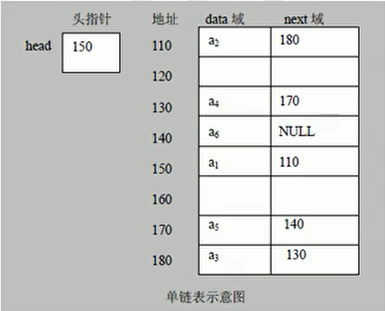

# 算法与数据结构


**线性结构**

线性结构作为最常用的数据结构，其特点时数据元素之间存在**一对一的线性关系**

线性结构有两种不同的存储结构，即**顺序存储和链式存储**结构。

顺序存储的线性表称为**顺序表**【存放的**地址连续**，比如说**数组**】，**顺序表中的存储元素是连续的**

链式存储的线性表称为**链表**【单链表，双向链表】，链表中的**存储元素不一定是连续的**，元素节点中存放数据元素以及相邻元素的地址信息。

线性结构常见的有：**数组、队列、链表和栈**

**非线性结构**

非线性结构包括：**二维数组**、多维数组、**广义表**、**树结构、图结构**


## 线性结构


### 数组

------


#### 稀疏数组

Sparse Array

当一个数组中大部分元素为0，或者为同一个值的数组时，可以使用稀疏数组来保存该数组


**稀疏数组的处理方式**

1. 记录数组一共有几行几列，有多少个不同的值
2. 把具有不同值的元素的行列及值记录在一个小规模的数组中，从而缩小程序的规模


**二维数组转稀疏数组**

1. 遍历原始二维数组，得到有效的数据个数s
2. 根据s就可以创建稀疏数组

```java
 int[] sparseArray = new int[s+1][3];
```

稀疏数组转二维数组

1. 先读取数组的第一行，根据第一行的数据，创建原始的二维数组

   ```java
    int[] Arr2 = int[sparseArray[0]][sparseArray[1]];
   ```

2. 再读取稀疏数组后几行数据，并赋值给原始的二维数组即可


### 链表

------


1. 链表是有序的列表。
2. 链表是以节点的方式来存储的（链式存储）
3. 每个节点包含data域【存储数据】，next域【指向下一个节点位置】
4. 链表的各个节点不一定是连续存储
5. 链表分带头结点和不带头节点的链表，根据实际需求来确定




#### 单链表


###### 实现思路


**添加（创建）**

1. 先创建一个head头节点。作用就是表示单链表的头
2. 后面每添加一个节点就直接加入到链表的最后

**遍历**

- 通过一个辅助遍历，帮助白能力整个链表


#### 双向链表


head节点：不存放具体的数据，作用就是表示链表头

next：指向下一个节点位置

pre：指向前一个节点位置


###### 实现思路

- 遍历的方式和单链表一致，可以向前也可以向后
- 添加，默认添加到双向链表的最后位置
  - 先找到双向链表最后的节点
  - temp.next = newNode
  - newNode.pre = temp
- 修改操作和单链表一致
- **删除**，因为是双向链表，因此可以实现自我删除某个节点
  - 直接找到要删除的节点【temp】
  - temp.pre.next = temp.next;
  - temp.next.pre = temp.pre;


**与单链表比较**

1. 单链表查找的方向只能是一个方向，而双向链表可以向前或者向后查找。
2. 单链表不能自我删除，需要靠辅助节点【总是需要 temp（待删除节点的前一个节点） 辅助】，双向链表可以自我删除。


##### 单项环形链表解决约瑟夫问题


###### 构建单向循环列表思路

1. 先创建第一个节点，让first指向该节点，并形成环形。
2. 之后当每创建一个新的节点，就把该节点加入到已有的环形链表中即可。


###### 出圈思路

1. 创建一个辅助指针temp，事先指向环形链表的最后一个节点。
2. 报数时，让first和temp同时移动m-1 次
3. 这就可以将first 指向的节点出圈，没有被指向的节点将会被回收
   1. first = first.next
   2. temp.netxt = first


**遍历环形链表**

先让一个辅助指针（变量）指向first节点。

然后通过一个while循环遍历该环形链表即可，当curNode.next == first即为结束。


### 队列

------


**队列是一个有序列表**，可以**使用的数组或是链表来实现**。

遵循**先进先出**的原则。即先入队的数据要先取出，后入队的数据后取出

**取数据是从队列的前部取，往队列中加入数据是往尾部加。**

因为队列的输出，输入是分别从队列的前后端来处理，因此需要两个变量front和rear分别记录队列前后端的下标。**front会随数据的输出而改变，而rear随数据的输入而改变。**


#### 数组实现


##### 数组模拟队列

###### 实现思路

**入队**

将尾指针往后移，即 rear+1，当 front==rear 时队列为空

添加前需要判断队列是否已满，若尾指针小于队列的最大小标maxSize-1，则将数据存入rear所指的数组位置中，否则【队满】无法存入数据，rear == maxSize - 1 【队满】

**出队**

出队之前需要判断队列是否为空，当 front==rear 时队列为空

front是指向队列头的前一个位置，front+1 即为出队的元素位置。


###### 存在问题与解决思路

1. 目前数组上元素位置使用过一次就无法在使用【即使是已出队有空位的时候也无法使用】，没有达到复用的效果。因为指针指向的位置【无法逆向】，出队的位置总是浪费。
2. 将队列改造成环形队列。方法：%【取模】


##### 数组模拟环形队列

###### 实现思路

1. front的含义调整：**front指向队列的第一个元素**，即array[front]就是队列的第一个元素。**front的初始值为0。**
2. rear的含义调整：**rear指向队列的最后一个元素的后一个位置**【因为希望空出一个空间做为约定】。**rear的初始值为0。**
3. 当队列满时，条件是 (rear+1) % maxSize == front 【队满】
4. 当队列为空时，条件是 rear == front
5. 队列中的有效数据个数 (rear + maxSize -front) % maxSize


### 栈

------


**栈是一个先入后出（FILO， First In Last Out）的有序列表**

栈是限制线性表中元素的插入和删除，只能在线性表的同一端进行的一种特殊线性表。允许插入和删除的一端，为变化的一段，称为**栈顶（Top）**，另一端为固定的一端，称为**栈底（Bottom）**。

根据栈的定义可知，最先放入栈中元素在栈底，最后放入栈的元素在栈顶，而删除元素刚好相反，最后放入的元素最先删除，最先放入的元素最后删除。


##### **实现栈的思路分析**

1. 使用一个数组来模拟栈
2. 定义一个变量top来表示栈顶，初始化为-1
3. **入栈**操作：当有数据加入到栈时，top++; stack[top] = data;
4. **出栈**操作：int value = stack[top]; top--;


##### **栈完成表达式计算思路分析**

1. 通过一个index索引来遍历表达式。
2. 如果遍历到位置的是数字，就直接入数字栈
3. 如果遍历到的位置是一个符号：
   1. 如果发现当前符号栈为空，就直接入栈
   2. 如果符号栈中有操作符，则进行比较，如果**当前的操作符的优先级小于或等于栈中的操作符**，就需要从数栈中pop出两个数字，再从符号栈中pop出一个符号，进行运算，将得到的结果入数栈，将当前的操作符入符号栈；如果**当前的操作符优先级大于栈中的操作符**，就直接入符号栈。
4. 当表达式扫描完毕，就顺序从数栈和符号栈中pop出相应的数和符号，并计算结果。
5. 最后在数栈中只有一个数字，即为表达式计算的结果。


##### **前、中、后缀表达式**


前缀

中缀 1 + ( ( 2 + 3 ) * 4 ) - 5

后缀 1 2 3 + 4 * + 5 -


##### **中缀表达式转后缀表达式**

1. 初始化两个栈，运算符栈s1和存储中间结果的栈s2
2. 从左至右扫描中缀表达式
3. 遇到操作数时，将其压入s2
4. 遇到运算符时，比较其与s1栈顶运算符的优先级
   1. 如果s1为空，或栈顶运算符为左括号 “ ( ” ，则直接入栈
   2. 若优先级比栈顶运算符高，直接入栈
   3. 若优先级比栈顶运算符低或相等，将s1的栈顶运算符弹出并压入s2，再次转到 ( 4 -1 )与新栈顶运算符比较
5. 遇到括号时
   1. 如果是左括号，直接压入s1
   2. 如果是右括号，则依次弹出s1栈顶的运算符，并压入s2，直到遇到左括号为止，此时将这一对括号丢弃
6. 重复步骤 2 - 5 ，直到表达式的最右边
7. 将s1中剩余的运算符依次弹出，并压入s2
8. 依次弹出s2中的元素并输出，结果的逆序即为中缀表达式对应的后缀表达式


```java
package com.rev.demo.datastructure.stack;

import java.util.ArrayList;
import java.util.List;
import java.util.Stack;

/**
 * 逆波兰表达式（后缀表达式）计算器
 *
 * @author gnl
 * @create 2020-05-20 16:36
 */

public class ReversePolandNotation {
    public static void main(String[] args) {
        // 定义逆波兰表达式
        // (3+4)*5-6 ==> 34+5*6-
        // 30+2*6-2 ==> 30 2 6 * + 2 -
        // 4*5-8+60+8/2 ==> 4 5 * 8 - 60 + 8 2 / +
//        String suffixExpression = "30 2 6 * + 2 -";
//        // 先将suffixExpression 放入 ArrayList 中
//        // 再使用 ArrayList 配合 Stack 完成计算
//        List<String> rpnList = getStringList(suffixExpression);
//        System.out.println(rpnList);
//
//        int res = cal(rpnList);
//        System.out.println(res);
        String str = "4 * 5 - 8 + 60 + 8 / 2";
        // 1 + ( ( 2 + 3 ) * 4 ) - 5
        // 1 2 3 + 4 * + 5 -
        System.out.println(infix2suffix(str));

    }

    public static List<String> getStringList(String expression){
        String[] split = expression.split(" ");
        List<String> list = new ArrayList<>();
        for (String s : split) {
            list.add(s);
        }
        return list;
    }

    /**
     * 完成对逆波兰表达式的计算
     * 从左到右扫描，将3 4 入栈，遇到+计算符，pop出3 4计算得到7，将7压入栈中
     * 将5入栈，遇到计算符*，pop出7，计算得到35，将35压入栈中
     * 将6入栈，遇到计算符-，pop出35，计算35-6，得到结果，将结果入栈
     */

    public static int cal( List<String> list ){

        Stack<String> stack = new Stack<>();
        //  4*5-8+60+8/2 ==> 4 5 * 8 - 60 + 8 2 / +
        for (String s : list) {
            // 使用正则判断是否是数字
            if (s.matches("^-?\\d+$")){
                stack.push(s);
            } else {
                // 匹配到的是字符
                int num1 = Integer.parseInt(stack.pop());
                int num2 = Integer.parseInt(stack.pop());
                int res = 0;
                switch (s){
                    case "+" :
                        res = num1 + num2;
                        break;
                    case "-" :
                        res = num2 - num1;
                        break;
                    case "*" :
                        res = num1 * num2;
                        break;
                    case "/" :
                        res = num2 / num1;
                        break;
                    default:
                        break;
                }
                stack.push("" + res);
            }
        }
        // 最后留在栈中的就是运算结果
        return Integer.parseInt(stack.pop());
    }

    // 中缀表达式转后缀
    public static List<String> infix2suffix(String str){

        String[] split = str.split(" ");
        ArrayList<String> infixList = new ArrayList<>();
        for (String s : split) {
            infixList.add(s);
        }
        System.out.println(infixList);
        // 符号栈
        Stack<String> s1 = new Stack<>();
        // 存储中间结果栈
        // Stack<String> s2 = new Stack<>();
        List<String> s2 = new ArrayList<>();

        int index = 0;
        for (String s : infixList) {
            // 如果是一个数
            if (s.matches("^-?\\d+$")){
                s2.add(s);
            } else if ("(".equals(s)){
                s1.push(s);
            } else if ( ")".equals(s) ) {
                // 若为右括号，依次弹出s1的运算符放入s2，直到遇到左括号
                while (!"(".equals(s1.peek())){
                    s2.add(s1.pop());
                }
                // 将左括号弹出，消除括号
                s1.pop();

            } else {
                // s1为空，或者栈顶为（，或运算符优先级大于栈顶运算符，直接压栈
                if ( s1.empty() || "(".equals(s) || priority(s) > priority(s1.peek()) ){
                    s1.push(s);
                } else {
                    // s1不为空，s的优先级小于等于s1的top
                    while ( !s1.empty() && priority(s) <= priority(s1.peek())){
                        s2.add(s1.pop());
                    }
                    s1.push(s);
                }
            }
        }

        while (s1.size() != 0){
            s2.add(s1.pop());
        }

        return s2;
    }

    public static int priority(String op){
        if ("*".equals(op) || "/".equals(op)){
            return 1;
        }
        if ( "+".equals(op) || "-".equals(op) ){
            return 0;
        }else {
            return -1;
        }
    }
}

```


### 递归

------


**递归需要遵守的重要规则**

1. 执行一次方法时，就会创建一个新的占空间
2. 方法的局部变量是独立的，不会相互影响
3. 如果方法中使用的是引用类型（例如数组），就会共享该引用类型的数据
4. 递归方法必须有出口，否则就会出现StackOverFlow异常
5. 当一个方法执行完毕，或者遇到return，就会返回，遵守谁调用就将结果返回给谁，同时当方法执行完毕或者返回时，该方法也就执行完毕


##### 回溯


**八皇后问题思路**

1. 第一个皇后先放第一行第一列

2. 第二个皇后放在第二行第一列、然后判断是否OK,如果不OK,继续放在第二列、第三列、依次把所有列都放完，找到一个合适
   
3. 继续第三个皇后，还是第一列、第二列……直到第8个皇后也能放在一个不冲突的位置，算是找到了一个正确解
   
4. 当得到一个正确解时，在栈回退到上一个栈时，就会开始回溯，即将第一个皇后，放到第一列的所有正确解，全部得到.
   
5. 然后回头继续第一个皇后放第二列，后面继续循环执行1,2,3,4的步骤

   

**说明**

​	理论上应该创建一个二维数组来表示棋盘，但是实际上可以通过算法，用一个一维数组即可解决问题

arr[8]={0,4,7,5,2,6,1,3}，对应arr下标表示第几行，即第几个皇后，arr[i]=val,val表示第i+1个皇后，放在第i+1行的第val+1列


|      |      |      |      |      |      |      | 1    |
|      |      |      |      |      |      | 1    |      |
|      |      |      |      |      | 1    |      |      |
|      |      |      |      | 1    |      |      |      |
|      |      |      | 1    |      |      |      |      |
|      |      | 1    |      |      |      |      |      |
|      | 1    |      |      |      |      |      |      |
| 1    |      |      |      |      |      |      |      |


### 排序算法

------


排序分类

**内部排序**

​	使用内存。指将需要处理的所有数据都加载到内部存储器中进行排序

1. 插入排序
   1. 直接插入排序
   2. 希尔排序
2. 选择排序
   1. 简单选择排序
   2. 堆排序
3. 交换排序
   1. 冒泡排序
   2. 快速排序
4. 归并排序
5. 基数排序（桶置法）


**外部排序**

​	使用内存和外存相结合。数据量过大，无法全部加载到内存中，需要借助外部存储进行排序。